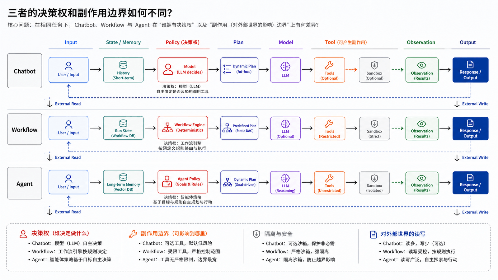
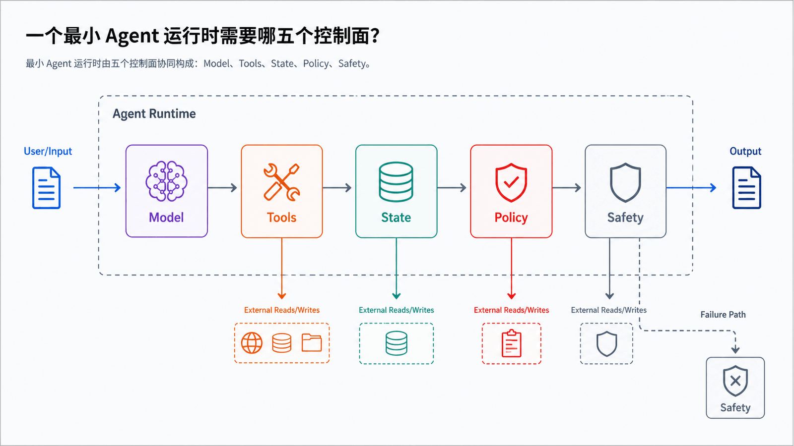
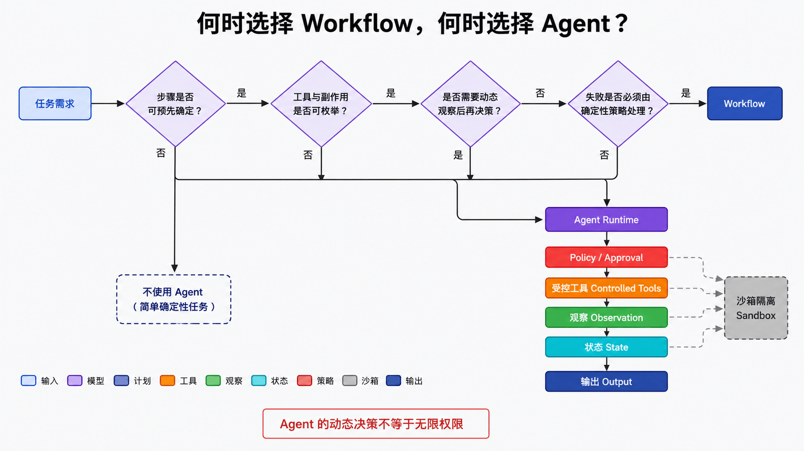
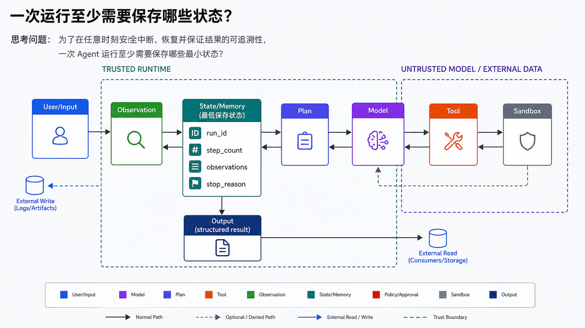
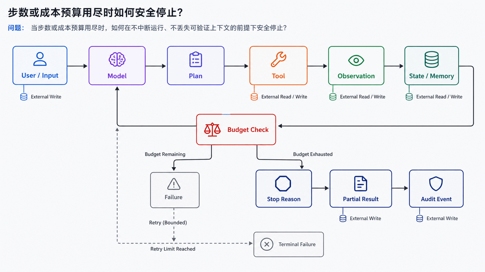
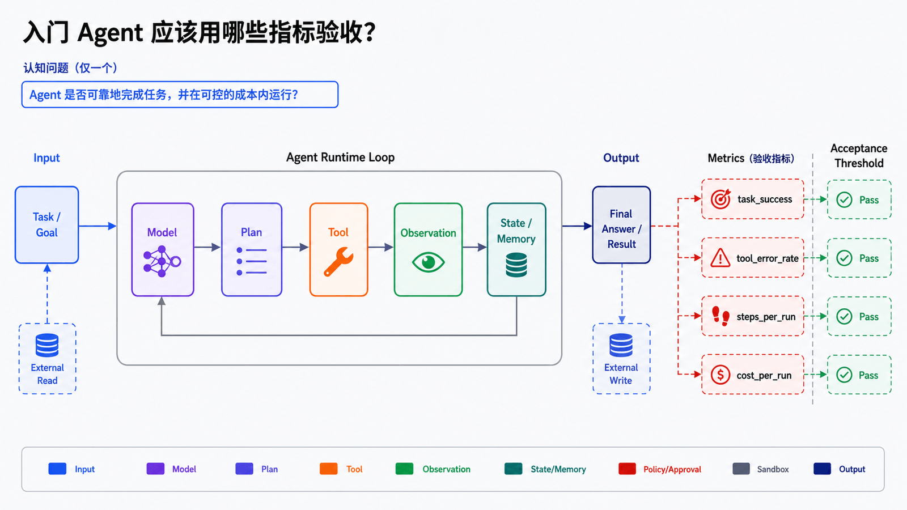
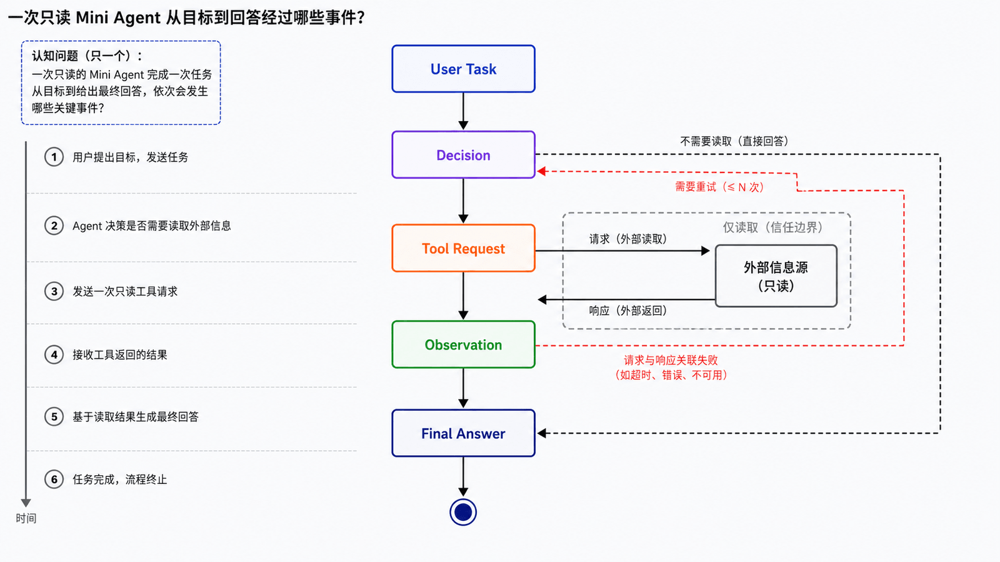

## 学习导航

**前置知识**：基础 Python、JSON、HTTP 与异步编程概念。

**适用读者**：首次系统学习生产级 Agent，并希望能独立实现、调试和评估的开发者。

**学习目标**：

- 分辨 Chatbot、Workflow 和 Agent
- 说清模型、工具、状态、策略与安全控制面
- 判断一个任务是否值得 Agent 化

**贯穿场景**：一个‘读取项目状态并生成摘要’的 Mini Agent：它可以查询文件，但不允许修改工作区。

> 本文中的产品特有事实以文末官方资料为准；通用架构建议会明确标为设计推导。

## 概述

AI Agent 是一种能够围绕目标持续感知上下文、调用工具、执行动作并根据反馈修正策略的智能系统。它不只是一次问答，而是一条运行链路：接收任务、组装上下文、推理计划、选择工具、执行动作、观察结果、继续迭代，直到达到终止条件。

从 OpenClaw 和 Hermes Agent 的设计可以看到，现代 Agent 正在从“带工具的聊天机器人”演进为“长期运行的个人执行环境”。OpenClaw 强调本地优先、Gateway、多通道入口和工作区文件；Hermes Agent 强调技能、记忆、工具集、终端后端、定时任务和多平台运行。

## Agent 与普通聊天机器人的区别



| 维度     | 普通聊天机器人   | AI Agent                                     |
| -------- | ---------------- | -------------------------------------------- |
| 目标     | 回答当前问题     | 完成一个可持续推进的任务                     |
| 上下文   | 主要依赖当前对话 | 结合记忆、文件、会话、工具结果               |
| 行动能力 | 通常只输出文本   | 可以调用 API、读写文件、执行命令、操作浏览器 |
| 过程     | 单轮或短对话     | 多轮循环、可暂停、可恢复                     |
| 风险     | 输出错误信息     | 可能错误执行真实动作，需要权限边界           |
| 评估     | 看回答是否正确   | 看任务结果、成本、时延、安全和可追溯性       |

可以把 Agent 理解为“模型 + 工具 + 状态 + 策略 + 安全边界”的组合。

## 核心组件



### 1. 模型

模型负责理解任务、生成计划、选择工具、解释观察结果和合成最终输出。能力越强的模型，越适合处理长任务、模糊需求和多步推理。但模型不是系统的全部，Agent 的可靠性更多取决于运行时如何约束模型。

### 2. 工具

工具让 Agent 能够连接外部世界，例如：

- 搜索网页
- 调用数据库
- 读写文件
- 执行 Shell 命令
- 操作浏览器
- 调用消息平台
- 创建日程或自动化任务

OpenAI Agents SDK 将工具、handoff、guardrails、session 和 tracing 作为核心能力；MCP 则把外部数据源、工具和提示封装为可复用协议接口。

### 3. 状态

状态包括当前任务进度、会话历史、短期工作记忆、长期记忆、文件上下文和工具返回结果。没有状态，Agent 就很难做长期任务；状态过多，又会带来上下文污染、隐私泄露和成本上涨。

### 4. 运行循环

典型 Agent Loop 如下：

```text
用户目标
  ↓
上下文装配
  ↓
模型推理
  ↓
选择工具
  ↓
执行动作
  ↓
观察结果
  ↓
继续、修正或结束
```

OpenClaw 的 Agent Loop 文档把一次真实运行描述为从 intake、context assembly、model inference、tool execution、streaming replies 到 persistence 的完整路径。这个定义很适合作为个人 Agent 的基本运行模型。

### 5. 安全边界

一旦 Agent 能够执行命令、访问文件、使用浏览器和发送消息，安全边界就变成架构核心，而不是附加功能。常见边界包括：

- 工具白名单
- 操作审批
- 沙箱执行
- 只读工作区
- 最小权限凭据
- 网络访问限制
- 日志和审计
- 高风险命令扫描

Hermes Agent 的安全文档强调 command approval、container isolation、messaging authorization 等多层防护；OpenClaw 则将 Gateway、工作区、沙箱和远程访问配置作为主要安全面。

## OpenClaw 带来的启发

OpenClaw 更像一个“个人 Agent 操作系统入口”。它的重点不是只在终端里完成一次任务，而是让用户通过 Telegram、WhatsApp、Discord、Slack、iMessage 等通道触发同一个本地 Gateway。

它的设计启发包括：

- 多通道入口可以降低使用门槛。
- Gateway 应成为会话、路由、认证和通道连接的控制平面。
- 工作区文件可以承载身份、人格、工具约定、长期记忆和启动流程。
- 本地优先能降低隐私风险，但不等于天然安全，仍要有绑定地址、认证、沙箱和权限配置。

## Hermes Agent 带来的启发

Hermes Agent 更像一个“会学习的终端型 Agent”。它强调技能系统和持久记忆：当 Agent 完成复杂任务、被用户纠正、发现可复用流程时，可以把经验沉淀成 skill。

它的设计启发包括：

- 技能是过程记忆，比单纯聊天历史更可复用。
- 记忆需要边界和容量控制，不能无限塞入系统提示。
- 工具集应该按平台启用或禁用，而不是所有能力默认暴露。
- 定时任务、消息投递、子代理和多平台 Gateway 是 Agent 从“助手”到“自动化执行者”的关键跃迁。

## 能力边界



Agent 并不意味着完全自治。真实系统中应该明确以下边界：

| 边界     | 应该明确的问题                                  |
| -------- | ----------------------------------------------- |
| 权限边界 | 哪些文件、命令、API 可以访问                    |
| 决策边界 | 哪些动作必须用户确认                            |
| 时间边界 | 任务最多执行多久，是否允许后台继续              |
| 成本边界 | 最大 token、最大工具调用次数、最大外部 API 成本 |
| 记忆边界 | 什么可以长期保存，什么必须遗忘                  |
| 交付边界 | 最终产物是什么，如何验证完成                    |

## 实践建议

构建自己的 Agent 系统时，可以按以下路线推进：

1. 先做单任务 Agent：明确输入、工具、输出和校验。
2. 再做可恢复会话：保存任务状态和工具结果。
3. 增加工具审批：先保护 Shell、文件写入、消息发送和支付类操作。
4. 引入记忆：只保存稳定事实、偏好和经过验证的经验。
5. 抽象技能：把重复流程写成可加载的 skill。
6. 扩展通道：从终端扩展到聊天平台、Webhook、Cron。
7. 建立评估：用任务成功率、人工介入次数、成本、回滚次数衡量效果。

## 工程补全：Agent 边界与最小系统



### 接口与数据契约

- 输入包含用户目标、允许的工具集和预算
- 运行时状态至少记录 run_id、step_count、observations 和 stop_reason
- 每个副作用由确定性运行时执行，而不是由模型文本直接触发

### 失败路径、终止与恢复



- 目标含糊时请求澄清，不盲目执行
- 超过步数或成本预算时以可解释的 stop_reason 终止
- 工具不可用时降级为只读回答或人工处理

### 可观测性与验收



不要只保留最终回答。每次运行应该能通过 **run_id** 关联输入、决策、工具请求、工具结果、状态变更和终止原因。本篇至少跟踪：

- `task_success`
- `tool_error_rate`
- `steps_per_run`
- `cost_per_run`
- `unsafe_action_blocked`

## 常见误区

- Agent 不等于‘大模型加一段长 Prompt’
- 能调用工具不代表应该获得所有权限
- 可自主选择步骤不等于可以无限运行

## 自检题

1. 什么情况下确定性 Workflow 比 Agent 更合适？
2. 模型输出工具调用后，为什么还需要运行时校验？
3. 一次 Agent 运行最少应保留哪些可观测事件？

<details>
<summary>查看答案</summary>

1. 步骤可预先枚举、结果需严格确定、不需要运行时决策时。
2. 模型只能提议参数；运行时还要做 Schema、权限、审批和副作用校验。
3. run_started、decision、tool_requested、tool_completed/tool_failed 以及 run_stopped。

</details>

## 实操：先做一个能跑的 Mini Agent



先不要急着接大模型。OpenClaw 和 Hermes 的源码都把 Agent 拆成“运行时 + 工具 + 工作区 + 记忆/技能”，所以我们也先用最小代码跑通这个骨架。

创建 `mini_agent.py`：

```python
from pathlib import Path
import sys

WORKSPACE = Path("workspace")
WORKSPACE.mkdir(exist_ok=True)

def list_files(_: str) -> str:
    return "\n".join(str(p) for p in WORKSPACE.rglob("*") if p.is_file()) or "workspace is empty"

def write_note(text: str) -> str:
    path = WORKSPACE / "note.md"
    path.write_text(text, encoding="utf-8")
    return f"wrote {path}"

TOOLS = {
    "list_files": list_files,
    "write_note": write_note,
}

def decide(user_input: str) -> tuple[str, str]:
    if "列文件" in user_input or "list" in user_input.lower():
        return "list_files", ""
    if "记录" in user_input or "note" in user_input.lower():
        return "write_note", user_input
    return "write_note", f"待处理任务：{user_input}"

def run(user_input: str) -> str:
    tool_name, args = decide(user_input)
    print(f"[plan] call tool: {tool_name}")
    result = TOOLS[tool_name](args)
    return f"[result] {result}"

if __name__ == "__main__":
    print(run(" ".join(sys.argv[1:]) or "记录：学习 Agent Loop"))
```

运行：

```bash
python mini_agent.py "记录：先把工具、状态、审批做出来"
python mini_agent.py "列文件"
```

这个例子故意不用 LLM，因为它要先让你看到 Agent 的骨架：

- `decide()` 是模型决策层的替身。
- `TOOLS` 是 Hermes `tools/registry.py` 里中心化工具注册思想的极简版本。
- `WORKSPACE` 是 OpenClaw workspace 思想的极简版本。
- `run()` 就是最小 Agent Loop。

下一步才是把 `decide()` 换成真实模型的 function calling，让模型输出 `{ "tool": "...", "args": "..." }`。

## 小结

AI Agent 的本质不是“让模型自己随便做事”，而是为模型提供一个可控的执行环境。OpenClaw 展示了个人 Agent 如何通过 Gateway、通道和工作区长期运行；Hermes Agent 展示了技能、记忆和工具集如何让 Agent 逐步贴合用户环境。把两者结合起来，可以得到一条务实路线：先可控，再可用，最后才追求更强自治。

## 下一篇

02-Agent Loop：把这些组件串成一个可终止、可审计的运行闭环。

## 资料来源与版本基线

- [OpenClaw Documentation](https://docs.openclaw.ai/)
- [OpenClaw Agent Loop](https://docs.openclaw.ai/agent)
- [OpenClaw Agent workspace](https://docs.openclaw.ai/concepts/agent-workspace)
- [Hermes Agent Docs](https://hermes-agent.nousresearch.com/docs/)
- [Hermes Agent Tools & Toolsets](https://hermes-agent.nousresearch.com/docs/user-guide/features/tools/)
- [Hermes Agent Tool Registry Source](https://github.com/NousResearch/hermes-agent/blob/main/tools/registry.py)
- [OpenAI Agents SDK](https://openai.github.io/openai-agents-python/)
- [Model Context Protocol](https://modelcontextprotocol.io/docs/getting-started/intro)
