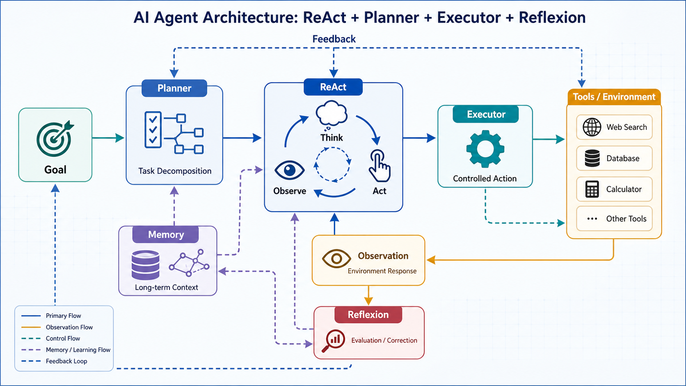

# 从零构建 Agent：ReAct、Planner、Executor、Reflexion 全景学习指南

> 目标：理解现代 Agent 的核心工作原理，并能够从零实现一个具备规划、执行、反思能力的 Agent 系统。

---

## Agent 的定义

很多人刚接触 Agent 时容易误解：

```text
Agent = LLM + Tool
```

实际上这只是最初级的形态。

更准确地说：

```text
Agent = LLM + Reasoning + Planning + Acting + Reflection + Memory
```

现代 Agent 的核心能力包括：

| 能力         | 作用   |
| ---------- | ---- |
| Reasoning  | 思考   |
| Planning   | 规划   |
| Acting     | 调用工具 |
| Reflection | 自我纠错 |
| Memory     | 记忆   |
| Scheduling | 任务调度 |



---

## Agent 演进路线

Agent 发展大致经历了几个阶段：

```text
LLM
 ↓
Tool Calling
 ↓
ReAct
 ↓
Plan & Execute
 ↓
Reflexion
 ↓
Multi-Agent
 ↓
Agentic Workflow
```

对应代表项目：

| 阶段           | 代表项目                 |
| ------------ | -------------------- |
| Tool Calling | GPT Function Calling |
| ReAct        | ReAct Paper          |
| Planner      | LangGraph            |
| Multi-Agent  | CrewAI               |
| Reflection   | Reflexion            |
| Workflow     | OpenManus            |

---

## ReAct Agent

## 什么是 ReAct

ReAct 来自 Google 的经典论文：

```text
Reason + Act
```

核心思想：

```text
思考
 ↓
行动
 ↓
观察
 ↓
继续思考
```

循环直到问题解决。

---

## ReAct 工作流程

```text
Question
   ↓
Thought
   ↓
Action
   ↓
Observation
   ↓
Thought
   ↓
Action
   ↓
Observation
   ↓
Final Answer
```

例如：

```text
用户：
今天东京天气怎么样？
```

Agent：

```text
Thought:
需要实时信息

Action:
search

Action Input:
东京天气
```

工具返回：

```text
Observation:
25°C，多云
```

继续推理：

```text
Thought:
已经获得答案

Final Answer:
东京今天25°C，多云
```

---

## ReAct Agent 核心结构

```python
class ReActAgent:
    """最小可运行的 ReAct Agent 骨架：Thought → Action → Observation 循环。"""

    def __init__(self, tools: dict, max_steps: int = 5) -> None:
        self.tools = tools
        self.max_steps = max_steps

    def run(self, question: str) -> str:
        history = [f"问题：{question}"]
        for _ in range(self.max_steps):
            thought = self._think(history)
            history.append(f"思考：{thought}")
            if "Final Answer" in thought:
                return thought
            action, arg = self._parse_action(thought)
            if action not in self.tools:
                return f"未知工具：{action}"
            observation = self.tools[action](arg)
            history.append(f"观察：{observation}")
        return "达到最大步数，任务未完成"

    def _think(self, history: list) -> str:
        # 真实实现中调用 LLM，这里给出可替换的占位逻辑
        return "Final Answer: " + history[0].replace("问题：", "")

    def _parse_action(self, thought: str) -> tuple[str, str]:
        # 真实实现中解析模型输出的 Action / Action Input
        return "echo", thought
```

主要包含：

```text
Prompt构建
 ↓
LLM推理
 ↓
解析Action
 ↓
执行Tool
 ↓
Observation
 ↓
再次推理
```

---

## 为什么模型知道调用工具？

例如：

```text
问题：
今天上海天气如何？
```

Prompt：

```text
工具：

search
calculator
```

模型会推理：

```text
天气属于实时信息
↓
自身知识不足
↓
需要工具
↓
search
```

注意：

模型并不是执行代码判断。

而是在预测：

```text
最合理的下一段文本
```

即：

```text
Action: search
```

---

## Planner 任务规划器

随着任务复杂度提升：

```text
分析RAG系统性能并与Fine-tuning比较
```

单纯 ReAct 开始失效。

因为：

```text
任务太大
上下文太长
推理链容易丢失
```

于是引入：

```text
Planner
```

---

## Planner 工作流程

```text
用户目标
    ↓
Planner
    ↓
Task List
```

例如：

```text
分析RAG系统性能并与Fine-tuning比较
```

被拆成：

```json
[
  {
    "id":1,
    "description":"收集RAG性能指标",
    "tool":"search"
  },
  {
    "id":2,
    "description":"收集Fine-tuning性能指标",
    "tool":"search"
  },
  {
    "id":3,
    "description":"进行对比分析",
    "tool":"llm",
    "depends_on":[1,2]
  }
]
```

---

## DAG 任务依赖图

Planner 输出的不只是任务列表。

本质上输出的是：

```text
DAG
Directed Acyclic Graph
有向无环图
```

例如：

```text
Task1
   \
    \
     → Task3
    /
   /
Task2
```

表示：

```text
Task3
依赖
Task1 和 Task2
```

必须等待：

```text
Task1完成
Task2完成
```

才能执行：

```text
Task3
```

---

## DAG 的优势

支持：

```text
并行执行
依赖管理
复杂任务拆解
```

例如：

```text
收集RAG资料
收集FT资料
```

可以同时执行。

---

## Execution Engine 执行引擎

Planner 负责：

```text
想
```

Executor 负责：

```text
做
```

---

## 架构

```text
Planner
   ↓
Task DAG
   ↓
Execution Engine
   ↓
Tool
```

---

## 工作流程

```text
Task
 ↓
选择Tool
 ↓
执行Tool
 ↓
记录结果
 ↓
更新Context
```

例如：

```text
{
  "id":1,
  "tool":"search",
  "description":"搜索RAG性能指标"
}
```

执行：

```text
search("搜索RAG性能指标")
```

结果：

```text
{
  "latency":200,
  "accuracy":87
}
```

写入：

```text
context["task_1_result"]
```

---

## Context 上下文共享

Agent 里的 Context 极其重要。

例如：

```text
Task1:
获取RAG性能

Task2:
获取FT性能

Task3:
进行比较
```

Task3 必须能够访问：

```text
task_1_result
task_2_result
```

否则无法完成分析。

因此：

```text
Context
=
任务共享内存
```

---

## 拓扑排序

执行 DAG 时必须确定顺序。

例如：

```text
1
 \
  \
   → 3
  /
 /
2
```

正确顺序：

```text
1
2
3
```

算法：

```text
Topological Sort
```

---

## 必须检测循环依赖

错误案例：

```text
1 → 2
↑   ↓
└───┘
```

会导致：

```text
while True
```

死循环。

因此必须：

```text
if not progress:
    raise Exception("Cycle Detected")
```

---

## Reflexion 反思机制

Reflexion 是近几年 Agent 最重要的方向之一。

核心思想：

```text
执行
 ↓
反思
 ↓
改进
 ↓
再次执行
```

---

## Reflexion 流程

```text
Task
 ↓
Execute
 ↓
Result
 ↓
Reflect
 ↓
Improve
 ↓
Execute Again
```

---

## 示例

第一次回答：

```text
RAG更好
```

反思：

```text
问题：
没有分析成本
没有分析延迟
```

改进：

```text
补充成本和延迟比较
```

第二次回答：

```text
RAG
优点...
缺点...

Fine-tuning
优点...
缺点...

成本比较...
延迟比较...
```

结果明显更好。

---

## Reflection Memory

真正的 Reflexion 论文最核心的部分：

不是 Reflection。

而是：

```text
Verbal Reinforcement
```

即：

```text
自然语言经验记忆
```

例如：

```text
上一次失败：

没有比较Latency
```

保存下来：

```text
memory.append(
    "比较方案时必须包含Latency"
)
```

下一次执行：

```text
任务
+
历史经验
```

模型会自动避免犯同样错误。

---

## Judge Agent 裁判 Agent

很多系统存在：

```text
自己评自己
```

问题。

例如：

```text
回答错误
```

模型却给自己：

```json
{
  "score":9
}
```

---

因此现代架构：

```text
Worker
   ↓
Critic
   ↓
Judge
```

例如：

```text
GPT-4o
 ↓
Claude
 ↓
GPT-4o
```

交叉评审。

---

## 完整 Agent 架构

把前面的组件组合起来：

```text
User Goal
    │
    ▼
Planner
(TaskDecomposer)
    │
    ▼
Task DAG
    │
    ▼
Scheduler
    │
    ▼
Execution Engine
    │
    ▼
Tool Calls
    │
    ▼
Task Results
    │
    ▼
Reflection Agent
    │
    ▼
Memory
    │
    ▼
RePlanner
    │
    ▼
Judge Agent
    │
    ▼
Final Answer
```

---

## 与主流 Agent 框架的对应关系

| 组件          | LangGraph | CrewAI | AutoGen | OpenManus |
| ----------- | --------- | ------ | ------- | --------- |
| ReAct       | ✅         | ✅      | ✅       | ✅         |
| Planner     | ✅         | ✅      | ✅       | ✅         |
| DAG         | ✅         | ❌      | 部分      | ✅         |
| Executor    | ✅         | ✅      | ✅       | ✅         |
| Reflection  | ✅         | ✅      | 部分      | ✅         |
| Memory      | ✅         | ✅      | ✅       | ✅         |
| Multi-Agent | 部分        | ✅      | ✅       | ✅         |

---

## Agent 的四层核心抽象

如果把所有 Agent 项目拆到最底层，本质都可以归纳为四层：

```text
Layer1
Reasoning
（怎么思考）

ReAct
```

↓

```text
Layer2
Planning
（怎么拆任务）

Planner
```

↓

```text
Layer3
Acting
（怎么执行）

Executor
```

↓

```text
Layer4
Reflection
（怎么纠错）

Reflexion
```

---

## 学习 Agent 源码的最佳路线

建议按照下面顺序学习：

```text
Step1
理解 Prompt + Tool Calling
```

↓

```text
Step2
手写 ReAct Agent
```

↓

```text
Step3
实现 Planner
```

↓

```text
Step4
实现 DAG Scheduler
```

↓

```text
Step5
实现 Executor
```

↓

```text
Step6
实现 Reflexion
```

↓

```text
Step7
实现 Memory
```

↓

```text
Step8
实现 Multi-Agent
```

---

## 最终总结

现代 Agent 本质上是在模拟人类完成复杂工作的过程：

```text
接收目标
    ↓
制定计划
    ↓
拆解任务
    ↓
调用工具
    ↓
执行任务
    ↓
检查结果
    ↓
总结经验
    ↓
继续优化
```

对应到 Agent 系统：

```text
Goal
 ↓
Planner
 ↓
Task DAG
 ↓
Executor
 ↓
Tools
 ↓
Reflection
 ↓
Memory
 ↓
Judge
 ↓
Final Answer
```

理解了这条链路，再去阅读 LangGraph、CrewAI、AutoGen、OpenManus 等开源项目时，就不会陷入代码细节，而是能够从顶层架构一路向下，像“庖丁解牛”一样快速看透整个 Agent 系统。
