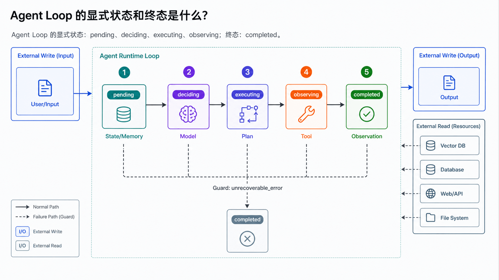
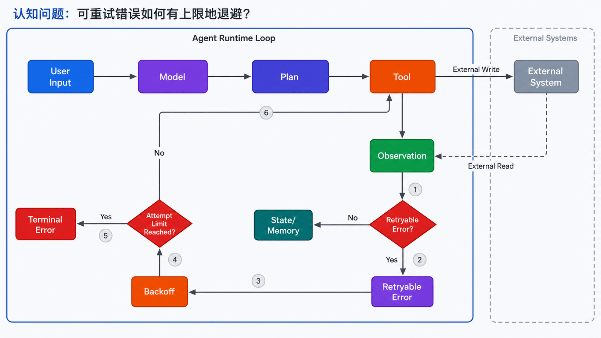
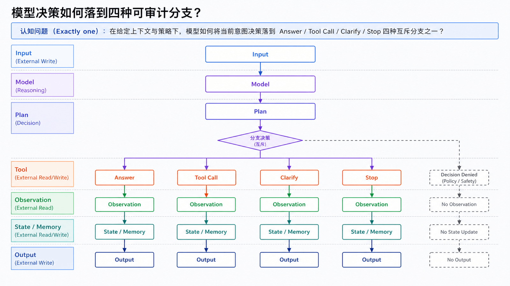
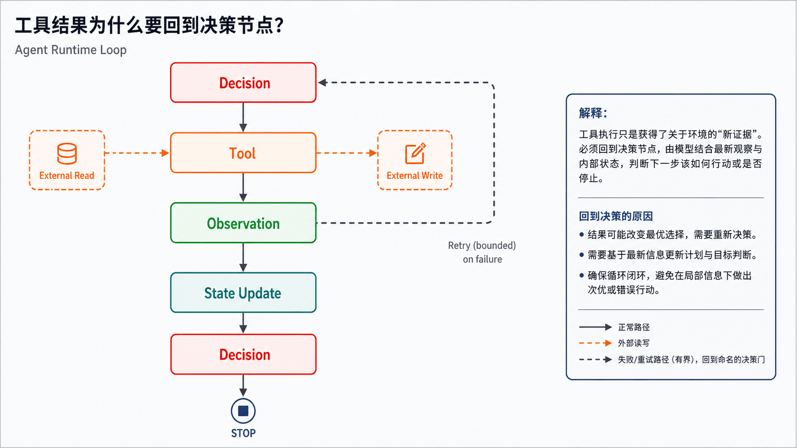
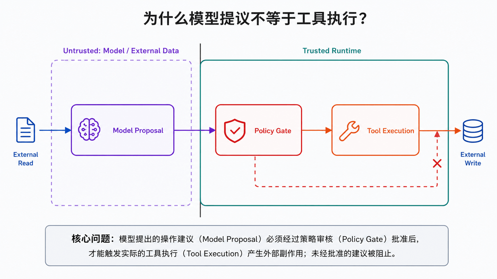
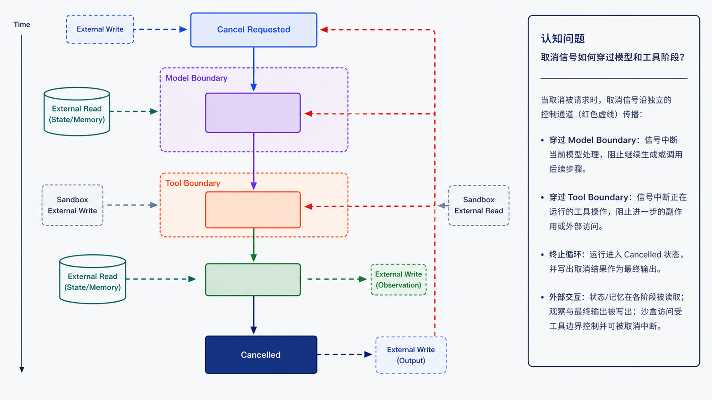
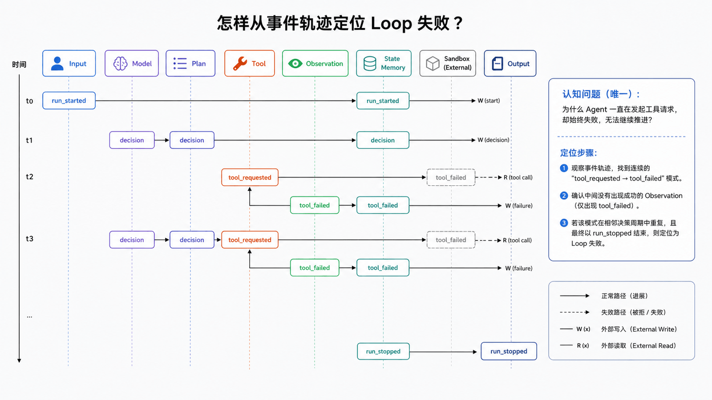

## 学习导航

**前置知识**：基础 Python、JSON、HTTP 与异步编程概念。

**适用读者**：首次系统学习生产级 Agent，并希望能独立实现、调试和评估的开发者。

**学习目标**：

- 用显式状态机表达 Agent Loop
- 设计步数、时间、成本和取消终止条件
- 从事件轨迹定位失败步骤

**贯穿场景**：Mini Agent 需要先检查项目状态，再决定是直接回答、调用工具还是请求澄清。

> 本文中的产品特有事实以文末官方资料为准；通用架构建议会明确标为设计推导。

## 概述

Agent Loop 是 Agent 的核心运行闭环。它把用户输入变成一连串可追踪的系统行为：加载上下文、调用模型、执行工具、写入状态、返回结果。如果没有清晰的 loop，Agent 很容易变成“模型随口说要做什么，但系统不知道它做到了哪里”。

OpenClaw 文档把 Agent Loop 定义为一次真实运行的权威路径：intake、context assembly、model inference、tool execution、streaming replies、persistence。这个拆解可以作为理解大多数 Agent Runtime 的基础。

## 基础流程



```text
消息进入
  ↓
路由到会话
  ↓
准备工作区和上下文
  ↓
组装系统提示
  ↓
模型推理
  ↓
工具调用
  ↓
工具结果写入上下文
  ↓
继续推理或结束
  ↓
流式回复与持久化
```

这条链路里最关键的不是“模型说了什么”，而是每一步是否可恢复、可审计、可控制。

## 阶段一：消息进入

消息可能来自终端、Web UI、Telegram、Discord、Slack、邮件、Webhook 或 Cron。入口层要做三件事：

- 识别用户和通道
- 校验认证与授权
- 把不同平台的消息标准化

OpenClaw 的 Gateway 负责管理通道、节点、会话和 Hook。Hermes Agent 的 Gateway 也支持多种消息平台，并把同一个 Agent 暴露到终端和聊天平台。

## 阶段二：会话与工作区准备

Agent 需要知道当前任务属于哪个会话、哪个用户、哪个项目、哪个工作区。典型准备动作包括：

- 创建或恢复 session
- 锁定当前 session，避免并发写入互相覆盖
- 解析工作区目录
- 加载项目规则文件
- 加载用户偏好和长期记忆
- 计算可用工具集

OpenClaw 的 Agent workspace 使用 `AGENTS.md`、`SOUL.md`、`USER.md`、`TOOLS.md`、`MEMORY.md`、`skills/` 等文件组织上下文。Hermes Agent 则把持久记忆放在 `MEMORY.md` 和 `USER.md`，并在会话开始时注入快照。

## 阶段三：提示组装



提示组装不是简单拼接字符串，而是将系统规则、用户目标、工具列表、记忆、项目上下文和安全策略压缩成模型可执行的指令。

一个稳定的提示结构通常包含：

```text
系统角色
安全规则
当前任务
可用工具
工作区上下文
用户偏好
历史摘要
输出约束
```

这里要避免两个问题：

- 上下文过载：把所有历史塞给模型会增加成本，并降低注意力。
- 上下文污染：未验证的网页、工具结果或第三方文件可能带有提示注入。

## 阶段四：模型推理



模型根据上下文决定下一步动作。常见动作包括：

- 直接回答
- 请求澄清
- 调用一个工具
- 生成计划
- 委派给子代理
- 暂停等待用户确认

在工程实现里，不应该让模型直接“执行”。模型只应该输出结构化的意图，由运行时检查权限、参数和风险后再执行。

## 阶段五：工具执行

工具执行是 Agent Loop 最容易出问题的地方。一个工具调用至少需要记录：

- 工具名
- 参数
- 调用时间
- 调用方会话
- 运行环境
- 返回值
- 错误信息
- 是否经过审批

OpenClaw 的 Agent Loop 会发出 tool stream 事件，并在持久化前清理工具结果的大小和图片负载。Hermes Agent 则用 toolsets 管理能力，例如 `terminal`、`file`、`browser`、`memory`、`cronjob`、`delegation` 等。

## 阶段六：观察与继续



工具结果返回后，Agent 需要判断任务是否完成：

```text
if 工具失败:
    分析失败原因
    尝试修复或请求用户介入
elif 结果不足:
    调用下一个工具
elif 达到目标:
    生成最终答复
else:
    更新计划继续执行
```

这里的关键是避免无限循环。系统需要配置最大迭代次数、最大时长、最大失败次数和最大成本。

## 阶段七：压缩与重试




长任务会不断积累上下文。没有压缩，Agent 很快会撞到上下文窗口；压缩不当，又可能丢掉关键决策依据。

合理的压缩策略包括：

- 保留用户目标和约束
- 保留已完成步骤
- 保留失败原因和修复尝试
- 保留关键工具结果摘要
- 丢弃重复日志和中间噪声

OpenClaw 的 Agent Loop 包含 compaction 和 retry 机制，重试时会重置内存缓冲和工具摘要，避免重复输出。

## 阶段八：回复与持久化

最终回复不只是模型输出文本，还要整理：

- 最终结果
- 做过的动作
- 未完成事项
- 风险提示
- 产物路径
- 后续建议

同时，系统应该把会话、工具调用、错误、成本、关键状态写入持久层，方便恢复、审计和评估。

## Loop 的工程检查表

| 检查项     | 说明                                   |
| ---------- | -------------------------------------- |
| 会话隔离   | 不同用户、项目、代理之间状态不能串     |
| 工具审批   | 高风险工具必须有人类确认               |
| 状态持久化 | 任务中断后可以恢复                     |
| 事件流     | 前端或聊天平台能看到执行进度           |
| 错误重试   | 模型失败、工具失败和网络失败要区别处理 |
| 上下文压缩 | 长任务能持续运行                       |
| 最终摘要   | 用户能理解 Agent 做了什么              |

## 工程补全：显式状态机与终止语义

### 接口与数据契约

- pending → deciding → executing → observing → deciding/completed
- 每次转移写入 event_type、step、elapsed_ms 和 correlation_id
- stop_reason 使用 completed、needs_input、max_steps、budget_exceeded、cancelled 或 error

### 失败路径、终止与恢复



- 只对明确的瞬时错误重试，并使用有上限的退避
- 压缩上下文时保留工具结果来源和未完成任务
- 取消信号在模型调用前后及工具执行期间都要检查

### 可观测性与验收



不要只保留最终回答。每次运行应该能通过 **run_id** 关联输入、决策、工具请求、工具结果、状态变更和终止原因。本篇至少跟踪：

- `run_duration`
- `step_count`
- `retry_count`
- `context_size`
- `stop_reason_distribution`

## 常见误区

- 循环不应依靠模型‘自觉停止’
- 重试不能修复无效参数或权限拒绝
- 压缩不是删除所有历史

## 自检题

1. 为什么 stop_reason 应该是显式枚举？
2. 哪些错误不应重试？
3. 工具返回后为什么要回到 deciding 而不是直接结束？

<details>
<summary>查看答案</summary>

1. 便于测试、统计和区分成功、等待输入与安全终止。
2. Schema 错误、永久权限拒绝、已确认的业务冲突。
3. 运行时需要让模型基于 Observation 判断目标是否完成或需要下一步。

</details>

## 实操：写一个带状态文件的 Agent Loop

下面这个例子模拟 OpenClaw Agent Loop 的几个关键阶段：intake、context assembly、tool execution、persistence。它没有接模型，但已经具备“任务可恢复”的形状。

创建 `loop_agent.py`：

```python
from dataclasses import dataclass, asdict
from pathlib import Path
import json
import sys
import time

STATE_FILE = Path("agent_state.json")

@dataclass
class AgentState:
    goal: str
    steps: list[str]
    observations: list[str]
    done: bool = False

def load_state(goal: str) -> AgentState:
    if STATE_FILE.exists():
        data = json.loads(STATE_FILE.read_text(encoding="utf-8"))
        if data["goal"] == goal and not data["done"]:
            return AgentState(**data)
    return AgentState(goal=goal, steps=[], observations=[])

def save_state(state: AgentState) -> None:
    STATE_FILE.write_text(
        json.dumps(asdict(state), ensure_ascii=False, indent=2),
        encoding="utf-8",
    )

def choose_next_step(state: AgentState) -> str:
    if not state.steps:
        return "读取需求并生成计划"
    if len(state.steps) == 1:
        return "执行一个可验证动作"
    return "总结结果并结束"

def execute(step: str, goal: str) -> str:
    if "计划" in step:
        return f"计划：把「{goal}」拆成查询、执行、验证三步"
    if "执行" in step:
        return "执行：这里可以替换为真实工具调用，例如搜索、读文件、运行测试"
    return "总结：任务已完成"

def run(goal: str) -> AgentState:
    state = load_state(goal)
    while not state.done:
        step = choose_next_step(state)
        print(f"[step] {step}")
        observation = execute(step, state.goal)
        state.steps.append(step)
        state.observations.append(observation)
        state.done = step.startswith("总结")
        save_state(state)
        time.sleep(0.2)
    return state

if __name__ == "__main__":
    result = run(" ".join(sys.argv[1:]) or "整理今天的技术资料")
    print(json.dumps(asdict(result), ensure_ascii=False, indent=2))
```

运行：

```bash
python loop_agent.py "写一篇 Agent Loop 笔记"
```

真正接入 LLM 时，只需要替换两处：

- `choose_next_step()`：由模型根据状态决定下一步。
- `execute()`：根据模型选择调用具体工具。

Hermes 的 `tools/registry.py` 里有一个很实用的点：工具异常统一返回 JSON 错误，而不是让异常击穿主循环。你的 Agent Loop 也应该这样处理。

## OpenClaw 与 Hermes 的对照

| 维度     | OpenClaw                                    | Hermes Agent                                     |
| -------- | ------------------------------------------- | ------------------------------------------------ |
| 入口     | Gateway 连接多聊天通道、Web UI、节点        | CLI、IDE、Gateway、多消息平台                    |
| 工作区   | 以 workspace 文件组织身份、规则、记忆、技能 | 以配置、skills、memory、sessions 组织能力        |
| 工具控制 | Gateway、插件 Hook、沙箱、工具策略          | toolsets、终端后端、审批、安全扫描               |
| 长任务   | Heartbeat、hooks、Gateway 事件              | cronjob、delegation、kanban、sessions            |
| 经验沉淀 | workspace skills、memory 文件               | agent-managed skills、curator、persistent memory |

## 小结

Agent Loop 是 Agent 系统的“心跳”。它决定了一个 Agent 是否只是能聊天，还是能稳定地完成任务。设计 Agent 时，先把 loop 的边界、状态、工具、错误和持久化想清楚，再讨论更高级的多代理协作和长期自治，会少走很多弯路。

## 下一篇

03-工具调用：详细展开 Loop 中最危险的边界跨越。

## 资料来源与版本基线

- [OpenClaw Agent Loop](https://docs.openclaw.ai/agent)
- [OpenClaw Gateway Runbook](https://docs.openclaw.ai/gateway)
- [Hermes Agent Tools & Toolsets](https://hermes-agent.nousresearch.com/docs/user-guide/features/tools/)
- [Hermes Agent Persistent Memory](https://hermes-agent.nousresearch.com/docs/user-guide/features/memory/)
- [Hermes Agent Tool Registry Source](https://github.com/NousResearch/hermes-agent/blob/main/tools/registry.py)
- [OpenAI Agents SDK](https://openai.github.io/openai-agents-python/)
