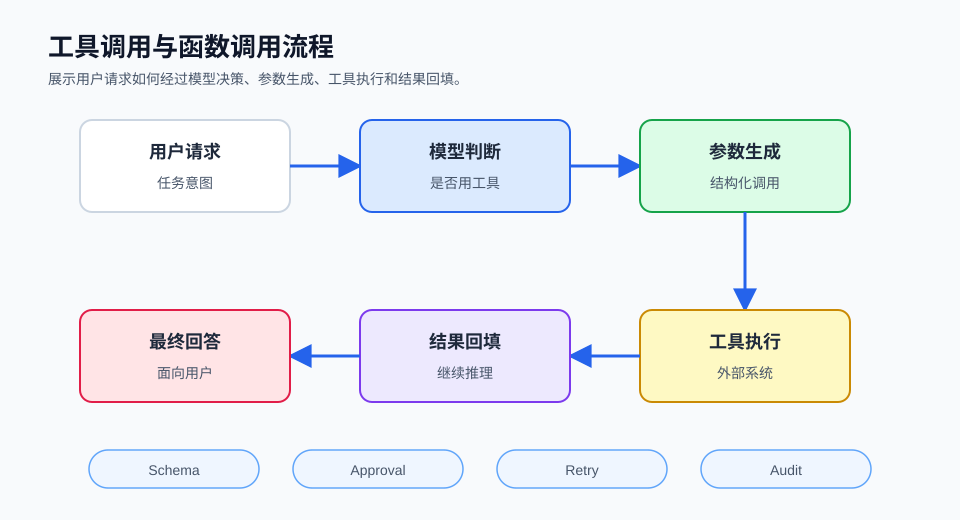

## 概述

工具调用是 Agent 从“会说”走向“会做”的关键。模型负责判断需要什么能力，运行时负责把工具以安全、结构化、可审计的方式暴露出来。

如果把 Agent 看成一个系统，模型是推理层，工具是执行层，工具调用协议就是两者之间的契约。



## 工具的基本结构

一个工具至少包含四部分：

```text
名称：search_web
描述：搜索网页并返回摘要
参数：query, limit
返回：搜索结果列表或错误信息
```

更严谨的工具还需要：

- 参数类型
- 参数校验
- 运行权限
- 超时时间
- 幂等性说明
- 风险级别
- 是否需要用户确认
- 是否会访问网络、文件或凭据

## Function Calling 与 Tool Calling

Function Calling 通常指模型输出结构化函数调用意图，例如：

```json
{
  "name": "create_issue",
  "arguments": {
    "title": "修复登录页异常",
    "priority": "high"
  }
}
```

Tool Calling 的范围更大，除了函数，还包括浏览器、终端、文件系统、MCP 工具、子代理、消息发送、定时任务等。

在工程上可以这样理解：

- Function Calling 是模型到代码函数的桥。
- Tool Calling 是 Agent 到外部能力的桥。
- MCP 是一种跨客户端和服务端复用工具能力的标准协议。

## 工具调用流程

```text
模型输出工具意图
  ↓
运行时解析工具名和参数
  ↓
校验 schema
  ↓
检查权限和风险
  ↓
必要时请求用户审批
  ↓
执行工具
  ↓
裁剪和清洗结果
  ↓
写回会话上下文
```

这条链路里最容易被忽略的是“工具结果清洗”。网页、命令行输出和第三方 API 返回值都可能很长，也可能包含对模型的恶意指令，不能未经处理直接塞回上下文。

## 常见工具类型

| 工具类型 | 示例 | 风险 |
| --- | --- | --- |
| 查询工具 | 搜索、数据库查询、文件读取 | 泄露隐私、上下文污染 |
| 写入工具 | 文件写入、提交 issue、发送消息 | 错误修改、误发信息 |
| 执行工具 | Shell、代码执行、浏览器自动化 | 系统破坏、命令注入 |
| 记忆工具 | 保存偏好、更新用户画像 | 错误长期记忆、隐私积累 |
| 调度工具 | Cron、提醒、后台任务 | 循环任务、重复发送 |
| 委派工具 | 子代理、多 worker | 成本放大、状态冲突 |

## Hermes Agent 的工具集思路

Hermes Agent 将工具组织为 toolsets，可以按平台启用或禁用。官方文档列出的常见工具集包括 `web`、`terminal`、`file`、`browser`、`memory`、`session_search`、`cronjob`、`delegation`、`safe` 等。

这个设计有三个好处：

1. 能力边界清晰：不同场景只开放必要工具。
2. 平台差异可控：Telegram 会话、终端会话和后台任务可以使用不同工具集。
3. 安全分层明确：高风险工具可以默认关闭，低风险工具可以用于锁定会话。

## OpenClaw 的工具调用思路

OpenClaw 通过 Gateway 和 Agent Loop 处理工具执行、消息流和持久化。它强调通道入口统一、会话路由统一、工具事件可流式观察。

OpenClaw 的启发是：工具调用不应该只发生在“模型和函数之间”，还应该被 Gateway、插件 Hook、会话管理、回复整形和安全策略包围起来。

## 工具设计原则

### 1. 小工具优先

一个工具只做一件清晰的事。比起 `manage_project` 这种万能工具，更推荐：

- `list_files`
- `read_file`
- `apply_patch`
- `run_tests`
- `create_pull_request`

小工具更容易校验、审批和回滚。

### 2. 参数显式

不要让工具从自然语言里自己猜太多。参数应该尽量结构化：

```json
{
  "path": "src/app.ts",
  "start_line": 10,
  "end_line": 40
}
```

### 3. 结果可压缩

工具输出应该区分“给用户看”和“给模型继续推理”。例如测试工具可以返回：

- 退出码
- 失败测试名
- 关键错误行
- 完整日志路径

而不是直接返回几万行日志。

### 4. 高风险动作审批

以下动作建议强制审批：

- 删除文件
- 重置 Git 历史
- 安装依赖
- 执行远程脚本
- 访问或发送密钥
- 给外部用户发消息
- 修改生产配置
- 触发支付、订单或真实世界动作

### 5. 工具描述不要过度信任

MCP 规范明确提醒，工具描述和注释也应被视为不可信输入，除非来自可信服务端。工具描述可能诱导模型做超出预期的事情，Host 侧仍应掌握最终授权。

## 错误恢复

工具调用失败时，Agent 不应该直接重复尝试。更好的恢复流程是：

```text
识别错误类型
  ↓
判断是否可自动修复
  ↓
如果是参数错误，修正参数再试
  ↓
如果是权限错误，请求用户授权
  ↓
如果是环境错误，给出诊断步骤
  ↓
达到重试上限后停止
```

常见错误类型包括：

- 参数 schema 不匹配
- 工具不存在
- 权限不足
- 超时
- 网络失败
- 文件冲突
- 命令执行失败
- 返回内容过大

## 工具治理清单

| 问题 | 建议 |
| --- | --- |
| 工具太多 | 按场景启用 toolset |
| 工具太强 | 拆成小工具并加审批 |
| 输出太长 | 增加摘要、分页和日志路径 |
| 权限不清 | 定义只读、读写、高危三个等级 |
| 难以调试 | 每次调用记录参数、结果、耗时和错误 |
| 安全不可控 | 使用沙箱、白名单、审批和审计 |

## 实操：实现一个 Hermes 风格的工具注册表

Hermes 的 `tools/registry.py` 使用中心注册表收集工具 schema、handler、toolset 和可用性检查。下面是一个极简版，适合放进自己的 Agent Demo。

创建 `tool_registry.py`：

```python
import json
from dataclasses import dataclass
from typing import Callable


@dataclass
class Tool:
    name: str
    toolset: str
    description: str
    schema: dict
    handler: Callable[[dict], dict]
    check: Callable[[], bool] = lambda: True


class ToolRegistry:
    def __init__(self) -> None:
        self._tools: dict[str, Tool] = {}

    def register(self, tool: Tool) -> None:
        if tool.name in self._tools:
            raise ValueError(f"tool already exists: {tool.name}")
        self._tools[tool.name] = tool

    def definitions(self, enabled_toolsets: set[str]) -> list[dict]:
        result = []
        for tool in self._tools.values():
            if tool.toolset not in enabled_toolsets or not tool.check():
                continue
            result.append(
                {
                    "type": "function",
                    "function": {
                        "name": tool.name,
                        "description": tool.description,
                        "parameters": tool.schema,
                    },
                }
            )
        return result

    def dispatch(self, name: str, args: dict) -> str:
        tool = self._tools.get(name)
        if tool is None:
            return json.dumps({"error": f"unknown tool: {name}"}, ensure_ascii=False)
        try:
            return json.dumps(tool.handler(args), ensure_ascii=False)
        except Exception as exc:
            return json.dumps({"error": f"{type(exc).__name__}: {exc}"}, ensure_ascii=False)
```

再创建 `demo_tools.py`：

```python
from pathlib import Path
from tool_registry import Tool, ToolRegistry

registry = ToolRegistry()


def read_text(args: dict) -> dict:
    path = Path(args["path"])
    if not path.exists():
        return {"error": "file not found"}
    return {"content": path.read_text(encoding="utf-8")[:2000]}


registry.register(
    Tool(
        name="read_text",
        toolset="file",
        description="读取一个文本文件，最多返回前 2000 字符",
        schema={
            "type": "object",
            "properties": {"path": {"type": "string"}},
            "required": ["path"],
        },
        handler=read_text,
    )
)

print(registry.definitions({"file"}))
print(registry.dispatch("read_text", {"path": "README.md"}))
```

运行：

```bash
python demo_tools.py
```

这个注册表已经具备四个工程关键点：

- 工具 schema 和执行函数分离。
- toolset 控制哪些工具暴露给模型。
- dispatch 统一捕获异常。
- 工具返回 JSON，方便写回 Agent Loop。

## 小结

工具调用让 Agent 具备行动能力，也放大了系统风险。好的工具系统不是“能力越多越好”，而是在合适的场景开放合适的能力。Hermes Agent 的 toolsets 和 OpenClaw 的 Gateway 都说明了同一件事：工具应该被运行时治理，而不是简单丢给模型自由发挥。

## 参考资料

- [Hermes Agent Tools & Toolsets](https://hermes-agent.nousresearch.com/docs/user-guide/features/tools/)
- [Hermes Agent Tool Registry Source](https://github.com/NousResearch/hermes-agent/blob/main/tools/registry.py)
- [OpenClaw Agent Loop](https://openclawlab.com/en/docs/concepts/agent-loop/)
- [OpenAI Agents SDK Tools](https://openai.github.io/openai-agents-python/tools/)
- [Model Context Protocol Specification](https://modelcontextprotocol.io/specification/2025-06-18)
- [Toolformer](https://arxiv.org/abs/2302.04761)
