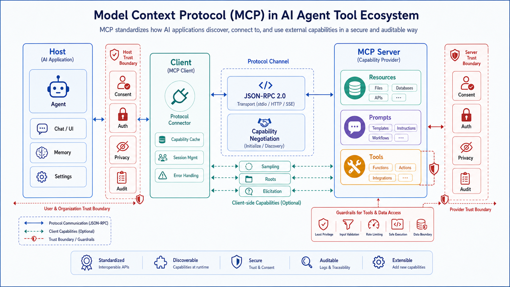

## 概述

MCP（Model Context Protocol）是一个连接 AI 应用与外部系统的开放协议。它解决的问题很直接：不同 Agent、IDE、聊天应用都需要访问文件、数据库、搜索、设计工具、业务系统，如果每个客户端都为每个工具单独适配，生态会快速碎片化。

MCP 的目标是把外部能力标准化，让工具和数据源可以被多个 AI 应用复用。

## MCP 的基本架构

MCP 使用 Host、Client、Server 三层结构：

```text
Host
  └── Client
        └── MCP Server
              ├── Resources
              ├── Prompts
              └── Tools
```

| 角色 | 说明 |
| --- | --- |
| Host | 用户使用的 AI 应用，例如 IDE、聊天应用、Agent Runtime |
| Client | Host 内部连接 MCP Server 的连接器 |
| Server | 暴露资源、提示和工具的服务 |

规范中，MCP 使用 JSON-RPC 2.0 消息，支持有状态连接、能力协商和多类功能。



## Server 能提供什么

### 1. Resources

Resources 是上下文和数据，例如：

- 文件内容
- 数据库记录
- 文档页面
- 项目元数据
- 日志片段

资源通常用于“读”，帮助模型获得上下文。

### 2. Prompts

Prompts 是可复用的模板化工作流，例如：

- 生成 PR 描述
- 分析错误日志
- 代码审查模板
- 数据分析流程

Prompt 不是简单文本，而是把某类任务的输入、步骤和输出形式固定下来。

### 3. Tools

Tools 是可执行函数，例如：

- 搜索
- 创建 issue
- 查询数据库
- 调用 API
- 运行构建
- 操作设计文件

工具是风险最高的一类能力，因为它可能带来外部副作用。

## Client 能提供什么

MCP 规范中，Client 也可以向 Server 暴露能力，例如：

- Sampling：Server 请求 Host 调用模型。
- Roots：Server 查询可操作的 URI 或文件系统边界。
- Elicitation：Server 请求用户补充信息。

这说明 MCP 不只是“工具列表协议”，而是 Agent 应用与外部系统之间的双向协作协议。

## 为什么 Agent 需要 MCP

Agent 系统常见痛点是工具适配成本高：

```text
N 个客户端 × M 个工具 = N × M 次集成
```

MCP 的目标是把它变成：

```text
客户端适配 MCP + 工具实现 MCP Server
```

这对 Agent 有几个直接价值：

- 工具可以跨 IDE、聊天应用、Agent Runtime 复用。
- 工具 schema 和描述有统一暴露方式。
- Server 可以独立升级。
- 企业内部系统可以用统一协议接入 Agent。
- 安全策略可以集中在 Host 和 Server 两侧实现。

## 与 OpenClaw 和 Hermes 的关系

OpenClaw 和 Hermes Agent 都属于需要大量工具和外部系统连接的 Agent Runtime。MCP 在这类系统中可以承担“工具生态接口”的角色：

| 场景 | MCP 的价值 |
| --- | --- |
| 浏览器自动化 | 把浏览器能力暴露为可复用 Server |
| 内部数据库 | 以受控查询工具替代直接给 Agent 数据库凭据 |
| 企业系统 | 封装 Jira、GitHub、Notion、CRM 等业务动作 |
| 文件知识库 | 通过资源和检索工具暴露文档 |
| 多 Agent 平台 | 让不同 Agent 共享同一套工具服务 |

Hermes Agent 文档中也把动态 MCP toolsets 作为工具系统的一部分，说明 MCP 已经成为现代 Agent 工具层的重要接口。

## 安全原则

MCP 官方规范强调，协议本身不能替使用者完成所有安全控制。实现方应建立同意、授权、隐私和工具安全流程。

关键原则包括：

- 用户应明确同意数据访问和操作。
- Host 不应在未经同意的情况下把用户数据传给 Server。
- 工具调用前应获得用户授权。
- 工具描述不能默认可信。
- Sampling 请求需要用户可见和可控。

## MCP 工具设计建议

### 1. 不要暴露万能工具

不要把 `execute_sql(sql)` 直接暴露给 Agent。更好的做法是暴露受控工具：

```text
get_customer_by_id(customer_id)
list_recent_orders(customer_id, limit)
create_support_ticket(customer_id, title, body)
```

### 2. 将权限放在 Server 侧

Host 侧负责审批，Server 侧也要做权限校验。不能假设所有请求都来自善意模型。

### 3. 给工具结果加边界

结果应限制数量、大小和敏感字段。例如：

- 默认分页
- 隐藏密钥字段
- 脱敏手机号和邮箱
- 返回摘要而不是全量日志

### 4. 将副作用显式化

会产生副作用的工具应在描述和 schema 中明确：

- 是否写入数据
- 是否发送消息
- 是否调用外部服务
- 是否不可逆

### 5. 审计所有写操作

写操作至少记录：

- 用户身份
- Agent 会话
- 工具名
- 参数摘要
- 结果
- 审批记录
- 时间戳

## 一个 MCP Server 的思维模型

假设要给 Agent 接入内部知识库，可以这样设计：

```text
Resources:
  kb://docs/{id}
  kb://projects/{project_id}/summary

Prompts:
  summarize_project_status
  write_release_note

Tools:
  search_docs(query, project_id, limit)
  get_doc(id)
  create_doc_comment(id, body)
```

其中 `search_docs` 和 `get_doc` 是读操作，可以低风险开放；`create_doc_comment` 是写操作，需要用户审批。

## 实操：写一个最小 MCP Server

官方 Python SDK 支持 `FastMCP`。下面这个例子把本地 `notes/` 目录暴露为一个只读/低风险工具服务。

安装：

```bash
pip install mcp
```

创建 `notes_server.py`：

```python
from pathlib import Path
from mcp.server.fastmcp import FastMCP

mcp = FastMCP("notes-server", json_response=True)
NOTES_DIR = Path("notes")
NOTES_DIR.mkdir(exist_ok=True)

@mcp.tool()
def search_notes(keyword: str, limit: int = 5) -> list[dict]:
    """Search local markdown notes by keyword."""
    hits = []
    for path in NOTES_DIR.glob("*.md"):
        text = path.read_text(encoding="utf-8")
        if keyword.lower() in text.lower():
            hits.append({"file": path.name, "preview": text[:200]})
        if len(hits) >= limit:
            break
    return hits

@mcp.resource("note://{name}")
def read_note(name: str) -> str:
    """Read one note by file name."""
    safe_name = Path(name).name
    path = NOTES_DIR / safe_name
    if path.suffix != ".md":
        path = path.with_suffix(".md")
    return path.read_text(encoding="utf-8")

if __name__ == "__main__":
    mcp.run(transport="streamable-http")
```

准备数据并运行：

```bash
mkdir notes
echo "# Agent\n工具要有权限边界。" > notes/agent.md
python notes_server.py
```

再用 MCP Inspector 测试：

```bash
npx -y @modelcontextprotocol/inspector
```

在 Inspector 中连接：

```text
http://localhost:8000/mcp
```

这个例子的关键不是搜索功能本身，而是接口边界：

- `search_notes` 是 tool，适合让模型主动调用。
- `note://{name}` 是 resource，适合按需读取上下文。
- 通过 `Path(name).name` 阻止 `../../secret` 这类路径穿越。

## 小结

MCP 的重要性不在于多一个协议，而在于它把 Agent 工具生态从“每个应用各接各的”推进到“工具服务可复用”。对个人 Agent 来说，MCP 可以减少工具接入成本；对团队和企业来说，MCP 是建立权限、审计和标准化工具层的入口。

## 参考资料

- [What is MCP](https://modelcontextprotocol.io/docs/getting-started/intro)
- [MCP Specification 2025-06-18](https://modelcontextprotocol.io/specification/2025-06-18)
- [MCP GitHub](https://github.com/modelcontextprotocol/modelcontextprotocol)
- [MCP Python SDK Quickstart](https://github.com/modelcontextprotocol/python-sdk)
- [Hermes Agent Tools & Toolsets](https://hermes-agent.nousresearch.com/docs/user-guide/features/tools/)
- [OpenAI Agents SDK MCP](https://openai.github.io/openai-agents-python/mcp/)
