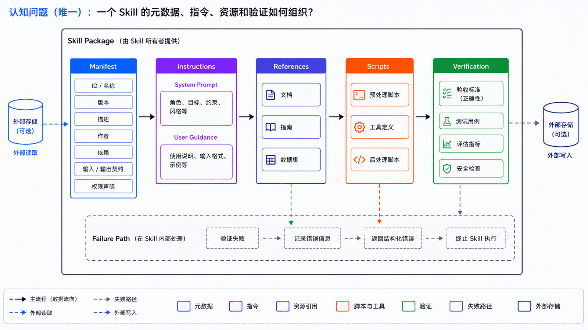
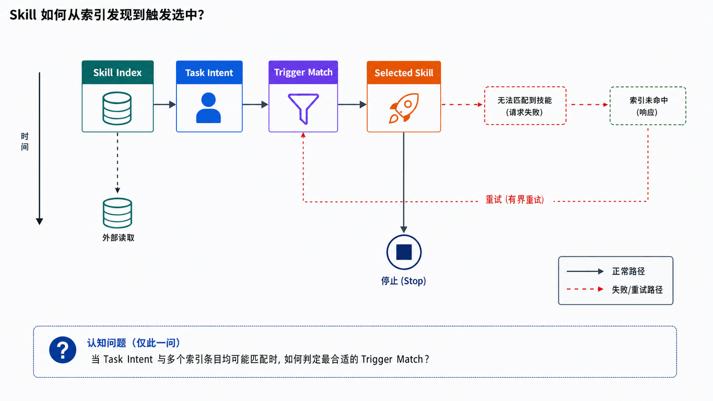
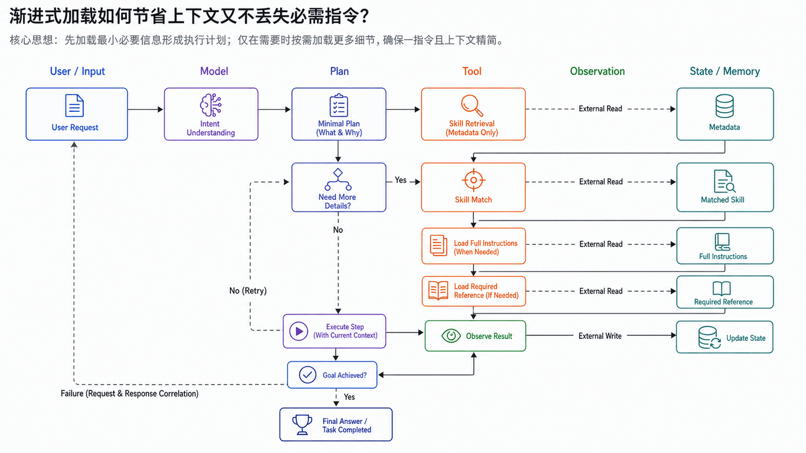
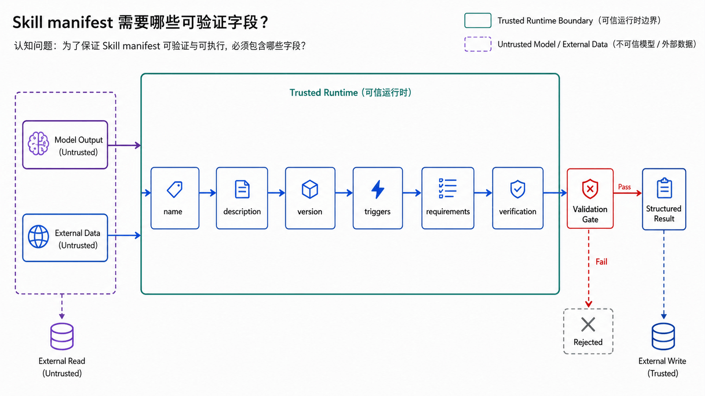
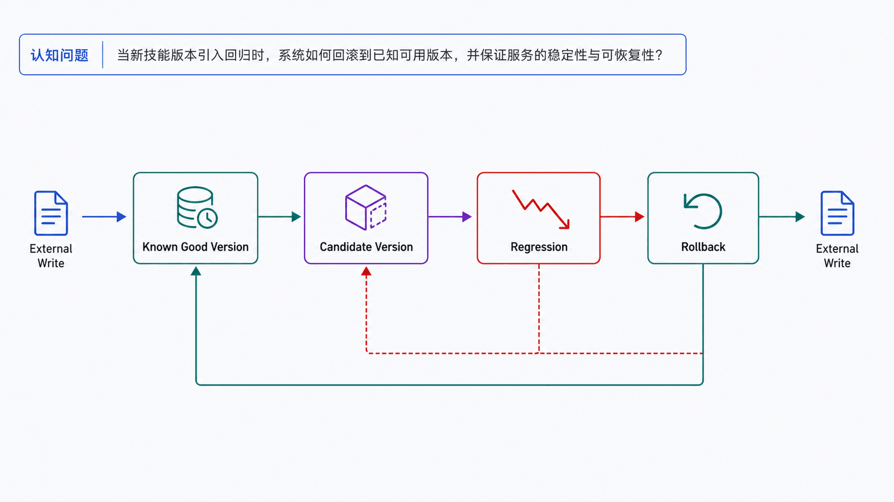
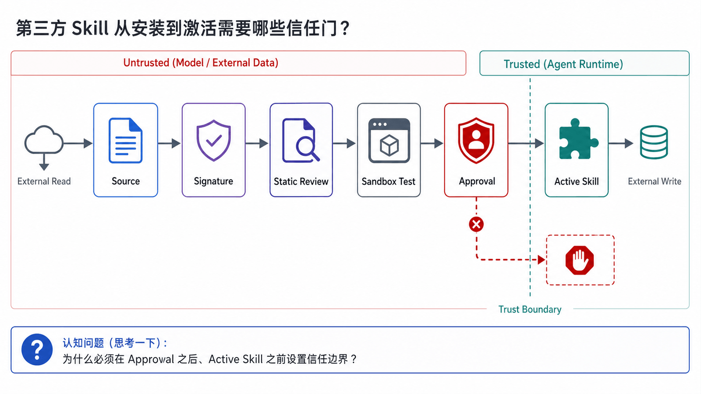

## 学习导航

**前置知识**：基础 Python、JSON、HTTP 与异步编程概念。

**适用读者**：首次系统学习生产级 Agent，并希望能独立实现、调试和评估的开发者。

**学习目标**：

- 区分 Prompt、Tool、Skill 和 MCP
- 理解发现、触发与渐进式加载
- 为 Skill 建立版本、信任和验证门

**贯穿场景**：把‘发布前检查’沉淀为可触发、可验证、可回滚的 Skill，而不是一段无条件加载的长 Prompt。

> 本文中的产品特有事实以文末官方资料为准；通用架构建议会明确标为设计推导。

## 概述

Skills 是 Agent 的过程记忆。它把“如何完成某类任务”的经验保存成可复用文档、脚本、模板和参考材料，让 Agent 下次遇到类似任务时不必从零开始。

与长期记忆不同，记忆通常保存事实和偏好；技能保存流程、工具使用方法、检查清单和输出规范。

## Skill 的基本形态



一个典型 Skill 目录可能长这样：

```text
my-skill/
  SKILL.md
  references/
  templates/
  scripts/
  assets/
```

`SKILL.md` 通常包含：

- 名称
- 描述
- 适用场景
- 操作步骤
- 常见坑点
- 验证方法
- 需要的工具或环境变量

Hermes Agent 的 Skills 文档把技能定义为按需加载的知识文档，并强调 progressive disclosure：先只加载技能列表，只有真正需要时才加载完整技能内容或引用文件。

## 为什么需要 Skills



Agent 完成真实任务时，经常遇到重复流程：

- 新项目初始化
- 代码审查
- 发布检查
- Docker 部署
- 数据分析
- PR 描述生成
- 故障排查
- 浏览器自动化
- 报表发送

如果每次都靠模型重新推理，效果会不稳定。Skill 可以把成功经验固定下来，让 Agent 更像“熟悉你环境的同事”。

## Skill 与 Prompt 的区别


| 维度     | Prompt         | Skill                          |
| -------- | -------------- | ------------------------------ |
| 作用     | 指导一次生成   | 指导一类任务                   |
| 内容     | 通常是一段指令 | 可以包含文档、脚本、模板、资源 |
| 生命周期 | 短期           | 长期可维护                     |
| 加载方式 | 直接放入上下文 | 按需发现和加载                 |
| 维护方式 | 改提示词       | 版本化、测试、审计             |

## OpenClaw 的 Skills 思路

OpenClaw 使用兼容 AgentSkills 的 skill 文件夹，每个 skill 包含 `SKILL.md`。它支持 bundled skills、managed/local skills 和 workspace skills，并通过优先级处理同名技能。

OpenClaw 的重要启发是：技能应该有位置和作用域。

| 位置                 | 适用范围                   |
| -------------------- | -------------------------- |
| Bundled skills       | 所有用户可用的基础能力     |
| Managed/local skills | 当前机器或用户的通用能力   |
| Workspace skills     | 当前项目或当前代理专属能力 |

Workspace skills 优先级更高，这很合理：项目本地约定应该覆盖通用经验。

## Hermes Agent 的 Skills 思路

Hermes Agent 把 skills 放在 `~/.hermes/skills/`，并支持 hub、官方可选技能、直接 URL、GitHub 来源和外部只读技能目录。

Hermes 的亮点是 agent-managed skills：当 Agent 完成复杂任务、遇到错误后找到解决方式、被用户纠正或发现非平凡流程时，可以创建或更新技能。这让技能成为 Agent 自我改进的主要载体。

## 渐进式加载



如果把所有技能都塞进系统提示，Agent 会立刻被上下文撑爆。渐进式加载通常分三层：

```text
Level 0：技能索引
Level 1：某个技能的 SKILL.md
Level 2：技能里的具体 reference/template/script
```

这种模式有两个优势：

- 降低 token 成本。
- 减少无关技能干扰模型判断。

## Skill 编写模板



可以使用以下结构：

```markdown
---
name: release-check
description: 发布前检查构建、测试、变更日志和回滚方案
---

# Release Check

## When to Use

当用户要求发布、上线、打 tag 或准备版本说明时使用。

## Procedure

1. 检查当前分支和未提交变更。
2. 运行测试和构建。
3. 检查 changelog。
4. 确认回滚方案。
5. 输出发布摘要。

## Pitfalls

- 不要在未确认环境时推送生产 tag。
- 构建失败时停止发布。

## Verification

- 测试通过。
- 构建产物生成。
- 用户确认发布窗口。
```

## Skill 生命周期



一个成熟的 Skill 系统需要管理完整生命周期：

```text
创建
  ↓
使用
  ↓
修正
  ↓
评估
  ↓
归档或升级
```

常见治理字段包括：

- 创建者
- 更新时间
- 使用次数
- 最近使用时间
- 适用平台
- 所需工具
- 风险等级
- 是否允许 Agent 修改

Hermes Agent 的 Curator 会维护 agent-created skills，例如统计使用、标记 stale、归档和备份。这个方向非常重要，因为“自改进”如果没有清理机制，最后会变成技能堆积。

## 安全注意事项



Skills 可能包含脚本、命令、环境变量和第三方链接，必须按不可信代码处理。

建议：

- 安装第三方 skill 前阅读 `SKILL.md`。
- 高风险 skill 默认禁用。
- 技能脚本运行在沙箱中。
- 环境变量只按需注入。
- 不允许 skill 静默读取密钥。
- agent-created skill 需要标记 provenance。
- 被网页内容诱导生成的 skill 需要人工审查。

OpenClaw 文档也提醒，第三方 skills 应按不可信代码处理，并建议对不可信输入和风险工具使用沙箱。

## 适合沉淀为 Skill 的内容

适合：

- 多次重复的流程
- 项目特定命令
- 有固定输出格式的任务
- 需要多个工具配合的任务
- 曾经踩坑并找到稳定解法的任务

不适合：

- 一次性闲聊
- 临时结论
- 未验证的猜测
- 只对当前对话有效的信息
- 密钥、token、账号密码

## 工程补全：Skill 生命周期与供应链信任

### 接口与数据契约

- Skill manifest 声明 name、description、version、triggers、requirements 和 verification
- 索引阶段只加载元数据，匹配后再读取完整指令与必需资源
- 执行前检查来源、依赖、允许工具和工作区范围

### 失败路径、终止与恢复

- 多个 Skill 同时匹配时记录解析结果和优先级
- 依赖缺失时在执行前失败，不让任务半途停止
- 更新 Skill 先运行回归验证，失败时保留已知良好版本

### 可观测性与验收


不要只保留最终回答。每次运行应该能通过 **run_id** 关联输入、决策、工具请求、工具结果、状态变更和终止原因。本篇至少跟踪：

- `trigger_precision`
- `load_latency`
- `verification_pass`
- `rollback_count`
- `untrusted_skill_blocked`

## 常见误区

- Skill 不是工具的另一个名字
- 渐进式加载不是丢失必需指令
- 文本文件格式不代表 Skill 天然安全

## 自检题

1. Skill 与 Tool 的核心差异是什么？
2. 为什么要分索引与完整加载？
3. 第三方 Skill 最少应通过哪些门禁？

<details>
<summary>查看答案</summary>

1. Tool 是可执行能力接口；Skill 是完成一类任务的过程指令、资源和验证方法。
2. 减少上下文占用，同时保证真正匹配后完整读取指令。
3. 来源与版本校验、静态审查、最小工具权限、隔离测试和可回滚性。

</details>

## 实操：实现一个渐进式 Skill Loader

Hermes 的 skills 工具提供 `skills_list()` 和 `skill_view()`，核心思想是先只看索引，真正需要时再加载完整技能。下面实现一个极简版。

目录结构：

```text
skills/
  release-check/
    SKILL.md
  astro-blog/
    SKILL.md
```

创建 `skills/astro-blog/SKILL.md`：

```markdown
---
name: astro-blog
description: 当需要新增 AstroPaper 博客文章、检查 frontmatter 或运行构建时使用
---

# Astro Blog

## Procedure

1. 在 `src/data/blog` 下创建 Markdown。
2. frontmatter 必须包含 `title`、`pubDatetime`、`slug`、`description`、`tags`。
3. 修改后运行 `npm.cmd run build`。

## Verification

- 构建通过。
- 文章生成到 `/posts/.../index.html`。
```

创建 `skill_loader.py`：

```python
from pathlib import Path
import re

SKILLS_DIR = Path("skills")

def parse_frontmatter(text: str) -> dict:
    if not text.startswith("---"):
        return {}
    raw = text.split("---", 2)[1]
    result = {}
    for line in raw.splitlines():
        if ":" in line:
            key, value = line.split(":", 1)
            result[key.strip()] = value.strip().strip("'\"")
    return result

def skills_list() -> list[dict]:
    skills = []
    for path in SKILLS_DIR.glob("*/SKILL.md"):
        text = path.read_text(encoding="utf-8")
        meta = parse_frontmatter(text)
        skills.append(
            {
                "name": meta.get("name", path.parent.name),
                "description": meta.get("description", ""),
                "path": str(path),
            }
        )
    return skills

def skill_view(name: str) -> str:
    safe = re.sub(r"[^a-zA-Z0-9_-]", "", name)
    path = SKILLS_DIR / safe / "SKILL.md"
    return path.read_text(encoding="utf-8")

if __name__ == "__main__":
    print(skills_list())
    print(skill_view("astro-blog"))
```

运行：

```bash
python skill_loader.py
```

把它接入 Agent 后，提示组装可以变成：

```text
先查看 skills_list。
如果用户任务匹配某个技能，再加载 skill_view(name)。
不要一次性加载所有技能。
```

这就是 progressive disclosure 的最小落地。

## 小结

Skills 是 Agent 从“会推理”变成“会积累”的关键机制。OpenClaw 展示了技能位置和优先级的工程设计，Hermes Agent 展示了技能自创建、自维护和渐进式加载的路线。真正有用的 Skill 系统应该既能学习，也能清理；既能复用，也能限制风险。

## 下一篇

07-Agent 安全：系统化处理工具、记忆和 Skill 引入的信任问题。

## 资料来源与版本基线

- [Hermes Agent Skills System](https://hermes-agent.nousresearch.com/docs/user-guide/features/skills/)
- [Hermes Agent Skills Tool Source](https://github.com/NousResearch/hermes-agent/blob/main/tools/skills_tool.py)
- [OpenClaw Skills](https://docs.openclaw.ai/tools/skills)
- [OpenClaw Agent workspace](https://docs.openclaw.ai/concepts/agent-workspace)
- [OpenAI Tools: Skills](https://developers.openai.com/api/docs/guides/tools-skills)
