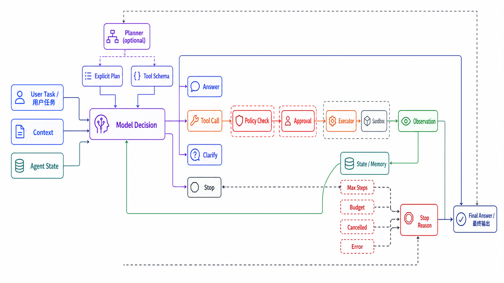
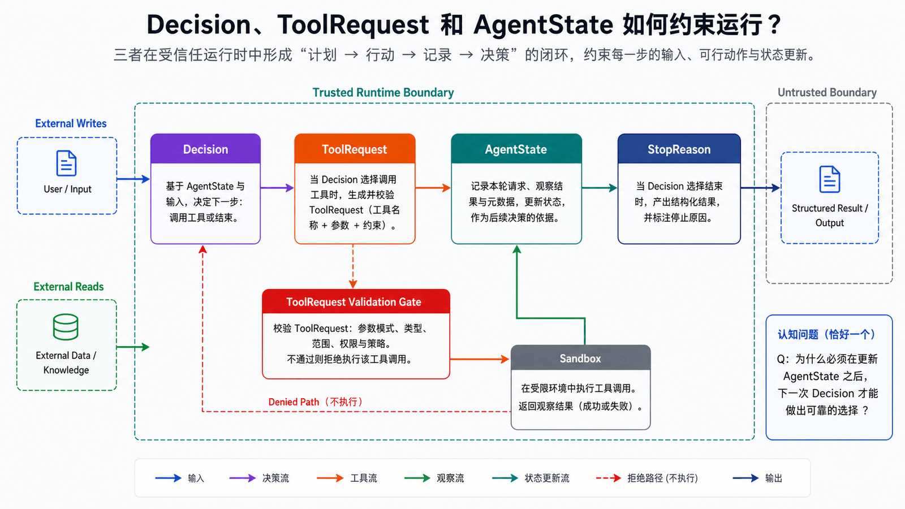
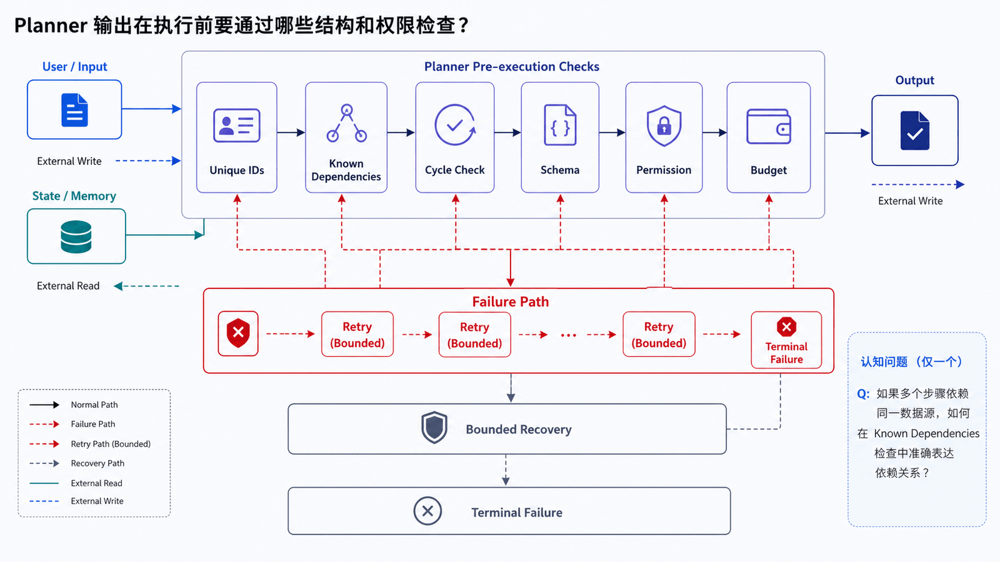
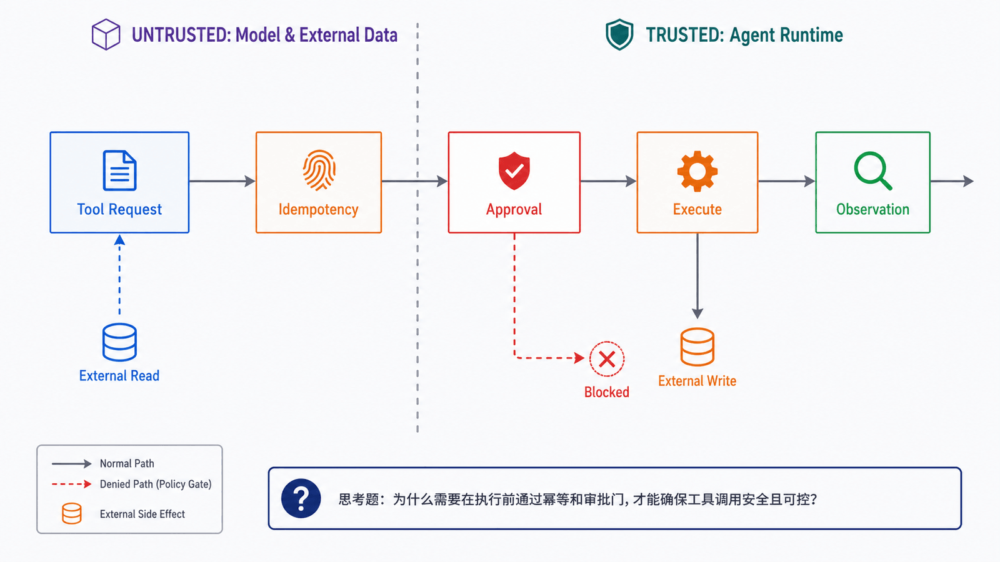
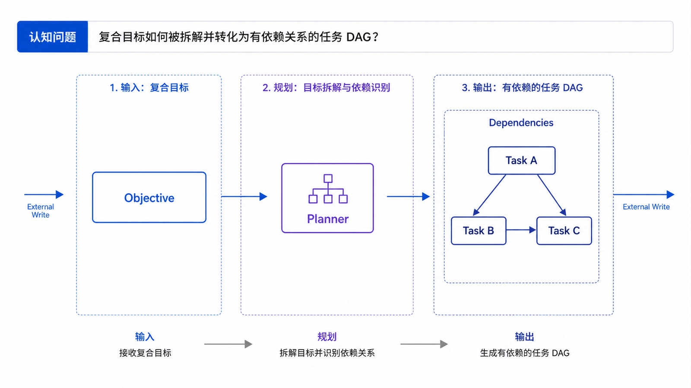
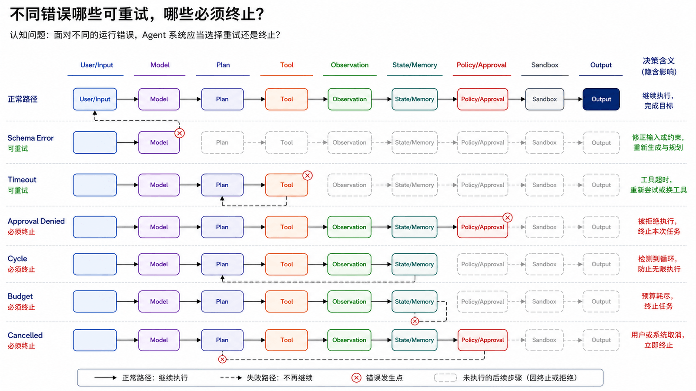
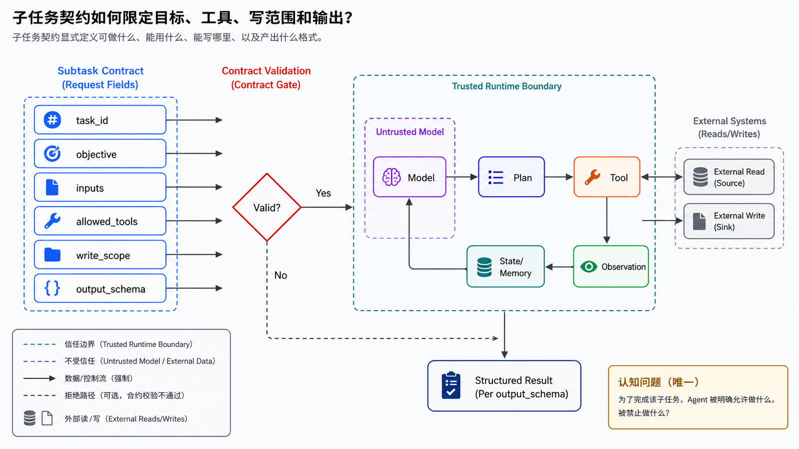

## 学习导航

**前置知识**：建议先完成本系列第 01–07 篇，并熟悉 Python 类型标注、JSON 和 `asyncio`。

**适用读者**：已理解 Agent Loop、工具契约、记忆与安全边界，希望把它们组合为最小可运行系统的开发者。

**学习目标**：

- 实现一个有最大步数、成本预算、取消和显式终止原因的 Agent Loop。
- 将 Planner 的输出验证为无环 DAG，再交给 Executor。
- 区分显式计划、动作、观察和评估事件，不把隐藏推理过程当作日志契约。
- 通过回归测试验证循环终止、工具失败、依赖环和未经审批的副作用。

**贯穿场景**：构建一个“项目状态摘要 Agent”。它可以列出工作区文件、读取指定文件并生成摘要；写文件是高风险动作，必须经过显式审批。

## 先锁定系统边界




Agent 不是一个能自由访问操作系统的模型。本篇把系统分成五个可独立测试的部件：

| 部件          | 职责                           | 不负责的事                         |
| ------------- | ------------------------------ | ---------------------------------- |
| Model Adapter | 基于当前状态返回结构化决策     | 不直接执行工具                     |
| Planner       | 将复合目标分解为有依赖的任务   | 不自动授权子任务                   |
| Policy Engine | 检查工具、资源范围和审批       | 不根据模型自述放宽权限             |
| Executor      | 校验参数、执行工具、标准化结果 | 不解释任务意图                     |
| Runtime       | 维护状态、预算、事件和终止条件 | 不把“模型还想继续”当作无限运行理由 |

## 运行时数据契约



先定义契约，再写循环。这能避免用字符串约定隐式控制状态。

```python
from __future__ import annotations

from dataclasses import dataclass, field
from enum import Enum
from typing import Any, Literal


class StopReason(str, Enum):
    COMPLETED = "completed"
    NEEDS_INPUT = "needs_input"
    MAX_STEPS = "max_steps"
    BUDGET_EXCEEDED = "budget_exceeded"
    CANCELLED = "cancelled"
    ERROR = "error"


@dataclass(frozen=True)
class ToolRequest:
    call_id: str
    name: str
    arguments: dict[str, Any]
    idempotency_key: str


@dataclass(frozen=True)
class Decision:
    kind: Literal["answer", "tool", "clarify"]
    answer: str | None = None
    tool: ToolRequest | None = None


@dataclass
class AgentState:
    run_id: str
    objective: str
    step_count: int = 0
    cost_units: int = 0
    observations: list[dict[str, Any]] = field(default_factory=list)
    events: list[dict[str, Any]] = field(default_factory=list)
    stop_reason: StopReason | None = None
    final_answer: str | None = None
```

`Decision` 是可审计的外部决策，不是模型隐藏思维过程的逐字记录。生产日志应保存“要做什么、调用了什么、得到什么、为什么停止”，而不是要求暴露私有推理。

## 受控 ReAct Loop





ReAct 的工程价值是在“决策—动作—观察”之间建立显式循环。下面的 Runtime 不依赖具体模型 SDK，因此可以用假模型做确定性测试。

```python
import asyncio
from collections.abc import Awaitable, Callable

Model = Callable[[AgentState], Awaitable[Decision]]
Tool = Callable[[dict[str, Any]], Awaitable[dict[str, Any]]]
Approval = Callable[[ToolRequest], Awaitable[bool]]


class AgentRuntime:
    def __init__(
        self,
        model: Model,
        tools: dict[str, Tool],
        approve: Approval,
        *,
        max_steps: int = 8,
        budget_units: int = 20,
    ) -> None:
        self.model = model
        self.tools = tools
        self.approve = approve
        self.max_steps = max_steps
        self.budget_units = budget_units
        self._seen_idempotency_keys: set[str] = set()

    def emit(self, state: AgentState, event_type: str, **data: Any) -> None:
        state.events.append(
            {"type": event_type, "step": state.step_count, "data": data}
        )

    async def run(
        self, state: AgentState, cancel: asyncio.Event | None = None
    ) -> AgentState:
        cancel = cancel or asyncio.Event()
        self.emit(state, "run_started", objective=state.objective)

        while state.stop_reason is None:
            if cancel.is_set():
                state.stop_reason = StopReason.CANCELLED
                break
            if state.step_count >= self.max_steps:
                state.stop_reason = StopReason.MAX_STEPS
                break
            if state.cost_units >= self.budget_units:
                state.stop_reason = StopReason.BUDGET_EXCEEDED
                break

            state.step_count += 1
            decision = await self.model(state)
            state.cost_units += 1
            self.emit(state, "decision", kind=decision.kind)

            if decision.kind == "answer":
                state.final_answer = decision.answer or ""
                state.stop_reason = StopReason.COMPLETED
                break
            if decision.kind == "clarify":
                state.final_answer = decision.answer or "需要更多信息"
                state.stop_reason = StopReason.NEEDS_INPUT
                break
            if decision.tool is None:
                self.emit(state, "invalid_decision", reason="missing tool request")
                state.stop_reason = StopReason.ERROR
                break

            observation = await self.execute_tool(state, decision.tool)
            state.observations.append(observation)

        self.emit(state, "run_stopped", reason=state.stop_reason.value)
        return state

    async def execute_tool(
        self, state: AgentState, request: ToolRequest
    ) -> dict[str, Any]:
        self.emit(state, "tool_requested", name=request.name, call_id=request.call_id)
        tool = self.tools.get(request.name)
        if tool is None:
            return {"ok": False, "error": {"code": "unknown_tool", "retryable": False}}

        if request.idempotency_key in self._seen_idempotency_keys:
            return {"ok": False, "error": {"code": "duplicate", "retryable": False}}

        if request.name.startswith("write_") and not await self.approve(request):
            return {"ok": False, "error": {"code": "approval_denied", "retryable": False}}

        self._seen_idempotency_keys.add(request.idempotency_key)
        try:
            result = await asyncio.wait_for(tool(request.arguments), timeout=3)
            self.emit(state, "tool_completed", name=request.name)
            return {"ok": True, "data": result}
        except TimeoutError:
            self.emit(state, "tool_failed", name=request.name, code="timeout")
            return {"ok": False, "error": {"code": "timeout", "retryable": True}}
        except Exception as exc:
            self.emit(state, "tool_failed", name=request.name, code=type(exc).__name__)
            return {
                "ok": False,
                "error": {"code": "tool_error", "retryable": False},
            }
```

这个骨架还没有包含 JSON Schema 校验和持久化，但已经把几个关键边界固化在 Runtime 中：

- 模型只返回 `Decision`，不直接调用 Python 函数。
- 步数、预算和取消由 Runtime 强制检查。
- 审批和幂等在执行前完成。
- 工具错误转换为 Observation，由下一次决策选择恢复、降级或终止。

## Planner：从目标到可验证 DAG




复合任务可以先生成显式计划。不论计划来自模型还是用户，Executor 都必须先校验其结构。

```python
@dataclass(frozen=True)
class Task:
    task_id: str
    tool: str
    arguments: dict[str, Any]
    depends_on: tuple[str, ...] = ()


def topological_order(tasks: list[Task]) -> list[Task]:
    by_id = {task.task_id: task for task in tasks}
    if len(by_id) != len(tasks):
        raise ValueError("duplicate task_id")

    unknown = {
        dependency
        for task in tasks
        for dependency in task.depends_on
        if dependency not in by_id
    }
    if unknown:
        raise ValueError(f"unknown dependencies: {sorted(unknown)}")

    indegree = {task.task_id: len(task.depends_on) for task in tasks}
    children: dict[str, list[str]] = {task.task_id: [] for task in tasks}
    for task in tasks:
        for dependency in task.depends_on:
            children[dependency].append(task.task_id)

    ready = sorted(task_id for task_id, degree in indegree.items() if degree == 0)
    ordered: list[Task] = []
    while ready:
        task_id = ready.pop(0)
        ordered.append(by_id[task_id])
        for child in children[task_id]:
            indegree[child] -= 1
            if indegree[child] == 0:
                ready.append(child)
                ready.sort()

    if len(ordered) != len(tasks):
        raise ValueError("cyclic dependency")
    return ordered
```

Planner 输出仅是候选计划。在进入 Executor 前还要检查：

1. `task_id` 是否唯一，依赖是否存在。
2. 是否有环，是否超过最大任务数和预算。
3. 每个工具是否在允许列表中，参数是否通过 Schema。
4. 多个任务是否会写入同一资源。
5. 高风险任务是否有具体、可审计的审批。

## Executor：顺序、并行与部分失败


Executor 按拓扑层次调度任务。只有同一层中互不依赖、不竞争写资源的任务才能并行。

对每个任务记录以下状态：

```json
{
  "task_id": "summarize_readme",
  "status": "failed",
  "attempt": 1,
  "started_at": "2026-07-12T08:00:00Z",
  "finished_at": "2026-07-12T08:00:02Z",
  "error": {
    "code": "tool_timeout",
    "retryable": true
  }
}
```

不要在第一个任务失败时丢弃所有成功结果。最终输出应该包含已完成任务、失败任务、被跳过任务、降级结果和建议的人工动作。

## Reflection 与评估闭环



Reflection 不应该是“让模型再想一次”的无界循环。它是一个有输入、评估准则和输出范围的后处理步骤：

- **输入**：目标、显式计划、动作/观察轨迹、最终输出和验证器结果。
- **准则**：任务是否完成、输出是否有证据、是否越过安全边界、是否超出预算。
- **输出**：`pass`、`retry_with_change`、`needs_human` 或 `fail`，以及一条可执行的改进建议。
- **边界**：反思不自动扩大权限，不重写原始审计轨迹，重试次数有上限。

只有经过多次任务验证的稳定经验才能进入长期记忆或 Skill 候选区，并且需要来源、版本、隔离验证和回滚方案。

## 失败路径与恢复矩阵


| 失败            | 是否自动重试 | 恢复策略                           | 必备证据                          |
| --------------- | ------------ | ---------------------------------- | --------------------------------- |
| Schema 校验失败 | 否           | 返回结构化错误，要求新决策         | 字段路径与错误类型                |
| 工具瞬时超时    | 有上限       | 根据幂等键查询后退避重试           | call_id、idempotency_key、attempt |
| 审批拒绝        | 否           | 降级为只读方案或请求人工处理       | 审批人、具体参数和理由            |
| Planner 生成环  | 否           | 拒绝计划并返回环路节点             | 依赖边集                          |
| 预算用尽        | 否           | 保留部分结果并标记 budget_exceeded | 步数、耗时、成本和未完成项        |
| 用户取消        | 否           | 传播取消，停止未开始任务           | cancel_requested 与 run_stopped   |

## 可观测性与验收

一次运行至少记录：

- `run_started`：目标、允许工具、预算和运行时版本。
- `decision`：显式决策类型，不记录隐藏思维链。
- `tool_requested` / `tool_completed` / `tool_failed`：工具名、call_id、耗时和错误类型。
- `approval_requested` / `approval_resolved`：副作用、完整目标和决策者。
- `state_changed`：变更的字段，对敏感值做脱敏。
- `run_stopped`：明确的 `stop_reason`、步数、耗时、成本与部分结果。

主要评估指标包括 `task_success`、`unsafe_action_blocked`、`tool_error_rate`、`steps_per_run`、`cost_per_success`、`p95_duration` 和 `stop_reason_distribution`。

## 最小回归测试



```python
import asyncio


async def deny(_: ToolRequest) -> bool:
    return False


def test_cycle_is_rejected() -> None:
    tasks = [
        Task("a", "read_file", {}, ("b",)),
        Task("b", "read_file", {}, ("a",)),
    ]
    try:
        topological_order(tasks)
    except ValueError as exc:
        assert str(exc) == "cyclic dependency"
    else:
        raise AssertionError("cycle must be rejected")


def test_runtime_stops_at_max_steps() -> None:
    async def endless_model(state: AgentState) -> Decision:
        return Decision(
            kind="tool",
            tool=ToolRequest(
                call_id=f"call-{state.step_count}",
                name="read_status",
                arguments={},
                idempotency_key=f"read-{state.step_count}",
            ),
        )

    async def read_status(_: dict[str, Any]) -> dict[str, Any]:
        return {"status": "ok"}

    runtime = AgentRuntime(
        endless_model, {"read_status": read_status}, deny, max_steps=2
    )
    result = asyncio.run(runtime.run(AgentState("run-1", "summarize")))
    assert result.stop_reason is StopReason.MAX_STEPS
    assert result.step_count == 2


def test_write_requires_approval() -> None:
    async def never_called(_: dict[str, Any]) -> dict[str, Any]:
        raise AssertionError("denied tool must not run")

    async def scenario() -> dict[str, Any]:
        runtime = AgentRuntime(
            lambda state: None,  # model is not used in this focused test
            {"write_report": never_called},
            deny,
        )
        state = AgentState("run-2", "write report")
        return await runtime.execute_tool(
            state,
            ToolRequest("call-1", "write_report", {}, "write-report-1"),
        )

    result = asyncio.run(scenario())
    assert result["error"]["code"] == "approval_denied"
```

实际项目还应测试非法 Schema、路径穿越、符号链接逃逸、工具超时、重复幂等键、取消传播、部分失败和日志脱敏。

## 常见误区

- **将 ReAct 等同于打印模型的全部思考**：工程系统需要的是可审计决策、动作、观察和终止事件。
- **Planner 输出可直接执行**：计划是不可信候选数据，必须验证依赖、权限、参数、预算和写冲突。
- **Reflection 可以无限提高质量**：每次反思都有成本，并可能引入新错误；必须有验证器和重试上限。
- **工具报超时就一定没有执行**：对写操作必须使用幂等键和结果查询。
- **测试最终答案就够了**：还要测试终止、副作用、权限、事件序列和部分失败。

## 自检题

1. 为什么 `Decision` 与工具执行必须由不同部件负责？
2. Planner 生成的 DAG 在执行前至少需要通过哪些检查？
3. Reflection 什么时候应该返回 `needs_human` 而不是继续重试？

<details>
<summary>查看答案</summary>

1. 模型输出是不可信建议；确定性 Runtime 必须独立执行 Schema、权限、审批、预算和副作用检查。
2. 任务 ID 唯一性、依赖存在性、无环、工具允许列表、参数 Schema、预算、审批和写冲突。
3. 需要新权限、目标存在高影响歧义、验证器无法判定、重试上限已达到，或继续操作可能造成不可逆副作用时。

</details>

## 总结

一个可交付的 Agent 不是某个 Prompt 模式，而是一个受状态、契约、权限、预算、终止条件和可观测事件共同约束的运行时。Planner、Executor 和 Reflection 只有在这些边界内才能可靠扩展系统能力。

## 下一篇

09-多 Agent 协作：将单 Agent 中已经明确的任务契约、状态所有权和失败语义扩展到委派、并行和结果归并。

## 资料来源与版本基线

- [ReAct: Synergizing Reasoning and Acting in Language Models](https://arxiv.org/abs/2210.03629)
- [Reflexion: Language Agents with Verbal Reinforcement Learning](https://arxiv.org/abs/2303.11366)
- [OpenAI Agents SDK: Running agents](https://openai.github.io/openai-agents-python/running_agents/)
- [OpenAI Agents SDK: Results](https://openai.github.io/openai-agents-python/results/)
- [OpenAI Agents SDK: Tracing](https://openai.github.io/openai-agents-python/tracing/)
- [Model Context Protocol Specification](https://modelcontextprotocol.io/specification)
