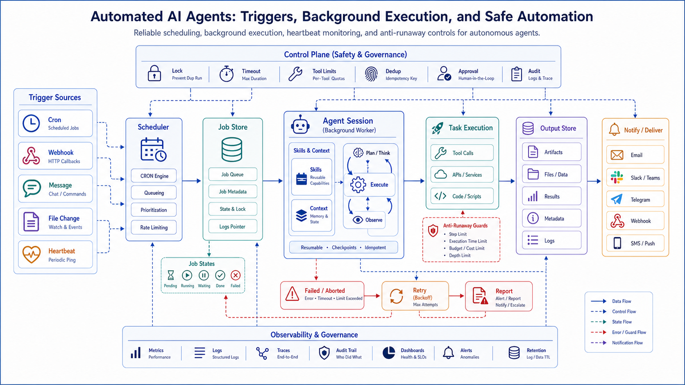

## 概述

自动化 Agent 是从“用户问一句，Agent 答一句”走向“Agent 在合适时间主动执行任务”的关键形态。它可以定时检查、汇总、提醒、监控和执行工作流。

但自动化也意味着更高风险：任务可能重复运行、错误发送、消耗成本、循环创建任务，甚至在无人值守时执行高风险动作。

## 自动化入口

常见触发方式包括：

- Cron 定时任务
- Webhook
- 文件变化
- 邮件或消息事件
- 代码仓库事件
- 日历事件
- 手动命令
- Heartbeat 心跳

OpenClaw 将 Cron、Hooks、Webhooks、Gmail Pub/Sub 等视为自动化入口；Hermes Agent 则提供 `cronjob` 工具，让 Agent 可以通过自然语言创建、暂停、编辑、触发和删除定时任务。

## 定时任务模型

一个定时任务至少包含：

```text
任务名称
执行计划
任务提示
工作目录
可用技能
可用工具
结果投递目标
失败策略
最大运行时间
```

Hermes Agent 的 Cron 文档说明，Cron 可以调度一次性或周期性任务、暂停/恢复/编辑/触发/删除任务、附加一个或多个技能，并把结果投递到来源聊天、本地文件或指定平台。

## 自动化执行流程

```text
调度器 tick
  ↓
加载任务
  ↓
判断是否到期
  ↓
创建新 Agent 会话
  ↓
加载技能和上下文
  ↓
执行任务
  ↓
保存输出
  ↓
投递结果
  ↓
更新下次运行时间
```

Hermes Agent 的 Gateway scheduler 每 60 秒 tick 一次，并用锁文件防止重复 tick 导致同一批任务重复运行。



## 结果投递

自动化任务的价值不只是“跑完”，而是把结果送到正确位置。

常见投递方式：

- 原聊天窗口
- 本地文件
- Telegram
- Discord
- Slack
- Email
- 企业 IM
- Webhook 回调
- Dashboard

投递内容应该简洁：

```text
任务：每日 AI 新闻汇总
状态：成功
摘要：发现 6 条重要更新
详情：已写入 output/2026-05-16-ai-news.md
风险：其中 2 条来源需要人工确认
```

## OpenClaw 的 Heartbeat 思路

OpenClaw 的 workspace 中有 `HEARTBEAT.md`，用于心跳运行的小清单。Heartbeat 适合短小、周期性的后台动作，例如：

- 检查今天的提醒
- 查看是否有未处理消息
- 总结当天工作
- 检查任务队列状态

Heartbeat 不适合塞入巨大流程。长流程应该做成明确的 Cron、Hook 或 Skill。

## Hooks 与 Webhooks

Hooks 适合系统内部事件，例如：

- session start
- session end
- before tool call
- after tool call
- gateway startup
- command:new

Webhooks 适合外部系统触发，例如：

- GitHub push
- 监控告警
- 表单提交
- 支付回调
- CI 完成

OpenClaw 的 hooks 文档展示了 session-memory、boot-md、command-logger 等内置 Hook，用于记忆保存、启动流程和审计。

## 防失控机制

自动化 Agent 必须防止失控。

### 1. 禁止递归调度

Cron 任务内部不应该继续创建新的 Cron 任务。Hermes Agent 明确在 Cron-run sessions 中禁用 cron management tools，防止 runaway scheduling loops。

### 2. 设置最大运行时间

每个自动化任务应有超时限制，超过时间就停止并报告。

### 3. 限制工具集

定时任务不应默认拥有所有工具。新闻汇总任务只需要搜索和写文件，不需要 Shell 删除权限。

### 4. 输出去重

通知任务要避免重复发送。可以用去重 key：

```text
source + event_id + date
```

### 5. 人工审批

自动化任务可以自动分析，但高风险动作仍要人工确认，例如发生产公告、修改线上配置、重启服务。

## 自动化任务示例

### 每日项目摘要

```text
每天 18:00：
1. 汇总今天 Git 提交和 issue 变化。
2. 检查 CI 是否失败。
3. 生成项目日报。
4. 发送到 Slack。
```

### 依赖安全巡检

```text
每周一 09:00：
1. 检查依赖更新。
2. 查询安全公告。
3. 输出风险等级。
4. 只生成报告，不自动升级。
```

### 内容运营 Agent

```text
每 2 小时：
1. 搜索指定关键词。
2. 去重已处理内容。
3. 摘要新信息。
4. 写入草稿。
5. 等待人工确认发布。
```

## 自动化评估指标

| 指标 | 说明 |
| --- | --- |
| 准时率 | 是否按计划运行 |
| 成功率 | 是否完成任务 |
| 重复率 | 是否重复执行或重复发送 |
| 成本 | token、搜索、API 调用成本 |
| 人工介入 | 是否频繁需要修正 |
| 噪音比 | 通知是否有价值 |
| 回滚次数 | 是否造成错误副作用 |

## 实操：实现一个最小 Cron Agent

Hermes 的 `cronjob_tools.py` 把任务管理做成工具：创建、暂停、恢复、触发、删除。下面先写一个本地 JSON 版本，帮助理解自动化 Agent 的状态模型。

创建 `cron_agent.py`：

```python
from datetime import datetime, timedelta
from pathlib import Path
import json
import time

TASKS_FILE = Path("cron_tasks.json")

def load_tasks() -> list[dict]:
    if not TASKS_FILE.exists():
        return []
    return json.loads(TASKS_FILE.read_text(encoding="utf-8"))

def save_tasks(tasks: list[dict]) -> None:
    TASKS_FILE.write_text(json.dumps(tasks, ensure_ascii=False, indent=2), encoding="utf-8")

def create_task(name: str, prompt: str, interval_seconds: int) -> None:
    tasks = load_tasks()
    tasks.append(
        {
            "name": name,
            "prompt": prompt,
            "interval_seconds": interval_seconds,
            "next_run_at": datetime.now().isoformat(timespec="seconds"),
            "enabled": True,
        }
    )
    save_tasks(tasks)

def run_agent(prompt: str) -> str:
    # 这里替换成真实 Agent Loop。demo 只返回摘要。
    return f"{datetime.now().isoformat(timespec='seconds')} 执行任务：{prompt}"

def tick_once() -> None:
    tasks = load_tasks()
    now = datetime.now()
    for task in tasks:
        if not task["enabled"]:
            continue
        next_run_at = datetime.fromisoformat(task["next_run_at"])
        if next_run_at <= now:
            result = run_agent(task["prompt"])
            Path(f"{task['name']}.log").write_text(result, encoding="utf-8")
            task["next_run_at"] = (now + timedelta(seconds=task["interval_seconds"])).isoformat(
                timespec="seconds"
            )
    save_tasks(tasks)

if __name__ == "__main__":
    if not TASKS_FILE.exists():
        create_task("daily-agent-note", "总结 Agent 学习进度", 10)
    while True:
        tick_once()
        time.sleep(3)
```

运行：

```bash
python cron_agent.py
```

几秒后会生成：

```text
daily-agent-note.log
cron_tasks.json
```

这个例子只做本地文件投递。真实自动化 Agent 需要继续加：

- 锁文件，防止重复 tick。
- 运行超时。
- 失败重试上限。
- 结果投递到聊天平台。
- 禁止任务运行中递归创建新任务。

## 小结

自动化 Agent 的重点不是“让 Agent 自己一直跑”，而是把触发、上下文、工具、投递和安全边界设计清楚。OpenClaw 的 Gateway、Hooks 和 Heartbeat 适合长期在线的个人助手；Hermes Agent 的 Cron、skills 和 delivery 机制适合把可复用流程调度起来。自动化越强，越需要防失控设计。

## 参考资料

- [Hermes Agent Scheduled Tasks](https://hermes-agent.nousresearch.com/docs/user-guide/features/cron/)
- [Hermes Agent Cron Tool Source](https://github.com/NousResearch/hermes-agent/blob/main/tools/cronjob_tools.py)
- [Hermes Agent Tools & Toolsets](https://hermes-agent.nousresearch.com/docs/user-guide/features/tools/)
- [OpenClaw Hooks](https://openclawlab.com/en/docs/cli/hooks/)
- [OpenClaw Agent workspace](https://documentation.openclaw.ai/concepts/agent-workspace)
- [OpenClaw Gateway Runbook](https://openclawlab.com/en/docs/gateway/)
