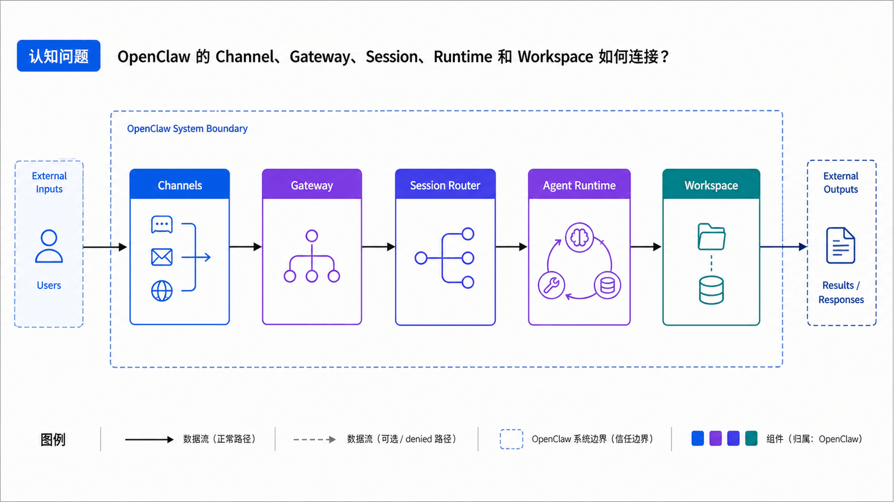
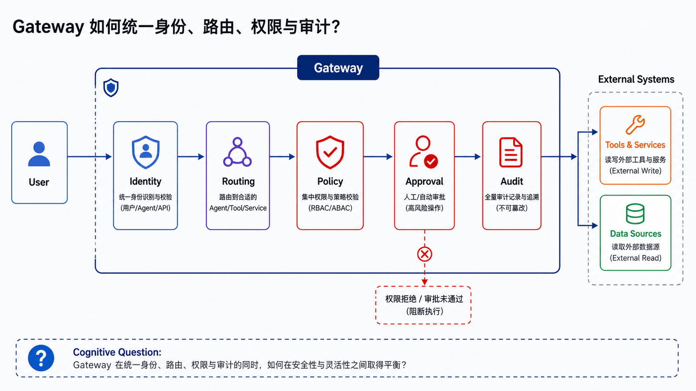
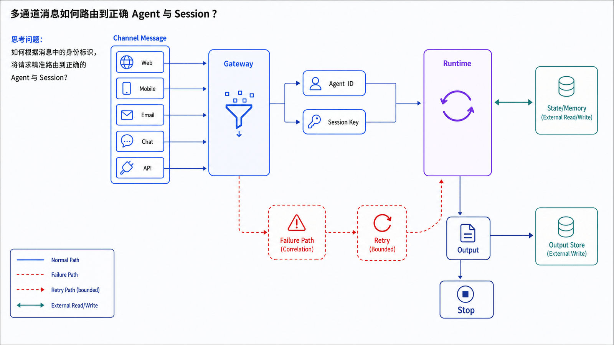
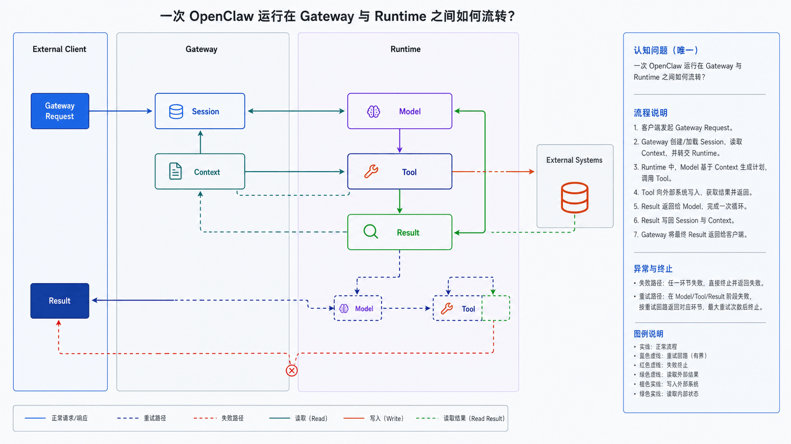
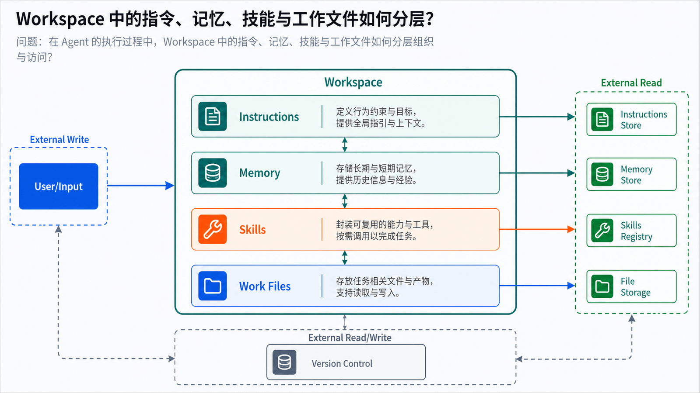
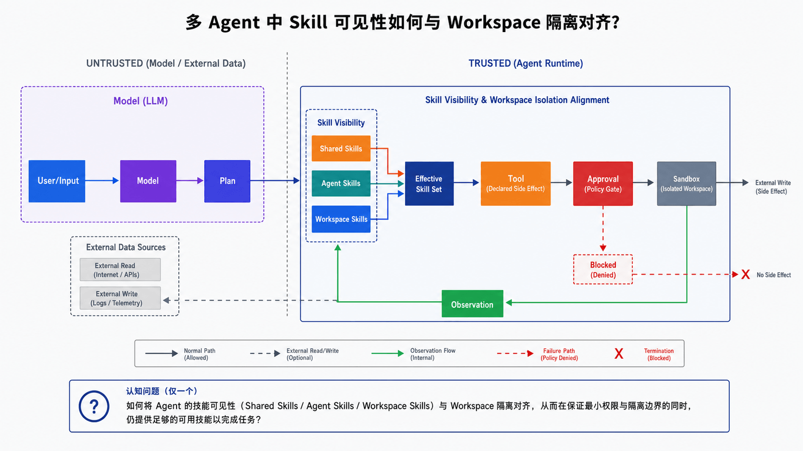
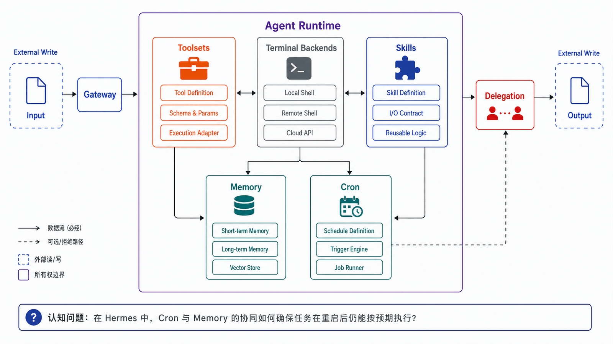
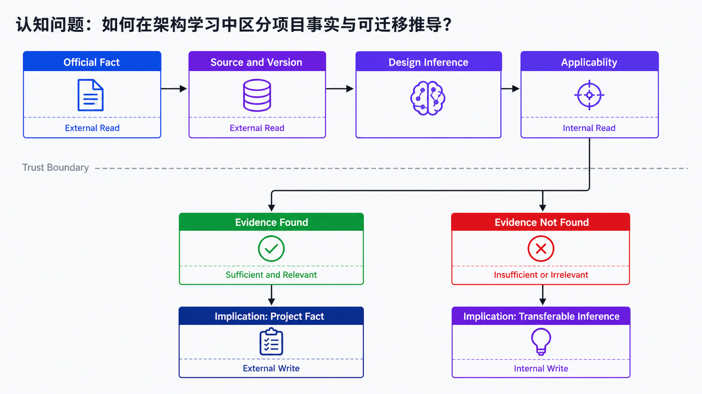
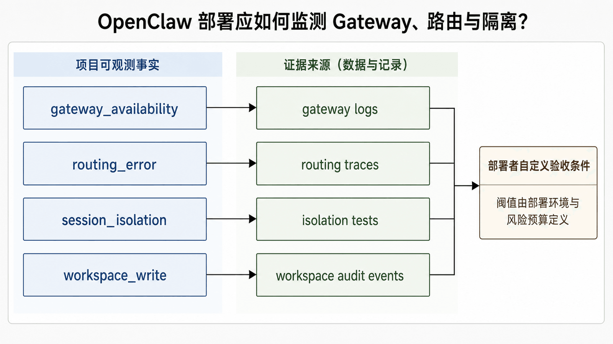

## 学习导航

**前置知识**：基础 Python、JSON、HTTP 与异步编程概念。

**适用读者**：首次系统学习生产级 Agent，并希望能独立实现、调试和评估的开发者。

**学习目标**：

- 从官方文档还原 Gateway、Channel、Session 和 Runtime
- 说清 Workspace、Tools、Skills 和 Memory 的边界
- 区分项目事实与作者推导的设计模式

**贯穿场景**：用户从两个消息通道进入同一 Gateway，但不同 Agent 的 Session、Workspace 和可见 Skills 相互隔离。

> 本文中的产品特有事实以文末官方资料为准；通用架构建议会明确标为设计推导。

## 概述

OpenClaw 的核心定位是本地优先、开源、自托管的个人 AI 助手。它不是只在网页里聊天，而是通过一个 Gateway 把多个聊天应用、Web UI、移动节点和 Agent Runtime 连接起来，让用户可以从常用入口触发真实任务。

从架构角度看，OpenClaw 最值得学习的是：它把“交互入口”和“执行环境”分离，用 Gateway 做控制平面，用 workspace 组织 Agent 的长期上下文。

## 总体架构



```text
聊天应用 / Web UI / 移动节点
        ↓
      Gateway
        ↓
  会话路由与认证
        ↓
    Agent Runtime
        ↓
  工具 / 浏览器 / 文件 / Shell
        ↓
  Workspace / Memory / Skills
```

OpenClaw 官方文档将 Gateway 描述为通道连接、会话、路由和控制面的单一来源。它支持 Discord、Google Chat、iMessage、Matrix、Microsoft Teams、Signal、Slack、Telegram、WhatsApp、Zalo 等多种通道或插件。

## Gateway 的价值



Gateway 解决了三个问题。

### 1. 多入口统一

用户不需要打开某个专用网页才能使用 Agent，可以从聊天应用触发任务。这更接近真实个人助手。

### 2. 会话路由统一



不同用户、通道、sender、agent、workspace 可以有不同会话。统一路由可以避免上下文串用。

### 3. 安全边界统一

Gateway 集中处理认证、绑定地址、远程访问、节点连接和通道策略。对于能执行真实动作的 Agent，这比把所有能力散落在多个入口里更可控。

## Agent Loop



OpenClaw 的 Agent Loop 包括：

- 消息进入
- 上下文装配
- 模型推理
- 工具执行
- 流式回复
- 持久化

在这个过程中，OpenClaw 还提供 Hook 点，例如：

- `before_agent_start`
- `agent_end`
- `before_tool_call`
- `after_tool_call`
- `message_received`
- `message_sending`
- `session_start`
- `gateway_start`

这些 Hook 让开发者可以插入审计、上下文注入、工具结果处理和自动化逻辑。

## Workspace 文件模型



OpenClaw 的 workspace 是 Agent 的家。典型文件包括：

| 文件                   | 作用                     |
| ---------------------- | ------------------------ |
| `AGENTS.md`            | Agent 操作指令           |
| `SOUL.md`              | Persona、语气和边界      |
| `USER.md`              | 用户信息和偏好           |
| `TOOLS.md`             | 本地工具约定             |
| `HEARTBEAT.md`         | 心跳任务清单             |
| `BOOT.md`              | Gateway 重启后的启动清单 |
| `MEMORY.md`            | 长期记忆                 |
| `memory/YYYY-MM-DD.md` | 每日记忆日志             |
| `skills/`              | 工作区技能               |

这个设计的优点是透明。用户可以直接查看、编辑和备份这些文件，而不是把长期上下文藏在不可见数据库中。

## Skills



OpenClaw 使用兼容 AgentSkills 的技能目录，每个技能包含 `SKILL.md`。技能来源包括：

- bundled skills
- managed/local skills
- workspace skills
- extraDirs

同名技能按优先级覆盖。Workspace skills 最高优先级，这很适合项目级定制。

## Memory

OpenClaw 将记忆放在 workspace 中，强调本地可控。每日记忆日志和长期记忆可以分层保存：

- 日志记录发生过什么
- 长期记忆保存稳定事实
- 技能保存可复用流程

这比把所有内容直接塞进长期记忆更稳。

## 安全设计



OpenClaw 的安全重点包括：

- Gateway 默认 loopback
- 非 loopback 绑定需要认证
- 远程访问优先 VPN 或 SSH tunnel
- 避免直接公网暴露
- 使用 sandbox 隔离风险执行
- 第三方 skills 按不可信代码处理

官方文档也提醒，workspace 是默认 cwd，不是硬沙箱；如果需要隔离，应启用 sandbox。

## 适用场景

OpenClaw 很适合：

- 个人多通道 AI 助手
- 聊天入口统一
- 本地文件和浏览器自动化
- 日报、提醒、定时巡检
- 个人工作流自动化
- 多项目多 Agent 隔离

不适合直接无保护地用于：

- 高权限生产操作
- 多租户公网服务
- 未审计第三方插件环境
- 需要强合规隔离的企业核心系统

## 与传统 Agent Framework 的区别

| 维度     | 传统框架            | OpenClaw                       |
| -------- | ------------------- | ------------------------------ |
| 入口     | 代码调用或 Web 应用 | 多聊天通道 + Gateway           |
| 状态     | 由应用自行实现      | workspace + sessions + memory  |
| 自动化   | 需要额外集成        | Hooks、Heartbeat、Gateway 事件 |
| 用户体验 | 开发者偏多          | 日常聊天入口                   |
| 安全重点 | 工具权限            | Gateway + workspace + sandbox  |

## 设计启发



如果自己设计个人 Agent 系统，可以借鉴 OpenClaw 的几点：

1. 用 Gateway 统一入口，不要让每个通道直接碰 Agent Runtime。
2. 用 workspace 文件承载长期上下文，让用户可见可改。
3. 将 skills 放在项目或 workspace 内，支持覆盖和定制。
4. 默认本地优先，但明确区分 workspace 和 sandbox。
5. 远程访问优先走 VPN/SSH，不把 Agent Gateway 裸露到公网。
6. 用 Hook 承载审计、记忆保存和启动流程。

## 工程补全：OpenClaw 控制面与本地工作区模型

### 接口与数据契约

- 每个项目特有结论都附官方文档页或源码路径
- 文首记录核对日期与对应发布版本/提交
- ‘可迁移启发’与‘OpenClaw 已实现’使用不同标记

### 失败路径、终止与恢复

- 通道身份不直接等于 Workspace 操作权限
- Gateway 不可达时将任务明确标为未启动，不假装成功
- 配置或 Workspace 迁移前保留可回滚备份并校验密钥不进入版本库

### 可观测性与验收



不要只保留最终回答。每次运行应该能通过 **run_id** 关联输入、决策、工具请求、工具结果、状态变更和终止原因。本篇至少跟踪：

- `gateway_availability`
- `routing_error`
- `session_isolation`
- `workspace_write`
- `approval_denied`

## 常见误区

- 本地优先不等于完全离线
- Gateway 不只是反向代理
- Workspace 透明不代表可任意写入

## 自检题

1. Gateway 作为控制面的主要价值是什么？
2. 如何在文中区分事实和设计推导？
3. 多 Agent 为什么需要 Workspace 隔离？

<details>
<summary>查看答案</summary>

1. 统一身份、路由、会话、权限、审批和审计边界。
2. 事实绑定官方文档/源码与版本；推导显式标为‘设计启发’。
3. 防止上下文泄漏、文件写冲突和权限横向扩散。

</details>

## 实操：仿 OpenClaw 建一个本地 Workspace

OpenClaw 的 workspace 文件模型很适合直接照着练。先创建一个自己的 `agent-home/`：

```text
agent-home/
  AGENTS.md
  SOUL.md
  USER.md
  TOOLS.md
  HEARTBEAT.md
  MEMORY.md
  memory/
    2026-05-16.md
  skills/
    astro-blog/
      SKILL.md
```

`AGENTS.md`：

```markdown
# Agent Instructions

- 默认使用中文回答。
- 执行文件写入前先说明将修改哪些文件。
- 高风险命令必须请求确认。
- 完成任务后给出验证结果。
```

`TOOLS.md`：

````markdown
# Local Tools

## Build

```bash
npm.cmd run build
```

## Search

```bash
rg "keyword" src
```
````

`HEARTBEAT.md`：

```markdown
# Heartbeat

- 每天检查是否有未完成草稿。
- 每周整理一次 Agent 学习笔记。
```

然后写一个加载脚本 `load_workspace.py`：

```python
from pathlib import Path

ROOT = Path("agent-home")
FILES = ["AGENTS.md", "SOUL.md", "USER.md", "TOOLS.md", "MEMORY.md"]

def load_workspace_context() -> str:
    chunks = []
    for name in FILES:
        path = ROOT / name
        if path.exists():
            chunks.append(f"\n# {name}\n{path.read_text(encoding='utf-8')}")
    return "\n".join(chunks)

if __name__ == "__main__":
    print(load_workspace_context())
```

运行：

```bash
python load_workspace.py
```

这就是 OpenClaw workspace 的最小思想：把 Agent 的身份、工具、记忆和心跳都放在用户能看懂、能编辑的文件里。

## 小结

OpenClaw 的价值不只是“能接很多聊天应用”，而是提供了一种个人 Agent 的系统架构：多通道入口、统一 Gateway、本地工作区、可编辑记忆、可复用技能和安全边界。学习 OpenClaw，可以帮助我们把 Agent 从 Demo 推向可长期使用的个人执行环境。

## 下一篇

12-Hermes Agent 架构：对比以 Toolsets、Skills、Memory 和 Delegation 为核心的系统。

## 资料来源与版本基线

- [OpenClaw Documentation](https://docs.openclaw.ai/)
- [OpenClaw Home](https://docs.openclaw.ai/)
- [OpenClaw Gateway Runbook](https://docs.openclaw.ai/gateway)
- [OpenClaw Agent Loop](https://docs.openclaw.ai/agent)
- [OpenClaw Agent workspace](https://docs.openclaw.ai/concepts/agent-workspace)
- [OpenClaw Skills](https://docs.openclaw.ai/tools/skills)
- [OpenClaw Security](https://docs.openclaw.ai/gatewaysecurity/)
- [OpenClaw Source Code](https://github.com/openclaw/openclaw)
