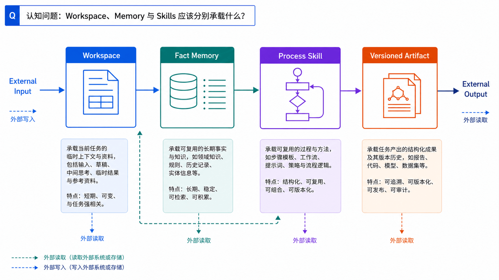
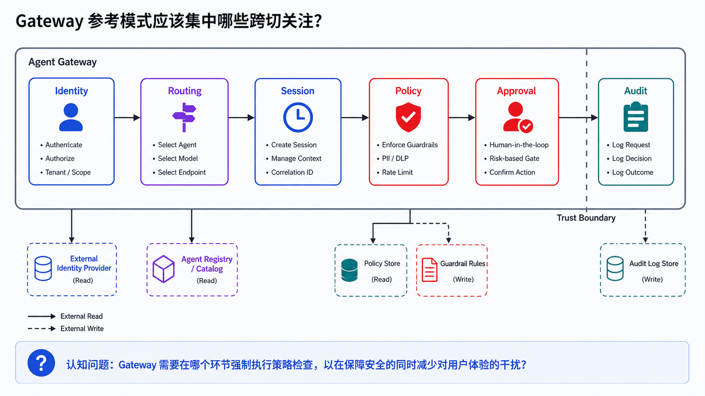
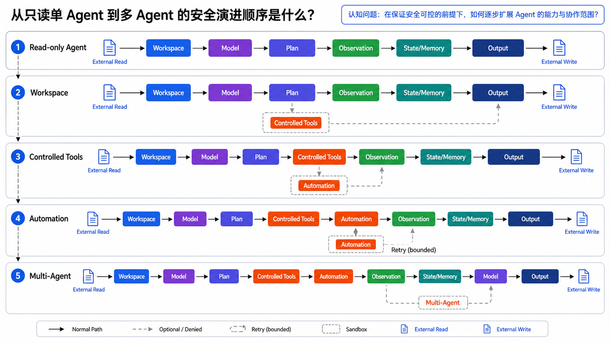
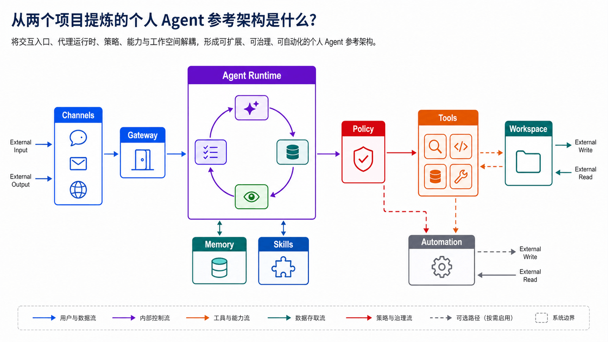

## 学习导航

**前置知识**：基础 Python、JSON、HTTP 与异步编程概念。

**适用读者**：首次系统学习生产级 Agent，并希望能独立实现、调试和评估的开发者。

**学习目标**：

- 用相同维度和证据基线对比两个系统
- 根据部署、通道、工具、记忆、自动化和安全需求选型
- 将产品实现抽象为可迁移的参考架构

**贯穿场景**：为一个需要本地工作区、移动消息入口、后台任务和受控技能库的个人助手选择基础架构。

> 本文中的产品特有事实以文末官方资料为准；通用架构建议会明确标为设计推导。

## 概述

OpenClaw 与 Hermes Agent 都属于现代个人 Agent 系统，但侧重点不同：

- OpenClaw 更像“本地优先的个人 AI Gateway”，重点是多通道入口、工作区、路由和长期在线。
- Hermes Agent 更像“会积累技能和记忆的任务执行 Agent”，重点是 toolsets、skills、memory、cron、delegation 和自改进。

把两者放在一起看，可以总结出一套比较完整的 Agent 系统设计模式。

## 总体对比




| 维度       | OpenClaw                                       | Hermes Agent                                            |
| ---------- | ---------------------------------------------- | ------------------------------------------------------- |
| 核心定位   | 本地优先个人 AI 助手 Gateway                   | 开源自改进任务执行 Agent                                |
| 主要入口   | 多聊天通道、Web UI、移动节点                   | CLI、IDE、消息平台 Gateway                              |
| 上下文组织 | Workspace 文件                                 | Skills、Memory、Sessions、Config                        |
| 工具管理   | Gateway + Agent Loop + 插件 Hook               | Toolsets + terminal backends + MCP                      |
| 记忆       | Workspace memory 文件                          | Bounded `MEMORY.md` / `USER.md` + providers             |
| 技能       | Workspace/local/bundled skills                 | Agent-managed skills + hub + curator                    |
| 自动化     | Hooks、Heartbeat、Cron/Webhook 方向            | `cronjob` 工具、delivery、fresh session                 |
| 多 Agent   | Multi-agent routing、workspace 隔离            | Delegation、Kanban、多 profile                          |
| 安全重点   | Gateway auth、loopback、sandbox、remote access | Approval、container isolation、Tirith、context scanning |

## 设计模式一：Gateway 作为控制平面



OpenClaw 最突出的模式是 Gateway。它把聊天通道、Web 控制台、节点、会话和 Agent Runtime 连接起来。

这个模式适用于所有需要多入口的 Agent：

```text
Channels
  ↓
Gateway
  ↓
Session Router
  ↓
Agent Runtime
```

好处：

- 统一认证
- 统一路由
- 统一日志
- 统一通道策略
- 易于接入新入口

Hermes Agent 也支持 Gateway 和多消息平台，但从设计关注点看，它更强调 Agent 内部能力的组织。

## 设计模式二：工具按场景分组

Hermes 的 toolsets 思路值得借鉴。工具不应该只有全局开关，而应该按场景启用：

| 场景       | 工具集                         |
| ---------- | ------------------------------ |
| 安全问答   | search、safe                   |
| 代码任务   | file、terminal、code_execution |
| 网页任务   | browser、web                   |
| 自动化任务 | cronjob、messaging             |
| 多 Agent   | delegation、kanban             |
| 高风险环境 | safe + 明确审批                |

这比“所有工具都给模型看”更安全，也更省上下文。

## 设计模式三：Workspace 承载长期上下文

OpenClaw 的 workspace 文件模型很适合个人 Agent：

- `AGENTS.md` 规定操作方式
- `USER.md` 记录用户偏好
- `TOOLS.md` 记录本地命令
- `MEMORY.md` 保存长期记忆
- `skills/` 保存项目技能

这个模式的价值是透明、可编辑、可备份。对个人项目来说，Markdown 文件比黑盒数据库更容易信任。

## 设计模式四：Skills 作为过程记忆


Hermes 的 agent-managed skills 展示了自改进 Agent 的关键路径：

```text
任务执行 → 经验总结 → Skill 创建/更新 → 后续按需加载
```

OpenClaw 也使用 AgentSkills-compatible skill folders，并支持 workspace skill 优先级。

结论：记忆保存“事实”，技能保存“方法”。两者不要混用。

## 设计模式五：记忆要有边界

Hermes 的 bounded memory 给出一个重要提醒：长期记忆必须控制容量和质量。

推荐记忆分层：

| 类型           | 保存内容                     |
| -------------- | ---------------------------- |
| USER           | 用户偏好、沟通风格、授权边界 |
| MEMORY         | 环境事实、项目约定、稳定经验 |
| Session Search | 过去会话和执行记录           |
| Skill          | 可复用流程                   |
| Daily Log      | 当日事件流水                 |

不要把聊天记录直接当长期记忆。

## 设计模式六：沙箱与审批双保险



安全上不能只依赖沙箱，也不能只依赖审批。

推荐组合：

```text
低风险读操作：允许执行 + 记录
中风险写操作：审批 + 限定目录
高风险执行：审批 + 沙箱 + 日志
生产动作：人工确认 + 最小权限凭据 + 回滚方案
```

OpenClaw 强调 Gateway 认证、loopback 和 sandbox；Hermes 强调 command approval、container isolation 和 Tirith 扫描。两者合起来，就是更完整的防护模型。

## 设计模式七：自动化必须防失控

自动化 Agent 的关键不是“会定时运行”，而是：

- 不递归创建任务
- 不重复投递
- 有超时
- 有锁
- 有结果落地
- 有暂停和删除
- 高风险动作仍需审批

Hermes Cron 中禁止 cron-run sessions 递归创建更多 cron jobs，是一个非常实用的防失控设计。

## 设计模式八：多 Agent 先隔离再协作

多 Agent 协作的第一原则是隔离：

- 隔离 workspace
- 隔离 profile
- 隔离 credentials
- 隔离写入范围
- 隔离用户记忆

然后才是协作：

- 委派任务
- 共享输入
- Kanban/队列
- 统一验收
- 合并结果

OpenClaw 的 multi-agent routing 和 Hermes 的 delegation/Kanban 可以组合成一个完整方案。

## 个人 Agent 推荐架构




如果从零设计个人 Agent，可以采用如下结构：

```text
Telegram / Web UI / CLI / Webhook
          ↓
        Gateway
          ↓
   Session Router + Auth
          ↓
      Agent Runtime
          ↓
 Toolsets + MCP + Skills + Memory
          ↓
 Sandbox / Local / Remote Backends
          ↓
 Logs + Checkpoints + Evaluation
```

基础原则：

1. Gateway 管入口。
2. Runtime 管 loop。
3. Toolsets 管能力。
4. Workspace 管上下文。
5. Skills 管流程。
6. Memory 管稳定事实。
7. Sandbox 管风险。
8. Audit 管追溯。

## 落地路线


建议分阶段实现：

### 阶段一：单入口单 Agent

- CLI 或 Web UI
- 基础工具调用
- 文件读写
- 手动审批

### 阶段二：工作区化

- 增加 `AGENTS.md`
- 增加 `USER.md`
- 增加 `MEMORY.md`
- 增加项目技能

### 阶段三：Gateway 化

- 接入聊天平台
- 增加身份识别
- 增加会话路由
- 增加消息投递

### 阶段四：自动化

- Cron
- Webhook
- Heartbeat
- 结果摘要
- 防重复和防失控

### 阶段五：多 Agent

- 按项目隔离 workspace
- 按任务委派子代理
- 引入任务队列
- 主 Agent 统一验收

## 工程补全：证据对齐的决策矩阵与分阶段落地

### 接口与数据契约

- 每个对比项使用相同的定义、版本时点和证据等级
- 决策矩阵的评价为 supported、partial、external 或 not_verified，不使用模糊的总分
- 推荐架构明确标为本文综合，不冒充任一项目官方方案

### 失败路径、终止与恢复

- 某一能力无法从官方资料确认时标为 not_verified，不做否定性推断
- 选型建议同时列出不适用条件、迁移代价和需要自建的外部能力
- 分阶段落地每阶段都有安全门和可回滚点

### 可观测性与验收

不要只保留最终回答。每次运行应该能通过 **run_id** 关联输入、决策、工具请求、工具结果、状态变更和终止原因。本篇至少跟踪：

- `requirement_coverage`
- `external_dependency`
- `migration_cost`
- `security_gap`
- `operational_complexity`

## 常见误区

- 功能数量不能直接代表适用性
- 对比不应混用不同版本和不同证据等级
- 参考架构不是要求一次性上线所有能力

## 自检题

1. 为什么对比必须锁定版本时点？
2. not_verified 与 not_supported 有什么差异？
3. 一个安全的分阶段落地顺序是什么？

<details>
<summary>查看答案</summary>

1. 项目迭代很快，不同时点的功能和安全边界不可直接比较。
2. not_verified 是证据不足；not_supported 需要官方资料或可重复测试确认缺失。
3. 单入口只读 Agent → 独立 Workspace → 受控工具与审批 → 自动化 → 多 Agent，每阶段都先建立监控和回滚。

</details>

## 实操：一个可落地的个人 Agent 目录

综合 OpenClaw 和 Hermes，可以先做这样一个本地项目：

```text
personal-agent/
  agent.py
  config.json
  workspace/
    AGENTS.md
    USER.md
    MEMORY.md
    TOOLS.md
    skills/
      astro-blog/
        SKILL.md
  tools/
    registry.py
    file_tools.py
    shell_tools.py
  tasks/
    cron_tasks.json
  logs/
```

`config.json`：

```json
{
  "enabled_toolsets": ["file", "safe_shell", "memory", "skills"],
  "workspace": "workspace",
  "require_approval": ["shell.write", "file.delete", "network.post"],
  "max_steps": 8
}
```

`agent.py` 的主流程：

```python
import json
from pathlib import Path

CONFIG = json.loads(Path("config.json").read_text(encoding="utf-8"))

def load_workspace() -> str:
    root = Path(CONFIG["workspace"])
    chunks = []
    for name in ["AGENTS.md", "USER.md", "MEMORY.md", "TOOLS.md"]:
        path = root / name
        if path.exists():
            chunks.append(f"# {name}\n{path.read_text(encoding='utf-8')}")
    return "\n\n".join(chunks)

def agent_loop(task: str) -> str:
    context = load_workspace()
    steps = []
    for i in range(CONFIG["max_steps"]):
        # 真实系统中，这里调用模型，让模型基于 context 和 steps 选择工具。
        if i == 0:
            steps.append("读取工作区上下文")
        elif i == 1:
            steps.append(f"分析任务：{task}")
        else:
            steps.append("输出结果")
            break
    return "\n".join(steps)

if __name__ == "__main__":
    print(agent_loop("生成 Agent 系列文章的改进建议"))
```

运行：

```bash
python agent.py
```

随后逐步替换：

1. 把假决策替换为 LLM function calling。
2. 把 `tools/registry.py` 接进来。
3. 给 `shell_tools.py` 加审批和沙箱。
4. 给 `skills/` 加渐进式加载。
5. 给 `tasks/cron_tasks.json` 加调度器。
6. 最后再接 Telegram、Slack 或 Web UI。

这条路线能避免一开始就陷入“大而全框架”。先让 Agent 在本地稳定跑通，再逐步加入口和自动化。

## 小结

OpenClaw 和 Hermes Agent 代表了个人 Agent 系统的两个重要方向：一个从入口和控制平面出发，一个从技能和自改进闭环出发。真正可用的 Agent 系统需要把两者结合起来：有 Gateway，才能长期在线；有 Skills 和 Memory，才能持续成长；有沙箱和审批，才能安全地做真实事情。

## 下一篇

系列结束：读者应能从一个只读单 Agent 开始，根据风险和需求渐进增加能力。

## 资料来源与版本基线

- [OpenClaw Documentation](https://docs.openclaw.ai/)
- [OpenClaw Gateway Runbook](https://docs.openclaw.ai/gateway)
- [OpenClaw Agent workspace](https://docs.openclaw.ai/concepts/agent-workspace)
- [OpenClaw Skills](https://docs.openclaw.ai/tools/skills)
- [OpenClaw Source Code](https://github.com/openclaw/openclaw)
- [Hermes Agent Docs](https://hermes-agent.nousresearch.com/docs/)
- [Hermes Agent Tools & Toolsets](https://hermes-agent.nousresearch.com/docs/user-guide/features/tools/)
- [Hermes Agent Skills System](https://hermes-agent.nousresearch.com/docs/user-guide/features/skills/)
- [Hermes Agent Security](https://hermes-agent.nousresearch.com/docs/user-guide/security/)
- [Hermes Agent Source Code](https://github.com/NousResearch/hermes-agent)
- [Model Context Protocol Specification](https://modelcontextprotocol.io/specification)
