## 学习导航

**前置知识**：了解基础 Python、HTTP、JSON，知道 Transformer 会根据已有 Token 逐步生成后续 Token。

**适用读者**：准备在本地或私有服务器上部署大语言模型，希望理解 vLLM 与 SGLang 的机制差异，而不是只复制一条启动命令的开发者。

**学习目标**：

- 区分模型、推理引擎、API 服务和业务应用
- 解释 Prefill、Decode、KV Cache、连续批处理与前缀缓存
- 理解 PagedAttention 与 RadixAttention 解决的是两个相关但不同的问题
- 启动并验证一个带基本鉴权的 OpenAI 兼容服务
- 用同一套工作负载公平比较 vLLM 与 SGLang
- 根据真实业务约束选择引擎，而不是寻找脱离条件的“绝对赢家”

**贯穿场景**：企业尽调报告系统。每个请求都包含一段很长的固定评分规则，末尾再附加不同企业的 JSON 数据，最终要求模型输出符合 Schema 的报告。

> 本文中的框架能力与命令依据 2026-07-13 可访问的稳定版官方文档核对。vLLM 与 SGLang 都在快速迭代，真正部署时仍应以所安装版本的文档和 `--help` 为准。

## 先说结论

vLLM 和 SGLang 都不是大模型，也不会让一个能力较弱的模型突然回答得更好。它们是位于业务应用和模型之间的**推理与服务引擎**：负责加载模型、管理显存、调度并发请求、生成 Token，并通过 HTTP API 对外提供服务。

```text
业务应用 / Agent / RAG / Dify
              ↓ HTTP API
       vLLM 或 SGLang
              ↓
模型权重 + Tokenizer + Chat Template
              ↓
        GPU / NPU / CPU
```

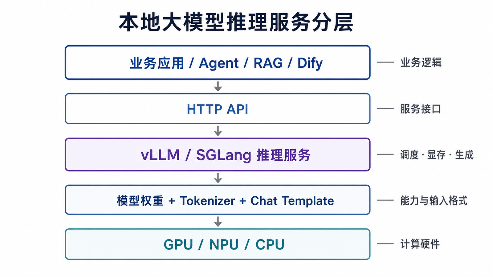

可以先记住三个判断：

1. 常规 OpenAI 兼容服务中，两者都应进入候选集。
2. 请求存在大量公共长前缀时，需要重点测试前缀缓存，而不能只看普通吞吐。
3. 最终选择必须来自同一模型、同一硬件和同一请求集上的压测。

“vLLM 只能聊天、SGLang 只能运行 Agent”是错误的二分。现代版本的两套框架都覆盖连续批处理、分页式 KV 管理、前缀缓存、结构化输出、量化、并行推理和多模态等多种能力。区别更多体现在代表性设计、模型与硬件适配、调度实现、性能特征和运维生态，而不是简单的功能有无。

## 一、一次生成请求是怎样执行的

理解推理引擎前，需要先把一次请求分成 Prefill 和 Decode 两个阶段。

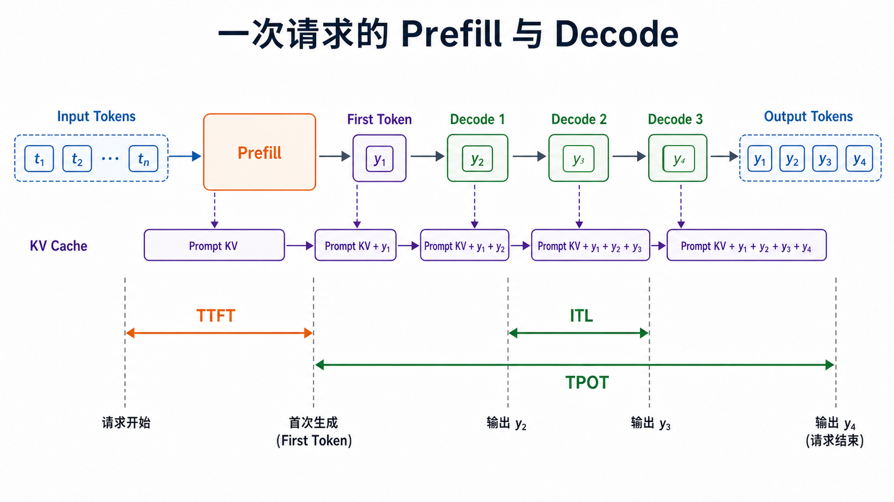

### 1. Prefill：读取输入并建立 KV Cache

假设输入是：

> 请根据以下规则分析企业 A……

模型会并行处理已有的输入 Token，并为每层注意力计算 Key 和 Value。产生的这些中间状态被保存为 **KV Cache**，后续生成时不必重复计算整个历史上下文。

长 Prompt 会增加 Prefill 计算量，因此通常会明显影响首个 Token 返回时间。

### 2. Decode：逐 Token 生成

Prefill 完成后，模型开始生成第一个新 Token。随后每次 Decode 都会：

1. 读取已有 KV Cache
2. 计算一个或少量新 Token
3. 将新 Token 的 Key、Value 追加到缓存
4. 返回结果并进入下一步

Decode 是自回归过程，后一个 Token 依赖前一个 Token，因此不能像 Prefill 那样把整个输出一次性并行算完。

### 3. 延迟指标分别在测什么

| 指标        | 含义                                                  | 主要受什么影响            |
| ----------- | ----------------------------------------------------- | ------------------------- |
| TTFT        | Time To First Token，收到请求到首个 Token 返回        | 排队、Prefill、调度、网络 |
| ITL         | Inter-Token Latency，相邻输出 Token 的间隔            | Decode、批调度、硬件负载  |
| TPOT        | Time Per Output Token，首 Token 后的平均单 Token 时间 | Decode 阶段整体表现       |
| E2E Latency | 请求从发出到全部输出完成的时间                        | TTFT、输出长度、ITL、网络 |

TTFT 很低不代表长文本生成一定快；总 Tokens/s 很高也不代表每个在线用户的等待体验一定好。线上评估应同时观察延迟分位数、吞吐和错误率。

## 二、KV Cache 为什么会成为瓶颈

如果每次生成新 Token 都重新计算全部历史 Token，成本会非常高。KV Cache 用显存换计算，但它会随着上下文长度和并发请求数增长。

对采用 GQA/MQA 的常见模型，单条序列的 KV Cache 可以用下面的式子近似估算：

$$
M_{KV} \approx 2 \times L \times T \times H_{kv} \times D_h \times B
$$

其中：

- $2$ 表示 Key 和 Value 两份缓存
- $L$ 是 Transformer 层数
- $T$ 是已缓存 Token 数
- $H_{kv}$ 是 KV Head 数量，不一定等于 Query Head 数量
- $D_h$ 是单个 Head 的维度
- $B$ 是每个元素占用的字节数

### 一个可复核的算例

假设模型有 32 层，缓存 8192 个 Token，使用 8 个 KV Heads，Head Dim 为 128，KV Cache 使用 BF16：

$$
2 \times 32 \times 8192 \times 8 \times 128 \times 2
= 1,073,741,824\ \text{bytes}
\approx 1\ \text{GiB}
$$

这意味着仅一条长序列就可能占用约 1 GiB KV Cache。并发 16 条同长度序列时，理论缓存需求可接近 16 GiB。

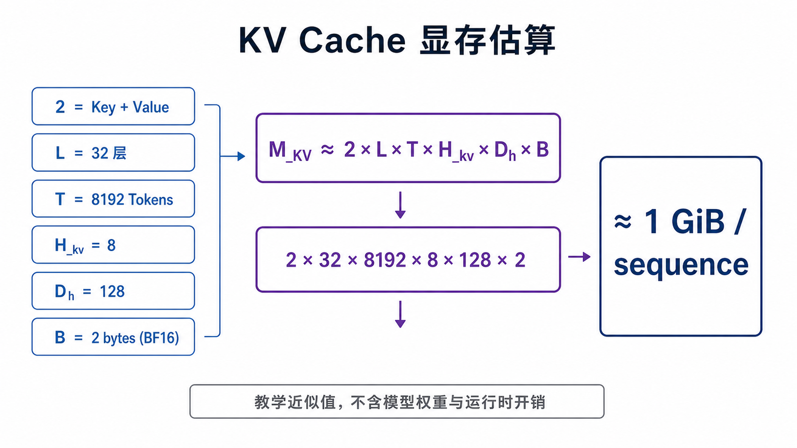

这只是教学近似值，没有计入：

- 模型权重
- 激活值与临时工作区
- CUDA Graph 等运行时开销
- 内存对齐和 Block 元数据
- 多模态 Encoder Cache
- 不同 KV Cache dtype 与框架实现差异

所以“权重能够放进显存”不等于“服务能够承载目标并发”。

## 三、三个容易混淆的优化

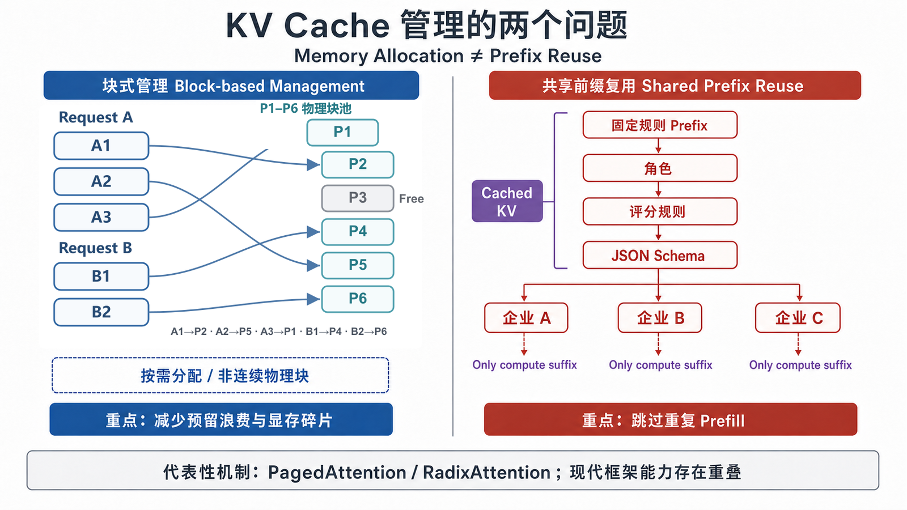

### 1. 分页式 KV 管理：解决怎样分配显存

传统实现可能为每条请求预留一段较大的连续显存，但实际输出长度在开始生成前并不确定。请求有长有短时，容易形成内部浪费和外部碎片。

分页式管理把 KV Cache 划分为固定大小的逻辑 Block，再将逻辑 Block 映射到不连续的物理显存块。请求需要更多空间时按需申请，结束时释放。

它主要回答：

> 一条不断增长的序列，怎样高效取得和释放 KV Cache 空间？

vLLM 的代表性设计 PagedAttention 正是围绕这一问题提出的。现代 SGLang 同样具有分页式注意力和 KV Cache 管理能力，因此不能把“分页”理解为今天只有 vLLM 才能做的事。

### 2. 连续批处理：解决什么时候把请求送进 GPU

静态批处理需要等待同一批请求全部结束。若请求 C 很短、请求 A 很长，C 完成后留下的位置可能一直空闲到 A 结束。

连续批处理允许在调度迭代之间移出已完成请求，并加入等待中的新请求：

```text
时刻 1：A  B  C
时刻 2：A  B  C（C 完成）
时刻 3：A  B  D（D 立即加入）
```

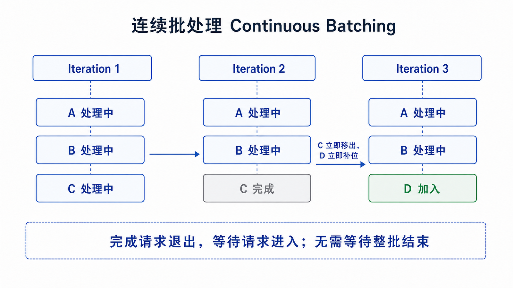

它主要回答：

> 多条长度不同的请求，怎样持续组成有效批次？

vLLM 和 SGLang 都支持连续批处理。实际效果还取决于调度策略、最大并发序列、Token Budget、Chunked Prefill 和具体负载。

### 3. 前缀缓存：解决哪些输入不应重复 Prefill

企业尽调请求可能拥有完全相同的公共部分：

```text
固定角色 + 固定评分规则 + 固定输出 Schema + 企业 A 数据
固定角色 + 固定评分规则 + 固定输出 Schema + 企业 B 数据
固定角色 + 固定评分规则 + 固定输出 Schema + 企业 C 数据
```

如果公共前缀已经计算过，后续请求可以复用对应 KV Cache，只计算不同的企业数据后缀。

它主要回答：

> 新请求与历史请求共享一段开头时，怎样跳过重复的 Prefill？

SGLang 的 RadixAttention 使用 Radix Tree 组织和匹配不同请求的公共前缀，是其最具代表性的设计之一。vLLM 也提供 Automatic Prefix Caching。因此，公平对比需要测试不同的前缀长度、复用比例、缓存容量和逐出行为，而不是只比较“是否支持缓存”。

## 四、vLLM 是什么

vLLM 是面向大模型推理与服务的开源引擎，最初由加州大学伯克利分校 Sky Computing Lab 开发。PagedAttention 是它最具代表性的技术，但今天的 vLLM 已经覆盖更完整的 serving 能力。

### 1. 主要能力

- PagedAttention 与高效 KV Cache 管理
- 连续批处理和 Chunked Prefill
- Automatic Prefix Caching
- OpenAI 兼容 API 与流式输出
- JSON Schema、正则和 Grammar 等结构化输出
- 多种量化、Attention Kernel 和推测解码
- Tensor、Pipeline、Data、Expert 等并行方式
- 文本、多模态、Embedding、Rerank 等模型类型

能力是否可用仍取决于框架版本、模型架构、硬件后端和启动参数。

### 2. 适合优先验证的场景

- 需要通用 OpenAI 兼容模型服务
- 需要接入 Dify、RAGFlow、LangChain 或 LlamaIndex
- 需要在线聊天、RAG、批量生成或离线推理
- 团队希望先从成熟的通用 serving 工作流开始
- 目标模型和硬件在 vLLM 中已有明确支持路径

这不是排他条件，SGLang 也能完成其中的大多数任务。

## 五、用 vLLM 启动最小服务

### 1. 部署前检查

至少记录：

- 操作系统与 Python 版本
- GPU 型号与显存
- 驱动、CUDA 或 ROCm 版本
- vLLM 版本与安装方式
- 模型 ID、revision、Tokenizer 和许可证
- dtype、量化方式、并行度与最大上下文

官方 Quickstart 的常见路径是 Linux 环境。不同 GPU、CPU、TPU 或 NPU 应使用各自硬件页面的安装说明，不应混用 Wheel 和 CUDA 版本。

### 2. 启动服务

以下使用较小模型演示接口，不代表生产模型选择：

```bash
export MODEL="Qwen/Qwen2.5-1.5B-Instruct"
export LOCAL_LLM_API_KEY="replace-with-a-random-secret"

vllm serve "$MODEL" \
  --host 127.0.0.1 \
  --port 8000 \
  --dtype auto \
  --api-key "$LOCAL_LLM_API_KEY"
```

默认绑定 `127.0.0.1`，避免把开发服务直接暴露到公网。需要供其他机器访问时，应放在防火墙和反向代理后，再按网络拓扑决定是否绑定 `0.0.0.0`。

如果模型无法放入单卡，才根据模型大小和硬件拓扑评估 `--tensor-parallel-size`。并行度不是越大越好；它会引入通信成本。

### 3. 检查模型列表

```bash
curl http://127.0.0.1:8000/v1/models \
  -H "Authorization: Bearer $LOCAL_LLM_API_KEY"
```

### 4. 用 OpenAI Python 客户端调用

```python
import os
from openai import OpenAI

model = "Qwen/Qwen2.5-1.5B-Instruct"

client = OpenAI(
    base_url="http://127.0.0.1:8000/v1",
    api_key=os.environ["LOCAL_LLM_API_KEY"],
)

response = client.chat.completions.create(
    model=model,
    messages=[{"role": "user", "content": "用一句话解释 KV Cache。"}],
    temperature=0,
    max_tokens=128,
)

print(response.choices[0].message.content)
```

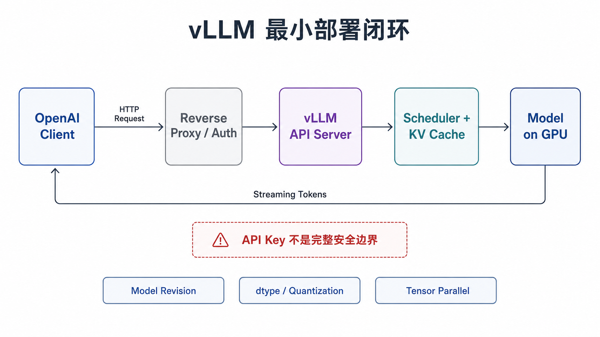

需要注意：服务会使用模型 Tokenizer 中的 Chat Template；部分模型还会通过 `generation_config.json` 覆盖采样默认值。做对比实验时必须显式固定采样参数，并核对两端最终渲染出的 Prompt。

## 六、SGLang 是什么

SGLang 是面向语言模型和多模态模型的高性能 serving 框架。项目早期名称来自 Structured Generation Language，并包含用于描述复杂生成程序的前端语言；现代 SGLang 的使用范围已经扩展为完整的生产级推理运行时。

### 1. 主要能力

- 以 RadixAttention 为代表的自动前缀缓存
- 分页式注意力与连续批处理
- Chunked Prefill、推测解码和 Prefill/Decode 分离
- JSON、正则、EBNF 等结构化输出
- Reasoning Parser 与 Tool Parser
- 多种量化与 Attention Backend
- Tensor、Pipeline、Data、Expert 等并行方式
- 文本、多模态、Embedding、Reward 与 Diffusion 等模型支持

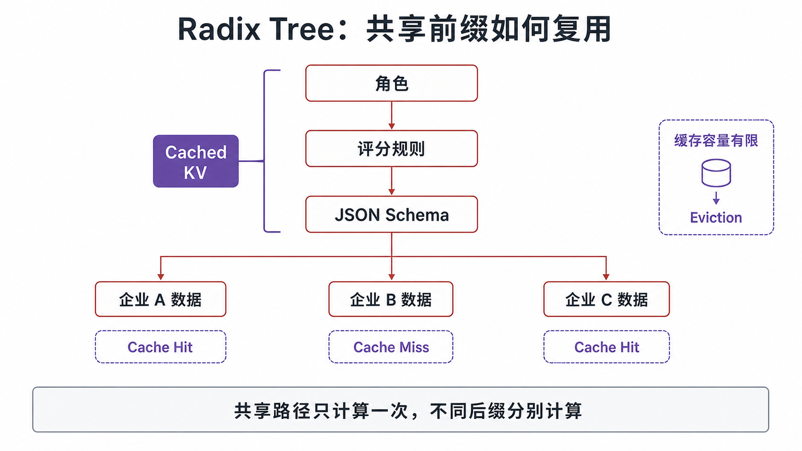

### 2. 适合重点验证的场景

- 系统提示词、Few-shot 示例或工具说明很长
- 大量请求共享相同规则或文档前缀
- 需要严格 JSON、工具参数或其他受约束输出
- 需要测试复杂推理模型、Agent 工作流或多模态模型
- 目标模型和硬件在 SGLang 中有明确的优化路径

“适合重点验证”不等于未经压测就一定更快。前缀很短、复用率低或缓存频繁逐出时，Radix Cache 的业务收益可能有限。

## 七、用 SGLang 启动最小服务

### 1. 固定安装版本

SGLang 官方同时提供 pip/uv、源码和 Docker 等安装方式。`latest` 与 `dev` 是会变化的标签；生产环境应固定不可变版本，例如：

```text
lmsysorg/sglang:vX.Y.Z-runtime
```

具体版本、CUDA 变体和硬件支持以部署当天的官方安装页为准。不要把文中的示例版本当成永久推荐。

### 2. 启动服务

```bash
export MODEL="Qwen/Qwen2.5-1.5B-Instruct"
export LOCAL_LLM_API_KEY="replace-with-a-random-secret"

python3 -m sglang.launch_server \
  --model-path "$MODEL" \
  --host 127.0.0.1 \
  --port 30000 \
  --api-key "$LOCAL_LLM_API_KEY"
```

若模型需要特殊 Thinking 模式、Reasoning Parser 或 Tool Parser，应按模型文档添加对应参数。不能把某个 Qwen、DeepSeek 或 Llama 模型的 Parser 配置直接套到另一模型。

### 3. 复用相同客户端代码

将前面的客户端改为：

```python
client = OpenAI(
    base_url="http://127.0.0.1:30000/v1",
    api_key=os.environ["LOCAL_LLM_API_KEY"],
)
```

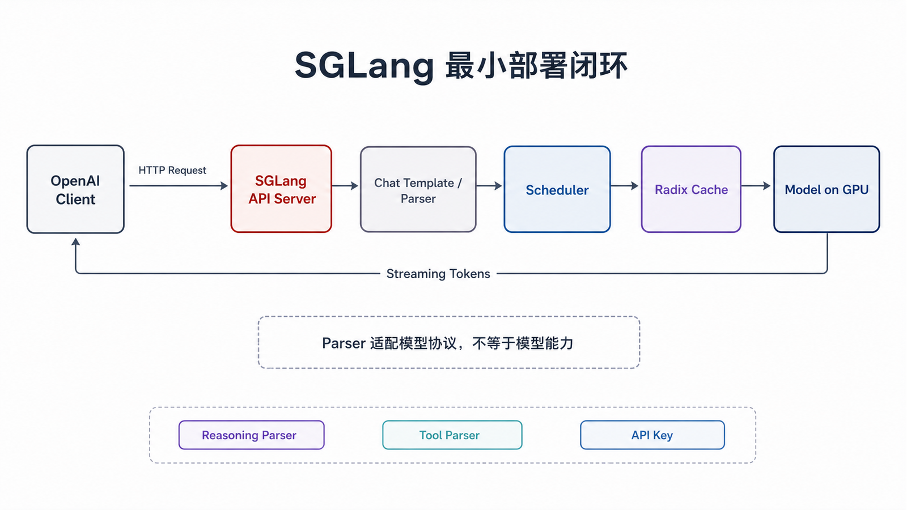

模型名、Messages、采样参数和最大输出长度保持不变，才能做基础功能对照。

## 八、两者应该怎样比较

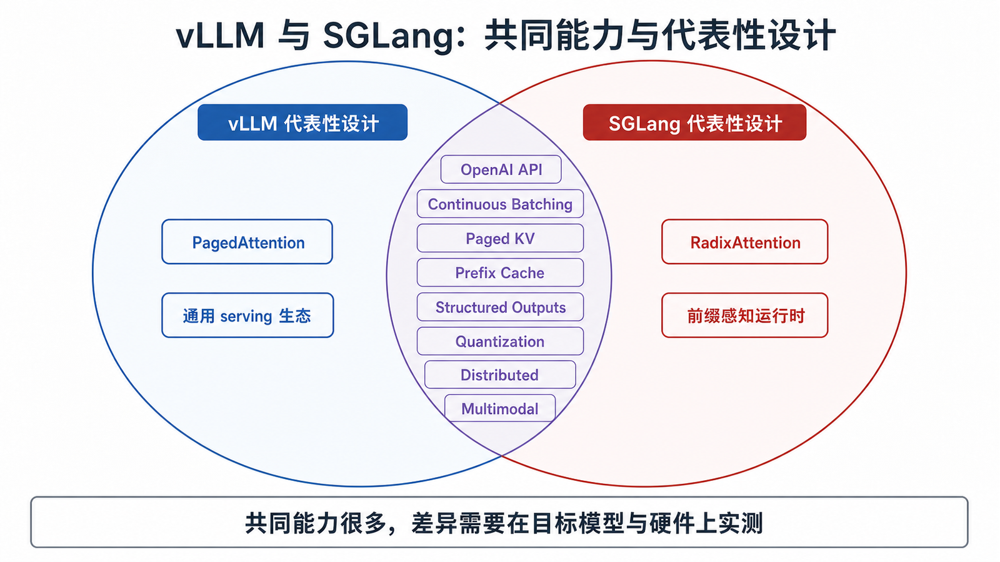

### 1. 共同能力

| 能力            | vLLM         | SGLang       | 验证重点                          |
| --------------- | ------------ | ------------ | --------------------------------- |
| OpenAI 兼容服务 | 支持         | 支持         | 实际端点、字段、Chat Template     |
| 连续批处理      | 支持         | 支持         | 并发下的吞吐与尾延迟              |
| 分页式 KV 管理  | 支持         | 支持         | Block 配置、显存利用和 OOM 边界   |
| 前缀缓存        | 支持         | 支持         | 命中率、逐出、长前缀收益          |
| 结构化输出      | 支持         | 支持         | Schema 合规率和语义正确率         |
| 量化与多 GPU    | 支持多种方案 | 支持多种方案 | 目标模型、硬件和精度回归          |
| 多模态          | 持续扩展     | 核心定位之一 | 具体模型、媒体限制和 Encoder 开销 |

### 2. 代表性设计

| 维度             | vLLM                    | SGLang                     |
| ---------------- | ----------------------- | -------------------------- |
| 代表性技术       | PagedAttention          | RadixAttention             |
| 最直观的问题意识 | 高效分配和调度 KV Cache | 自动匹配并复用共享前缀     |
| 常见生态印象     | 通用 serving 生态成熟   | 前缀感知和复杂推理能力突出 |

代表性技术有助于理解项目，但不能代替当前版本的完整能力表，更不能直接推出性能排名。

## 九、本地部署时怎样选

按下面的顺序决策，比先问“哪个框架更快”更可靠。

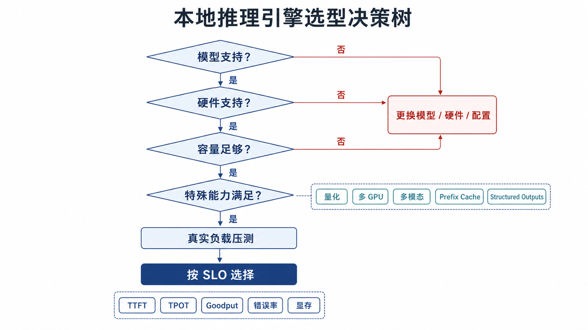

### 第一步：检查硬约束

1. 目标模型是否被支持？
2. GPU、驱动、CUDA/ROCm/NPU 后端是否被支持？
3. 单卡是否能容纳权重、KV Cache 和运行时空间？
4. 是否必须使用特定量化、LoRA、多模态或并行方案？

任一硬约束不满足，就不应进入性能对比。

### 第二步：描述真实流量

至少回答：

- 输入和输出 Token 的 P50/P95 是多少？
- 请求到达是均匀、突发还是批量？
- 有多少请求共享相同前缀，共享长度多长？
- 是否大量使用 JSON Schema、工具调用或 Thinking 模式？
- 更看重 TTFT、持续生成速度、吞吐还是成本？

### 第三步：建立候选假设

- 通用聊天与 RAG：同时验证两者，以兼容性和整体 SLO 为准。
- 长公共规则与批量报告：增加共享前缀专项测试。
- 严格 JSON：增加 Schema 合规率与字段正确率测试。
- 多模态或新模型：先验证模型卡、Kernel 和硬件支持，再比较性能。

### 第四步：让压测决定

不要用官方项目之间不同硬件、不同模型、不同输入长度的数字直接排名。官方 benchmark 适合证明某种配置可以达到什么结果，不一定能代表你的业务。

## 十、设计一组公平压测

### 1. 五类工作负载

| 工作负载             | 示例                | 主要观察                  |
| -------------------- | ------------------- | ------------------------- |
| 短输入、短输出       | 普通问答            | 调度与通用基线            |
| 长输入、短输出       | 长文摘要            | Prefill、TTFT             |
| 短输入、长输出       | 报告续写            | Decode、ITL、TPOT         |
| 长公共前缀、不同后缀 | 评分规则 + 企业数据 | Cache 命中与 Prefill 节省 |
| 严格 JSON Schema     | 结构化评分结果      | 延迟、Schema 与业务正确率 |

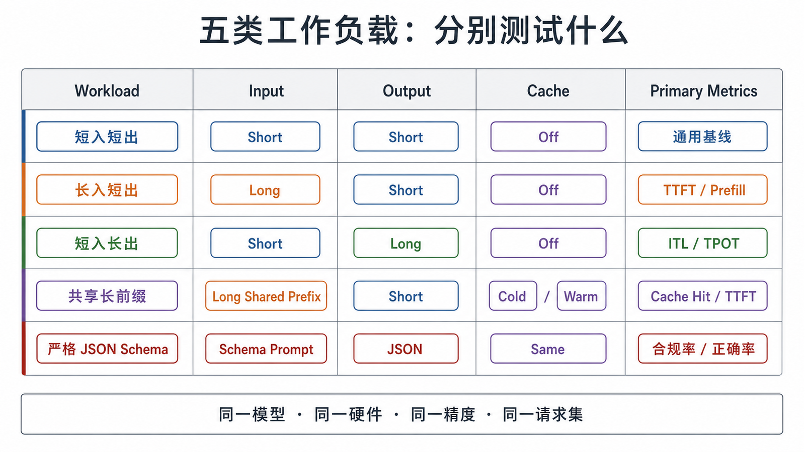

### 2. 必须固定的变量

- 同一个模型 ID 和 revision
- 同一个 Tokenizer 与 Chat Template
- 同一台 GPU、驱动和运行时
- 相同 dtype、量化方式和并行度
- 相同上下文长度与输出上限
- 相同采样参数和停止条件
- 相同请求数据、到达率和并发上限
- 相同 warm-up 策略
- 冷缓存与热缓存分开记录

仅仅设置相同 `max_tokens` 并不够。若一个服务提前遇到 EOS，而另一个被强制生成固定长度，吞吐结果也无法公平比较。

### 3. 需要同时报告的指标

| 指标                    | 正确解读                              |
| ----------------------- | ------------------------------------- |
| Request Throughput      | 每秒完成多少请求                      |
| Input Token Throughput  | 每秒处理多少输入 Token                |
| Output Token Throughput | 每秒生成多少输出 Token                |
| TTFT P50/P95/P99        | 首 Token 延迟分布                     |
| ITL/TPOT P50/P95/P99    | 持续生成流畅度                        |
| E2E P50/P95/P99         | 完整请求体验                          |
| Goodput                 | 满足指定 TTFT/TPOT/E2E SLO 的请求吞吐 |
| 错误率/超时率           | 无效吞吐和稳定性                      |
| 峰值显存                | 容量边界和 OOM 风险                   |
| Cache Hit Rate          | 公共前缀是否真正被复用                |
| Schema 合规率           | 输出是否满足语法约束                  |
| 业务字段正确率          | JSON 内容是否真的正确                 |

P95 延迟表示约 95% 的请求延迟不超过该值，不是“95% 请求中的最大值”。

### 4. 保存实验清单

每次结果旁边保存：

```yaml
framework: vllm-or-sglang
framework_version: x.y.z
model: Qwen/Qwen2.5-1.5B-Instruct
model_revision: commit-or-tag
gpu: exact-model-and-count
driver: exact-version
runtime: cuda-or-rocm-version
dtype: bf16-or-other
quantization: none-or-method
parallelism: tp-dp-pp-values
workload: shared-prefix
input_tokens_p50: value
input_tokens_p95: value
output_tokens_p50: value
request_rate: value
max_concurrency: value
cache_state: cold-or-warm
seed: value
```

没有这些元数据，结果很难复现，也无法解释升级前后的变化。

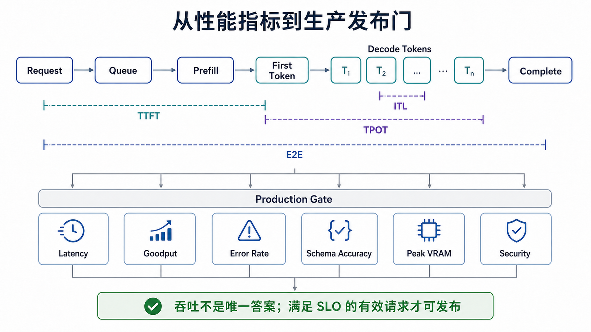

## 十一、生产部署不能只看启动成功

### 1. 网络与鉴权

- 开发时默认绑定本机或内网地址
- 使用防火墙和反向代理只暴露必要端点
- 配置 TLS、限流、超时和请求体大小
- 分离普通推理权限与管理端点权限
- 不把 Token、Prompt 或企业数据写入公开日志

`--api-key` 只是基本措施，不是完整安全边界。以 vLLM 为例，官方安全文档明确说明 API Key 主要保护特定路径，不能替代防火墙、反向代理和最小暴露面。

### 2. 可复现和可回滚

- 固定容器镜像、Python 包和模型 revision
- 保存完整启动参数
- 升级前运行相同回归集
- 对性能、输出质量和结构化成功率设置发布门
- 保留上一版本镜像和配置，支持快速回滚

### 3. 监控与容量

至少监控：

- 请求队列与运行中请求数
- TTFT、ITL、E2E 的分位数
- 输入/输出 Token 吞吐
- KV Cache 使用率和命中率
- GPU 利用率、显存和 OOM
- 取消、超时、5xx 与结构化输出失败

单纯观察 GPU 利用率无法判断用户体验，也不能说明缓存是否有效。

## 十二、常见误区

### 误区 1：本地部署就必须使用 vLLM 或 SGLang

个人电脑上的低并发体验、CPU/Apple Silicon 或 GGUF 模型，可能更适合 Ollama、llama.cpp 等工具。本文比较的是高性能 serving 候选，不覆盖所有本地运行方式。

### 误区 2：PagedAttention 等于前缀缓存

PagedAttention 主要处理 KV Cache 的块式分配与访问；前缀缓存主要复用已有请求的公共前缀计算。两者可以组合，但不是同一个概念。

### 误区 3：支持 OpenAI API 就是完全兼容

不同服务支持的端点、字段、默认采样参数、Chat Template、Reasoning Parser 和 Tool Parser 可能不同。迁移必须做契约测试。

### 误区 4：前缀缓存总能加速

没有相同前缀、前缀过短、请求之间间隔过长或缓存频繁逐出时，收益会下降。缓存主要减少重复 Prefill，并不会让后续 Decode 自动变快。

### 误区 5：JSON 合法就代表任务成功

约束解码可以提高语法和 Schema 合规率，但 `score: 83` 是否合理仍取决于模型、输入数据和业务校验。

### 误区 6：Tokens/s 最高的框架就是最佳选择

线上系统还需要考虑 TTFT、P95/P99、错误率、Goodput、显存、模型兼容、部署复杂度和升级风险。

## 自检题

### 1. Prefill、Decode、TTFT 和 TPOT 分别是什么关系？

<details>
<summary>查看答案</summary>

Prefill 处理输入并建立 KV Cache，通常显著影响 TTFT；Decode 在已有缓存上逐 Token 生成，ITL/TPOT 主要反映这一阶段的持续生成表现。TTFT 与 TPOT 关注的是请求生命周期中的不同部分。

</details>

### 2. PagedAttention 和 Prefix Cache 是否解决同一个问题？

<details>
<summary>查看答案</summary>

不是。PagedAttention 主要解决 KV Cache 怎样按 Block 分配、增长和访问；Prefix Cache 解决多个请求共享相同开头时怎样复用已经计算出的 KV Cache。两者相关，但不能互换。

</details>

### 3. 怎样公平测试企业报告场景中的前缀缓存？

<details>
<summary>查看答案</summary>

使用同一模型、硬件、精度、Chat Template 和请求到达方式；构造长度固定的公共评分规则以及不同企业后缀；分别运行冷缓存和热缓存实验；记录 TTFT、吞吐、Cache Hit Rate、错误率和结果正确率，并改变共享前缀比例观察收益曲线。

</details>

## 总结

vLLM 的 PagedAttention 帮助我们理解怎样高效管理不断增长的 KV Cache；SGLang 的 RadixAttention 帮助我们理解怎样组织并复用请求之间的公共前缀。但这两项代表技术不是今天两套框架的全部能力，更不构成非此即彼的功能边界。

真正可靠的选择过程是：

1. 先验证模型和硬件兼容性
2. 再估算权重与 KV Cache 容量
3. 用真实业务描述输入、输出、并发和前缀复用
4. 在相同条件下比较延迟、吞吐、Goodput、错误率和正确率
5. 把安全、监控、升级和回滚一并纳入决策

对于普通聊天和 RAG，vLLM 与 SGLang 都值得测试；对于固定长规则、批量报告和严格结构化输出，应额外构造共享前缀与 Schema 专项实验。最终答案不在功能宣传页里，而在你的模型、硬件和业务请求上。

## 对应资料来源

### vLLM

- [vLLM 官方文档](https://docs.vllm.ai/)
- [vLLM Quickstart](https://docs.vllm.ai/en/latest/getting_started/quickstart/)
- [vLLM OpenAI-Compatible Server](https://docs.vllm.ai/en/stable/serving/openai_compatible_server/)
- [vLLM Automatic Prefix Caching](https://docs.vllm.ai/en/stable/features/automatic_prefix_caching/)
- [vLLM Structured Outputs](https://docs.vllm.ai/en/stable/features/structured_outputs/)
- [vLLM Security](https://docs.vllm.ai/en/latest/usage/security/)
- [vLLM GitHub](https://github.com/vllm-project/vllm)
- [Efficient Memory Management for Large Language Model Serving with PagedAttention](https://arxiv.org/abs/2309.06180)

### SGLang

- [SGLang 官方文档](https://docs.sglang.ai/)
- [SGLang Installation](https://docs.sglang.io/docs/get-started/install)
- [SGLang OpenAI-Compatible APIs](https://docs.sglang.io/docs/basic_usage/openai_api_completions)
- [SGLang Structured Outputs](https://docs.sglang.io/docs/advanced_features/structured_outputs)
- [SGLang Benchmark Serving](https://docs.sglang.ai/developer_guide/bench_serving)
- [SGLang Production Metrics](https://docs.sglang.io/docs/references/production_metrics)
- [SGLang GitHub](https://github.com/sgl-project/sglang)
- [SGLang: Efficient Execution of Structured Language Model Programs](https://arxiv.org/abs/2312.07104)
