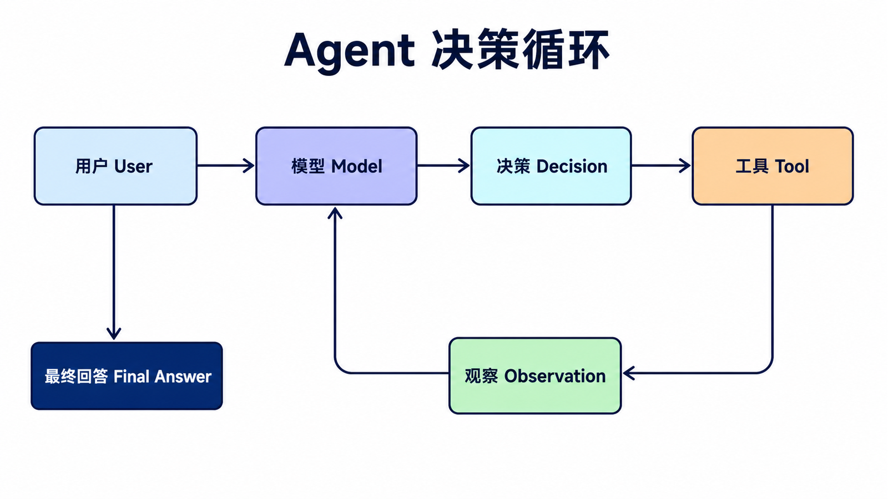
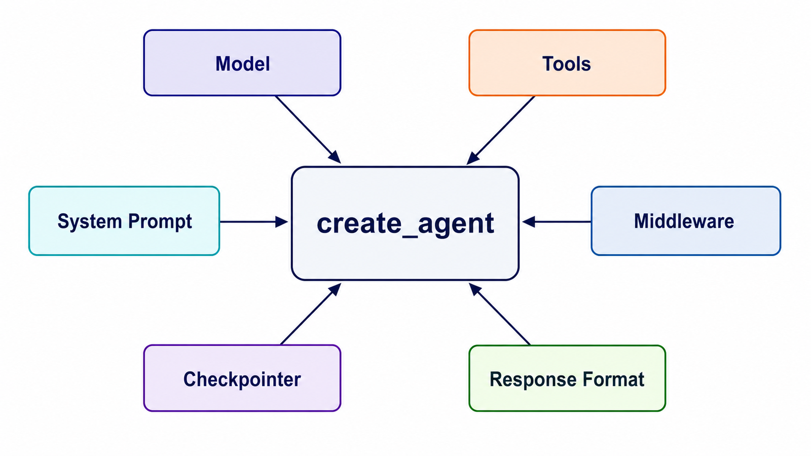
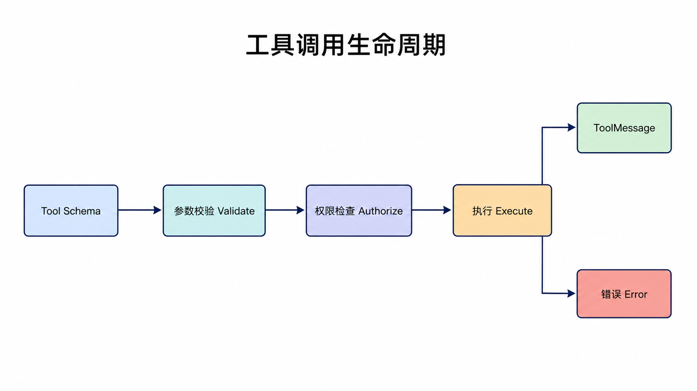
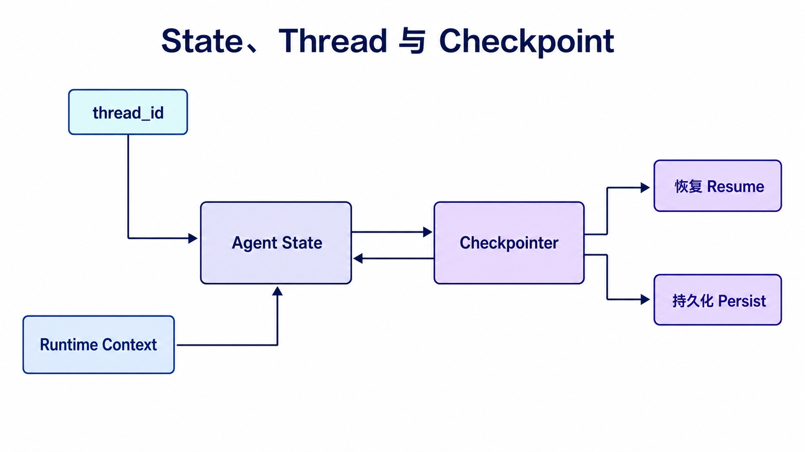
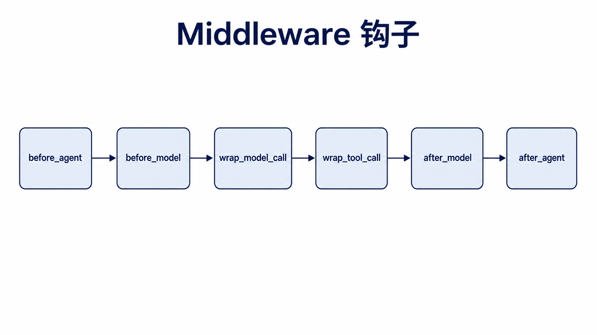
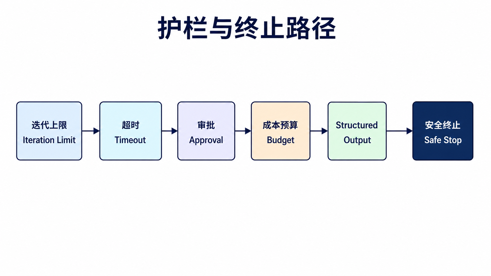

## 阅读指南

**前置知识：** 理解 Chat Model、Tool Schema、Runnable 和 `thread_id` 的基本作用。

**学完本文你应该能：** 解释 Agent 循环；使用 `create_agent` 定义工具和结构化响应；选择 middleware、state 与 context 的扩展点；为迭代、权限和工具失败设置边界。

## 概述

Agent（智能代理）是 LangChain v1.x 的核心功能，它赋予 LLM 自主决策和执行任务的能力。v1 使用 `create_agent` 作为标准入口，基于 LangGraph 构建，并提供状态管理和持久化扩展点。

可以把 Agent 理解成“模型 + 执行外壳”：模型负责判断下一步，执行外壳负责把工具、提示词、状态和中间过程组织起来。学习 Agent 时，最重要的不是一次记住所有参数，而是看清楚模型什么时候自己回答、什么时候请求工具、工具结果又如何回到模型。

### Agent 工作原理



## create_agent 基础用法



### 最小示例

```python
from langchain.agents import create_agent
from langchain_openai import ChatOpenAI
from langchain_core.tools import tool

@tool
def get_weather(city: str) -> str:
    """获取指定城市的天气信息

    Args:
        city: 城市名称

    Returns:
        天气信息字符串
    """
    return f"{city}今天天气晴朗，温度25-30°C"

@tool
def calculate(expression: str) -> str:
    """执行数学计算

    Args:
        expression: 数学表达式，如 "2 + 3"

    Returns:
        计算结果
    """
    import operator

    ops = {"+": operator.add, "-": operator.sub, "*": operator.mul, "/": operator.truediv}
    left, op, right = expression.split()
    return str(ops[op](float(left), float(right)))

llm = ChatOpenAI(model="gpt-4o", temperature=0)

agent = create_agent(
    model=llm,
    tools=[get_weather, calculate],
    system_prompt="你是一个助手，可以访问一组工具来回答问题。"
)

result = agent.invoke({
    "messages": [{"role": "user", "content": "北京今天的天气怎么样？"}]
})
print(result["messages"][-1].content)
```

### 完整参数说明

| 参数                | 类型                      | 说明                             |
| ------------------- | ------------------------- | -------------------------------- |
| **model**           | LanguageModelLike         | 语言模型实例                     |
| **tools**           | Sequence[BaseTool]        | 可用工具列表                     |
| **system_prompt**   | str                       | 系统提示词                       |
| **checkpointer**    | Checkpointer              | 按 thread 保存短期记忆           |
| **middleware**      | Sequence[AgentMiddleware] | 在模型、工具调用前后扩展执行逻辑 |
| **response_format** | type 或 ResponseFormat    | 结构化输出格式                   |
| **store**           | BaseStore                 | 跨会话长期存储                   |

短期记忆在 v1 中通常通过 `checkpointer` 和调用时的 `thread_id` 维护，而不是把旧版 memory 对象直接塞进 Agent。这样同一个 Agent 可以服务多个会话，每个会话用不同的 thread 隔离状态。

## 工具定义



### 使用 @tool 装饰器

```python
from langchain_core.tools import tool

@tool
def search_knowledge_base(query: str) -> str:
    """搜索知识库获取相关信息

    Args:
        query: 搜索关键词

    Returns:
        搜索结果
    """
    return f"关于'{query}'的搜索结果..."

@tool
def get_current_time() -> str:
    """获取当前时间

    Returns:
        当前时间的字符串表示
    """
    from datetime import datetime
    return datetime.now().strftime("%Y年%m月%d日 %H:%M:%S")

@tool
def send_notification(message: str, recipient: str) -> str:
    """发送通知消息

    Args:
        message: 通知内容
        recipient: 接收人

    Returns:
        发送状态
    """
    return f"通知已发送给{recipient}：{message}"

tools = [search_knowledge_base, get_current_time, send_notification]
```

### 使用 Pydantic Schema

```python
from langchain_core.tools import tool
from pydantic import BaseModel, Field

class WeatherInput(BaseModel):
    city: str = Field(description="城市名称")
    date: str = Field(description="日期，格式为 YYYY-MM-DD")

@tool(args_schema=WeatherInput)
def get_weather(city: str, date: str) -> str:
    """获取指定城市和日期的天气"""
    return f"{city}在{date}的天气：晴朗，25°C"
```

### 工具描述最佳实践

```python
@tool
def well_designed_tool(query: str) -> str:
    """清晰描述工具功能

    工具描述应该包含：
    - 工具用途
    - 输入参数说明
    - 返回值格式
    - 使用场景示例

    Args:
        query: 搜索查询词，用于检索相关信息

    Returns:
        搜索结果列表，每项包含标题和摘要
    """
    return f"结果：{query}"
```

## Agent 与 Memory

### 添加对话记忆

```python
from langchain.agents import create_agent
from langchain_openai import ChatOpenAI
from langchain_core.tools import tool
from langgraph.checkpoint.memory import InMemorySaver

@tool
def get_weather(city: str) -> str:
    """获取城市天气"""
    return f"{city}今天晴天"

llm = ChatOpenAI(model="gpt-4o")

agent = create_agent(
    model=llm,
    tools=[get_weather],
    system_prompt="你是一个有帮助的助手。",
    checkpointer=InMemorySaver()
)

config = {"configurable": {"thread_id": "user-zhangsan"}}

result1 = agent.invoke(
    {"messages": [{"role": "user", "content": "我叫张三"}]},
    config=config
)

result2 = agent.invoke(
    {"messages": [{"role": "user", "content": "我叫什么名字？"}]},
    config=config
)

print(result2["messages"][-1].content)
```

关键点是复用同一个 `config`。如果第二次调用换了 `thread_id`，Agent 就会把它当成另一段独立会话。

## LangGraph 底层实现

对于需要更精细控制的场景，可以直接使用 LangGraph：

### 完整 ReAct Agent

```python
from langgraph.graph import StateGraph, START, END
from langgraph.prebuilt import ToolNode
from langchain_openai import ChatOpenAI
from langchain_core.tools import tool
from typing import Annotated, TypedDict
import operator

def add_messages(left: list, right: list) -> list:
    """合并消息列表"""
    return left + right

class AgentState(TypedDict):
    messages: Annotated[list, add_messages]

@tool
def search(query: str) -> str:
    """搜索网络获取信息"""
    return f"关于'{query}'的搜索结果..."

@tool
def calculator(expression: str) -> str:
    """执行数学计算"""
    ops = {"+": operator.add, "-": operator.sub, "*": operator.mul, "/": operator.truediv}
    left, op, right = expression.split()
    return str(ops[op](float(left), float(right)))

tools = [search, calculator]
tool_node = ToolNode(tools)

model = ChatOpenAI(model="gpt-4o").bind_tools(tools)

def should_continue(state: AgentState):
    """根据最后一条消息决定下一步"""
    last_message = state["messages"][-1]
    if last_message.tool_calls:
        return "tools"
    return END

def call_model(state: AgentState):
    """调用模型生成回复"""
    messages = state["messages"]
    response = model.invoke(messages)
    return {"messages": [response]}

graph = StateGraph(AgentState)
graph.add_node("model", call_model)
graph.add_node("tools", tool_node)

graph.add_edge(START, "model")
graph.add_conditional_edges("model", should_continue)
graph.add_edge("tools", "model")

app = graph.compile()

result = app.invoke({
    "messages": [{"role": "user", "content": "计算 2 + 3"}]
})
print(result["messages"][-1].content)
```

### 自定义状态管理

```python
from typing import TypedDict, Annotated
import operator

class CustomAgentState(TypedDict):
    messages: Annotated[list, operator.add]
    context: str
    iterations: int
    final_result: str

def model_node(state: CustomAgentState):
    """自定义模型节点"""
    messages = state["messages"]
    response = model.invoke(messages)
    return {
        "messages": [response],
        "iterations": state.get("iterations", 0) + 1
    }
```

## 状态持久化



### 使用 Checkpointer

```python
from langgraph.checkpoint.memory import InMemorySaver

checkpointer = InMemorySaver()

agent = create_agent(
    model=llm,
    tools=tools,
    system_prompt="你是一个有帮助的助手。",
    checkpointer=checkpointer
)

config = {"configurable": {"thread_id": "user_123"}}

result = agent.invoke(
    {"messages": [{"role": "user", "content": "你好"}]},
    config=config
)

history = agent.get_state(config)
print(history.values)
```

## 错误处理

### 工具错误处理

```python
@tool
def safe_tool(input_data: str) -> str:
    """带错误处理的工具"""
    try:
        result = risky_operation(input_data)
        return result
    except Exception as e:
        return f"错误: {str(e)}"
```

### 重试机制

```python
from langchain_core.runnables import RunnableConfig

config = RunnableConfig(
    recursion_limit=10,
    max_concurrency=5
)

result = app.invoke(
    {"messages": [{"role": "user", "content": "你好"}]},
    config=config
)
```

## 最佳实践

| 实践               | 说明                                  |
| ------------------ | ------------------------------------- |
| **清晰的工具描述** | 工具描述要准确、简洁，包含参数说明    |
| **错误处理**       | 为工具添加异常处理，避免程序崩溃      |
| **限制迭代次数**   | 使用 recursion_limit 防止无限循环     |
| **使用短期记忆**   | 对话场景使用 checkpointer + thread_id |
| **状态持久化**     | 生产环境使用 checkpointer             |

### 推荐代码结构

```python
from langchain.agents import create_agent
from langchain_openai import ChatOpenAI
from langchain_core.tools import tool

def create_assistant_agent():
    """创建助手 Agent 的工厂函数"""
    llm = ChatOpenAI(model="gpt-4o", temperature=0)

    tools = [
        get_weather,
        search_database,
        calculator,
    ]

    agent = create_agent(
        model=llm,
        tools=tools,
        system_prompt="""你是一个专业的助手。
        当需要信息时，使用工具获取。
        回答要简洁准确。"""
    )

    return agent

agent = create_assistant_agent()
result = agent.invoke({"messages": [{"role": "user", "content": "用户问题"}]})
```

## Middleware、State 与 Context



这三个概念最容易混淆：

| 概念       | 生命周期                            | 典型内容                                |
| ---------- | ----------------------------------- | --------------------------------------- |
| Middleware | 围绕模型、工具或完整 Agent 调用执行 | 动态 Prompt、重试、审批、日志、PII 处理 |
| State      | 随图执行并可由 checkpointer 持久化  | messages、当前计划、中间结果            |
| Context    | 调用时注入、通常不写入会话历史      | 用户权限、租户、数据库连接、请求级配置  |

需要改变模型输入或工具执行过程时使用 middleware；需要跨步骤保存的数据放 state；只在当前请求中使用的依赖和权限放 context。不要把数据库连接或密钥写入可持久化 state，也不要把用户可控文本直接当作权限 context。

## 生产 Agent 的停止条件



Agent 不应只依赖“模型最终会停下来”。至少设置：最大递归或迭代次数、单次模型和工具超时、工具参数 Schema、允许工具列表、敏感工具审批、总 token 或成本预算，以及重复调用检测。

工具函数应返回领域结果或可处理错误，不应把所有异常都伪装成普通字符串。可恢复的外部超时可以重试；参数校验错误应反馈给模型修正；权限拒绝、安全策略和不可逆副作用失败必须停止并记录。

## 结构化结果与副作用

`response_format` 约束的是 Agent 的最终结果，不等于约束每个工具返回值。工具仍应有独立的输入 Schema 和明确返回类型。对于发邮件、付款、删除数据等副作用工具，应把“准备动作”和“执行动作”拆开，在执行前加入 Human-in-the-loop 审批和幂等键。

手写 LangGraph ReAct 有助于理解底层循环，但普通工具型 Agent 应优先使用 `create_agent`。只有需要自定义节点、并行分支、跨阶段恢复或非标准循环时，才下潜到 LangGraph。

## 跟踪一轮完整工具调用

假设用户问“北京今天是否适合跑步”。一轮可靠执行不是模型直接给结论，而是下面这组有类型的状态变化：

1. Human Message 写入 state，包含用户问题。
2. Middleware 根据权限决定是否暴露天气工具，并附加安全规则。
3. Model 返回带名称和参数的 Tool Call，而不是普通自然语言。
4. Tool 层先验证城市和日期，再执行外部请求。
5. 工具成功后返回 Tool Message；超时则返回可分类的工具错误。
6. Model 读取原问题与 Tool Message，生成带条件说明的最终回答。
7. Checkpointer 保存新消息，tracing 记录每个子运行的耗时和状态。

调试时沿这七步逐层检查：如果模型从未请求工具，问题通常在 Prompt、工具描述或模型能力；如果工具没有运行，检查 Schema 和权限；如果有结果却回答错误，检查 Tool Message 内容和最终 Prompt。不要把所有问题都归因于“模型不稳定”。

## Agent 与确定性工作流的选择

Agent 的优势是模型可以根据上下文选择下一步，代价是路径、延迟和成本不再完全确定。固定的审批流程、数据迁移、账务计算或必须执行的校验更适合 Runnable 或显式 LangGraph；信息检索、多工具研究和开放式助理更适合 Agent。

常见的生产架构是混合模式：外层图负责确定性阶段和审批，某个节点内部调用 Agent 处理开放任务。这样既保留模型决策能力，也能让高风险步骤拥有明确边界。

## 测试 Agent 而不是测试运气

单元测试使用 fake model 发出预设 Tool Call，验证工具参数、权限和 Tool Message；状态测试用两个 `thread_id` 证明历史不串线；循环测试让 fake model 重复调用工具，验证迭代上限；集成测试再使用少量真实模型检查工具选择质量。

断言应关注结构化行为，如“调用了允许的工具”“参数通过 Schema”“最终结果符合类型”，而不是逐字比较自然语言回答。

## 总结

Agent 是 LangChain v1.x 连接模型、工具与状态的标准执行入口：

| 组件             | 作用                  |
| ---------------- | --------------------- |
| **create_agent** | 统一的 Agent 构建入口 |
| **@tool**        | 定义可扩展的工具函数  |
| **Memory**       | 维护对话历史          |
| **Checkpointer** | 状态持久化            |

掌握 Agent 开发，可以构建真正智能的 LLM 应用。

## 本篇自检

1. State 与 runtime context 的区别是什么？
2. 为什么副作用工具需要审批和幂等设计？
3. 哪些场景值得从 `create_agent` 下潜到 LangGraph？

<details>
<summary>查看答案</summary>

1. State 随执行图流转并可持久化；context 是请求级依赖或权限，通常不进入会话历史。
2. 模型可能重复或错误调用工具，审批控制授权，幂等键防止同一动作被重复执行。
3. 需要自定义节点、复杂分支、并行、恢复、人机中断或非标准 Agent 循环时。

</details>

## 官方资料

- [Agents](https://docs.langchain.com/oss/python/langchain/agents)
- [Middleware](https://docs.langchain.com/oss/python/langchain/middleware/overview)
- [Runtime](https://docs.langchain.com/oss/python/langchain/runtime)

**上一篇：** [LangChain LCEL 与 Runnable](/posts/langchain-chains/) · **下一篇：** [LangChain Memory](/posts/langchain-memory/)
