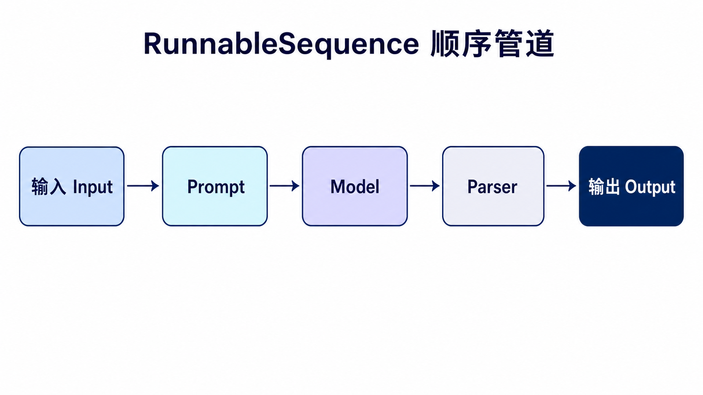
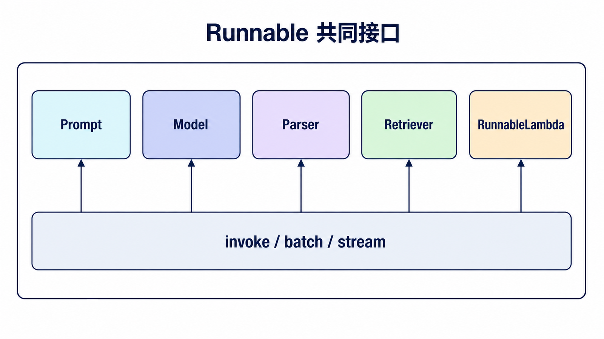
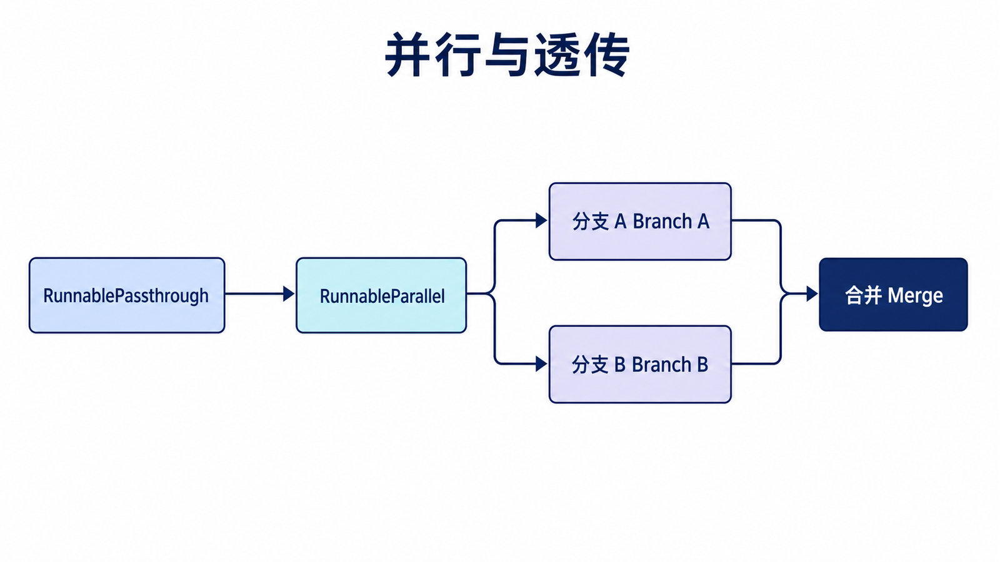
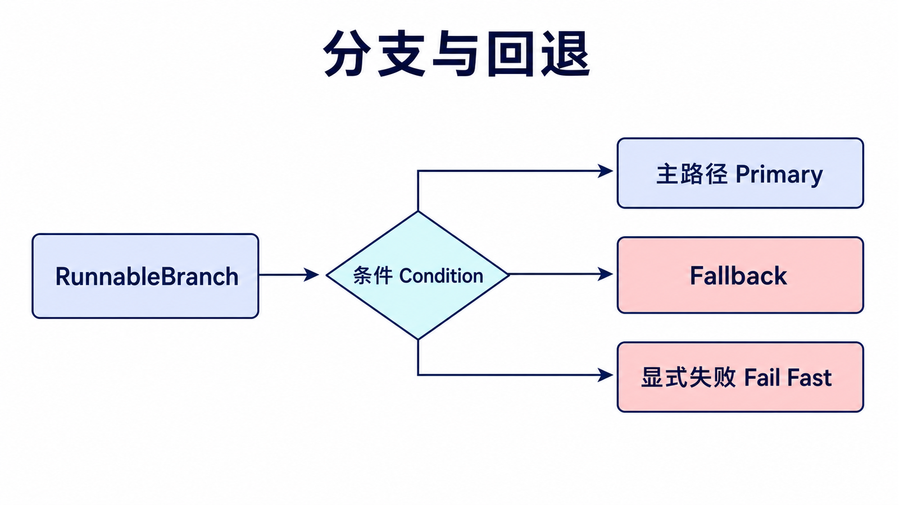
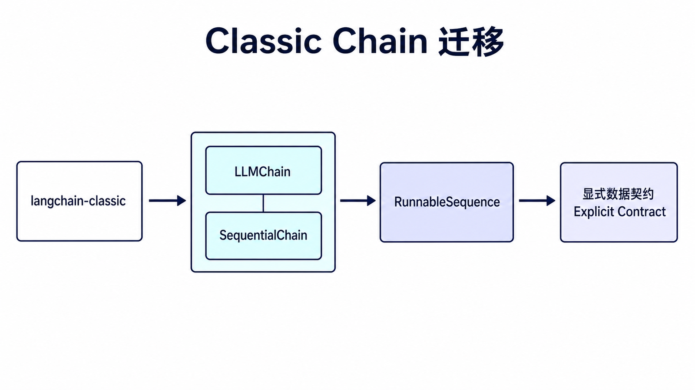

## 阅读指南

**前置知识：** 理解 Prompt、Chat Model 和 Parser 都可以接收输入并产生输出。

**学完本文你应该能：** 用 Runnable 描述数据契约；组合顺序、并行、透传和分支流程；为链添加重试或 fallback；识别 `langchain-classic` 示例。

## 概述

Chain（链）是 LangChain 的核心概念之一，它允许我们将多个组件组合在一起，形成一个连贯的工作流程。通过链式调用，可以将提示词模板、模型、输出解析器等组件串联起来，实现复杂的 LLM 应用。

更直观地说，Chain 解决的是“不要把所有逻辑都塞进一次模型调用”的问题。一个可靠的应用通常会先整理输入，再调用模型，再解析输出，有时还要继续下一步处理；LCEL 的管道语法就是把这些步骤排成一条清楚的流水线。

### 为什么需要 Chain？

| 需求                 | 解决方案             |
| -------------------- | -------------------- |
| 单次调用无法完成任务 | 将任务分解为多个步骤 |
| 需要复用处理流程     | 创建可复用的链       |
| 多模型协作           | 组合多个模型         |
| 后处理输出           | 添加解析和转换       |

### Chain 类型概览

## LCEL 管道组合

LangChain Expression Language (LCEL) 提供了简洁的链式 API：

### 基础管道



```python
from langchain_openai import ChatOpenAI
from langchain_core.prompts import PromptTemplate
from langchain_core.output_parsers import StrOutputParser

llm = ChatOpenAI(model="gpt-4o")

chain = PromptTemplate.from_template("解释{topic}") | llm | StrOutputParser()

result = chain.invoke({"topic": "区块链"})
print(result)
```

### 动态链

```python
from langchain_openai import ChatOpenAI
from langchain_core.prompts import PromptTemplate

llm = ChatOpenAI(model="gpt-4o")

def get_template(task: str) -> PromptTemplate:
    templates = {
        "summary": PromptTemplate.from_template("总结：{text}"),
        "translate": PromptTemplate.from_template("翻译成英文：{text}"),
        "analyze": PromptTemplate.from_template("分析：{text}"),
    }
    return templates.get(task, templates["summary"])

def create_chain(task: str):
    template = get_template(task)
    return template | llm

chain = create_chain("summary")
result = chain.invoke({"text": "LangChain很强大"})
```

## Sequential Chain

### SimpleSequentialChain

单输入单输出的顺序链：

```python
from langchain_openai import ChatOpenAI
from langchain_core.prompts import PromptTemplate
from langchain_core.output_parsers import StrOutputParser

llm = ChatOpenAI(model="gpt-4o")

chain1 = PromptTemplate.from_template(
    "为一个{character}写一个简短的冒险故事（100字以内）。"
) | llm

chain2 = PromptTemplate.from_template(
    "将以下故事翻译成英文：\n{story}"
) | llm

sequential_chain = chain1 | chain2 | StrOutputParser()

result = sequential_chain.invoke({
    "character": "勇敢的小骑士"
})

print(result)
```

### 多步链

```python
chain = (
    PromptTemplate.from_template("分析：{text}")
    | llm
    | StrOutputParser()
    | (lambda output: {"analysis": output})
    | PromptTemplate.from_template("基于分析{analysis}写摘要")
    | llm
    | StrOutputParser()
)
```

## 数据转换链

用于数据转换的链：

```python
from langchain_core.runnables import RunnableLambda

def transform_function(inputs: dict) -> dict:
    text = inputs["text"]
    lines = text.split("\n")
    return {"lines": lines, "line_count": len(lines)}

transform_chain = RunnableLambda(transform_function)

result = transform_chain.invoke({
    "text": "第一行\n第二行\n第三行\n第四行"
})
print(f"行数：{result['line_count']}")
```

旧版资料里经常能看到专门的数据转换类，在 v1 语境下，用 `RunnableLambda` 表达“接收输入、返回新字典”更直接，也更容易和后续的提示词、模型、解析器继续用 `|` 组合。

## 自定义 Chain

### 使用 RunnableLambda

```python
from langchain_openai import ChatOpenAI
from langchain_core.prompts import PromptTemplate
from langchain_core.runnables import RunnableLambda

llm = ChatOpenAI(model="gpt-4o")

def research_step(inputs: dict) -> dict:
    topic = inputs["topic"]
    chain = PromptTemplate.from_template("为{topic}写一份简要研究报告") | llm
    result = chain.invoke({"topic": topic})
    return {"research": result.content}

def question_step(inputs: dict) -> dict:
    research = inputs["research"]
    chain = PromptTemplate.from_template(
        "基于以下研究，提出3个深入问题：\n{research}"
    ) | llm
    result = chain.invoke({"research": research})
    return {"questions": result.content}

custom_chain = RunnableLambda(research_step) | RunnableLambda(question_step)

result = custom_chain.invoke({"topic": "量子计算"})
print(result)
```

## 异步链

```python
import asyncio
from langchain_openai import ChatOpenAI
from langchain_core.prompts import PromptTemplate
from langchain_core.output_parsers import StrOutputParser

llm = ChatOpenAI(model="gpt-4o")

chain = PromptTemplate.from_template("用一句话解释：{topic}") | llm | StrOutputParser()

async def async_invoke():
    result = await chain.ainvoke({"topic": "量子纠缠"})
    print(result)

    results = await chain.abatch([
        {"topic": "人工智能"},
        {"topic": "机器学习"},
        {"topic": "深度学习"}
    ])
    for r in results:
        print(r)

asyncio.run(async_invoke())
```

## 错误处理

```python
from langchain_core.output_parsers import JsonOutputParser
from langchain_core.exceptions import OutputParserException

chain = PromptTemplate.from_template("返回JSON：{text}") | llm | JsonOutputParser()

try:
    result = chain.invoke({"text": "some text"})
except OutputParserException as e:
    print(f"解析错误: {e}")
```

## 最佳实践

| 实践         | 说明                    |
| ------------ | ----------------------- |
| **单一职责** | 每个链负责一个特定任务  |
| **可复用性** | 创建通用链供多处使用    |
| **错误处理** | 为链添加异常处理        |
| **日志记录** | 使用 callbacks 参数调试 |
| **性能优化** | 批量任务使用异步 API    |

### 链的性能优化

```python
results = chain.batch([
    {"input": "问题1"},
    {"input": "问题2"},
    {"input": "问题3"}
])

async def batch_process(items):
    results = await chain.abatch([{"input": i} for i in items])
    return results
```

## Runnable 是真正的共同接口



LCEL 的 `|` 只是组合语法，关键抽象是 Runnable。Prompt、Model、Parser、Retriever 和 `RunnableLambda` 都实现相似的 `invoke`、`batch`、`stream` 与异步接口，因此可以被替换、测试和嵌套。

组合时最容易出错的不是语法，而是数据契约。每一步都要回答：输入是字符串、消息、字典还是 Document 列表？输出键名是什么？下一步是否能直接接收？复杂链应为中间字典使用 `TypedDict` 或 Pydantic 模型，并为每条分支写最小测试。

## 并行、分支与回退





```python
from langchain_core.runnables import (
    RunnableBranch,
    RunnableLambda,
    RunnableParallel,
    RunnablePassthrough,
)

prepare = RunnableParallel(
    question=RunnablePassthrough(),
    length=RunnableLambda(len),
)

route = RunnableBranch(
    (lambda data: data["length"] < 20, RunnableLambda(lambda x: "简短问题")),
    RunnableLambda(lambda x: "详细问题"),
)

chain = prepare | route
assert chain.invoke("什么是 LCEL？") == "简短问题"
```

并行只适用于互不依赖的步骤；如果两个分支共享有副作用的资源，仍要处理限流、事务和幂等。Fallback 适合供应商临时失败或可替代模型，不适合吞掉 Schema 错误、安全拒绝和业务校验失败。

## 旧 Chain 迁移



`LLMChain`、`SimpleSequentialChain`、`SequentialChain` 等传统类已经不再是 v1 主路径，需要旧项目兼容时从 `langchain-classic` 导入。新代码优先用 Runnable：顺序链改成 `a | b | c`，多输入输出使用字典与 `RunnablePassthrough`，条件路由使用 `RunnableBranch`。

迁移时不要只替换类名，还要记录每一步的输入输出类型。旧 Chain 经常隐式传递字典键，Runnable 则鼓励把转换显式写出来，这正是提高可测试性的机会。

## 为数据契约写测试

Runnable 测试不必从真实模型开始。先用 `RunnableLambda` 或 fake model 固定输出，分别验证每一层的数据形状：Prompt 是否收到正确键、并行分支是否都完成、Parser 是否返回目标类型、错误是否进入预期 fallback。

```python
from langchain_core.runnables import RunnableLambda

normalize = RunnableLambda(
    lambda data: {"question": data["question"].strip()}
)
fake_model = RunnableLambda(
    lambda data: f"回答：{data['question']}"
)
test_chain = normalize | fake_model

assert test_chain.invoke({"question": "  什么是 Runnable？  "}) == (
    "回答：什么是 Runnable？"
)
```

真实模型测试只保留少量端到端样例。大多数路由、键名、类型和异常行为都可以在不调用模型的情况下确定性验证，这会显著降低调试成本。

当链变长时，为关键中间值命名，并在 tracing 中记录步骤名。若一条链同时承担检索、业务决策、写数据库和生成文案，应拆成多个可观察阶段；组合能力的目的不是把所有逻辑压进一行 `|`，而是让每个阶段的契约更清楚。

## 总结

现代 LangChain 以 Runnable 作为可组合执行接口：

| 链类型               | 用途     | 特点             |
| -------------------- | -------- | ---------------- |
| **LCEL 管道**        | 基础链   | 模板+模型+解析器 |
| **RunnableSequence** | 顺序组合 | 多步骤处理       |
| **RunnableParallel** | 并行组合 | 独立分支并行处理 |
| **自定义链**         | 特殊逻辑 | RunnableLambda   |

掌握 Runnable 的输入输出契约和组合方式，是构建可测试 LLM 工作流的基础。

## 本篇自检

1. LCEL 的 `|` 与 Runnable 分别扮演什么角色？
2. 哪些步骤可以并行，哪些不能？
3. 为什么不应对所有异常统一使用 fallback？

<details>
<summary>查看答案</summary>

1. `|` 是组合语法，Runnable 是提供调用、批量、流式和异步能力的共同接口。
2. 输入相同且互不依赖、没有冲突副作用的步骤可以并行；存在先后数据依赖或共享事务的步骤不能直接并行。
3. 安全拒绝、数据校验和编程错误需要显式失败，盲目 fallback 会掩盖真实问题。

</details>

## 官方资料

- [LangChain v1 迁移指南](https://docs.langchain.com/oss/python/migrate/langchain-v1)
- [Runnable API](https://python.langchain.com/api_reference/core/runnables.html)
- [LCEL concepts](https://python.langchain.com/docs/concepts/lcel/)

**上一篇：** [LangChain Output Parsers](/posts/langchain-output-parsers/) · **下一篇：** [LangChain Agents](/posts/langchain-agents/)
