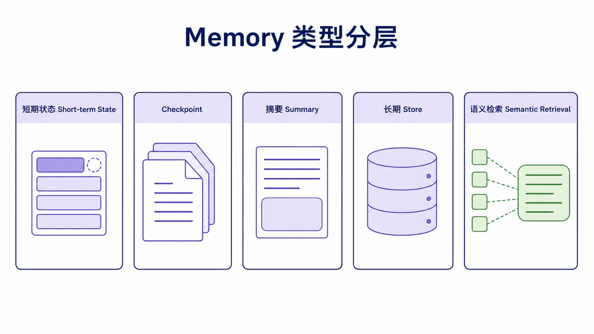
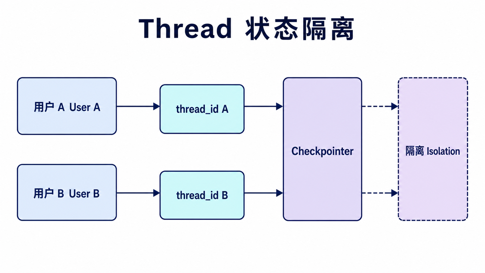
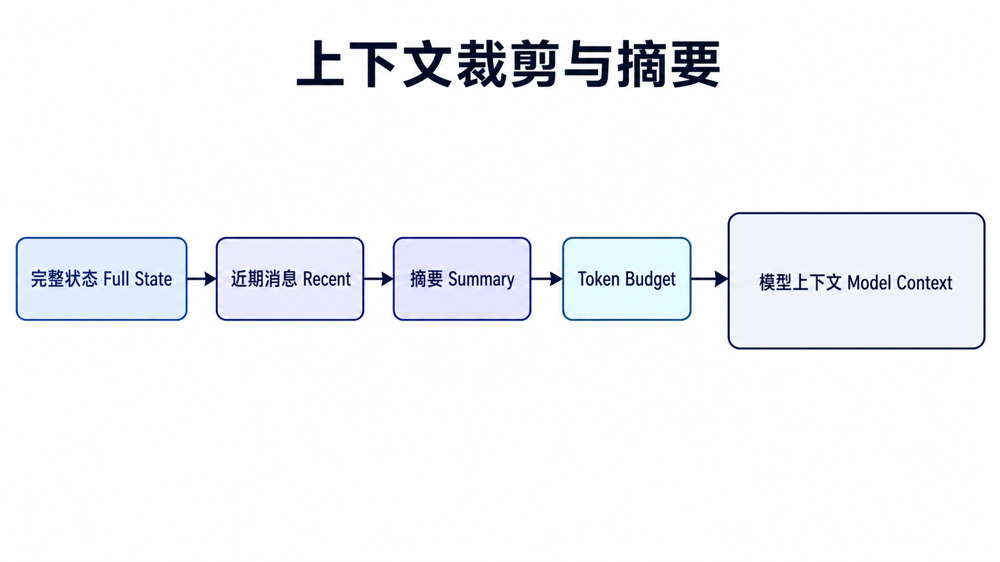
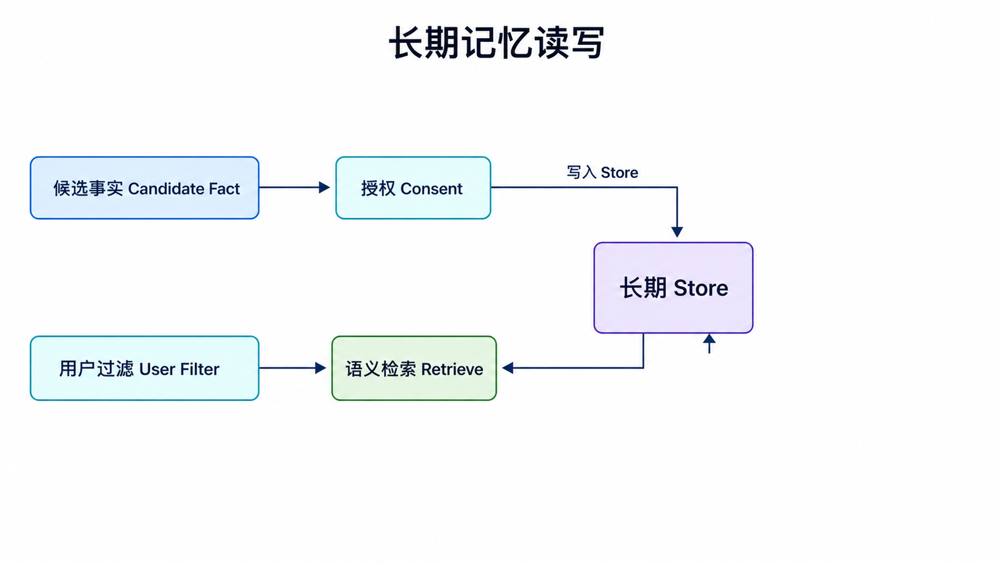
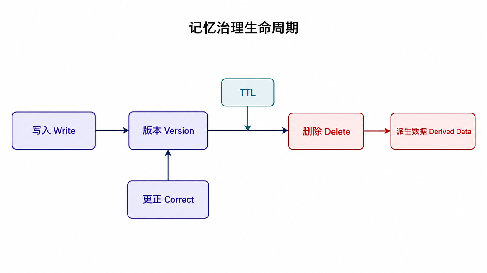

## 阅读指南

**前置知识：** 理解 Agent 每次调用都接收 messages，并可通过 `thread_id` 恢复状态。

**学完本文你应该能：** 区分短期状态与长期记忆；设计 thread 隔离；选择裁剪、摘要或检索；处理 TTL、隐私删除和并发写入。

## 概述

Memory（记忆组件）是 LangChain 中用于在对话或处理过程中保持状态的能力。它解决的问题很直接：模型本身不会自动记住上一次请求，如果应用不把历史消息或关键状态传回去，下一轮对话就会像重新开始一样。

在 LangChain v1 中，短期记忆通常通过 Agent 的 `checkpointer` 保存到 graph state，再用调用时的 `thread_id` 区分不同会话。旧版资料里的 memory 类仍可能在历史项目中出现，但新项目更建议围绕 messages、state 和 checkpointer 来理解。

### 为什么需要 Memory？

| 场景       | 没有 Memory      | 有 Memory        |
| ---------- | ---------------- | ---------------- |
| 多轮对话   | 每轮都是新对话   | 记住之前的上下文 |
| 长对话     | 丢失早期信息     | 保持完整对话历史 |
| 上下文理解 | 无法关联之前内容 | 理解完整的上下文 |

### Memory 工作原理

## Memory 类型概览



| 类型             | 说明                         | 适用场景     |
| ---------------- | ---------------------------- | ------------ |
| **短期会话记忆** | 按 thread 保存消息状态       | 标准聊天     |
| **摘要记忆**     | 将长历史压缩成摘要           | 长对话       |
| **组合上下文**   | 同时使用历史、摘要、用户资料 | 多维度上下文 |
| **检索式记忆**   | 用向量检索找回相关片段       | 大量历史信息 |

## 短期会话记忆



### 基础用法

```python
from langchain.agents import create_agent
from langchain_openai import ChatOpenAI
from langgraph.checkpoint.memory import InMemorySaver

agent = create_agent(
    model=ChatOpenAI(model="gpt-4o"),
    tools=[],
    system_prompt="你是一个有帮助的助手。",
    checkpointer=InMemorySaver()
)

config = {"configurable": {"thread_id": "user-001"}}

agent.invoke(
    {"messages": [{"role": "user", "content": "我叫张三"}]},
    config=config
)

result = agent.invoke(
    {"messages": [{"role": "user", "content": "我叫什么名字？"}]},
    config=config
)

print(result["messages"][-1].content)
```

这段代码的重点是 `config`。同一个 `thread_id` 会复用同一段会话状态；换成另一个 `thread_id`，历史就不会串到新用户或新会话里。

### 在 Agent 中使用

```python
from langchain.agents import create_agent
from langchain_openai import ChatOpenAI
from langchain_core.tools import tool
from langgraph.checkpoint.memory import InMemorySaver

@tool
def get_weather(city: str) -> str:
    """获取城市天气"""
    return f"{city}今天晴天"

llm = ChatOpenAI(model="gpt-4o")

agent = create_agent(
    model=llm,
    tools=[get_weather],
    system_prompt="你是一个有帮助的助手。",
    checkpointer=InMemorySaver()
)

config = {"configurable": {"thread_id": "chat-001"}}

result1 = agent.invoke(
    {"messages": [{"role": "user", "content": "我叫张三"}]},
    config=config
)

result2 = agent.invoke(
    {"messages": [{"role": "user", "content": "我叫什么名字？"}]},
    config=config
)
```

## 摘要记忆

### 对长对话进行摘要

```python
from langchain_openai import ChatOpenAI
from langchain_core.messages import HumanMessage, AIMessage

llm = ChatOpenAI(model="gpt-4o")

messages = [
    HumanMessage(content="我们公司最近推出了新产品"),
    AIMessage(content="这个产品主要解决什么问题？"),
    HumanMessage(content="它帮助客服团队自动整理客户问题"),
]

def summarize_messages(messages):
    text = "\n".join(f"{m.type}: {m.content}" for m in messages)
    response = llm.invoke(f"请用100字以内总结这段对话：\n{text}")
    return response.content

summary = summarize_messages(messages)
print(summary)
```

摘要不是为了保存每个字，而是为了保留后续回答真正需要的事实。长对话中可以定期把旧消息压缩成摘要，只把最近几轮完整消息继续放进上下文。

## 组合上下文

### 组合多种上下文

```python
from langchain_openai import ChatOpenAI
from langchain_core.prompts import ChatPromptTemplate, MessagesPlaceholder
from langchain_core.messages import HumanMessage, AIMessage

llm = ChatOpenAI(model="gpt-4o")

recent_history = [
    HumanMessage(content="我们公司最近推出了新产品"),
    AIMessage(content="听起来不错，它面向哪类用户？"),
]
summary = "用户正在讨论一个面向客服团队的新产品。"

def chat_with_combined_context(input_text):
    user_profile = "用户偏好简洁、可执行的建议。"

    prompt = ChatPromptTemplate.from_messages([
        ("system", "你是一个友好的助手。用户画像：{user_profile}"),
        ("system", "对话摘要：{summary}"),
        MessagesPlaceholder(variable_name="history"),
        ("human", "{input}")
    ])

    messages = prompt.invoke({
        "user_profile": user_profile,
        "summary": summary,
        "history": recent_history,
        "input": input_text,
    }).to_messages()

    return llm.invoke(messages).content

answer = chat_with_combined_context("帮我整理一个产品介绍大纲")
print(answer)
```

组合上下文的关键是把不同来源的信息放到清楚的位置：用户画像放系统消息，摘要单独成段，最近消息保持原始顺序。这样比把所有内容拼成一个长字符串更容易维护。

## 检索式记忆

### 基于语义检索的记忆

```python
from langchain_openai import OpenAIEmbeddings
from langchain_chroma import Chroma
from langchain_core.documents import Document

embeddings = OpenAIEmbeddings()
vectorstore = Chroma.from_documents(
    documents=[
        Document(page_content="用户喜欢 Python 编程"),
        Document(page_content="用户在上海工作"),
    ],
    embedding=embeddings
)

retriever = vectorstore.as_retriever(search_kwargs={"k": 3})

related = retriever.invoke("我在哪里工作？")
print(related)
```

检索式记忆适合“历史很多，但每次只需要其中几条相关信息”的场景。它不等同于完整聊天历史，而是把过去的重要事实当成可检索资料。

## 持久化记忆

### 使用 Checkpointer

```python
from langchain.agents import create_agent
from langchain_openai import ChatOpenAI
from langgraph.checkpoint.memory import InMemorySaver

checkpointer = InMemorySaver()

agent = create_agent(
    model=ChatOpenAI(model="gpt-4o"),
    tools=[],
    system_prompt="你是一个有帮助的助手。",
    checkpointer=checkpointer
)

config = {"configurable": {"thread_id": "user_123"}}

agent.invoke(
    {"messages": [{"role": "user", "content": "你好"}]},
    config=config
)

state = agent.get_state(config)
print(state.values["messages"])
```

`InMemorySaver` 适合本地演示，进程结束后数据就没了。生产环境要换成数据库型 checkpointer，让同一个 thread 能跨进程恢复。

### 保存和加载

```python
import json

messages = [
    {"role": "user", "content": "你好"},
    {"role": "assistant", "content": "你好！有什么可以帮助你？"},
]

with open("memory.json", "w", encoding="utf-8") as f:
    json.dump(messages, f, ensure_ascii=False)

with open("memory.json", "r", encoding="utf-8") as f:
    loaded = json.load(f)
    print(loaded)
```

手动保存 JSON 适合教学或小工具；一旦涉及多用户、并发和恢复能力，就应该使用 checkpointer 或数据库。

## 最佳实践

| 实践                | 说明                               |
| ------------------- | ---------------------------------- |
| **按 thread 隔离**  | 不同用户或会话使用不同 `thread_id` |
| **设置 token 限制** | 避免超出模型上下文限制             |
| **定期摘要**        | 长对话用摘要压缩旧消息             |
| **检索重要事实**    | 大量历史信息用向量检索找回         |
| **持久化存储**      | 生产环境使用数据库型 checkpointer  |

### 记忆类型选择指南

```
对话长度
  │
  │短（< 5轮）
  │  └── 直接保留完整 messages
  │
  │中等（5-20轮）
  │  └── 完整 messages + 定期摘要
  │
  │长（> 20轮）
  │  └── 摘要 + 检索式记忆
  │
  │ 复杂场景
  │  └── 组合上下文（历史、摘要、用户资料、检索结果）
```

### 限制记忆长度

```python
def keep_recent_messages(messages, max_items=10):
    return messages[-max_items:]
```

真正限制上下文时，建议按 token 数估算，而不是只按消息条数截断；上面的函数只展示最朴素的裁剪思路。

## 短期状态不等于模型上下文



Checkpointer 可以保存完整 graph state，但模型上下文窗口仍然有限。每次调用模型前，应从状态中选择真正相关的信息：近期消息保留原文，较早消息压缩成摘要，稳定用户事实从长期 store 检索，工具产生的大对象只保留引用或摘要。

如果把“持久化了什么”和“发送给模型什么”混为一谈，长会话最终仍会超出上下文窗口，也会增加延迟、成本和隐私暴露面。

## 长期记忆的写入策略



长期记忆至少分为三类：语义记忆保存用户事实，情景记忆保存过去事件，程序性记忆保存系统规则或技能。不要把每句话都自动写入长期记忆；写入前应判断稳定性、来源、用户授权和有效期，并允许用户查看、更正和删除。

检索长期记忆时，应同时使用用户或租户过滤、相关性阈值和数量上限。仅按向量相似度检索可能把另一位用户的数据带入当前上下文，这是数据隔离错误，不是普通的“回答质量问题”。

## 并发、TTL 与删除



- 同一 `thread_id` 的并发请求可能产生竞态，应串行化、使用版本检查或让存储层支持冲突检测。
- 临时会话和敏感工具结果应设置 TTL，不能无限期保留。
- 删除请求必须覆盖 checkpoint、长期 store、向量索引和派生摘要，而不只是清空 UI。
- 生产环境使用持久化 checkpointer；`InMemorySaver` 只适合本地演示和测试。

## 总结

| Memory 方式      | 特点               | 适用场景   |
| ---------------- | ------------------ | ---------- |
| **messages**     | 结构直观           | 短对话     |
| **checkpointer** | 按 thread 恢复状态 | 多轮 Agent |
| **摘要**         | 压缩上下文         | 长对话     |
| **检索**         | 找回相关事实       | 大量历史   |

Memory 让 LLM 应用具有真正的对话能力。把短期状态、摘要和检索式事实分清楚，应用会更稳，也更容易解释为什么模型“记得”某些信息。

## 本篇自检

1. 为什么 checkpoint 中保存完整历史，不代表每次都应把完整历史发给模型？
2. 长期记忆写入前至少需要检查哪些条件？
3. 删除一位用户的记忆为什么不能只清空 messages？

<details>
<summary>查看答案</summary>

1. 模型上下文有限，完整发送会增加成本、延迟和隐私风险；应裁剪、摘要或检索选择。
2. 信息稳定性、来源、用户授权、租户归属和有效期。
3. 数据还可能存在 checkpoint、长期 store、向量索引与派生摘要中。

</details>

## 官方资料

- [Short-term memory](https://docs.langchain.com/oss/python/langchain/short-term-memory)
- [Long-term memory](https://docs.langchain.com/oss/python/concepts/memory)
- [LangGraph persistence](https://docs.langchain.com/oss/python/langgraph/persistence)

**上一篇：** [LangChain Agents](/posts/langchain-agents/) · **下一篇：** [LangChain Retrieval/RAG](/posts/langchain-retrieval-rag/)
