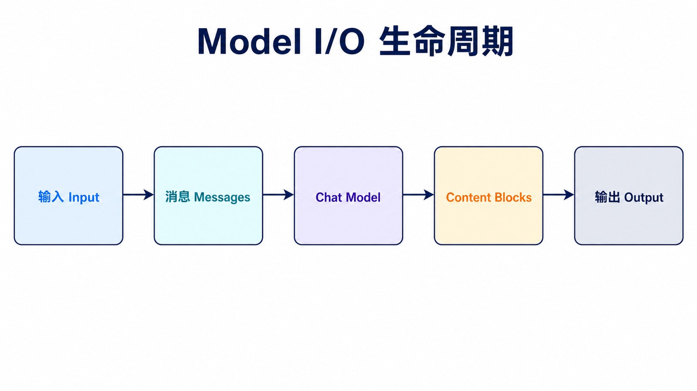
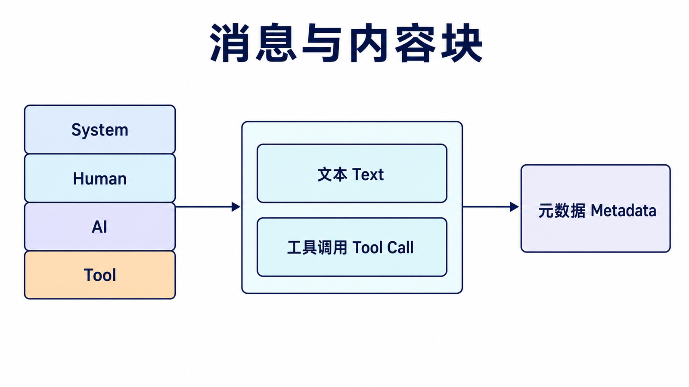
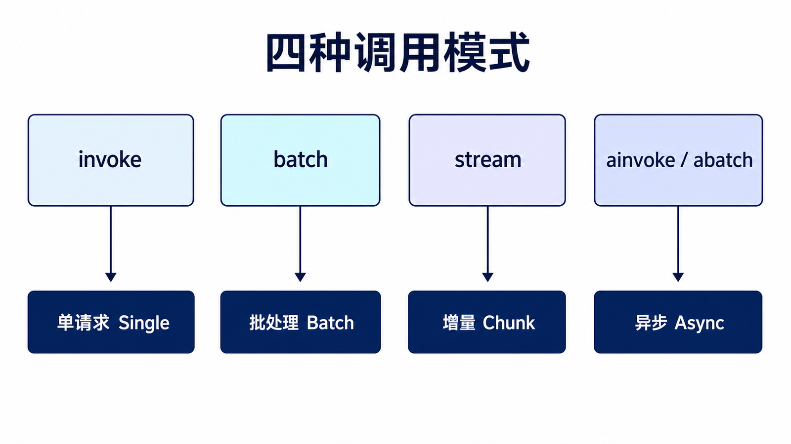
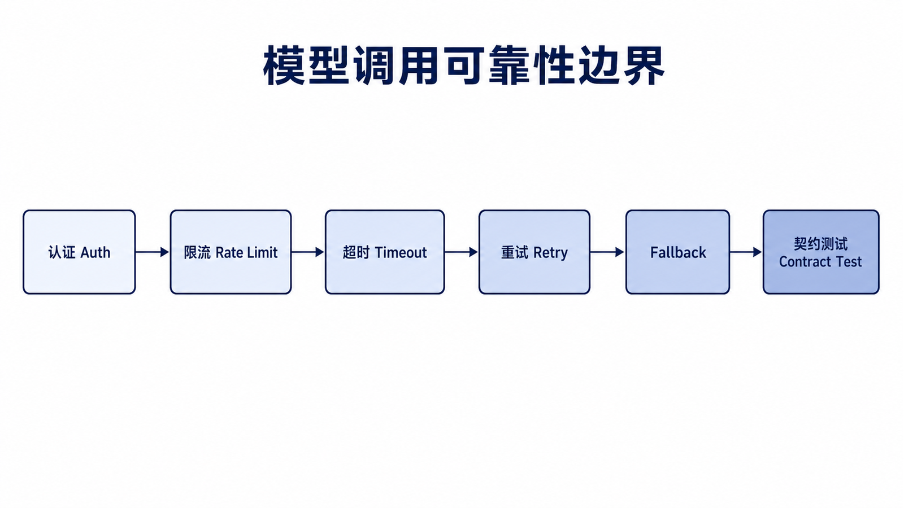

## 阅读指南

**前置知识：** 已阅读系列入门篇，理解一次请求会经过消息、模型和输出三个阶段。

**学完本文你应该能：** 使用统一接口初始化聊天模型；识别不同消息和 content blocks；在 `invoke`、`batch`、`stream`、`ainvoke` 之间做选择；为超时、重试和供应商差异设计边界。

## 概述

Model I/O 是 LangChain 的核心模块，负责管理与语言模型的所有交互操作。这个模块涵盖了从提示词构建、模型调用到输出解析的完整流程。

把它拆开看，就是三件事：先把用户输入组织成模型能理解的消息或提示词，再调用具体模型，最后把模型输出整理成应用能继续使用的数据。很多 LangChain 示例看起来复杂，本质上都是这三步的组合。

### Model I/O 架构



## 模型类型

### LLMs vs Chat Models

| 类型            | 说明       | API 方式                                   |
| --------------- | ---------- | ------------------------------------------ |
| **LLMs**        | 纯文本补全 | `/completions`                             |
| **Chat Models** | 对话模型   | 统一 Chat Model 接口，底层由 provider 决定 |

```python
from langchain_openai import ChatOpenAI

chat = ChatOpenAI(model="gpt-4o")

response = chat.invoke("你好，请介绍一下你自己")
print(response.content)
```

`ChatOpenAI` 返回的是消息对象，不是普通字符串。大多数时候读取 `response.content` 就够了；如果要看 token 用量、工具调用等信息，再查看对象上的其他字段。

### 消息类型



| 消息类型          | 说明         | 角色      |
| ----------------- | ------------ | --------- |
| **SystemMessage** | 系统指令     | system    |
| **HumanMessage**  | 用户输入     | user      |
| **AIMessage**     | 助手回复     | assistant |
| **ToolMessage**   | 工具执行结果 | tool      |

```python
from langchain_core.messages import HumanMessage, SystemMessage, AIMessage

messages = [
    SystemMessage(content="你是一个专业的Python编程导师。"),
    HumanMessage(content="什么是装饰器？"),
    AIMessage(content="装饰器是Python中的一种高级特性..."),
    HumanMessage(content="能给我一个例子吗？"),
]

response = chat.invoke(messages)
print(response.content)
```

## 模型调用

### 同步调用

```python
from langchain_openai import ChatOpenAI

chat = ChatOpenAI(model="gpt-4o", temperature=0.7, max_tokens=1000)

response = chat.invoke("解释什么是区块链技术")
print(response.content)

responses = chat.batch([
    "什么是Python？",
    "什么是Java？",
    "什么是Go？"
])

for resp in responses:
    print(resp.content)
```

### 异步调用

```python
import asyncio
from langchain_openai import ChatOpenAI

chat = ChatOpenAI(model="gpt-4o")

async def async_call():
    response = await chat.ainvoke("异步编程有什么优势？")
    print(response.content)

async def batch_async():
    responses = await chat.abatch([
        "问题1",
        "问题2",
        "问题3"
    ])
    return responses

asyncio.run(async_call())
```

### 流式输出

```python
from langchain_openai import ChatOpenAI

chat = ChatOpenAI(model="gpt-4o")

for chunk in chat.stream("写一篇关于春天的散文"):
    print(chunk.content, end="", flush=True)
```

流式输出适合聊天界面和长文本生成。它不会让模型更快完成全部生成，但能让用户更早看到内容，体感延迟会明显降低。

### 配置参数

| 参数            | 说明            | 取值范围                   |
| --------------- | --------------- | -------------------------- |
| **model**       | 模型名称        | gpt-4o, gpt-4, claude-3 等 |
| **temperature** | 随机性控制      | 0.0 - 2.0                  |
| **max_tokens**  | 最大生成token数 | 正整数                     |
| **top_p**       | 核采样参数      | 0.0 - 1.0                  |

```python
chat = ChatOpenAI(
    model="gpt-4o",
    temperature=0.7,
    max_tokens=2000,
    top_p=0.9
)
```

## 提示词管理

### PromptTemplate

```python
from langchain_core.prompts import PromptTemplate

template = PromptTemplate.from_template("请将以下中文翻译成英文：{text}")

prompt = template.invoke({"text": "今天天气真好"})
print(prompt.to_string())
```

### ChatPromptTemplate

```python
from langchain_core.prompts import ChatPromptTemplate

chat_template = ChatPromptTemplate.from_messages([
    ("system", "你是一个{profession}，专业领域是{domain}。"),
    ("human", "你好，我需要了解{topic}。"),
])

prompt = chat_template.invoke({
    "profession": "数据科学家",
    "domain": "机器学习",
    "topic": "神经网络"
})

print(prompt.to_messages())
```

### 部分变量填充

```python
from langchain_core.prompts import PromptTemplate

template = PromptTemplate(
    template="写一篇关于{topic}的{style}文章，字数约{word_count}字。",
    input_variables=["topic", "style", "word_count"]
)

partial_template = template.partial(style="技术博客")

prompt = partial_template.invoke({
    "topic": "人工智能",
    "word_count": 1000
})
```

## 输出解析器

### 常见解析器类型

| 解析器                             | 用途              | 输出格式   |
| ---------------------------------- | ----------------- | ---------- |
| **JsonOutputParser**               | JSON 结构化输出   | dict       |
| **PydanticOutputParser**           | Pydantic 模型验证 | 自定义对象 |
| **CommaSeparatedListOutputParser** | 逗号分隔列表      | List[str]  |
| **StrOutputParser**                | 字符串输出        | str        |

### JSON 输出解析器

```python
from langchain_core.output_parsers import JsonOutputParser
from langchain_openai import ChatOpenAI
from langchain_core.prompts import PromptTemplate

model = ChatOpenAI(model="gpt-4o")
parser = JsonOutputParser()

chain = PromptTemplate.from_template(
    """返回一个JSON对象，包含一个人的姓名、年龄和职业。

    {format_instructions}

    只返回JSON，不要其他内容。"""
) | model | parser

response = chain.invoke({
    "format_instructions": parser.get_format_instructions()
})

print(response)
```

### Pydantic 输出解析器

```python
from langchain_core.output_parsers import PydanticOutputParser
from langchain_openai import ChatOpenAI
from langchain_core.prompts import PromptTemplate
from pydantic import BaseModel, Field
from typing import List

class PersonInfo(BaseModel):
    name: str = Field(description="姓名")
    age: int = Field(description="年龄")
    occupation: str = Field(description="职业")
    skills: List[str] = Field(description="技能列表")

parser = PydanticOutputParser(pydantic_object=PersonInfo)

prompt = PromptTemplate.from_template(
    """提取以下文本中的人物信息：

    {query}

    {format_instructions}""",
    partial_variables={"format_instructions": parser.get_format_instructions()}
)

chain = prompt | model | parser

result = chain.invoke({
    "query": "张三是一名30岁的软件工程师，擅长Python和Java开发"
})

print(result.name)
print(result.age)
print(result.skills)
```

### 原生结构化输出

如果模型支持工具调用或原生结构化输出，可以直接把 Pydantic schema 绑定到模型上，少写一层格式指令和手动解析逻辑。

```python
from langchain_openai import ChatOpenAI
from pydantic import BaseModel, Field
from typing import List

class PersonInfo(BaseModel):
    name: str = Field(description="姓名")
    age: int = Field(description="年龄")
    occupation: str = Field(description="职业")
    skills: List[str] = Field(description="技能列表")

model = ChatOpenAI(model="gpt-4o")
structured_model = model.with_structured_output(PersonInfo)

result = structured_model.invoke(
    "张三是一名30岁的软件工程师，擅长Python和Java开发"
)

print(result.name)
print(result.skills)
```

## LCEL 管道组合

LangChain Expression Language (LCEL) 提供了管道操作符来组合组件：

```python
from langchain_openai import ChatOpenAI
from langchain_core.prompts import PromptTemplate
from langchain_core.output_parsers import StrOutputParser

model = ChatOpenAI(model="gpt-4o")
parser = StrOutputParser()

chain = PromptTemplate.from_template("用一句话解释{concept}") | model | parser

result = chain.invoke({"concept": "机器学习"})
print(result)
```

### 多步骤处理链

```python
from langchain_core.prompts import PromptTemplate
from langchain_openai import ChatOpenAI
from langchain_core.output_parsers import JsonOutputParser, StrOutputParser

model = ChatOpenAI(model="gpt-4o")

extract_prompt = PromptTemplate.from_template(
    """从以下文本中提取关键信息，输出JSON格式：
    {text}
    """
)
extract_chain = extract_prompt | model | JsonOutputParser()

summarize_prompt = PromptTemplate.from_template(
    """根据以下信息生成一段摘要：
    {info}
    """
)
summarize_chain = summarize_prompt | model | StrOutputParser()

full_chain = extract_chain | summarize_chain

result = full_chain.invoke({
    "text": "Python是一种高级编程语言，由Guido van Rossum于1991年创建。"
})
```

多步骤链的关键是前一步输出必须匹配后一步输入。如果中间结果是字典、字符串或消息对象，最好在代码里显式转换，避免后续提示词收到意料之外的结构。

## 错误处理

```python
from langchain_core.output_parsers import JsonOutputParser
from langchain_core.exceptions import OutputParserException

model = ChatOpenAI(model="gpt-4o")
parser = JsonOutputParser()

chain = PromptTemplate.from_template("返回JSON：{text}") | model | parser

try:
    result = chain.invoke({"text": "some text"})
except OutputParserException as e:
    print(f"解析错误: {e}")
except Exception as e:
    print(f"其他错误: {e}")
```

## 最佳实践

| 实践         | 说明                                       |
| ------------ | ------------------------------------------ |
| **使用模板** | 始终使用 PromptTemplate 而不是硬编码字符串 |
| **控制参数** | 根据任务调整 temperature 和 max_tokens     |
| **错误处理** | 为模型调用添加适当的异常处理               |
| **流式输出** | 长文本生成使用流式提升用户体验             |
| **批量处理** | 批量任务使用 batch 方法提高效率            |
| **异步编程** | 生产环境优先使用异步 API                   |

## 调用模式如何选择



| 模式                 | 适用任务             | 关键风险                       |
| -------------------- | -------------------- | ------------------------------ |
| `invoke`             | 单个低并发请求       | 阻塞当前线程                   |
| `batch`              | 一组互相独立的输入   | 批量过大会触发限流             |
| `stream`             | 聊天 UI、长回答      | 必须正确合并 chunk，并处理取消 |
| `ainvoke` / `abatch` | Web 服务和高并发 I/O | 不能在异步函数里混用阻塞调用   |

流式只改善首 token 等待时间，不会缩短模型完成全部生成的总耗时。批量和异步也不等于无限并发，应通过 `RunnableConfig`、信号量或服务端队列限制并发度。

## 生产调用边界



模型调用至少要显式考虑四类失败：认证与权限、限流、超时、供应商返回格式变化。推荐把模型选择和密钥留在配置层，把业务代码依赖收敛到 LangChain 的消息与 Runnable 接口。

```python
import os
from langchain.chat_models import init_chat_model
from langchain_core.runnables import RunnableConfig

model = init_chat_model(
    os.environ["MODEL_NAME"],
    temperature=0,
    timeout=30,
    max_retries=2,
)

config = RunnableConfig(
    tags=["tutorial", "model-io"],
    metadata={"feature": "concept-explainer"},
)

response = model.invoke("用一句话解释 Runnable", config=config)
print(response.content)
```

不要假设所有供应商都支持相同参数、工具调用或结构化输出。统一接口减少了切换成本，但不能消除底层能力差异；上线前仍要针对实际模型做契约测试。

## 与 Prompt、Parser 的边界

Model I/O 负责“如何调用模型以及如何接收消息”；Prompt Templates 负责“如何组装输入”；Output Parsers 与结构化输出负责“如何把结果变成应用数据”。本文中的相关示例只展示连接点，完整策略放到后续专篇，避免三篇重复维护同一套代码。

## 总结

Model I/O 是 LangChain 的核心模块：

| 组件               | 核心功能       |
| ------------------ | -------------- |
| **Chat Models**    | 对话交互模型   |
| **PromptTemplate** | 动态提示词构建 |
| **OutputParser**   | 结构化输出解析 |
| **LCEL**           | 组件组合表达式 |

熟练运用这些组件，可以构建强大的 LLM 应用工作流。

## 本篇自检

1. `stream` 为什么不会降低完整生成耗时？
2. 什么情况下应使用 `batch`，什么情况下应使用 `abatch`？
3. 统一模型接口为什么仍不能保证不同供应商行为完全一致？

<details>
<summary>查看答案</summary>

1. 它只是提前逐块交付已生成内容，模型仍需完成相同的推理与生成工作。
2. 同步脚本中的独立批任务可用 `batch`；异步服务或大量 I/O 并发更适合 `abatch`，两者都要限制并发。
3. 各供应商支持的参数、content blocks、工具调用和结构化输出能力仍可能不同。

</details>

## 官方资料

- [Models](https://docs.langchain.com/oss/python/langchain/models)
- [Messages](https://docs.langchain.com/oss/python/langchain/messages)
- [Streaming](https://docs.langchain.com/oss/python/langchain/streaming)

**上一篇：** [LangChain 入门指南](/posts/langchain-getting-started/) · **下一篇：** [LangChain Prompt Templates](/posts/langchain-prompt-templates/)
