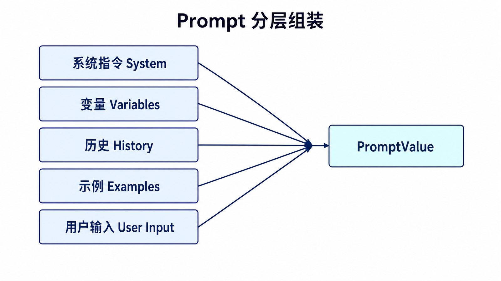
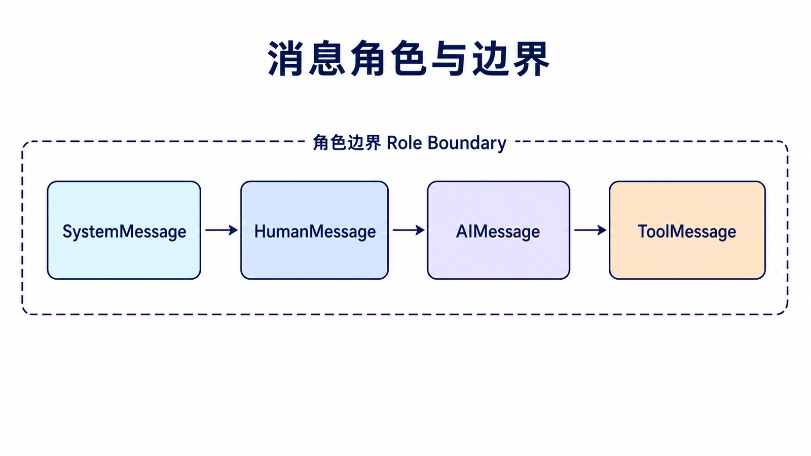
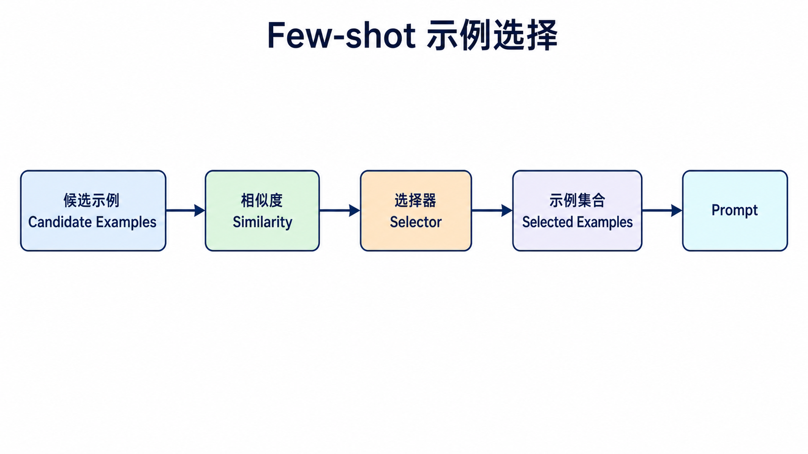
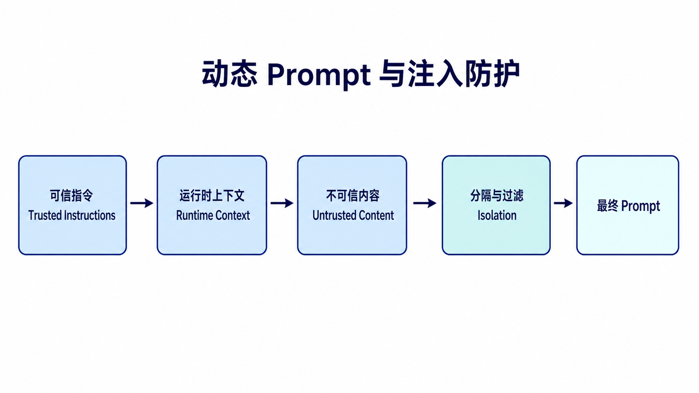

## 阅读指南

**前置知识：** 理解 Chat Model 接收按角色组织的消息，而不是一段没有结构的长字符串。

**学完本文你应该能：** 选择文本或聊天模板；安全地注入历史与 Few-shot 示例；检查最终 PromptValue；为模板建立版本和测试边界。

## 概述

提示词模板（Prompt Template）是 LangChain 中最常用的组件之一，它允许开发者创建可复用的、结构化的提示词。通过模板化，可以更方便地管理复杂提示词，提高代码的可维护性和一致性。

提示词模板的价值不只是少写字符串拼接，而是把“固定指令”和“每次变化的输入”分开。这样做之后，提示词更容易审查、复用和版本管理，也更不容易因为一次临时改动破坏其他调用。

### 提示词模板的价值



| 价值         | 说明                       |
| ------------ | -------------------------- |
| **可复用性** | 定义一次，使用多次         |
| **一致性**   | 保持提示词格式统一         |
| **可维护性** | 修改模板即可更新所有使用处 |
| **动态性**   | 支持变量插值和条件逻辑     |

## PromptTemplate

### 基础用法

```python
from langchain_core.prompts import PromptTemplate

template = PromptTemplate.from_template("请将以下中文翻译成英文：{text}")

prompt = template.invoke({"text": "今天天气真好"})
print(prompt.to_string())
```

`invoke()` 返回的是 PromptValue，调用模型前可以用 `to_string()` 或 `to_messages()` 检查最终内容。调试提示词时，先打印格式化结果通常比直接看模型回答更有效。

### 部分变量填充

```python
from langchain_core.prompts import PromptTemplate

template = PromptTemplate(
    template="写一篇关于{topic}的{style}文章。",
    input_variables=["topic", "style"]
)

partial_template = template.partial(topic="人工智能")

prompt = partial_template.invoke({"style": "技术博客"})
print(prompt.to_string())
```

### 默认值模板

```python
from langchain_core.prompts import PromptTemplate

template = PromptTemplate.from_template(
    template="""分析以下文本：

    文本：{text}

    分析深度：{depth}

    输出格式：{format}""",
    partial_variables={
        "depth": "详细",
        "format": "段落"
    }
)

prompt = template.invoke({"text": "Python是一门优秀的编程语言"})
print(prompt.to_string())
```

## ChatPromptTemplate

### 消息角色构建

```python
from langchain_core.prompts import ChatPromptTemplate

template = ChatPromptTemplate.from_messages([
    ("system", "你是一个专业的{profession}。"),
    ("human", "你好，我需要了解{topic}。"),
    ("ai", "您好！关于{topic}，我很乐意为您解答。")
])

prompt = template.invoke({
    "profession": "法律顾问",
    "topic": "合同法"
})

print(prompt.to_messages())
```

### 消息类型详解



| 类型              | 说明     | 使用场景         |
| ----------------- | -------- | ---------------- |
| **SystemMessage** | 系统角色 | 设置AI行为和身份 |
| **HumanMessage**  | 用户输入 | 用户的问题或指令 |
| **AIMessage**     | AI回复   | 预设的回复内容   |
| **ToolMessage**   | 工具结果 | 工具调用的返回值 |

```python
from langchain_core.messages import SystemMessage, HumanMessage, AIMessage
from langchain_core.prompts import ChatPromptTemplate

template = ChatPromptTemplate.from_messages([
    SystemMessage(content="你是一个乐于助人的助手。"),
    HumanMessage(content="什么是量子计算？"),
    AIMessage(content="量子计算是一种利用量子力学原理的计算方式..."),
    HumanMessage(content="{user_input}")
])

prompt = template.invoke({"user_input": "能详细解释一下吗？"})
```

### MessagesPlaceholder 占位符

```python
from langchain_core.prompts import ChatPromptTemplate, MessagesPlaceholder
from langchain_core.messages import HumanMessage, AIMessage

template = ChatPromptTemplate.from_messages([
    ("system", "你是一个对话助手。以下是之前的对话历史："),
    MessagesPlaceholder(variable_name="history"),
    ("human", "{question}"),
])

history = [
    HumanMessage(content="我叫张三"),
    AIMessage(content="您好张三，很高兴认识您！"),
]

prompt = template.invoke({
    "history": history,
    "question": "我叫什么名字？"
})
```

## Few-Shot 学习模板

### 基础 Few-Shot

```python
from langchain_core.prompts import PromptTemplate, FewShotPromptTemplate

examples = [
    {"input": "开心", "output": "happy"},
    {"input": "悲伤", "output": "sad"},
    {"input": "惊讶", "output": "surprised"},
]

example_prompt = PromptTemplate.from_template(
    "中文：{input} -> 英文：{output}"
)

few_shot_prompt = FewShotPromptTemplate(
    examples=examples,
    example_prompt=example_prompt,
    prefix="将以下中文情感词翻译成英文：",
    suffix="中文：{word} -> 英文：",
    input_variables=["word"]
)

prompt = few_shot_prompt.invoke({"word": "兴奋"})
print(prompt.to_string())
```

### 示例选择器



```python
from langchain_core.prompts import FewShotPromptTemplate, PromptTemplate
from langchain_core.example_selectors import SemanticSimilarityExampleSelector
from langchain_openai import OpenAIEmbeddings
from langchain_chroma import Chroma

examples = [
    {"input": "今天心情很好", "output": "happy"},
    {"input": "考试没考好很难过", "output": "sad"},
]

example_selector = SemanticSimilarityExampleSelector.from_examples(
    examples=examples,
    embeddings=OpenAIEmbeddings(),
    vectorstore_cls=Chroma,
    k=2
)

few_shot_prompt = FewShotPromptTemplate(
    example_selector=example_selector,
    example_prompt=PromptTemplate.from_template(
        "中文：{input} -> 情感：{output}"
    ),
    prefix="判断以下句子的情感：",
    suffix="中文：{sentence} -> 情感：",
    input_variables=["sentence"]
)

prompt = few_shot_prompt.invoke({"sentence": "中彩票了，太高兴了！"})
```

## 动态模板

### 条件模板

```python
from langchain_core.prompts import PromptTemplate

def create_template(task_type: str) -> PromptTemplate:
    templates = {
        "summarize": PromptTemplate.from_template(
            "请简洁地总结以下文本：\n{text}"
        ),
        "translate": PromptTemplate.from_template(
            "将以下文本翻译成{lang}：\n{text}"
        ),
        "analyze": PromptTemplate.from_template(
            "详细分析以下文本的优缺点：\n{text}"
        ),
    }
    return templates.get(task_type, templates["analyze"])

template = create_template("translate")
prompt = template.invoke({"lang": "英文", "text": "你好世界"})
```

### 列表变量

```python
from langchain_core.prompts import PromptTemplate

template = PromptTemplate.from_template(
    "分析以下关键词：{keywords}\n\n请提供每个关键词的简短解释。"
)

prompt = template.invoke({
    "keywords": ["人工智能", "机器学习", "深度学习"]
})
print(prompt.to_string())
```

## 模板输出控制

### 添加约束指令

```python
from langchain_core.prompts import PromptTemplate
from langchain_core.output_parsers import JsonOutputParser

parser = JsonOutputParser()

template = PromptTemplate.from_template(
    """提取文本中的信息：

    文本：{text}

    {format_instructions}""",
    partial_variables={"format_instructions": parser.get_format_instructions()}
)

prompt = template.invoke({
    "text": "张三，30岁，软件工程师，住在北京"
})

print(prompt.to_string())
```

## 与 Agent 结合

```python
from langchain.agents import create_agent
from langchain_openai import ChatOpenAI

agent = create_agent(
    model=ChatOpenAI(model="gpt-4o"),
    tools=[],
    system_prompt="你是一个有帮助的助手。回答要简洁，并在不确定时说明原因。"
)
```

Agent 的系统行为优先放在 `system_prompt` 中。更复杂的多消息模板通常先用于普通模型链；等模板稳定后，再把核心角色、约束和工具说明整理进 Agent 的系统提示。

## 最佳实践

| 实践             | 说明                                |
| ---------------- | ----------------------------------- |
| **结构化提示词** | 将提示词分成角色、任务、格式等部分  |
| **分离可变部分** | 使用 partial_variables 分离固定内容 |
| **包含示例**     | Few-Shot 提升输出质量               |
| **版本控制**     | 为提示词添加版本标识                |

### 结构化提示词示例

```python
from langchain_core.prompts import ChatPromptTemplate

system_template = """你是一个专业的{profession}。

背景信息：
{background}

要求：
1. 回答要准确专业
2. 如有不确定，请明确说明
3. 适当使用示例说明"""

user_template = """请分析以下{topic}：

{content}

请提供详细分析。"""

prompt = ChatPromptTemplate.from_messages([
    ("system", system_template),
    ("human", user_template)
])

formatted_prompt = prompt.invoke({
    "profession": "数据分析师",
    "background": "用户正在学习数据分析技能",
    "topic": "Python数据分析",
    "content": "Pandas库的主要功能有哪些？"
})
```

## 动态 Prompt 与安全边界



模板变量只是数据，不应被当作可信指令。用户输入、检索文档和工具结果都可能包含“忽略之前要求”等文本，因此系统约束、业务数据与用户内容应使用不同消息或清晰分隔符表达。

在 v1 Agent 中，依赖运行时上下文变化的提示词更适合由 middleware 生成，而不是在业务代码里层层拼接字符串。例如可以根据用户权限注入不同规则，但不要把密钥、完整内部策略或未经裁剪的数据库记录写入 Prompt。

模板测试至少覆盖：必需变量缺失、历史为空、包含花括号的用户输入、超长检索内容，以及格式化后的角色顺序。测试对象应是 `prompt.invoke(...).to_messages()`，而不只是最终模型回答。

```python
def test_prompt_roles(prompt):
    value = prompt.invoke({
        "history": [],
        "question": "{这不是模板变量}",
    })
    messages = value.to_messages()
    assert messages[0].type == "system"
    assert messages[-1].type == "human"
    assert "{这不是模板变量}" in messages[-1].content
```

## 选择模板的判断顺序

1. 供应商接口是否基于消息？若是，优先 `ChatPromptTemplate`。
2. 是否要插入历史或工具消息？使用 `MessagesPlaceholder`。
3. 是否需要稳定示例？使用 Few-shot 模板；示例很多时再引入 selector。
4. 是否依赖用户、权限或当前状态？在 Agent middleware 中动态生成系统提示。
5. 是否要求机器可读结果？把输出约束交给结构化输出或 Parser，不要只依赖自然语言格式要求。

## 模板版本与回归测试

提示词也是应用代码，需要版本、评审和回滚。建议为模板记录稳定标识，而不是把发布日期写进正文；同时保存一组覆盖正常、边界和对抗输入的测试样例。修改模板后比较任务成功率、输出格式、token 用量和拒答行为，避免只观察一两个“看起来更好”的回答。

测试失败时先判断问题来自变量组装、消息角色、模型能力还是输出解析。模板层只负责输入表达，不应通过继续追加自然语言规则来修复所有下游问题。规则互相冲突时，应删除或重构，而不是让 Prompt 无限增长。

## 总结

| 模板类型                  | 适用场景         |
| ------------------------- | ---------------- |
| **PromptTemplate**        | 简单文本提示     |
| **ChatPromptTemplate**    | 对话场景         |
| **FewShotPromptTemplate** | 需要示例的任务   |
| **MessagesPlaceholder**   | 动态插入消息历史 |

掌握提示词模板可以让你的 LLM 应用更加灵活和可维护。

## 本篇自检

1. 为什么 `ChatPromptTemplate` 通常比手工拼接一段对话文本更可靠？
2. `MessagesPlaceholder` 与普通字符串变量有什么区别？
3. 为什么结构化输出不能只靠“请返回 JSON”这句提示？

<details>
<summary>查看答案</summary>

1. 它保留 system、human、assistant、tool 等角色边界，避免供应商重新猜测消息结构。
2. 前者插入真正的消息对象序列并保留角色；后者只会插入文本。
3. 自然语言约束没有类型和 Schema 校验，模型仍可能返回缺字段或非法 JSON。

</details>

## 官方资料

- [Prompt templates](https://python.langchain.com/docs/concepts/prompt_templates/)
- [Messages](https://docs.langchain.com/oss/python/langchain/messages)
- [Middleware](https://docs.langchain.com/oss/python/langchain/middleware/overview)

**上一篇：** [LangChain Model I/O](/posts/langchain-model-io/) · **下一篇：** [LangChain Output Parsers](/posts/langchain-output-parsers/)
