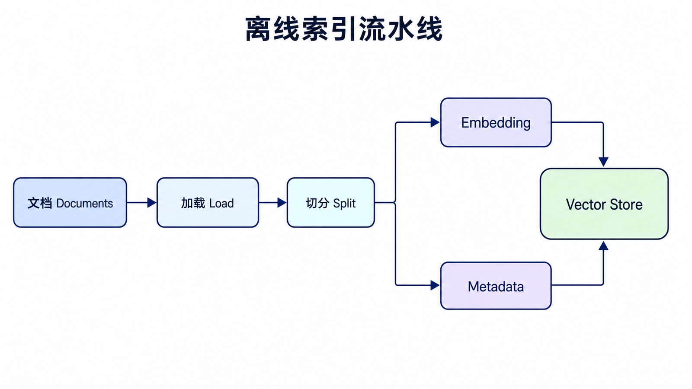
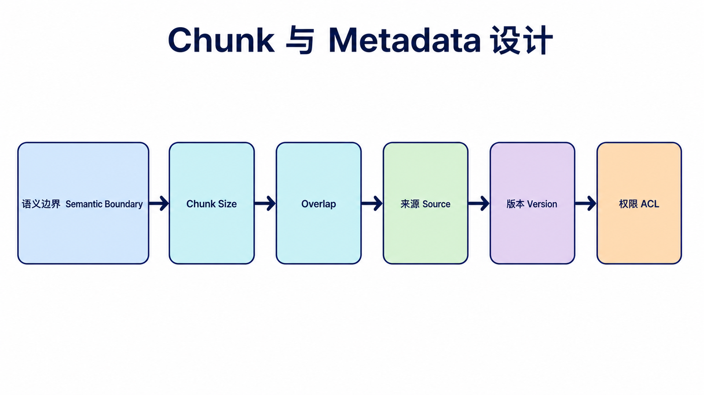
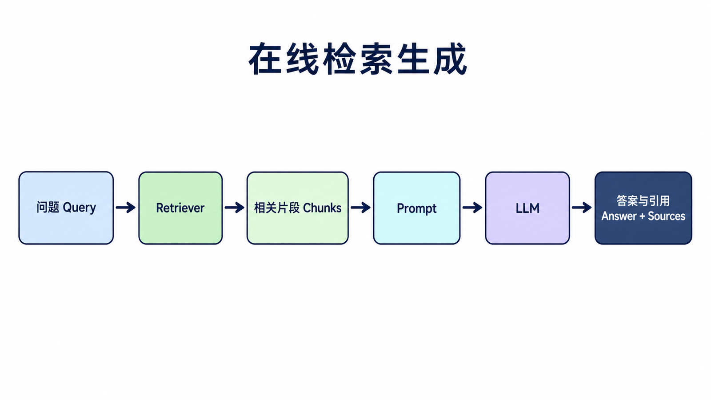
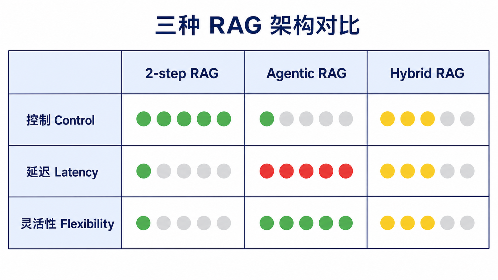
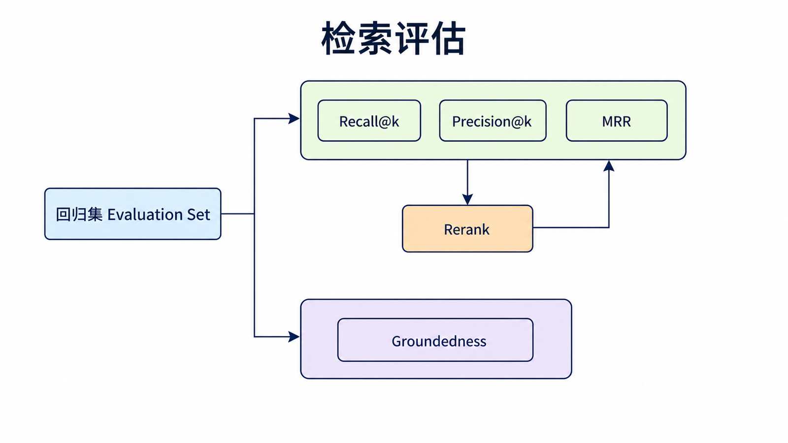
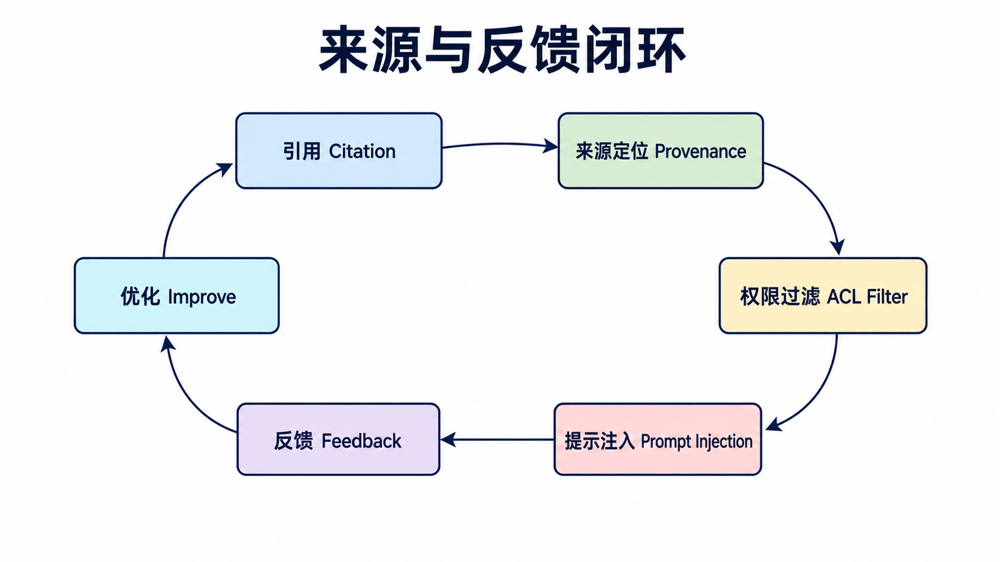

## 阅读指南

**前置知识：** 理解 embedding 将文本映射为向量，并知道 LLM 的上下文窗口有限。

**学完本文你应该能：** 构建最小索引与检索流程；选择 2-step、Agentic 或 Hybrid RAG；设计 chunk 和 metadata；用检索指标与来源检查定位问题。

## 概述

Retrieval（检索）是 LangChain 中实现检索增强生成（Retrieval-Augmented Generation, RAG）的核心模块。RAG 是一种让 LLM 能够访问外部知识库的技术，可以显著提高回答的准确性和可靠性。

RAG 的核心不是“让模型变聪明”，而是在回答前先把相关资料找出来，再把资料和问题一起交给模型。这样模型不需要凭记忆猜答案，也能回答私有文档、最新资料或业务知识库里的问题。

### 为什么需要 RAG？

| 问题         | RAG 解决方案 |
| ------------ | ------------ |
| LLM 知识过时 | 接入最新文档 |
| 幻觉回答     | 基于事实检索 |
| 私有知识缺失 | 加载私有文档 |
| 长尾知识     | 扩展知识库   |

### RAG 工作流程



## 文档加载器

### 内置加载器类型

| 类型                | 说明         |
| ------------------- | ------------ |
| **TextLoader**      | 文本文件     |
| **PDFLoader**       | PDF 文档     |
| **CSVLoader**       | CSV 文件     |
| **WebBaseLoader**   | 网页内容     |
| **DirectoryLoader** | 目录批量加载 |

### 基础加载器

```python
from langchain_community.document_loaders import TextLoader
from langchain_community.document_loaders import DirectoryLoader

loader = TextLoader("document.txt")
documents = loader.load()

loader = DirectoryLoader(
    path="./documents",
    glob="**/*.txt",
    loader_cls=TextLoader
)
documents = loader.load()
```

### PDF 加载

```python
from langchain_community.document_loaders import PyPDFLoader

loader = PyPDFLoader("document.pdf")
documents = loader.load()

for doc in documents:
    print(f"Page {doc.metadata['page']}: {doc.page_content[:200]}...")
```

## 文本分割



### 分割器类型

| 类型                               | 说明          | 适用场景       |
| ---------------------------------- | ------------- | -------------- |
| **CharacterTextSplitter**          | 按字符分割    | 简单文本       |
| **RecursiveCharacterTextSplitter** | 递归字符分割  | 通用场景       |
| **TokenTextSplitter**              | 按 Token 分割 | 控制上下文长度 |

### 基础分割

```python
from langchain_text_splitters import RecursiveCharacterTextSplitter

splitter = RecursiveCharacterTextSplitter(
    chunk_size=1000,
    chunk_overlap=200,
    length_function=len,
    separators=["\n\n", "\n", " ", ""]
)

docs = splitter.split_documents(documents)
```

分割的目标是让每个片段既足够小，能放进模型上下文，又保留完整语义。`chunk_overlap` 可以减少答案刚好跨片段时的信息丢失。

## 向量存储

### 支持的向量数据库

| 数据库       | 说明                    |
| ------------ | ----------------------- |
| **Chroma**   | 轻量级，本地开发首选    |
| **FAISS**    | Facebook 高效相似性搜索 |
| **Pinecone** | 云端向量数据库          |
| **Qdrant**   | 高性能向量数据库        |

### Chroma 向量存储

```python
from langchain_openai import OpenAIEmbeddings
from langchain_chroma import Chroma

embeddings = OpenAIEmbeddings()

vectorstore = Chroma.from_documents(
    documents=docs,
    embedding=embeddings,
    persist_directory="./chroma_db"
)

results = vectorstore.similarity_search("查询内容", k=3)

results_with_scores = vectorstore.similarity_search_with_score(
    "查询内容",
    k=3
)
```

`similarity_search_with_score` 适合调试检索质量：如果分数很差或返回内容不相关，优先检查分割大小、embedding 模型和查询表达，而不是马上改提示词。

### FAISS 向量存储

```python
from langchain_openai import OpenAIEmbeddings
from langchain_community.vectorstores import FAISS

vectorstore = FAISS.from_documents(
    documents=docs,
    embedding=embeddings
)

vectorstore.save_local("faiss_index")

loaded_vectorstore = FAISS.load_local(
    "faiss_index",
    embeddings
)
```

## 检索器

### 基础检索

```python
retriever = vectorstore.as_retriever(
    search_type="similarity",
    search_kwargs={"k": 5}
)

results = retriever.invoke("用户问题")
```

### MMR 检索

最大边际相关（MMR）检索，提供多样性：

```python
retriever = vectorstore.as_retriever(
    search_type="mmr",
    search_kwargs={
        "k": 5,
        "fetch_k": 20,
        "lambda_mult": 0.5
    }
)
```

## RAG Chain 实现



### 基础 RAG

```python
from langchain_openai import ChatOpenAI
from langchain_core.prompts import PromptTemplate
from langchain_core.runnables import RunnablePassthrough

llm = ChatOpenAI(model="gpt-4o")

def format_docs(docs):
    return "\n\n".join([d.page_content for d in docs])

rag_chain = (
    {"context": retriever | format_docs, "question": RunnablePassthrough()}
    | PromptTemplate.from_template(
        """基于以下上下文回答问题：

        上下文：
        {context}

        问题：{question}

        回答："""
    )
    | llm
)

result = rag_chain.invoke("用户问题")
```

### 带历史记录的 RAG

```python
chat_history = []

def chat_with_history(question):
    retrieved_docs = retriever.invoke(question)
    context = "\n\n".join([doc.page_content for doc in retrieved_docs])
    history_text = "\n".join(
        f"{item['role']}: {item['content']}" for item in chat_history
    )

    prompt = PromptTemplate.from_template(
        """基于以下上下文和对话历史回答问题：

        对话历史：
        {chat_history}

        上下文：
        {context}

        问题：{question}

        回答："""
    )

    response = llm.invoke(prompt.format(
        chat_history=history_text,
        context=context,
        question=question
    ))

    chat_history.append({"role": "user", "content": question})
    chat_history.append({"role": "assistant", "content": response.content})

    return response.content

result = chat_with_history("公司的主营业务是什么？")
result = chat_with_history("这个业务的规模有多大？")
```

这里的历史记录只用于帮助模型理解追问，例如“这个业务”指代上一轮的主营业务。真正决定答案事实来源的，仍然应该是检索出来的 `context`。

## Embeddings 模型

### OpenAI Embeddings

```python
from langchain_openai import OpenAIEmbeddings

embeddings = OpenAIEmbeddings(
    model="text-embedding-3-small"
)

vector = embeddings.embed_query("查询文本")

vectors = embeddings.embed_documents([
    "文本1",
    "文本2",
    "文本3"
])
```

### 本地 Embeddings

```python
from langchain_huggingface import HuggingFaceEmbeddings

embeddings = HuggingFaceEmbeddings(
    model_name="sentence-transformers/all-MiniLM-L6-v2"
)
```

## 最佳实践

| 实践                   | 说明                         |
| ---------------------- | ---------------------------- |
| **选择合适的分割大小** | 根据文档类型和模型上下文调整 |
| **保留重叠**           | 设置适当的 chunk_overlap     |
| **使用元数据**         | 为文档添加来源、时间等元信息 |
| **优化嵌入模型**       | 根据语言和领域选择合适模型   |
| **评估检索质量**       | 定期评估和优化检索结果       |

### 分割大小参考

| 场景     | 起始 Chunk Size（字符） |
| -------- | ----------------------- |
| 短问答   | 500-1000 tokens         |
| 文档摘要 | 1000-2000 tokens        |
| 复杂分析 | 2000-4000 tokens        |

分割器的 `chunk_size` 单位取决于具体实现，`RecursiveCharacterTextSplitter` 默认按字符计数，并不是 token。表格只能作为实验起点，最终应根据语料结构、embedding 模型和评估集调优。

## 三种 RAG 架构



| 架构        | 检索时机                     | 优点               | 风险                         |
| ----------- | ---------------------------- | ------------------ | ---------------------------- |
| 2-step RAG  | 每次生成前固定检索           | 行为和延迟可预测   | 简单问题也会检索，灵活性较低 |
| Agentic RAG | Agent 自行决定是否、如何检索 | 可组合多种知识工具 | 延迟和工具次数不确定         |
| Hybrid RAG  | 检索前后加入改写、校验或重试 | 质量控制更强       | 流程更复杂，评估成本更高     |

FAQ、文档问答通常先从 2-step 开始；研究助手或多数据源任务适合 Agentic；高风险领域需要检索充分性和答案一致性检查时再采用 Hybrid。不要用最复杂的架构替代基础检索质量。

## 评估与故障定位



RAG 必须把“没检索到”和“检索到了但模型没用好”分开评估。检索层使用 Recall@k、Precision@k、MRR 或人工相关性；生成层检查答案是否被上下文支持、引用是否指向正确 chunk、无依据时是否拒答。

推荐保存一组带相关文档标注的问题作为回归集。每次修改 chunk、embedding、过滤、top-k 或 reranker 后重新运行，避免只凭几个演示问题判断效果。

## 来源与安全边界



每个 Document 应保留来源、版本、更新时间、权限和定位信息。最终回答引用的是实际进入上下文的 chunk，而不是模糊写“来自知识库”。检索到的文档仍属于不可信输入，其中可能包含提示注入；系统指令应明确文档是资料而不是命令，并在工具层执行权限过滤。

## 用实验选择 Chunk 与 Top-k

Chunk 并不存在对所有文档都正确的固定大小。API 文档适合按标题和代码块切分，合同适合按条款切分，对话适合按轮次或主题切分。先建立小型标注集，再对不同 chunk、overlap、top-k 和 metadata filter 组合运行检索评估。

| 现象                 | 可能原因                            | 优先实验                               |
| -------------------- | ----------------------------------- | -------------------------------------- |
| 正确文档完全没出现   | chunk 语义被切断或 embedding 不匹配 | 语义切分、领域 embedding、查询改写     |
| 正确文档排名很低     | 相似片段过多或关键词信号缺失        | Hybrid Search、reranker、metadata 过滤 |
| 上下文很多但答案仍差 | 噪声过多或 Prompt 没定义引用规则    | 降低 top-k、压缩上下文、验证引用       |
| 旧内容压过新内容     | Metadata 没有版本和时间             | 版本过滤、时间衰减、索引清理           |

一次只改变一个主要变量并保存结果，否则无法知道提升来自哪项修改。

## RAG 的输出契约

一个可验证的 RAG 响应至少包含答案、引用列表和“资料是否充分”的状态。引用项保存文档 ID、chunk ID、定位信息和可展示标题；不要只返回一段拼接后的 context。资料不足时返回明确状态，让 UI 提示用户补充信息，而不是逼模型编造完整答案。

如果还需要置信度，应定义它来自检索分数、reranker、规则或额外评估器，不能直接把模型自报的数字当成概率。

## 总结

RAG 是扩展 LLM 能力的核心技术：

| 组件               | 功能             |
| ------------------ | ---------------- |
| **DocumentLoader** | 加载各种格式文档 |
| **TextSplitter**   | 将文档分割成块   |
| **Embeddings**     | 将文本转为向量   |
| **VectorStore**    | 存储和检索向量   |
| **RAG Chain**      | RAG 问答链       |

掌握 RAG，可以构建强大的知识库问答系统。

## 本篇自检

1. 2-step RAG 与 Agentic RAG 的核心区别是什么？
2. 为什么只评估最终答案无法定位 RAG 问题？
3. Metadata 除了来源名称，还应保存哪些字段？

<details>
<summary>查看答案</summary>

1. 前者固定先检索再生成，后者由 Agent 决定是否以及如何调用检索工具。
2. 错误可能来自召回、排序、上下文组装或生成，必须分别测量才能定位。
3. 至少包括版本、更新时间、权限或租户、文档位置以及可用于引用的标识。

</details>

## 官方资料

- [Retrieval](https://docs.langchain.com/oss/python/langchain/retrieval)
- [Build a RAG agent](https://docs.langchain.com/oss/python/langchain/rag)
- [Vector stores](https://docs.langchain.com/oss/python/integrations/vectorstores)

**上一篇：** [LangChain Memory](/posts/langchain-memory/) · **下一篇：** [LangChain Callbacks](/posts/langchain-callbacks/)
