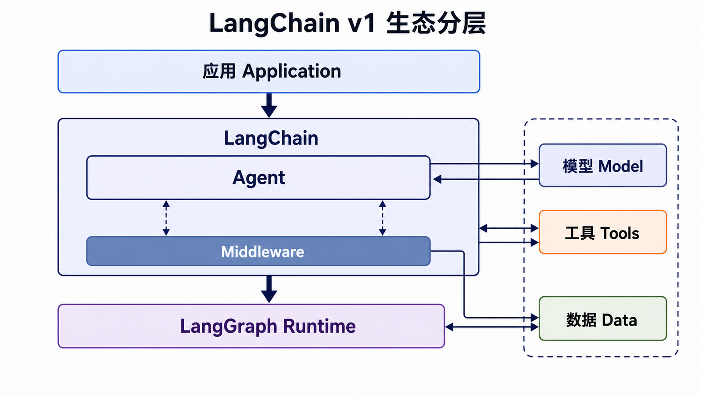
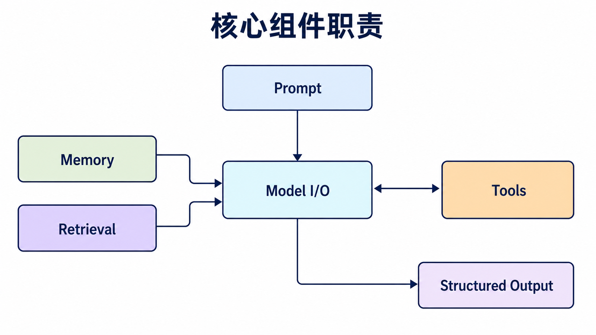
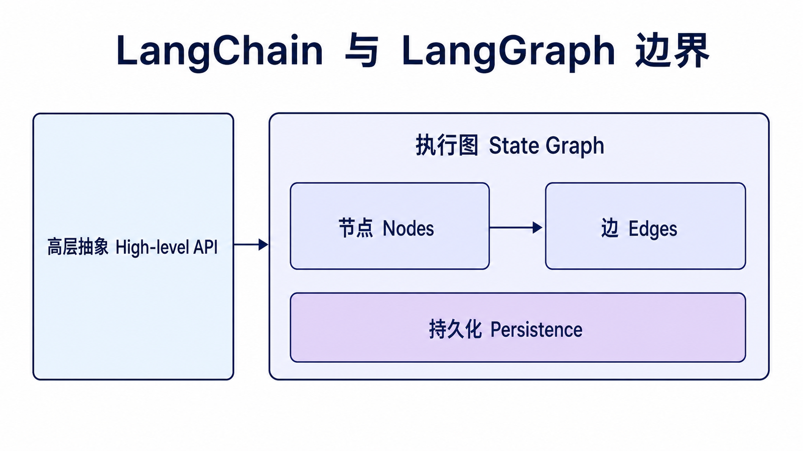
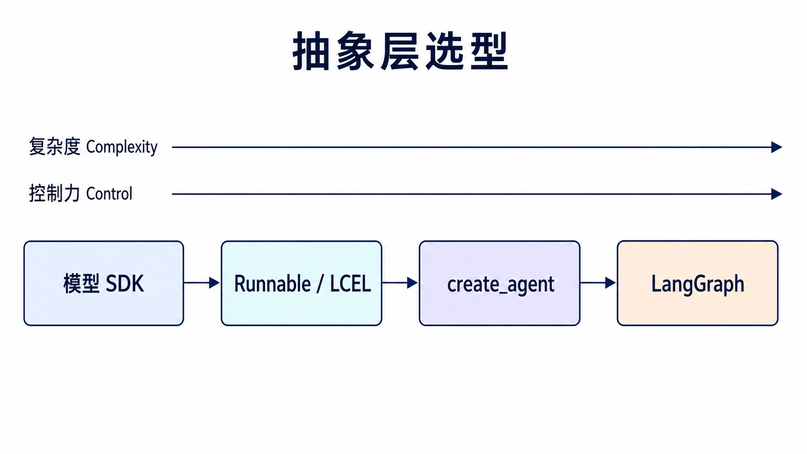
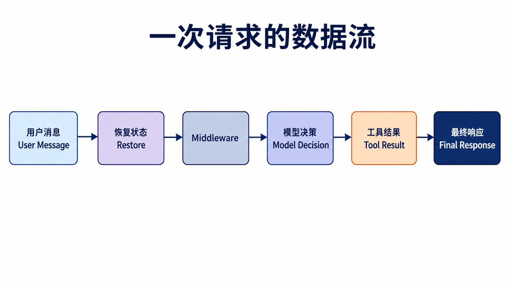

## 阅读指南

**前置知识：** 能阅读基础 Python，知道 LLM 接收消息并生成回复即可，不要求了解 LangGraph。

**学完本文你应该能：** 解释 LangChain 解决什么问题；区分模型 SDK、LangChain 与 LangGraph；运行一个带工具和会话状态的最小 Agent；判断什么时候不需要引入 LangChain。

本文以执行时稳定的 LangChain v1.x 为基线。示例中的模型名称只是可替换配置，真正需要掌握的是消息、工具、状态和执行图之间的接口。

## 概述

LangChain v1.x 是一个面向生产环境的 AI Agent 构建框架，将 LLM 与外部工具结合，提供记忆能力、结构化输出和中间件控制。标准 Agent 基于 **LangGraph** 构建，将执行过程表达为状态图，实现可追踪、可调试、可持久化的流程。

简单说，LangChain 负责把“模型调用、提示词、工具、状态、检索”这些零散能力接成一个可维护的应用骨架。刚开始接触时，不必急着记住所有类名，先理解每个模块在请求链路中负责哪一段，会更容易看懂后面的示例。

版本提示：本文按 LangChain v1 的思路组织。v1 中 `langchain` 主包更聚焦 Agent 相关能力，旧版 Chain、Memory 等接口如果继续使用，需要结合 `langchain-classic` 或迁移到新版的 Runnable、messages、checkpointer 写法。

### 核心设计理念

| 理念         | 说明                               |
| ------------ | ---------------------------------- |
| **数据融合** | LLM 与外部数据源结合时最具变革性   |
| **Agent 化** | 未来应用将越来越 Agent 化          |
| **编排优先** | 模型应编排复杂流程，而非仅生成文本 |

### LangChain vs LangGraph 关系



## 核心概念

### 六大模块



| 模块                | 功能                         |
| ------------------- | ---------------------------- |
| **Model I/O**       | 与语言模型交互，管理输入输出 |
| **Prompt Template** | 提示词模板化和管理           |
| **Agent**           | 自主决策和执行任务的智能体   |
| **Tool**            | 扩展 LLM 能力的外部函数      |
| **Memory**          | 在对话或处理过程中保持状态   |
| **Retrieval**       | 检索增强生成（RAG）相关组件  |

## 环境配置

### 安装 LangChain v1.x

```bash
pip install langchain langgraph langchain-openai
pip install langchain-community langchain-text-splitters
pip install langchain-chroma langchain-huggingface chromadb
```

### 环境变量配置

```python
import os

os.environ["OPENAI_API_KEY"] = "your-api-key"
os.environ["OPENAI_BASE_URL"] = "https://api.openai.com/v1"
```

### 快速验证

```python
from langchain_openai import ChatOpenAI

llm = ChatOpenAI(model="gpt-4o")

response = llm.invoke("你好，请介绍一下你自己")
print(response.content)
```

## Agent 模块（v1 标准 API）

### create_agent 基础用法

```python
from langchain.agents import create_agent
from langchain_openai import ChatOpenAI

def get_weather(city: str) -> str:
    """获取城市天气信息"""
    return f"{city}今天天气晴朗，25摄氏度"

llm = ChatOpenAI(model="gpt-4o")

agent = create_agent(
    model=llm,
    tools=[get_weather],
    system_prompt="你是一个有帮助的 AI 助手，可以使用工具来回答问题。"
)

result = agent.invoke({"messages": [{"role": "user", "content": "北京今天的天气怎么样？"}]})
print(result["messages"][-1].content)
```

### 消息格式

```python
from langchain_core.messages import HumanMessage, AIMessage, SystemMessage, ToolMessage

messages = [
    SystemMessage(content="你是一个专业助手。"),
    HumanMessage(content="你好"),
]

response = llm.invoke(messages)
```

## Tool 模块

### 定义工具

```python
from langchain_core.tools import tool

@tool
def search_database(query: str) -> str:
    """搜索数据库获取相关信息"""
    return f"关于'{query}'的搜索结果..."

@tool
def calculate(expression: str) -> str:
    """执行数学计算"""
    import operator

    ops = {
        "+": operator.add,
        "-": operator.sub,
        "*": operator.mul,
        "/": operator.truediv,
    }
    left, op, right = expression.split()
    if op not in ops:
        return "只支持 +、-、*、/ 四种运算"
    return str(ops[op](float(left), float(right)))

tools = [search_database, calculate]
```

工具函数的边界越清晰，Agent 越容易稳定调用。这里没有把任意字符串交给 Python 执行，因为示例代码经常会被直接复制到真实项目里，保守一些更安全。

## Memory 模块

### 对话记忆

```python
from langchain.agents import create_agent
from langgraph.checkpoint.memory import InMemorySaver

checkpointer = InMemorySaver()

agent = create_agent(
    model=llm,
    tools=tools,
    system_prompt="你是一个有帮助的助手。",
    checkpointer=checkpointer
)

config = {"configurable": {"thread_id": "demo-user"}}

result1 = agent.invoke(
    {"messages": [{"role": "user", "content": "我叫张三"}]},
    config=config
)
result2 = agent.invoke(
    {"messages": [{"role": "user", "content": "我叫什么名字？"}]},
    config=config
)
```

同一个 `thread_id` 会把两次调用放进同一段对话状态里。换成新的 `thread_id`，就相当于开始一段新的会话。

## Retrieval 模块 (RAG)

### 基础 RAG 实现

```python
from langchain_community.document_loaders import TextLoader
from langchain_text_splitters import RecursiveCharacterTextSplitter
from langchain_openai import OpenAIEmbeddings
from langchain_chroma import Chroma

loader = TextLoader("文档路径.txt")
documents = loader.load()

splitter = RecursiveCharacterTextSplitter(
    chunk_size=1000,
    chunk_overlap=200
)
docs = splitter.split_documents(documents)

embeddings = OpenAIEmbeddings()
vectorstore = Chroma.from_documents(docs, embeddings)

retriever = vectorstore.as_retriever(search_kwargs={"k": 3})
```

## 实战示例：构建简单 Agent

```python
from langchain.agents import create_agent
from langchain_openai import ChatOpenAI
from langchain_core.tools import tool

@tool
def get_weather(city: str) -> str:
    """获取城市天气"""
    return f"{city}今天天气晴朗，25°C"

@tool
def calculator(expression: str) -> str:
    """数学计算"""
    import operator

    ops = {"+": operator.add, "-": operator.sub, "*": operator.mul, "/": operator.truediv}
    left, op, right = expression.split()
    return str(ops[op](float(left), float(right)))

llm = ChatOpenAI(model="gpt-4o", temperature=0)
tools = [get_weather, calculator]

agent = create_agent(
    model=llm,
    tools=tools,
    system_prompt="你是一个智能助手，可以通过工具来回答问题。"
)

result = agent.invoke({
    "messages": [{"role": "user", "content": "计算 2 + 3 的结果"}]
})

print(result["messages"][-1].content)
```

## 与 LangGraph 的关系



对于需要更精细控制的场景，可以直接使用 LangGraph：

```python
from langgraph.graph import StateGraph, START, END, MessagesState
from langgraph.prebuilt import ToolNode, tools_condition
from langchain_openai import ChatOpenAI
from langchain_core.tools import tool

@tool
def search(query: str) -> str:
    """搜索工具"""
    return f"搜索结果: {query}"

tools = [search]
tool_node = ToolNode(tools)

model = ChatOpenAI(model="gpt-4o").bind_tools(tools)

def should_continue(state: MessagesState):
    last_message = state["messages"][-1]
    if last_message.tool_calls:
        return "tools"
    return END

def call_model(state: MessagesState):
    messages = state["messages"]
    response = model.invoke(messages)
    return {"messages": [response]}

graph = StateGraph(MessagesState)
graph.add_node("model", call_model)
graph.add_node("tools", tool_node)
graph.add_edge(START, "model")
graph.add_conditional_edges("model", should_continue)
graph.add_edge("tools", "model")

app = graph.compile()

result = app.invoke({
    "messages": [{"role": "user", "content": "搜索 LangChain 相关资料"}]
})
```

## 如何选择抽象层



不要因为项目“使用了 LLM”就默认需要 LangChain。先看你需要控制的复杂度：

| 场景                             | 建议入口        | 原因                               |
| -------------------------------- | --------------- | ---------------------------------- |
| 一次模型调用、无工具、无状态     | 模型供应商 SDK  | 依赖最少，调试路径最短             |
| 提示词、模型、解析器的确定性组合 | Runnable / LCEL | 数据流清楚，易测试和复用           |
| 模型需要自行选择工具             | `create_agent`  | 已提供标准 Agent 循环与 middleware |
| 长流程、分支、恢复和人工审批     | LangGraph       | 可以显式定义状态、节点和边         |

LangChain 是高层组件和生产化 Agent 入口，LangGraph 是底层编排运行时。两者不是竞争关系：`create_agent` 本身就运行在 LangGraph 上；只有当预制 Agent 无法表达你的控制流时，才需要直接编写图。

## 一次请求经历了什么



1. 应用把用户输入和 `thread_id` 交给 Agent。
2. Checkpointer 恢复该 thread 的历史状态。
3. Middleware 可以裁剪消息、注入上下文或限制工具。
4. 模型决定直接回答还是发起工具调用。
5. 工具结果以 Tool Message 回到状态，模型继续判断。
6. 没有新的工具调用时，Agent 返回最终消息或结构化结果。
7. 新状态写入 checkpoint，Callback 或 tracing 旁路记录执行过程。

这条路径也是后续九篇文章的共同骨架：Model I/O 负责第 4 步，Prompt 负责第 3 步的上下文组织，Memory 负责第 2、7 步，Retrieval 通常以工具或确定性步骤参与第 4、5 步。

## 常见误区

- **把 Chain、Agent 和 Graph 当成同义词。** Chain 是确定性组合，Agent 把下一步交给模型决策，Graph 则显式描述状态和控制流。
- **把聊天记录全部塞进上下文。** 状态可以持久化，不代表每次都应发送全部历史；长会话需要裁剪、摘要或检索。
- **用复杂框架掩盖不清晰的需求。** 如果输入、输出和步骤尚未定义，增加 Agent 只会让故障更难定位。
- **照搬旧版教程。** v1 主包已经收敛，旧 Chain、旧 Memory 类应查看迁移说明或 `langchain-classic`。

## 总结

| 组件          | v1 推荐 API                  | 用途         |
| ------------- | ---------------------------- | ------------ |
| **Agent**     | `create_agent()`             | 构建智能体   |
| **Tools**     | `@tool` 装饰器               | 定义工具函数 |
| **Memory**    | `checkpointer` + `thread_id` | 对话状态     |
| **Retrieval** | `vectorstore.as_retriever()` | RAG 检索     |

LangChain v1.x 提供 `create_agent` 标准入口。通过 `system_prompt` 配置角色行为，通过 `tools` 扩展能力，通过 `checkpointer` 和 `thread_id` 保存并恢复会话状态。

对于复杂场景，可以下潜到 LangGraph 获得更精细的控制。

## 本篇自检

1. 只有一次无状态模型调用时，为什么模型 SDK 往往比 LangChain 更合适？
2. `create_agent` 与直接编写 LangGraph 的边界是什么？
3. `thread_id`、checkpointer 和模型上下文分别解决什么问题？

<details>
<summary>查看答案</summary>

1. SDK 的依赖和执行路径更短，没有必要为不存在的编排需求增加抽象。
2. 标准工具循环优先使用 `create_agent`；需要自定义节点、分支、恢复或人工审批流程时再直接使用 LangGraph。
3. `thread_id` 标识会话，checkpointer 保存和恢复状态，模型上下文是本次实际发送给模型的有限消息集合。

</details>

## 官方资料

- [LangChain v1 发布说明](https://docs.langchain.com/oss/python/releases/langchain-v1)
- [LangChain v1 迁移指南](https://docs.langchain.com/oss/python/migrate/langchain-v1)
- [Agents](https://docs.langchain.com/oss/python/langchain/agents)

**下一篇：** [LangChain Model I/O：模型交互与统一接口](/posts/langchain-model-io/)
