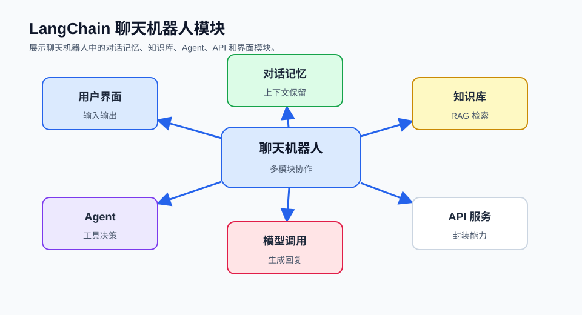

## 概述

本文将通过一个完整的实战项目，展示如何使用 LangChain v1.0 构建功能丰富的聊天机器人。我们将实现一个支持多轮对话、知识库问答和流式输出的智能助手。

这篇文章更关注“模块如何拼在一起”。代码没有追求一次性覆盖所有生产细节，而是把聊天记忆、知识库检索、工具调用和界面交互拆开讲清楚，方便你后续替换模型、向量库或前端框架。



### 项目架构

```
┌─────────────────────────────────────────────────────────────┐
│                    聊天机器人架构                             │
├─────────────────────────────────────────────────────────────┤
│                                                              │
│   ┌─────────────┐    ┌─────────────┐    ┌─────────────┐   │
│   │   前端界面   │ ←→ │   API层     │ ←→ │  LangChain  │   │
│   └─────────────┘    └─────────────┘    └─────────────┘   │
│                                              │             │
│                           ┌──────────────────┼──────────┐   │
│                           │                  │          │   │
│                           ▼                  ▼          ▼   │
│                      ┌─────────┐      ┌─────────┐  ┌─────┐ │
│                      │ Memory  │      │  Agent  │  │ RAG │ │
│                      └─────────┘      └─────────┘  └─────┘ │
│                                                              │
└─────────────────────────────────────────────────────────────┘
```

## 项目初始化

### 环境准备

```bash
pip install langchain langgraph langchain-openai langchain-community
pip install langchain-text-splitters langchain-chroma langchain-huggingface
pip install streamlit python-dotenv chromadb
```

## 对话记忆模块

```python
class ChatMemory:
    def __init__(self):
        self.messages = []

    def save_context(self, user_input: str, ai_output: str):
        self.messages.append({"role": "user", "content": user_input})
        self.messages.append({"role": "assistant", "content": ai_output})

    def get_history(self) -> list:
        return self.messages

    def clear(self):
        self.messages.clear()
```

这里用普通列表保存消息，是为了让状态结构一眼可见：模型需要的就是一组按顺序排列的 `messages`。如果要跨进程或跨服务保存，再把这层替换成数据库或 LangGraph checkpointer。

## 知识库模块

```python
from langchain_community.document_loaders import TextLoader
from langchain_text_splitters import RecursiveCharacterTextSplitter
from langchain_openai import OpenAIEmbeddings
from langchain_chroma import Chroma

class KnowledgeBase:
    def __init__(self):
        self.embeddings = OpenAIEmbeddings()
        self.vectorstore = None
        self.retriever = None

    def load_documents(self, documents_path: str):
        loader = TextLoader(documents_path)
        documents = loader.load()

        splitter = RecursiveCharacterTextSplitter(
            chunk_size=1000,
            chunk_overlap=200
        )
        texts = splitter.split_documents(documents)

        self.vectorstore = Chroma.from_documents(
            documents=texts,
            embedding=self.embeddings
        )

        self.retriever = self.vectorstore.as_retriever(
            search_kwargs={"k": 5}
        )

    def query(self, question: str, k: int = 5):
        if not self.retriever:
            return []
        docs = self.retriever.invoke(question)
        return docs
```

知识库模块只负责“把文档变成可检索的上下文”，不直接生成回答。这样 UI、Agent 和 RAG 可以分开测试，也更容易替换 Chroma、FAISS 或云端向量数据库。

## Agent 模块

```python
from langchain.agents import create_agent
from langchain_openai import ChatOpenAI
from langchain_core.tools import tool

@tool
def calculator(expression: str) -> str:
    """执行数学计算"""
    try:
        import operator

        ops = {"+": operator.add, "-": operator.sub, "*": operator.mul, "/": operator.truediv}
        left, op, right = expression.split()
        result = ops[op](float(left), float(right))
        return f"计算结果：{result}"
    except Exception as e:
        return f"计算错误：{str(e)}"

@tool
def date_query(command: str) -> str:
    """获取当前日期"""
    from datetime import datetime
    return datetime.now().strftime("%Y年%m月%d日")

def create_tool_agent():
    llm = ChatOpenAI(model="gpt-4o", temperature=0)
    tools = [calculator, date_query]

    agent = create_agent(
        model=llm,
        tools=tools,
        system_prompt="你是一个智能助手，可以使用工具来回答问题。"
    )
    return agent
```

## 流式输出

```python
from langchain_openai import ChatOpenAI
from langchain_core.callbacks import StreamingStdOutCallbackHandler

def create_streaming_chain():
    llm = ChatOpenAI(
        model="gpt-4o",
        streaming=True,
        callbacks=[StreamingStdOutCallbackHandler()]
    )

    return llm
```

## Streamlit 应用

```python
import streamlit as st
from langchain_core.callbacks import BaseCallbackHandler

class StreamlitCallbackHandler(BaseCallbackHandler):
    def __init__(self, container):
        self.container = container
        self.text_area = None

    def on_llm_new_token(self, token, **kwargs):
        if self.text_area:
            self.text_area.markdown(token)

if "memory" not in st.session_state:
    st.session_state.memory = ChatMemory()

if "chat_mode" not in st.session_state:
    st.session_state.chat_mode = "basic"

if "knowledge_base" not in st.session_state:
    st.session_state.knowledge_base = KnowledgeBase()

with st.sidebar:
    st.session_state.chat_mode = st.selectbox(
        "选择聊天模式",
        ["basic", "agent"]
    )

st.title("🤖 AI 聊天助手")

for message in st.session_state.memory.get_history():
    with st.chat_message(message["role"]):
        st.write(message["content"])

user_input = st.chat_input("输入你的问题...")

if user_input:
    with st.chat_message("user"):
        st.write(user_input)

    with st.chat_message("assistant"):
        if st.session_state.chat_mode == "agent":
            agent = create_tool_agent()
            result = agent.invoke({
                "messages": [{"role": "user", "content": user_input}]
            })
            response = result["messages"][-1].content
        else:
            llm = ChatOpenAI(model="gpt-4o")
            history = st.session_state.memory.get_history()
            messages = history + [{"role": "user", "content": user_input}]
            response = llm.invoke(messages).content

        st.write(response)
        st.session_state.memory.save_context(user_input, response)
```

## 测试

```python
def test_memory():
    memory = ChatMemory()
    memory.save_context("你好", "你好！")
    history = memory.get_history()
    assert len(history) == 2

def test_agent():
    agent = create_tool_agent()
    result = agent.invoke({
        "messages": [{"role": "user", "content": "计算 2 + 3"}]
    })
    assert result["messages"][-1].content
```

## 总结

本文实现了一个完整的 LangChain v1.0 聊天机器人：

| 模块 | 功能 |
|------|------|
| **memory** | 对话记忆管理 |
| **knowledge_base** | RAG 知识库 |
| **agents** | 工具调用 Agent |

核心特性：
- ✅ 多轮对话记忆
- ✅ 知识库问答 (RAG)
- ✅ 工具调用 Agent
- ✅ 流式输出
- ✅ 多聊天模式

这个项目可以作为开发更复杂 LLM 应用的基础。
