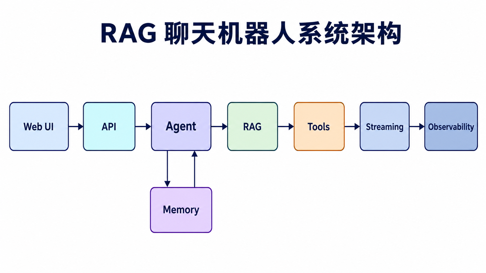
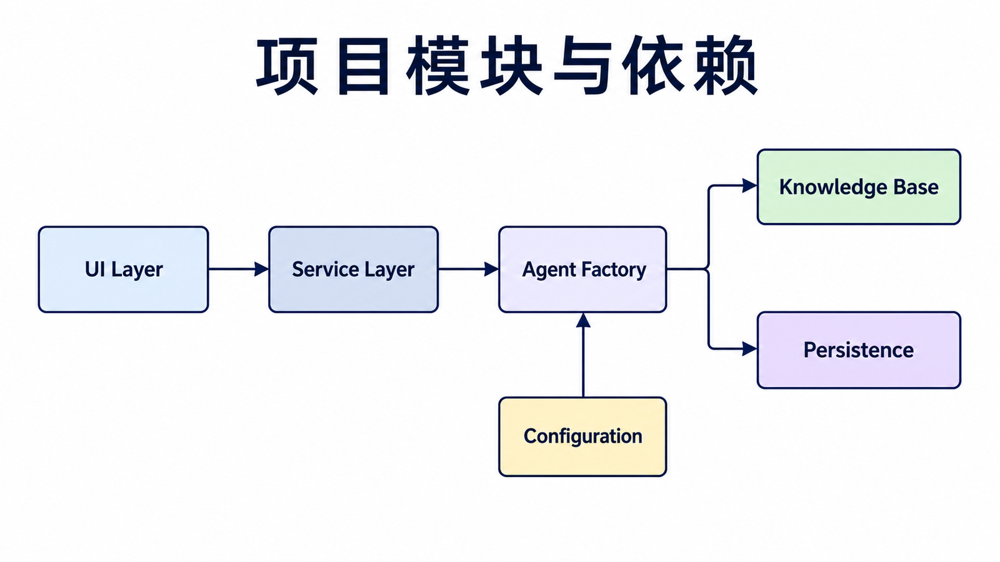
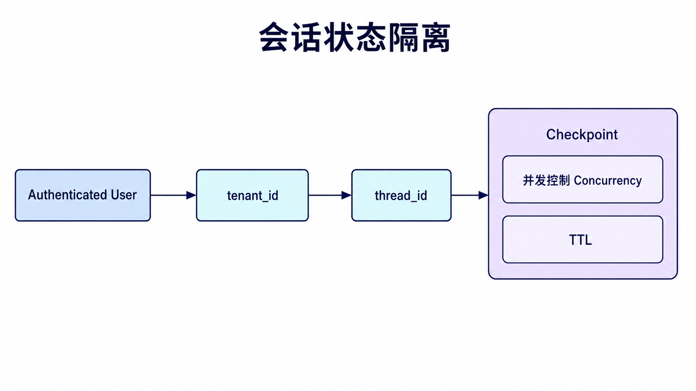
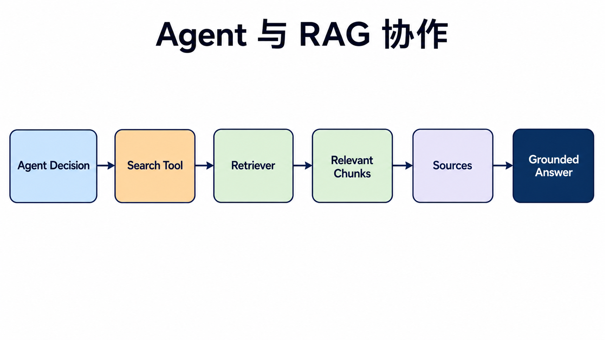
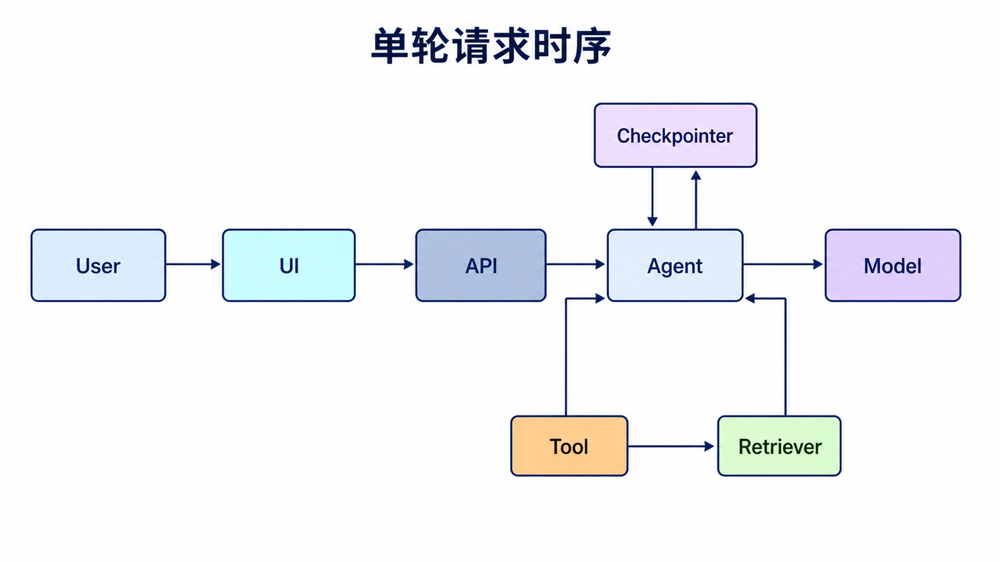
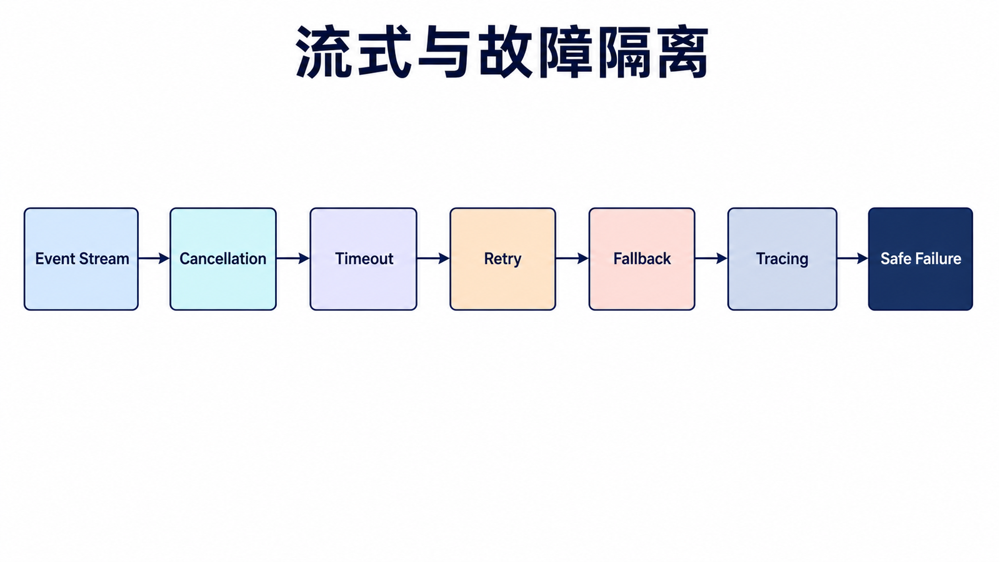

## 阅读指南

**前置知识：** 已理解本系列的 Model I/O、Runnable、Agent、Memory、Retrieval 和 Callback。

**学完本文你应该能：** 组织一个可运行聊天项目；隔离多用户状态；把 RAG 暴露为受控工具；流式展示 Agent 事件；在不调用付费模型的情况下测试关键模块。

## 概述

本文通过一个完整项目展示如何使用 LangChain v1.x 构建聊天机器人，实现多轮对话、知识库问答、工具调用、流式输出和可观测性。

这篇文章更关注“模块如何拼在一起”。代码没有追求一次性覆盖所有生产细节，而是把聊天记忆、知识库检索、工具调用和界面交互拆开讲清楚，方便你后续替换模型、向量库或前端框架。

### 项目架构



## 项目初始化



### 推荐目录

```text
chatbot/
├── app.py                 # Streamlit 或其他 UI
├── service.py             # 请求入口、鉴权与事件流
├── agent.py               # Agent 工厂与 middleware
├── retrieval.py           # 索引、Retriever 与来源转换
├── tools.py               # 带 Schema 的工具
├── settings.py            # 环境变量与模型配置
└── tests/
    ├── test_memory.py
    ├── test_retrieval.py
    └── test_agent_flow.py
```

UI 不直接创建模型、向量库或 checkpointer。`service.py` 接收已认证用户与 thread，调用 Agent 并把事件转换成前端协议；这样切换 Streamlit、WebSocket 或普通 HTTP 时无需重写业务层。

### 环境准备

```bash
pip install langchain langgraph langchain-openai langchain-community
pip install langchain-text-splitters langchain-chroma langchain-huggingface
pip install streamlit python-dotenv chromadb
```

## 对话记忆模块



下面的 `ChatMemory` 用于解释消息列表的数据结构，不是生产环境的推荐持久化方案。正式 Agent 使用 checkpointer 和 `thread_id`，避免 UI 状态、模型上下文与持久化状态互相覆盖。

```python
class ChatMemory:
    def __init__(self):
        self.messages = []

    def save_context(self, user_input: str, ai_output: str):
        self.messages.append({"role": "user", "content": user_input})
        self.messages.append({"role": "assistant", "content": ai_output})

    def get_history(self) -> list:
        return self.messages

    def clear(self):
        self.messages.clear()
```

这里用普通列表保存消息，是为了让状态结构一眼可见：模型需要的就是一组按顺序排列的 `messages`。如果要跨进程或跨服务保存，再把这层替换成数据库或 LangGraph checkpointer。

## 知识库模块



```python
from langchain_community.document_loaders import TextLoader
from langchain_text_splitters import RecursiveCharacterTextSplitter
from langchain_openai import OpenAIEmbeddings
from langchain_chroma import Chroma

class KnowledgeBase:
    def __init__(self):
        self.embeddings = OpenAIEmbeddings()
        self.vectorstore = None
        self.retriever = None

    def load_documents(self, documents_path: str):
        loader = TextLoader(documents_path)
        documents = loader.load()

        splitter = RecursiveCharacterTextSplitter(
            chunk_size=1000,
            chunk_overlap=200
        )
        texts = splitter.split_documents(documents)

        self.vectorstore = Chroma.from_documents(
            documents=texts,
            embedding=self.embeddings
        )

        self.retriever = self.vectorstore.as_retriever(
            search_kwargs={"k": 5}
        )

    def query(self, question: str, k: int = 5):
        if not self.retriever:
            return []
        docs = self.retriever.invoke(question)
        return docs
```

知识库模块只负责“把文档变成可检索的上下文”，不直接生成回答。这样 UI、Agent 和 RAG 可以分开测试，也更容易替换 Chroma、FAISS 或云端向量数据库。

## Agent 模块

```python
from langchain.agents import create_agent
from langchain_openai import ChatOpenAI
from langchain_core.tools import tool

@tool
def calculator(expression: str) -> str:
    """执行数学计算"""
    try:
        import operator

        ops = {"+": operator.add, "-": operator.sub, "*": operator.mul, "/": operator.truediv}
        left, op, right = expression.split()
        result = ops[op](float(left), float(right))
        return f"计算结果：{result}"
    except Exception as e:
        return f"计算错误：{str(e)}"

@tool
def date_query(command: str) -> str:
    """获取当前日期"""
    from datetime import datetime
    return datetime.now().strftime("%Y年%m月%d日")

def create_tool_agent():
    llm = ChatOpenAI(model="gpt-4o", temperature=0)
    tools = [calculator, date_query]

    agent = create_agent(
        model=llm,
        tools=tools,
        system_prompt="你是一个智能助手，可以使用工具来回答问题。"
    )
    return agent
```

## 流式输出

```python
from langchain_openai import ChatOpenAI
from langchain_core.callbacks import StreamingStdOutCallbackHandler

def create_streaming_chain():
    llm = ChatOpenAI(
        model="gpt-4o",
        streaming=True,
        callbacks=[StreamingStdOutCallbackHandler()]
    )

    return llm
```

## Streamlit 应用

```python
import streamlit as st
from langchain_core.callbacks import BaseCallbackHandler

class StreamlitCallbackHandler(BaseCallbackHandler):
    def __init__(self, container):
        self.container = container
        self.text_area = None

    def on_llm_new_token(self, token, **kwargs):
        if self.text_area:
            self.text_area.markdown(token)

if "memory" not in st.session_state:
    st.session_state.memory = ChatMemory()

if "chat_mode" not in st.session_state:
    st.session_state.chat_mode = "basic"

if "knowledge_base" not in st.session_state:
    st.session_state.knowledge_base = KnowledgeBase()

with st.sidebar:
    st.session_state.chat_mode = st.selectbox(
        "选择聊天模式",
        ["basic", "agent"]
    )

st.title("🤖 AI 聊天助手")

for message in st.session_state.memory.get_history():
    with st.chat_message(message["role"]):
        st.write(message["content"])

user_input = st.chat_input("输入你的问题...")

if user_input:
    with st.chat_message("user"):
        st.write(user_input)

    with st.chat_message("assistant"):
        if st.session_state.chat_mode == "agent":
            agent = create_tool_agent()
            result = agent.invoke({
                "messages": [{"role": "user", "content": user_input}]
            })
            response = result["messages"][-1].content
        else:
            llm = ChatOpenAI(model="gpt-4o")
            history = st.session_state.memory.get_history()
            messages = history + [{"role": "user", "content": user_input}]
            response = llm.invoke(messages).content

        st.write(response)
        st.session_state.memory.save_context(user_input, response)
```

## 测试

```python
def test_memory():
    memory = ChatMemory()
    memory.save_context("你好", "你好！")
    history = memory.get_history()
    assert len(history) == 2

def test_agent():
    agent = create_tool_agent()
    result = agent.invoke({
        "messages": [{"role": "user", "content": "计算 2 + 3"}]
    })
    assert result["messages"][-1].content
```

## 推荐的会话入口



```python
from langchain.agents import create_agent
from langgraph.checkpoint.memory import InMemorySaver

agent = create_agent(
    model=model,
    tools=[search_knowledge_base, calculator],
    system_prompt=(
        "你是知识库助手。需要事实资料时先检索；"
        "引用检索结果的来源；资料不足时明确说明。"
    ),
    checkpointer=InMemorySaver(),
)

def chat(user_input: str, thread_id: str):
    config = {
        "configurable": {"thread_id": thread_id},
        "tags": ["chatbot"],
    }
    return agent.invoke(
        {"messages": [{"role": "user", "content": user_input}]},
        config=config,
    )
```

`InMemorySaver` 只用于本地演示。部署为多个进程或需要重启恢复时，替换为数据库型 checkpointer，并确保 `thread_id` 在当前租户内唯一。前端传来的用户 ID 不能直接当作已认证身份，服务端必须先完成鉴权。

服务入口还应把 `tenant_id`、`user_id` 和权限作为受信 runtime context 注入，而不是写进用户消息。检索工具从 context 获取租户过滤条件，副作用工具从 context 获取权限；用户即使在 Prompt 中声称自己是管理员，也不能改变这些值。

## 流式事件与 UI

生产聊天 UI 不应只拼接字符串 token，还要区分模型 token、工具开始、工具结果、审批中断和最终响应。用户取消请求时，应把取消信号传到后端，停止继续调用模型或工具；否则界面虽然关闭，成本仍在产生。

可以给前端定义稳定的事件协议：

| 事件                   | 必备字段                     | UI 行为                          |
| ---------------------- | ---------------------------- | -------------------------------- |
| `message_delta`        | run_id、text                 | 追加回答文本                     |
| `tool_started`         | tool_name、call_id           | 显示正在查询或计算               |
| `tool_finished`        | call_id、summary             | 更新工具状态，不暴露敏感原始结果 |
| `sources`              | document_id、title、location | 渲染可点击来源                   |
| `approval_required`    | action、risk、approval_id    | 展示批准或拒绝按钮               |
| `completed` / `failed` | status、error_code           | 结束 loading 并允许重试          |

前端只根据事件更新视图，不解析 Agent 内部消息对象。后端升级 LangChain 或更换模型时，前端协议仍可保持稳定。

## 故障隔离与降级



| 故障            | 用户体验           | 后端处理                                   |
| --------------- | ------------------ | ------------------------------------------ |
| 检索无结果      | 明确提示资料不足   | 不伪造来源，可允许普通模型回答并标记未检索 |
| 工具超时        | 显示该能力暂不可用 | 有限重试，记录工具和超时阶段               |
| 模型限流        | 显示稍后重试       | 指数退避或切换已批准的备用模型             |
| Parser 校验失败 | 不展示半结构化数据 | 记录原始输出，有限修复或安全失败           |
| Checkpoint 冲突 | 提示重新加载会话   | 版本检测，防止覆盖另一并发请求             |

## 演练一次完整请求

假设已认证用户在某个 thread 中问“退款申请需要哪些材料？”：

1. UI 发送用户消息和 thread 标识，API 从登录态获得 tenant 与 user，不信任请求体里的身份声明。
2. Service 恢复 checkpoint，把权限作为 runtime context 注入 Agent。
3. Middleware 裁剪过长历史，只保留近期消息、摘要和当前问题。
4. Agent 判断问题需要企业知识，调用 `search_knowledge_base`。
5. 检索工具使用 tenant 过滤，返回带 document ID、标题、版本和段落位置的 chunks。
6. Agent 根据资料生成回答与引用；若资料不足，返回 `insufficient_context`，而不是补写缺失政策。
7. Service 把 token、工具状态和来源转换为稳定前端事件，同时 tracing 记录各阶段延迟。
8. 最终消息写入 checkpoint；检索到的完整文档不重复写入会话，只保存必要引用。

这条演练把常见故障定位到具体层级：身份串线看 API/context，旧政策看索引版本，答非所问看召回与 Prompt，重复扣费看工具幂等，UI 卡住看事件队列与取消传播。

## 性能与容量预算

端到端延迟通常由状态恢复、检索、模型首 token、工具调用和流式传输共同构成。为每段分别记录耗时，不要只监控总请求时间。可以先定义服务级预算，例如状态与权限检查 100 ms、检索 500 ms、模型首 token 2 秒，再根据真实数据调整。

成本预算同样分层：限制发送给模型的历史 token、检索 chunk 数、Agent 迭代数和工具返回长度。缓存适合稳定的 embedding、权限无关的公共检索结果和确定性转换；包含用户状态或权限的数据不能只按问题文本作为缓存键。

## 测试策略

把模型和检索器作为依赖注入，测试时使用返回固定消息的 fake model 和内存 retriever。单元测试覆盖 thread 隔离、来源引用、工具 Schema 和无结果降级；集成测试覆盖一次完整请求及流式事件顺序；少量受控端到端测试才调用真实供应商。

### 必测场景

1. 两个用户使用相同自然语言问题时，历史和检索权限不互相泄漏。
2. 同一 thread 连续两轮能恢复状态，换 thread 后不记得上一轮事实。
3. Retriever 无结果时返回 `insufficient_context`，没有伪造引用。
4. 工具超时只触发有限重试，并产生稳定错误码。
5. 用户取消后不再继续发送 token 或启动新工具。
6. Fake model 连续请求同一副作用工具时，审批和幂等键阻止重复执行。

## 部署与安全检查

- 密钥只存在服务端环境变量或密钥管理系统，不能进入 Prompt、checkpoint 或日志。
- 检索前执行租户和文档权限过滤，检索后仍检查返回 Document 的归属。
- 为模型、检索器和工具分别设置超时；总请求还要有更高一级的 deadline。
- 对 Prompt、工具参数和来源文本进行分级脱敏，tracing 默认不保存完整敏感内容。
- Checkpointer、向量库和业务数据库使用兼容的备份与删除策略。
- 发布前用固定评估集比较回答支撑度、工具成功率、延迟、成本和安全拒绝行为。

聊天机器人上线后的主要工作不是继续堆功能，而是根据 tracing 和评估数据判断失败发生在哪一层，并让每一种失败都能安全、清楚地反馈给用户。

## 总结

本文实现了一个基于 LangChain v1.x 的聊天机器人骨架：

| 模块               | 功能           |
| ------------------ | -------------- |
| **memory**         | 对话记忆管理   |
| **knowledge_base** | RAG 知识库     |
| **agents**         | 工具调用 Agent |

核心特性：

- ✅ 多轮对话记忆
- ✅ 知识库问答 (RAG)
- ✅ 工具调用 Agent
- ✅ 流式输出
- ✅ 多聊天模式

这个项目可以作为开发更复杂 LLM 应用的基础。

## 本篇自检

1. 为什么不能仅使用 Streamlit session state 作为生产会话记忆？
2. RAG 无结果时为什么不应生成一个看似可信的引用？
3. 聊天机器人的测试为什么应优先使用 fake model？

<details>
<summary>查看答案</summary>

1. UI 状态不支持可靠的跨进程恢复、并发控制和服务端租户隔离。
2. 虚构来源会破坏可追溯性；应明确资料不足或标记回答未经过知识库支撑。
3. 它使结果确定、速度快、无付费调用，并能稳定验证状态、工具和事件契约。

</details>

## 官方资料

- [Agents](https://docs.langchain.com/oss/python/langchain/agents)
- [Short-term memory](https://docs.langchain.com/oss/python/langchain/short-term-memory)
- [Retrieval](https://docs.langchain.com/oss/python/langchain/retrieval)
- [Streaming](https://docs.langchain.com/oss/python/langchain/streaming)

**上一篇：** [LangChain Callbacks](/posts/langchain-callbacks/) · **回到开篇：** [LangChain 入门指南](/posts/langchain-getting-started/)
