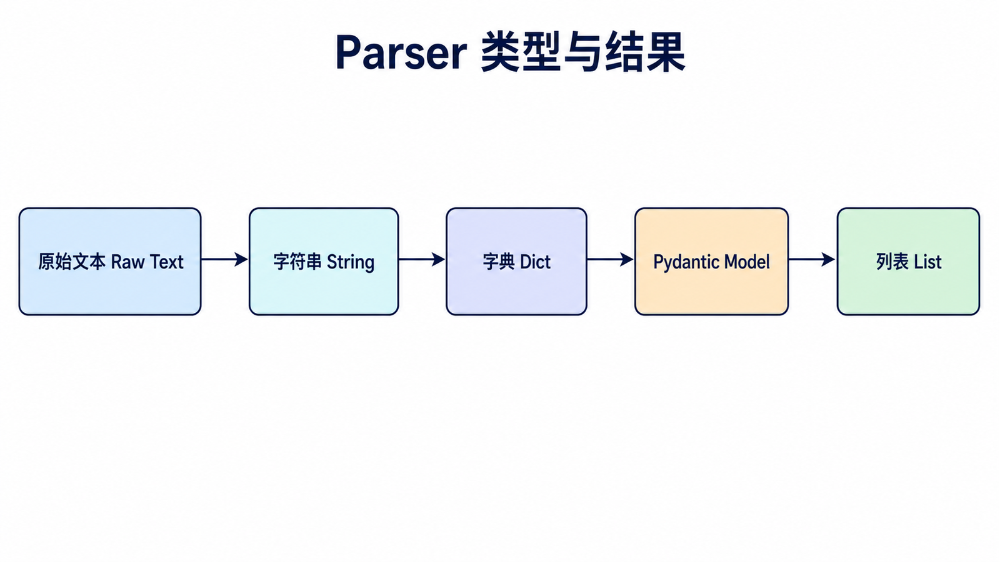
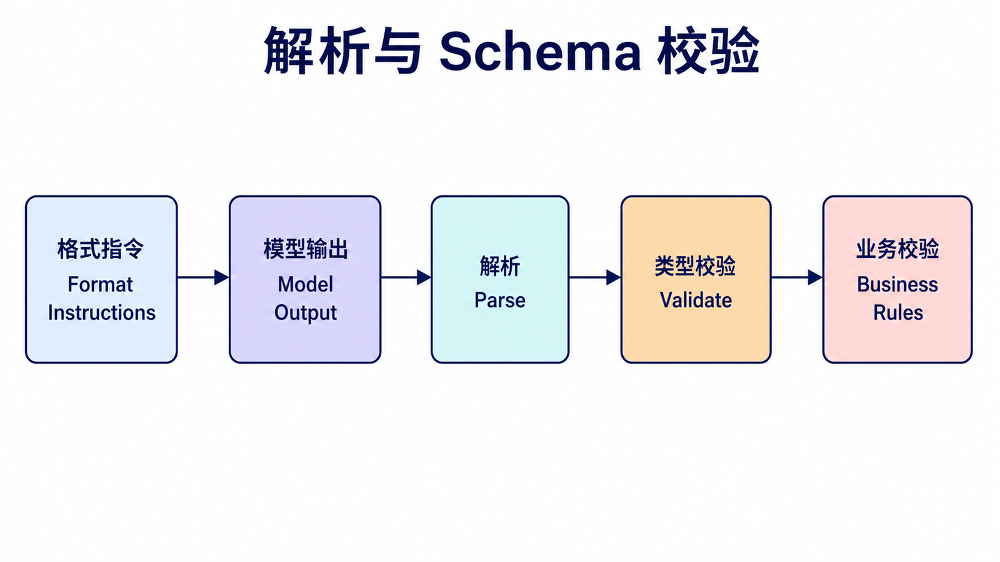
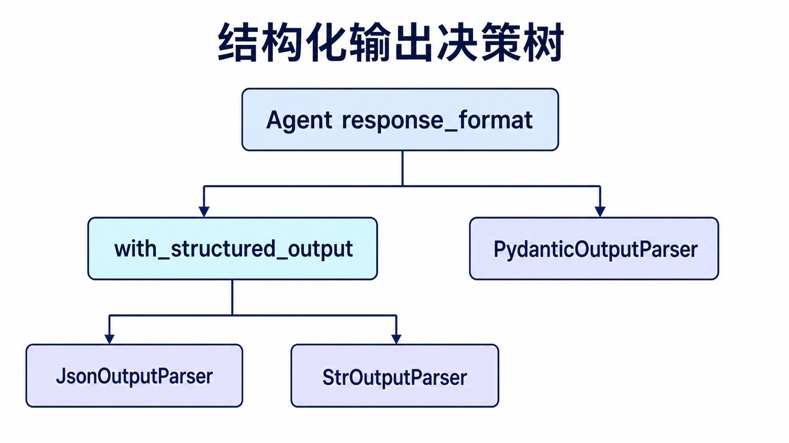
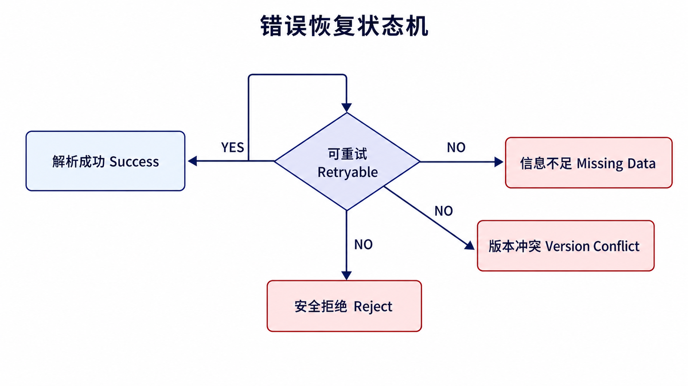

## 阅读指南

**前置知识：** 理解模型原始输出不可信，应用在写数据库或调用下游接口前必须验证数据。

**学完本文你应该能：** 在原生结构化输出与 Parser 之间做选择；设计 Pydantic Schema；区分可重试、可降级和必须失败的解析错误。

## 概述

Output Parsers（输出解析器）是 LangChain 中用于将 LLM 的原始文本输出转换为结构化数据的模块。它们确保 LLM 的输出符合预期的格式，便于后续处理和使用。

在真实应用里，模型回答通常不是给人直接看的，而是要进入数据库、表单、接口或下一段流程。Parser 的作用就是把“看起来像 JSON 的文本”变成真正可验证、可处理的数据。

### 为什么需要 Output Parser？

| 问题             | Parser 解决方案  |
| ---------------- | ---------------- |
| 输出格式不稳定   | 强制特定格式     |
| 难以程序化处理   | 转换为结构化对象 |
| 缺乏类型安全     | Pydantic 验证    |
| 需要提取特定信息 | 自定义解析逻辑   |

## Parser 类型概览



| Parser                             | 说明          | 输出类型      |
| ---------------------------------- | ------------- | ------------- |
| **StrOutputParser**                | 字符串输出    | str           |
| **JsonOutputParser**               | JSON 解析     | dict          |
| **PydanticOutputParser**           | Pydantic 验证 | Pydantic 模型 |
| **CommaSeparatedListOutputParser** | 列表解析      | List[str]     |

## StrOutputParser

### 基础用法

```python
from langchain_core.output_parsers import StrOutputParser
from langchain_openai import ChatOpenAI
from langchain_core.prompts import PromptTemplate

llm = ChatOpenAI(model="gpt-4o")

chain = PromptTemplate.from_template("用一句话解释{topic}") | llm | StrOutputParser()

result = chain.invoke({"topic": "人工智能"})
print(result)
```

`StrOutputParser` 适合只需要纯文本的场景。它不会做格式校验，但可以把模型消息对象里的正文稳定取出来，便于继续拼接到后续步骤。

## JsonOutputParser

### 基础用法

```python
from langchain_core.output_parsers import JsonOutputParser
from langchain_openai import ChatOpenAI
from langchain_core.prompts import PromptTemplate

llm = ChatOpenAI(model="gpt-4o")
parser = JsonOutputParser()

prompt = PromptTemplate.from_template(
    """返回一个JSON对象，包含以下信息：
    - name: 姓名
    - age: 年龄
    - city: 城市

    {format_instructions}

    只返回JSON，不要其他内容。"""
)

chain = prompt | llm | parser

result = chain.invoke({
    "format_instructions": parser.get_format_instructions()
})

print(result)
print(result["name"])
```

`format_instructions` 是这里的关键，它把解析器需要的格式要求写进提示词。没有这段指令时，模型可能会额外输出解释文字，导致 JSON 解析失败。

## PydanticOutputParser



### 基本使用

```python
from langchain_core.output_parsers import PydanticOutputParser
from langchain_openai import ChatOpenAI
from langchain_core.prompts import PromptTemplate
from pydantic import BaseModel, Field
from typing import List

class Person(BaseModel):
    name: str = Field(description="人物姓名")
    age: int = Field(description="人物年龄")
    occupation: str = Field(description="职业")
    skills: List[str] = Field(description="技能列表")

parser = PydanticOutputParser(pydantic_object=Person)

prompt = PromptTemplate.from_template(
    """从以下文本中提取人物信息：

    {query}

    {format_instructions}""",
    partial_variables={"format_instructions": parser.get_format_instructions()}
)

llm = ChatOpenAI(model="gpt-4o")
chain = prompt | llm | parser

result = chain.invoke({
    "query": "李明是一位35岁的数据科学家，精通Python、SQL和机器学习"
})

print(result.name)
print(result.age)
print(result.skills)
```

### Agent 结构化输出

在 Agent 场景中，如果模型或提供商支持结构化输出，优先使用 `response_format`，让 LangChain 在 Agent 状态中返回校验后的 `structured_response`。

```python
from langchain.agents import create_agent
from langchain_openai import ChatOpenAI
from pydantic import BaseModel, Field
from typing import List

class Person(BaseModel):
    name: str = Field(description="人物姓名")
    age: int = Field(description="人物年龄")
    occupation: str = Field(description="职业")
    skills: List[str] = Field(description="技能列表")

agent = create_agent(
    model=ChatOpenAI(model="gpt-4o"),
    response_format=Person
)

result = agent.invoke({
    "messages": [{
        "role": "user",
        "content": "李明是一位35岁的数据科学家，精通Python、SQL和机器学习"
    }]
})

person = result["structured_response"]
print(person.name)
print(person.skills)
```

### 嵌套模型

```python
from pydantic import BaseModel, Field
from typing import List

class Skill(BaseModel):
    name: str
    level: str

class PersonWithSkills(BaseModel):
    name: str
    age: int
    skills: List[Skill]

parser = PydanticOutputParser(pydantic_object=PersonWithSkills)

chain = prompt | llm | parser
result = chain.invoke({
    "query": "王芳，28岁，技能：Python（高级），数据分析（中级）"
})
print(result.skills[0].name)
```

## 列表 Parser

### CommaSeparatedListOutputParser

```python
from langchain_core.output_parsers import CommaSeparatedListOutputParser
from langchain_openai import ChatOpenAI
from langchain_core.prompts import PromptTemplate

parser = CommaSeparatedListOutputParser()

chain = PromptTemplate.from_template(
    """列出Python的5个主要特性，使用逗号分隔。

    {format_instructions}"""
) | llm | parser

result = chain.invoke({})
print(result)
```

## 自定义 Parser

### 基础自定义

```python
from langchain_core.output_parsers import BaseOutputParser
from typing import Any
import re
import json

class CustomParser(BaseOutputParser):
    def parse(self, text: str) -> Any:
        text = text.strip()
        if "{" in text and "}" in text:
            match = re.search(r'\{.*\}', text, re.DOTALL)
            if match is None:
                return text
            json_str = match.group()
            return json.loads(json_str)
        return text

    @property
    def _type(self) -> str:
        return "custom_parser"
```

### 日期解析

```python
from langchain_core.output_parsers import BaseOutputParser
from datetime import datetime
from typing import Optional

class DateParser(BaseOutputParser[Optional[datetime]]):
    def parse(self, text: str) -> Optional[datetime]:
        text = text.strip()
        formats = ["%Y-%m-%d", "%Y/%m/%d", "%d-%m-%Y", "%d/%m/%Y"]

        for fmt in formats:
            try:
                return datetime.strptime(text, fmt)
            except ValueError:
                continue
        return None

    @property
    def _type(self) -> str:
        return "date_parser"
```

### 编号列表解析

```python
class NumberedListParser(BaseOutputParser[list]):
    def parse(self, text: str) -> list:
        lines = text.strip().split('\n')
        result = []
        for line in lines:
            cleaned = line.lstrip('0123456789.、)） ')
            if cleaned:
                result.append(cleaned)
        return result

    @property
    def _type(self) -> str:
        return "numbered_list"

parser = NumberedListParser()
result = parser.parse("1. 第一项\n2. 第二项\n3. 第三项")
print(result)
```

## 错误处理

### ValidationError 处理

```python
from pydantic import BaseModel, ValidationError

parser = PydanticOutputParser(pydantic_object=Person)

try:
    result = chain.invoke({})
except ValidationError as e:
    print(f"验证错误: {e}")
```

### OutputParserException 处理

```python
from langchain_core.exceptions import OutputParserException

try:
    result = chain.invoke({})
except OutputParserException as e:
    print(f"解析错误: {e}")
```

## 实际应用

### 问答系统

```python
from pydantic import BaseModel, Field
from typing import List

class QAResponse(BaseModel):
    question: str = Field(description="原始问题")
    answer: str = Field(description="答案")
    sources: List[str] = Field(description="参考来源")
    confidence: float = Field(description="置信度", ge=0, le=1)

parser = PydanticOutputParser(pydantic_object=QAResponse)

chain = prompt | llm | parser

result = chain.invoke({
    "context": "Python是一种高级编程语言...",
    "question": "Python是什么？"
})
```

## 最佳实践

| 实践                   | 说明                                                                      |
| ---------------------- | ------------------------------------------------------------------------- |
| **使用 Pydantic**      | 类型安全，自动验证                                                        |
| **提供格式指令**       | 帮助 LLM 生成正确格式                                                     |
| **错误处理**           | 解析可能失败，准备降级方案                                                |
| **清晰 Schema**        | 详细的字段描述                                                            |
| **优先原生结构化输出** | Agent 或支持该能力的模型优先使用 response_format / with_structured_output |

解析器不是“保证模型永不出错”的魔法，它只是把错误尽早暴露出来。简单 LCEL 链可以继续使用 `PydanticOutputParser`；Agent 或支持原生结构化输出的模型，优先使用 `response_format` 或 `with_structured_output`，让模型端和框架端一起约束输出。

## 结构化输出的选择顺序



在 v1 项目中，不应看到 JSON 需求就直接使用 `JsonOutputParser`：

1. Agent 最终响应有明确 Schema：优先使用 `create_agent(..., response_format=Schema)`。
2. 单次模型调用支持原生结构化输出：优先 `model.with_structured_output(Schema)`。
3. 供应商不支持 Schema，或需要解析已有文本：使用 `PydanticOutputParser`。
4. 只需要普通文本或简单列表：使用 `StrOutputParser` 或列表 Parser。

原生结构化输出通常能更早约束模型行为；Parser 则是应用侧转换与验证层。二者都不能替代业务校验，例如 `start_date` 早于 `end_date`、订单金额不得为负数等跨字段规则。

## 失败处理策略



| 失败                    | 是否重试     | 推荐处理                       |
| ----------------------- | ------------ | ------------------------------ |
| 临时截断、缺少结束括号  | 可以         | 缩短输入或要求模型修复一次     |
| 字段类型偶发错误        | 可以         | 把 Pydantic 错误摘要反馈给模型 |
| 必需事实在输入中不存在  | 不应盲目重试 | 返回“信息不足”并要求补充输入   |
| Schema 与业务版本不兼容 | 不应重试     | 记录版本并进入兼容或迁移流程   |
| 安全字段越权出现        | 不应降级     | 拒绝结果并记录安全事件         |

重试必须有次数上限，并保留原始输出、Schema 版本和错误类型。无限“让模型再试一次”既增加成本，也可能掩盖设计错误。

## 总结

| Parser                             | 用途       | 特点       |
| ---------------------------------- | ---------- | ---------- |
| **StrOutputParser**                | 简单字符串 | 零转换     |
| **JsonOutputParser**               | JSON 解析  | 基础结构   |
| **PydanticOutputParser**           | 类型验证   | 简单链适用 |
| **CommaSeparatedListOutputParser** | 列表解析   | 简单列表   |

Output Parser 让 LLM 输出变得可控、可验证，是构建可靠 LLM 应用的关键。

## 本篇自检

1. `with_structured_output` 与 `PydanticOutputParser` 的主要边界是什么？
2. 为什么通过 Pydantic 类型校验仍不代表业务数据正确？
3. 哪类解析错误不应该通过重复调用模型解决？

<details>
<summary>查看答案</summary>

1. 前者利用模型或供应商的结构化能力约束生成，后者在应用侧解析和验证文本。
2. 类型正确不代表跨字段约束、权限、事实来源和业务规则正确。
3. 信息缺失、Schema 版本冲突和安全越权等确定性错误不应盲目重试。

</details>

## 官方资料

- [Structured output](https://docs.langchain.com/oss/python/langchain/structured-output)
- [Agents response format](https://docs.langchain.com/oss/python/langchain/agents)
- [Output parsers API](https://python.langchain.com/api_reference/core/output_parsers.html)

**上一篇：** [LangChain Prompt Templates](/posts/langchain-prompt-templates/) · **下一篇：** [LangChain LCEL 与 Runnable](/posts/langchain-chains/)
