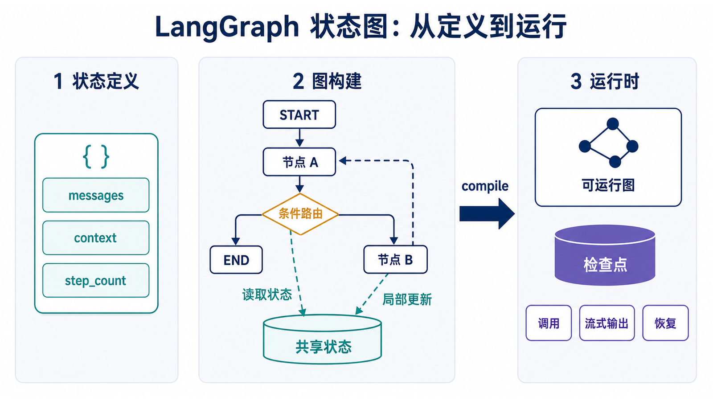
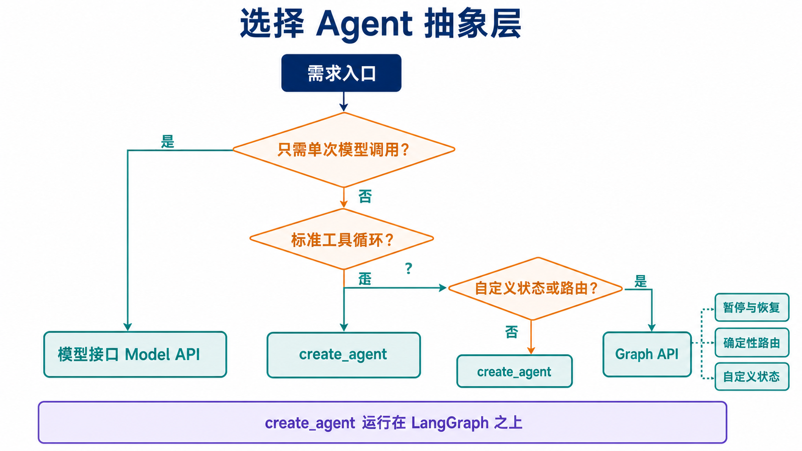

## 概述

LangGraph 是用于构建长时间运行、有状态 Agent 和工作流的低层编排框架。它把应用表示为图：状态保存共享数据，节点执行工作，边决定下一步。循环、条件路由、持久化和人机协作都是运行时的一等能力。

> 版本基线：本文在 2026-07-10 按 Python 3.10+、`langgraph==1.2.8`、`langchain==1.3.11` 和 `langchain-openai==1.3.3` 校验。只有调用 OpenAI 模型的示例才需要 `OPENAI_API_KEY` 和 `OPENAI_MODEL`。

LangChain 与 LangGraph 不是简单的“链与图”替代关系。LangChain 提供模型、工具、Agent 和中间件等高层接口，其中标准 Agent 的 `create_agent` 本身构建在 LangGraph 上；当应用需要完全控制状态、节点、分支或持久化时，再直接使用 LangGraph Graph API。LangGraph 1.x 已弃用 `langgraph.prebuilt.create_react_agent`，标准 Agent 应使用 `langchain.agents.create_agent`。



## 阅读前准备与学习目标

本文面向已经会写基础 Python 函数、理解类型标注，并知道“模型可以调用工具”的读者。你不需要先掌握 LangChain，但应能读懂 `TypedDict`、字典更新和简单条件分支。

读完后，你应当能够：

1. 用状态、节点和边解释一个 LangGraph 应用；
2. 判断何时使用 `create_agent`，何时直接维护 `StateGraph`；
3. 跟踪一次调用从输入、状态更新到最终输出的路径；
4. 说明循环、持久化和人工中断为什么需要运行时支持。

建议先顺序阅读核心概念和最小图，再把循环、RAG、持久化与人机交互视为同一运行时的能力预览。第一次阅读不必记住全部 API；重点是能回答“当前状态是什么、哪个节点会更新它、下一条边由谁决定”。

### 先选抽象层：create_agent 还是 Graph API

| 需求                           | 优先选择                   | 原因                                         |
| ------------------------------ | -------------------------- | -------------------------------------------- |
| 标准“模型调用工具再回答”循环   | `create_agent`             | 预置工具循环、中间件和常用生产能力           |
| 自定义状态字段、分支和节点顺序 | Graph API                  | 可以显式控制 schema、node 和 edge            |
| 需要暂停、恢复、时间旅行       | Graph API 或编译后的 Agent | 底层都依赖 LangGraph runtime 和 checkpointer |
| 只想快速接入一个聊天模型       | LangChain 模型接口         | 尚不需要维护执行图                           |



选择标准 Agent 不代表放弃 LangGraph：`create_agent` 返回的仍是基于 LangGraph 的图运行时。区别在于你维护的是高层配置，还是底层执行拓扑。官方的 [LangGraph 概览](https://docs.langchain.com/oss/python/langgraph/overview) 和 [LangChain Agents](https://docs.langchain.com/oss/python/langchain/agents) 对这两层职责有明确区分。

## 核心概念

### State（状态）

状态定义图中可以读写的数据。`TypedDict` 提供静态类型信息，但不会自动完成运行时数据验证。

```python
from typing import TypedDict

class GraphState(TypedDict):
    value: str
    step_count: int
```

### Node（节点）

节点接收当前状态，并返回本次需要更新的字段。未返回的字段保持不变。

```python
def append_step(state: GraphState) -> dict:
    return {
        "value": state["value"] + " -> 已处理",
        "step_count": state["step_count"] + 1,
    }
```

### Edge（边）与 Graph（图）

普通边表示固定顺序，条件边根据路由函数返回值决定下一步。构建器需要通过 `compile()` 生成可运行图。

```python
from typing import Literal, TypedDict
from langgraph.graph import END, START, StateGraph

class SimpleState(TypedDict):
    value: str
    step_count: int

def step_1(state: SimpleState) -> dict:
    return {
        "value": state["value"] + " -> 步骤1",
        "step_count": state["step_count"] + 1,
    }

def step_2(state: SimpleState) -> dict:
    return {
        "value": state["value"] + " -> 步骤2",
        "step_count": state["step_count"] + 1,
    }

def route_after_step_1(state: SimpleState) -> Literal["step_2", "__end__"]:
    return "step_2" if state["step_count"] < 2 else END

builder = StateGraph(SimpleState)
builder.add_node("step_1", step_1)
builder.add_node("step_2", step_2)
builder.add_edge(START, "step_1")
builder.add_conditional_edges("step_1", route_after_step_1)
builder.add_edge("step_2", END)

graph = builder.compile()
result = graph.invoke({"value": "开始", "step_count": 0})
print(result)
```

这个示例的输入是 `{"value": "开始", "step_count": 0}`。`step_1` 先把计数更新为 1，因此路由进入 `step_2`；预期最终结果为 `{"value": "开始 -> 步骤1 -> 步骤2", "step_count": 2}`。最常见的错误是路由函数返回了一个尚未添加的节点名，或者误以为节点必须返回完整状态；实际上节点通常只返回本次更新的字段。

## 循环与条件分支

循环也是条件边。业务退出条件负责正常结束，`recursion_limit` 只作为防止错误路由无限执行的兜底。

```python
from typing import Literal, TypedDict
from langgraph.graph import END, START, StateGraph

class LoopState(TypedDict):
    counter: int

def increment(state: LoopState) -> dict:
    return {"counter": state["counter"] + 1}

def should_continue(state: LoopState) -> Literal["increment", "__end__"]:
    return "increment" if state["counter"] < 5 else END

builder = StateGraph(LoopState)
builder.add_node("increment", increment)
builder.add_edge(START, "increment")
builder.add_conditional_edges("increment", should_continue)

graph = builder.compile()
result = graph.invoke({"counter": 0}, config={"recursion_limit": 10})
assert result["counter"] == 5
```

业务条件 `counter < 5` 决定正常退出，`recursion_limit` 只负责在路由失误时阻止无限执行。不要把运行时上限当作业务完成条件，否则调用方无法区分“任务完成”和“被保护机制终止”。

## 自定义工具调用 Agent

标准 Agent 优先使用 `langchain.agents.create_agent`。下面直接使用 `StateGraph`，是为了展示模型节点、工具节点和回环如何组成自定义 Agent。

```python
import os
from typing import Literal

from langchain.tools import tool
from langchain_openai import ChatOpenAI
from langgraph.graph import START, MessagesState, StateGraph
from langgraph.prebuilt import ToolNode, tools_condition

@tool
def calculate(
    a: float,
    b: float,
    operation: Literal["add", "subtract", "multiply", "divide"],
) -> str:
    """执行受控的四则运算。"""
    if operation == "add":
        return str(a + b)
    if operation == "subtract":
        return str(a - b)
    if operation == "multiply":
        return str(a * b)
    return "除数不能为 0" if b == 0 else str(a / b)

tools = [calculate]
model = ChatOpenAI(model=os.environ["OPENAI_MODEL"]).bind_tools(tools)

def call_model(state: MessagesState) -> dict:
    return {"messages": [model.invoke(state["messages"])]}

builder = StateGraph(MessagesState)
builder.add_node("model", call_model)
builder.add_node("tools", ToolNode(tools))
builder.add_edge(START, "model")
builder.add_conditional_edges("model", tools_condition)
builder.add_edge("tools", "model")

graph = builder.compile()
result = graph.invoke(
    {"messages": [{"role": "user", "content": "计算 2 和 15 相加"}]}
)
print(result["messages"][-1].content)
```

`tools_condition` 检查最后一条模型消息：有工具调用时进入默认名为 `tools` 的节点，否则进入 `END`。工具结果必须回到模型节点，模型才能基于结果生成最终回复。

输入“计算 2 和 15 相加”时，预期路径是 `model → tools → model → END`。如果模型直接回答而未产生工具调用，路径会是 `model → END`；这不是图失效，而是模型决策不同。需要强制使用工具时，应通过系统提示、工具策略或确定性路由表达，而不是假设模型一定调用。

## RAG 工作流

这个最小示例用固定字符串代替真实检索器，重点是展示检索结果如何通过状态交给生成节点。

```python
import os
from typing import TypedDict

from langchain_openai import ChatOpenAI
from langgraph.graph import END, START, StateGraph

class RAGState(TypedDict):
    question: str
    context: str
    answer: str

model = ChatOpenAI(model=os.environ["OPENAI_MODEL"])

def retrieve(state: RAGState) -> dict:
    return {"context": "LangGraph 是用于有状态 Agent 的低层编排框架。"}

def generate(state: RAGState) -> dict:
    response = model.invoke(
        [
            {
                "role": "user",
                "content": (
                    f"只根据上下文回答。\n上下文：{state['context']}\n"
                    f"问题：{state['question']}"
                ),
            }
        ]
    )
    return {"answer": response.content}

builder = StateGraph(RAGState)
builder.add_node("retrieve", retrieve)
builder.add_node("generate", generate)
builder.add_edge(START, "retrieve")
builder.add_edge("retrieve", "generate")
builder.add_edge("generate", END)

graph = builder.compile()
result = graph.invoke(
    {"question": "LangGraph 是什么？", "context": "", "answer": ""}
)
print(result["answer"])
```

这里的重点不是检索质量，而是数据依赖：`generate` 读取的 `context` 必须由前序节点写入并出现在 schema 中。真实 RAG 还需要处理空结果、引用来源、文档切分和检索评估，这些不属于本篇的入门范围。

## 状态持久化

编译时提供 checkpointer 后，`thread_id` 用来定位同一条执行线程。`InMemorySaver` 仅适合开发和测试。

```python
from langgraph.checkpoint.memory import InMemorySaver
from langgraph.graph import START, MessagesState, StateGraph

def reply(state: MessagesState) -> dict:
    last_text = state["messages"][-1].content
    return {"messages": [{"role": "assistant", "content": f"收到：{last_text}"}]}

builder = StateGraph(MessagesState)
builder.add_node("reply", reply)
builder.add_edge(START, "reply")

graph = builder.compile(checkpointer=InMemorySaver())
config = {"configurable": {"thread_id": "user-123"}}

graph.invoke({"messages": [{"role": "user", "content": "第一条消息"}]}, config)
result = graph.invoke(
    {"messages": [{"role": "user", "content": "第二条消息"}]},
    config,
)
assert len(result["messages"]) == 4
```

## 人机交互

`interrupt()` 需要 checkpointer 和稳定的 `thread_id`。首次调用暂停，恢复时用同一个配置传入 `Command(resume=...)`。

```python
from typing import TypedDict

from langgraph.checkpoint.memory import InMemorySaver
from langgraph.graph import START, StateGraph
from langgraph.types import Command, interrupt

class ReviewState(TypedDict):
    draft: str
    decision: str

def human_review(state: ReviewState) -> dict:
    decision = interrupt({"draft": state["draft"], "question": "是否批准？"})
    return {"decision": decision}

builder = StateGraph(ReviewState)
builder.add_node("human_review", human_review)
builder.add_edge(START, "human_review")
graph = builder.compile(checkpointer=InMemorySaver())

config = {"configurable": {"thread_id": "review-1"}}
paused = graph.invoke({"draft": "待审核内容", "decision": ""}, config)
print(paused["__interrupt__"])

result = graph.invoke(Command(resume="approve"), config)
assert result["decision"] == "approve"
```

## 安装与配置

```bash
python -m pip install "langgraph==1.2.8" "langchain==1.3.11" "langchain-openai==1.3.3"
```

调用 OpenAI 模型前设置：

```bash
export OPENAI_API_KEY="your-api-key"
export OPENAI_MODEL="your-available-model"
```

Windows PowerShell 使用 `$env:OPENAI_API_KEY` 和 `$env:OPENAI_MODEL`。只运行基础图、循环、持久化和人机交互示例时，不需要模型依赖或 API Key。

## 常见误区

- **把状态当作可随意修改的全局字典**：节点应返回局部更新，由 runtime 按 reducer 合并。
- **把业务标签和节点名混为一谈**：返回 `"approve"` 等业务标签时，应提供 `path_map` 映射到真实节点。
- **把短期记忆等同于数据库聊天记录**：checkpointer 保存的是图执行快照；跨用户长期知识通常还需要 Store 或业务数据库。
- **所有判断都交给模型**：确定性规则优先使用普通 Python 节点，成本更低，也更容易测试。
- **看到图就直接使用底层 API**：标准工具 Agent 应先评估 `create_agent` 是否已经满足需求。

## 本篇自检

1. 节点为什么通常返回局部更新，而不是完整状态？
2. `recursion_limit` 与业务退出条件分别解决什么问题？
3. 一个标准工具调用 Agent 在什么条件下进入 ToolNode，又在什么条件下结束？

<details>
<summary>查看答案</summary>

1. 局部更新让不同节点只负责自己拥有的字段，并由 reducer 统一决定覆盖或累积语义，减少意外丢失其他字段。
2. 业务退出条件表示任务已经完成；`recursion_limit` 是错误路由或异常循环的运行时保护，达到它不等于业务成功。
3. 最后一条模型消息包含工具调用时进入 ToolNode；没有工具调用时进入 `END`。工具执行完成后通常回到模型节点生成最终回复。

</details>

## 下一篇连接

本文把 State 当作图中共享的数据面，但还没有解释同一个字段收到多个更新时如何合并。下一篇《LangGraph 状态管理与工作流》将展开覆盖 reducer、累积 reducer、`MessagesState`、运行时验证和检查点线程。

## 总结

LangGraph 的核心可以归纳为：状态描述共享数据，节点返回局部更新，边控制执行流，checkpointer 保存执行进度。标准 Agent 可以从 LangChain `create_agent` 起步；需要自定义循环、分支、恢复或多节点协调时，再使用 LangGraph Graph API。
