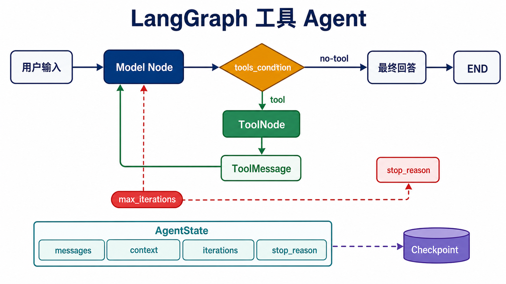

## 概述

本文构建一个可调用工具、记录业务状态并持久化对话的自定义 Agent。标准 Agent 应优先使用 LangChain 1.x 的 `create_agent`；这里直接使用 LangGraph，是为了完整观察“模型 → 工具 → 模型”的执行循环并自定义路由。

> 版本基线：本文在 2026-07-10 按 Python 3.10+、`langgraph==1.2.8`、`langchain==1.3.11` 和 `langchain-openai==1.3.3` 校验。模型调用需要配置 `OPENAI_API_KEY` 和 `OPENAI_MODEL`。



## 环境配置

```bash
python -m pip install "langgraph==1.2.8" "langchain==1.3.11" "langchain-openai==1.3.3"
export OPENAI_API_KEY="your-api-key"
export OPENAI_MODEL="your-available-model"
```

Windows PowerShell 使用 `$env:OPENAI_API_KEY` 和 `$env:OPENAI_MODEL`。工具均为本地函数，不需要 `langchain-community`。

## 定义工具

工具签名和 docstring 会成为模型看到的工具 schema。计算工具使用受控参数，不执行任意表达式。

```python
from datetime import datetime
from typing import Literal

from langchain.tools import tool

@tool
def search_knowledge_base(query: str) -> str:
    """根据查询词搜索本地编程语言知识库。"""
    knowledge = {
        "python": "Python 是一门高级编程语言。",
        "java": "Java 是一门面向对象编程语言。",
        "javascript": "JavaScript 常用于 Web 开发。",
    }
    query_lower = query.lower()
    for key, value in knowledge.items():
        if key in query_lower:
            return value
    return "未找到相关信息"

@tool
def calculate(
    a: float,
    b: float,
    operation: Literal["add", "subtract", "multiply", "divide"],
) -> str:
    """执行受控的四则运算。"""
    if operation == "add":
        return str(a + b)
    if operation == "subtract":
        return str(a - b)
    if operation == "multiply":
        return str(a * b)
    return "除数不能为 0" if b == 0 else str(a / b)

@tool
def get_current_time() -> str:
    """获取服务器当前本地时间。"""
    return datetime.now().astimezone().isoformat(timespec="seconds")

tools = [search_knowledge_base, calculate, get_current_time]
```

## 基础工具调用 Agent

下面的代码块接续上一节的 `tools`。模型对象在建图时创建一次，而不是在每次节点执行时重复创建。

```python
import os

from langchain_openai import ChatOpenAI
from langgraph.graph import START, MessagesState, StateGraph
from langgraph.prebuilt import ToolNode, tools_condition

model = ChatOpenAI(model=os.environ["OPENAI_MODEL"]).bind_tools(tools)

def call_model(state: MessagesState) -> dict:
    response = model.invoke(state["messages"])
    return {"messages": [response]}

builder = StateGraph(MessagesState)
builder.add_node("model", call_model)
builder.add_node("tools", ToolNode(tools))
builder.add_edge(START, "model")
builder.add_conditional_edges("model", tools_condition)
builder.add_edge("tools", "model")

agent = builder.compile()
result = agent.invoke(
    {"messages": [{"role": "user", "content": "Python 是什么？"}]}
)
print(result["messages"][-1].content)
```

`tools_condition` 在最后一条 AI 消息包含工具调用时返回 `tools`，否则返回 `END`。工具执行后必须回到模型节点，才能生成面向用户的最终回复。

## 带自定义状态和循环上限的 Agent

继承 `MessagesState` 可以保留正确的消息 reducer，并增加业务字段。不要用普通 `operator.add` 混合字典消息和消息对象。

```python
import os
from typing import Literal

from langchain_openai import ChatOpenAI
from langgraph.graph import END, START, MessagesState, StateGraph
from langgraph.prebuilt import ToolNode

class AgentState(MessagesState):
    context: str
    iterations: int

model = ChatOpenAI(model=os.environ["OPENAI_MODEL"]).bind_tools(tools)

def call_model(state: AgentState) -> dict:
    messages = state["messages"]
    if state["context"]:
        messages = [
            {"role": "system", "content": f"业务上下文：{state['context']}"},
            *messages,
        ]
    response = model.invoke(messages)
    return {
        "messages": [response],
        "iterations": state["iterations"] + 1,
    }

def route_after_model(state: AgentState) -> Literal["tools", "__end__"]:
    last_message = state["messages"][-1]
    if state["iterations"] >= 3:
        return END
    return "tools" if last_message.tool_calls else END

builder = StateGraph(AgentState)
builder.add_node("model", call_model)
builder.add_node("tools", ToolNode(tools))
builder.add_edge(START, "model")
builder.add_conditional_edges("model", route_after_model)
builder.add_edge("tools", "model")

agent = builder.compile()
result = agent.invoke(
    {
        "messages": [{"role": "user", "content": "计算 10 加 20"}],
        "context": "请使用工具完成数值计算",
        "iterations": 0,
    },
    config={"recursion_limit": 10},
)
print(result["iterations"], result["messages"][-1].content)
```

`iterations` 记录模型调用次数。达到上限时结束只是保护措施；实际系统还应记录“因达到上限而结束”，方便监控与重试。

## 带记忆的 Agent

`InMemorySaver` 会在进程内按 `thread_id` 保存消息历史。下面的完整示例不依赖前面的 Agent 变量。

```python
import os

from langchain_openai import ChatOpenAI
from langgraph.checkpoint.memory import InMemorySaver
from langgraph.graph import START, MessagesState, StateGraph

model = ChatOpenAI(model=os.environ["OPENAI_MODEL"])

def call_model(state: MessagesState) -> dict:
    return {"messages": [model.invoke(state["messages"])]}

builder = StateGraph(MessagesState)
builder.add_node("model", call_model)
builder.add_edge(START, "model")
agent = builder.compile(checkpointer=InMemorySaver())

config = {"configurable": {"thread_id": "user-123"}}
agent.invoke(
    {"messages": [{"role": "user", "content": "我叫张三"}]},
    config,
)
result = agent.invoke(
    {"messages": [{"role": "user", "content": "我叫什么名字？"}]},
    config,
)
print(result["messages"][-1].content)
```

同一 `thread_id` 会读取同一条线程的检查点。服务重启后仍需保留状态时，应改用 PostgreSQL 等持久化 checkpointer。

## 规则决策工作流

规则明确的分支不需要交给 LLM。确定性节点成本更低、结果更容易测试。

```python
from typing import Literal, TypedDict

from langgraph.graph import END, START, StateGraph

class DecisionState(TypedDict):
    user_input: str
    decision: str
    result: str

def classify(state: DecisionState) -> dict:
    text = state["user_input"]
    if "天气" in text:
        decision = "weather"
    elif any(word in text for word in ["计算", "数学"]):
        decision = "calculation"
    else:
        decision = "general"
    return {"decision": decision}

def route(state: DecisionState) -> Literal["weather", "calculation", "general"]:
    return state["decision"]

def weather(state: DecisionState) -> dict:
    return {"result": "天气节点结果"}

def calculation(state: DecisionState) -> dict:
    return {"result": "计算节点结果"}

def general(state: DecisionState) -> dict:
    return {"result": "通用节点结果"}

builder = StateGraph(DecisionState)
builder.add_node("classify", classify)
builder.add_node("weather", weather)
builder.add_node("calculation", calculation)
builder.add_node("general", general)
builder.add_edge(START, "classify")
builder.add_conditional_edges("classify", route)
builder.add_edge("weather", END)
builder.add_edge("calculation", END)
builder.add_edge("general", END)

workflow = builder.compile()
result = workflow.invoke(
    {"user_input": "今天天气怎么样？", "decision": "", "result": ""}
)
assert result["decision"] == "weather"
```

## 多节点协调

这不是多个自主 Agent，而是一个确定性的协调工作流：先分类，再执行专用节点，最后统一汇总。任务只有在执行节点完成后才加入 `completed_tasks`。

```python
import operator
from typing import Annotated, Literal, TypedDict

from langgraph.graph import END, START, StateGraph

class CoordinatorState(TypedDict):
    current_task: str
    completed_tasks: Annotated[list[str], operator.add]
    results: dict

def analyze_task(
    state: CoordinatorState,
) -> Literal["calculator", "searcher", "time_checker"]:
    task = state["current_task"]
    if "计算" in task:
        return "calculator"
    if "时间" in task:
        return "time_checker"
    return "searcher"

def calculator_node(state: CoordinatorState) -> dict:
    return {
        "completed_tasks": [state["current_task"]],
        "results": {"calculation": 10 + 20},
    }

def search_node(state: CoordinatorState) -> dict:
    return {
        "completed_tasks": [state["current_task"]],
        "results": {"search": "本地搜索结果"},
    }

def time_node(state: CoordinatorState) -> dict:
    return {
        "completed_tasks": [state["current_task"]],
        "results": {"time": "当前时间结果"},
    }

builder = StateGraph(CoordinatorState)
builder.add_node("router", lambda state: {})
builder.add_node("calculator", calculator_node)
builder.add_node("searcher", search_node)
builder.add_node("time_checker", time_node)
builder.add_edge(START, "router")
builder.add_conditional_edges("router", analyze_task)
builder.add_edge("calculator", END)
builder.add_edge("searcher", END)
builder.add_edge("time_checker", END)

coordinator = builder.compile()
result = coordinator.invoke(
    {"current_task": "计算 10 加 20", "completed_tasks": [], "results": {}}
)
assert result["completed_tasks"] == ["计算 10 加 20"]
```

如果每个专用节点本身是独立 Agent，可以把编译后的子图放入这些节点，或把子 Agent 包装成工具；此时才属于多 Agent 协作。

## 研究工作流

这个不调用模型的示例展示“循环收集 → 生成报告”的基本结构。

```python
from typing import Literal, TypedDict

from langgraph.graph import END, START, StateGraph

class ResearchState(TypedDict):
    topic: str
    findings: list[str]
    final_report: str

def research_step(state: ResearchState) -> dict:
    index = len(state["findings"]) + 1
    return {"findings": [*state["findings"], f"发现 {index}：{state['topic']}"]}

def route_research(state: ResearchState) -> Literal["research", "compile_report"]:
    return "compile_report" if len(state["findings"]) >= 3 else "research"

def compile_report(state: ResearchState) -> dict:
    return {"final_report": "\n".join(state["findings"])}

builder = StateGraph(ResearchState)
builder.add_node("research", research_step)
builder.add_node("compile_report", compile_report)
builder.add_edge(START, "research")
builder.add_conditional_edges("research", route_research)
builder.add_edge("compile_report", END)

workflow = builder.compile()
result = workflow.invoke({"topic": "人工智能", "findings": [], "final_report": ""})
assert len(result["findings"]) == 3
assert result["final_report"]
```

路由必须先进入 `compile_report` 节点，再由该节点连接 `END`；如果把该分支直接映射到 `END`，报告不会生成。

## 最佳实践

- 工具必须有明确 docstring、窄参数类型和可预测返回值。
- 模型对象与绑定后的工具集在建图时创建并复用。
- 消息使用 `MessagesState`，业务字段通过继承扩展。
- 循环同时设置业务退出条件、迭代记录和 `recursion_limit`。
- 已完成任务只在工作实际成功后写入状态。
- 标准 Agent 使用 `create_agent`；只有需要自定义执行图时才直接维护工具循环。

## 总结

一个可靠的 LangGraph Agent 应把模型决策、工具执行、业务状态、路由和持久化分开。这样每个节点都可以单独测试，执行历史也能通过检查点恢复和审计。
