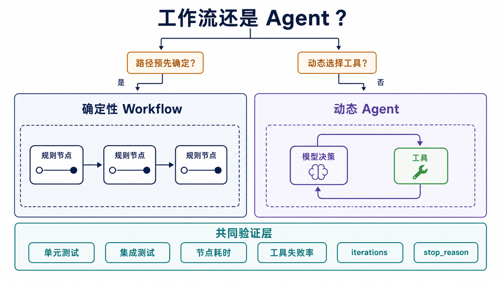

## 概述

本文构建一个可调用工具、记录业务状态并持久化对话的自定义 Agent。标准 Agent 应优先使用 LangChain 1.x 的 `create_agent`；这里直接使用 LangGraph，是为了完整观察“模型 → 工具 → 模型”的执行循环并自定义路由。

> 版本基线：本文在 2026-07-10 按 Python 3.10+、`langgraph==1.2.8`、`langchain==1.3.11` 和 `langchain-openai==1.3.3` 校验。模型调用需要配置 `OPENAI_API_KEY` 和 `OPENAI_MODEL`。


## 前置知识与交付目标

本文假设你已经读过前面的状态管理和高级特性，能够解释 `MessagesState`、reducer、`thread_id` 和 `recursion_limit`。案例从一个本地知识工具开始，逐步加入模型循环、业务状态、记忆、失败保护和观测点；每一步都复用上一阶段的设计，而不是把若干孤立示例拼在一起。

完成后，你应当能够：

1. 画出并实现 `model → tools → model` 工具调用循环；
2. 为循环增加业务状态和明确的停止原因；
3. 使用 checkpointer 隔离不同对话线程；
4. 为工具异常、循环上限和确定性路由编写验收测试；
5. 选择可以定位故障的最小观测指标。

### 案例的执行契约

本文 Agent 接收一条用户消息，可以查询本地知识、执行受控四则运算或读取服务器时间。一次成功调用必须满足：每个工具调用都有对应 ToolMessage；最终状态以模型回答或明确的 `stop_reason` 结束；不同 `thread_id` 之间不共享消息；未知工具异常不能被悄悄吞掉。

这四条契约比“回答看起来正确”更容易自动验证。自然语言可能变化，但消息角色、工具名称、状态字段和停止路径应保持稳定。

案例完成的判断也分为两层：图级完成表示执行进入 `END`，业务完成表示最终回答可用或 `stop_reason` 明确说明未完成原因。监控和调用方都不应只看到 HTTP 请求成功，就假设 Agent 已完成用户目标。

## 环境配置

```bash
python -m pip install "langgraph==1.2.8" "langchain==1.3.11" "langchain-openai==1.3.3"
export OPENAI_API_KEY="your-api-key"
export OPENAI_MODEL="your-available-model"
```

Windows PowerShell 使用 `$env:OPENAI_API_KEY` 和 `$env:OPENAI_MODEL`。工具均为本地函数，不需要 `langchain-community`。

## 定义工具

工具签名和 docstring 会成为模型看到的工具 schema。计算工具使用受控参数，不执行任意表达式。

```python
from datetime import datetime
from typing import Literal

from langchain.tools import tool

@tool
def search_knowledge_base(query: str) -> str:
    """根据查询词搜索本地编程语言知识库。"""
    knowledge = {
        "python": "Python 是一门高级编程语言。",
        "java": "Java 是一门面向对象编程语言。",
        "javascript": "JavaScript 常用于 Web 开发。",
    }
    query_lower = query.lower()
    for key, value in knowledge.items():
        if key in query_lower:
            return value
    return "未找到相关信息"

@tool
def calculate(
    a: float,
    b: float,
    operation: Literal["add", "subtract", "multiply", "divide"],
) -> str:
    """执行受控的四则运算。"""
    if operation == "add":
        return str(a + b)
    if operation == "subtract":
        return str(a - b)
    if operation == "multiply":
        return str(a * b)
    return "除数不能为 0" if b == 0 else str(a / b)

@tool
def get_current_time() -> str:
    """获取服务器当前本地时间。"""
    return datetime.now().astimezone().isoformat(timespec="seconds")

tools = [search_knowledge_base, calculate, get_current_time]
```

### 工具接口设计

模型只会看到工具名、参数 schema 和描述，因此工具 docstring 应说明用途，而不是复述函数名。参数应尽量窄：计算器使用枚举操作符和两个数值，而不是接收任意 Python 表达式；知识库工具只返回文本结果，不把数据库连接或内部异常对象暴露给模型。

工具返回值还应区分“成功但没有结果”和“执行失败”。示例中的“未找到相关信息”属于成功响应；网络超时、权限拒绝或数据损坏属于异常。生产系统可以返回结构化结果，让模型和监控同时读取 `status`、`content`、`error_code` 与 `retryable`，但不要把敏感堆栈直接放进模型上下文。

## 构建可控工具 Agent

### 基础工具调用循环

下面的代码块接续上一节的 `tools`。模型对象在建图时创建一次，而不是在每次节点执行时重复创建。

```python
import os

from langchain_openai import ChatOpenAI
from langgraph.graph import START, MessagesState, StateGraph
from langgraph.prebuilt import ToolNode, tools_condition

model = ChatOpenAI(model=os.environ["OPENAI_MODEL"]).bind_tools(tools)

def call_model(state: MessagesState) -> dict:
    response = model.invoke(state["messages"])
    return {"messages": [response]}

builder = StateGraph(MessagesState)
builder.add_node("model", call_model)
builder.add_node("tools", ToolNode(tools))
builder.add_edge(START, "model")
builder.add_conditional_edges("model", tools_condition)
builder.add_edge("tools", "model")

agent = builder.compile()
result = agent.invoke(
    {"messages": [{"role": "user", "content": "Python 是什么？"}]}
)
print(result["messages"][-1].content)
```

`tools_condition` 在最后一条 AI 消息包含工具调用时返回 `tools`，否则返回 `END`。工具执行后必须回到模型节点，才能生成面向用户的最终回复。

输入“Python 是什么？”时，模型可以选择 `search_knowledge_base`，预期路径为 `model → tools → model → END`。如果工具抛出可恢复异常，应由 ToolNode 或中间件转换为模型可见的工具消息；未知编程错误应保留堆栈，而不是统一伪装成普通回答。

### 加入自定义状态和循环上限

继承 `MessagesState` 可以保留正确的消息 reducer，并增加业务字段。不要用普通 `operator.add` 混合字典消息和消息对象。

```python
import os
from typing import Literal

from langchain_openai import ChatOpenAI
from langgraph.graph import END, START, MessagesState, StateGraph
from langgraph.prebuilt import ToolNode

class AgentState(MessagesState):
    context: str
    iterations: int
    stop_reason: str

model = ChatOpenAI(model=os.environ["OPENAI_MODEL"]).bind_tools(tools)

def call_model(state: AgentState) -> dict:
    messages = state["messages"]
    if state["context"]:
        messages = [
            {"role": "system", "content": f"业务上下文：{state['context']}"},
            *messages,
        ]
    response = model.invoke(messages)
    return {
        "messages": [response],
        "iterations": state["iterations"] + 1,
    }

def route_after_model(state: AgentState) -> Literal["tools", "limit", "__end__"]:
    last_message = state["messages"][-1]
    if not last_message.tool_calls:
        return END
    if state["iterations"] >= 3:
        return "limit"
    return "tools"

def record_limit(state: AgentState) -> dict:
    return {"stop_reason": "max_iterations"}

builder = StateGraph(AgentState)
builder.add_node("model", call_model)
builder.add_node("tools", ToolNode(tools))
builder.add_node("limit", record_limit)
builder.add_edge(START, "model")
builder.add_conditional_edges("model", route_after_model)
builder.add_edge("tools", "model")
builder.add_edge("limit", END)

agent = builder.compile()
result = agent.invoke(
    {
        "messages": [{"role": "user", "content": "计算 10 加 20"}],
        "context": "请使用工具完成数值计算",
        "iterations": 0,
        "stop_reason": "",
    },
    config={"recursion_limit": 10},
)
print(result["iterations"], result["messages"][-1].content)
```

`iterations` 记录模型调用次数。达到上限时先进入 `limit` 节点写入 `stop_reason`，调用方因而能区分正常回答和保护性终止。输入“计算 10 加 20”时，正常路径应是 `model → tools → model → END`；持续产生工具调用时，第三次模型调用后进入 `limit → END`。

注意当前上限统计的是模型节点调用次数，不是工具数量。一次模型响应可能请求多个工具，因此“3 次模型调用”不等于“最多执行 3 个工具”。如果业务需要限制外部动作次数，应增加独立的 `tool_calls_count`，并在进入 ToolNode 前检查，而不是复用 `iterations`。

### 加入线程级短期记忆

`InMemorySaver` 会在进程内按 `thread_id` 保存消息历史。下面的完整示例不依赖前面的 Agent 变量。

```python
import os

from langchain_openai import ChatOpenAI
from langgraph.checkpoint.memory import InMemorySaver
from langgraph.graph import START, MessagesState, StateGraph

model = ChatOpenAI(model=os.environ["OPENAI_MODEL"])

def call_model(state: MessagesState) -> dict:
    return {"messages": [model.invoke(state["messages"])]}

builder = StateGraph(MessagesState)
builder.add_node("model", call_model)
builder.add_edge(START, "model")
agent = builder.compile(checkpointer=InMemorySaver())

config = {"configurable": {"thread_id": "user-123"}}
agent.invoke(
    {"messages": [{"role": "user", "content": "我叫张三"}]},
    config,
)
result = agent.invoke(
    {"messages": [{"role": "user", "content": "我叫什么名字？"}]},
    config,
)
print(result["messages"][-1].content)
```

同一 `thread_id` 会读取同一条线程的检查点。服务重启后仍需保留状态时，应改用 PostgreSQL 等持久化 checkpointer。

验收记忆时至少使用两个线程：`user-123` 应能回答“我叫张三”，而新的 `user-456` 不应读取到这条消息。只测试同一线程的连续调用，无法发现错误复用 `thread_id` 导致的状态串线。

## 确定性工作流与动态 Agent 的边界



### 规则决策工作流

规则明确的分支不需要交给 LLM。确定性节点成本更低、结果更容易测试。

```python
from typing import Literal, TypedDict

from langgraph.graph import END, START, StateGraph

class DecisionState(TypedDict):
    user_input: str
    decision: str
    result: str

def classify(state: DecisionState) -> dict:
    text = state["user_input"]
    if "天气" in text:
        decision = "weather"
    elif any(word in text for word in ["计算", "数学"]):
        decision = "calculation"
    else:
        decision = "general"
    return {"decision": decision}

def route(state: DecisionState) -> Literal["weather", "calculation", "general"]:
    return state["decision"]

def weather(state: DecisionState) -> dict:
    return {"result": "天气节点结果"}

def calculation(state: DecisionState) -> dict:
    return {"result": "计算节点结果"}

def general(state: DecisionState) -> dict:
    return {"result": "通用节点结果"}

builder = StateGraph(DecisionState)
builder.add_node("classify", classify)
builder.add_node("weather", weather)
builder.add_node("calculation", calculation)
builder.add_node("general", general)
builder.add_edge(START, "classify")
builder.add_conditional_edges("classify", route)
builder.add_edge("weather", END)
builder.add_edge("calculation", END)
builder.add_edge("general", END)

workflow = builder.compile()
result = workflow.invoke(
    {"user_input": "今天天气怎么样？", "decision": "", "result": ""}
)
assert result["decision"] == "weather"
```

### 多节点协调

这不是多个自主 Agent，而是一个确定性的协调工作流：先分类，再执行专用节点，最后统一汇总。任务只有在执行节点完成后才加入 `completed_tasks`。

确定性协调节点仍然可以调用模型，但路径控制权在代码中。例如搜索节点可以用模型总结结果，路由仍由已测试的规则决定。只有当模型能够自主选择下一步、反复调用工具或改变计划时，才更接近动态 Agent。区分两者有助于决定测试策略：工作流重点测试所有分支，Agent 还需要评估模型决策质量和循环行为。

```python
import operator
from typing import Annotated, Literal, TypedDict

from langgraph.graph import END, START, StateGraph

class CoordinatorState(TypedDict):
    current_task: str
    completed_tasks: Annotated[list[str], operator.add]
    results: dict

def analyze_task(
    state: CoordinatorState,
) -> Literal["calculator", "searcher", "time_checker"]:
    task = state["current_task"]
    if "计算" in task:
        return "calculator"
    if "时间" in task:
        return "time_checker"
    return "searcher"

def calculator_node(state: CoordinatorState) -> dict:
    return {
        "completed_tasks": [state["current_task"]],
        "results": {"calculation": 10 + 20},
    }

def search_node(state: CoordinatorState) -> dict:
    return {
        "completed_tasks": [state["current_task"]],
        "results": {"search": "本地搜索结果"},
    }

def time_node(state: CoordinatorState) -> dict:
    return {
        "completed_tasks": [state["current_task"]],
        "results": {"time": "当前时间结果"},
    }

builder = StateGraph(CoordinatorState)
builder.add_node("router", lambda state: {})
builder.add_node("calculator", calculator_node)
builder.add_node("searcher", search_node)
builder.add_node("time_checker", time_node)
builder.add_edge(START, "router")
builder.add_conditional_edges("router", analyze_task)
builder.add_edge("calculator", END)
builder.add_edge("searcher", END)
builder.add_edge("time_checker", END)

coordinator = builder.compile()
result = coordinator.invoke(
    {"current_task": "计算 10 加 20", "completed_tasks": [], "results": {}}
)
assert result["completed_tasks"] == ["计算 10 加 20"]
```

如果每个专用节点本身是独立 Agent，可以把编译后的子图放入这些节点，或把子 Agent 包装成工具；此时才属于多 Agent 协作。

### 研究工作流

这个不调用模型的示例展示“循环收集 → 生成报告”的基本结构。

```python
from typing import Literal, TypedDict

from langgraph.graph import END, START, StateGraph

class ResearchState(TypedDict):
    topic: str
    findings: list[str]
    final_report: str

def research_step(state: ResearchState) -> dict:
    index = len(state["findings"]) + 1
    return {"findings": [*state["findings"], f"发现 {index}：{state['topic']}"]}

def route_research(state: ResearchState) -> Literal["research", "compile_report"]:
    return "compile_report" if len(state["findings"]) >= 3 else "research"

def compile_report(state: ResearchState) -> dict:
    return {"final_report": "\n".join(state["findings"])}

builder = StateGraph(ResearchState)
builder.add_node("research", research_step)
builder.add_node("compile_report", compile_report)
builder.add_edge(START, "research")
builder.add_conditional_edges("research", route_research)
builder.add_edge("compile_report", END)

workflow = builder.compile()
result = workflow.invoke({"topic": "人工智能", "findings": [], "final_report": ""})
assert len(result["findings"]) == 3
assert result["final_report"]
```

路由必须先进入 `compile_report` 节点，再由该节点连接 `END`；如果把该分支直接映射到 `END`，报告不会生成。

## 测试关键决策，而不是测试模型措辞

模型输出具有不确定性，单元测试应优先覆盖纯函数、状态更新和路由边界。下面的测试不调用模型，也不需要 API Key：

```python
from types import SimpleNamespace

def test_iteration_guard() -> None:
    state = {
        "messages": [SimpleNamespace(tool_calls=[{"name": "calculate"}])],
        "context": "",
        "iterations": 3,
        "stop_reason": "",
    }
    assert route_after_model(state) == "limit"

def test_final_answer_wins_before_limit() -> None:
    state = {
        "messages": [SimpleNamespace(tool_calls=[])],
        "context": "",
        "iterations": 3,
        "stop_reason": "",
    }
    assert route_after_model(state) == END

def test_rule_routing() -> None:
    assert analyze_task(
        {"current_task": "计算 10 加 20", "completed_tasks": [], "results": {}}
    ) == "calculator"

def test_research_exit() -> None:
    state = {"topic": "AI", "findings": ["a", "b", "c"], "final_report": ""}
    assert route_research(state) == "compile_report"
```

集成测试再覆盖模型与工具协议：准备一个可预测的测试模型或录制响应，验证 ToolCall 能生成对应 ToolMessage，且工具结果回到模型节点。不要把“最终回答必须逐字相同”作为主要断言；更稳定的断言是路径、消息角色、工具名、状态字段和停止原因。

建议按三层组织测试：纯函数测试覆盖路由和状态增量；图级测试使用假模型覆盖节点连接与 reducer；端到端测试才连接真实模型和少量无副作用工具。这样模型服务临时不可用时，大部分执行逻辑仍能得到快速反馈，也能把“代码回归”和“模型行为波动”区分开。

对模型行为本身，使用场景集而不是单一提示：至少覆盖无需工具、单工具、连续工具、工具无结果、参数错误和达到循环上限。每个场景定义允许的路径与必须满足的状态约束，再统计通过率；这样比逐字比较答案更能反映 Agent 是否稳定完成任务。

## 最小观测指标

| 指标                   | 记录位置      | 能回答的问题                 |
| ---------------------- | ------------- | ---------------------------- |
| `iterations`           | 模型节点后    | 是否出现异常长循环           |
| `stop_reason`          | 结束保护节点  | 正常结束还是达到上限         |
| 工具调用次数与失败率   | ToolNode 前后 | 哪个工具最不稳定             |
| 节点耗时               | 每个节点边界  | 延迟来自模型、工具还是存储   |
| checkpoint/thread 标识 | 调用入口      | 状态是否串线、恢复自哪条线程 |
| 输入/输出 token 与成本 | 模型调用层    | 上下文增长是否失控           |

日志不应记录 API Key、访问令牌或完整敏感业务数据。对外部副作用工具还应记录幂等键和业务结果 ID，以便恢复后判断是否需要再次执行。

### 上线前检查清单

- 为模型请求设置超时、重试边界和可追踪的请求 ID。
- 为每个外部工具定义权限、超时、可重试错误和幂等策略。
- 使用 PostgreSQL 等持久化 checkpointer，并让连接池与应用生命周期一致。
- 限制最大模型迭代、最大工具调用次数和状态体积。
- 对线程访问做租户授权，不把 `thread_id` 当作安全凭证。
- 为敏感输入、工具参数和日志建立脱敏策略。
- 在灰度环境验证恢复流程，而不只验证正常路径。

## 常见失败模式

- ToolNode 执行后直接进入 `END`，模型没有机会把工具结果整理成最终回复。
- 使用普通列表保存消息，破坏 `MessagesState` 的消息 reducer 语义。
- 达到循环上限后没有记录原因，监控把保护性终止误认为成功。
- 在节点函数内部重复创建模型客户端和绑定工具，增加连接与初始化开销。
- 把确定性业务规则交给模型，导致成本、延迟和测试不稳定。
- 测试只断言自然语言结果，没有覆盖工具调用、状态更新和线程隔离。

## 本篇自检

1. 工具执行完成后为什么通常要回到模型节点？
2. 为什么应把 `stop_reason` 写入状态，而不是只依赖异常或日志？
3. 哪些逻辑适合用普通 Python 节点，哪些逻辑才需要模型决策？

<details>
<summary>查看答案</summary>

1. ToolNode 只产生工具结果，模型需要读取 ToolMessage 并生成面向用户的最终回复或决定下一次工具调用。
2. 状态中的停止原因会随执行结果和检查点保存，调用方、测试和监控都能稳定读取；仅写日志不便于业务流程判断。
3. 明确、可枚举、可测试的规则适合普通节点；需要理解开放文本、动态选择工具或进行非确定性规划时才使用模型。

</details>

## 下一步

完成本系列后，可以在不改变图核心结构的前提下继续加入流式输出、长期 Store、LangSmith 跟踪或部署运行时。扩展顺序应由测试和观测数据驱动，而不是一次性把所有平台能力放进图中。

## 最佳实践

- 工具必须有明确 docstring、窄参数类型和可预测返回值。
- 模型对象与绑定后的工具集在建图时创建并复用。
- 消息使用 `MessagesState`，业务字段通过继承扩展。
- 循环同时设置业务退出条件、迭代记录和 `recursion_limit`。
- 已完成任务只在工作实际成功后写入状态。
- 标准 Agent 使用 `create_agent`；只有需要自定义执行图时才直接维护工具循环。

## 总结

一个可靠的 LangGraph Agent 应把模型决策、工具执行、业务状态、路由和持久化分开。这样每个节点都可以单独测试，执行历史也能通过检查点恢复和审计。
