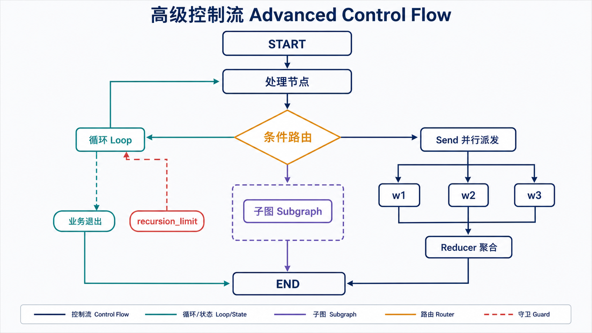
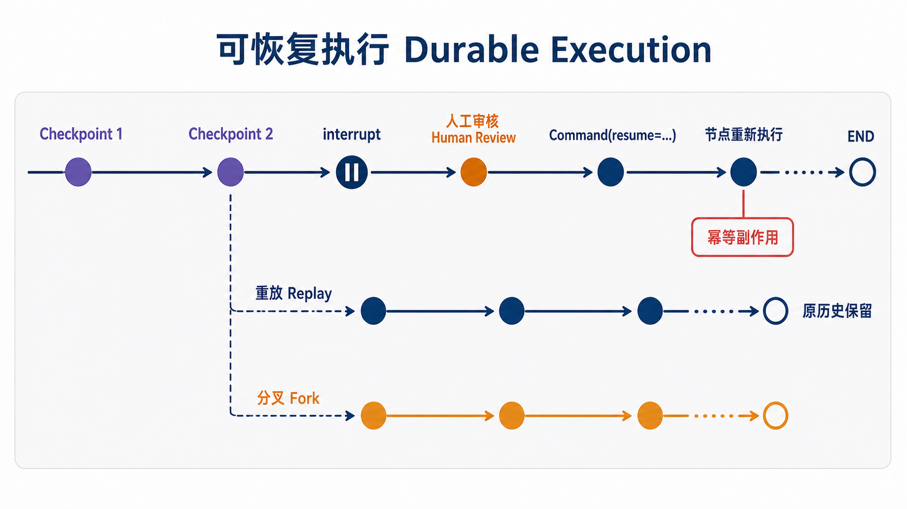

## 概述

循环、条件分支、检查点、人工审核、子图和并行派发共同构成 LangGraph 的高级编排能力。设计这些工作流时，最重要的是让状态字段、路由返回值和节点输入保持一致。

> 版本基线：本文在 2026-07-10 按 Python 3.10+、`langgraph==1.2.8` 和 `langchain==1.3.11` 校验。PostgreSQL、SQLite 检查点分别使用 3.1.0 稳定版。



## 前置知识与学习目标

本文假设你已经理解状态增量、reducer、`MessagesState`、checkpointer 和 `thread_id`。高级能力不是相互独立的技巧：循环和分支决定下一步，reducer 处理并行更新，checkpointer 让中断和恢复成为可能，子图则负责封装局部复杂度。

读完后，你应当能够：

1. 为循环同时设计业务退出条件和运行时保护；
2. 区分继续执行、重放旧步骤和从旧检查点分叉；
3. 说明 `interrupt()` 前的副作用为什么必须幂等；
4. 在子图与 `Send` 并行派发之间做出选择。

设计高级图时，先写出状态不变量，再画边。例如“每次循环后 `counter` 必须增加”“进入发布节点前 `approved` 必须为真”“并行 worker 只能追加结果，不能覆盖输入”。不变量比节点名称更稳定，也能直接转成断言和监控规则。

## 控制流：循环与条件路由

### 循环控制

循环必须同时具备业务退出条件和运行时保护。下面的业务条件在第五次执行后进入 `END`，`recursion_limit` 只在路由代码出错时兜底。

```python
from typing import Literal, TypedDict

from langgraph.graph import END, START, StateGraph

class LoopState(TypedDict):
    counter: int
    result: str

def process(state: LoopState) -> dict:
    counter = state["counter"] + 1
    return {"counter": counter, "result": f"第 {counter} 次处理"}

def route(state: LoopState) -> Literal["process", "__end__"]:
    return "process" if state["counter"] < 5 else END

builder = StateGraph(LoopState)
builder.add_node("process", process)
builder.add_edge(START, "process")
builder.add_conditional_edges("process", route)

graph = builder.compile()
result = graph.invoke(
    {"counter": 0, "result": ""},
    config={"recursion_limit": 10},
)
assert result["counter"] == 5
```

业务上还可以提前结束，例如找到目标后直接返回 `END`：

```python
# 路由函数片段，依赖前一个示例的 LoopState。
def stop_when_found(state: LoopState) -> Literal["process", "__end__"]:
    if state["result"] == "found" or state["counter"] >= 3:
        return END
    return "process"
```

一个可靠循环至少记录四类信息：当前迭代次数、最近一次结果、业务完成标记和停止原因。迭代次数用于保护，结果用于决定下一步，完成标记表达成功，停止原因区分成功、无结果、人工取消和达到上限。只保存 `counter` 会让调用方知道“循环了几次”，却不知道“为什么结束”。

循环节点还应避免让状态无限增长。搜索或反思流程可以只保存最新候选、摘要和有限审计事件，把大体积原始材料放在外部存储中。否则每次模型调用都携带完整历史，延迟和成本会随迭代快速增加。

### 条件分支

路由函数的返回值可以直接使用节点名，也可以通过 `path_map` 映射。下面显式使用业务标签到节点名的映射。

```python
from typing import Literal, TypedDict

from langgraph.graph import END, START, StateGraph

class BranchState(TypedDict):
    input_value: int
    path: str

def classify(state: BranchState) -> Literal["high", "medium", "low"]:
    if state["input_value"] > 100:
        return "high"
    if state["input_value"] > 50:
        return "medium"
    return "low"

def process_high(state: BranchState) -> dict:
    return {"path": "处理高值"}

def process_medium(state: BranchState) -> dict:
    return {"path": "处理中值"}

def process_low(state: BranchState) -> dict:
    return {"path": "处理低值"}

builder = StateGraph(BranchState)
builder.add_node("router", lambda state: {})
builder.add_node("high_processor", process_high)
builder.add_node("medium_processor", process_medium)
builder.add_node("low_processor", process_low)
builder.add_edge(START, "router")
builder.add_conditional_edges(
    "router",
    classify,
    {
        "high": "high_processor",
        "medium": "medium_processor",
        "low": "low_processor",
    },
)
builder.add_edge("high_processor", END)
builder.add_edge("medium_processor", END)
builder.add_edge("low_processor", END)

graph = builder.compile()
result = graph.invoke({"input_value": 75, "path": ""})
assert result["path"] == "处理中值"
```

映射表中的每个目标都必须是已经添加的节点或 `END`。不要把示例中的占位节点名直接带入可运行代码。

路由函数最好保持纯函数：只读取状态并返回路径，不在内部调用模型、写数据库或修改全局变量。这样同一状态总能得到同一路由结果，单元测试也只需构造状态字典。需要模型分类时，应把模型调用放在独立节点中，把结构化分类结果写入状态，再由纯路由函数消费。

## 可恢复执行：检查点、中断与错误



### 检查点、恢复与时间旅行

持久化示例需要使用与输入匹配的状态图。下面单独构建消息图，不复用前一节的 `BranchState`。

```python
from langgraph.checkpoint.memory import InMemorySaver
from langgraph.graph import START, MessagesState, StateGraph

def reply(state: MessagesState) -> dict:
    text = state["messages"][-1].content
    return {"messages": [{"role": "assistant", "content": f"收到：{text}"}]}

builder = StateGraph(MessagesState)
builder.add_node("reply", reply)
builder.add_edge(START, "reply")
graph = builder.compile(checkpointer=InMemorySaver())

config = {"configurable": {"thread_id": "session-1"}}
graph.invoke({"messages": [{"role": "user", "content": "第一条"}]}, config)
graph.invoke({"messages": [{"role": "user", "content": "第二条"}]}, config)

history = list(graph.get_state_history(config))
checkpoint_config = history[-2].config
snapshot = graph.get_state(checkpoint_config)

forked = graph.invoke(
    {"messages": [{"role": "user", "content": "从检查点继续"}]},
    checkpoint_config,
)
print(snapshot.values, forked)
```

从历史检查点调用图会创建新分支，不会删除原来的检查点历史。如果要重放该检查点尚未完成的后续任务，使用 `graph.invoke(None, checkpoint_config)`；如果要加入新的用户输入，则像上例一样传入新的状态增量。

三种操作容易混淆：

| 操作           | 输入                          | 结果                     |
| -------------- | ----------------------------- | ------------------------ |
| 继续当前线程   | 最新 config + 新状态增量      | 在当前末端继续           |
| 重放未完成任务 | 旧 checkpoint config + `None` | 从该步骤重新执行后续任务 |
| 创建替代轨迹   | 旧 checkpoint config + 新状态 | 保留旧历史并形成分叉     |

选择操作前应先确认外部副作用是否可重放。状态快照可以恢复，已经发送的通知、扣款或第三方写入不会由 checkpointer 自动撤销。

### 持久化后端选择

本篇关注恢复语义，不再重复数据库连接代码。后端选择遵循同一原则：`InMemorySaver` 用于测试，SQLite 适合本地单进程工具，PostgreSQL 适合多实例生产服务。连接池、`dict_row`、`setup()` 和异步生命周期的完整配置见上一篇《LangGraph 状态管理与工作流》。

无论使用哪种后端，恢复逻辑都依赖稳定的 `thread_id` 和 checkpoint config。更换后端不会自动修复不可重放的副作用，也不会把业务数据库变成图状态的一部分。

### Human-in-the-Loop

`interrupt()` 会保存当前位置并把可序列化数据交给调用方。恢复时节点从头重新执行，`interrupt()` 返回传给 `Command(resume=...)` 的值，因此中断前的副作用必须幂等。

推荐把“准备审核数据”和“执行外部动作”拆成不同节点：前者生成可序列化草稿并调用 `interrupt()`，后者只在批准后执行。若业务上无法拆分，应为外部动作生成稳定的幂等键，并在重试前查询动作是否已经成功。幂等不是简单捕获异常，而是让重复执行得到与单次执行一致的业务结果。

```python
from typing import TypedDict

from langgraph.checkpoint.memory import InMemorySaver
from langgraph.graph import END, START, StateGraph
from langgraph.types import Command, interrupt

class ReviewState(TypedDict):
    draft: str
    decision: str

def human_review(state: ReviewState) -> dict:
    decision = interrupt(
        {
            "draft": state["draft"],
            "options": ["approve", "reject"],
        }
    )
    return {"decision": decision}

builder = StateGraph(ReviewState)
builder.add_node("human_review", human_review)
builder.add_edge(START, "human_review")
builder.add_edge("human_review", END)
graph = builder.compile(checkpointer=InMemorySaver())

config = {"configurable": {"thread_id": "review-1"}}
paused = graph.invoke({"draft": "待审核内容", "decision": ""}, config)
assert paused["__interrupt__"]

result = graph.invoke(Command(resume="approve"), config)
assert result["decision"] == "approve"
```

如果要直接修正已保存状态，使用 `update_state`，并明确更新被视为来自哪个节点：

```python
# 本片段接续上一个人工审核示例。
updated_config = graph.update_state(
    config,
    {"decision": "manual-override"},
    as_node="human_review",
)
print(graph.get_state(updated_config).values)
```

### 工具错误处理

`@tool` 函数必须提供 docstring 或显式 description。`ToolNode` 默认只处理工具调用参数等调用错误，工具函数自身抛出的执行异常会继续向外抛出。若要把执行错误转换为 `ToolMessage` 返回模型，需要显式配置 `handle_tool_errors`。

```python
from langchain.tools import tool
from langgraph.prebuilt import ToolNode

@tool
def unreliable_tool(query: str) -> str:
    """处理查询；用于演示工具执行异常。"""
    raise RuntimeError(f"处理失败：{query}")

tool_node = ToolNode(
    [unreliable_tool],
    handle_tool_errors="工具暂时不可用，请稍后重试。",
)
```

对普通节点，只有明确可恢复的异常才应在节点内捕获；未知编程错误应保留堆栈并交给运行时处理。

#### 重试应该放在哪一层

重试位置取决于失败是否会改变图的业务路径：

| 失败类型     | 建议处理层                | 示例                   |
| ------------ | ------------------------- | ---------------------- |
| 短暂网络超时 | 工具或节点重试策略        | 相同请求稍后可能成功   |
| 参数可修正   | 转成 ToolMessage 交给模型 | 模型可以调整工具参数   |
| 权限拒绝     | 明确失败或人工介入        | 重试不会改变权限       |
| 未知编程错误 | 向外抛出                  | 需要保留堆栈并修复代码 |
| 业务拒绝     | 条件路由                  | 转入补充资料或终止节点 |

不要在工具内部、节点外层和整个图调用层同时配置无界重试，否则一次用户请求可能成倍执行。每层都应有次数、退避、超时和可重试错误集合，并把最终失败原因写入状态或可观测事件。

#### Command 与状态更新

简单路由函数只返回下一节点；需要在同一步同时更新状态并跳转时，可以使用 `Command`。这适合把“决策结果”和“下一节点”绑定在一次原子图更新中，但也会让节点同时承担业务处理和控制流职责。若团队更重视可读性，可以继续采用“决策节点写状态 + 纯路由函数读状态”的两步结构。

无论选择哪种方式，都应让返回目标出现在类型标注或映射表中，并为每条路径建立测试。控制流越动态，越需要在状态中保留结构化决策结果，而不是只依赖日志中的自然语言解释。

## 组合与并行

### 子图

父图与子图共享状态键时，可以把编译后的子图直接添加为节点。子图私有字段不会出现在父图最终输出中。

```python
from typing import TypedDict

from langgraph.graph import END, START, StateGraph

class SubgraphState(TypedDict):
    value: str
    private_note: str

def prepare(state: SubgraphState) -> dict:
    return {"private_note": "已处理"}

def publish(state: SubgraphState) -> dict:
    return {"value": f"{state['value']} / {state['private_note']}"}

sub_builder = StateGraph(SubgraphState)
sub_builder.add_node("prepare", prepare)
sub_builder.add_node("publish", publish)
sub_builder.add_edge(START, "prepare")
sub_builder.add_edge("prepare", "publish")
sub_builder.add_edge("publish", END)
subgraph = sub_builder.compile()

class ParentState(TypedDict):
    value: str

parent_builder = StateGraph(ParentState)
parent_builder.add_node("subgraph", subgraph)
parent_builder.add_edge(START, "subgraph")
parent_builder.add_edge("subgraph", END)
graph = parent_builder.compile()

result = graph.invoke({"value": "父图输入"})
assert result == {"value": "父图输入 / 已处理"}
```

父子图没有共享字段时，使用包装节点显式转换输入和输出。

### Send 并行派发

`Send` 为每个输入创建独立的节点调用。所有分支写入同一个结果字段时，该字段必须配置 reducer。

`Send` 的 worker 输入可以使用比父图更窄的 schema，避免把无关状态复制到每个并行任务。worker 返回值则应保持小而可合并，例如单个摘要、评分或错误记录。若结果顺序有业务含义，不要假设并行完成顺序与输入顺序一致；应在结果中携带索引，聚合后显式排序。

并行还会改变失败语义：部分 worker 成功、部分失败时，是整体失败、保留部分结果还是只重试失败项，必须由业务决定。checkpointer 可以保存同一 super-step 中已经完成的写入，但应用仍需定义最终完整性条件，例如 `success_count == expected_count`，并在生成最终答案前检查。

```python
import operator
from typing import Annotated, TypedDict

from langgraph.graph import END, START, StateGraph
from langgraph.types import Send

class OverallState(TypedDict):
    items: list[str]
    results: Annotated[list[str], operator.add]

class ItemState(TypedDict):
    item: str

def spawn_tasks(state: OverallState) -> list[Send]:
    return [Send("process_item", {"item": item}) for item in state["items"]]

def process_item(state: ItemState) -> dict:
    return {"results": [f"processed: {state['item']}"]}

builder = StateGraph(OverallState)
builder.add_node("process_item", process_item)
builder.add_conditional_edges(START, spawn_tasks)
builder.add_edge("process_item", END)
graph = builder.compile()

result = graph.invoke({"items": ["a", "b"], "results": []})
assert sorted(result["results"]) == ["processed: a", "processed: b"]
```

### 子图与 Send 如何选择

| 需求                         | 更合适的机制     | 原因                          |
| ---------------------------- | ---------------- | ----------------------------- |
| 封装可复用的多步骤流程       | 子图             | 有自己的状态 schema、节点和边 |
| 对运行时列表动态创建同类任务 | `Send`           | 每个输入生成一次独立节点调用  |
| 父子状态字段不同             | 包装节点         | 显式完成输入和输出映射        |
| 并行结果写入同一个列表       | `Send` + reducer | 避免并发更新冲突              |

## 失败模式与恢复边界

| 现象                         | 常见原因                         | 应对方式                             |
| ---------------------------- | -------------------------------- | ------------------------------------ |
| 达到 `recursion_limit`       | 路由没有业务退出路径             | 记录结束原因并检查状态转移           |
| 恢复后重复发送邮件或扣款     | `interrupt()` 前存在非幂等副作用 | 把副作用放到中断后，或使用幂等键     |
| 并行分支更新冲突             | 多个分支覆盖同一字段             | 为聚合字段配置 reducer 或拆分字段    |
| 子图读取不到输入             | 父子图没有共享键且未映射         | 使用包装节点转换状态                 |
| 工具异常直接终止图           | 未配置明确的工具错误策略         | 只捕获可恢复异常，并保留未知错误堆栈 |
| 从旧检查点调用后出现两条结果 | 发生了分叉而非覆盖               | 使用 checkpoint 元数据区分执行轨迹   |

官方的 [Interrupts 文档](https://docs.langchain.com/oss/python/langgraph/interrupts) 明确说明：恢复时 `Command(resume=...)` 的值会成为 `interrupt()` 的返回值，节点会从头重新执行。官方 [Workflows and agents](https://docs.langchain.com/oss/python/langgraph/workflows-agents) 则把 `Send` 定义为运行时动态创建 worker 调用的机制。

## 本篇自检

1. 为什么循环需要业务退出条件，不能只依赖 `recursion_limit`？
2. 在 `interrupt()` 之前执行一次扣款，恢复后可能发生什么？
3. 动态并行处理 100 个文档并把摘要写入同一列表时，需要哪两个机制？

<details>
<summary>查看答案</summary>

1. `recursion_limit` 只能说明执行步数超过保护阈值，不能表示业务成功；正常完成必须由状态驱动的退出条件表达。
2. 节点恢复时会从头执行，扣款可能重复发生。应移动副作用、使用幂等键，或在状态中记录并校验执行结果。
3. 使用 `Send` 为文档动态创建 worker 调用，并为摘要列表配置累积 reducer。

</details>

## 下一篇连接

下一篇将把工具循环、自定义状态、checkpointer 和错误保护组合成一个端到端 Agent，并用测试和观测指标验证它是否可靠结束。

## 总结

- 循环必须有业务退出条件，并用 `recursion_limit` 防御错误路由。
- 分支标签、映射表和节点名必须一一对应。
- 中断和时间旅行依赖 checkpointer 与稳定的 `thread_id`。
- 工具执行异常默认不会自动变成工具消息，需要显式错误策略。
- 子图用于封装局部状态，`Send` 用于动态 map-reduce 派发。
