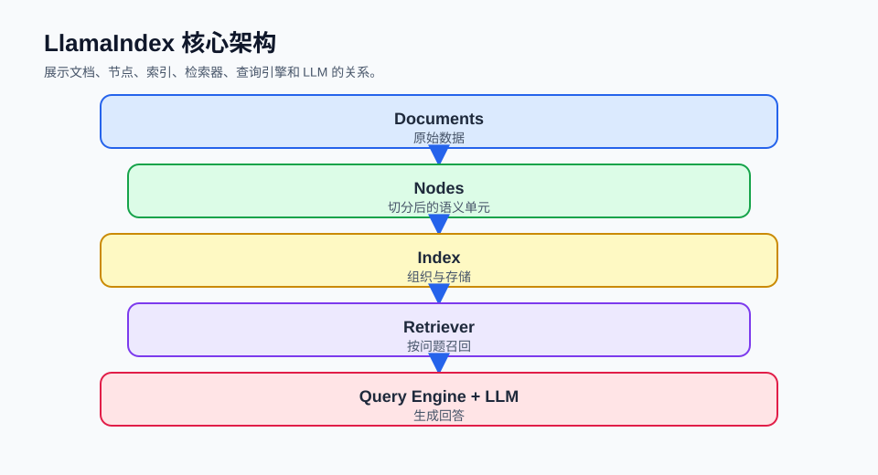

## 概述

LlamaIndex 是一个专为构建 LLM 应用设计的数据框架，特别擅长处理检索增强生成（RAG）场景。与 LangChain 的通用性不同，LlamaIndex 专注于数据和知识管理，提供了更高效、更灵活的索引和检索能力。

理解 LlamaIndex 时，可以先抓住一条主线：先把外部资料加载成**文档**，再切成适合检索的**节点**，然后构建**索引**，最后通过**查询引擎**把用户问题转换成答案。



### LlamaIndex vs LangChain

如果你的目标是围绕私有资料做问答、摘要和检索，LlamaIndex 通常更直接；如果你的目标是编排多个工具、Agent 或复杂工作流，LangChain 的通用性会更强。

| 特性         | LlamaIndex | LangChain  |
| ------------ | ---------- | ---------- |
| **核心重点** | 数据和检索 | 工作流编排 |
| **RAG 支持** | 深度优化   | 基础支持   |
| **索引类型** | 丰富多样   | 有限       |
| **数据处理** | 强大的转换 | 基础支持   |
| **学习曲线** | 中等       | 较陡       |

### 核心架构

```
┌─────────────────────────────────────────────────────────────┐
│                     LlamaIndex 架构                          │
├─────────────────────────────────────────────────────────────┤
│                                                              │
│   ┌─────────────┐  ┌─────────────┐  ┌─────────────┐       │
│   │   Data      │  │   Index     │  │   Query     │       │
│   │  Connectors │  │   Engine    │  │   Engine    │       │
│   └─────────────┘  └─────────────┘  └─────────────┘       │
│                                                              │
│   ┌─────────────┐  ┌─────────────┐  ┌─────────────┐       │
│   │   Nodes     │  │  Retrievers │  │ Synthesizer │       │
│   │             │  │             │  │             │       │
│   └─────────────┘  └─────────────┘  └─────────────┘       │
│                                                              │
└─────────────────────────────────────────────────────────────┘
```

## 核心概念

这一节先把几个高频对象串起来。读代码时只要记住 `Document -> Node -> Index -> QueryEngine`，后面的 API 会更容易归位。

### 1. 数据连接器 (Data Connectors)

数据连接器负责把本地目录、网页、数据库等来源转换成 LlamaIndex 可以处理的文档。下面的例子读取 `./data` 目录，适合先验证资料能不能被框架识别。

```python
from llama_index.core import SimpleDirectoryReader

documents = SimpleDirectoryReader("./data").load_data()

print(f"加载了 {len(documents)} 个文档")
```

### 2. 文档 (Documents)

文档是原始资料进入 LlamaIndex 后的基本单元，通常保存正文和元数据。元数据不会直接回答问题，但后续可以用于过滤、展示来源和追踪出处。

```python
from llama_index.core import Document

doc = Document(
    text="这是文档内容",
    metadata={"source": "example", "author": "张三"}
)

print(doc.text)
print(doc.metadata)
```

### 3. 节点 (Nodes)

节点是文档被切分后的检索单元。RAG 查询时，系统实际召回的通常不是整篇文档，而是最相关的一批节点。

```python
from llama_index.core import Document
from llama_index.core.node_parser import SentenceSplitter

doc = Document(text="长文档内容...")

parser = SentenceSplitter(chunk_size=512, chunk_overlap=64)

nodes = parser.get_nodes_from_documents([doc])

print(f"生成了 {len(nodes)} 个节点")
```

`chunk_size` 控制每个节点的大致长度，`chunk_overlap` 让相邻节点保留少量重叠，避免重要上下文刚好被切断。

### 4. 索引 (Indexes)

索引用来组织节点，让后续检索更快、更相关。最常见的是向量索引，它会把文本转换成向量，再根据语义相似度召回内容。

```python
from llama_index.core import VectorStoreIndex

index = VectorStoreIndex.from_documents(documents)
print(index)
```

### 5. 查询引擎 (Query Engines)

查询引擎把“检索节点”和“生成回答”封装成一个接口。入门阶段通常先用 `index.as_query_engine()`，等需要控制召回数量、过滤和响应模式时再细调。

```python
query_engine = index.as_query_engine()

response = query_engine.query("用户的问题")
print(response)
```

## 安装和设置

这一节解决运行环境问题。LlamaIndex 的核心包和模型集成包是分开的，使用 OpenAI 模型时需要额外安装 LLM 与 embedding 集成。

### 安装 LlamaIndex

```bash
pip install llama-index
pip install llama-index-llms-openai
pip install llama-index-embeddings-openai
```

### 基本配置

当前推荐使用 `Settings` 配置全局默认模型。这样构建索引和查询引擎时，如果没有传入局部配置，LlamaIndex 会自动使用这些默认值。

```python
from llama_index.core import Settings
from llama_index.llms.openai import OpenAI
from llama_index.embeddings.openai import OpenAIEmbedding

Settings.llm = OpenAI(model="gpt-4o-mini")
Settings.embed_model = OpenAIEmbedding(model="text-embedding-3-small")
```

## 基本使用流程

这一节把前面的对象连成完整流程。先不要急着调参数，先确认“加载资料、构建索引、提出问题”这三步能跑通。

### 完整的 RAG 流程

这段代码依赖 `./data` 目录中已经有可读取的文本、Markdown、PDF 等文件。`VectorStoreIndex.from_documents()` 会根据默认设置完成切分和嵌入。

```python
from llama_index.core import SimpleDirectoryReader, VectorStoreIndex

documents = SimpleDirectoryReader("./data").load_data()
index = VectorStoreIndex.from_documents(documents)
query_engine = index.as_query_engine()

response = query_engine.query("关于某个主题的问题")
print(response)
```

### 简化流程（新版本）

如果希望把模型和切分策略集中配置，可以用 `Settings`。这种写法适合文章示例、小项目和单进程脚本，但大型应用中也可以按模块传入局部配置。

```python
from llama_index.core import Settings, SimpleDirectoryReader, VectorStoreIndex
from llama_index.core.node_parser import SentenceSplitter
from llama_index.llms.openai import OpenAI
from llama_index.embeddings.openai import OpenAIEmbedding

Settings.llm = OpenAI(model="gpt-4o-mini")
Settings.embed_model = OpenAIEmbedding(model="text-embedding-3-small")
Settings.text_splitter = SentenceSplitter(chunk_size=512, chunk_overlap=64)

documents = SimpleDirectoryReader("./data").load_data()
index = VectorStoreIndex.from_documents(documents)

query_engine = index.as_query_engine()
response = query_engine.query("你的问题")
```

## 文档加载

这一节关注资料入口。不同数据源最后都会被转换成文档，所以选择加载器时优先看资料在哪里、格式是否稳定、是否需要保留来源信息。

### 支持的数据源

本地文件最适合入门和知识库原型；Notion、Google Docs、Slack、Web 更适合把已有协作内容接入 RAG。

| 数据源          | 说明            | 使用场景 |
| --------------- | --------------- | -------- |
| **本地文件**    | txt, pdf, md 等 | 文档处理 |
| **Notion**      | Notion 数据库   | 知识管理 |
| **Google Docs** | Google 文档     | 协作文档 |
| **Slack**       | Slack 频道      | 对话数据 |
| **Web**         | 网页内容        | 在线资源 |

### 本地文件加载

`recursive=True` 会递归读取子目录，`exclude` 用来跳过临时文件或不希望进入知识库的内容。

```python
from llama_index.core import SimpleDirectoryReader

reader = SimpleDirectoryReader(
    input_dir="./data",
    recursive=True,
    exclude=["*.tmp"]
)

documents = reader.load_data()
```

### PDF 加载

PDF 可以直接通过 `SimpleDirectoryReader` 读取；如果项目中大量处理 PDF，建议单独安装并确认对应 reader 依赖。

```python
from llama_index.core import SimpleDirectoryReader

documents = SimpleDirectoryReader(
    input_dir="./pdfs",
    required_exts=[".pdf"]
).load_data()
```

## 节点解析

这一节处理“文档太长，不适合直接检索”的问题。切分策略会直接影响召回质量：切得太短容易丢上下文，切得太长又会带入无关内容。

### 文本分割器

`SentenceSplitter` 是通用起点；如果文档有明确标题结构，可以在后续再考虑 Markdown 解析器或自定义解析器。

```python
from llama_index.core.node_parser import (
    SentenceSplitter,
    TokenTextSplitter
)

parser = SentenceSplitter(
    chunk_size=512,
    chunk_overlap=64
)

nodes = parser.get_nodes_from_documents(documents)
```

## 索引类型

这一节说明不同索引的取舍。入门阶段优先使用 `VectorStoreIndex`，只有当查询目标明确偏摘要、关键词或长文档聚合时，再考虑其他索引。

### 常用索引类型

下面的表格不是“都要用”，而是帮助判断问题类型：语义问答选向量索引，整篇归纳选摘要索引，按文档聚合选文档摘要索引。

| 索引类型                 | 说明         | 适用场景   |
| ------------------------ | ------------ | ---------- |
| **VectorStoreIndex**     | 向量索引     | 语义检索   |
| **SummaryIndex**         | 摘要索引     | 简单查询   |
| **DocumentSummaryIndex** | 文档摘要索引 | 长文档     |
| **KeywordTableIndex**    | 关键词索引   | 关键词匹配 |

### 创建向量索引

如果前面已经通过 `Settings.embed_model` 设置了嵌入模型，这里可以直接构建索引；局部传入模型则会覆盖全局默认值。

```python
from llama_index.core import VectorStoreIndex

index = VectorStoreIndex.from_documents(documents)
```

### 创建摘要索引

摘要索引更适合对一组文档做整体归纳，不适合替代向量索引处理精确事实问答。

```python
from llama_index.core import SummaryIndex

index = SummaryIndex.from_documents(documents)
```

## 查询引擎

这一节把索引变成可提问的接口。查询引擎内部通常会先用检索器找到相关节点，再把节点交给响应合成器生成自然语言答案。

### 创建查询引擎

`similarity_top_k` 控制先取回多少个相关节点，`response_mode` 控制这些节点如何被整理成回答。

```python
query_engine = index.as_query_engine(
    similarity_top_k=5,
    response_mode="compact"
)

response = query_engine.query("你的问题")
```

### 自定义查询引擎

需要拆开调试检索和生成时，可以显式创建检索器和响应合成器。这样更容易单独观察召回内容是否准确。

```python
from llama_index.core.query_engine import RetrieverQueryEngine
from llama_index.core.response_synthesizers import get_response_synthesizer

retriever = index.as_retriever(
    similarity_top_k=10
)

response_synthesizer = get_response_synthesizer(
    response_mode="compact"
)

query_engine = RetrieverQueryEngine.from_args(
    retriever=retriever,
    response_synthesizer=response_synthesizer
)
```

## 响应模式

这一节说明“召回到的节点如何被组织成答案”。相同的检索结果，使用不同响应模式，速度、成本和答案完整度都会不同。

### 常用模式

简单问答优先用 `compact`，长文档逐步归纳可以考虑 `refine`，只需要快速摘要时再用 `simple_summarize`。

| 模式                 | 说明       |
| -------------------- | ---------- |
| **default**          | 默认响应   |
| **compact**          | 压缩上下文 |
| **simple_summarize** | 简单摘要   |
| **refine**           | 逐步优化   |

```python
query_engine = index.as_query_engine(
    response_mode="compact"
)
```

## 最佳实践

这一节把前面的参数选择压缩成可执行判断。优化时先看检索是否命中正确节点，再看回答是否表达充分。

| 实践                      | 说明                                         |
| ------------------------- | -------------------------------------------- |
| **选择合适的索引**        | 语义问答优先向量索引，整体归纳再考虑摘要索引 |
| **优化 chunk_size**       | 短资料可以小一些，长报告通常需要更大的节点   |
| **设置 similarity_top_k** | 答案漏信息时适当调大，噪声过多时调小         |
| **使用合适的嵌入模型**    | 中文资料优先确认模型对中文语义检索效果稳定   |

## 总结

这一节回收核心关系。LlamaIndex 的关键不是记住很多类名，而是理解数据如何一步步变成可检索、可生成答案的上下文。

LlamaIndex 的核心流程：

| 步骤            | 组件                 |
| --------------- | -------------------- |
| **1. 数据加载** | Data Connectors      |
| **2. 文档解析** | Documents → Nodes    |
| **3. 索引构建** | VectorStoreIndex     |
| **4. 查询处理** | Query Engine         |
| **5. 响应生成** | Response Synthesizer |

容易混淆的是：文档是原始资料单元，节点是检索单元，索引负责组织节点，查询引擎负责把检索和响应合成串起来。掌握这条关系后，再学习数据连接、检索优化和完整 RAG 应用会顺畅很多。
