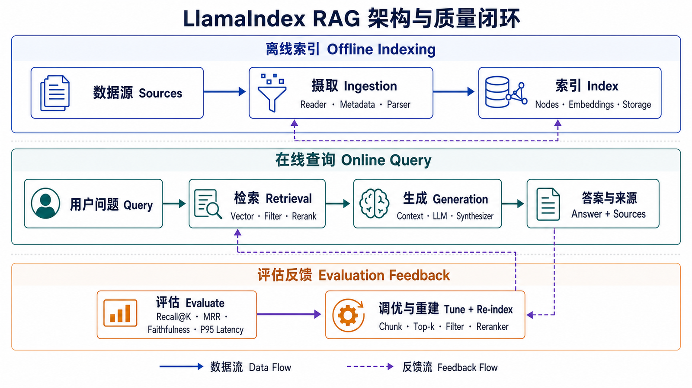
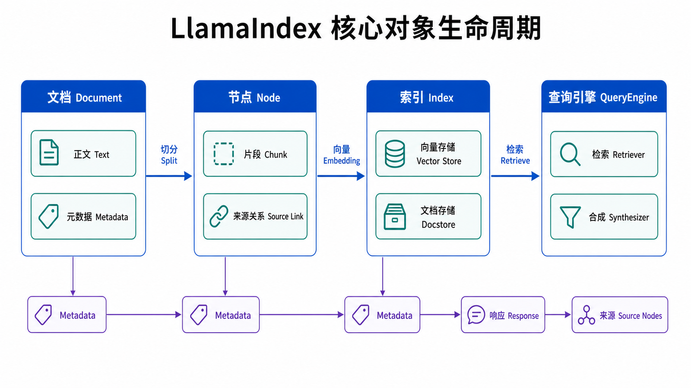

## 本篇要解决的问题

LlamaIndex 不是“把文档扔给大模型”的快捷函数。它解决的是：外部资料怎样变成可检索的数据，用户问题怎样找到相关片段，以及大模型怎样只基于这些片段组织答案。

学完本篇，你应该能解释 `Document → Node → Index → QueryEngine` 的职责边界，运行一个最小 RAG 流程，并通过 `source_nodes` 检查答案依据。

### 前置知识与验证环境

读者需要会运行 Python、安装包和设置环境变量，并知道 embedding 会把文本映射为向量。本系列示例按以下版本验证：

```text
Python 3.11+
llama-index-core==0.14.23
llama-index-llms-openai==0.7.9
llama-index-embeddings-openai==0.6.0
llama-index-readers-file==0.6.0
```

小版本升级通常兼容，但集成包和导入路径可能变化。遇到差异时应先查 [LlamaIndex 官方文档](https://docs.llamaindex.ai/en/stable/)，不要靠反复修改参数猜测。



## 先建立双通道心智模型

一个 RAG 系统有两条执行频率不同的通道。

**离线索引通道**处理资料：Reader 读取来源，得到 Document；解析器把 Document 切成 Node；embedding 模型为 Node 生成向量；Index 和 StorageContext 保存检索所需的数据。

**在线查询通道**处理问题：Retriever 找到相关 Node；可选的过滤和重排器清理候选；Response Synthesizer 把上下文交给 LLM；最终响应同时包含答案与来源节点。

把两条通道分开很重要。切分或 embedding 变化通常需要重新构建索引；只修改回答提示词通常不需要。答案不准时，也应先判断是“没找到资料”还是“找到后没答好”。

## 四个核心对象



### Document：进入系统的资料单元

`Document` 保存正文和 metadata。metadata 不只是展示信息，它还承担来源追踪、过滤、权限和版本管理。

```python
from llama_index.core import Document

document = Document(
    text="退款申请需要在订单完成后 7 天内提交。",
    metadata={
        "source": "refund-policy.md",
        "department": "support",
        "version": "2026-07",
    },
)
```

稳定、可解释的字段适合进入 metadata。访问令牌、身份证号等敏感数据不应因为“以后可能要过滤”就直接写进去。

### Node：真正参与检索的片段

长文档通常不能整篇参与检索。Node 是切分后的检索单元，会保留正文片段、metadata 以及指向原 Document 的关系。

```python
from llama_index.core.node_parser import SentenceSplitter

splitter = SentenceSplitter(chunk_size=256, chunk_overlap=32)
nodes = splitter.get_nodes_from_documents([document])

print(nodes[0].get_content())
print(nodes[0].metadata["source"])
```

`chunk_size` 太小，相关条件可能被拆散；太大，无关内容会稀释相似度并占用模型上下文。256/32 只是短政策文档的起点，不能当作所有数据的最优值。

### Index：组织 Node 的检索结构

`VectorStoreIndex` 为 Node 建立语义检索入口。默认配置适合本地实验；生产环境通常把向量、文档和索引元数据放到可持久化后端。

```python
from llama_index.core import VectorStoreIndex

index = VectorStoreIndex(nodes)
retriever = index.as_retriever(similarity_top_k=3)
```

Index 不是原文副本的同义词。它负责组织 Node，并通过底层 vector store、docstore 与 index store 协作。官方的 [VectorStoreIndex 指南](https://docs.llamaindex.ai/en/stable/module_guides/indexing/vector_store_index/) 说明了 `from_documents()` 会先把 Document 转成 Node。

### QueryEngine：把检索与生成串起来

`QueryEngine` 是方便的高层接口。它通常先调用 Retriever，再把候选 Node 交给响应合成器。

```python
query_engine = index.as_query_engine(
    similarity_top_k=3,
    response_mode="compact",
)

response = query_engine.query("退款最晚什么时候申请？")
print(str(response))
```

如果只看最终字符串，就很难知道错误发生在哪一层。入门阶段应养成同时查看来源的习惯。

## 一个可以连续运行的最小 RAG

先安装依赖：

```bash
pip install "llama-index-core==0.14.23" \
  "llama-index-llms-openai==0.7.9" \
  "llama-index-embeddings-openai==0.6.0" \
  "llama-index-readers-file==0.6.0"
```

在 `data/refund-policy.md` 中写入两三条退款规则，并在系统环境中设置 `OPENAI_API_KEY`。不要把密钥写进代码或提交到仓库。

```python
from llama_index.core import Settings, SimpleDirectoryReader, VectorStoreIndex
from llama_index.embeddings.openai import OpenAIEmbedding
from llama_index.llms.openai import OpenAI

Settings.llm = OpenAI(model="gpt-4o-mini", temperature=0)
Settings.embed_model = OpenAIEmbedding(model="text-embedding-3-small")

documents = SimpleDirectoryReader(
    input_dir="./data",
    required_exts=[".md", ".txt"],
).load_data()

index = VectorStoreIndex.from_documents(documents)
query_engine = index.as_query_engine(similarity_top_k=3)

response = query_engine.query("退款申请期限是多少？")
print(f"答案：{response}")

for rank, item in enumerate(response.source_nodes, start=1):
    node = item.node
    print(f"\n来源 {rank}，分数={item.score}")
    print(f"文件={node.metadata.get('file_name')}")
    print(node.get_content()[:200])
```

预期结果不是固定措辞，而是：答案提到资料中的期限；`source_nodes` 至少包含一个相关片段；来源文件和片段内容能支持答案。如果答案错误但来源正确，应检查合成或提示词；来源就不相关，则应先处理切分、embedding、过滤或 `top_k`。

## Embedding、StorageContext 和 Settings 在哪里

四个核心对象之外，还有三个容易混淆的概念：

| 概念               | 职责                                       | 变化时的影响                         |
| ------------------ | ------------------------------------------ | ------------------------------------ |
| **Embedding**      | 把 Node 和 Query 映射到可比较的向量空间    | 更换模型通常需要重新嵌入和建索引     |
| **StorageContext** | 连接 vector store、docstore 与 index store | 决定数据保存和恢复方式               |
| **Settings**       | 提供默认 LLM、embedding、切分器等配置      | 适合示例；大型服务要警惕全局可变状态 |

`Settings` 让教程代码简洁，但在多模型、多租户或并发服务中，局部传参通常更容易审计。不要把“全局默认值方便”误解成“所有应用都应该共享同一个配置”。

## 跟踪一次查询中的对象变化

假设知识库有一篇 2,000 字的退款政策，用户问“企业版过了五天还能退吗？”。这句话不会直接和整篇原文一起交给 LLM，而会经历以下变化：

1. Reader 把文件内容与 `file_name`、路径等信息装入 Document。
2. Splitter 把 Document 切成多个 Node，例如“普通版 7 天”“企业版 3 天”“特殊商品不退款”分别落在不同片段。
3. Embedding 模型分别计算 Node 向量；Index 保存向量、Node ID 与来源关系。
4. 在线查询时，同一个 embedding 模型把问题转成 Query 向量，Retriever 返回相似度最高的候选 Node。
5. Response Synthesizer 把候选片段与问题组织成模型输入，Response 再保留实际使用的 `source_nodes`。

这里有三个关键边界。第一，LLM 通常不会看到未被召回的全文，因此漏召回不能靠更聪明的回答提示补救。第二，Retriever 返回的是候选证据，不是已经验证的事实；排序靠前也可能只是语义相似。第三，Response 中展示来源并不自动证明每句答案都由该来源支持，仍需要 Faithfulness 评估或人工抽检。

可以把对象之间的关系压缩成一张职责表：

| 阶段 | 输入                   | 输出            | 最值得检查的内容                  |
| ---- | ---------------------- | --------------- | --------------------------------- |
| 加载 | 文件、网页、数据库记录 | Document        | 正文是否完整，metadata 是否可追踪 |
| 转换 | Document               | Node            | 切分边界、长度、来源关系          |
| 索引 | Node                   | 可检索结构      | embedding 是否一致，是否持久化    |
| 检索 | Query + Index          | `NodeWithScore` | 正确来源是否进入 Top-K            |
| 合成 | Query + 候选 Node      | Response        | 答案是否忠实，来源是否能支持结论  |

如果调试时不知道该打印哪个对象，就回到这张表。它比从最终回答反推内部原因更可靠。

## 为最小示例设置三个检查点

一个可以运行的脚本仍可能悄悄产生低质量结果。建议在第一次实验中明确检查三个位置。

### 检查加载结果

打印 Document 数量、前 200 个字符和关键 metadata。PDF 解析经常出现文字顺序错乱、重复页眉或整页为空；这些问题在最终答案里表现为“模型不知道”，根因却在 Reader。

```python
for doc in documents[:3]:
    print(doc.metadata)
    print(repr(doc.text[:200]))
```

### 检查切分结果

随机抽取 Node，确认一句规则的条件与结论没有被切到两个互不重叠的片段。还要观察长度分布，而不是只看平均值：大量极短 Node 会造成索引膨胀，大量接近上限的 Node 则可能说明章节结构没有被利用。

```python
lengths = [len(node.get_content()) for node in nodes]
print(min(lengths), sum(lengths) / len(lengths), max(lengths))
```

### 检查检索而不是只检查答案

准备一个原文措辞不同但答案明确的问题。例如原文写“订单完结七个自然日内”，问题写“完成一周后是否还能申请”。若向量检索仍能返回对应 Node，说明 baseline 捕获了基本语义；若精确编号和错误码经常丢失，则下一步应评估关键词或混合检索，而不是马上更换 LLM。

## 从 demo 走向可维护 baseline

教程常把 `VectorStoreIndex.from_documents()` 写成一行，这是为了展示默认行为，不代表生产代码也应隐藏全部决策。可维护 baseline 至少要把以下内容显式化：

- 锁定 Python 与 LlamaIndex 包版本，记录 embedding 模型名称。
- 为 Document 使用稳定 ID，为来源、版本、租户定义 metadata schema。
- 把 splitter 参数写进配置，并记录索引由哪一版配置生成。
- 持久化 StorageContext，启动时加载而不是重复 embedding。
- 保存一组问题、期望来源和关键事实，修改配置后执行回归。

这些工作不会让第一次演示更炫，但能回答最重要的维护问题：当答案变化时，是资料变了、索引变了、模型变了，还是查询参数变了。

## 对象边界常见的反例

一种常见写法是在文件加载函数中顺便切分、embedding、写向量库，再返回 QueryEngine。它行数少，却让数据质量检查、增量更新和单元测试都难以插入。另一种写法是在每次 HTTP 请求里调用 `from_documents()`，这会重复读取文件和产生 embedding 成本，还让延迟随资料规模增长。

更清晰的边界是：离线任务输出一个有版本的索引；在线服务只加载该索引并执行查询；评测任务读取同一索引，对 Retriever 与 Response 分别打分。三条路径共享配置，但不共享不必要的执行步骤。

## 怎样选择其他 Index

入门阶段先用 `VectorStoreIndex`。只有查询目标发生变化时再换：

| Index                  | 更合适的问题             | 主要代价               |
| ---------------------- | ------------------------ | ---------------------- |
| `VectorStoreIndex`     | 找与问题语义相关的片段   | 依赖 embedding 质量    |
| `SummaryIndex`         | 遍历一组节点做整体总结   | 文档多时调用成本更高   |
| `DocumentSummaryIndex` | 先按文档摘要定位相关文档 | 需要生成和维护文档摘要 |

“简单问题”并不是选择 `SummaryIndex` 的充分理由。选择依据应是是否需要遍历/总结整体，而不是问题句子长短。

## LlamaIndex 与编排框架如何取舍

把两个生态简单写成“一个强、一个弱”没有意义。更实用的判断是：

- 任务中心是资料摄取、索引、检索和 RAG 评估时，LlamaIndex 提供了更直接的数据抽象。
- 任务中心是跨工具、Agent 和业务步骤的通用编排时，可以评估工作流框架或应用自身的编排层。
- 两者并非互斥；生产系统常把检索子系统作为更大工作流中的一个组件。

最终选择应由可维护性、团队经验、目标存储后端和评估结果决定，而不是功能对比表中的形容词。

## 什么时候不需要上 RAG

如果答案来自一个稳定、结构化、可直接查询的业务表，优先使用数据库查询和确定性规则；如果只处理几百字且每次都需要全文，直接把受控文本放入上下文可能更简单；如果任务是改写、翻译或分类用户刚刚提供的文本，也不一定需要索引。

RAG 的价值来自“资料规模超过单次上下文、需要按问题选择证据、资料频繁更新或必须展示来源”。它同时引入解析、embedding、存储、评测和权限成本。先用最小 baseline 证明检索确实改善了目标问题，再逐步增加混合检索、重排和复杂工作流，通常比一开始堆满组件更容易得到可信系统。

换句话说，先证明问题确实需要检索，再选择框架。

## 常见误区

- Document 是资料单元，Node 才通常是检索单元。
- Index 负责组织检索数据，不负责保证答案事实正确。
- `similarity_top_k` 增大可能提高召回，也会引入噪声和成本。
- 最终答案流畅不代表来源正确；必须检查 `source_nodes`。
- RAG 不能自动解决过期资料、权限泄漏和解析乱码。

## 本篇自检

1. Document 与 Node 的主要区别是什么？
2. 为什么更换 embedding 模型后通常要重新构建索引？
3. 最终答案错误时，如何先区分检索问题与生成问题？

<details>
<summary>查看答案</summary>

1. Document 表示进入系统的资料及其 metadata；Node 是切分后参与检索的片段，并保留来源关系。
2. 新旧模型产生的向量空间不可假定兼容，文档向量和查询向量需要由同一套模型生成。
3. 直接检查 `response.source_nodes`：来源不相关先修检索，来源正确但回答错误再查响应合成、提示词和模型。

</details>

## 小结

LlamaIndex 的核心不是类名数量，而是两条清晰的数据流：离线阶段把资料变成可检索 Node，在线阶段把问题变成带来源的答案。下一篇进入最容易决定 RAG 上限的部分：数据如何读取、清洗、切分、更新和隔离。

**下一篇：** [LlamaIndex 数据连接与索引构建](/posts/llamaindex-data-connectors/)

## 参考资料

- [LlamaIndex：Using VectorStoreIndex](https://docs.llamaindex.ai/en/stable/module_guides/indexing/vector_store_index/)
- [LlamaIndex：Loading Data](https://docs.llamaindex.ai/en/stable/module_guides/loading/)
- [LlamaIndex：Storing](https://docs.llamaindex.ai/en/stable/module_guides/storing/)
