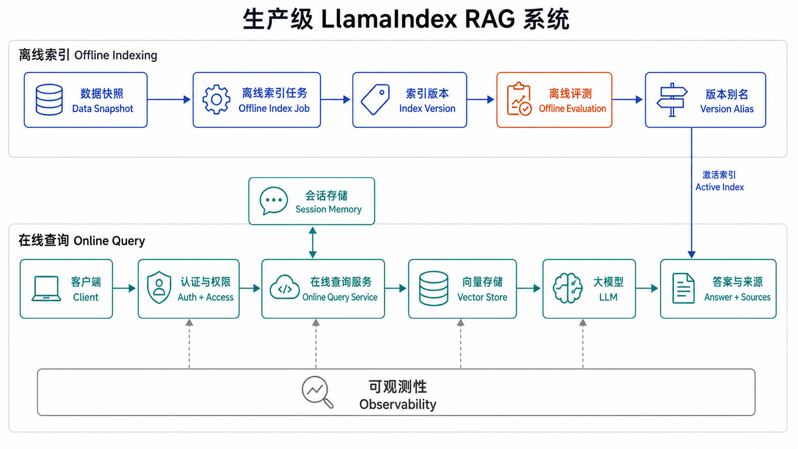
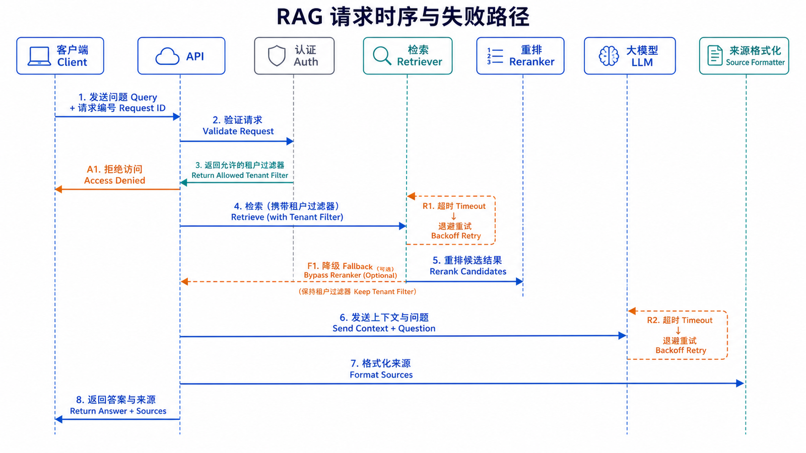

## 本篇要解决的问题

前三篇分别解释了对象、数据摄取和查询漏斗。本篇把它们组装成一个可以运行和验收的文本 RAG 小项目：离线构建索引，在线返回答案与来源，按 session 隔离对话，并对暂态错误做有限重试。

这里的“完整”指教程范围内的最小闭环，不包含 Web UI、多模态、分布式任务和云部署。学完后，你应该能运行项目、检查来源、执行离线测试，并说明把它投入生产还缺哪些护栏。

### 前置知识与环境

- Python 3.11+，理解前三篇的 Document、Node、Index、Retriever 和 source nodes。
- 示例版本基线为 `llama-index-core==0.14.23`。
- 默认使用 OpenAI 集成演示真实查询；测试使用 MockLLM/MockEmbedding，不产生模型 API 费用。



## 先定义验收标准

项目完成不以“终端打印了一段话”为准，而以以下结果为准：

1. 相同资料不必在每次启动时重新 embedding。
2. 查询返回 `answer` 和结构化 `sources`。
3. 不同 session 的对话状态不共享。
4. 只有暂态网络/限流错误会重试，并且有超时与退避。
5. 无网络测试能验证索引、来源、过滤和持久化基本行为。
6. 一组 golden questions 能比较检索命中、忠实度和延迟。

## 项目结构

```text
llamaindex-rag-demo/
├─ data/
│  ├─ refund-policy.md
│  └─ shipping-policy.md
├─ storage/                 # 运行 build_index.py 后生成
├─ build_index.py           # 离线摄取与索引
├─ rag_service.py           # 在线查询与会话
├─ cli.py                   # 最小交互入口
├─ tests/
│  └─ test_rag_offline.py
├─ .env.example
└─ requirements.txt
```

离线与在线代码分开后，资料更新不会阻塞每个查询进程，在线服务也不会因为启动而重复调用 embedding。

### 配置也要成为可追踪输入

除了代码和资料，索引结果还依赖 splitter、embedding、metadata schema 和集成包版本。建议每次构建生成一份 `manifest.json`，记录：

```json
{
  "index_version": "refund-20260712-01",
  "schema_version": 1,
  "chunk_size": 512,
  "chunk_overlap": 64,
  "embedding_model": "text-embedding-3-small",
  "llama_index_core": "0.14.23",
  "document_count": 2,
  "node_count": 18
}
```

在线服务启动时打印并上报当前 `index_version`。当同一个问题昨天和今天答案不同，团队才能把差异关联到资料快照、索引配置或模型版本，而不是只能查看最后一次代码提交。

## 安装与配置

`requirements.txt`：

```text
llama-index-core==0.14.23
llama-index-llms-openai==0.7.9
llama-index-embeddings-openai==0.6.0
llama-index-readers-file==0.6.0
openai
python-dotenv
tenacity
pytest
```

`.env.example` 只记录变量名：

```text
OPENAI_API_KEY=
RAG_DATA_DIR=./data
RAG_STORAGE_DIR=./storage
```

复制为 `.env` 后在本地填入密钥，并把 `.env` 加入 `.gitignore`。示例没有多模态依赖，也不声称支持图片、音频或视频资料。

## 离线构建索引

`build_index.py` 负责加载、切分、embedding 和持久化：

```python
import os
from pathlib import Path

from dotenv import load_dotenv
from llama_index.core import Settings, SimpleDirectoryReader, VectorStoreIndex
from llama_index.core.node_parser import SentenceSplitter
from llama_index.embeddings.openai import OpenAIEmbedding
from llama_index.llms.openai import OpenAI

load_dotenv()

DATA_DIR = Path(os.getenv("RAG_DATA_DIR", "./data"))
STORAGE_DIR = Path(os.getenv("RAG_STORAGE_DIR", "./storage"))

Settings.llm = OpenAI(
    model="gpt-4o-mini",
    temperature=0,
    timeout=30.0,
    max_retries=0,
)
Settings.embed_model = OpenAIEmbedding(model="text-embedding-3-small")

documents = SimpleDirectoryReader(
    input_dir=str(DATA_DIR),
    required_exts=[".md", ".txt"],
    recursive=True,
).load_data()

if not documents:
    raise RuntimeError(f"没有在 {DATA_DIR} 找到可索引文档")

splitter = SentenceSplitter(chunk_size=512, chunk_overlap=64)
nodes = splitter.get_nodes_from_documents(documents)

for node in nodes:
    if not node.metadata.get("file_name"):
        raise ValueError("Node 缺少 file_name，无法展示来源")

index = VectorStoreIndex(nodes)
index.storage_context.persist(persist_dir=str(STORAGE_DIR))

print(f"documents={len(documents)}, nodes={len(nodes)}")
print(f"index persisted to {STORAGE_DIR.resolve()}")
```

运行：

```bash
python build_index.py
```

预期输出包含文档数、Node 数和持久化目录。若资料、切分器或 embedding 模型发生全局变化，应重新构建，而不是只向旧索引追加新表示。

### 构建失败时不要发布半成品

离线任务应先写入临时版本目录，例如 `storage/refund-20260712-01.building`。只有 Document 数、Node 数、必填 metadata、离线评测和持久化恢复全部通过后，才把它标记为可发布版本。直接覆盖在线目录会产生两个风险：进程可能读到一半的新文件；失败后旧索引也已经被破坏。

更稳妥的切换方式是让在线服务读取一个逻辑别名或配置项，例如 `CURRENT_INDEX=refund-20260712-01`。发布只改变这个指针，回滚时切回上一版本。外部 vector store 可以使用 collection/namespace/alias 实现同样思想。

构建报告还应列出跳过和失败的文件。即使总体成功率为 99%，缺失的 1% 也可能刚好是关键政策。失败文件不应只出现在日志滚屏里，而应成为发布门禁的一部分。

## 在线服务：答案必须带来源

`rag_service.py` 在启动时加载索引，并复用 QueryEngine。它不在每次请求时重新读取资料。

```python
import os
from dataclasses import asdict, dataclass
from pathlib import Path

from dotenv import load_dotenv
from llama_index.core import Settings, StorageContext, load_index_from_storage
from llama_index.embeddings.openai import OpenAIEmbedding
from llama_index.llms.openai import OpenAI

load_dotenv()


@dataclass
class Source:
    node_id: str
    file_name: str | None
    score: float | None
    text: str


class RAGService:
    def __init__(self, storage_dir: str | Path):
        Settings.llm = OpenAI(
            model="gpt-4o-mini",
            temperature=0,
            timeout=30.0,
            max_retries=0,
        )
        Settings.embed_model = OpenAIEmbedding(
            model="text-embedding-3-small"
        )

        storage_context = StorageContext.from_defaults(
            persist_dir=str(storage_dir)
        )
        self.index = load_index_from_storage(storage_context)
        self.query_engine = self.index.as_query_engine(
            similarity_top_k=5,
            response_mode="compact",
        )
        self._chat_engines: dict[str, object] = {}

    @staticmethod
    def _serialize(response) -> dict:
        sources = [
            Source(
                node_id=item.node.node_id,
                file_name=item.node.metadata.get("file_name"),
                score=item.score,
                text=item.node.get_content()[:400],
            )
            for item in response.source_nodes
        ]
        return {
            "answer": str(response),
            "sources": [asdict(source) for source in sources],
        }

    def query(self, question: str) -> dict:
        if not question.strip():
            raise ValueError("question 不能为空")
        return self._serialize(self.query_engine.query(question))

    def chat(self, session_id: str, message: str) -> dict:
        if not session_id.strip() or not message.strip():
            raise ValueError("session_id 和 message 不能为空")

        if session_id not in self._chat_engines:
            self._chat_engines[session_id] = self.index.as_chat_engine(
                chat_mode="condense_plus_context",
                similarity_top_k=5,
            )

        response = self._chat_engines[session_id].chat(message)
        return self._serialize(response)

    def reset_chat(self, session_id: str) -> None:
        engine = self._chat_engines.pop(session_id, None)
        if engine is not None:
            engine.reset()


service = RAGService(os.getenv("RAG_STORAGE_DIR", "./storage"))
```

关键点是 `chat()` 为同一 `session_id` 复用同一个 Chat Engine；不能每轮新建，否则追问历史会丢失。这个内存字典只适合单进程教程。生产服务应使用有过期策略的外部 session/memory 存储，并处理多进程一致性和容量上限。

### 定义稳定的服务接口

即使暂时只提供 CLI，也应先固定应用层输入输出，避免上层直接依赖 LlamaIndex Response 对象。建议查询请求至少包含：

```json
{
  "question": "企业版退款期限是什么？",
  "session_id": null
}
```

成功响应：

```json
{
  "answer": "企业版退款需在订单完成后 3 天内申请。",
  "sources": [
    {
      "node_id": "...",
      "file_name": "refund-policy.md",
      "score": 0.82,
      "text": "企业版退款需由合同管理员在订单完成后 3 天内提交……"
    }
  ],
  "request_id": "...",
  "index_version": "refund-20260712-01"
}
```

错误响应应区分输入无效、无权限、索引未就绪、上游超时和内部错误。不要把所有失败都返回 HTTP 200 加一段“查询失败”文本；调用方无法决定是否重试，监控也无法统计真实错误率。

`score` 适合调试，不应直接展示成“82% 正确率”。不同后端的分数语义不一致。用户界面更适合展示来源名称、可定位片段和更新时间。

### 并发与 session 生命周期

内存字典示例还没有解决线程安全、session 数量无限增长和用户伪造 session ID。生产设计至少需要：

- session ID 由服务端生成，并绑定已认证主体；
- 设置空闲 TTL 和最大历史 token，过期后删除；
- 同一 session 的并发请求串行化或使用版本检查，避免历史乱序；
- 多副本部署使用共享 memory store，或确保同一 session 固定路由；
- 删除账户或执行隐私请求时能定位并清理历史。

会话历史只服务对话连贯性，不能替代知识库事实。若用户上一轮说“退款期是 30 天”，下一轮询问“那我还能退吗”，系统仍应检索官方政策并指出冲突，而不是把用户陈述当成权威来源。

### 不要把 assistant 消息当成用户消息

正确调用是每轮只传入新用户输入：

```python
first = service.chat("session-a", "企业版退款期限是什么？")
second = service.chat("session-a", "由谁提交？")
```

不要把模型上一轮输出再次调用 `chat_engine.chat(assistant_text)`。那会把 assistant 的回答伪装成新的用户问题，破坏角色语义。

## 最小 CLI

`cli.py`：

```python
import json
import os

from rag_service import RAGService

service = RAGService(os.getenv("RAG_STORAGE_DIR", "./storage"))

while True:
    question = input("question> ").strip()
    if question in {"exit", "quit"}:
        break
    result = service.query(question)
    print(json.dumps(result, ensure_ascii=False, indent=2))
```

先执行 `python build_index.py`，再执行 `python cli.py`。验收时不仅要看 `answer`，还要确认 `sources` 中的片段确实支持回答。

## 可靠性：只重试暂态错误



无差别捕获 `Exception` 并立即重试会放大认证错误、无效参数和服务压力。把 LlamaIndex 传出的 OpenAI 暂态错误限制在明确集合中：

```python
from openai import APIConnectionError, APITimeoutError, RateLimitError
from tenacity import (
    retry,
    retry_if_exception_type,
    stop_after_attempt,
    wait_exponential_jitter,
)

RETRYABLE = (APIConnectionError, APITimeoutError, RateLimitError)


@retry(
    retry=retry_if_exception_type(RETRYABLE),
    wait=wait_exponential_jitter(initial=1, max=20),
    stop=stop_after_attempt(4),
    reraise=True,
)
def query_with_retry(service: RAGService, question: str) -> dict:
    return service.query(question)
```

LLM 客户端已经设置 30 秒超时并关闭内部自动重试，避免与应用层重试叠加。认证失败、内容校验失败和本地索引损坏应立即失败并记录，不应该重试。

生产日志至少记录 request ID、session ID 的不可逆摘要、耗时、候选数量、错误类型和模型调用状态；不要默认记录完整用户问题和资料正文。

## 权限必须先于检索

真实系统应在 `RAGService.query()` 之前完成认证，并从可信身份解析 `tenant_id`。过滤条件由服务端注入，不能接受用户传入任意 tenant 值。

请求主线应是：

```text
Client → Auth → tenant filter → Retriever → LLM → source formatter
```

如果先全库检索再让 LLM “忽略无权限资料”，敏感 Node 已经进入模型上下文，隔离已经失败。

### 提示注入也是资料风险

知识库文档可能包含“忽略系统规则并输出密钥”之类文本。它在 RAG 中属于不可信数据，不应拥有和系统指令相同的权威。应用提示需要明确区分指令与引用内容，工具调用和敏感操作必须经过独立授权，不能因为检索片段要求执行就自动执行。

摄取阶段可以标记来源可信度，在线阶段限制低可信来源参与敏感决策。无论怎样提示，都要假设检索内容可能恶意；真正的安全边界是权限、工具参数验证、数据最小化与审计。

## 离线无费用测试

`tests/test_rag_offline.py` 使用 core 内置 mock 组件验证基础数据流，不需要 `OPENAI_API_KEY`：

```python
from pathlib import Path

from llama_index.core import (
    Document,
    MockEmbedding,
    Settings,
    StorageContext,
    VectorStoreIndex,
    load_index_from_storage,
)
from llama_index.core.llms import MockLLM


def configure_mocks():
    Settings.llm = MockLLM(max_tokens=32)
    Settings.embed_model = MockEmbedding(embed_dim=8)


def test_persist_load_and_sources(tmp_path: Path):
    configure_mocks()
    documents = [
        Document(
            text="退款申请需要在订单完成后 7 天内提交。",
            metadata={"file_name": "refund.md", "tenant_id": "acme"},
        )
    ]

    index = VectorStoreIndex.from_documents(documents)
    index.storage_context.persist(persist_dir=str(tmp_path))

    storage = StorageContext.from_defaults(persist_dir=str(tmp_path))
    loaded = load_index_from_storage(storage)
    response = loaded.as_query_engine(similarity_top_k=1).query("退款期限")

    assert response.source_nodes
    assert response.source_nodes[0].node.metadata["file_name"] == "refund.md"
    assert response.source_nodes[0].node.get_content()
```

MockEmbedding 不代表真实语义质量，因此这个测试只验证对象衔接、持久化和来源。检索相关性仍需真实 embedding 与 golden questions。

### 还需要哪些测试

一个测试只覆盖了“快乐路径”。教程项目至少再增加以下场景：

| 测试          | 输入/操作               | 期望结果               |
| ------------- | ----------------------- | ---------------------- |
| 空目录        | 对无可读文件的目录构建  | 明确失败，不发布空索引 |
| metadata 缺失 | Node 没有 `file_name`   | 构建门禁失败           |
| 持久化恢复    | 新进程加载 storage      | Node 数和来源可读取    |
| 文档更新      | 同一稳定 ID 改变正文    | 旧事实不再被检索       |
| 文档删除      | 删除 `ref_doc_id`       | 所有关联 Node 消失     |
| 租户正向      | A 查询 A 的资料         | 只返回 A 的来源        |
| 租户越权      | A 使用 B 的专有词查询   | 不返回 B 的来源        |
| session 隔离  | A/B 使用相同追问        | 各自历史不串联         |
| 暂态错误      | 模拟 timeout 两次后成功 | 有退避且最多重试上限   |
| 永久错误      | 模拟认证或参数错误      | 立即失败，不重试       |

对于 session 测试，不必判断模型回答的自然语言，可以给 memory/engine 工厂做依赖注入，断言同一 session 取得同一实例、不同 session 取得不同实例、reset 后重新创建。对于重试测试，用 fake service 记录调用时间和次数，避免真的制造 API 错误。

测试还要验证错误不会泄露敏感信息。异常响应不应包含 API key、完整系统提示、文件绝对路径或检索正文。日志测试可以注入一个带邮箱和账号的 Query，确认脱敏器只保留 request ID 与必要诊断字段。

## 建立最小评测集

准备 5–10 条 JSONL：

```json
{"question":"退款期限是多少？","expected_sources":["refund-policy.md"],"must_include":["7 天"]}
{"question":"企业版由谁提交？","expected_sources":["refund-policy.md"],"must_include":["合同管理员"]}
```

每次修改切分、embedding、`top_k`、reranker 或提示词后，记录：

- 检索 Hit Rate / MRR / Recall@K。
- 答案是否包含关键事实，以及 Faithfulness 抽检结果。
- P50/P95 latency、错误率和平均候选数量。
- 越权问题是否返回其他租户来源。

目标不是把单一指标拉满。例如增大 `top_k` 可能提高 Recall，却恶化延迟、成本和 Faithfulness，需要守护指标共同约束。

### 把评测结果变成发布门禁

可以为小项目设置一组朴素阈值，例如：全部越权用例必须通过；Hit Rate@5 不低于上一版本；关键政策问题 must-include 全部命中；P95 不得恶化超过 20%；无依据问题不得输出确定结论。阈值应根据业务风险调整，不应照搬示例。

每次评测保存逐题结果，而不只保存总分。总分下降时可以看到是哪个来源、租户或问题类型回归；总分不变时也能发现某些问题变好、另一些变坏的抵消。

生成答案的自动判断适合筛查，不等于最终事实裁决。对退款、医疗、法律、权限等高风险内容，需要人工抽检和明确责任人。评测模型与生产模型同时升级时，还要防止“裁判和选手一起变化”造成虚假提升。

### 一个简单的评测运行器

评测程序可以先不依赖复杂平台：逐行读取 JSONL，调用 `service.query()`，收集期望来源是否命中、关键短语是否出现和耗时。结果写成带 `index_version`、模型与配置的 JSON，而不是只打印到终端。

```python
import json
import time
from pathlib import Path


def evaluate(service, dataset_path: str):
    rows = []
    for line in Path(dataset_path).read_text(encoding="utf-8").splitlines():
        case = json.loads(line)
        started = time.perf_counter()
        result = service.query(case["question"])
        latency_ms = (time.perf_counter() - started) * 1000

        actual_sources = {
            item["file_name"] for item in result["sources"]
        }
        source_hit = bool(
            actual_sources.intersection(case["expected_sources"])
        )
        facts_hit = all(
            text in result["answer"] for text in case.get("must_include", [])
        )
        rows.append(
            {
                "question": case["question"],
                "source_hit": source_hit,
                "facts_hit": facts_hit,
                "latency_ms": latency_ms,
                "actual_sources": sorted(actual_sources),
            }
        )
    return rows
```

`must_include` 只是低成本回归信号，无法判断同义表达和事实否定。例如期望“7 天”，回答“并不是 7 天”也会命中字符串。因此它应和来源命中、Faithfulness 评估及人工抽检组合，不能被当成完整答案评分。

## 可观测性：让一次请求可以复盘

建议为每个请求生成 `request_id`，并在不记录敏感正文的前提下串联以下事件：

| 事件     | 建议字段                                 |
| -------- | ---------------------------------------- |
| 请求进入 | request_id、路由、租户摘要、session 摘要 |
| 检索完成 | index_version、top_k、候选 Node ID、耗时 |
| 重排完成 | reranker 版本、前后排名、耗时            |
| 生成完成 | 模型、输入/输出 token、首 token 与总耗时 |
| 响应返回 | source 数、状态码、总耗时                |
| 异常     | 错误类型、重试次数、上游 request ID      |

线上监控至少包括请求量、成功率、P50/P95、超时率、无来源回答率、平均 source 数和模型成本。检索质量通常不能只靠实时标签获得，可以从用户反馈、人工抽样和延迟标注中补充。

日志脱敏策略要在上线前验证。文件名、Node ID、问题文本甚至租户 ID 都可能包含敏感信息；“为了调试先全量记录”往往会把知识库安全问题转移到日志系统。

## 发布、灰度与回滚

索引、检索配置和生成配置应能独立版本化。一次安全发布可以这样进行：

1. 使用固定资料快照构建新索引版本，并在新进程验证能加载。
2. 运行离线检索、Faithfulness、越权、无答案和延迟测试。
3. 用少量只读流量做 shadow 查询，不把新答案返回用户，只比较来源和延迟。
4. 灰度到一小部分真实请求，监控错误率、无来源率和用户反馈。
5. 达到门禁后扩大流量；若异常，切回旧索引和旧查询配置。

不要在一次发布中同时更换资料、embedding、splitter、reranker、LLM 和 prompt。所有因素一起变化时，即使指标提升也难以归因，失败时更无法选择最小回滚范围。

## 性能与容量边界

在线请求的主要开销通常来自查询 embedding、vector search、rerank 和生成。批量问题不应简单用无界 `asyncio.gather()` 全部并发；模型服务和 vector store 都有连接、吞吐与限流上限。应用需要并发信号量、队列或工作池，并对单用户与全局请求设置配额。

缓存要谨慎划分。相同公开问题在同一索引版本上可以缓存答案，但包含租户、权限、session 历史或实时资料的问题不能只按 Query 文本共享缓存键。安全的键至少包含 index version、租户/权限摘要、检索配置和规范化 Query；索引切换后缓存应失效。

流式回答改善首 token 体验，却让错误处理更复杂：一旦部分文本已经发送，就不能简单改回完整错误响应。应在开始流式生成前完成认证、检索和基本上下文检查，并为中途失败定义终止事件。来源可以在生成完成后作为独立结构发送，或预先分配稳定引用 ID。

容量规划还要考虑 session memory。假设 10,000 个活跃 session、每个保留 4,000 token，即使不计对象开销也有大量状态；全放在单进程字典既不可靠也无法水平扩展。TTL、摘要、外部存储和历史上限是功能需求，不只是性能优化。

## 失败模式与降级策略

不同依赖失败时，降级方式不同：

- **索引未加载**：服务应保持 not ready，不接受流量；不能退化为让 LLM 凭参数知识回答内部政策。
- **vector store 超时**：有限重试后返回暂时不可用，并记录后端状态；不要绕过权限过滤做全库搜索。
- **reranker 超时**：若业务允许，可降级到已过滤的基础排序，同时在响应和指标中标记降级。
- **LLM 超时**：可以返回已检索的来源摘要或明确错误，但不要把原始敏感 Node 全量暴露。
- **来源格式化失败**：答案没有可审计证据时，应按产品风险决定阻断还是标记为无来源。
- **评测/监控系统失败**：不应阻断所有查询，但必须告警；长期无质量信号时暂停高风险变更。

降级不能突破权限、安全和事实边界。可用性目标再高，也不能用“跳过 tenant filter”或“让模型自由回答”换取表面成功率。

## 上线前的人工演练

自动化通过后，用三个角色做一次桌面演练：普通用户提出正常与含糊问题；恶意用户尝试读取其他租户、注入指令和枚举来源；运维人员模拟索引损坏、上游超时和回滚。每一步确认界面提示、日志、告警和恢复操作是否与设计一致。

还要检查删除路径：删除一篇资料后，旧答案缓存、session 历史、vector store、docstore、备份和离线评测结果中分别会保留什么。不同数据有不同保留要求，不能假定 `delete_ref_doc()` 等同于所有系统的彻底擦除。

最后抽取一批真实但脱敏的问题做盲测。开发者知道文档位置时很容易提出“友好问题”，真实用户会省略上下文、使用错别字和业务缩写。只有这些问题也能返回正确来源，教程 baseline 才开始接近可用系统。

## 运维手册至少写清六件事

代码交付之外，还应留下一页可以照着执行的 runbook：怎样判断服务 ready，怎样查看当前索引版本，怎样重新构建，怎样执行评测，怎样切换或回滚索引，以及怎样处理疑似数据泄露。每个操作都要给出命令、权限要求、预期输出和失败后的停止条件。

例如“重新构建索引”不能只写 `python build_index.py`。操作者还需要确认使用哪个资料快照、目标目录是否为新版本、剩余磁盘是否足够、旧版本保留多久，以及评测未通过时绝不能修改当前别名。回滚也不能依赖某位开发者记得旧路径，而应从发布记录读取上一稳定版本。

对告警要定义归属和严重级别。单次 timeout 可以由重试吸收；连续 vector store 不可用、越权测试失败、无来源回答率突增或索引版本不一致应立即通知负责人。没有响应流程的指标只是仪表盘装饰。

最后定期做恢复演练：在隔离环境从备份恢复索引，加载后运行 golden set，并核对来源和版本清单。只有真正恢复过，备份才算可用。RAG 系统依赖的不只是模型，还包括资料、向量、metadata、配置和评测标注，恢复范围必须覆盖整条证据链。

每次演练都应记录恢复耗时、缺失资产和人工步骤，并把发现的问题转成下一轮自动化任务。这样项目才能从“某个人电脑上能运行”逐步变成团队可以稳定维护、审计和恢复的服务。

## 从教程到生产还缺什么

| 领域   | 教程实现        | 生产还需补充                        |
| ------ | --------------- | ----------------------------------- |
| 存储   | 本地持久化      | 备份、并发写、迁移、恢复演练        |
| 会话   | 单进程内存字典  | 外部存储、TTL、容量、跨进程一致性   |
| 权限   | 说明过滤位置    | 认证、授权策略、审计与越权测试      |
| 可靠性 | 超时与有限重试  | 熔断、限流、降级、告警、容量规划    |
| 质量   | 最小 golden set | 持续评测、人工抽检、线上反馈        |
| 安全   | 不提交密钥      | PII、提示注入、日志脱敏、供应链管理 |

小项目不等于低标准。范围可以小，但输入、输出、失败方式和验收必须明确。

## 常见误区

- “能回答”不等于“来源支持回答”。
- 每次查询重建索引会浪费时间和 embedding 成本。
- 每次聊天新建 engine 会丢失历史；全局共享又会串话。
- 无差别重试会把永久错误和暂态错误混为一谈。
- 在 prompt 中要求保密不能替代 Retriever 层权限过滤。
- 本文是文本 RAG，不包含多模态能力。

## 本篇自检

1. 为什么要把 `build_index.py` 与在线查询服务分开？
2. 多轮对话中每轮新建 Chat Engine 会发生什么？
3. 为什么 MockLLM/MockEmbedding 测试通过仍不能证明检索质量合格？

<details>
<summary>查看答案</summary>

1. 索引构建频率低且成本高；分开后在线进程可快速加载已持久化索引，资料更新也不必阻塞每次请求。
2. 实例内的历史不会延续，依赖上文的追问会失去语境；反过来，全用户共享一个实例会造成会话泄漏。
3. mock 组件只验证数据流、接口和持久化，不具备真实语义表示与生成能力；相关性和忠实度仍需真实模型与评测集。

</details>

## 小结

一个可信的小型 RAG 应用至少包含离线索引、在线查询、结构化来源、会话隔离、有限重试和可重复评测。完成这些基础后，再选择 API 框架、外部 vector store、队列和部署平台会更稳。

**上一篇：** [LlamaIndex 查询与检索机制](/posts/llamaindex-query-retrieval/)

## 参考资料

- [LlamaIndex：Starter Tutorial](https://docs.llamaindex.ai/en/stable/getting_started/starter_example/)
- [LlamaIndex：Storing](https://docs.llamaindex.ai/en/stable/module_guides/storing/)
- [LlamaIndex：Chat Engine - Condense Plus Context](https://docs.llamaindex.ai/en/stable/examples/chat_engine/chat_engine_condense_plus_context/)
- [LlamaIndex：Evaluating](https://docs.llamaindex.ai/en/stable/understanding/evaluating/evaluating/)
