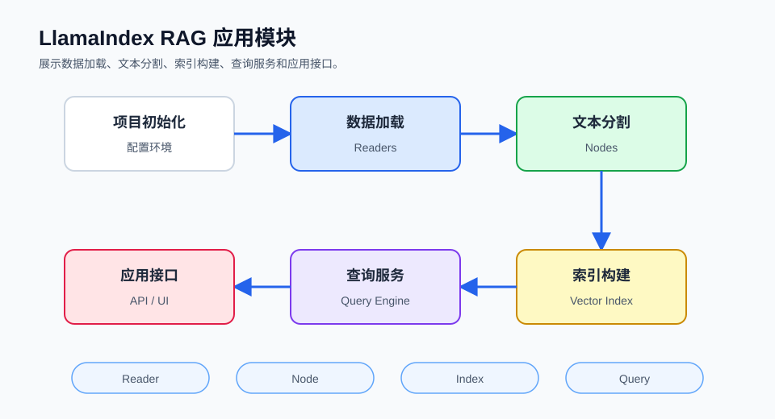

## 概述

本文将通过实战项目展示如何使用 LlamaIndex 构建完整的 RAG（检索增强生成）应用。我们将实现一个支持多种文档格式、灵活检索的智能问答系统。

这个项目按“数据加载、文本分割、索引构建、查询回答”四个模块展开。每个模块都可以单独替换，但前后传递的对象要保持一致：文档进入分割器，节点进入索引，索引再生成查询引擎。



### 项目架构

```
┌─────────────────────────────────────────────────────────────┐
│                    RAG 应用架构                              │
├─────────────────────────────────────────────────────────────┤
│                                                              │
│   ┌──────────┐   ┌──────────┐   ┌──────────┐   ┌────────┐ │
│   │  数据加载 │ → │  文本分割 │ → │  构建索引 │ → │  存储  │ │
│   └──────────┘   └──────────┘   └──────────┘   └────────┘ │
│                                                              │
│   ┌──────────┐   ┌──────────┐   ┌──────────┐   ┌────────┐ │
│   │  用户查询 │ → │  语义检索 │ → │  上下文  │ → │  生成  │ │
│   └──────────┘   └──────────┘   └──────────┘   └────────┘ │
│                                                              │
└─────────────────────────────────────────────────────────────┘
```

## 项目初始化

这一节准备运行环境和全局模型配置。后续代码都会复用这里的 `Settings` 配置，不再为每个模块单独创建上下文对象。

### 环境配置

核心包负责索引和查询，OpenAI 集成包负责调用 LLM 与嵌入模型，文件 reader 包用于读取本地资料。

```bash
pip install llama-index
pip install llama-index-llms-openai
pip install llama-index-embeddings-openai
pip install llama-index-readers-file
```

### 基本设置

`Settings` 是当前更直接的全局配置方式。只要在程序启动时设置一次，后续构建索引和查询引擎时就会默认使用这些模型。

```python
from llama_index.core import Settings
from llama_index.llms.openai import OpenAI
from llama_index.embeddings.openai import OpenAIEmbedding

Settings.llm = OpenAI(model="gpt-4o-mini")
Settings.embed_model = OpenAIEmbedding(model="text-embedding-3-small")
```

## 数据加载模块

这一节负责把资料目录转换成文档列表。加载阶段只关心“读到了什么”，不要在这里混入切分和索引逻辑。

### 加载多种文档

下面的函数返回 `documents`，后面的文本分割模块会继续使用它。`recursive=True` 适合知识库按子目录组织的情况。

```python
from llama_index.core import SimpleDirectoryReader

def load_documents(data_dir: str):
    reader = SimpleDirectoryReader(
        input_dir=data_dir,
        recursive=True,
        exclude=["*.tmp", ".git/*"]
    )
    return reader.load_data()

documents = load_documents("./data")
print(f"加载了 {len(documents)} 个文档")
```

### 自定义文档加载

当资料来自 API、数据库或临时字符串时，可以手动创建文档。元数据建议保留来源和分类，方便后面过滤。

```python
from llama_index.core import Document

custom_doc = Document(
    text="自定义文档内容",
    metadata={
        "source": "custom",
        "category": "technical",
        "version": "1.0"
    }
)
```

## 文本分割模块

这一节把文档切成节点。节点是后续检索的实际单位，所以切分策略会直接影响答案是否能找到正确上下文。

### 智能分割策略

`chunk_size` 决定节点长度，`chunk_overlap` 让相邻节点保留一小段重叠。技术文档通常可以从 512/64 开始试。

```python
from llama_index.core.node_parser import SentenceSplitter

def split_documents(documents, chunk_size=512, chunk_overlap=64):
    parser = SentenceSplitter(
        chunk_size=chunk_size,
        chunk_overlap=chunk_overlap,
        separator="\n\n"
    )
    return parser.get_nodes_from_documents(documents)

nodes = split_documents(documents)
print(f"生成了 {len(nodes)} 个节点")
```

### 按标题分割

Markdown 文档有清晰标题时，可以按标题结构切分，让检索结果更接近原文章节。

```python
from llama_index.core.node_parser import MarkdownNodeParser

parser = MarkdownNodeParser()

nodes = parser.get_nodes_from_documents(documents)
```

## 索引构建

这一节把节点组织成可检索索引。前面如果已经手动切出 `nodes`，这里直接用节点构建索引，避免再次隐式切分。

### 创建向量索引

向量索引会为节点生成嵌入向量，并保存检索所需的结构。`persist_dir` 用来指定本地持久化目录。

```python
from llama_index.core import VectorStoreIndex, StorageContext

def build_vector_index(nodes, persist_dir="./storage"):
    index = VectorStoreIndex(nodes)

    index.storage_context.persist(persist_dir=persist_dir)

    return index

index = build_vector_index(nodes)
```

### 加载已有索引

如果索引已经持久化到 `./storage`，下次启动可以直接加载，跳过文档读取、切分和嵌入。

```python
from llama_index.core import StorageContext, load_index_from_storage

def load_existing_index(persist_dir="./storage"):
    storage_context = StorageContext.from_defaults(
        persist_dir=persist_dir
    )

    index = load_index_from_storage(
        storage_context=storage_context
    )

    return index

index = load_existing_index()
```

## 查询引擎

这一节把索引变成问答接口。查询引擎会先检索相关节点，再把上下文交给模型生成答案。

### 基础查询

`similarity_top_k` 控制召回节点数量，`response_mode="compact"` 会尽量压缩上下文，适合作为默认配置。

```python
def create_query_engine(index, similarity_top_k=5):
    query_engine = index.as_query_engine(
        similarity_top_k=similarity_top_k,
        response_mode="compact"
    )
    return query_engine

query_engine = create_query_engine(index)

response = query_engine.query("你的问题")
print(response)
```

### 高级查询配置

当需要明确控制召回和过滤时，可以拆出检索器和后处理器。这样更容易分别调试“找到的节点”和“生成的回答”。

```python
from llama_index.core.query_engine import RetrieverQueryEngine
from llama_index.core.retrievers import VectorIndexRetriever
from llama_index.core.postprocessor import SimilarityPostprocessor

retriever = VectorIndexRetriever(
    index=index,
    similarity_top_k=10,
    alpha=0.5
)

postprocessor = SimilarityPostprocessor(
    similarity_cutoff=0.7
)

query_engine = RetrieverQueryEngine.from_args(
    retriever=retriever,
    node_postprocessors=[postprocessor]
)
```

## 对话式查询

这一节处理多轮对话。Chat Engine 会保存对话上下文，并在每轮对话中继续检索相关资料。

### Chat Engine

`condense_plus_context` 适合知识库聊天：它会结合历史对话改写问题，再检索当前轮需要的上下文。

```python
def create_chat_engine(index):
    chat_engine = index.as_chat_engine(
        chat_mode="condense_plus_context",
        similarity_top_k=5
    )
    return chat_engine

chat_engine = create_chat_engine(index)

response = chat_engine.chat("你好")
print(response)

response = chat_engine.chat("我刚才问了什么？")
print(response)
```

### 多轮对话

下面用连续消息模拟聊天过程。实际应用中通常由前端或服务端保存用户历史，再逐轮调用 `chat_engine.chat()`。

```python
chat_engine = index.as_chat_engine(
    chat_mode="context",
    system_prompt="你是一个有帮助的助手，基于提供的上下文回答问题。"
)

messages = [
    {"role": "user", "content": "我叫张三"},
    {"role": "assistant", "content": "你好张三，有什么可以帮助你的？"},
    {"role": "user", "content": "我的名字是什么？"}
]

for msg in messages:
    response = chat_engine.chat(msg["content"])
    print(f"{msg['role']}: {msg['content']}")
    print(f"assistant: {response}")
```

## 检索优化

这一节演示在基础向量检索之外加入补充策略。优化时先看召回节点是否正确，再决定是否使用过滤、混合检索或重排序。

### 混合检索

混合检索适合关键词很重要的资料，例如错误码、产品型号和专有名词。这里把向量检索和关键词索引组合起来。

```python
from llama_index.core import KeywordTableIndex
from llama_index.core.retrievers import QueryFusionRetriever

keyword_index = KeywordTableIndex.from_documents(documents)

hybrid_retriever = QueryFusionRetriever(
    retrievers=[
        index.as_retriever(similarity_top_k=5),
        keyword_index.as_retriever(similarity_top_k=5)
    ],
    similarity_top_k=5,
    num_queries=1,
    use_async=False
)
```

### 重排序

重排序会在多召回的候选节点中重新选择更相关的前几项，适合资料相似度较高或答案容易混入噪声的情况。

```python
from llama_index.core.postprocessor import SentenceTransformerRerank

rerank = SentenceTransformerRerank(
    top_n=5,
    model="cross-encoder/ms-marco-MiniLM-L-2-v2"
)

query_engine = index.as_query_engine(
    similarity_top_k=20,
    node_postprocessors=[rerank]
)
```

## 完整 RAG Pipeline

这一节把前面的模块合并成一个类。类内部只保存目录、索引和引擎状态，加载、索引、查询和聊天各自保持清晰职责。

### 封装为类

下面的代码包含必要导入，便于单独复制到项目中。它复用全局 `Settings`，所以不会再创建旧式上下文对象。

```python
from llama_index.core import (
    Settings,
    SimpleDirectoryReader,
    StorageContext,
    VectorStoreIndex,
    load_index_from_storage,
)
from llama_index.core.node_parser import SentenceSplitter
from llama_index.llms.openai import OpenAI
from llama_index.embeddings.openai import OpenAIEmbedding

class RAGApplication:
    def __init__(self, data_dir: str, persist_dir: str = "./storage"):
        self.data_dir = data_dir
        self.persist_dir = persist_dir
        Settings.llm = OpenAI(model="gpt-4o-mini")
        Settings.embed_model = OpenAIEmbedding(model="text-embedding-3-small")
        self.index = None
        self.query_engine = None

    def load_and_index(self):
        reader = SimpleDirectoryReader(self.data_dir)
        documents = reader.load_data()

        parser = SentenceSplitter(chunk_size=512, chunk_overlap=64)
        nodes = parser.get_nodes_from_documents(documents)

        self.index = VectorStoreIndex(nodes)

        self.index.storage_context.persist(self.persist_dir)
        return self

    def load_index(self):
        storage_context = StorageContext.from_defaults(
            persist_dir=self.persist_dir
        )
        self.index = load_index_from_storage(
            storage_context=storage_context
        )
        return self

    def query(self, question: str) -> str:
        if not self.index:
            self.load_index()

        query_engine = self.index.as_query_engine(
            similarity_top_k=5,
            response_mode="compact"
        )

        response = query_engine.query(question)
        return str(response)

    def chat(self, message: str) -> str:
        if not self.index:
            self.load_index()

        chat_engine = self.index.as_chat_engine(
            chat_mode="condense_plus_context"
        )

        response = chat_engine.chat(message)
        return str(response)

rag_app = RAGApplication("./data")
rag_app.load_and_index()

result = rag_app.query("关于某个主题的问题")
print(result)
```

## 性能优化

这一节关注调用效率。性能优化不只看模型速度，也要看是否重复构建索引、是否可以并发查询，以及召回节点是否过多。

### 批量查询

批量查询适合离线评测或一次性回答多个问题。注意这里仍然是串行调用，便于先观察稳定性。

```python
def batch_query(query_engine, questions: list):
    responses = []
    for question in questions:
        response = query_engine.query(question)
        responses.append(response)
    return responses

responses = batch_query(query_engine, ["问题1", "问题2", "问题3"])
```

### 异步处理

异步处理适合 Web 服务中同时处理多个请求。它能减少等待阻塞，但仍然要受模型服务限流影响。

```python
import asyncio

async def async_query(query_engine, question: str):
    response = await query_engine.aquery(question)
    return response

async def async_batch_query(query_engine, questions: list):
    tasks = [async_query(query_engine, q) for q in questions]
    responses = await asyncio.gather(*tasks)
    return responses
```

## 错误处理

这一节给查询调用增加最基本的重试。真实项目里还应记录问题、错误类型和请求 ID，方便排查。

```python
def safe_query(query_engine, question: str, max_retries=3):
    for attempt in range(max_retries):
        try:
            response = query_engine.query(question)
            return response
        except Exception as e:
            if attempt == max_retries - 1:
                raise e
            continue
    return "查询失败"
```

## 最佳实践

这一节把项目里的关键参数整理成选择依据。不要一次性调整所有参数，先从影响最大的切分和召回数量开始。

| 实践                 | 说明                                         |
| -------------------- | -------------------------------------------- |
| **chunk_size 优化**  | 短文档可以小一些，长文档通常从 512-1024 开始 |
| **overlap 设置**     | 保持 10-20% 的重叠，避免上下文断裂           |
| **similarity_top_k** | 漏召回时调大，噪声过多时调小                 |
| **metadata 利用**    | 用来源、分类、租户等字段做过滤和路由         |

## 总结

这一节回顾完整项目的模块关系。RAG 应用的稳定性来自清晰的数据流，而不是把所有功能塞进一个函数里。

本文实现了一个完整的 LlamaIndex RAG 应用：

| 模块         | 功能            |
| ------------ | --------------- |
| **数据加载** | 多格式文档支持  |
| **文本分割** | 智能 chunk 策略 |
| **索引构建** | 向量存储        |
| **查询引擎** | 灵活检索        |
| **对话引擎** | 多轮对话        |

容易混淆的是：文档加载只负责读资料，文本分割决定检索粒度，索引构建决定如何召回，查询引擎才负责把召回内容变成答案。把这些职责分开，后续接入向量库、评估集或权限过滤都会更稳。
