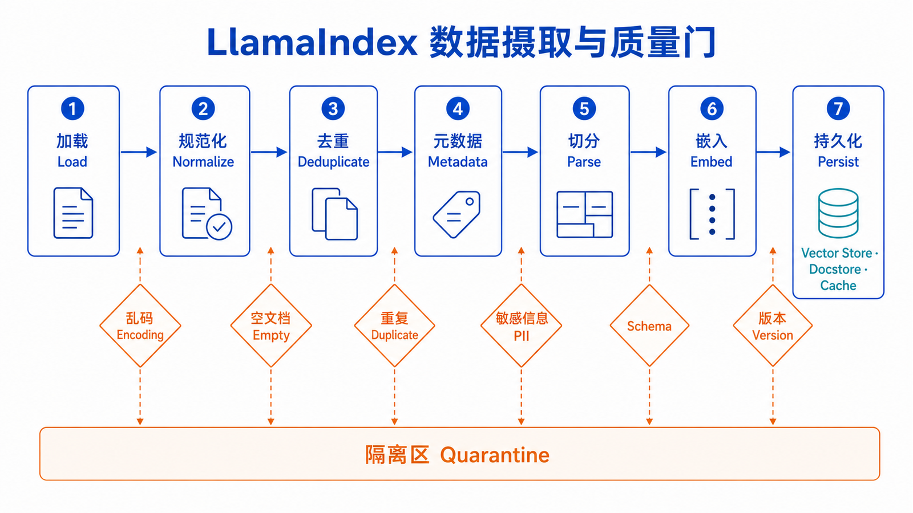
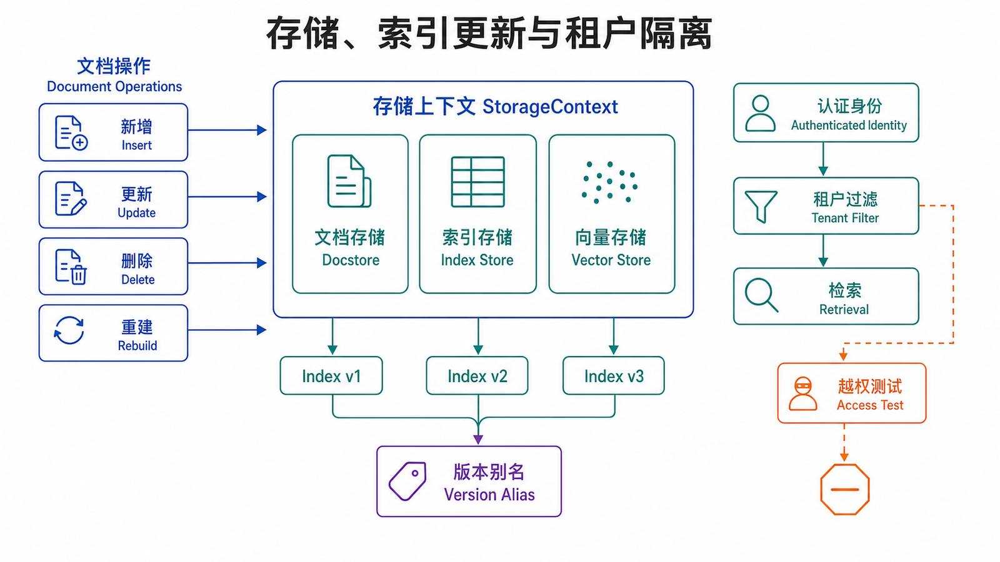

## 本篇要解决的问题

RAG 的上限通常先由数据决定，而不是由 prompt 决定。本篇沿着“加载 → 规范化 → 去重 → metadata → 切分 → embedding → 持久化”的链路，说明怎样把原始资料变成可检索、可更新、可追踪的索引。

学完后，你应该能为资料定义最小数据契约，选择 Reader 和切分策略，使用 `IngestionPipeline` 管理转换与缓存，并用 metadata 实现来源追踪和租户过滤。

### 前置知识

建议先阅读系列第 1 篇，理解 Document、Node、Index 与 QueryEngine。示例沿用 `llama-index-core==0.14.23`，OpenAI 集成版本与入门篇相同。



## 先定义数据契约

Reader 能“读到文本”不等于数据已经适合检索。进入索引前，每个 Document 至少应该回答：

- 它来自哪里，稳定 ID 是什么？
- 内容属于哪个租户、部门或权限域？
- 版本和更新时间是什么？
- 删除或替换原文时，如何定位旧 Node？
- 内容为空、乱码、重复或包含敏感信息时怎么办？

一个可操作的最小 metadata schema 可以是：

```python
from llama_index.core import Document

document = Document(
    text="企业版退款需由合同管理员提交。",
    id_="policy:refund:enterprise:v3",
    metadata={
        "source": "policies/refund-enterprise.md",
        "tenant_id": "acme",
        "department": "support",
        "version": 3,
        "updated_at": "2026-07-01",
    },
)
```

`id_` 应在同一数据域内稳定。若每次同步都生成随机 ID，系统很难判断一篇文档是新增、更新还是重复。

## Reader：只负责把来源变成 Document

### 本地文件

本地目录最适合建立 baseline。限制扩展名能避免把缓存、二进制和无关文件送入解析器。

```python
from llama_index.core import SimpleDirectoryReader

documents = SimpleDirectoryReader(
    input_dir="./data",
    required_exts=[".md", ".txt", ".pdf"],
    recursive=True,
    exclude=["*.tmp", "**/.git/**"],
).load_data()
```

`SimpleDirectoryReader` 位于 core，但 PDF、Word 等格式可能需要 `llama-index-readers-file` 及其解析依赖。生产使用前要抽样检查页眉页脚、表格、分栏和扫描 PDF，而不是只检查 `len(documents)`。

### Web 与 Notion

外部 Reader 是独立集成包：

```bash
pip install "llama-index-readers-web==0.6.0"
pip install "llama-index-readers-notion==0.5.0"
```

```python
from llama_index.readers.web import SimpleWebPageReader

documents = SimpleWebPageReader(html_to_text=True).load_data(
    ["https://example.com/handbook"]
)
```

```python
import os
from llama_index.readers.notion import NotionPageReader

reader = NotionPageReader(integration_token=os.environ["NOTION_TOKEN"])
documents = reader.load_data(page_ids=["page-id"])
```

集成类名和认证方式会随版本变化，应以对应 Reader 的官方页面为准。令牌只能来自环境变量或密钥管理服务。网页摄取还要遵守 robots、版权、登录权限和更新频率约束。

## 建立摄取质量门

### 空内容、乱码和重复

在 embedding 前过滤问题数据能节省成本，也能避免“检索不到”被误判为模型问题。

```python
import hashlib

def normalize_text(text: str) -> str:
    return "\n".join(line.strip() for line in text.splitlines() if line.strip())

def validate_documents(documents):
    clean = []
    seen_hashes = set()

    for doc in documents:
        text = normalize_text(doc.text)
        if len(text) < 20:
            continue
        if "�" in text:
            raise ValueError(f"疑似解码错误：{doc.metadata.get('file_name')}")

        digest = hashlib.sha256(text.encode("utf-8")).hexdigest()
        if digest in seen_hashes:
            continue

        seen_hashes.add(digest)
        doc.text = text
        doc.metadata["content_hash"] = digest
        clean.append(doc)

    return clean
```

哈希只能识别完全或规范化后相同的文本。近似重复、模板页眉和多版本冲突仍需要更细的规则。

### PII 与权限字段

敏感信息有两类处理：不应该进入索引的内容在摄取阶段删除或脱敏；允许检索但受权限控制的内容必须带上可验证的权限字段，并在 Retriever 层强制过滤。

不能只在最终答案里写“请不要泄露其他租户内容”。一旦越权 Node 已经进入模型上下文，提示词不是可靠的安全边界。

## 切分策略不是固定常量

在比较 splitter 之前，先固定一组代表真实业务的数据：短 FAQ、长政策、包含标题的 Markdown、至少一份 PDF，以及容易跨段落引用的边界案例。否则参数只会对手边的一篇文档有效。

### SentenceSplitter baseline

```python
from llama_index.core.node_parser import SentenceSplitter

splitter = SentenceSplitter(
    chunk_size=512,
    chunk_overlap=64,
)

nodes = splitter.get_nodes_from_documents(documents)
```

调整切分时要观察现象：

| 现象                   | 可能原因             | 调整方向                       | 验证方式                         |
| ---------------------- | -------------------- | ------------------------------ | -------------------------------- |
| 条件和结论经常分开     | chunk 太小或重叠不足 | 增大 chunk/overlap，按章节切分 | Recall@K、人工检查来源           |
| 返回片段很长且答非所问 | chunk 太大           | 缩小 chunk，保留标题 metadata  | 噪声片段比例、延迟               |
| 标题与正文失去关系     | 通用切分破坏结构     | 使用 Markdown/HTML parser      | 检查 Node metadata 和上下文      |
| 索引体积异常增加       | 重叠或重复过高       | 降低 overlap，先去重           | Node 数量、存储与 embedding 成本 |

`512/64` 是实验起点，不是行业标准。长法规、FAQ、表格和代码文档需要不同策略。

### 怎样做一次切分实验

不要先让 LLM 回答问题再凭感觉判断。切分实验可以分成四步：

1. 为 20–50 个问题标注支持答案的原文区间或期望 Node。
2. 使用同一个 embedding 模型，分别构建 256/32、512/64、768/96 等候选索引。
3. 比较 Recall@K、Node 数量、平均候选长度和 embedding 成本。
4. 人工检查失败问题，区分边界断裂、标题丢失、表格解析或语义表示问题。

假设 256 大小的 Recall@5 是 0.86，512 是 0.91，768 也是 0.91，但 768 的平均候选文本和生成延迟明显增加，那么 512 更可能是合理 baseline。反过来，如果政策例外条款经常跨越 512 的边界，仅增加 overlap 仍无法保留章节语义，就应优先采用结构解析，而不是继续放大固定窗口。

切分参数还会改变成本。若原始资料总量为 `N` 个 token，重叠比例近似为 `r`，Node 总 token 量会粗略增加到 `N / (1-r)`。20% 重叠意味着约 25% 的额外索引文本；它可能值得，也可能只是在复制噪声。

### Markdown 结构

```python
from llama_index.core.node_parser import MarkdownNodeParser

parser = MarkdownNodeParser()
nodes = parser.get_nodes_from_documents(documents)
```

标题结构能提供自然边界，但仍要检查极短章节、跨章节引用和代码块是否被不合理拆开。

## 用 IngestionPipeline 固化转换

手动调用多个函数适合解释概念；可重复的数据任务更适合显式流水线。官方 [Ingestion Pipeline 指南](https://docs.llamaindex.ai/en/stable/module_guides/loading/ingestion_pipeline/) 将 splitter、metadata extractor 和 embedding 都视为 transformations，并支持缓存和文档管理。

```python
from llama_index.core.ingestion import IngestionPipeline
from llama_index.core.node_parser import SentenceSplitter
from llama_index.core.storage.docstore import SimpleDocumentStore
from llama_index.embeddings.openai import OpenAIEmbedding

pipeline = IngestionPipeline(
    transformations=[
        SentenceSplitter(chunk_size=512, chunk_overlap=64),
        OpenAIEmbedding(model="text-embedding-3-small"),
    ],
    docstore=SimpleDocumentStore(),
)

nodes = pipeline.run(documents=documents)
pipeline.persist("./pipeline_storage")
```

`docstore` 会结合文档 ID 和内容哈希帮助识别重复或更新；持久化 cache 可避免相同输入重复执行昂贵转换。变更 splitter 或 embedding 后，转换哈希会变化，相应阶段需要重新计算。

### Pipeline 中每一层的失败语义

把转换写成流水线的另一个好处是能分别统计失败：Reader 失败表示来源不可读；规范化失败表示编码或格式异常；metadata 校验失败表示资料缺少业务字段；embedding 失败可能是限流、网络或输入长度；vector store 写入失败则涉及存储可用性。

这些失败不应统一吞掉后继续运行。若 1,000 篇文档中有 20 篇读取失败，索引“成功完成”仍可能让关键问题永远无法召回。摄取报告至少应包含：发现文档数、成功数、跳过数、重复数、失败数、生成 Node 数、embedding token 数、写入耗时和失败文件清单。

对可以重试的远程错误，应保持稳定 Document ID 并进行有上限的退避重试；对格式错误和必填 metadata 缺失，应进入隔离区等待修复，而不是反复调用模型。

## Metadata schema 如何演进

metadata 一开始很容易被当作自由字典，随后出现 `dept`、`department`、`team` 三个含义相近的字段，过滤规则就会变得不可预测。建议给 schema 建立最小约束：

| 字段         | 类型           | 是否必填 | 用途           | 变更策略                       |
| ------------ | -------------- | -------- | -------------- | ------------------------------ |
| `source`     | string         | 是       | 展示与追踪来源 | 路径变化时保留稳定 Document ID |
| `tenant_id`  | string         | 是       | 权限过滤       | 不允许由最终用户覆盖           |
| `version`    | integer/string | 是       | 判断新旧资料   | 明确定义排序规则               |
| `updated_at` | ISO datetime   | 是       | 新鲜度与审计   | 统一时区                       |
| `category`   | enum           | 否       | 路由或过滤     | 新枚举向后兼容                 |

更改字段名或类型会影响已持久化 Node 和查询过滤。可以为索引记录 `schema_version`，迁移时构建新索引并做双读验证，而不是在旧索引上混合两套字段。对于只用于展示、不会参与 embedding 的字段，还应确认框架和后端是否把它们注入模型上下文；无关 metadata 过多会增加 token 并泄露内部信息。

### 标题、页码与父子关系

来源只写文件名通常不够。长 PDF 适合保留页码，Markdown 适合保留标题路径，产品手册适合保留章节 ID。读者点击来源时需要定位到支持答案的位置，评测集也需要比“文件命中”更细的依据。

若采用父子检索，小 Node 用于精确匹配，父 Node 用于提供完整上下文，必须明确哪个 ID 参与评测、哪个文本交给 LLM。不要用几个自定义 metadata 指针就声称已经建立原生节点关系；应验证 Retriever 和后处理器确实消费了这些关系。

## Index 与 StorageContext



### 本地持久化与恢复

```python
from llama_index.core import StorageContext, VectorStoreIndex

index = VectorStoreIndex(nodes)
index.storage_context.persist(persist_dir="./storage")
```

```python
from llama_index.core import StorageContext, load_index_from_storage

storage_context = StorageContext.from_defaults(persist_dir="./storage")
index = load_index_from_storage(storage_context)
```

默认本地存储适合单机实验。多进程写入、备份、权限和大规模向量搜索通常需要外部后端，并应根据其 metadata filter、hybrid search、delete 和并发能力选择。

### 增量插入、更新和删除

```python
# 新增稳定 doc_id 的文档
index.insert(new_document)

# 用相同 doc_id 的新内容替换旧文档
index.update_ref_doc(updated_document)

# 按来源文档 ID 删除其 Node
index.delete_ref_doc(
    ref_doc_id="policy:refund:enterprise:v3",
    delete_from_docstore=True,
)
```

决定“增量更新还是重建”的关键不是数据量一个指标：embedding 或切分策略整体变化时应重建；少量内容新增或原文替换可以增量处理。更新后要重新跑回归问题，确认旧答案和新答案都符合预期。

### 给索引发布版本

生产环境不应直接覆盖唯一索引目录。更稳妥的方式是为每次构建生成不可变版本，例如 `refund-index-20260712-01`，并保存以下清单：资料快照 ID、schema 版本、splitter 配置、embedding 模型、代码提交和构建统计。

新版本先运行离线评测和越权测试，再由一个逻辑别名从旧版本切到新版本。若错误率上升，可以快速把别名切回旧索引。这个过程与应用发布类似：索引本身也是需要版本、验收和回滚的数据产品。

增量更新同样要考虑一致性。若先删除旧 Node、后写入新 Node，中间失败会造成资料暂时消失；若先写新 Node、再删旧 Node，可能短暂返回两个版本。具体方案取决于 vector store 是否支持事务、namespace 或原子 alias 切换。没有这些能力时，构建新索引并整体切换通常更容易推理。

## 选择存储后端时看能力矩阵

“支持向量搜索”只满足最小条件。结合本文场景，还应逐项确认：

- metadata filter 是否支持 AND/OR、范围、数组和缺失字段语义；
- hybrid search 的稀疏索引、权重和排序融合怎样配置；
- delete 是否能按 `ref_doc_id` 清理所有关联 Node；
- upsert 是否幂等，失败重试会不会产生重复记录；
- 是否保存正文，还是只保存向量与外部文档引用；
- 备份、恢复、租户 namespace、配额、监控和成本模型；
- SDK 与 LlamaIndex 集成包的版本兼容范围。

做技术选型时，用一小批真实数据运行插入、过滤、更新、删除和恢复，而不是只跑厂商的相似度搜索示例。尤其要验证过滤在检索前真正生效，以及删除后旧内容不会从缓存、docstore 或其他索引副本继续出现。

## 计算一次摄取的成本与容量

索引成本至少由四部分组成：解析、embedding、向量存储和后续重建。可以在构建报告中记录原始字符/token、Node 数、平均 Node token、重复率、embedding 请求数、向量维度和索引文件大小。

例如 100,000 个 Node、每个 1,536 维 float32 向量，仅原始向量就约为 `100000 × 1536 × 4 ≈ 586 MiB`，还未包含索引结构、metadata、正文和副本。更高维不自动等于更高检索质量，却会直接影响存储、网络和重建时间。容量规划应以真实后端的压缩与索引开销为准。

缓存能降低重复转换成本，但缓存键必须包含会影响结果的配置。若只按文档内容缓存 embedding，而模型版本已经变化，复用旧向量会让同一索引混入不同向量空间。

## PDF、表格和代码不是普通段落

通用 Reader 往往能从 PDF 提取字符，却不保证阅读顺序。双栏论文可能把左右两栏交错，表格可能只剩按行展开的数字，扫描件可能完全没有文本层。验收时应为每种格式定义抽样规则：随机选页核对原文，统计空页和异常短页，检查标题、页码、列表与表格是否保留。

表格问答尤其需要关注“表头—单元格”关系。如果切分后只剩“3 天、7 天、30 天”，Retriever 无法知道数字分别属于哪个产品。可以在转换阶段把每行展开为带表头的文本，例如“产品=企业版；退款期=3 天；提交人=合同管理员”，同时在 metadata 保留原表名、行号和页码。

代码文档则需要尽量保持函数、注释和示例的局部完整。仅按 token 定长切分可能把函数签名与异常说明分开。可先按 Markdown 标题与代码围栏解析，再对过长章节做二次切分。无论采用哪种 parser，最终标准仍是代表性问题能否召回完整证据，而不是 parser 名称听起来是否高级。

## 用一次政策更新串起完整流程

假设 `refund-policy.md` 的企业版期限从 3 天改为 5 天。一个可审计的更新过程如下：

1. 同步任务读取新文件，保持原 Document ID，例如 `policy:refund:enterprise`，更新 `version` 和 `updated_at`。
2. 规范化后计算新 `content_hash`，确认它与已存版本不同。
3. 使用当前 splitter 与 embedding 重新生成该 Document 的 Node，并检查必填 metadata。
4. 在候选索引版本中执行 update/upsert，确认旧 Node 不再参与查询。
5. 运行“企业版期限”“完成四天还能否申请”“旧期限是多少”等回归问题。
6. 检查答案引用新版本，且其他产品线答案没有变化。
7. 发布索引别名；保留旧版本和构建报告，以便回滚。

仅调用 `index.insert(new_document)` 可能让 3 天和 5 天两个版本同时存在。LLM 看到冲突上下文后可能任选一个或含糊回答，因此更新语义必须明确是追加、替换还是保留历史。若业务需要历史查询，旧版本应带有效时间并通过问题中的时间条件路由，而不是和当前政策无条件混在同一个候选集合里。

### 数据新鲜度也要成为指标

索引质量不只看检索相关性，还要看从来源变化到可查询的延迟。可以记录 `source_updated_at`、`ingested_at` 和 `index_published_at`，计算摄取延迟及超时文档数量。对于每日更新的政策库，24 小时延迟可能可以接受；对于库存或事故通知，分钟级延迟都可能过长。

资料删除同样需要服务级目标。源系统删除敏感文档后，向量、Node 正文、docstore、cache、备份和搜索副本多久清理完成，应有明确流程和验证，而不是只调用一个 delete API 就认为所有副本都消失。

## 数据质量问题如何映射到线上症状

| 线上症状             | 数据侧可能原因                 | 先验证什么                  |
| -------------------- | ------------------------------ | --------------------------- |
| 答案引用不存在的页码 | PDF 页码 metadata 丢失或错位   | 对照原 PDF 抽样 Node        |
| 新政策上线后仍答旧值 | 旧 Node 未删除、索引别名未切换 | 按 Document ID 搜索所有版本 |
| 某类文件从不命中     | Reader 失败或正文为空          | 摄取失败清单、字符长度分布  |
| 结果充满重复段落     | 页眉、模板或多版本未去重       | content hash、近似重复抽样  |
| 只有部分租户越权     | metadata 缺失或字段类型不一致  | 缺失率、过滤后候选审计      |
| 召回文本语序混乱     | 分栏或 OCR 解析错误            | 原页与 Node 对照            |

这张表的意义是建立证据链。线上出现错误时，先找到产生该答案的 Node，再沿 `ref_doc_id` 回到 Document 和原始来源；只有这条 lineage 存在，团队才能判断是来源错误、解析错误、索引过期还是查询逻辑错误。

数据验收负责人还应能回答：本次构建比上一版本新增、更新、删除了哪些 Document，失败是否集中在某一种来源，以及任何缺失是否会阻断发布。把这些差异写入机器可读报告，才能在资料规模增长后持续审计。

报告还应长期保存并绑定索引版本，避免发布后失去证据。

## 多租户隔离必须发生在检索层

metadata 字段本身不提供隔离。每次查询都必须从可信身份映射出 `tenant_id`，并把它作为不可由用户覆盖的过滤条件。

```python
from llama_index.core.vector_stores import ExactMatchFilter, MetadataFilters

def tenant_retriever(index, authenticated_tenant_id: str):
    filters = MetadataFilters(
        filters=[
            ExactMatchFilter(
                key="tenant_id",
                value=authenticated_tenant_id,
            )
        ]
    )
    return index.as_retriever(
        similarity_top_k=5,
        filters=filters,
    )

nodes = tenant_retriever(index, "acme").retrieve("退款政策")
assert all(item.node.metadata["tenant_id"] == "acme" for item in nodes)
```

向量后端必须真正支持所需过滤语义。验收时至少加入一条“租户 A 使用租户 B 的专有术语提问”的负向测试，并确认返回结果为空或只包含 A 的内容。

## 数据链路验收清单

索引构建成功只说明程序没有抛异常。上线前还应检查：

- 抽样 Document 正文无乱码，来源和稳定 ID 可追踪。
- 空文档、重复文档、过期版本和 PII 有明确处理结果。
- Node 长度分布合理，标题、页码和租户字段没有丢失。
- 索引持久化后能在新进程恢复，结果与构建前一致。
- 新增、更新、删除各有一条自动回归用例。
- 每个租户过滤都经过正向和越权负向测试。

## 常见误区

- Reader 读到文本，不代表解析质量合格。
- overlap 增大能缓解边界问题，也会扩大索引与重复上下文。
- metadata 只有在查询时强制使用，才构成权限控制的一部分。
- 外部 vector store 不会自动解决错误切分、重复数据和过期内容。
- 更换 embedding 后只嵌入新增文档，会让新旧向量空间混用。

## 本篇自检

1. 为什么稳定的 Document ID 对增量更新很重要？
2. 什么情况下应重建索引，而不是继续 `insert()`？
3. 为文档添加 `tenant_id` 后，为什么仍不能宣称完成租户隔离？

<details>
<summary>查看答案</summary>

1. 系统需要用稳定 ID 识别同一资料的重复、更新和删除，并定位它产生的 Node。
2. embedding、切分策略或 metadata schema 发生全局变化时，应让全部数据使用一致的新表示，通常需要重建。
3. 字段只是数据；还必须从可信身份生成不可绕过的检索过滤，并验证后端过滤语义和越权负向用例。

</details>

## 小结

可靠索引来自可重复的数据工程：先定义契约和质量门，再切分、嵌入、持久化，并为更新与权限留下稳定标识。下一篇转向在线查询，建立从候选召回到带来源答案的可测量漏斗。

**上一篇：** [LlamaIndex 入门指南：核心概念与架构](/posts/llamaindex-getting-started/)

**下一篇：** [LlamaIndex 查询与检索机制](/posts/llamaindex-query-retrieval/)

## 参考资料

- [LlamaIndex：Loading Data](https://docs.llamaindex.ai/en/stable/module_guides/loading/)
- [LlamaIndex：Ingestion Pipeline](https://docs.llamaindex.ai/en/stable/module_guides/loading/ingestion_pipeline/)
- [LlamaIndex：Vector Stores](https://docs.llamaindex.ai/en/stable/module_guides/storing/vector_stores/)
- [LlamaIndex：Metadata Filters](https://docs.llamaindex.ai/en/stable/examples/vector_stores/metadata_filter/)
