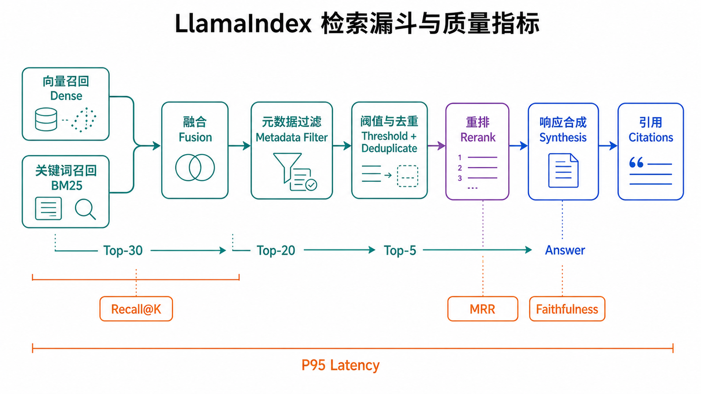
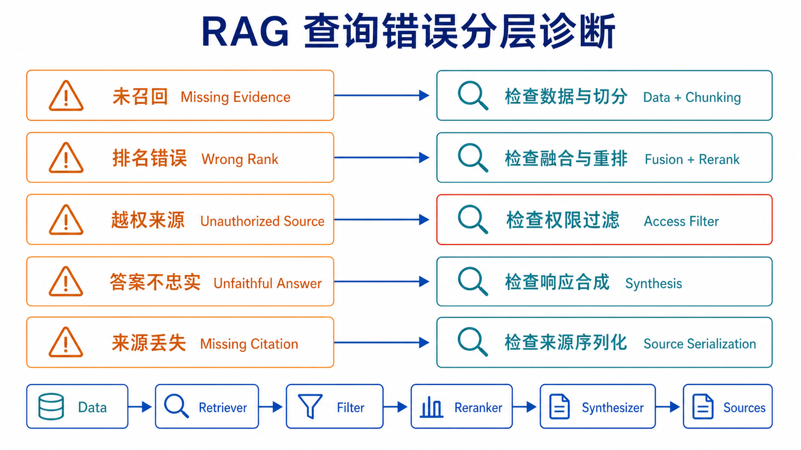

## 本篇要解决的问题

当 RAG 回答错误时，直接修改 prompt 往往是在盲调。一次查询至少包含候选召回、metadata 过滤、阈值/去重、重排、响应合成和来源展示；任何一层都可能让答案失败。

本篇把查询过程拆成可观察的漏斗，并用 Recall@K、MRR、Faithfulness 和 P95 latency 建立优化闭环。学完后，你应该能判断问题出在“没找到”“排序错”“生成不忠实”还是“来源没有展示”。

### 前置知识

建议先完成前两篇，准备一个带稳定 Node ID 和来源 metadata 的 `VectorStoreIndex`。示例按 `llama-index-core==0.14.23` 验证；混合检索与重排使用独立集成包。



## 先建立可观察的 baseline

QueryEngine 适合业务调用，Retriever 更适合调试。优化前先固定一批问题和期望来源，直接查看 Retriever 的输出。

```python
retriever = index.as_retriever(similarity_top_k=5)
results = retriever.retrieve("企业版退款期限是什么？")

for rank, item in enumerate(results, start=1):
    print(f"[{rank}] score={item.score}")
    print(f"id={item.node.node_id}")
    print(f"source={item.node.metadata.get('source')}")
    print(item.node.get_content()[:200])
```

至少记录 Node ID、分数、来源和片段内容。只打印最终答案，会把检索与生成两个问题混在一起。

### 分数不是跨系统通用概率

`item.score` 的范围和含义取决于 embedding、相似度算法、vector store 和后处理器。`0.7` 在一个系统里可用，不代表换模型或后端后仍是合理阈值。阈值应从标注数据的分数分布和错误代价中确定。

## 候选召回：先尽量找到正确资料

### 向量检索

向量检索适合“表达不同但语义相近”的问题。`similarity_top_k` 控制候选数量：太小会漏召回，太大则增加噪声、重排成本和上下文长度。

```python
vector_retriever = index.as_retriever(similarity_top_k=10)
```

调整 `top_k` 时不要只观察一个答案。用固定评测集比较 Recall@K 和延迟，确认增大的候选集合确实找回了更多期望 Node。

### metadata 过滤

权限、租户、时间和产品线等硬约束应在检索层过滤，而不是依赖相似度或 prompt。

```python
from llama_index.core.vector_stores import ExactMatchFilter, MetadataFilters

filters = MetadataFilters(
    filters=[
        ExactMatchFilter(key="tenant_id", value="acme"),
        ExactMatchFilter(key="department", value="support"),
    ]
)

retriever = index.as_retriever(
    similarity_top_k=10,
    filters=filters,
)
```

先过滤再做语义搜索，还是先搜索再过滤，取决于 vector store 实现。必须确认目标后端支持相同过滤语义，并用越权负向用例验证。

### 混合检索

纯向量检索可能错过错误码、产品型号、缩写和精确条款号。混合检索把 dense semantic search 与 sparse/BM25 结果融合。

```bash
pip install "llama-index-retrievers-bm25==0.7.1"
```

```python
from llama_index.core.retrievers import QueryFusionRetriever
from llama_index.retrievers.bm25 import BM25Retriever

vector_retriever = index.as_retriever(similarity_top_k=10)
bm25_retriever = BM25Retriever.from_defaults(
    nodes=nodes,
    similarity_top_k=10,
)

hybrid_retriever = QueryFusionRetriever(
    retrievers=[vector_retriever, bm25_retriever],
    similarity_top_k=10,
    num_queries=1,
    mode="reciprocal_rerank",
    use_async=False,
)
```

这里的 BM25 需要可访问的 Node 集合。生产系统若使用支持原生 hybrid search 的 vector store，应优先遵循该后端的查询模式和权重语义，而不是假定 `alpha=0.5` 在所有后端都有效。

### 用一个排序例子理解融合

假设问题包含错误码 `E1042`。向量检索把“登录失败的通用排查”排第 1，把真正包含 `E1042` 的节点排第 5；BM25 因为精确命中编号，把它排第 1。Reciprocal Rank Fusion 不要求两种分数处在同一数值范围，而根据各自排名累加贡献，因此精确节点有机会被提升。

这也说明混合检索不是简单把两个相似度相加。dense cosine score 与 BM25 score 的尺度不同，直接相加会让某一路主导。融合模式、候选深度和去重规则都需要进入评测配置。对于同一 Node 被两个 Retriever 返回的情况，还要按 Node ID 或稳定来源去重，避免它重复占用上下文。

选择混合检索的信号包括：包含编号的问题 Hit Rate 明显低于自然语言问题；用户常用缩写而文档写全称；实体名称相似但不能互换。若主要失败来自错误解析或权限过滤，增加 BM25 不会解决根因。

## 过滤、去重与重排

召回阶段追求“不漏掉”，后处理阶段追求“把最有用的上下文排在前面”。

### 相似度阈值

```python
from llama_index.core.postprocessor import SimilarityPostprocessor

similarity_filter = SimilarityPostprocessor(similarity_cutoff=0.62)
```

阈值过高会让系统在资料存在时返回空上下文；过低会把无关片段送给 LLM。应在开发集上观察 precision/recall 取舍，并为“无足够依据”设计明确回答。

### 关键词约束

`KeywordNodePostprocessor` 的参数是 `required_keywords` 和 `exclude_keywords`，不是泛化的 `keywords`。

```python
from llama_index.core.postprocessor import KeywordNodePostprocessor

keyword_filter = KeywordNodePostprocessor(
    required_keywords=["退款"],
    exclude_keywords=["草案"],
)
```

关键词约束适合明确业务规则，不适合替代 BM25 或语义检索。过强规则也会误伤同义表达。

### Cross-encoder 重排

```bash
pip install "llama-index-postprocessor-sbert-rerank==0.5.0"
```

```python
from llama_index.postprocessor.sbert_rerank import SentenceTransformerRerank

reranker = SentenceTransformerRerank(
    model="cross-encoder/ms-marco-MiniLM-L-6-v2",
    top_n=5,
)
```

重排器会同时查看 Query 与候选文本，通常比单独向量相似度更精细，但会增加延迟。合理流程是先召回 10–30 个候选，再保留较少的上下文；具体数量由 MRR、Faithfulness 和 P95 latency 决定。

### MetadataReplacement 不是 metadata filter

`MetadataReplacementPostProcessor` 会用指定 metadata 字段替换 Node 送给 LLM 的内容。官方示例常把它与 `SentenceWindowNodeParser` 组合：用单句做精细检索，再把相邻句窗口作为生成上下文。

```python
from llama_index.core.node_parser import SentenceWindowNodeParser
from llama_index.core.postprocessor import MetadataReplacementPostProcessor

parser = SentenceWindowNodeParser.from_defaults(
    window_size=3,
    window_metadata_key="window",
    original_text_metadata_key="original_text",
)

window_postprocessor = MetadataReplacementPostProcessor(
    target_metadata_key="window"
)
```

如果 Node 没有 `window` 字段，这段后处理不会凭空生成窗口。它解决的是“检索粒度小、生成上下文大”，不是租户、类别或时间过滤。

### 后处理器的顺序会改变结果

多个 postprocessor 按顺序消费前一步的结果。通常先执行硬约束和便宜操作，再执行昂贵重排，最后裁剪到模型实际需要的数量：

```text
metadata filter → 去重 → 基础阈值 → rerank → top-n → context replacement
```

如果先对 100 个候选做 cross-encoder 重排，再删除无权限或重复节点，会浪费延迟和计算；如果在重排前设置过高相似度阈值，真正相关但向量分数偏低的节点永远没有被纠正排序的机会。最佳顺序仍取决于后端是否已经在检索前完成 filter，以及每一步对分数和文本做了什么。

调试时应保存每一层的候选快照：Node ID、旧排名、新排名、被删除原因和最终进入上下文的文本。没有这些记录，只能看到“加了 reranker 以后答案变了”，却无法解释是哪条证据被提升或丢弃。

## Response Synthesizer：把上下文变成答案

```python
query_engine = index.as_query_engine(
    similarity_top_k=20,
    node_postprocessors=[similarity_filter, reranker],
    response_mode="compact",
)

response = query_engine.query("企业版退款需要谁提交？")
```

常见模式的取舍：

| 模式               | 处理方式               | 适用情形          | 风险                               |
| ------------------ | ---------------------- | ----------------- | ---------------------------------- |
| `compact`          | 尽量把文本装入较少调用 | 常规问答 baseline | 上下文过长仍可能拆批               |
| `refine`           | 逐批读取并修订答案     | 多片段逐步综合    | 调用多、延迟高，早期答案会影响后续 |
| `tree_summarize`   | 分层归纳再合并         | 大量材料总结      | 不适合精确定位单条事实             |
| `simple_summarize` | 截断到单次上下文后总结 | 快速、低成本摘要  | 可能丢失超出窗口的信息             |

响应模式不会修复错误召回。先确认相关 Node 在候选中，再比较合成方式。

## 来源引用：使用 source_nodes

`response.metadata` 可能提供附加信息，但来源调试的直接入口是 `response.source_nodes`。

```python
def serialize_response(response):
    return {
        "answer": str(response),
        "sources": [
            {
                "node_id": item.node.node_id,
                "score": item.score,
                "source": item.node.metadata.get("source"),
                "text": item.node.get_content()[:300],
            }
            for item in response.source_nodes
        ],
    }
```

展示来源时要区分“被检索到”与“确实支持答案”。引用格式化不能把所有候选都包装成证据；可以通过 rerank、答案—证据对齐或人工抽样检查减少虚假引用。

## Chat Engine：查询改写与记忆边界

`condense_plus_context` 会根据历史对话把当前问题改写成独立问题，再检索上下文。它适合“这个政策呢？”之类依赖上文的追问。

```python
chat_engine = index.as_chat_engine(
    chat_mode="condense_plus_context",
    similarity_top_k=5,
)

print(chat_engine.chat("企业版退款期限是什么？"))
print(chat_engine.chat("由谁提交？"))
```

两次调用必须复用同一个 `chat_engine` 实例，才会延续该实例的会话状态。Web 服务还要按用户或会话隔离实例/内存；不能把全局 Chat Engine 共享给所有用户。重启后是否保留历史，则取决于你是否实现独立持久化。

### 查询改写也需要观察

多轮检索常先把“它的期限呢？”改写成“企业版退款申请的期限是什么？”。改写正确会提高检索，改写错误则会把问题带向完全不同的实体。线上只记录最终答案不足以诊断这类问题；应在脱敏后记录或采样：原始输入、独立问题、召回 Node ID 和最终来源。

对话历史也不是越长越好。太长会增加 token、延迟和错误指代；摘要记忆会压缩成本，却可能丢失精确约束。应为会话设置 token 或轮数上限，并区分“用于交流连贯性的历史”与“必须由知识库重新检索的事实”。用户上一轮说过某个数字，不代表它已经成为可信知识来源。

### 为无依据问题设计拒答

如果最高候选都低相关，系统应返回“当前资料不足”而不是强迫 LLM 组织确定答案。无依据策略可以结合阈值、候选数量、来源类型和回答后的 Faithfulness 检查，但不能只依赖一个固定分数。

评测集中要加入三类负向问题：知识库完全没有答案；问题属于其他租户；问题包含错误前提。期望行为可能是澄清、拒答或只陈述已知事实。若评测集只有可回答问题，调高召回和生成积极性会看似提升成功率，却让幻觉率失控。

## 用指标驱动优化



### 检索指标

为每个问题标注一个或多个期望 Node ID：

- **Recall@K**：前 K 个结果覆盖了多少期望 Node。
- **MRR**：第一个相关 Node 排名的倒数；越靠前越好。
- **Hit Rate**：前 K 个结果是否至少命中一个期望 Node。

LlamaIndex 的 `RetrieverEvaluator` 可直接计算 MRR 与 Hit Rate：

```python
from llama_index.core.evaluation import RetrieverEvaluator

evaluator = RetrieverEvaluator.from_metric_names(
    ["mrr", "hit_rate"],
    retriever=retriever,
)

result = evaluator.evaluate(
    query="企业版退款期限是什么？",
    expected_ids=["expected-node-id"],
)
print(result.metric_vals_dict)
```

官方 [Evaluating 指南](https://docs.llamaindex.ai/en/stable/understanding/evaluating/evaluating/) 强调应分别评估 retrieval 与 response，避免一个总分掩盖故障层。

### 怎样建立评测集

每条记录至少包含 `query`、`expected_node_ids`、可选的 reference answer、租户和场景标签。Node ID 必须来自稳定切分或由文档 ID 加段落标识生成，否则每次重建后标注都会失效。

评测问题不能全部从原文标题改写。应覆盖用户真实表达、缩写、错误码、跨段落条件、追问、无答案和越权问题。把数据分成开发集与回归集：开发集用于调 `top_k`、融合和 rerank；回归集只在方案确定后验证，避免对一小批问题过拟合。

还要按切片观察指标。总 Recall@5 为 0.90，可能掩盖“错误码问题只有 0.55”“中文长问句只有 0.60”。常见切片包括来源类型、语言、文档长度、是否含实体编号、租户和新旧资料。只有知道哪类问题失败，团队才知道应该修 Reader、chunk、embedding 还是 Retriever。

离线期望 Node 也可能不完整。Retriever 找到另一段同样能支持答案的内容时，自动指标会判错。因此要定期抽查 false positive，更新标注，并把“来源相关”和“来源足以支持答案”分成两个判断。

### 用数字理解 Recall@K 与 MRR

假设某个问题有两个期望 Node：A 和 B。Retriever 前 5 名为 `[X, A, Y, Z, B]`，那么 Recall@5 为 `2/2=1`，说明两个期望来源都进入候选；第一个相关结果 A 排第 2，倒数排名为 `1/2=0.5`。若另一个配置返回 `[A, X, Y, Z, W]`，MRR 提升到 1，但 Recall@5 降为 `1/2=0.5`。

这两个配置哪个更好取决于任务。只需一条证据的事实问答可能更看重首个相关结果靠前；需要综合多个条款的问题更看重覆盖率。评测集应标记问题类型，避免用单一指标给所有场景排序。

Precision@K 也有价值：前 K 个结果中相关 Node 的比例。扩大 `top_k` 往往提升 Recall、降低 Precision；reranker 的目标通常是保持召回覆盖的同时，把相关节点集中到较小的最终上下文。最终送入 LLM 的 top-n 应单独计算指标，不能只报告初始候选的漂亮结果。

### 生成与系统指标

- **Faithfulness**：答案中的陈述是否得到检索上下文支持。
- **P95 latency**：95% 请求在多长时间内完成，避免平均值掩盖长尾。
- **无依据回答率**：没有支持证据却给出确定答案的比例。
- **成本护栏**：每次查询的 embedding、rerank 与 LLM 调用成本。

Faithfulness 可能依赖 LLM evaluator，因此要固定评审模型和提示词，并抽样人工复核。P95 latency 应按相同负载与缓存条件比较。

### 给查询链路分配延迟预算

只测总耗时很难定位优化点。可以把一次请求拆成：查询 embedding、dense/sparse retrieval、metadata filter、rerank、LLM 首 token、完整生成和来源格式化。假设目标 P95 为 3 秒，可以先给 Retriever 300 ms、rerank 400 ms、LLM 首 token 1.5 秒，其余留给网络与序列化；实际数值由产品体验和基础设施决定。

当 P95 超标时，先看哪一段长尾，而不是盲目缩短答案。缓存查询 embedding、减少 rerank 候选、并行独立 Retriever、设置上限和超时都可能有效，但每项优化都要重新检查 Recall、MRR 与 Faithfulness。更快却漏掉关键资料不是成功。

流式输出能改善“用户等待感”，但不会降低完整生成耗时，也不能掩盖检索阶段的长停顿。应同时记录 time-to-first-token 和 total latency。

## 一次可重复的调优顺序

为了避免同时改变多个旋钮，可以按以下顺序实验：

1. 固定 LLM 与 prompt，只评估 Retriever；先修数据解析和 metadata。
2. 比较 chunk 策略与 embedding，选择 Recall/成本合理的 baseline。
3. 在 baseline 上增加 BM25 或原生 hybrid，观察编号与实体切片。
4. 固定候选集合，比较阈值和 reranker 对 MRR、P95 的影响。
5. 确认最终上下文后，再比较 response mode、prompt 和模型。
6. 最后执行 Faithfulness、拒答、越权和端到端延迟回归。

每轮只改变一个主要因素，并记录索引版本、查询配置和评测结果。否则“换 embedding + 改 chunk + 加 rerank + 改 prompt”即使总分上升，也无法知道哪个变化真正有效，更无法安全回滚。

## 端到端案例：错误码问题为什么答错

假设用户问：“部署后出现 E1042，企业版怎样处理？”系统回答了一段通用网络建议，且没有引用错误码手册。

第一步查看 `source_nodes`，发现 Top-5 都是“连接失败”通用文档，说明错误发生在生成之前。检查原数据后确认 E1042 手册已被正确解析，Node 中也包含完整编号，因此排除 Reader 和切分问题。

第二步分别运行向量 Retriever 与 BM25。向量检索把手册排第 12，BM25 排第 1，说明精确编号在当前 embedding 空间中信号不足。加入融合后，手册进入第 2；再使用 cross-encoder 重排，它被提升到第 1。此时 Hit Rate@5 和 MRR 都提高，但 P95 增加 280 ms。

第三步检查最终上下文，发现手册同时包含普通版和企业版步骤。给 Document 增加 `edition` metadata，并在已认证产品版本明确时过滤，避免 LLM 混合两个流程。新的回答引用正确章节，Faithfulness 通过，延迟仍在预算内。

这个案例展示了为什么不能直接改 prompt：问题依次涉及精确词召回、排序和业务过滤。每一步都有观察证据，也能做单独回滚。

## 查询变换什么时候有帮助

用户问题可能太短、包含指代或混入无关叙述。查询改写可以补全实体，Multi-query 可以用多个表达提高召回，HyDE 等方法可以生成假设性答案再做 embedding。但每种变换都会增加调用、延迟和语义漂移风险。

评估查询变换时应同时保存原 Query 与变换后 Query。如果“它支持多久？”被错误改写成另一产品，后续 Retriever 再准确也只是在回答错误问题。对错误码、合同编号等精确 token，改写还可能主动删掉最有区分度的信息；这类 Query 更适合保留原文并交给 sparse 分支。

可以把变换限制在明确场景：只有多轮指代才做 condense；只有首轮召回置信度低才尝试 query expansion；所有变体仍强制使用相同租户与权限过滤。不要让 LLM 生成的查询决定安全边界。

## Context 组装同样会影响忠实度

最终候选顺序、标题、来源标签和片段分隔方式都会影响模型如何使用证据。相互矛盾的新旧政策同时出现时，应先按版本过滤或显式标注有效期；仅把“最新的放前面”不能保证旧值不被引用。

对于多个来源，可以给每段上下文稳定引用 ID，例如 `[S1]`、`[S2]`，要求答案在事实后标注引用，并在返回前校验引用 ID 确实存在。引用校验只能防止伪造编号，不能证明陈述被对应片段支持，因此仍需 Faithfulness 或自然语言蕴含检查。

Context 太长也会降低效果。相关 Node 已经排在前面时，继续添加大量边缘候选可能造成“lost in the middle”、成本增加和指令污染。优化目标不是塞满上下文窗口，而是用足够少、足够相关且权限正确的证据支持回答。

因此每次调优都要同时看候选覆盖、最终上下文质量和生成结果，不能只报告其中一层。

## 故障定位顺序

| 症状                   | 先检查                            | 常见修复                                   |
| ---------------------- | --------------------------------- | ------------------------------------------ |
| 正确资料完全没出现     | Reader、切分、embedding、Recall@K | 修数据、调整 chunk、换 embedding、增大候选 |
| 正确资料出现但排名低   | 融合与 rerank、MRR                | BM25/hybrid、重排、查询改写                |
| 其他租户资料出现       | metadata 与 Retriever filter      | 强制身份过滤、后端越权测试                 |
| 来源正确但答案错误     | synthesis、prompt、Faithfulness   | 改响应模式、约束回答、返回无依据状态       |
| 答案正确但没有可用引用 | source serialization              | 保留 Node ID、来源、页码与支持片段         |
| 平均很快但偶发极慢     | P95、外部调用和候选量             | 超时、缓存、缩小候选、异步与限流           |

## 本篇自检

1. 为什么 `similarity_top_k` 不能只根据一个问题调节？
2. MetadataReplacement 与 metadata filter 的区别是什么？
3. Recall@K 很高但答案仍不忠实时，下一步应检查哪一层？

<details>
<summary>查看答案</summary>

1. 单个问题不能代表数据分布；增大 K 也会改变噪声、延迟和成本，应在固定评测集上比较。
2. filter 决定哪些 Node 可以进入候选；MetadataReplacement 用 metadata 中的字段替换送给 LLM 的 Node 内容。
3. 检查重排后的实际上下文、响应合成模式、提示约束和 Faithfulness；高召回只说明相关资料进入候选集合。

</details>

## 小结

检索优化不是围绕 prompt 的单点调参，而是一个可测量漏斗：先保证候选召回，再过滤和重排，最后评估答案忠实度、来源与延迟。下一篇把这些组件装进一个可运行的小项目，并补齐会话、错误处理和验收测试。

**上一篇：** [LlamaIndex 数据连接与索引构建](/posts/llamaindex-data-connectors/)

**下一篇：** [LlamaIndex 实战：构建 RAG 应用](/posts/llamaindex-rag-pratice/)

## 参考资料

- [LlamaIndex：Retriever Modes](https://docs.llamaindex.ai/en/stable/module_guides/querying/retriever/retriever_modes/)
- [LlamaIndex：Node Postprocessors](https://docs.llamaindex.ai/en/stable/module_guides/querying/node_postprocessors/)
- [LlamaIndex：Metadata Replacement + Sentence Window](https://docs.llamaindex.ai/en/stable/examples/node_postprocessor/MetadataReplacementDemo/)
- [LlamaIndex：Evaluating](https://docs.llamaindex.ai/en/stable/understanding/evaluating/evaluating/)
