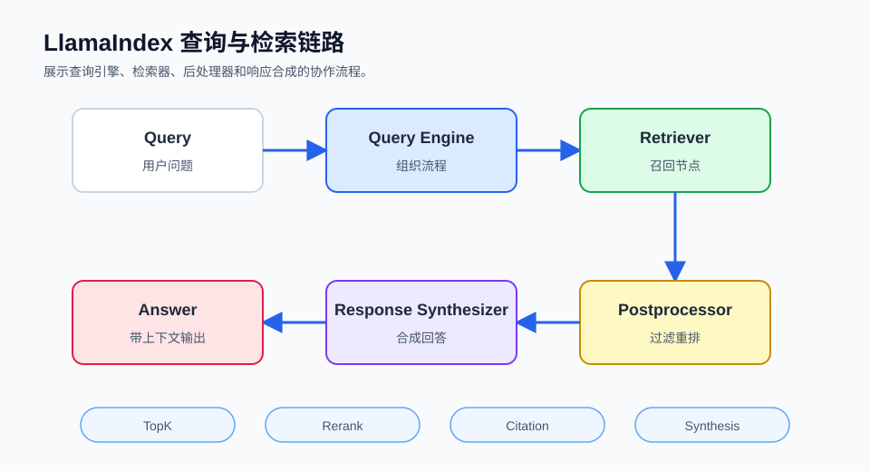

## 概述

查询与检索是 LlamaIndex 实现 RAG 的核心环节。本篇将详细介绍查询引擎的工作机制、检索器的配置以及如何优化检索效果。

可以把一次查询拆成四步：查询引擎接收问题，检索器从索引中找相关节点，后处理器筛选或重排节点，响应合成器把节点内容组织成最终回答。



### 查询流程

```
┌─────────────────────────────────────────────────────────────┐
│                   LlamaIndex 查询流程                        │
├─────────────────────────────────────────────────────────────┤
│                                                              │
│   ┌──────────┐   ┌──────────┐   ┌──────────┐   ┌────────┐ │
│   │  用户查询 │ → │  检索   │ → │  后处理  │ → │  合成  │ │
│   └──────────┘   └──────────┘   └──────────┘   └────────┘ │
│                                                              │
│       ↑              ↑              ↑              ↑         │
│       │              │              │              │         │
│   Query String    Retriever    Postprocessor   Synthesizer │
│                                                              │
└─────────────────────────────────────────────────────────────┘
```

## 查询引擎

这一节解决“如何把索引变成可提问接口”的问题。查询引擎适合入门和多数业务场景，因为它已经封装了检索、后处理和响应合成。

### 创建查询引擎

下面的示例假设已经有 `documents`。`similarity_top_k` 表示先召回多少个候选节点，`response_mode` 表示如何把候选节点整理成回答。

```python
from llama_index.core import VectorStoreIndex

index = VectorStoreIndex.from_documents(documents)

query_engine = index.as_query_engine(
    similarity_top_k=5,
    response_mode="compact"
)

response = query_engine.query("你的问题")
print(response)
```

### 基础查询

基础查询适合快速验证索引是否可用。除了答案文本，`response.metadata` 可以帮助你追踪答案来自哪些节点或文档。

```python
response = query_engine.query("LangChain是什么？")
print(response)
print(f"来源：{response.metadata}")
```

### 流式查询

流式查询适合聊天界面或长答案场景，可以边生成边展示，减少用户等待感。

```python
query_engine = index.as_query_engine(
    streaming=True
)

response_stream = query_engine.query("解释量子计算")

for text in response_stream.response_gen:
    print(text, end="", flush=True)
```

### 异步查询

异步查询适合 Web 服务或批量请求。它不会让单次模型调用变快，但能更好地利用并发。

```python
import asyncio

async def async_query():
    response = await query_engine.aquery("异步查询测试")
    return response

result = asyncio.run(async_query())
```

## 检索器

这一节把检索逻辑从查询引擎中拆出来看。检索器只负责返回相关节点，不负责生成自然语言答案，所以很适合调试“有没有找对资料”。

### 创建检索器

当答案不准确时，先直接查看检索器返回的节点，比直接改 prompt 更有效。

```python
retriever = index.as_retriever(
    similarity_top_k=5
)

nodes = retriever.retrieve("检索查询")

for node in nodes:
    print(f"内容：{node.text[:100]}...")
    print(f"相似度：{node.score}")
```

### 向量检索

显式创建 `VectorIndexRetriever` 适合需要把检索器传给自定义查询引擎或组合检索流程的场景。

```python
from llama_index.core.retrievers import VectorIndexRetriever

retriever = VectorIndexRetriever(
    index=index,
    similarity_top_k=10,
    filters=None
)

nodes = retriever.retrieve("查询")
```

### 混合检索

混合检索适合同时需要语义召回和关键词命中的场景，例如产品型号、错误码和概念解释混在一起的知识库。

```python
from llama_index.core import KeywordTableIndex
from llama_index.core.retrievers import QueryFusionRetriever

keyword_index = KeywordTableIndex.from_documents(documents)

vector_retriever = index.as_retriever(similarity_top_k=5)
keyword_retriever = keyword_index.as_retriever(similarity_top_k=5)

fusion_retriever = QueryFusionRetriever(
    retrievers=[vector_retriever, keyword_retriever],
    similarity_top_k=5,
    num_queries=1,
    use_async=False
)
```

### 自定义检索器

自定义检索器适合把业务规则加入召回流程。下面示例先调用基础检索器，再过滤掉分数过低的节点。

```python
from llama_index.core.retrievers import BaseRetriever

class ThresholdRetriever(BaseRetriever):
    def __init__(self, base_retriever, threshold=0.5):
        super().__init__()
        self.base_retriever = base_retriever
        self.threshold = threshold

    def _retrieve(self, query_bundle):
        nodes = self.base_retriever.retrieve(query_bundle)
        return [node for node in nodes if (node.score or 0) >= self.threshold]

base_retriever = index.as_retriever(similarity_top_k=10)
retriever = ThresholdRetriever(base_retriever, threshold=0.7)
```

## 后处理器

这一节处理“召回了节点之后，是否还需要筛选或重排”的问题。后处理器不会重新读取数据，它只调整当前这批候选节点。

### 相似度过滤

相似度过滤适合去掉低相关节点，尤其是 `similarity_top_k` 调大以后，可以减少无关上下文进入模型。

```python
from llama_index.core.postprocessor import SimilarityPostprocessor

postprocessor = SimilarityPostprocessor(
    similarity_cutoff=0.7
)

query_engine = index.as_query_engine(
    node_postprocessors=[postprocessor]
)
```

### 重排序

重排序通常先多召回一些节点，再用更精细的模型重新排序。它会增加延迟，但常能提升答案引用的准确性。

```python
from llama_index.core.postprocessor import SentenceTransformerRerank

rerank = SentenceTransformerRerank(
    top_n=5,
    model="cross-encoder/ms-marco-MiniLM-L-2-v2"
)

query_engine = index.as_query_engine(
    similarity_top_k=20,
    node_postprocessors=[rerank]
)
```

### 元数据过滤

元数据后处理适合配合窗口节点、章节摘要等高级解析策略。这里的关键是节点中必须已经有对应的元数据字段。

```python
from llama_index.core.postprocessor import MetadataReplacementPostProcessor

postprocessor = MetadataReplacementPostProcessor(
    target_metadata_key="window"
)

query_engine = index.as_query_engine(
    node_postprocessors=[postprocessor]
)
```

### 组合后处理器

多个后处理器会按顺序执行。一般先做粗过滤，再做重排，最后再做关键词或业务规则过滤。

```python
from llama_index.core.postprocessor import (
    SimilarityPostprocessor,
    SentenceTransformerRerank,
    KeywordNodePostprocessor
)

query_engine = index.as_query_engine(
    similarity_top_k=30,
    node_postprocessors=[
        SimilarityPostprocessor(similarity_cutoff=0.6),
        SentenceTransformerRerank(top_n=10),
        KeywordNodePostprocessor(keywords=["技术", "架构"])
    ]
)
```

## 响应合成

这一节说明“找到节点后如何生成答案”。响应合成器负责把检索到的上下文组织成模型输入，并决定答案是压缩、逐步 refine，还是直接摘要。

### 响应模式

如果问题简单且上下文不长，`compact` 往往是稳妥默认值；如果需要对大量节点逐步归纳，可以考虑 `refine`。

| 模式                 | 说明       | 适用场景   |
| -------------------- | ---------- | ---------- |
| **default**          | 默认响应   | 简单问答   |
| **compact**          | 压缩上下文 | 长文本处理 |
| **simple_summarize** | 简单摘要   | 快速响应   |
| **refine**           | 逐步优化   | 复杂问答   |

```python
query_engine = index.as_query_engine(
    response_mode="compact"
)

response = query_engine.query("问题")
```

### 自定义响应合成

当你想显式控制检索器和响应合成器时，可以使用 `RetrieverQueryEngine.from_args()` 组合它们。

```python
from llama_index.core.query_engine import RetrieverQueryEngine
from llama_index.core.response_synthesizers import get_response_synthesizer

synthesizer = get_response_synthesizer(
    response_mode="compact"
)

query_engine = RetrieverQueryEngine.from_args(
    retriever=retriever,
    response_synthesizer=synthesizer
)
```

## Chat Engine

这一节处理多轮对话。Chat Engine 会在每轮对话中结合历史消息和检索上下文，比普通查询引擎更适合聊天式问答。

### 对话模式

`condense_plus_context` 会先把多轮对话改写成更完整的问题，再检索相关上下文。

```python
chat_engine = index.as_chat_engine(
    chat_mode="condense_plus_context",
    similarity_top_k=5
)

response = chat_engine.chat("你好")
print(response)
```

### 聊天模式类型

选择聊天模式时，重点看是否需要保留对话历史，以及是否每轮都要重新检索上下文。

| 模式                      | 说明                     |
| ------------------------- | ------------------------ |
| **condense_question**     | 将历史对话改写成独立问题 |
| **context**               | 在对话中保留检索上下文   |
| **condense_plus_context** | 改写问题后再检索上下文   |

```python
chat_engine = index.as_chat_engine(
    chat_mode="condense_plus_context",
    system_prompt="你是一个专业的技术顾问。"
)
```

## 查询优化

这一节把检索器、后处理器和响应合成器组合起来。优化时建议先观察召回节点，再调整重排和响应模式。

### 高级配置

下面的配置先召回更多候选节点，再用重排序保留前 10 个，最后交给响应合成器生成答案。

```python
from llama_index.core.query_engine import RetrieverQueryEngine
from llama_index.core.postprocessor import SentenceTransformerRerank
from llama_index.core.retrievers import VectorIndexRetriever
from llama_index.core.response_synthesizers import get_response_synthesizer

retriever = VectorIndexRetriever(
    index=index,
    similarity_top_k=20
)

postprocessor = SentenceTransformerRerank(
    top_n=10,
    model="cross-encoder/ms-marco-MiniLM-L-2-v2"
)

synthesizer = get_response_synthesizer(
    response_mode="compact"
)

query_engine = RetrieverQueryEngine.from_args(
    retriever=retriever,
    node_postprocessors=[postprocessor],
    response_synthesizer=synthesizer
)
```

### 自动优化

LlamaIndex 不会自动知道你的业务分类含义。更常见的做法是按场景封装不同参数，让调用方选择合适配置。

```python
def create_query_engine(index, scene: str):
    if scene == "precise":
        return index.as_query_engine(similarity_top_k=3, response_mode="compact")
    if scene == "summary":
        return index.as_query_engine(similarity_top_k=8, response_mode="refine")
    return index.as_query_engine(similarity_top_k=5, response_mode="compact")

query_engine = create_query_engine(index, scene="precise")
```

## 索引更新

这一节说明资料变化后如何维护索引。小规模变更可以增量插入或删除，资料结构变化较大时再重建索引。

### 增量更新

新增文档可以直接插入已有索引，适合每天追加少量资料的场景。

```python
new_docs = SimpleDirectoryReader("./new_data").load_data()

for doc in new_docs:
    index.insert(doc)
```

### 删除节点

如果只想删除少量节点，可以按节点 ID 删除。删除前建议先记录节点与来源文档的映射。

```python
index.delete_nodes(["node_123"])
```

### 重建索引

当原文档被替换或切分策略变化时，删除旧文档引用后重新插入，比只改节点更清晰。

```python
index.delete_ref_doc(ref_doc_id="doc_123", delete_from_docstore=True)
index.insert(new_doc)
```

## 最佳实践

这一节把查询优化收束为几个判断点。不要一开始就堆所有高级配置，先确认检索器返回的节点是对的。

| 实践           | 说明                                      |
| -------------- | ----------------------------------------- |
| **top_k 优化** | 答案漏信息时调大，噪声过多时调小          |
| **混合检索**   | 术语、编号、错误码较多时补充关键词召回    |
| **响应模式**   | 简单问答用 compact，复杂归纳再考虑 refine |
| **重排序**     | 先多召回，再用重排序提高候选质量          |

## 总结

这一节回顾职责边界。查询效果不好时，先判断问题出在召回、后处理，还是响应合成。

| 组件                    | 功能               |
| ----------------------- | ------------------ |
| **QueryEngine**         | 封装检索和合成     |
| **Retriever**           | 从索引获取相关节点 |
| **Postprocessor**       | 过滤和重排序       |
| **ResponseSynthesizer** | 生成最终响应       |

QueryEngine 让调用简单，Retriever 让召回可调试，Postprocessor 让候选上下文更干净，ResponseSynthesizer 决定答案组织方式。分清这几层，优化 RAG 应用时就不会只盯着 prompt。
