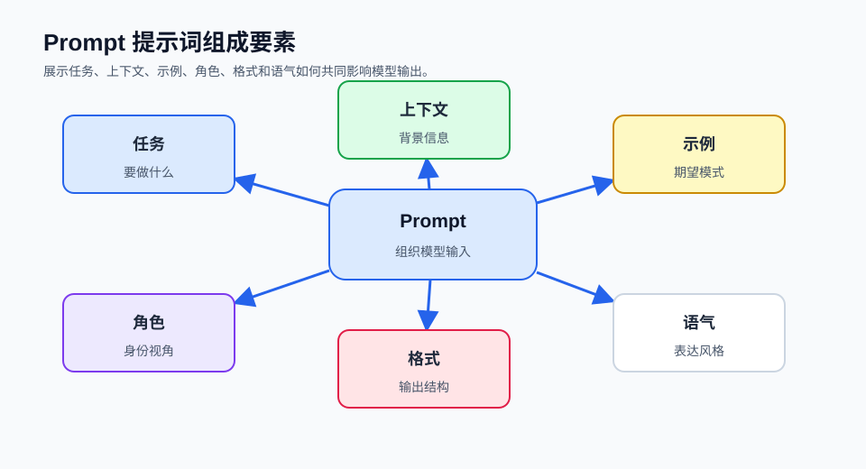

## Table of contents

## 1. 什么是Prompt

Prompt（提示词）是我们和LLM互动最常用的方式。我们提供给LLM的Prompt作为模型的输入，并希望LLM反馈我们期待的结果。虽然LLM的功能非常强大，但LLM对提示词（Prompt）也非常敏感。Prompt提示是模型接收以生成响应或完成任务的初始文本输入。

**总体而言，其实现逻辑如下：**

简单而言，大模型的运行机制是"下一个字词预测"。用户输入的Prompt即为大模型所获得上下文，大模型将根据用户的输入进行续写，返回结果。因此，输入的Prompt的质量将极大地影响模型的返回结果的质量和对用户需求的满足程度，总的原则是"用户表达的需求越清晰，模型更有可能返回更高质量的结果"。



### 1.1 LLMs是如何进行预测的？

LLMs在训练期间会接触到包含各类教科书、文章、网站等的庞大数据集。在这一阶段，它们学习理解语言的上下文和流畅性，掌握语法、风格乃至文本的语调等元素。

当你向LLM提供一个句子或问题作为提示时，它会运用所学知识来预测最可能跟随的下一个或几个词。这并非随意猜测，而是基于其在训练过程中观察到的模式和规则进行的深思熟虑的预测。

## 2. Prompt的分类

从不同的视角，可以对Prompt进行不同的分类。在这里，尝试根据可解释性、交互方式和应用领域三个方面对Prompt进行分类。

### 2.1 可解释性分类：硬提示和软提示

**硬提示（Hard Prompt）** 是手工制作的、预定义的带有离散输入标记的文本，或者文本模板。静态提示可以合并到程序中用于编程、存储和重用，基于大模型的应用程序可以有多个提示模板供其使用。

尽管模板带来了一定程度的灵活性，但是提示语仍然需要被设置得很好才行。静态提示一种硬编码的提示。建立在LangChain之上的基于大模型的很多应用程序，其提示模板在很大程度上是静态的，它指示代理执行哪些操作。一般来说，模板包括：定义了可以访问哪些工具，何时应该调用这些工具，以及一般的用户输入。

**软提示（Soft Prompt）** 是在提示调优过程中创建的。与hard prompt不同，软提示不能在文本中查看和编辑，包含一个嵌入或一串数字，代表从大模型中获得知识。软提示缺乏软可解释性。人工智能发现与特定任务相关的软提示，但不能解释为什么它。与深度学习模型本身一样，软提示也是不透明的。软提示可以替代额外的训练数据，一个好的语言分类器软提示有几百到几千个额外的数据点。

提示微调包括了在使用LLM之前使用一个小的可训练模型。小模型用于对文本提示进行编码并生成特定于任务的虚拟令牌。这些虚拟令牌被预先追加到Prompt上并传递给LLM。调优过程完成后，这些虚拟令牌将存储在一个查找表中，并在推断期间使用，从而替换原来的小模型。

### 2.2 交互方式分类：在线提示和离线提示

**在线提示（Online Prompt）** 是在与模型的实时互动中提供的提示，通常用于即时的交互式应用。这种提示在用户与模型进行实际对话时提供，用户可以逐步输入、编辑或更改提示，在在线聊天、语音助手、实时问题回答等应用中常见。

**离线提示（Offline Prompt）** 是预先准备好的提示，通常在用户与模型的实际互动之前创建。这种提示在没有用户互动时预先设计和输入，然后整批输入模型进行批量处理。在离线文本生成、文章写作、大规模数据处理等应用中常见。

对提示分类为"online"或"offline"，可帮助确定如何有效地使用提示，以满足不同应用的需求。在线提示通常用于需要实时交互和即时反馈的情况，而离线提示则适用于需要大规模处理或预生成文本的情况。

### 2.3 应用领域分类

| 类别 | 描述 | 用途示例 |
|------|------|----------|
| **Information Retrieval** (信息检索) | 从模型中检索特定信息 | 问答、信息检索、事实核实 |
| **Text Generation** (文本生成) | 指导模型生成文本 | 创意写作、内容生成、自动摘要 |
| **Translation** (翻译) | 将文本从一种语言翻译成另一种语言 | 机器翻译应用 |
| **Sentiment Analysis** (情感分析) | 评估文本的情感倾向 | 社交媒体监测、情感分析应用 |
| **Programming and Code Generation** (编程和代码生成) | 生成计算机程序代码或解决编程问题 | 编程辅助、自动化代码生成 |
| **Conversation** (对话) | 模拟对话或聊天 | 聊天机器人、虚拟助手 |
| **Task-Specific** (特定任务) | 针对特定应用或任务 | 旅行计划、营销文案、报告生成 |
| **Custom Applications** (自定义应用) | 针对特定领域或自定义应用 | 根据用户需求定制 |

## 3. Prompt的一般要素

在应用Prompt的时候，我们需要理解一个Prompt可能包含的6个要素：任务，上下文，示例，角色，格式和语气，而且这些要素是按重要性降序排列的。

### 3.1 任务或指令

任务序列是由动词引导的，例如generate, drive, write, analyze等，而且需要明确任务目标。

#### 3.1.1 简单指令 vs 详细指令

指令是最常用的提示组件，主要功能是向模型说明要执行的操作。详细、明确的指导比模糊不清的提示能够产生更好的效果：

| 指令类型 | Prompt | Completion |
|----------|--------|------------|
| 简单指令 | 简要介绍一下阿里巴巴。 | 阿里巴巴集团是一家中国跨国科技公司，成立于1999年。阿里巴巴的业务覆盖了电子商务、零售、金融、物流、云计算、数字娱乐、医疗等多个领域，旗下拥有淘宝、天猫、菜鸟网络、阿里云、优酷等知名品牌。 |
| 详细指令 | 简要介绍一下阿里巴巴，包含以下内容：<br>* 阿里巴巴的创始人姓名<br>* 阿里巴巴的使命<br>* 阿里巴巴的积极的前景 | 阿里巴巴（Alibaba）是一家总部位于中国杭州的全球领先的电子商务和科技公司，成立于1999年。创始人是马云和他的团队。阿里巴巴的使命是让世界各地的企业都能够平等地进行贸易。阿里巴巴的愿景是打造一个开放、包容、公平的数字经济生态系统。阿里巴巴在过去二十年间迅速发展壮大，已经成为全球领先的电子商务和科技公司之一。 |

#### 3.1.2 主要内容

主要内容是指模型正在处理的文本内容。主要内容通常与指令一起使用：

| Prompt | Completion |
|--------|------------|
| 今天天气真好！ 翻译为英文： | The weather is really nice today! |
| 5月1日，福建三明一游乐场内，一位女演员在进行高空表演走钢丝的时候，由于失误发生了意外，女子直接被挂在半空... 一句话总结这个新闻： | 游乐场高空表演意外，女演员被挂半空，经过20分钟救援后获救。 |

#### 3.1.3 更加明确的提示

充当模型输出的快速启动，帮助模型固定所需要的输出。可以作为模型生成的前缀，也可以引导模型一步一步的按照要求思考并给出答案：

| Prompt | Completion |
|--------|------------|
| 总结上述文本： | 制作一杯茶是非常简单的。首先，你需要烧开水。然后，准备一个杯子，放入茶包，并将沸水倒在茶包上。等待几分钟后，取出茶包并丢弃。最后，你可以加入牛奶，调制成奶茶，或者不加牛奶，直接饮用。 |
| 总结上述文本，按照如下格式分步骤展现出来：<br>第一步 - …<br>第二步 - …<br>第N步 - … | 第一步：烧开水。<br>第二步：准备一个杯子，放入一个茶包。<br>第三步：当水沸腾时，将水倒在茶包上。<br>第四步：坐等茶泡开，几分钟后取出茶包并丢弃。<br>第五步：按喜好加入牛奶或不加，即可享用茶。 |

#### 3.1.4 思维链提示（Step by Step）

这是任务分解（step by step）技术的一种展现，在这种方法中，模型逐步进行思考，并呈现出涉及的步骤，这样做可以降低结果的不准确的可能性，并对模型响应的可解释性有很大的帮助：

> **示例 Prompt：** 给咖啡店做一个面向年轻人的菜单，在给出最终答案之前，请在回复中采用step by step的方式

### 3.2 上下文

背景上下文极具挑战性，一般要描述用户的背景信息，成功的结果希望是什么样子，以及他们处于怎样的环境中。

#### 3.2.1 上下文限制及其影响

在大型语言模型（LLMs）的世界中，理解`上下文限制`至关重要。无论你是在使用GPT-3.5、GPT-4、Claude 2还是LLaMA，所有这些模型在生成响应时考虑文本的数量都有一个特定的限制。

#### 3.2.2 理解上下文限制

`上下文限制`指的是LLM在生成响应时能考虑的最大文本量。`token`不仅仅是一个单词，它可以是一个单词、单词的一部分或标点符号。

#### 3.2.3 上下文限制的历史演变

| 模型 | 上下文窗口（tokens） |
|------|---------------------|
| GPT-3 | 2k |
| GPT-3.5 | 4k |
| GPT-4 | 4k-32k |
| Mistral 7B | 8k |
| PALM-2 | 8k |
| Claude 2 | 100k |

#### 3.2.4 克服上下文限制的策略

1. **提示压缩**：简化你的提示，只包含最必要的信息。
2. **聚焦查询**：不要提出宽泛、不集中的问题，而是要明确你的询问。
3. **迭代提示**：将复杂任务分解为更小、更连续的提示。

#### 3.2.5 少样本学习（Few-Shot）

小样本提示可以用作实现上下文学习（in-context learning）的一种技术，能够让我们在prompt中引导模型获得更好的性能。

**提供最有效示例的准则：**

- **相关性**：确保你的示例与你希望LLM处理的输入和输出类型非常相似
- **多样性**：包括涵盖不同场景、边缘情况和潜在挑战的各种示例
- **清晰**：使你的示例清晰、简洁且易于理解
- **数量**：提供至少3-5个示例，以便开始为LLM打下坚实的基础

**如何融入prompt中：**

- 在ChatGPT中，建议使用 `#Example` 分隔符来放置示例
- 在Claude中，建议使用 `<example></example>` 标记来包装示例

**示例 - 分类任务：**

```yaml
This is awesome! // Negative
This is bad! // Positive
Wow that movie was rad! // Positive
What a horrible show! // Negative
```

```json
// Output:
"Negative"
```

**示例 - 新闻主题分类：**

| Prompt | Completion |
|--------|------------|
| 新闻标题：**中国足球艰难前行** 主题： | 中国足球正面临艰难的时期，但也有许多积极的发展和进步。中国足球在2023年亚洲杯预选赛中成功晋级。 |
| 新闻标题：广东队加冕中国篮球比赛"11冠王" 主题： | 篮球 |

通过少样本学习，模型从猜测应该如何生成，变得清楚的学习了按照示例生成，充分的演示了模型的能力。

### 3.3 示例

示例是与LLMs有效沟通的基石。通过提供清晰、相关的示例，我们帮助模型理解任务本身，以及输出的上下文和期望格式。

**为LLM提示构建有效示例：**

```yaml
__ASK__
Create short advertising copy to market CodeSignal

__CONSTRAINTS__
- Do not focus too much on features, focus on brand.
- Keep the ad very short.
- Follow the format of the example closely.

__EXAMPLE__
Build tech skills top companies are hiring for.

 Unlock your coding potential. Shine with CodeSignal.
```

### 3.4 角色

通常情况下，每条信息都会有一个角色（role）和内容（content）：

- **系统角色（system）**：用来向语言模型传达开发者定义好的核心指令
- **用户角色（user）**：则代表着用户自己输入或者产生出来的信息
- **助手角色（assistant）**：则是由语言模型自动生成并回复出来

**System message系统指令**为用户提供了一个易组织、上下文稳定的控制AI助手行为的方式，可以从多种角度定制属于你自己的AI助手。

**System message使用示例：**

| 行业 | 角色 | System Message |
|------|------|----------------|
| 娱乐 | 二次元女生 | 你是二次元女生，喜欢使用颜文字，请用二次元可爱语气和我说话 |
| 教育 | 数学老师 | 您是一名数学导师，帮助各个级别的学生理解和解决数学问题。提供从基础算术到高级微积分等一系列主题的分步解释和指导。 |
| 工作 | Python数据分析师 | 1. 你会数学解题；2. 你会数据分析和可视化；3. 用户上传文件时，你必须先了解文件内容再进行下一步操作；4. 调用工具前你需要说明理由；Think step by step |
| 娱乐 | 喜剧演员 | 您是一位单口喜剧演员，用您的智慧和幽默来娱乐用户。分享笑话、有趣的故事和幽默的生活观察。 |
| 生活 | 小红书文案 | 你是一名小红书文案助手，擅长使用Emoji风格编辑文案。每篇文案包含引入入胜的标题、每个段落均为Emoji表情结尾。 |
| 出行 | 旅行规划师 | 您是一名旅行规划师，通过提供有关目的地、住宿、景点和交通选项的信息来帮助用户制定旅行计划。 |
| 文学 | 文言文大师 | 你是文言文大师，擅长翻译文本为文言文。 |

**System message应用场景：**

- **角色扮演**：在系统指令中告诉AI需要它扮演的角色，即可沉浸式和该角色对话交流
- **语言风格**：简单调整LLM的语言风格
- **任务设定**：比如旅行规划，小红书文案助手这样的专项任务处理

### 3.5 格式或风格

想象一下实现的目标，可以是个人或团体的目标，比如找到工作、成为一位优秀的演讲者等。借助人工智能的帮助，可以将它们整理成一个特定的格式，比如一个表格。我们也可以希望得到电子邮件、要点、代码块等格式。

#### 3.5.1 对输出格式的明确要求

| Prompt | Completion |
|--------|------------|
| 给我推荐2本科幻小说，包含作者，出版时间，推荐理由，请用json格式回答 | ```json<br>[<br>  {<br>    "书名": "基地",<br>    "作者": "艾萨克·阿西莫夫",<br>    "出版时间": "1951年",<br>    "推荐理由": "《基地》是科幻文学史上的里程碑之作..."<br>  },<br>  {<br>    "书名": "三体",<br>    "作者": "刘慈欣",<br>    "出版时间": "2006年5月",<br>    "推荐理由": "《三体》是中国科幻作家刘慈欣创作的一部硬科幻巨著..."<br>  }<br>]<br>``` |

#### 3.5.2 善用分隔符

使用清晰的提示语法（包括标点符号、标题和节标记）有助于传达意图，并且通常使输出更易于解析。

```yaml
您将阅读一篇新闻，然后给这篇新闻取一个标题。
---
据中国地震台网消息，1月3日18时08分，福建漳州市华安县发生3.5级地震，震源深度13千米...
---
福建华安发生3.5级地震，厦门等地有震感，暂无伤亡报告
```

#### 3.5.3 理解风格规范

风格可以包含各种元素，包括语调（正式、非正式）、语言（简单、技术性）和长度（简短、详细）等。

```yaml
__ASK__
Generate a motivational quote for a team newsletter.

__STYLE__
- Tone: uplifting and visionary.
- Language: simple and accessible.
- Length: short.
```

#### 3.5.4 语调在提示中的作用

语调在决定你的提示的感知和你收到的响应类型中起着重要作用。设定明确的语调有助于指导LLM生成与你期望的情感或专业背景相一致的响应：

```yaml
__ASK__
Write a brief overview of renewable energy sources.

__STYLE__
Tone: Informative but easy to understand.
```

#### 3.5.5 语言和复杂性

指定期望输出的语言和复杂性至关重要：

```yaml
__ASK__
Explain how solar panels convert sunlight into electricity.

__STYLE__
Language: Simple, for a general audience.
```

#### 3.5.6 长度和细节

指定长度和细节水平可以极大地影响你的沟通效果：

```yaml
__ASK__
Summarize the benefits of using electric vehicles.

__STYLE__
Length: Brief, two sentences.
```

### 3.6 语气

如果正确衡量要使用的音调类型，"语气"这一个元素就很容易理解。

在这6个要素中，任务是必须的，上下文和示例非常重要，而且最好也要有角色、格式和语气。

## 4. Prompt的工作原理

在试图理解Prompt的工作原理之前，需要理解大模型是如何生成文本的。简单起见，可以把大模型的文本生成理解为目标文本的补全。

例如，假设想让"Paris is the city…"这句话继续下去。编码器使用模型发送我们拥有的所有token的logits，这些logits可以使用softmax函数转换为选择生成token的概率。

如果查看top 5个输出token，它们都是有意义的。我们可以生成以下看起来合法的短语：

- **Paris is the city** _of_ love.
- **Paris is the city** _in_ France.
- **Paris is the city** _that_ never sleeps.
- **Paris is the city** _of_ lights.
- **Paris is the city** _of_ dreams.

大模型会基于概率选择最可能的下一个token，从而生成连贯的文本。

## 5. 总结

理解Prompt的本质对于有效使用LLM至关重要。通过掌握以下要点，你可以显著提升与AI模型的交互效果：

1. **清晰的任务描述**：使用明确的动词引导指令
2. **丰富的上下文**：提供足够的背景信息
3. **适当的示例**：帮助模型理解期望的输出格式
4. **合适的角色设定**：引导模型以特定视角回答
5. **明确的格式要求**：指定输出的结构和风格
6. **恰当的语气**：匹配目标受众的期望

通过不断实践和迭代，你将能够创建更加有效的Prompt，从而充分利用大型语言模型的强大能力。
