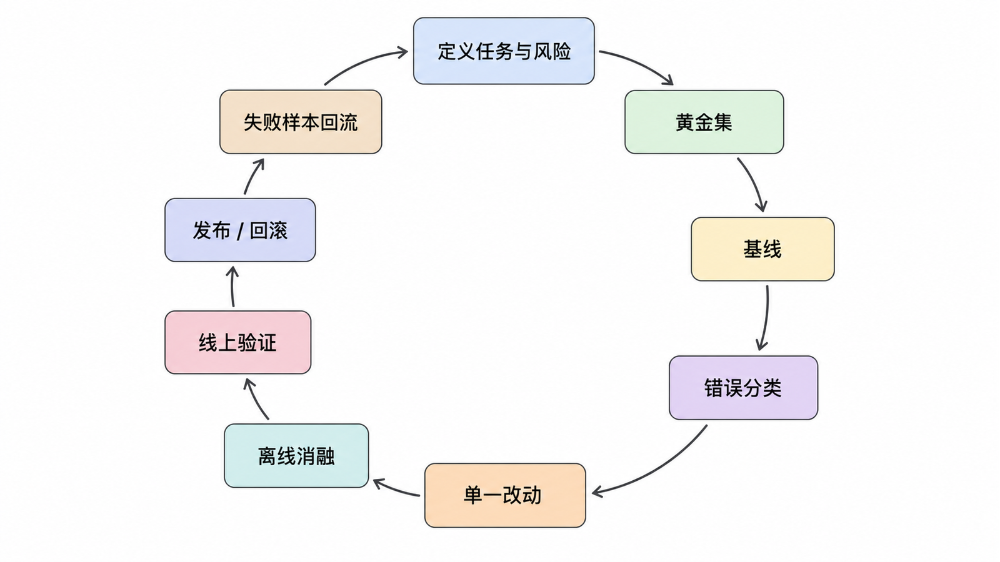
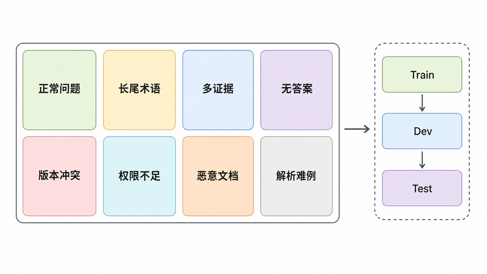
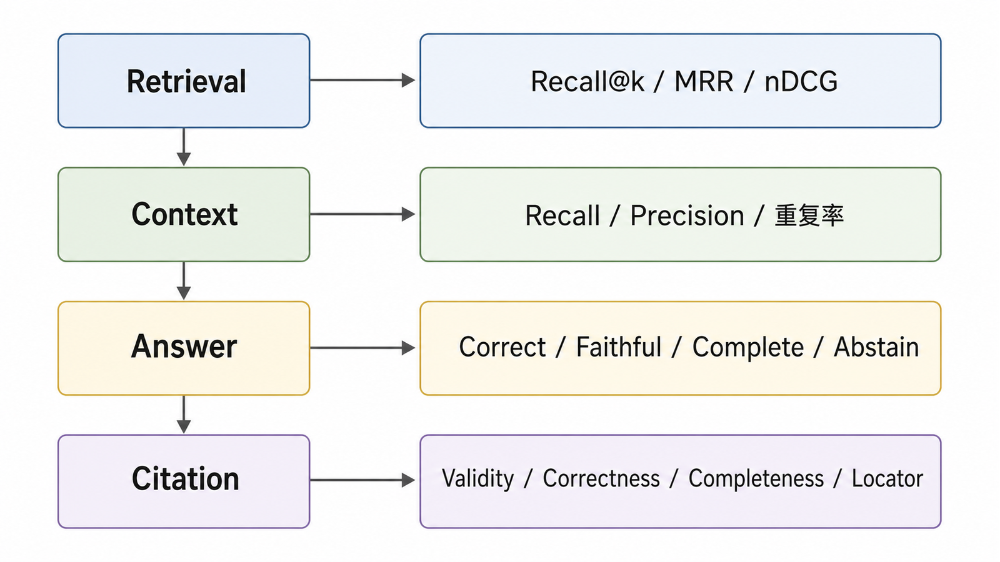
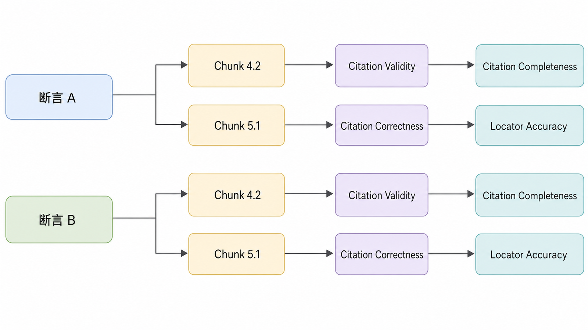
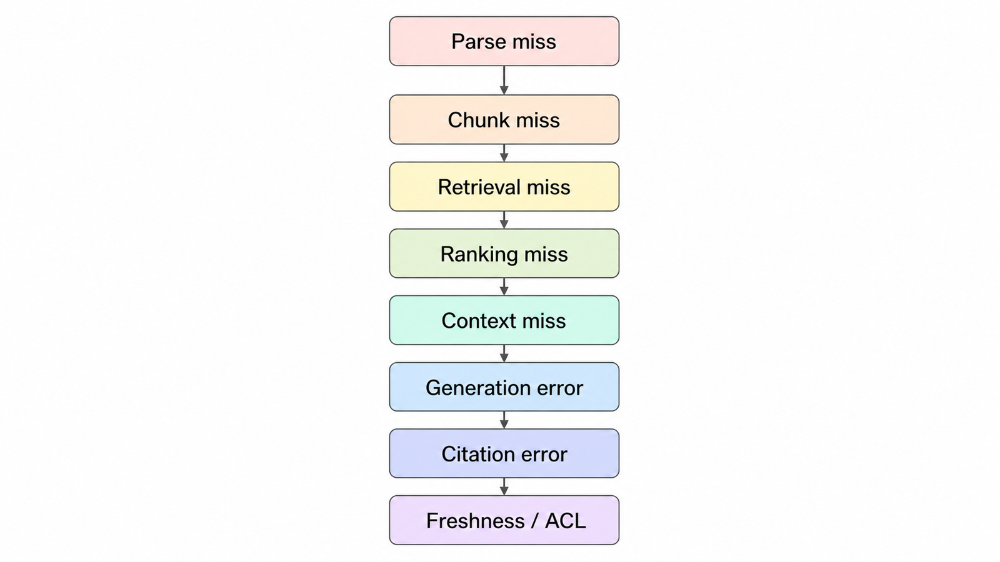
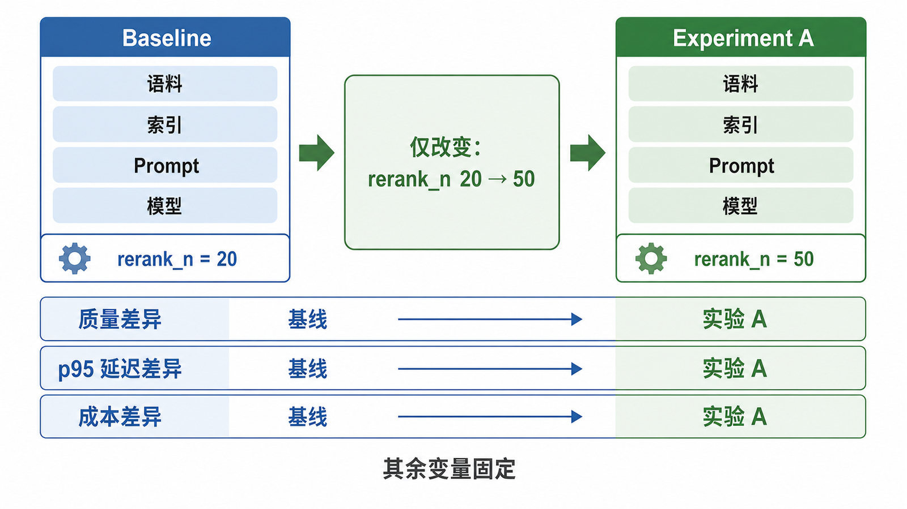
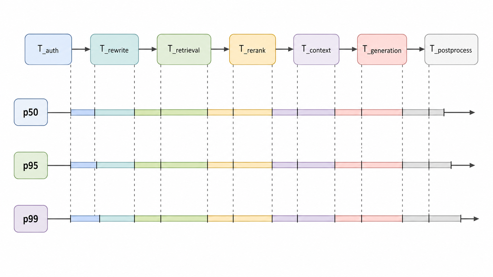
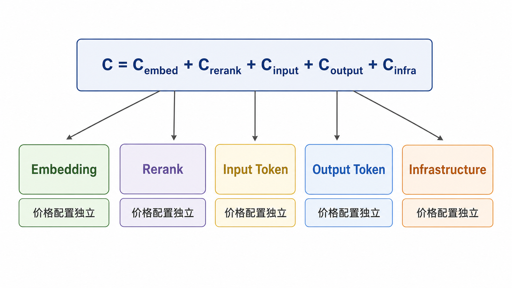
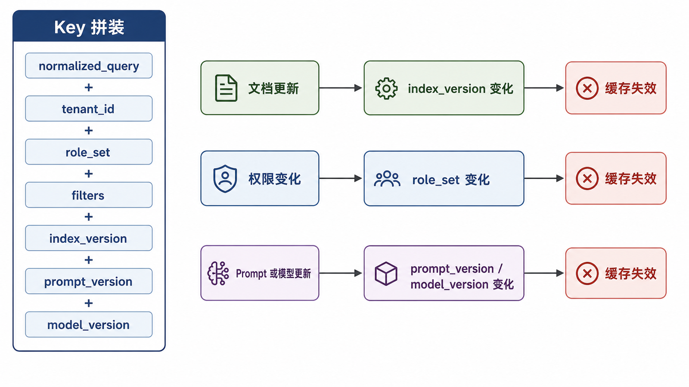
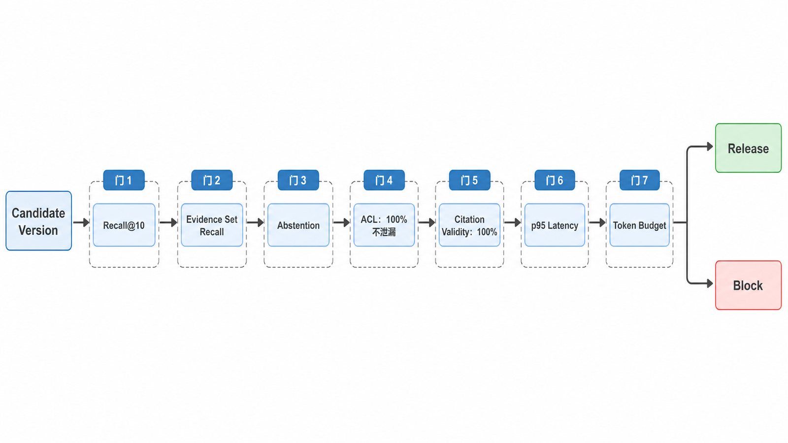

## 前置知识与学习目标

优化之前必须先有可重复的基线。读完后，你应该能够：

- 建立覆盖答案、无答案、权限和对抗场景的黄金评测集。
- 分离 Retrieval、Context、Answer 与 Citation 四层指标。
- 用错误分类和单变量消融定位改进来源。
- 同时观察质量、p95 延迟、Token、成本与缓存正确性。
- 设置回归门，阻止“平均分提高但关键场景退化”的版本上线。

## 优化闭环



```text
定义任务与风险
  → 建立黄金集
  → 运行基线
  → 错误分类
  → 提出单一改动
  → 离线消融
  → 小流量线上验证
  → 发布或回滚
  → 新失败样本进入黄金集
```

没有评测集的“优化”通常只是修改参数后挑几个成功案例。

## 黄金评测集的数据契约



```python
from dataclasses import dataclass

@dataclass(frozen=True)
class EvalCase:
    case_id: str
    query: str
    relevant_chunk_ids: frozenset[str]
    expected_facts: tuple[str, ...]
    answerable: bool
    roles: frozenset[str]
    tags: frozenset[str]
```

推荐覆盖：

- 高频正常问题。
- 长尾术语、编号、缩写和同义改写。
- 需要多个证据的组合问题。
- 没有答案或问题前提错误的情况。
- 新旧版本冲突。
- 权限不足和跨租户查询。
- 文档内嵌恶意指令。
- 超长文档、表格、扫描件等解析难例。

训练、调参和最终报告应使用不同集合；反复查看同一测试集并针对性调参会造成评测过拟合。

## 四层质量指标



### 1. Retrieval Quality

使用稳定 ID 计算：

- Recall@k：必要证据是否进入候选。
- MRR：第一个相关结果是否靠前。
- nDCG@k：高相关证据是否排在前面。
- Evidence Set Recall：多证据问题是否找齐全部证据。

```python
def evidence_set_recall(retrieved: list[str], relevant: set[str], k: int) -> float:
    if not relevant:
        raise ValueError("无答案用例应单独统计")
    return len(set(retrieved[:k]) & relevant) / len(relevant)
```

### 2. Context Quality

召回候选不等于实际送入模型的 Context。应记录：

- Context Recall：黄金证据是否仍在最终 Context。
- Context Precision：进入 Context 的内容中有多少真正相关。
- 重复率：相同父块或高度重叠文本占比。
- 证据完整率：关键句是否被截断。
- Token 占用及被截断原因。

### 3. Answer Quality

至少分开：

- Correctness：是否符合参考事实。
- Faithfulness：关键断言是否由 Context 支持。
- Completeness：是否覆盖所需事实。
- Abstention：证据不足时是否正确拒答。

不能用“问题与答案词项重合”“答案包含参考字符串”或“句子数量”代替这些指标。自动 Judge 可以扩展评测规模，但应使用明确 Rubric，并用一小组人工标注检查 Judge 的一致性、偏差和版本漂移。

### 4. Citation Quality



评估对象应是“断言—引用”对：

- Citation Validity：Chunk ID 是否存在且属于当前 Context。
- Citation Correctness：引用内容是否支持断言。
- Citation Completeness：需要证据的断言是否都有引用。
- Locator Accuracy：页码、章节或时间码能否定位原文。

只统计“答案末尾有几个链接”没有意义。

## 一个结构化评测结果

```python
from dataclasses import dataclass

@dataclass(frozen=True)
class EvalResult:
    case_id: str
    recall_at_10: float | None
    context_recall: float | None
    answer_correct: bool
    faithful: bool
    citation_correct: bool
    refused: bool
    latency_ms: float
    input_tokens: int
    output_tokens: int
```

无答案案例的 Retrieval Recall 没有普通定义，应保存 `None` 并使用误召回率、正确拒答率等单独指标，避免用 0 悄悄混入平均值。

## 错误分类优先于调参



建议把失败归为：

| 类别             | 判断证据                          | 常见动作                        |
| ---------------- | --------------------------------- | ------------------------------- |
| Parse miss       | 原文存在但解析结果缺失            | 修解析器/OCR/结构保留           |
| Chunk miss       | 解析存在但证据被错误切分          | 调整结构或父子分块              |
| Retrieval miss   | 黄金 Chunk 不在候选               | 改 Query、Embedding、BM25、过滤 |
| Ranking miss     | 候选包含黄金 Chunk，但头部排序差  | 改融合或重排                    |
| Context miss     | 黄金 Chunk 在候选但未进入 Context | 改去重、预算、压缩              |
| Generation error | Context 正确但答案错误            | 改 Prompt、模型、结构化输出     |
| Citation error   | 答案正确但引用不支持              | 改断言—证据映射和校验           |
| Freshness/ACL    | 版本或权限错误                    | 修索引生命周期和安全边界        |

只有分类完成后，才能选择正确杠杆。

## 单变量消融



每次实验只改变一个主要因素，例如：

- Chunk Size 400 → 700 Token。
- Dense-only → Dense + BM25 + RRF。
- `rerank_n` 20 → 50。
- Context 5 块 → 父 ID 去重后 5 块。
- Prompt v3 → v4。

报告至少包含：

```text
实验 ID、代码提交、语料版本、索引版本
Embedding / Reranker / Generation 模型版本
Prompt 版本、随机种子或解码配置
评测集版本、每个 Tag 的样本数
质量指标、置信区间或配对差异
p50/p95 延迟、Token 与估算成本
```

不要写“准确率提升 20%”而不说明从什么指标、什么基线、多少样本提升到什么值。

## 延迟：看分段和分位数



端到端平均值会隐藏长尾。记录：

```text
T_total = T_auth + T_rewrite + T_retrieval + T_rerank
        + T_context + T_generation + T_postprocess
```

每段至少查看 p50、p95、p99、错误率与超时率。生成通常占大头，但候选数过大、过滤低效或远程向量库也可能形成长尾。

```python
import math

def percentile(values: list[float], p: float) -> float:
    if not values:
        raise ValueError("values 不能为空")
    ordered = sorted(values)
    index = math.ceil((p / 100) * len(ordered)) - 1
    return ordered[max(0, min(index, len(ordered) - 1))]
```

这是 nearest-rank 教学实现；正式分析应固定统计定义，避免不同仪表盘的 p95 算法不一致。

## 成本与 Token 预算



一次请求的可变成本可拆成：

\[
C=C*{embed}+C*{rerank}+C*{input}+C*{output}+C\_{infra}
\]

价格会变化，文章不写死单价。系统应记录实际模型、Token 和调用次数，再由独立价格配置计算。

常见优化顺序：

1. 删除重复 Context。
2. 限制候选和重排数量。
3. 让简单或无答案查询尽早退出。
4. 为稳定任务选择满足质量门槛的较小模型。
5. 批量处理离线 Embedding。
6. 在正确失效策略下缓存。

不能为了降低 Token 而牺牲关键证据完整性。

## 缓存必须先保证正确



缓存 Key 建议包含：

```text
hash(normalized_query, tenant_id, role_set, filters,
     index_version, retrieval_config, prompt_version, model_version)
```

至少定义：

- 文档更新和删除如何失效。
- 权限变化如何失效。
- 索引或 Prompt 发布如何切换命名空间。
- 缓存内容是否包含敏感文本。
- 无答案结果缓存多久。

语义缓存要额外评估错误合并率。例如“可报销”和“不可报销”只有一个否定词差异，却不能共享答案。

## 并发、背压与降级

异步不能自动提升单请求速度，它允许等待 I/O 时处理其他任务。生产系统还需要：

- 有界并发，避免把限流和下游服务压垮。
- 队列长度和等待时间指标。
- 每阶段超时与取消传播。
- 重试预算、指数退避和幂等键。
- Circuit Breaker 与明确降级语义。

降级不能悄悄从“受证据约束回答”变成“模型自由回答”。更安全的降级通常是返回搜索结果、缩减功能或明确暂时无法回答。

## 回归门



示例发布门：

```text
总体 Retrieval Recall@10 不下降超过允许误差
高风险 Tag 的 Evidence Set Recall 不得下降
无答案正确拒答率达到目标
ACL 对抗集必须 100% 不返回未授权 Chunk
Citation Validity 必须 100%
p95 延迟与单请求 Token 不超过预算
```

具体阈值由业务风险和基线决定。高风险安全断言不应被总体平均分稀释。

## 线上实验边界

离线比较多个策略不是 A/B 测试。真正线上 A/B 需要：

- 稳定随机分流单位，避免同一用户跨组污染。
- 明确主要指标、护栏指标和样本量计划。
- 不把敏感或高风险用户暴露给未经验证策略。
- 记录版本并支持快速停止。
- 结合用户反馈与离线标注分析，避免只优化点击率。

## 常见误区

- 用词项重合和答案长度作为生成质量。
- 只报告平均延迟。
- 同时修改 Chunk、Retriever、Prompt 和模型后归因。
- Judge 模型变化但没有重新校准历史分数。
- 缓存不包含 ACL、索引和 Prompt 版本。
- 降级时绕过 RAG 让模型自由回答。
- 总体分数上升，却忽略高风险 Tag 退化。

## 自检题

<details>
<summary>1. Retrieval Recall 很高但 Context Recall 很低，应先检查哪里？</summary>

检查候选到最终 Context 的去重、重排、压缩和 Token 截断过程，而不是先更换 Embedding。

</details>

<details>
<summary>2. 为什么无答案案例不应把 Recall 记为 0？</summary>

相关集合为空时普通 Recall 分母为 0。应使用正确拒答率、误召回率或阈值指标单独评估。

</details>

<details>
<summary>3. p50 改善而 p95 变差意味着什么？</summary>

典型请求更快，但长尾请求更慢。用户体验、超时和容量可能反而恶化，需要按阶段和 Query Tag 查找长尾来源。

</details>

## 总结与下一篇

RAG 优化从“可归因”开始。黄金集、四层指标、错误分类和单变量消融共同回答：改了什么、改善了哪一层、牺牲了什么、是否值得发布。

下一篇将把同一方法扩展到图像、视频和音频，并重点处理跨模态定位、分数校准和引用粒度。

## 对应资料来源

- [RAGAS: Automated Evaluation of Retrieval Augmented Generation](https://aclanthology.org/2024.eacl-demo.16/)
- [ARES: An Automated Evaluation Framework for RAG Systems](https://arxiv.org/abs/2311.09476)
- [Evaluation of Retrieval-Augmented Generation: A Survey](https://arxiv.org/abs/2405.07437)
- [NIST AI RMF: Generative Artificial Intelligence Profile](https://www.nist.gov/publications/artificial-intelligence-risk-management-framework-generative-artificial-intelligence)

> 验证说明：指标和延迟代码使用 Python 标准库。自动 Judge 不是事实裁判；正式使用时必须记录 Rubric、模型版本并与人工标注校准。
