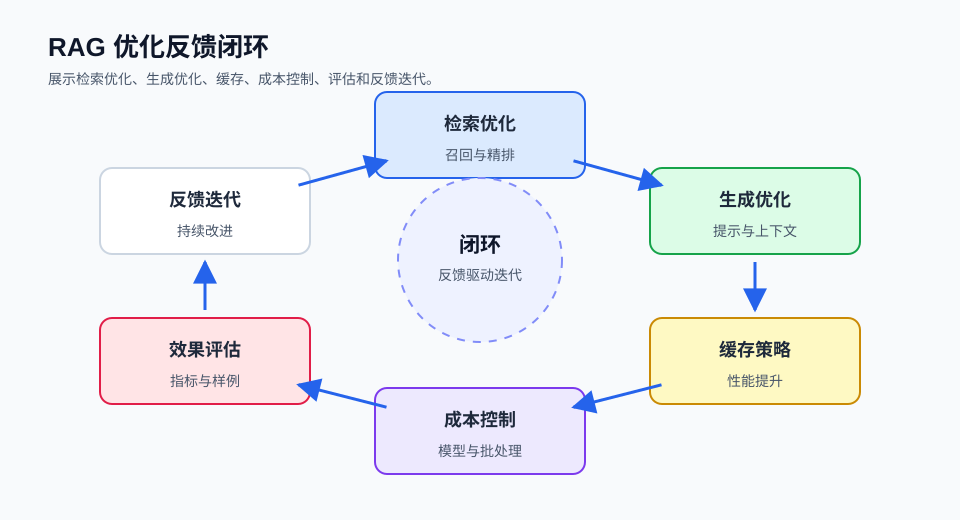

## 概述

RAG 系统的性能直接影响用户体验和系统成本。本篇将详细介绍各种优化策略，帮助你构建高效、可靠的 RAG 应用。



### 优化维度

```
┌─────────────────────────────────────────────────────────────────────┐
│                       RAG 优化维度                                    │
├─────────────────────────────────────────────────────────────────────┤
│                                                                      │
│  ┌─────────────┐    ┌─────────────┐    ┌─────────────┐            │
│  │   检索      │    │   生成      │    │   架构      │            │
│  │   优化      │    │   优化      │    │   优化      │            │
│  └─────────────┘    └─────────────┘    └─────────────┘            │
│                                                                      │
│  ├─ 向量维度     ├─ Prompt设计    ├─ 缓存策略                     │
│  ├─ 索引类型     ├─ 模型选择     ├─ 异步处理                     │
│  ├─ 批量检索     ├─ 参数调优     ├─ 负载均衡                     │
│  └─ 缓存机制     └─ 上下文压缩   └─ 水平扩展                     │
│                                                                      │
└─────────────────────────────────────────────────────────────────────┘
```

## 检索优化

### 1. 向量维度优化

根据模型特性选择合适维度：

```python
from langchain_openai import OpenAIEmbeddings

embeddings = OpenAIEmbeddings(model="text-embedding-3-small")

text = "测试文本"
vector = embeddings.embed_query(text)

print(f"向量维度: {len(vector)}")
```

### 2. 索引参数调优

```python
from langchain_community.vectorstores import Chroma

vectorstore = Chroma(
    collection_name="optimized_collection",
    embedding_function=embeddings,
    collection_metadata={"hnsw:space": "cosine"}
)
```

### 3. 检索参数优化

```python
retriever = vectorstore.as_retriever(
    search_type="mmr",
    search_kwargs={
        "k": 5,
        "fetch_k": 20,
        "lambda_mult": 0.5
    }
)
```

### 4. 批量检索

```python
from concurrent.futures import ThreadPoolExecutor

def batch_retrieve(queries, vectorstore, k=5):
    results = {}

    with ThreadPoolExecutor(max_workers=10) as executor:
        futures = {
            executor.submit(vectorstore.similarity_search, query, k): query
            for query in queries
        }

        for future in futures:
            query = futures[future]
            results[query] = future.result()

    return results

queries = ["查询1", "查询2", "查询3"]
batch_results = batch_retrieve(queries, vectorstore)
```

### 5. 异步检索

```python
import asyncio

async def async_retrieve(vectorstore, queries, k=5):
    tasks = [
        vectorstore.asimilarity_search(query, k=k)
        for query in queries
    ]

    results = await asyncio.gather(*tasks)

    return dict(zip(queries, results))

async def main():
    results = await async_retrieve(vectorstore, queries)
    return results

batch_results = asyncio.run(main())
```

## 生成优化

### 1. Prompt 模板优化

```python
from langchain_core.prompts import PromptTemplate

optimized_prompt = PromptTemplate.from_template(
    """你是一个专业的{domain}助手。请基于以下上下文信息回答问题。

    [规则]
    1. 如果上下文中有明确答案，直接引用回答
    2. 如果上下文不足，明确说明"信息不足"
    3. 回答要简洁、有条理

    上下文：
    {context}

    问题：{question}

    回答："""
)

chain = optimized_prompt | llm
```

### 2. 上下文压缩

```python
def compress_context(context, max_length=4000):
    if len(context) <= max_length:
        return context

    compressed = context[:max_length]
    compressed += "\n\n[上文已压缩]"

    return compressed

context = compress_context(full_context, max_length=4000)
```

### 3. 分块生成

```python
def chunked_generate(context, question, llm, max_context=4000):
    context_chunks = []
    current_chunk = ""
    docs = context.split("\n\n")

    for doc in docs:
        if len(current_chunk) + len(doc) <= max_context:
            current_chunk += doc + "\n\n"
        else:
            context_chunks.append(current_chunk)
            current_chunk = doc + "\n\n"

    if current_chunk:
        context_chunks.append(current_chunk)

    answers = []
    for i, chunk in enumerate(context_chunks):
        answer = llm.invoke(f"基于以下上下文回答问题：\n{chunk}\n\n问题：{question}")
        answers.append(answer.content)

    final_prompt = f"综合以下答案，给出最终回答：\n" + "\n".join(answers)
    final_answer = llm.invoke(final_prompt)

    return final_answer.content
```

### 4. 模型选择策略

```python
def select_model(query_complexity, cache):
    if cache.get(query):
        return "gpt-3.5-turbo"

    if query_complexity == "simple":
        return "gpt-3.5-turbo"
    elif query_complexity == "moderate":
        return "gpt-4"
    else:
        return "gpt-4-turbo"

complexity = assess_complexity(query)
model = select_model(complexity, cache)
```

## 缓存策略

### 1. 查询结果缓存

```python
from functools import lru_cache
import hashlib

class QueryCache:
    def __init__(self, maxsize=1000):
        self.cache = {}
        self.maxsize = maxsize
        self.access_order = []

    def get(self, query):
        query_hash = self._hash(query)

        if query_hash in self.cache:
            self.access_order.remove(query_hash)
            self.access_order.append(query_hash)
            return self.cache[query_hash]

        return None

    def set(self, query, result):
        query_hash = self._hash(query)

        if len(self.cache) >= self.maxsize:
            oldest = self.access_order.pop(0)
            del self.cache[oldest]

        self.cache[query_hash] = result
        self.access_order.append(query_hash)

    def _hash(self, query):
        return hashlib.md5(query.encode()).hexdigest()

cache = QueryCache(maxsize=1000)
```

### 2. 向量缓存

```python
from langchain_core.embeddings import Embeddings

class CachedEmbeddings(Embeddings):
    def __init__(self, embeddings, cache):
        self.embeddings = embeddings
        self.cache = cache

    def embed_query(self, text):
        cached = self.cache.get(f"query:{text}")
        if cached:
            return cached

        embedding = self.embeddings.embed_query(text)
        self.cache.set(f"query:{text}", embedding)

        return embedding

    def embed_documents(self, texts):
        return [
            self.embed_query(text) for text in texts
        ]
```

### 3. 相似问题缓存

```python
class SimilarityCache:
    def __init__(self, embeddings, threshold=0.95):
        self.embeddings = embeddings
        self.threshold = threshold
        self.cache = {}
        self.cache_vectors = {}

    def get_cached(self, query):
        query_vec = self.embeddings.embed_query(query)

        for cached_query, cached_data in self.cache.items():
            cached_vec = self.cache_vectors[cached_query]

            similarity = self._cosine_similarity(query_vec, cached_vec)

            if similarity >= self.threshold:
                return cached_data

        return None

    def set_cached(self, query, result):
        query_vec = self.embeddings.embed_query(query)
        self.cache[query] = result
        self.cache_vectors[query] = query_vec

    def _cosine_similarity(self, vec1, vec2):
        import numpy as np
        vec1, vec2 = np.array(vec1), np.array(vec2)
        return np.dot(vec1, vec2) / (np.linalg.norm(vec1) * np.linalg.norm(vec2))
```

## 成本优化

### 1. Token 用量监控

```python
class TokenMonitor:
    def __init__(self):
        self.total_tokens = 0
        self.prompt_tokens = 0
        self.completion_tokens = 0

    def track(self, usage_metadata):
        self.prompt_tokens += usage_metadata.get("prompt_tokens", 0)
        self.completion_tokens += usage_metadata.get("completion_tokens", 0)
        self.total_tokens = self.prompt_tokens + self.completion_tokens

    def get_cost(self, prompt_price=0.0015, completion_price=0.002):
        prompt_cost = self.prompt_tokens * prompt_price / 1000
        completion_cost = self.completion_tokens * completion_price / 1000

        return {
            "total_cost": prompt_cost + completion_cost,
            "prompt_cost": prompt_cost,
            "completion_cost": completion_cost,
            "total_tokens": self.total_tokens
        }

monitor = TokenMonitor()
```

### 2. 动态模型选择

```python
def dynamic_model_selection(query, context_available):
    if context_available < 1000:
        return "gpt-3.5-turbo"

    if context_available < 5000:
        return "gpt-4"

    return "gpt-4-turbo"

model = dynamic_model_selection(query, len(context))
```

### 3. 上下文优化减少 Token

```python
def optimize_context(context, max_tokens=6000):
    words = context.split()
    target_words = int(max_tokens * 0.75)

    if len(words) <= target_words:
        return context

    return " ".join(words[:target_words])

optimized_context = optimize_context(context)
```

## 并发优化

### 1. 异步 RAG

```python
import asyncio
from langchain_core.messages import HumanMessage

class AsyncRAG:
    def __init__(self, vectorstore, llm):
        self.vectorstore = vectorstore
        self.llm = llm

    async def query(self, query):
        # 向量检索
        docs = await self.vectorstore.asimilarity_search(query, k=5)
        context = "\n\n".join([doc.page_content for doc in docs])

        # 构造消息并异步调用 LLM
        prompt = f"上下文：{context}\n\n问题：{query}"
        response = await self.llm.ainvoke([HumanMessage(content=prompt)])

        return {
            "answer": response.content,
            "sources": docs
        }

    async def batch_query(self, queries):
        tasks = [self.query(q) for q in queries]
        return await asyncio.gather(*tasks)

# 使用示例（需在异步上下文中执行）
# async def main():
#     async_rag = AsyncRAG(vectorstore, llm)
#     results = await async_rag.batch_query(["查询1", "查询2", "查询3"])
#     return results
#
# results = asyncio.run(main())
```

### 2. 并发检索

```python
from concurrent.futures import ThreadPoolExecutor
import asyncio

class ConcurrentRAG:
    def __init__(self, vectorstore, llm, max_workers=10):
        self.vectorstore = vectorstore
        self.llm = llm
        self.executor = ThreadPoolExecutor(max_workers=max_workers)

    def retrieve_sync(self, query):
        return self.vectorstore.similarity_search(query, k=5)

    def batch_retrieve(self, queries):
        futures = [
            self.executor.submit(self.retrieve_sync, query)
            for query in queries
        ]

        return [f.result() for f in futures]

concurrent_rag = ConcurrentRAG(vectorstore, llm, max_workers=20)
```

## 效果评估

### 1. 检索质量评估

```python
def evaluate_retrieval(test_cases, retriever):
    from typing import List

    metrics = {
        "precision": [],
        "recall": [],
        "mrr": []
    }

    for case in test_cases:
        query = case["query"]
        relevant_docs = set(case["relevant_docs"])

        retrieved_docs = retriever.invoke(query)
        retrieved_set = set([doc.page_content for doc in retrieved_docs])

        precision = len(retrieved_set & relevant_docs) / len(retrieved_set) if retrieved_set else 0
        recall = len(retrieved_set & relevant_docs) / len(relevant_docs) if relevant_docs else 0

        metrics["precision"].append(precision)
        metrics["recall"].append(recall)

        if retrieved_set & relevant_docs:
            first_relevant = next(
                i for i, doc in enumerate(retrieved_docs)
                if doc.page_content in relevant_docs
            )
            metrics["mrr"].append(1 / (first_relevant + 1))
        else:
            metrics["mrr"].append(0)

    return {
        "avg_precision": sum(metrics["precision"]) / len(metrics["precision"]),
        "avg_recall": sum(metrics["recall"]) / len(metrics["recall"]),
        "avg_mrr": sum(metrics["mrr"]) / len(metrics["mrr"])
    }
```

### 2. 生成质量评估

```python
import re

def calculate_relevance(answer, query):
    """简单的相关性评估：基于词项重合度"""
    query_terms = set(re.findall(r'\w+', query.lower()))
    answer_terms = set(re.findall(r'\w+', answer.lower()))

    overlap = len(query_terms & answer_terms)
    return overlap / len(query_terms) if query_terms else 0

def calculate_accuracy(answer, expected):
    """简单准确性评估：检查 expected 是否在 answer 中"""
    return 1.0 if expected in answer else 0.5

def calculate_coherence(answer):
    """简单连贯性评估：基于句子数量"""
    sentences = [s for s in re.split(r'[。.!?！？]', answer) if s.strip()]
    return min(1.0, len(sentences) / 5)

def evaluate_generation(test_cases, rag_chain):
    """评估生成质量。

    Args:
        test_cases: 测试用例列表，每个用例含 query 和 expected_answer
        rag_chain: RAG 链对象，需要有 invoke 或 query 方法
    """
    metrics = {
        "relevance": [],
        "accuracy": [],
        "coherence": []
    }

    for case in test_cases:
        # rag_chain 应提供统一的调用接口
        result = rag_chain.invoke({"query": case["query"]})
        answer = result if isinstance(result, str) else result.get("answer", "")
        expected = case["expected_answer"]

        relevance = calculate_relevance(answer, case["query"])
        accuracy = calculate_accuracy(answer, expected)
        coherence = calculate_coherence(answer)

        metrics["relevance"].append(relevance)
        metrics["accuracy"].append(accuracy)
        metrics["coherence"].append(coherence)

    return {
        "avg_relevance": sum(metrics["relevance"]) / len(metrics["relevance"]),
        "avg_accuracy": sum(metrics["accuracy"]) / len(metrics["accuracy"]),
        "avg_coherence": sum(metrics["coherence"]) / len(metrics["coherence"])
    }
```

## 生产部署优化

### 1. 健康检查

```python
import time
from fastapi import FastAPI
from pydantic import BaseModel

app = FastAPI()
_start_time = time.time()

# 这些状态检查函数需根据实际部署实现
def is_vectorstore_ready() -> bool:
    # 实际实现中应检查向量数据库连接
    return True

def is_llm_ready() -> bool:
    # 实际实现中应检查 LLM 服务可用性
    return True

def get_uptime() -> float:
    return time.time() - _start_time

class HealthResponse(BaseModel):
    status: str
    vectorstore: bool
    llm: bool
    uptime: float

@app.get("/health", response_model=HealthResponse)
async def health_check():
    return HealthResponse(
        status="healthy",
        vectorstore=is_vectorstore_ready(),
        llm=is_llm_ready(),
        uptime=get_uptime()
    )
```

### 2. 限流保护

```python
import time
from collections import defaultdict

class RateLimiter:
    def __init__(self, max_requests=100, window=60):
        self.max_requests = max_requests
        self.window = window
        self.requests = defaultdict(list)

    def is_allowed(self, user_id):
        now = time.time()

        self.requests[user_id] = [
            t for t in self.requests[user_id]
            if now - t < self.window
        ]

        if len(self.requests[user_id]) >= self.max_requests:
            return False

        self.requests[user_id].append(now)
        return True

rate_limiter = RateLimiter(max_requests=100, window=60)

@app.middleware("http")
async def rate_limit_middleware(request, call_next):
    user_id = request.client.host

    if not rate_limiter.is_allowed(user_id):
        return JSONResponse(
            status_code=429,
            content={"error": "请求过于频繁"}
        )

    return await call_next(request)
```

### 3. 优雅降级

```python
class GracefulDegradation:
    def __init__(self, primary_rag, fallback_rag):
        """优雅降级包装器。

        Args:
            primary_rag: 主 RAG 系统，需有 chat(query) 方法
            fallback_rag: 降级 RAG 系统，需有 chat(query) 方法
        """
        self.primary = primary_rag
        self.fallback = fallback_rag

    def query(self, query):
        try:
            return self.primary.chat(query)
        except Exception as e:
            print(f"主系统异常: {e}, 切换到降级模式")

            try:
                return self.fallback.chat(query)
            except Exception as fallback_error:
                print(f"降级系统也异常: {fallback_error}")
                return {
                    "answer": "服务暂时不可用，请稍后再试",
                    "sources": []
                }

# 使用示例
# primary_rag = SomeRAGSystem()  # 主 RAG 系统
# simple_rag = SimpleRAG()  # 简化的降级 RAG 系统
# degradation = GracefulDegradation(primary_rag, simple_rag)
# result = degradation.query("用户问题")
```

## 监控与告警

### 1. 性能监控

```python
import time
from prometheus_client import Counter, Histogram, Gauge

request_count = Counter("rag_requests_total", "Total requests")
request_duration = Histogram("rag_request_duration_seconds", "Request duration")
retrieval_quality = Gauge("rag_retrieval_quality", "Retrieval quality score")

@app.middleware("http")
async def monitor_middleware(request, call_next):
    request_count.inc()
    start_time = time.time()

    response = await call_next(request)

    duration = time.time() - start_time
    request_duration.observe(duration)

    return response
```

### 2. 异常告警

```python
class AlertSystem:
    def __init__(self, threshold_error_rate=0.05):
        self.threshold_error_rate = threshold_error_rate
        self.total_requests = 0
        self.failed_requests = 0

    def track_request(self, success=True):
        self.total_requests += 1
        if not success:
            self.failed_requests += 1

        error_rate = self.failed_requests / self.total_requests

        if error_rate > self.threshold_error_rate:
            self.send_alert(f"错误率过高: {error_rate:.2%}")

    def send_alert(self, message):
        print(f"🚨 告警: {message}")

alert = AlertSystem(threshold_error_rate=0.05)
```

## 最佳实践

### 优化策略选择

| 场景 | 优化策略 | 预期效果 |
|------|---------|---------|
| **检索慢** | 优化索引参数 | 延迟降低 50% |
| **生成慢** | 使用更快的模型 | 延迟降低 60% |
| **成本高** | 缓存 + 简单模型 | 成本降低 70% |
| **质量差** | 重排序 + 混合检索 | 准确率提升 20% |
| **并发低** | 异步 + 并发 | 吞吐量提升 5x |

### 性能瓶颈排查

```python
def diagnose_performance():
    print("=== RAG 性能诊断 ===")

    print("\n1. 检索延迟:")
    start = time.time()
    vectorstore.similarity_search("test", k=5)
    print(f"   检索延迟: {(time.time() - start) * 1000:.2f}ms")

    print("\n2. 嵌入延迟:")
    start = time.time()
    embeddings.embed_query("test")
    print(f"   嵌入延迟: {(time.time() - start) * 1000:.2f}ms")

    print("\n3. 生成延迟:")
    start = time.time()
    llm.invoke("test")
    print(f"   生成延迟: {(time.time() - start):.2f}s")

    print("\n4. 向量数据库大小:")
    print(f"   集合大小: {vectorstore._collection.count()}")

diagnose_performance()
```

## 总结

| 优化方向 | 具体策略 | 效果 |
|---------|---------|------|
| **检索优化** | 索引调优、批量检索 | 延迟降低 |
| **生成优化** | Prompt 优化、上下文压缩 | 质量提升 |
| **成本优化** | 缓存、模型选择 | 成本降低 |
| **架构优化** | 异步、并发、降级 | 稳定性提升 |

RAG 优化是一个持续的过程，需要根据实际运行情况进行针对性调优。

## 后续内容

本系列后续将深入讲解：
- 多模态 RAG
- RAG 与 Agents 结合
- 生产级 RAG 最佳实践
