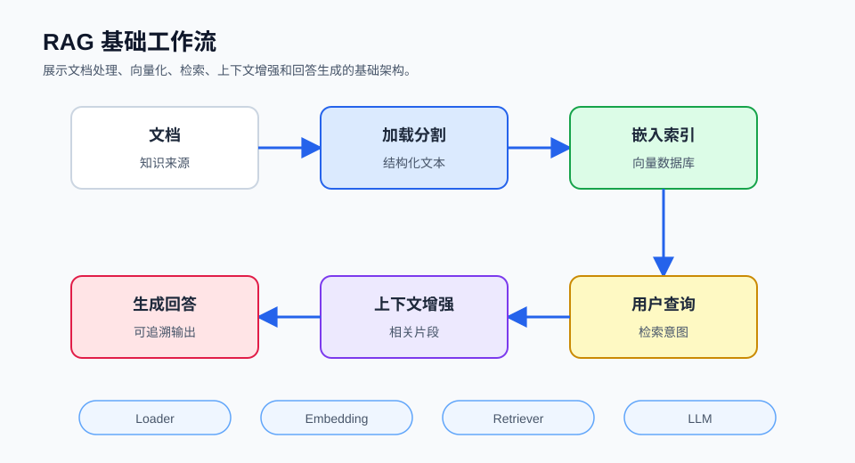

## 概述

RAG（Retrieval-Augmented Generation，检索增强生成）是一种结合了信息检索和语言模型生成的技术架构。它通过从外部知识库中检索相关信息，然后将这些信息作为上下文提供给语言模型，从而生成更准确、更可靠的回答。



### 为什么需要 RAG？

尽管大型语言模型（LLM）具有强大的生成能力，但它们存在一些固有的局限性：

| 问题 | 描述 | RAG 解决方案 |
|------|------|-------------|
| **知识过时** | 训练数据有时间限制 | 实时检索最新信息 |
| **幻觉问题** | 可能生成看似合理但错误的答案 | 基于真实检索内容生成 |
| **私有知识缺失** | 无法访问内部文档和数据 | 接入私有知识库 |
| **长尾知识** | 罕见信息在训练数据中不足 | 扩展外部知识库 |
| **无法验证** | 难以确定回答的准确性 | 提供可追溯的来源 |

### RAG vs 微调

| 特性 | RAG | 微调 (Fine-tuning) |
|------|-----|---------------------|
| **成本** | 低 | 高 |
| **实时性** | 高（可实时更新知识库） | 低（需要重新训练） |
| **可解释性** | 强（可追溯检索来源） | 弱 |
| **灵活性** | 高（可更换知识库） | 低 |
| **适用场景** | 需要最新知识 | 需要特定风格/格式 |

## 核心概念

### RAG 工作流程

```
┌─────────────────────────────────────────────────────────────────────┐
│                        RAG 工作流程                                  │
├─────────────────────────────────────────────────────────────────────┤
│                                                                      │
│  ┌─────────┐    ┌─────────┐    ┌─────────┐    ┌─────────┐        │
│  │  文档   │ →  │  加载   │ →  │  分割   │ →  │  向量化  │        │
│  └─────────┘    └─────────┘    └─────────┘    └─────────┘        │
│                                                              │
│  ┌─────────┐    ┌─────────┐    ┌─────────┐    ┌─────────┐        │
│  │  用户   │ →  │  检索   │ →  │  增强   │ →  │  生成   │        │
│  │  查询   │    │  相关   │    │  上下文 │    │  回答   │        │
│  └─────────┘    └─────────┘    └─────────┘    └─────────┘        │
│                                                                      │
└─────────────────────────────────────────────────────────────────────┘
```

### 核心组件

| 组件 | 功能 | 常见技术 |
|------|------|---------|
| **数据加载器** | 从各种来源加载文档 | LangChain Loaders, LlamaIndex Readers |
| **文本分割器** | 将长文档分割成小块 | RecursiveCharacterTextSplitter |
| **嵌入模型** | 将文本转为向量 | OpenAI Embeddings, HuggingFace |
| **向量数据库** | 存储和检索向量 | Chroma, FAISS, Pinecone, Milvus |
| **检索器** | 根据查询找到相关文档 | VectorRetriever, BM25 |
| **生成模型** | 基于上下文生成回答 | GPT-4, Claude, Llama |

## 技术架构详解

### 1. 数据处理层

负责将各种格式的文档转换为可处理的文本：

```python
# 导入LangChain的文档加载器和文本分割器
from langchain_community.document_loaders import TextLoader, PyPDFLoader
from langchain.text_splitter import RecursiveCharacterTextSplitter

# 加载PDF文档
loader = PyPDFLoader("document.pdf")
documents = loader.load()

# 创建文本分割器
# chunk_size: 每个文本块的字符数
# chunk_overlap: 相邻块之间的重叠字符数
splitter = RecursiveCharacterTextSplitter(
    chunk_size=1000,
    chunk_overlap=200
)

# 将文档分割成小块
chunks = splitter.split_documents(documents)

print(f"加载了 {len(documents)} 个文档")
print(f"分割成 {len(chunks)} 个文本块")
```

### 2. 向量存储层

将文本块转换为向量并存储：

```python
# 导入嵌入模型和向量数据库
from langchain_openai import OpenAIEmbeddings
from langchain_community.vectorstores import Chroma

# 创建嵌入模型（将文本转为向量）
embeddings = OpenAIEmbeddings(model="text-embedding-3-small")

# 从文档块创建向量数据库
vectorstore = Chroma.from_documents(
    documents=chunks,           # 文本块列表
    embedding=embeddings,       # 嵌入模型
    persist_directory="./chroma_db"  # 持久化存储目录
)

# 保存向量数据库到磁盘
vectorstore.persist()
```

### 3. 检索层

根据用户查询找到最相关的文档：

```python
# 将向量数据库转换为检索器
retriever = vectorstore.as_retriever(
    search_type="similarity",   # 使用相似度搜索
    search_kwargs={"k": 5}       # 返回最相似的5个结果
)

# 执行检索
relevant_docs = retriever.invoke("用户查询内容")

# 遍历并打印检索结果
for i, doc in enumerate(relevant_docs):
    print(f"文档 {i+1}: {doc.page_content[:100]}...")
    print(f"相似度: {doc.metadata}")
```

### 4. 生成层

将检索到的上下文与用户查询结合，生成回答：

```python
# 导入LangChain组件
from langchain_openai import ChatOpenAI
from langchain_core.prompts import PromptTemplate
from langchain_core.output_parsers import StrOutputParser

# 创建LLM实例
llm = ChatOpenAI(model="gpt-4")

# 创建提示词模板
prompt = PromptTemplate.from_template(
    """基于以下上下文回答问题。如果上下文中没有相关信息，请如实说明。

    上下文：
    {context}

    问题：{question}

    回答："""
)

# 构建生成链
chain = prompt | llm | StrOutputParser()

# 将检索到的文档内容合并为上下文
context = "\n\n".join([doc.page_content for doc in relevant_docs])

# 生成回答
answer = chain.invoke({
    "context": context,
    "question": "用户的问题"
})

print(answer)
```

## RAG 类型

### 1. Naive RAG（基础 RAG）

最简单的 RAG 形式，直接检索-生成：

```python
def naive_rag(query, vectorstore, llm):
    # 步骤1：检索相关文档
    docs = vectorstore.similarity_search(query, k=5)
    
    # 步骤2：构建上下文
    context = "\n\n".join([d.page_content for d in docs])

    # 步骤3：构建提示词并生成回答
    prompt = f"""基于以下上下文回答：
    {context}

    问题：{query}
    回答："""

    return llm.invoke(prompt)
```

### 2. RAG with Filtering（带过滤的 RAG）

在检索后添加质量过滤：

```python
from langchain_core.docstore.document import Document

def filtered_rag(query, vectorstore, llm, similarity_threshold=0.7):
    # 步骤1：检索更多候选文档
    docs = vectorstore.similarity_search_with_score(query, k=10)

    # 步骤2：过滤低相似度文档
    # 注意：similarity_search_with_score 返回的是距离（distance），越小越相似
    # L2 距离范围 [0, +∞)，余弦距离范围 [0, 2]
    filtered_docs = [
        doc for doc, score in docs
        if score < similarity_threshold  # 距离小于阈值才保留
    ]

    # 如果没有足够相关的文档
    if not filtered_docs:
        return "未找到足够相关的信息"

    # 步骤3：使用前5个高质量文档生成回答
    context = "\n\n".join([d.page_content for d in filtered_docs[:5]])
    return generate_response(context, query, llm)
```

### 3. RAG with Reranking（带重排序的 RAG）

使用重排序模型提升检索质量：

```python
def reranked_rag(query, vectorstore, reranker, llm, top_k=20, final_k=5):
    # 步骤1：初步检索，获取更多候选
    initial_docs = vectorstore.similarity_search(query, k=top_k)

    # 步骤2：使用重排序模型优化排序
    reranked_docs = reranker.rerank(query, initial_docs, top_n=final_k)

    # 步骤3：使用重排序后的文档生成回答
    context = "\n\n".join([doc.page_content for doc in reranked_docs])

    return generate_response(context, query, llm)
```

### 4. Multi-Modal RAG（多模态 RAG）

支持图像、音频等多种模态：

```python
from langchain_openai import ChatOpenAI

class MultiModalRAG:
    def __init__(self, vectorstore, image_processor, llm):
        self.vectorstore = vectorstore
        self.image_processor = image_processor
        self.llm = llm

    def query(self, query, include_images=True):
        # 检索相关文档
        docs = self.vectorstore.similarity_search(query)

        # 构建多模态上下文
        contexts = []
        for doc in docs:
            # 根据文档类型处理内容
            if doc.metadata.get("type") == "text":
                contexts.append(doc.page_content)
            elif doc.metadata.get("type") == "image" and include_images:
                # 对图像进行描述
                image_desc = self.image_processor.describe(doc.page_content)
                contexts.append(f"[图片描述]: {image_desc}")

        # 合并上下文并生成回答
        full_context = "\n\n".join(contexts)
        return self.llm.invoke(f"基于以下内容回答：{full_context}\n\n问题：{query}")
```

## 应用场景

| 场景 | 说明 | 示例 |
|------|------|------|
| **企业知识库** | 员工自助查询 | 公司制度、产品文档 |
| **客服系统** | 智能客服问答 | 产品支持、售后咨询 |
| **教育培训** | 学习资料问答 | 课程内容、题库解答 |
| **医疗健康** | 医疗信息咨询 | 症状分析、药物说明 |
| **法律咨询** | 法律条文检索 | 法规解读、案例分析 |
| **代码助手** | 代码文档问答 | API文档、代码解释 |

## 优势与局限

### RAG 的优势

1. **知识时效性** - 可以实时更新知识库，无需重新训练模型
2. **可解释性** - 答案可以追溯到具体来源，便于验证
3. **成本效益** - 相比训练/微调，成本更低
4. **灵活性** - 轻松切换不同知识库或领域
5. **隐私保护** - 敏感数据可保留在本地

### RAG 的局限

1. **检索依赖** - 检索质量直接影响回答质量
2. **上下文限制** - 受限于模型的上下文窗口大小
3. **延迟增加** - 需要额外的检索和上下文构建时间
4. **重复性** - 复杂问题可能需要多次检索

## 总结

| 组件 | 作用 | 关键技术 |
|------|------|---------|
| **数据处理** | 加载和分割文档 | Loaders, TextSplitters |
| **向量化** | 文本转向量 | Embeddings |
| **存储检索** | 高效存储和检索 | VectorDB |
| **生成** | 基于上下文生成 | LLM, Prompts |

RAG 是构建智能问答系统的核心技术，通过将检索与生成相结合，可以显著提升 LLM 应用的准确性和可靠性。

## 后续内容

本系列后续将深入讲解：
- 数据处理与文档分割
- 向量嵌入与向量数据库
- 高级检索策略
- RAG 性能优化
- 多模态 RAG 与 Agents
