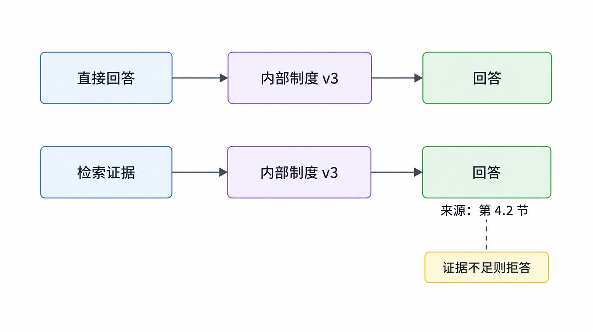
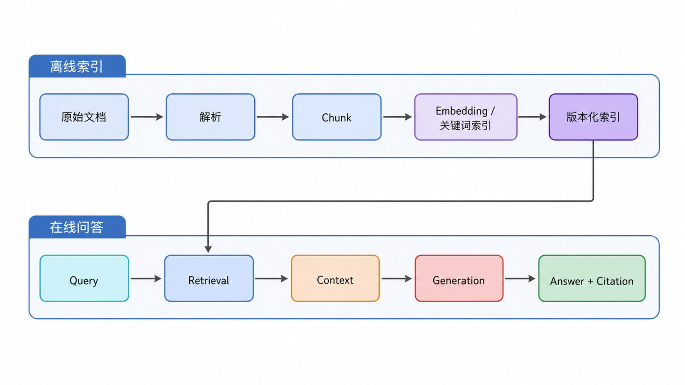
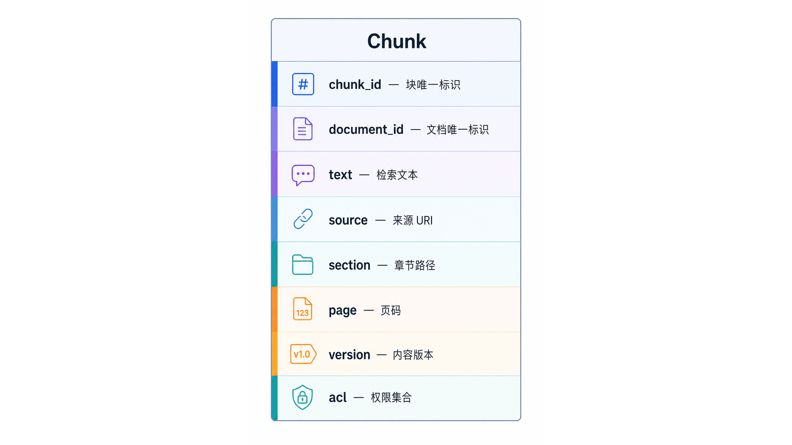
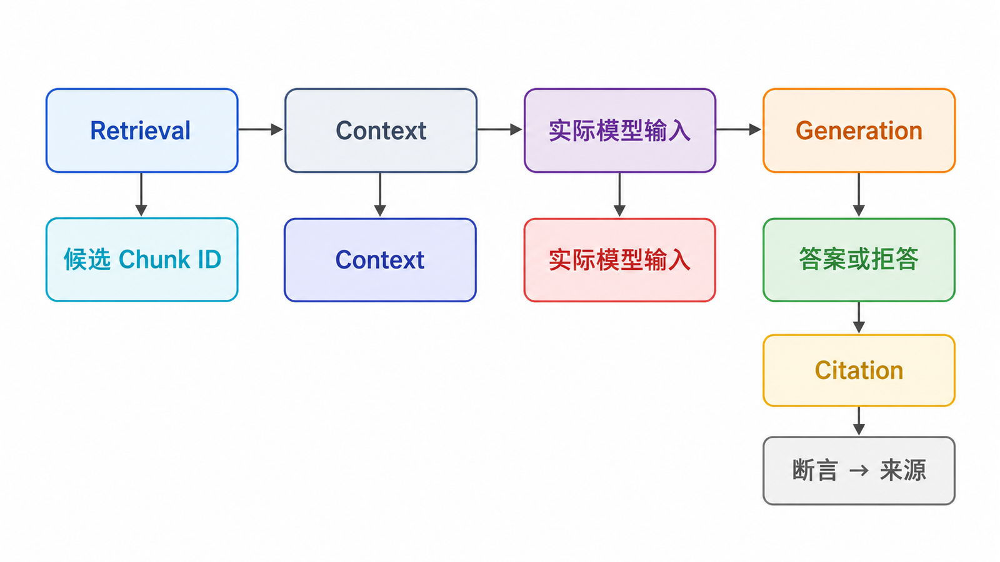
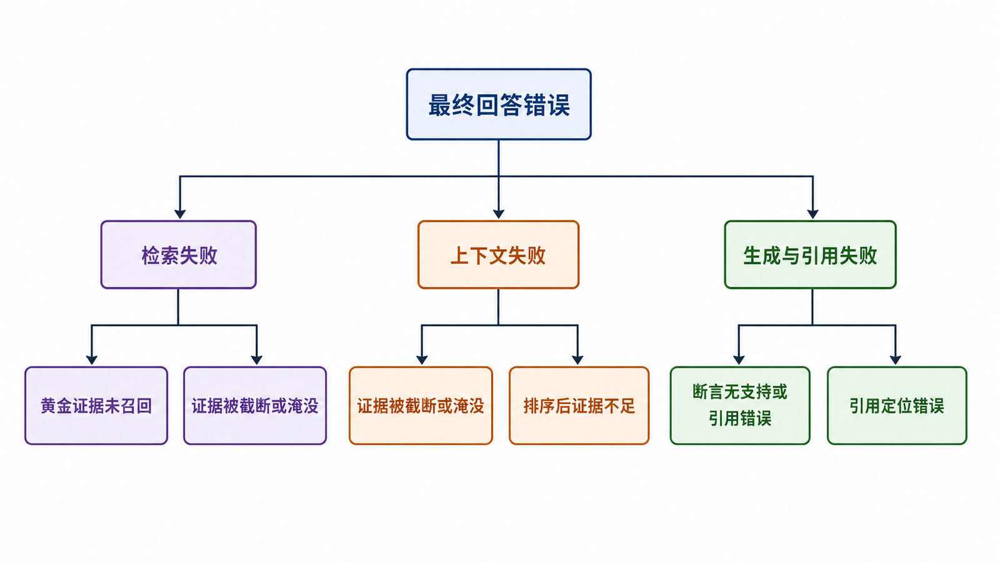
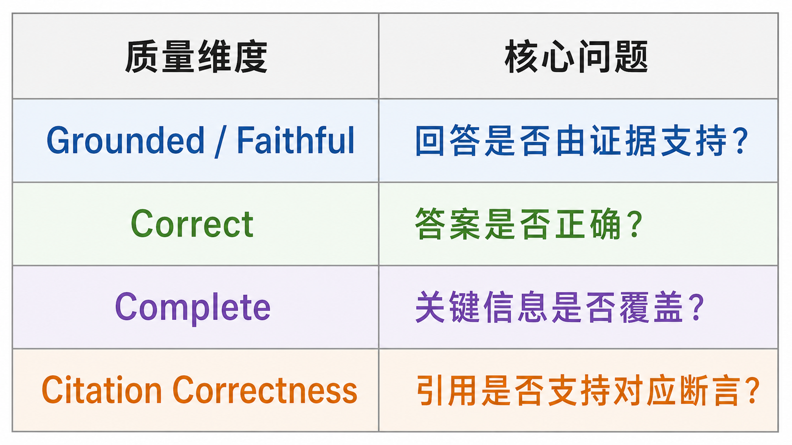
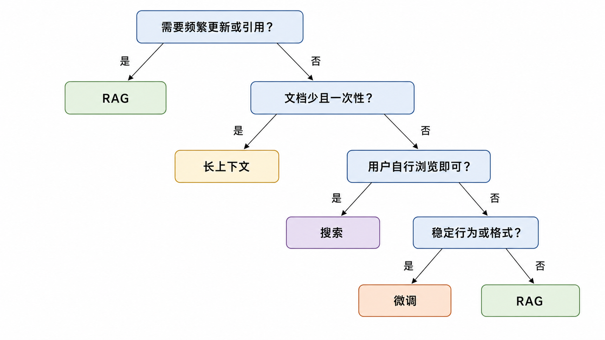
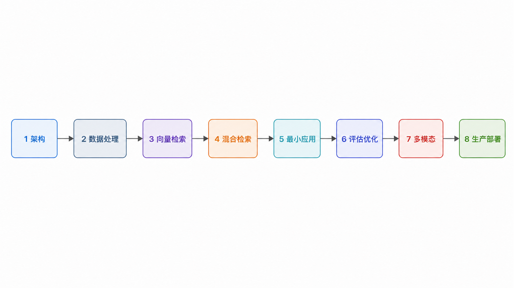

## 前置知识与学习目标

阅读本文前，你只需要了解 Python 函数、HTTP API 和“向量可以表示对象”这三个概念。读完后，你应该能够：

- 画出 RAG 的离线索引链路和在线问答链路。
- 区分检索失败、上下文失败和生成失败。
- 解释为什么“有引用”不代表“引用支持答案”。
- 判断一个需求更适合 RAG、长上下文、搜索还是微调。

全文使用同一个问题：

> 员工问：“差旅住宿费超过标准时，需要谁审批？”

假设公司制度第 4.2 节写明：“超过城市住宿标准的申请，须由直属部门负责人审批，并在报销单中说明原因。”

## 为什么直接询问模型不够



模型参数中可能没有这份内部制度，也可能记住旧版本。即使回答听起来合理，也无法证明答案来自当前有效文件。RAG 的价值不是“让模型知道更多”这么简单，而是把可更新、可授权、可追踪的外部证据带入回答过程。

RAG 仍然不能自动保证正确：检索器可能漏掉第 4.2 节，分块可能截断条件，生成模型也可能把“部门负责人”改写成“财务负责人”。因此系统必须同时保留证据、评估每个阶段，并在证据不足时拒答。

## 两条链路：离线索引与在线问答



### 离线索引链路



离线链路把原始文件转换成可检索的知识单元：

```text
原始文档
  → 解析与清洗
  → 分块 Chunk
  → 元数据与权限
  → Embedding / 关键词索引
  → 可版本化索引
```

一个 Chunk 不应只保存正文。最小数据契约应包含稳定标识和来源定位：

```json
{
  "chunk_id": "travel-policy:v3:section-4.2:0",
  "document_id": "travel-policy:v3",
  "text": "超过城市住宿标准的申请……",
  "source": "差旅管理制度.pdf",
  "section": "4.2 超标准审批",
  "page": 7,
  "version": "3.0",
  "acl": ["employee"]
}
```

`chunk_id` 用于评测和去重，`document_id + version` 用于更新与删除，`source + page/section` 用于引用，`acl` 用于检索前的权限约束。只有文本而没有这些字段，系统很难可靠更新、审计和引用。

### 在线问答链路



```text
用户问题
  → 身份与权限
  → 查询理解
  → 候选召回
  → 融合与重排序
  → 上下文构建
  → 受约束生成
  → 引用校验与回答
```

在线链路至少产生四类可观测结果：

| 阶段       | 产物                 | 最先要问的问题                 |
| ---------- | -------------------- | ------------------------------ |
| Retrieval  | 候选 Chunk ID 与分数 | 正确证据是否进入候选集？       |
| Context    | 实际送给模型的 Chunk | 证据是否完整、去重且未超预算？ |
| Generation | 答案或拒答           | 每个关键断言是否由上下文支持？ |
| Citation   | 断言到来源的映射     | 引用是否真的蕴含该断言？       |

## RAG 的最小机制

RAG 可以抽象成三个函数：

```python
from dataclasses import dataclass
from typing import Protocol

@dataclass(frozen=True)
class Chunk:
    chunk_id: str
    text: str
    source: str
    locator: str

class Retriever(Protocol):
    def search(self, query: str, *, k: int) -> list[Chunk]: ...

class Generator(Protocol):
    def answer(self, query: str, context: list[Chunk]) -> str: ...

def rag(query: str, retriever: Retriever, generator: Generator) -> dict:
    context = retriever.search(query, k=5)
    if not context:
        return {"answer": "现有资料不足，无法回答。", "sources": []}

    answer = generator.answer(query, context)
    return {
        "answer": answer,
        "sources": [
            {"chunk_id": c.chunk_id, "source": c.source, "locator": c.locator}
            for c in context
        ],
    }
```

这段代码刻意没有绑定框架。真正重要的是接口边界：检索返回稳定 Chunk，生成只使用经过权限过滤和预算控制的上下文，引用来自结构化元数据，而不是从模型自由文本里猜出来。

## 三层失败模型



### 1. 检索失败

正确证据没有进入候选集。常见原因包括：

- Query 和文档措辞差异过大。
- Chunk 切得过碎或过长。
- Embedding 模型不适合领域或语言。
- 关键词、编号、专有名词只依赖语义检索。
- ACL 或元数据过滤条件错误。

此时调整提示词通常无效，应先检查 Recall@k 和漏检样本。

### 2. 上下文失败

正确证据已经召回，却在去重、压缩、重排或 Token 截断后丢失；也可能被大量相似但无关的 Chunk 淹没。此时要查看“召回候选”和“实际 Context”之间的差异，而不是只看最终答案。

### 3. 生成与引用失败

上下文正确，模型仍可能：

- 添加上下文没有给出的条件。
- 混淆两个版本或两个主体。
- 在证据不足时不恰当地给出确定答案。
- 给出真实来源，但该来源并不支持对应断言。

因此需要分别评估答案正确性、忠实性和引用正确性。

## Grounded、Correct 与 Complete 不相同



| 维度                 | 问题                             | 可能出现的反例                   |
| -------------------- | -------------------------------- | -------------------------------- |
| Grounded / Faithful  | 答案是否只陈述上下文支持的内容？ | 忠实复述了一份已经过期的制度     |
| Correct              | 答案是否符合真实、有效的事实？   | 上下文缺页，答案忠实但不正确     |
| Complete             | 是否覆盖问题要求的全部关键点？   | 只回答审批人，没有说明需填写原因 |
| Citation Correctness | 引用是否蕴含对应断言？           | 引用了同一 PDF 的错误页码        |

这四个维度不能用一个“准确率”代替。

## RAG、长上下文、搜索与微调如何选择



| 方案     | 更适合                                   | 主要限制                     |
| -------- | ---------------------------------------- | ---------------------------- |
| RAG      | 大量、持续更新、需要引用或权限过滤的知识 | 检索和索引带来额外复杂度     |
| 长上下文 | 文档集合小且一次性、需要跨全文综合       | 成本、延迟与注意力稀释       |
| 搜索     | 用户需要浏览结果和自行判断来源           | 不直接形成受约束的综合答案   |
| 微调     | 固定行为、格式、语气或稳定任务模式       | 不适合频繁注入可追踪的新事实 |

它们可以组合。例如用搜索或向量索引找证据，用长上下文综合少量文档，再用微调后的模型稳定输出格式。但组合越多，越需要独立评测每个环节。

## 最小验收清单

一个基础 RAG 原型至少应回答以下问题：

1. 每个 Chunk 能否定位回原文？
2. 删除或更新文档后，旧 Chunk 是否会从索引消失？
3. 黄金证据能否在 Top-k 中找到？
4. 没有证据时系统是否拒答？
5. 用户是否只能检索自己有权访问的内容？
6. 回答中的关键断言是否能映射到具体 Chunk？
7. 是否记录检索、重排、生成和总延迟？

## 常见误区

### “向量数据库就是 RAG”

向量库只是检索基础设施之一。解析、分块、关键词检索、权限过滤、上下文构建、生成、引用和评测都不由它自动解决。

### “Top-1 分数很高，所以答案可靠”

分数通常只在同一模型、同一索引和同一查询配置内有意义。高相似度也不等于文档蕴含答案。

### “把来源列表附在答案后面就完成了引用”

来源列表只能证明系统检索过这些内容。可靠引用需要建立“具体断言 → 支持该断言的 Chunk”映射。

### “RAG 能消除幻觉”

RAG 可以提供证据并降低部分事实错误，但也引入检索遗漏、恶意文档、版本冲突和错误引用等新失败模式。

## 自检题

<details>
<summary>1. 正确 Chunk 位于召回第 12 名，但系统只取 Top-5。首先应该优化哪一层？</summary>

首先检查检索层，提高候选召回或修正查询、分块和索引策略。只改生成提示词无法让模型看到第 12 名证据。

</details>

<details>
<summary>2. 回答完全复述了上下文，但上下文来自旧制度。这属于哪类问题？</summary>

答案可能是 faithful，却不 correct。根因在知识版本、索引更新或过滤，而不是模型是否忠实。

</details>

<details>
<summary>3. 为什么评测时应使用 chunk_id，而不是比较 page_content 是否完全相等？</summary>

文本可能经过清洗、截断或格式变化；稳定 ID 能表示同一知识单元，并支持版本、去重和定位。

</details>

## 总结与下一篇



RAG 是一条可观测的证据流水线，而不是“向量库加聊天模型”的单一调用。后续所有优化都应回到四个问题：证据是否被正确构建、正确召回、正确使用并正确引用。

下一篇将进入离线索引的第一步：怎样把 PDF、Markdown 和网页转换成结构稳定、可追踪、可更新的 Chunk。

## 对应资料来源

- [Retrieval-Augmented Generation for Knowledge-Intensive NLP Tasks](https://arxiv.org/abs/2005.11401)
- [Dense Passage Retrieval for Open-Domain Question Answering](https://arxiv.org/abs/2004.04906)
- [ARES: An Automated Evaluation Framework for RAG Systems](https://arxiv.org/abs/2311.09476)
- [NIST AI RMF: Generative Artificial Intelligence Profile](https://www.nist.gov/publications/artificial-intelligence-risk-management-framework-generative-artificial-intelligence)

> 验证说明：本文的核心接口使用 Python Protocol 表达，不依赖特定 RAG 框架版本。
