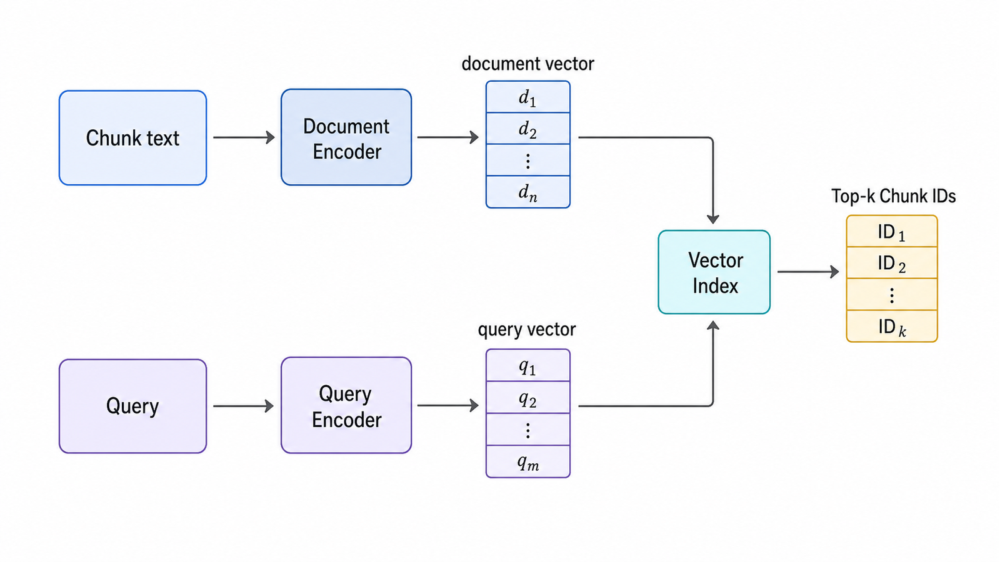
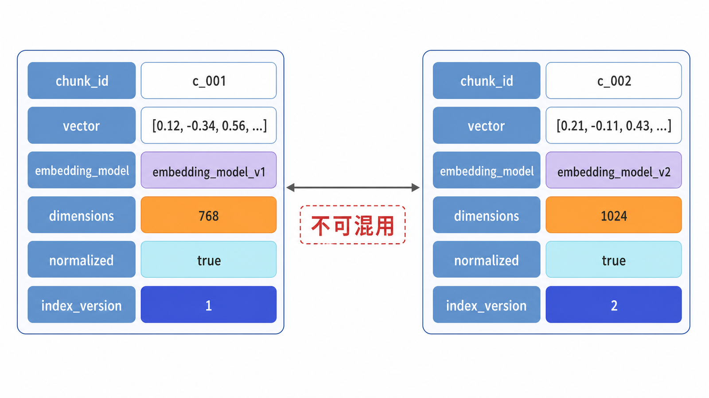
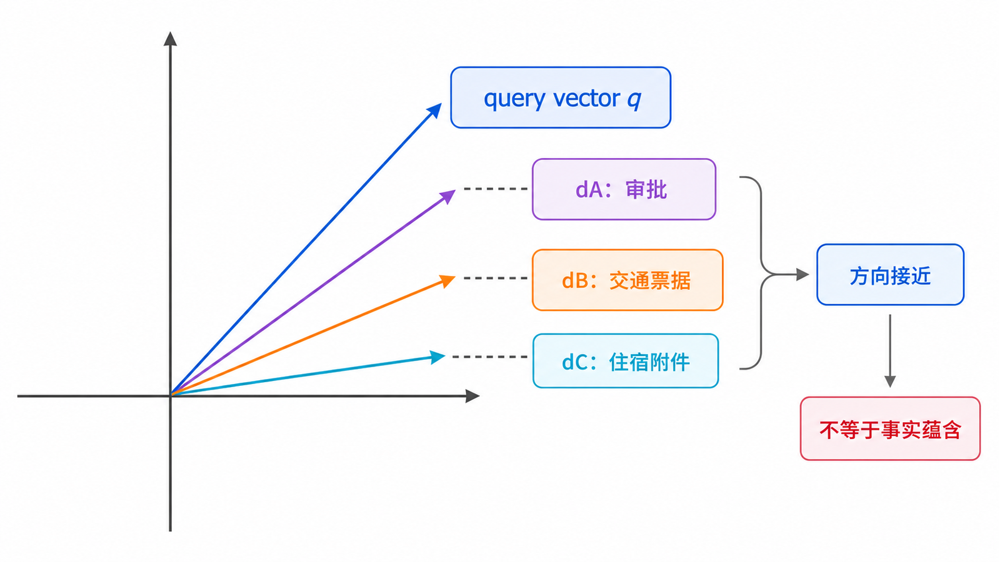
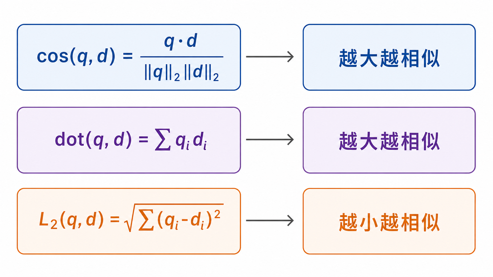
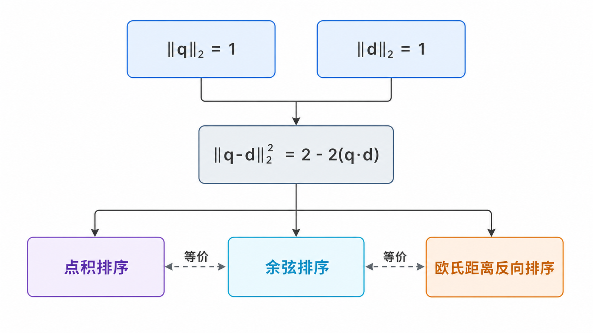
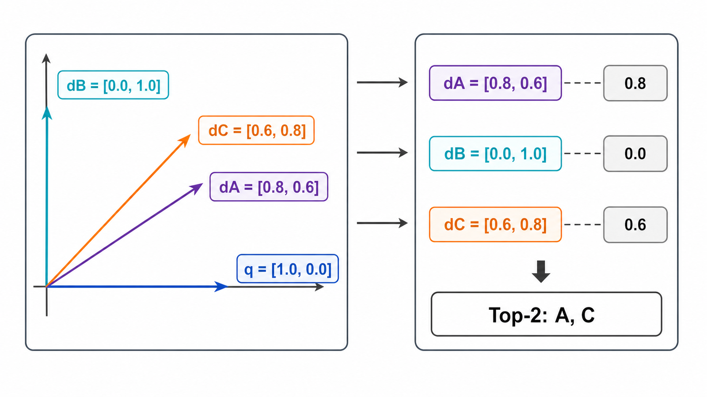
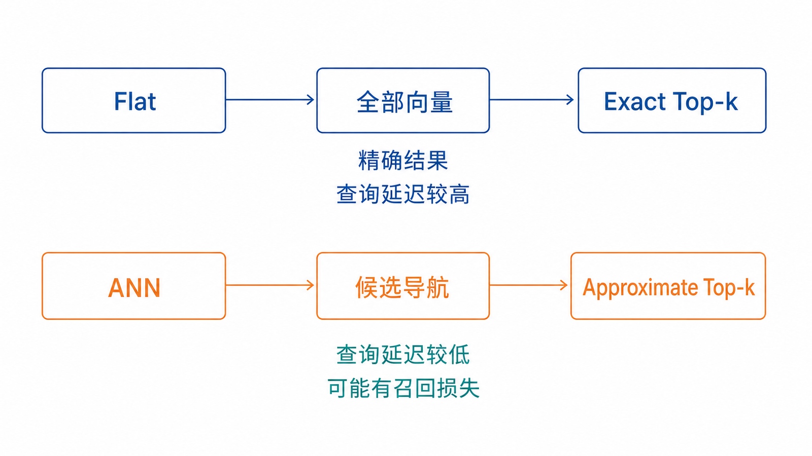
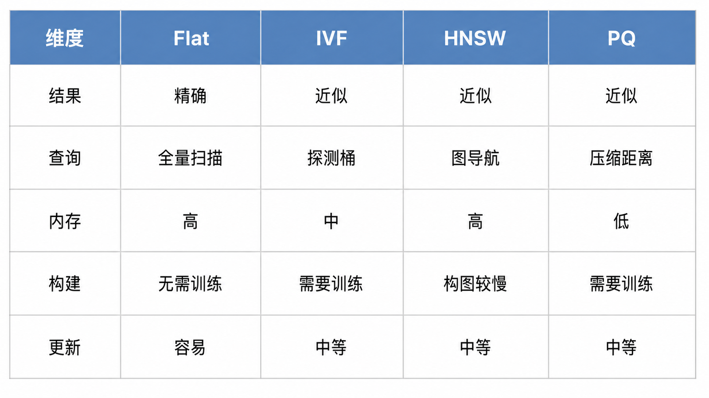
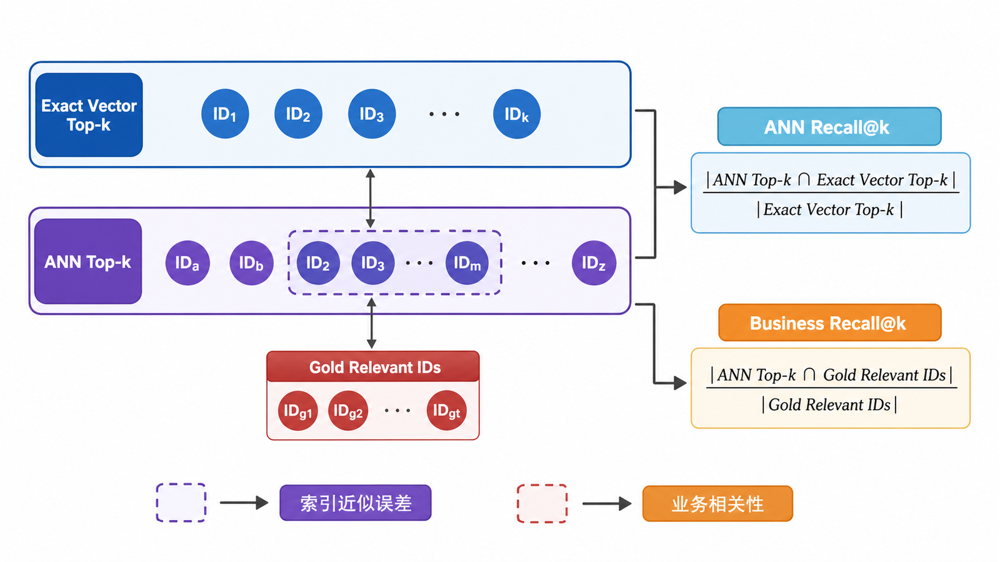
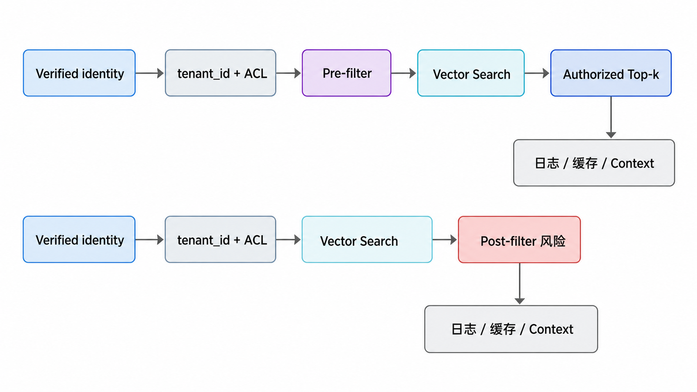

## 前置知识与学习目标

你需要了解向量、点积和平方根。读完后，你应该能够：

- 解释文档和查询如何进入同一个向量空间。
- 手算余弦相似度、点积和欧氏距离，并判断排序方向。
- 说明为什么不同模型或不同距离函数的分数不能直接比较。
- 区分精确检索与 ANN，解释 HNSW、IVF 的召回—延迟—内存权衡。
- 用稳定 Chunk ID 评估向量索引，而不是凭几个主观查询判断效果。

## 从文本到候选 Chunk



```text
离线：Chunk text ──Embedding model──> document vector ──> index
在线：Query      ──Embedding model──> query vector    ──> Top-k IDs
```

Embedding 模型把文本映射为固定维度向量。相近向量表示模型认为文本在训练目标下具有较强相关性；它不保证事实相同、逻辑蕴含或答案正确。

## Embedding 数据契约



向量索引至少需要记录：

```python
from dataclasses import dataclass

@dataclass(frozen=True)
class VectorRecord:
    chunk_id: str
    vector: tuple[float, ...]
    embedding_model: str
    dimensions: int
    normalized: bool
    index_version: str
```

模型、维度或归一化方式变化时，旧向量通常不能与新向量混在同一个索引里。迁移时应创建新索引版本、重新嵌入并运行回归评测。

## 使用 OpenAI Embeddings API

模型名由环境变量配置，避免教程把某个时点的默认模型写死：

```python
import os
from openai import OpenAI

client = OpenAI()
embedding_model = os.environ["OPENAI_EMBEDDING_MODEL"]

def embed_texts(texts: list[str]) -> list[list[float]]:
    if not texts or any(not text.strip() for text in texts):
        raise ValueError("Embedding 输入不能为空")

    response = client.embeddings.create(
        model=embedding_model,
        input=texts,
        encoding_format="float",
    )
    ordered = sorted(response.data, key=lambda item: item.index)
    vectors = [item.embedding for item in ordered]

    dimensions = {len(vector) for vector in vectors}
    if len(dimensions) != 1:
        raise ValueError(f"向量维度不一致: {dimensions}")
    return vectors
```

批量请求可减少网络开销，但必须同时满足当前模型和 API 的单输入、批量及总 Token 限制。限制可能变化，生产代码应从官方文档和实际错误响应验证，而不是复制教程常数。

## 三种距离如何影响排序







设查询向量 $q$，文档向量 $d$。

### 余弦相似度

$$
\operatorname{cos}(q,d)=\frac{q\cdot d}{\lVert q\rVert_2\lVert d\rVert_2}
$$

值越大通常越相似。它关注方向，忽略向量长度。

### 点积

$$
\operatorname{dot}(q,d)=q\cdot d=\sum_i q_i d_i
$$

值越大通常越相似，同时受方向和长度影响。

### 欧氏距离

$$
L_2(q,d)=\sqrt{\sum_i(q_i-d_i)^2}
$$

距离越小越相似。注意它与前两者的排序方向相反。

当所有向量都做 L2 归一化时：

$$
\lVert q-d\rVert_2^2=2-2(q\cdot d)
$$

因此归一化向量上的点积、余弦相似度和欧氏距离会产生等价排序；未归一化时不能直接套用这个结论。

## 一个可手算的 Top-k 例子



查询与三个文档已经归一化：

```text
q  = [1.0, 0.0]
dA = [0.8, 0.6]  “超标住宿需要部门负责人审批”
dB = [0.0, 1.0]  “交通票据粘贴规范”
dC = [0.6, 0.8]  “住宿发票与附件要求”
```

点积为：

- $q\cdot d_A=0.8$
- $q\cdot d_B=0.0$
- $q\cdot d_C=0.6$

所以 Top-2 为 A、C。这个例子只解释排序，不证明 A 必然蕴含真实答案；后续仍需重排和生成校验。

## 最小精确检索实现

```python
import math

def cosine_similarity(a: list[float], b: list[float]) -> float:
    if len(a) != len(b) or not a:
        raise ValueError("向量必须非空且维度相同")
    dot = sum(x * y for x, y in zip(a, b, strict=True))
    norm_a = math.sqrt(sum(x * x for x in a))
    norm_b = math.sqrt(sum(y * y for y in b))
    if norm_a == 0 or norm_b == 0:
        raise ValueError("零向量没有定义余弦相似度")
    return dot / (norm_a * norm_b)

def exact_top_k(query, records, k: int):
    if k <= 0:
        return []
    scored = [
        (record["chunk_id"], cosine_similarity(query, record["vector"]))
        for record in records
    ]
    return sorted(scored, key=lambda item: item[1], reverse=True)[:k]
```

精确检索遍历全部向量，是验证小数据集和 ANN 召回率的重要基准。

## 为什么需要 ANN





当向量数量增大，逐个计算距离的成本会上升。Approximate Nearest Neighbor 用可控的召回损失换取更低延迟或更少计算。

| 索引 | 基本思想               | 优点                     | 代价                           |
| ---- | ---------------------- | ------------------------ | ------------------------------ |
| Flat | 与所有向量精确比较     | 结果精确、基准可靠       | 查询成本随数据量线性增长       |
| IVF  | 先查最近的若干聚类桶   | 可控制扫描范围           | 需要训练；桶和探测数影响召回   |
| HNSW | 在多层近邻图上导航     | 常见场景下低延迟、高召回 | 图结构占内存；构建和更新有成本 |
| PQ   | 压缩向量并近似计算距离 | 显著节省存储与带宽       | 量化误差影响排序               |

不存在只按“文档数量”就能决定数据库或索引的可靠规则。选择还取决于：

- 向量维度和数据分布。
- 目标 Recall@k 与 p95 延迟。
- 内存、磁盘和构建时间。
- 过滤选择性与多租户隔离。
- 更新、删除和备份要求。
- 团队运维能力与成本。

## HNSW 与 IVF 的关键参数



不同实现的参数名可能不同，但概念一致。

### HNSW

- 构图连接度：更大通常提高召回，也增加内存和构建成本。
- 构建搜索宽度：更大通常改善图质量，但构建更慢。
- 查询搜索宽度：更大通常提高召回，但查询更慢。

### IVF

- 聚类桶数量：影响桶粒度和训练成本。
- 查询探测桶数量：探测越多，通常召回越高、延迟越大。

参数调优必须与精确 Top-k 对照：

$$
\operatorname{ANNRecall@k}=\frac{|\operatorname{ANNTopK}\cap\operatorname{ExactTopK}|}{k}
$$

这里评估的是索引近似误差，不是业务相关性。业务 Recall@k 则要与人工标注的相关 Chunk 比较，两者不能混为一谈。

## 过滤与向量检索的顺序



元数据过滤有两种常见策略：

- Pre-filter：先按 tenant、ACL、日期等缩小候选，再做向量检索。
- Post-filter：先做向量检索，再过滤结果。

Post-filter 可能导致最终结果不足 k 条，甚至把未经授权的候选暴露给缓存和日志。权限约束优先采用实现能够保证的安全 Pre-filter 或租户隔离索引，并通过越权测试验证。

## 分数的解释边界

以下做法都不可靠：

- 把余弦相似度与 BM25 分数直接相加。
- 把数据库返回的 distance 当作统一的 0–1 置信度。
- 用固定阈值跨语言、跨模型、跨索引版本部署。
- 看到 Top-1 分数高就认为答案正确。

阈值应在代表性数据集上校准，并记录距离函数、模型、归一化方式和索引版本。

## 评测设计

每个测试用例至少包含：

```python
test_cases = [
    {
        "query": "住宿超标需要谁审批？",
        "relevant_chunk_ids": {"travel-policy:v3:section-4.2:0"},
    },
    {
        "query": "制度里有没有海外差旅宠物托运规定？",
        "relevant_chunk_ids": set(),
    },
]
```

同时记录：

- Recall@k、MRR 或 nDCG。
- 平均、p50、p95 查询延迟。
- 每个查询实际候选数。
- 索引大小、构建时间和内存。
- 无答案查询的分数分布。

不要只展示三个“看起来不错”的查询。

## 常见误区

- 把 Embedding 相似理解成事实蕴含。
- 混用不同维度或不同模型的向量。
- 忽略 distance 与 similarity 的排序方向。
- 只调 ANN 参数，不与 Flat 精确结果比较。
- 用 ANN Recall 代替业务相关性 Recall。
- 按数据规模一项指标选择向量数据库。
- 在权限过滤后置的情况下声称实现了租户隔离。

## 自检题

<details>
<summary>1. 已归一化向量使用点积与余弦相似度时，排序为什么一致？</summary>

归一化后两个向量范数都为 1，余弦公式的分母为 1，因此余弦值等于点积。

</details>

<details>
<summary>2. ANN Recall@10 达到 0.99，是否代表业务 Recall@10 也达到 0.99？</summary>

不代表。前者只说明 ANN 近似结果接近精确向量 Top-10；如果 Embedding 本身没有把业务相关文档排进精确 Top-10，业务召回仍然可能很差。

</details>

<details>
<summary>3. 为什么不能把数据库返回的 0.18 直接称为“82% 相关”？</summary>

返回值可能是距离、相似度或经过实现转换的分数，其范围与含义取决于距离函数和数据库。除非经过明确定义与校准，否则不能解释为概率。

</details>

## 总结与下一篇

向量检索的核心不是选择一个数据库名称，而是建立清晰的数据契约、距离定义、精确基线和召回—延迟权衡。只有这样，后续混合检索和重排的改进才可测量。

下一篇将把 Dense Retrieval 与 BM25、过滤、RRF 和 Cross-Encoder 连接成完整检索漏斗。

## 对应资料来源

- [Dense Passage Retrieval for Open-Domain Question Answering](https://arxiv.org/abs/2004.04906)
- [Efficient and Robust Approximate Nearest Neighbor Search Using HNSW](https://arxiv.org/abs/1603.09320)
- [Faiss: A Library for Efficient Similarity Search](https://faiss.ai/)
- [OpenAI Embeddings API Reference](https://platform.openai.com/docs/api-reference/embeddings)
- [OpenAI text-embedding-3-large Model](https://developers.openai.com/api/docs/models/text-embedding-3-large)

> 验证说明：OpenAI 示例使用官方 Python SDK 接口；模型名从 `OPENAI_EMBEDDING_MODEL` 读取。部署前应按项目锁定 SDK 和模型快照或别名策略。
