## 前置知识与学习目标

本文假设你已经理解文本 RAG 的 Chunk、Embedding、混合检索和四层评测。读完后，你应该能够：

- 区分“先转成文本再检索”和“使用原生多模态向量”两类路径。
- 为图片区域、视频片段和音频时间段设计稳定定位信息。
- 说明跨模态检索为何需要共享空间或分数校准。
- 构建带页码、坐标和时间码的多模态引用。
- 分别评估解析、检索、答案和引用误差。

贯穿问题：

> “培训视频中演示住宿超标审批入口的画面出现在什么时候？”

答案必须定位到视频时间段，而不是只返回整段视频文件。

## 多模态 RAG 的完整链路

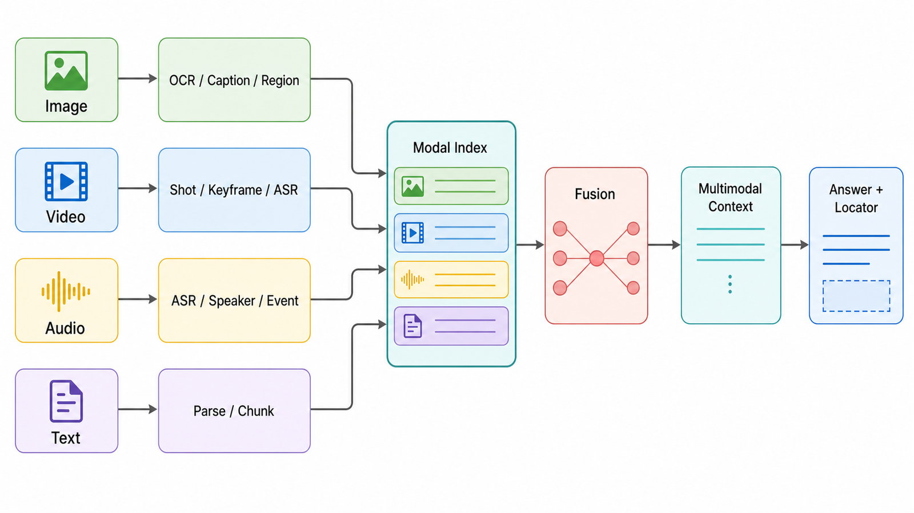

```text
图片 → OCR / Caption / Region embedding ─┐
视频 → Shot / Keyframe / ASR / Timestamp ├→ 模态索引 → 融合 → 多模态 Context
音频 → ASR / Speaker / Timestamp ─────────┤                    ↓
文本 → Parse / Chunk / Metadata ──────────┘             Answer + Locator
```

多模态系统首先是“可定位的数据系统”，其次才是模型能力展示。

## 两种索引路线

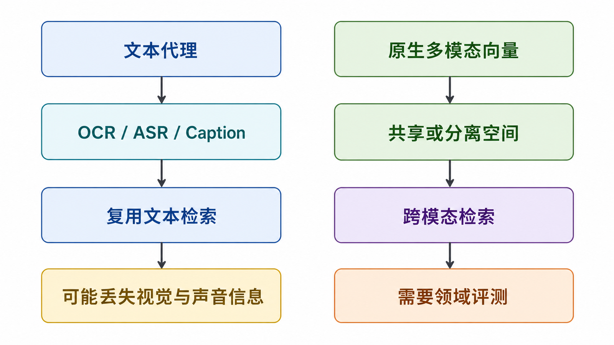

### 路线 A：文本代理

先把非文本内容转换为文本：

- 图片：OCR、Caption、图表结构描述。
- 视频：ASR、关键帧 Caption、镜头摘要。
- 音频：ASR、说话人和声音事件标签。

优点是可以复用成熟的文本检索和生成链路；缺点是转换过程会丢失颜色、布局、动作、语调等信息，且错误会层层传播。

### 路线 B：原生多模态向量

把文本和图像映射到共享空间，或分别建立图像、音频、视频向量索引。它能支持“用文字找图片”“用图片找相似画面”，但要确认模型是否真的支持目标模态对，并在自己的数据上评估跨模态召回。

两条路线常常并行：文本代理负责可解释关键词和 OCR，原生向量负责视觉或声音语义，再通过 Rank Fusion 合并。

## 统一资产与片段数据契约

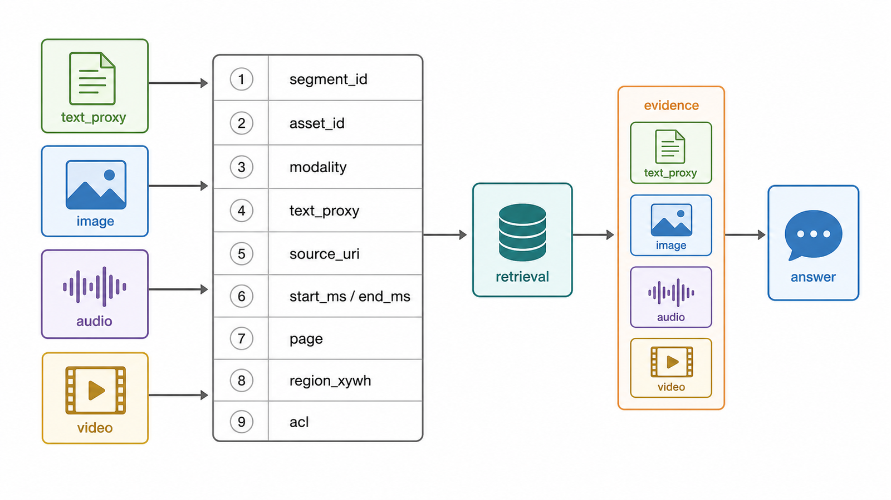

```python
from dataclasses import dataclass

@dataclass(frozen=True)
class MediaSegment:
    segment_id: str
    asset_id: str
    modality: str  # image, video, audio, text
    text_proxy: str
    source_uri: str
    start_ms: int | None = None
    end_ms: int | None = None
    page: int | None = None
    region_xywh: tuple[float, float, float, float] | None = None
    acl: frozenset[str] = frozenset()
```

- 视频与音频使用 `start_ms/end_ms`。
- PDF 图片使用页码和归一化 `region_xywh`。
- 单张独立图片也可以保存区域坐标。
- 所有派生产物必须能追溯到原始 `asset_id` 和处理流水线版本。

## 图像处理

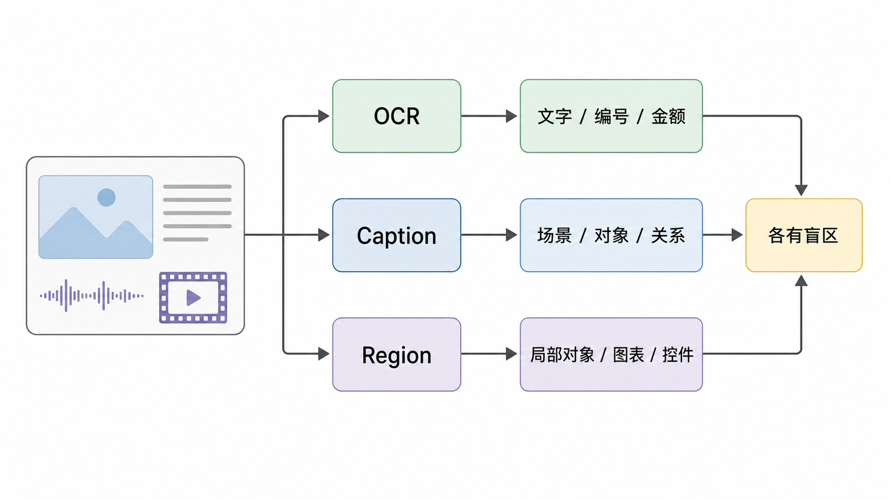

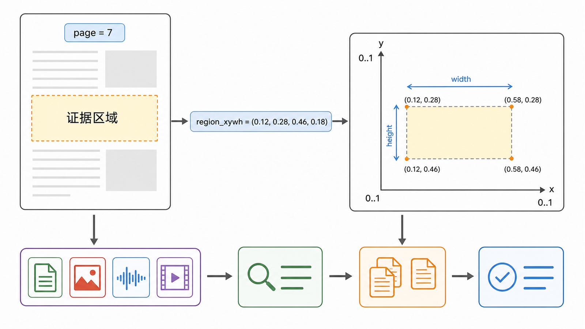

### OCR、Caption 与 Region 的职责

| 产物    | 擅长                         | 容易丢失                     |
| ------- | ---------------------------- | ---------------------------- |
| OCR     | 图片中的文字、编号、金额     | 非文字视觉语义、复杂表格结构 |
| Caption | 场景、对象和整体关系         | 小字、精确数值、局部细节     |
| Region  | 局部对象、图表区域、界面控件 | 全局关系和跨区域上下文       |

不要用一条泛化 Caption 代替 OCR，也不要把整页截图作为不可定位的单个 Chunk。

### 图像质量门

```python
def validate_region(region: tuple[float, float, float, float]) -> None:
    x, y, width, height = region
    if not all(0.0 <= value <= 1.0 for value in region):
        raise ValueError("坐标必须归一化到 0..1")
    if width == 0 or height == 0 or x + width > 1 or y + height > 1:
        raise ValueError("区域必须位于图像内部且面积大于 0")
```

还应记录 OCR 置信度、图像分辨率、旋转、语言和处理模型版本。低置信内容进入人工复核或降权支路，而不是静默当作事实。

## 视频处理

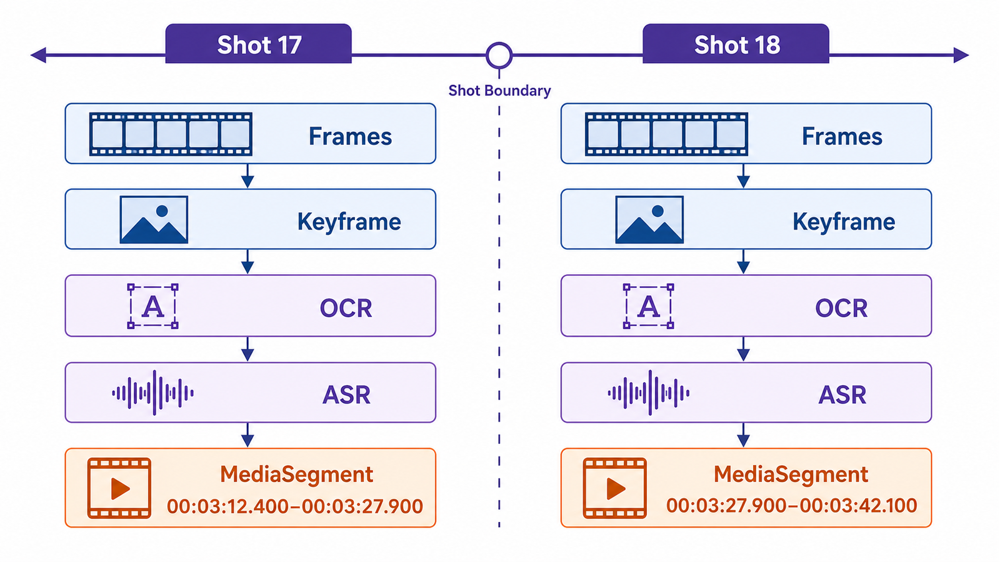

### 先分镜头，再选关键帧

固定每 N 秒抽一帧很简单，但可能漏掉短暂画面并产生大量重复帧。更稳妥的流程是：

1. 检测镜头边界。
2. 为每个镜头选择代表帧。
3. 对语音做 ASR 并保留词级或句级时间码。
4. 对关键帧做 OCR 与 Caption。
5. 将相邻、语义一致的片段组合成可检索 Segment。

### 时间对齐

```python
def overlaps(a_start: int, a_end: int, b_start: int, b_end: int) -> bool:
    return max(a_start, b_start) < min(a_end, b_end)

def align_transcript_to_shot(transcript_segments, shot):
    return [
        segment
        for segment in transcript_segments
        if overlaps(segment.start_ms, segment.end_ms, shot.start_ms, shot.end_ms)
    ]
```

生成回答时可以同时提供关键帧、OCR 和同时间段 ASR，但必须避免把相距很远的音频与画面错误对齐。

## 音频处理

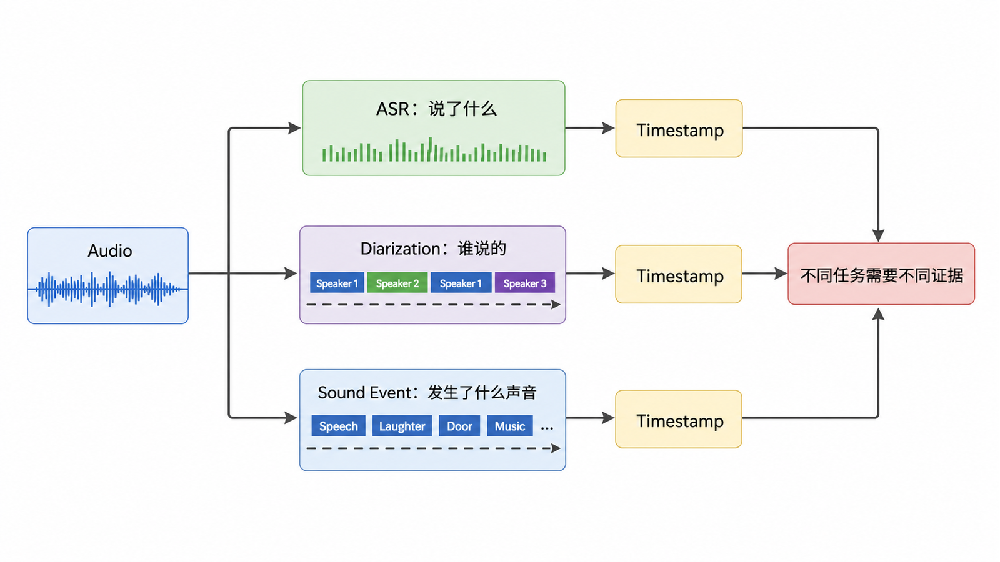

音频 RAG 不等于“转录文本 RAG”。可能需要保存：

- 说话人标签。
- 词或句子的时间码。
- 语言、置信度和重叠说话。
- 非语音事件，如警报、音乐或机械声。
- 原始音频片段 URI。

如果用户问“谁说了这句话”，ASR 文本本身不够，还需要可靠的 Speaker Diarization；如果问“哪里出现警报声”，则需要声音事件模型而非文本 Embedding。

## 跨模态检索与融合

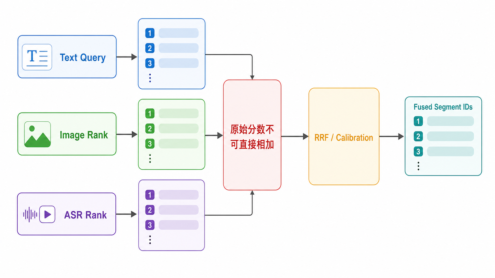

### 共享空间

Query 与多个模态由同一跨模态模型映射到共享空间时，可以直接形成候选排序。但模型在通用图片上的表现不能代表它能理解企业界面截图、医学影像或工业声音。

### 分离空间

图像、ASR、OCR 和文本可能使用不同检索器。它们的原始分数不可直接相加，可使用：

- RRF 等名次融合。
- 在标注集上做分数校准。
- 学习跨模态排序模型。

```python
def fuse_by_rank(results_by_modality: dict[str, list[str]], smooth: int = 60):
    scores: dict[str, float] = {}
    for ranking in results_by_modality.values():
        for rank, segment_id in enumerate(ranking, start=1):
            scores[segment_id] = scores.get(segment_id, 0.0) + 1 / (smooth + rank)
    return sorted(scores, key=lambda segment_id: (-scores[segment_id], segment_id))
```

融合键是稳定 `segment_id`。同一资产的相邻片段还需要时间去重或合并，避免上下文充满连续重复帧。

## 多模态 Context 构建

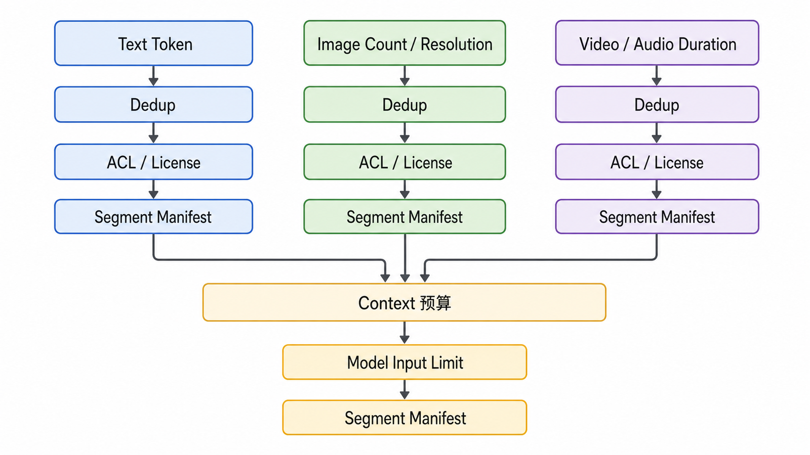

Context Builder 需要同时控制：

- 文本 Token。
- 图片数量与分辨率预算。
- 视频/音频片段数量与时长。
- 同一资产的重复覆盖。
- 模态支持和模型输入限制。
- 权限、版权和敏感信息。

建议以 Segment Manifest 记录实际输入：

```json
{
  "segment_id": "training-video:v2:shot-018",
  "source": "差旅系统培训.mp4",
  "locator": "00:03:12.400–00:03:27.900",
  "modalities": ["keyframe", "ocr", "asr"],
  "evidence": "画面显示‘超标准审批’，讲解说明由直属部门负责人审批"
}
```

## 引用粒度

| 模态          | 推荐 Locator                   |
| ------------- | ------------------------------ |
| PDF 文本      | 页码 + 章节 + Chunk ID         |
| PDF 图片/图表 | 页码 + 区域坐标                |
| 独立图片      | Asset ID + 区域坐标            |
| 视频          | 起止时间码 + 关键帧 ID         |
| 音频          | 起止时间码 + Speaker（如可靠） |

回答“03:12 附近”只能算粗定位；如果系统实际证据覆盖 03:12.400–03:27.900，应保留完整区间供用户复核。

## 误差传播

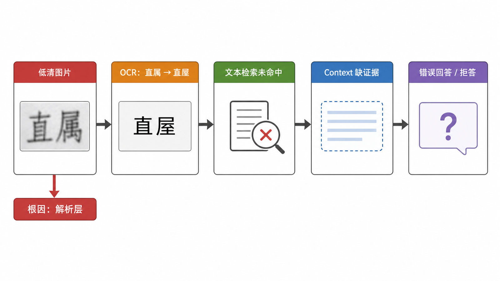

```text
低清图片
  → OCR 把“直属”识别成“直屋”
  → 文本检索未命中
  → Context 缺少正确证据
  → 模型拒答或错误回答
```

只评估最终答案会把根因误判为生成问题。多模态系统应保存每一步派生产物和置信信息，允许回放。

## 分模态评测

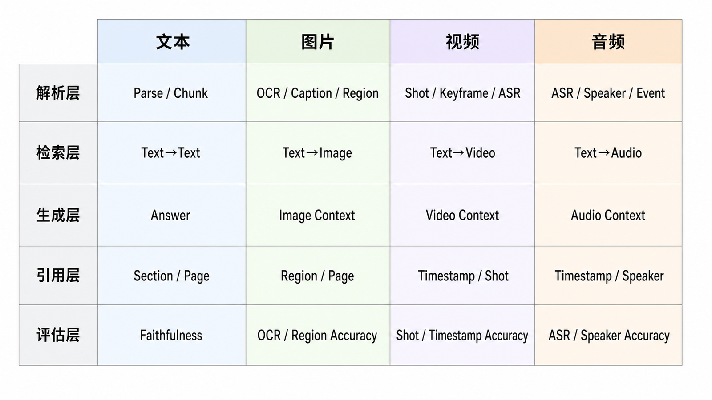

### 解析层

- OCR 字符/词错误率与关键字段准确率。
- ASR 词错误率、时间码误差。
- 镜头边界、关键帧覆盖和 Speaker 识别。

### 检索层

- Text→Image、Text→Video、Image→Image 等方向分别计算 Recall@k。
- 按模态、文档类型、语言和质量等级切片。
- 比较文本代理、原生向量和融合策略。

### 生成与引用层

- 答案是否由选中片段支持。
- 图片区域或时间码是否覆盖实际证据。
- 模态之间冲突时是否说明不确定性。
- 没有视觉或声音证据时是否拒答。

## 安全、隐私与版权

- OCR 和 ASR 可能提取屏幕、身份证、电话号码和私密对话。
- 图像、音频和视频中可以隐藏间接提示注入。
- 人脸、声纹和位置数据可能属于敏感个人信息。
- 检索结果必须继承原始资产 ACL 和许可范围。
- 生成缩略图、转录和 Embedding 也要遵守保留与删除策略。
- 对外展示片段前应确认版权与最小披露原则。

不要假设“只保存向量”就不涉及隐私或重识别风险。

## 常见误区

- 把多模态 RAG 简化为“给图片生成 Caption”。
- 为视频固定间隔抽帧却不评估短镜头漏检。
- 把不同模态的原始分数直接加权相加。
- 只返回整个视频文件，不提供时间码。
- 使用 ASR 文本回答“谁说的”，却没有 Speaker 证据。
- 把 OCR/ASR 错误归因于 LLM。
- 忽略多模态内容中的间接提示注入和隐私。

## 自检题

<details>
<summary>1. “用文字找截图中的按钮”为什么通常同时需要 OCR 与视觉检索？</summary>

OCR 擅长按钮文字，视觉检索能利用布局、图标和界面语义。并行召回再融合通常比单一路径覆盖更全面。

</details>

<details>
<summary>2. 视频检索命中正确文件，但时间码偏差一分钟，引用是否合格？</summary>

通常不合格。文件级命中不能替代片段级定位，应单独评估时间码是否覆盖真实证据。

</details>

<details>
<summary>3. 为什么图片相似度与 ASR 文本相似度不能直接相加？</summary>

它们来自不同模型和数值分布，没有共享概率尺度。应使用名次融合、校准或学习排序。

</details>

## 总结与下一篇

多模态 RAG 的难点不是支持更多文件扩展名，而是让每个派生片段可定位、可授权、可融合、可评测。文本代理和原生向量各有盲区，必须用分模态黄金集验证。

下一篇将把整个系列带入生产环境：索引控制面、在线服务、可观测性、安全、回滚和恢复演练。

## 对应资料来源

- [CLIP: Learning Transferable Visual Models From Natural Language Supervision](https://arxiv.org/abs/2103.00020)
- [Whisper: Robust Speech Recognition via Large-Scale Weak Supervision](https://arxiv.org/abs/2212.04356)
- [NIST AI RMF: Generative Artificial Intelligence Profile](https://www.nist.gov/publications/artificial-intelligence-risk-management-framework-generative-artificial-intelligence)
- [OWASP Prompt Injection Prevention Cheat Sheet](https://cheatsheetseries.owasp.org/cheatsheets/LLM_Prompt_Injection_Prevention_Cheat_Sheet.html)

> 验证说明：代码只表达跨模态数据与融合协议；具体 OCR、ASR、视觉和多模态模型必须根据数据、语言、许可和部署环境固定版本并独立评测。
