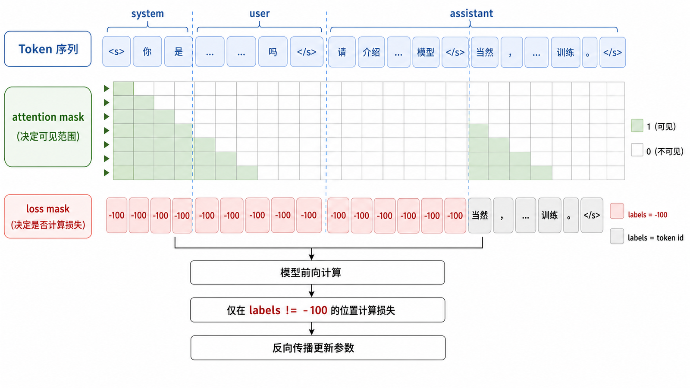
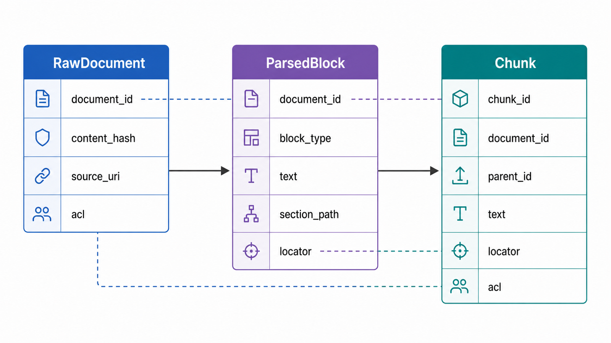
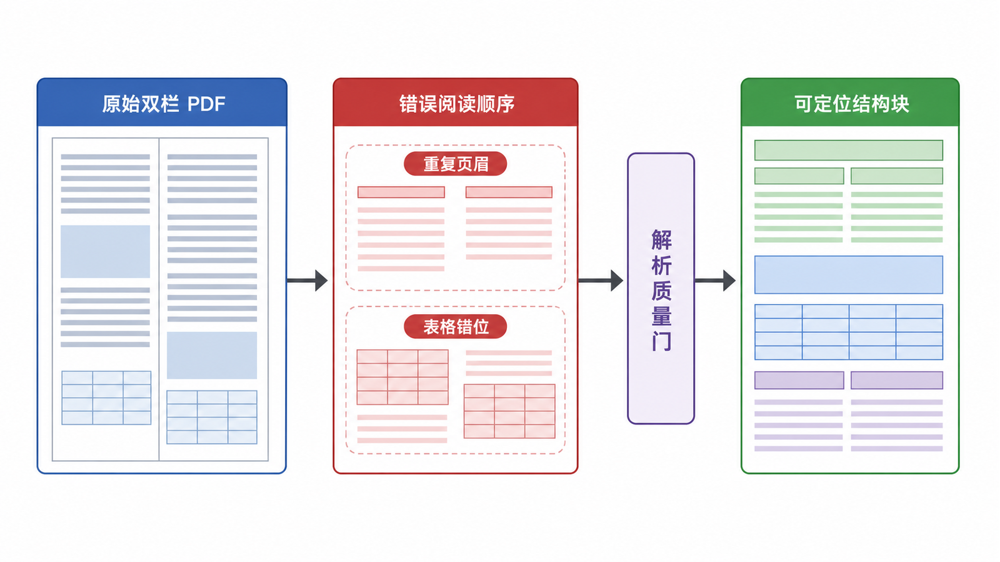
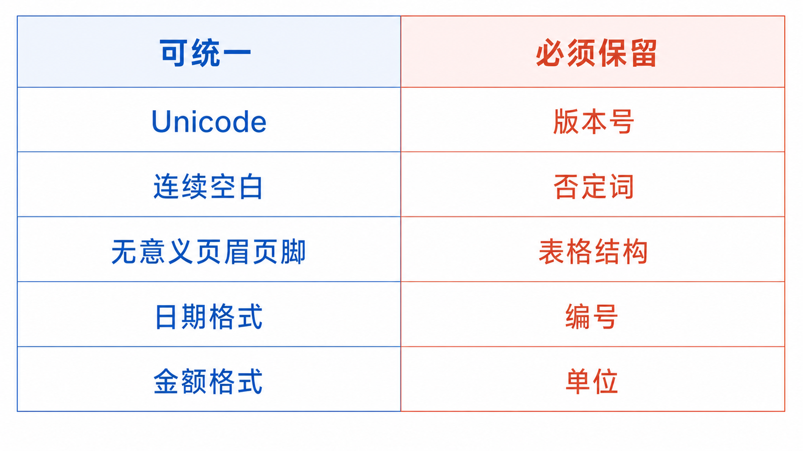
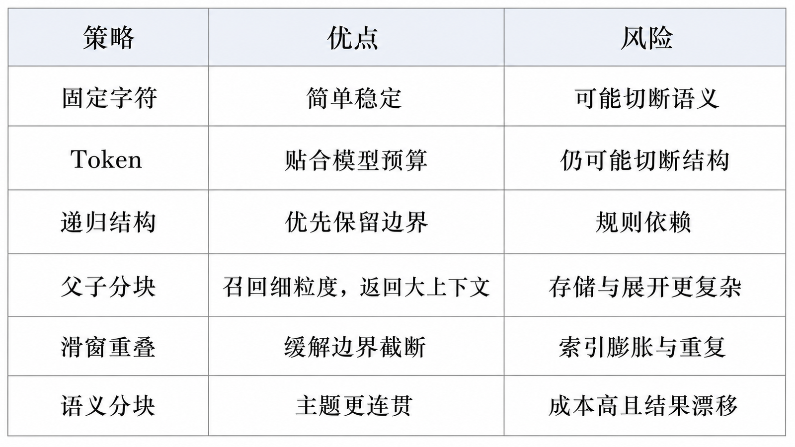
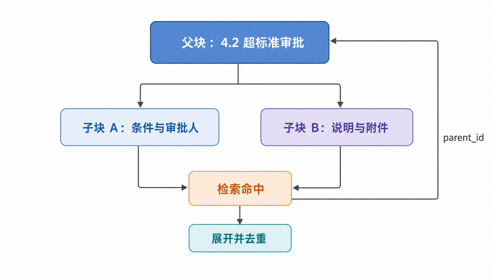
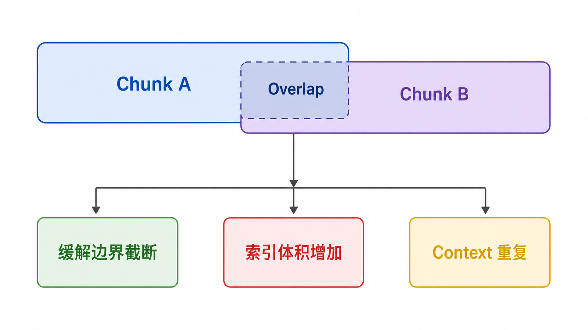
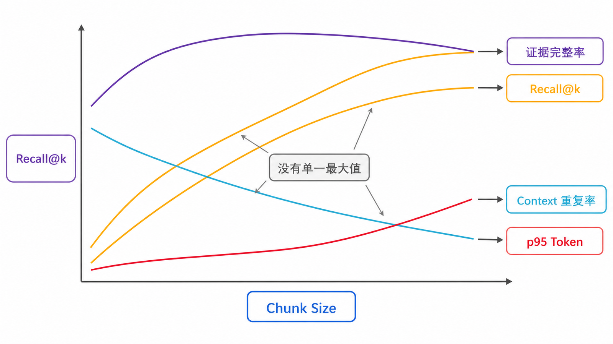
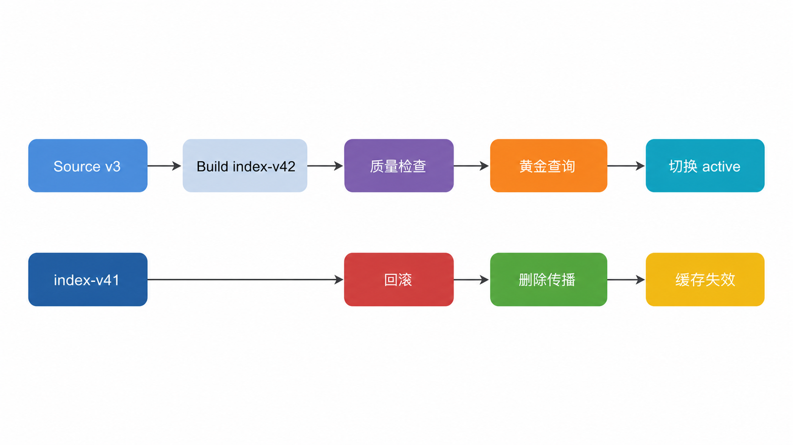

## 前置知识与学习目标

本文承接上一篇的离线索引链路。读完后，你应该能够：

- 判断 PDF 或网页是否被正确解析，而不是只检查“是否返回文本”。
- 为文档和 Chunk 设计稳定 ID、来源定位与权限元数据。
- 解释字符分块、Token 分块、结构分块、父子分块和语义分块的权衡。
- 用黄金查询验证分块策略，而不是凭经验选择 `chunk_size`。
- 正确处理增量更新、删除传播与索引版本。

贯穿案例仍然是公司差旅制度。目标是让“住宿超标由谁审批”能稳定定位到第 4.2 节，同时保留页码、版本和访问权限。

## 数据处理不是格式转换



可靠的数据流水线应包含质量门：

```text
发现文档
  → 解析
  → 结构与页码检查
  → 规范化
  → 去重
  → 分块
  → 元数据与 ACL
  → 稳定 ID
  → Chunk 质量检查
  → 发布索引版本
```

“成功读到 20,000 个字符”不能证明解析正确。PDF 可能丢失双栏顺序，表格可能变成乱码，页眉可能在每页重复，扫描件可能没有 OCR，网页导航也可能混入正文。

## 定义输入与输出契约



### 原始文档

```python
from dataclasses import dataclass, field
from datetime import datetime

@dataclass(frozen=True)
class RawDocument:
    document_id: str
    version: str
    source_uri: str
    media_type: str
    content_hash: str
    discovered_at: datetime
    acl: tuple[str, ...] = field(default_factory=tuple)
```

`document_id` 表示逻辑文档，`version` 表示内容版本，`content_hash` 用来判断内容是否真的变化。文件名不能单独作为稳定 ID，因为文件可能改名，也可能出现同名文件。

### 解析后的结构块

```python
@dataclass(frozen=True)
class ParsedBlock:
    block_type: str  # heading, paragraph, table, code, image_caption
    text: str
    page: int | None
    section_path: tuple[str, ...]
    order: int
```

先保留结构，再决定如何分块。直接把整篇文档压成纯文本，会丢失标题层级、表格边界和代码块语义。

### 最终 Chunk

```python
@dataclass(frozen=True)
class Chunk:
    chunk_id: str
    document_id: str
    version: str
    text: str
    source_uri: str
    locator: str
    section_path: tuple[str, ...]
    token_count: int
    acl: tuple[str, ...]
    parent_id: str | None = None
```

生成 ID 时使用规范化后的结构位置或稳定块标识，不应使用 Python 内置 `hash()`；后者跨进程不保证稳定。

```python
import hashlib

def stable_chunk_id(document_id: str, version: str, locator: str, index: int) -> str:
    raw = f"{document_id}|{version}|{locator}|{index}".encode("utf-8")
    return hashlib.sha256(raw).hexdigest()[:24]
```

## 解析质量门



不同格式关注不同问题：

| 格式       | 主要风险                         | 最低检查                         |
| ---------- | -------------------------------- | -------------------------------- |
| PDF        | 阅读顺序、页眉页脚、表格、扫描页 | 页数、空页率、页码映射、抽样渲染 |
| DOCX       | 标题层级、表格、批注             | 标题树、表格数量、段落顺序       |
| HTML       | 导航、广告、隐藏文本、动态内容   | 主体选择器、链接保留、脚本过滤   |
| Markdown   | 标题、代码围栏、链接             | AST 结构、代码块完整性           |
| CSV        | 编码、列类型、跨行语义           | 表头、行数、主键、空值比例       |
| 图片扫描件 | OCR 错字、版面和表格             | OCR 置信度、区域坐标、人工抽样   |

最小质量报告可以包含：

```python
from collections import Counter

def parsing_report(blocks: list[ParsedBlock], expected_pages: int | None) -> dict:
    page_set = {b.page for b in blocks if b.page is not None}
    text_chars = sum(len(b.text.strip()) for b in blocks)
    return {
        "block_count": len(blocks),
        "text_chars": text_chars,
        "observed_pages": len(page_set),
        "expected_pages": expected_pages,
        "block_types": dict(Counter(b.block_type for b in blocks)),
        "empty_block_rate": (
            sum(not b.text.strip() for b in blocks) / len(blocks) if blocks else 1.0
        ),
    }
```

报告只负责暴露信号，不应声称一个固定阈值适用于所有语料。阈值要根据格式和历史基线建立。

## 规范化与去重



规范化应保留语义差异：

- 统一换行、Unicode 和连续空白。
- 移除确认无意义的重复页眉页脚。
- 保留标题、列表、表格行列与代码缩进。
- 保留金额、日期、版本号、编号和否定词。
- 不要用宽泛正则删除所有“特殊字符”。

精确重复可以用内容哈希；近重复需要谨慎使用 MinHash、SimHash 或 Embedding。两段文字相似不代表可安全删除，例如制度新旧版本往往高度相似，但差异恰恰最重要。

## 六类分块策略



### 1. 固定字符分块

实现简单，但字符数不等于模型 Token，也不理解标题和句子。适合快速基线，不应作为默认最优方案。

### 2. Token 分块

可以直接控制上下文预算。缺点是可能在段落或表格中间切开，因此通常需要与句子、标题边界结合。

### 3. 递归结构分块

先按章节、段落、句子拆分，只有过长时才继续切。对普通 Markdown、制度文档和说明书通常是合理基线。

```python
def pack_blocks(blocks: list[ParsedBlock], max_tokens: int, count_tokens) -> list[list[ParsedBlock]]:
    chunks: list[list[ParsedBlock]] = []
    current: list[ParsedBlock] = []
    current_tokens = 0

    for block in blocks:
        size = count_tokens(block.text)
        if current and current_tokens + size > max_tokens:
            chunks.append(current)
            current, current_tokens = [], 0
        current.append(block)
        current_tokens += size

    if current:
        chunks.append(current)
    return chunks
```

真实实现还要处理单个超长块，但核心原则是优先保留结构边界。

### 4. 父子分块



使用较小子块检索，再把较大的父块送给生成模型：

```text
父块：4.2 超标准审批（完整两段）
  ├─ 子块 A：超标条件与审批人
  └─ 子块 B：报销说明与附件要求
```

它兼顾精确召回和完整上下文，但必须保存 `parent_id`，并在扩展父块后去重。

### 5. 滑窗重叠



Overlap 能缓解边界截断，却会增加索引体积和重复候选。重叠越大并不一定越好；如果最终 Context 同时放入多个重叠块，反而会挤占 Token 预算。

### 6. 语义分块

按句间语义变化寻找边界，适合缺少显式结构的长文本。代价是额外 Embedding 成本、阈值敏感和结果难以解释。它必须与结构分块在同一评测集上比较，不能仅凭名称判断更先进。

## Chunk Size 不是常数



Chunk 太小：

- 关键词更集中，可能更容易召回。
- 条件、主体和例外可能分离。
- 重复候选和引用碎片增多。

Chunk 太大：

- 证据更完整。
- Embedding 被多个主题平均，检索定位变差。
- 重排和生成成本上升。

应把 Chunk Size 当作实验参数。至少比较：

- Retrieval Recall@k。
- 命中 Chunk 是否包含完整答案证据。
- Context 重复率。
- 平均与 p95 Token 数。
- 端到端答案和引用质量。

## 元数据与权限

推荐区分三类字段：

| 类型     | 示例                                               | 用途             |
| -------- | -------------------------------------------------- | ---------------- |
| 来源定位 | source、page、section、timestamp                   | 引用与审计       |
| 生命周期 | document_id、version、content_hash、indexed_at     | 更新、删除和回滚 |
| 检索约束 | tenant_id、acl、language、doc_type、effective_date | 查询前过滤       |

ACL 不能只在生成答案后检查。未经授权的 Chunk 一旦进入检索日志、缓存或模型上下文，就已经发生泄漏风险。

## 增量更新与删除传播



索引同步应是幂等过程：

```python
def plan_sync(current: dict[str, str], discovered: dict[str, str]) -> dict:
    """字典结构为 document_id -> content_hash。"""
    return {
        "add": sorted(discovered.keys() - current.keys()),
        "update": sorted(
            doc_id
            for doc_id in discovered.keys() & current.keys()
            if discovered[doc_id] != current[doc_id]
        ),
        "delete": sorted(current.keys() - discovered.keys()),
    }
```

更新时不要先删除旧索引再慢慢重建。更安全的流程是：

1. 创建新索引版本。
2. 完成解析、Embedding 和质量检查。
3. 对新版本运行黄金查询。
4. 原子切换活动版本。
5. 保留旧版本用于快速回滚。
6. 在保留期后清理旧版本和相关缓存。

## 用黄金查询评测分块

为每个关键问题标注支持证据 ID：

```python
golden_cases = [
    {
        "query": "住宿费超过标准由谁审批？",
        "relevant_chunk_ids": {"travel-policy:v3:section-4.2:0"},
    }
]
```

分块实验不应比较 `page_content` 完全相等，而应比较稳定 `chunk_id` 或父级证据 ID。对于一个答案需要多个证据的情况，还要检查证据集合是否完整。

## 常见误区

- 把“加载成功”当作“解析正确”。
- 用字符数代替真实 Token 预算。
- 只按平均 Chunk 长度判断质量。
- 认为 Overlap 越大召回一定越好。
- 删除近重复内容时忽略版本差异。
- 只添加 `source`，不保存稳定 ID、页码和版本。
- 文档删除后只删对象存储，不删向量、关键词索引和缓存。

## 自检题

<details>
<summary>1. 为什么扫描 PDF 返回空文本不应该被当作“没有内容”？</summary>

它可能需要 OCR。数据流水线应识别扫描页并进入 OCR 或人工处理队列，而不是静默生成空 Chunk。

</details>

<details>
<summary>2. 父子分块为什么需要去重？</summary>

多个命中的子块可能指向同一个父块。若直接展开，会把相同父文本重复放入上下文，浪费预算并放大单一文档权重。

</details>

<details>
<summary>3. 文档改名但内容未变时，哪两个字段最有帮助？</summary>

稳定的 `document_id` 与 `content_hash`。前者表示逻辑身份，后者判断内容是否变化。

</details>

## 总结与下一篇

高质量 RAG 从高质量知识单元开始。可靠的 Chunk 必须同时满足可检索、可定位、可授权、可更新和可评测，而不只是长度符合某个阈值。

下一篇将把这些 Chunk 转换成向量，并解释相似度、归一化和 ANN 索引如何共同决定召回结果。

## 对应资料来源

- [Retrieval-Augmented Generation for Knowledge-Intensive NLP Tasks](https://arxiv.org/abs/2005.11401)
- [Dense Passage Retrieval for Open-Domain Question Answering](https://arxiv.org/abs/2004.04906)
- [OpenAI Embeddings API Reference](https://platform.openai.com/docs/api-reference/embeddings)

> 验证说明：代码使用 Python 标准库和数据类表达数据契约；Tokenizer 与解析器应由项目按目标模型和文档格式选定并固定版本。
