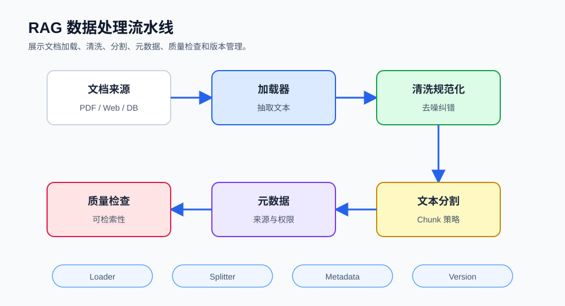

## 概述

数据处理是 RAG 系统的第一步，也是至关重要的一环。高质量的文档处理能够显著提升后续检索和生成的效果。本篇将详细介绍各种文档格式的加载方法、文本分割策略以及元数据管理技巧。



### 数据处理流程

```
┌─────────────────────────────────────────────────────────────────────┐
│                       RAG 数据处理流程                               │
├─────────────────────────────────────────────────────────────────────┤
│                                                                      │
│  ┌─────────┐    ┌─────────┐    ┌─────────┐    ┌─────────┐        │
│  │  原始   │ →  │  格式   │ →  │  内容   │ →  │  向量   │        │
│  │  文档   │    │  识别   │    │  提取   │    │  准备   │        │
│  └─────────┘    └─────────┘    └─────────┘    └─────────┘        │
│                                                                      │
│  支持的格式：PDF、Word、TXT、Markdown、HTML、CSV、JSON 等           │
│                                                                      │
└─────────────────────────────────────────────────────────────────────┘
```

## 文档加载器

### LangChain 文档加载

LangChain 提供了丰富的文档加载器：

#### 1. 文本文件加载

```python
from langchain_community.document_loaders import TextLoader

loader = TextLoader("document.txt", encoding="utf-8")
documents = loader.load()

for doc in documents:
    print(f"内容: {doc.page_content[:100]}...")
    print(f"元数据: {doc.metadata}")
```

#### 2. PDF 文档加载

```python
from langchain_community.document_loaders import PyPDFLoader

loader = PyPDFLoader("document.pdf")
documents = loader.load()

print(f"加载了 {len(documents)} 页")

for i, doc in enumerate(documents):
    print(f"第 {i+1} 页内容: {doc.page_content[:200]}...")
```

#### 3. Markdown 文件加载

```python
from langchain_community.document_loaders import UnstructuredMarkdownLoader

loader = UnstructuredMarkdownLoader("readme.md")
documents = loader.load()

print(f"标题: {documents[0].metadata.get('title', 'N/A')}")
```

#### 4. Word 文档加载

```python
from langchain_community.document_loaders import Docx2txtLoader

loader = Docx2txtLoader("document.docx")
documents = loader.load()

print(f"段落数: {len(documents)}")
```

#### 5. CSV 文件加载

```python
from langchain_community.document_loaders import CSVLoader

loader = CSVLoader(
    "data.csv",
    csv_args={
        "delimiter": ",",
        "quotechar": '"',
        "encoding": "utf-8"
    }
)

documents = loader.load()

for doc in documents:
    print(f"行数据: {doc.page_content}")
```

#### 6. HTML 网页加载

```python
from langchain_community.document_loaders import UnstructuredURLLoader

urls = [
    "https://example.com/article1",
    "https://example.com/article2"
]

loader = UnstructuredURLLoader(urls=urls)
documents = loader.load()

print(f"加载了 {len(documents)} 个网页")
```

### LlamaIndex 文档加载

```python
from llama_index.core import SimpleDirectoryReader

reader = SimpleDirectoryReader(
    input_dir="./documents",
    recursive=True,
    exclude=["*.tmp", ".git/*"],
    required_exts=[".txt", ".pdf", ".md"]
)

documents = reader.load_data()

print(f"共加载 {len(documents)} 个文档")
```

### 目录批量加载

```python
from langchain_community.document_loaders import DirectoryLoader

loader = DirectoryLoader(
    path="./documents",
    glob="**/*.pdf",
    loader_cls=PyPDFLoader,
    show_progress=True
)

documents = loader.load()

print(f"批量加载完成，共 {len(documents)} 个文档")
```

## 文档格式对比

| 格式 | 加载器 | 特点 | 适用场景 |
|------|--------|------|---------|
| **TXT** | TextLoader | 简单通用 | 纯文本 |
| **PDF** | PyPDFLoader | 支持多页 | 论文、报告 |
| **Markdown** | UnstructuredMarkdownLoader | 保留结构 | 文档、笔记 |
| **Word** | Docx2txtLoader | 保留格式 | 正式文档 |
| **CSV** | CSVLoader | 结构化 | 数据表格 |
| **HTML** | UnstructuredURLLoader | 网页内容 | 在线资源 |
| **JSON** | JSONLoader | 键值对 | API 数据 |

## 文本分割策略

文本分割是将长文档拆分成小块的关一步骤，直接影响检索效果。

### 1. 按字符分割

最简单的分割方式：

```python
from langchain.text_splitter import CharacterTextSplitter

splitter = CharacterTextSplitter(
    separator="\n\n",
    chunk_size=1000,
    chunk_overlap=200,
    length_function=len
)

chunks = splitter.split_text(long_text)

print(f"分割成 {len(chunks)} 个块")
```

### 2. 递归字符分割（推荐）

LangChain 推荐的方式：

```python
from langchain.text_splitter import RecursiveCharacterTextSplitter

splitter = RecursiveCharacterTextSplitter(
    chunk_size=1000,
    chunk_overlap=200,
    length_function=len,
    separators=["\n\n", "\n", ". ", " ", ""]
)

chunks = splitter.split_documents(documents)

print(f"递归分割完成，共 {len(chunks)} 个块")
```

### 3. 按句子分割

保持句子完整性：

```python
from langchain.text_splitter import NLTKTextSplitter

splitter = NLTKTextSplitter(
    chunk_size=500
)

chunks = splitter.split_text(text)

print(f"按句子分割: {len(chunks)} 个块")
```

### 4. 按 Token 分割

根据模型 token 限制分割：

```python
from langchain.text_splitter import TokenTextSplitter

splitter = TokenTextSplitter(
    chunk_size=512,
    chunk_overlap=64
)

chunks = splitter.split_documents(documents)

print(f"按 Token 分割: {len(chunks)} 个块")
```

### 5. Markdown 分割

保留 Markdown 结构：

```python
from langchain.text_splitter import MarkdownTextSplitter

splitter = MarkdownTextSplitter(
    chunk_size=500,
    chunk_overlap=100
)

chunks = splitter.split_text(markdown_text)

print(f"Markdown 分割: {len(chunks)} 个块")
```

### 6. 代码分割

针对代码文件的特殊分割：

```python
from langchain.text_splitter import Language, RecursiveCharacterTextSplitter

splitter = RecursiveCharacterTextSplitter.from_language(
    language=Language.PYTHON,
    chunk_size=500,
    chunk_overlap=50
)

code_chunks = splitter.split_text(code)

print(f"代码分割: {len(code_chunks)} 个块")
```

### LlamaIndex 文本分割

```python
from llama_index.core.node_parser import SentenceSplitter

# SentenceSplitter 的参数是 chunk_size、chunk_overlap、paragraph_separator
parser = SentenceSplitter(
    chunk_size=512,
    chunk_overlap=64,
    paragraph_separator="\n\n"
)

nodes = parser.get_nodes_from_documents(documents)

print(f"LlamaIndex 分割: {len(nodes)} 个节点")
```

## 分割参数详解

### Chunk Size（块大小）

| Chunk Size | 优点 | 缺点 | 适用场景 |
|------------|------|------|---------|
| **200-500** | 精确、易检索 | 可能丢失上下文 | 短问答 |
| **500-1000** | 平衡 | - | 通用场景 |
| **1000-2000** | 保留更多上下文 | 可能包含噪声 | 长文本分析 |
| **2000+** | 完整上下文 | 超出模型限制 | 复杂文档 |

### Chunk Overlap（块重叠）

重叠区域帮助保持上下文连续性：

```python
from langchain.text_splitter import RecursiveCharacterTextSplitter

splitter = RecursiveCharacterTextSplitter(
    chunk_size=1000,
    chunk_overlap=200  # 保持 20% 重叠
)

chunks = splitter.split_documents(documents)
```

### Overlap 策略对比

| 重叠比例 | 效果 | 适用场景 |
|----------|------|---------|
| **0%** | 无重叠，可能丢失边界信息 | 独立文档 |
| **10-20%** | 轻微重叠 | 通用场景 |
| **20-30%** | 良好连续性 | 长文档 |

## 元数据管理

### 添加基础元数据

```python
from langchain_core.documents import Document

doc = Document(
    page_content="文档内容...",
    metadata={
        "source": "manual.pdf",
        "page": 1,
        "author": "张三",
        "created_at": "2024-01-01",
        "category": "技术文档"
    }
)
```

### 批量添加元数据

```python
from langchain_community.document_loaders import DirectoryLoader
from langchain.text_splitter import RecursiveCharacterTextSplitter

loader = DirectoryLoader("./documents", glob="**/*.txt")
documents = loader.load()

for doc in documents:
    doc.metadata["category"] = "general"
    doc.metadata["processed_at"] = "2024-01-01"
    doc.metadata["chunk_index"] = documents.index(doc)

print(f"元数据添加完成")
```

### 按目录添加元数据

```python
from langchain_community.document_loaders import DirectoryLoader
import os

def load_with_hierarchy(base_path):
    documents = []

    for root, dirs, files in os.walk(base_path):
        for file in files:
            file_path = os.path.join(root, file)
            category = os.path.relpath(root, base_path)

            if file.endswith('.txt'):
                loader = TextLoader(file_path)
                docs = loader.load()

                for doc in docs:
                    doc.metadata["category"] = category
                    doc.metadata["filename"] = file
                    doc.metadata["full_path"] = file_path

                documents.extend(docs)

    return documents

documents = load_with_hierarchy("./documents")
print(f"加载了 {len(documents)} 个文档，带层级分类")
```

## 高级分割技术

### 1. 按标题分割

保持文档结构：

```python
import re

def split_by_headers(text, chunk_size=1000, overlap=200):
    header_pattern = r'^#{1,6}\s+.+$'
    lines = text.split('\n')

    chunks = []
    current_chunk = []
    current_size = 0

    for line in lines:
        if re.match(header_pattern, line):
            if current_chunk:
                chunks.append('\n'.join(current_chunk))

            current_chunk = [line]
            current_size = len(line)
        else:
            current_chunk.append(line)
            current_size += len(line)

            if current_size >= chunk_size:
                chunks.append('\n'.join(current_chunk))
                current_chunk = current_chunk[-overlap:]
                current_size = sum(len(l) for l in current_chunk)

    if current_chunk:
        chunks.append('\n'.join(current_chunk))

    return chunks
```

### 2. 语义分割

基于语义相似性分割：

```python
from langchain.text_splitter import SemanticChunker
from langchain_openai import OpenAIEmbeddings

embeddings = OpenAIEmbeddings()

chunker = SemanticChunker(
    embeddings=embeddings,
    threshold=0.5
)

chunks = chunker.split_text(text)

print(f"语义分割: {len(chunks)} 个块")
```

### 3. 自适应分割

根据内容类型自适应调整：

```python
from langchain.text_splitter import (
    Language,
    MarkdownTextSplitter,
    RecursiveCharacterTextSplitter,
)

def adaptive_splitter(text, content_type, chunk_size=1000):
    if content_type == "code":
        splitter = RecursiveCharacterTextSplitter.from_language(
            Language.PYTHON,
            chunk_size=chunk_size
        )
    elif content_type == "markdown":
        splitter = MarkdownTextSplitter(chunk_size=chunk_size)
    elif content_type == "technical":
        splitter = RecursiveCharacterTextSplitter(
            chunk_size=chunk_size,
            separators=["\n\n", "\n", ". ", " ", ""]
        )
    else:
        splitter = RecursiveCharacterTextSplitter(chunk_size=chunk_size)

    return splitter.split_text(text)
```

## 数据清洗

### 1. 移除特殊字符

```python
import re

def clean_text(text):
    text = re.sub(r'\s+', ' ', text)
    text = re.sub(r'[^\w\s\u4e00-\u9fff.,!?。，！？]', '', text)
    text = text.strip()
    return text

cleaned_text = clean_text(raw_text)
```

### 2. 移除噪声内容

```python
def remove_noise(text):
    patterns = [
        r'广告', r'Copyright.*?\d{4}',
        r'更新时间.*?\d{4}-\d{2}-\d{2}',
        r'\[图片\]', r'\[视频\]', r'http[s]?://\S+'
    ]

    for pattern in patterns:
        text = re.sub(pattern, '', text)

    return text
```

### 3. 规范化格式

```python
def normalize_text(text):
    # 将各种排版引号统一为 ASCII 引号
    text = text.replace('“', '"').replace('”', '"')
    text = text.replace('‘', "'").replace('’', "'")
    # 将长破折号统一为连字符
    text = text.replace('—', '-').replace('–', '-')
    # 统一省略号为三个点
    text = text.replace('…', '...')
    return text
```

## 最佳实践

### 分割策略选择指南

```
文档类型
  │
  ├─ 短文本 (< 1000字符)
  │   └─ chunk_size: 200-500
  │
  ├─ 标准文档
  │   └─ chunk_size: 500-1000
  │
  ├─ 长文档 (> 5000字符)
  │   ├─ chunk_size: 1000-2000
  │   └─ overlap: 15-25%
  │
  └─ 代码文件
      └─ 按函数/类分割，保持缩进结构
```

### 分割质量检查

```python
def validate_chunks(chunks, min_size=100, max_size=2000):
    issues = []

    for i, chunk in enumerate(chunks):
        if len(chunk) < min_size:
            issues.append(f"块 {i} 太短: {len(chunk)} 字符")

        if len(chunk) > max_size:
            issues.append(f"块 {i} 太长: {len(chunk)} 字符")

    if issues:
        print("发现问题:")
        for issue in issues[:5]:
            print(f"  - {issue}")
    else:
        print("分割质量良好!")

    return issues
```

## 总结

| 技术 | 作用 | 关键参数 |
|------|------|---------|
| **Loaders** | 加载各种格式文档 | 编码、路径 |
| **TextSplitter** | 分割文本块 | chunk_size, overlap |
| **Metadata** | 添加上下文信息 | source, category |
| **Cleaner** | 清洗噪声 | 正则表达式 |

高质量的数据处理是 RAG 系统的基础，需要根据实际文档特点选择合适的策略。

## 后续内容

本系列后续将深入讲解：
- 向量嵌入与向量数据库
- 高级检索策略
- RAG 实战应用
- 性能优化技巧
