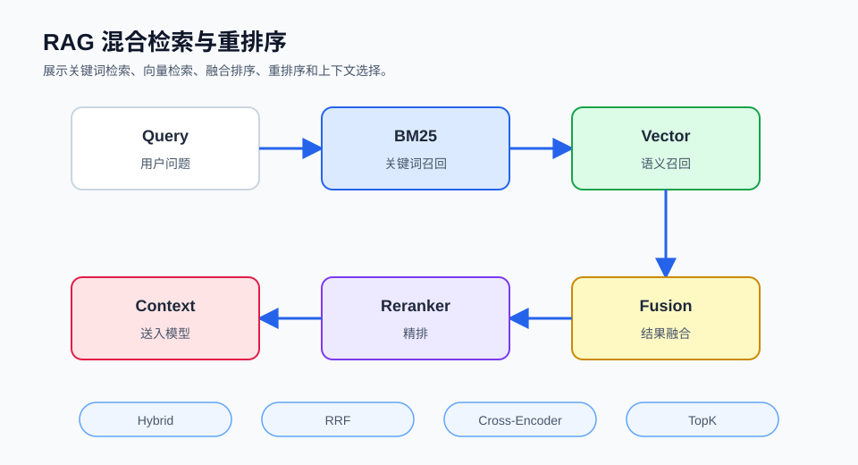

## 概述

检索质量直接决定了 RAG 系统的最终效果。本篇将详细介绍各种高级检索策略，包括混合检索、重排序、查询扩展等技术，帮助你构建更精准的 RAG 应用。



### 检索优化流程

```
┌─────────────────────────────────────────────────────────────────────┐
│                       高级检索流程                                   │
├─────────────────────────────────────────────────────────────────────┤
│                                                                      │
│  ┌─────────┐    ┌─────────┐    ┌─────────┐    ┌─────────┐        │
│  │  查询   │ →  │  扩展   │ →  │  检索   │ →  │  重排   │        │
│  │  输入   │    │  改写   │    │  混合   │    │  排序   │        │
│  └─────────┘    └─────────┘    └─────────┘    └─────────┘        │
│                                                                      │
│  ┌─────────┐    ┌─────────┐    ┌─────────┐    ┌─────────┐        │
│  │  过滤   │ ←  │  相似度 │ ←  │  语义   │ ←  │  关键词 │        │
│  │  条件   │    │  阈值   │    │  检索   │    │  检索   │        │
│  └─────────┘    └─────────┘    └─────────┘    └─────────┘        │
│                                                                      │
└─────────────────────────────────────────────────────────────────────┘
```

## 基础检索类型

### 1. 向量检索 (Semantic Search)

基于语义相似性的检索：

```python
from langchain_community.vectorstores import Chroma
from langchain_openai import OpenAIEmbeddings

vectorstore = Chroma(
    collection_name="documents",
    embedding_function=OpenAIEmbeddings()
)

results = vectorstore.similarity_search(
    query="如何学习机器学习？",
    k=5
)

for doc in results:
    print(f"内容: {doc.page_content[:100]}...")
```

### 2. 关键词检索 (BM25)

基于词频的经典检索：

```python
from langchain.retrievers import BM25Retriever

retriever = BM25Retriever.from_texts(
    texts=[doc.page_content for doc in documents],
    metadata=[doc.metadata for doc in documents]
)

results = retriever.invoke("机器学习")

print(f"BM25 检索结果: {len(results)} 个")
```

### 3. SVM 检索

支持向量机基础的检索：

```python
# SVMRetriever 在新版 langchain-community 中仍可用，但要求 embeddings 已定义
# from langchain_community.retrievers import SVMRetriever
# 
# retriever = SVMRetriever.from_texts(
#     texts=[doc.page_content for doc in documents],
#     embeddings=embeddings
# )
#
# results = retriever.invoke("深度学习框架")
# print(f"SVM 检索结果: {len(results)} 个")
#
# 注：SVMRetriever 在新版本中已不推荐使用，建议改用向量检索
print("SVM 检索器已弃用，建议使用向量检索")
```

## 混合检索

### 向量 + 关键词混合

```python
from langchain.retrievers import EnsembleRetriever

vector_retriever = vectorstore.as_retriever(
    search_kwargs={"k": 10}
)

bm25_retriever = BM25Retriever.from_texts(
    texts=[doc.page_content for doc in documents]
)

ensemble_retriever = EnsembleRetriever(
    retrievers=[vector_retriever, bm25_retriever],
    weights=[0.7, 0.3]
)

results = ensemble_retriever.invoke("Python 编程")

print(f"混合检索结果: {len(results)} 个")
```

### 动态权重调整

```python
class AdaptiveEnsembleRetriever:
    def __init__(self, vector_retriever, bm25_retriever):
        self.vector_retriever = vector_retriever
        self.bm25_retriever = bm25_retriever

    def retrieve(self, query, alpha=0.5):
        vector_results = self.vector_retriever.invoke(query)
        bm25_results = self.bm25_retriever.invoke(query)

        scored_results = {}

        for i, doc in enumerate(vector_results):
            score = (1 - i / len(vector_results)) * alpha
            scored_results[doc.page_content] = {
                "doc": doc,
                "score": score
            }

        for i, doc in enumerate(bm25_results):
            if doc.page_content in scored_results:
                scored_results[doc.page_content]["score"] += (1 - i / len(bm25_results)) * (1 - alpha)
            else:
                scored_results[doc.page_content] = {
                    "doc": doc,
                    "score": (1 - i / len(bm25_results)) * (1 - alpha)
                }

        sorted_results = sorted(
            scored_results.values(),
            key=lambda x: x["score"],
            reverse=True
        )

        return [r["doc"] for r in sorted_results[:10]]

retriever = AdaptiveEnsembleRetriever(vector_retriever, bm25_retriever)
results = retriever.retrieve("查询内容", alpha=0.7)
```

## 重排序 (Reranking)

### 使用 Cross-Encoder 重排序

```python
from langchain_community.cross_encoders import HuggingFaceCrossEncoder

model = HuggingFaceCrossEncoder(
    model_name="cross-encoder/ms-marco-MiniLM-L-12-v2"
)

def rerank_documents(query, documents, top_n=5):
    doc_texts = [
        f"{query} {doc.page_content}" for doc in documents
    ]

    scores = model.predict(doc_texts)

    scored_docs = [
        (doc, score) for doc, score in zip(documents, scores)
    ]

    scored_docs.sort(key=lambda x: x[1], reverse=True)

    return [doc for doc, score in scored_docs[:top_n]]

reranked = rerank_documents("查询", initial_results, top_n=5)
# 注：initial_results 需先通过 vectorstore.similarity_search 获取
```

### Cohere 重排序

```python
import cohere

cohere_client = cohere.Client("your-api-key")

def cohere_rerank(query, documents, top_n=5):
    docs = [doc.page_content for doc in documents]

    response = cohere_client.rerank(
        query=query,
        documents=docs,
        top_n=top_n,
        model="rerank-english-v2.0"
    )

    reranked = []
    for result in response.results:
        reranked.append(documents[result.index])

    return reranked

reranked = cohere_rerank("查询", documents, top_n=5)
```

### 多阶段重排序

```python
def multi_stage_rerank(query, vectorstore, initial_k=20, rerank_k=10, final_k=5):
    initial_results = vectorstore.similarity_search(query, k=initial_k)

    reranked_results = rerank_documents(query, initial_results, top_n=rerank_k)

    final_results = reranked_results[:final_k]

    return final_results

results = multi_stage_rerank("Python 教程", vectorstore)
```

## 查询扩展

### 1. HyDE (Hypothetical Document Embeddings)

生成假设性文档再检索：

```python
from langchain_openai import ChatOpenAI

llm = ChatOpenAI(model="gpt-4")

def hyde_retrieve(query, vectorstore, llm):
    hypothetical_prompt = f"假设以下是一个关于'{query}'的文档，请写出这个文档的摘要："

    hypothetical_doc = llm.invoke(hypothetical_prompt)

    results = vectorstore.similarity_search(
        hypothetical_doc.content,
        k=10
    )

    return results

hyde_results = hyde_retrieve("机器学习算法", vectorstore, llm)
```

### 2. 查询改写

```python
from langchain_openai import ChatOpenAI
from langchain_core.prompts import PromptTemplate

llm = ChatOpenAI(model="gpt-4")

rewrite_prompt = PromptTemplate.from_template(
    """将以下查询改写为更精确的搜索查询，保持原意但优化表达：

    原始查询：{query}

    改写后的查询："""
)

rewrite_chain = rewrite_prompt | llm

rewritten_query = rewrite_chain.invoke({"query": "我想学编程"})

print(f"改写后的查询: {rewritten_query.content}")

results = vectorstore.similarity_search(rewritten_query.content, k=5)
```

### 3. 查询分解

将复杂查询分解为多个子查询：

```python
def decompose_query(query, llm):
    decompose_prompt = PromptTemplate.from_template(
        """将以下复杂查询分解为多个简单的子查询：

        复杂查询：{query}

        子查询（用逗号分隔）："""
    )

    chain = decompose_prompt | llm
    response = chain.invoke({"query": query})

    sub_queries = [q.strip() for q in response.content.split(",")]

    return sub_queries

sub_queries = decompose_query("解释Python中的装饰器及其用法")

print(f"分解为 {len(sub_queries)} 个子查询：")
for q in sub_queries:
    print(f"  - {q}")

all_results = []
for sub_q in sub_queries:
    results = vectorstore.similarity_search(sub_q, k=5)
    all_results.extend(results)

unique_results = list({doc.page_content: doc for doc in all_results}.values())
```

### 4. 子查询执行

```python
def parallel_subquery(query, vectorstore, llm, k=5):
    sub_queries = decompose_query(query, llm)

    all_docs = []
    for sub_q in sub_queries:
        docs = vectorstore.similarity_search(sub_q, k=k)
        all_docs.extend(docs)

    seen_contents = set()
    unique_docs = []
    for doc in all_docs:
        if doc.page_content not in seen_contents:
            seen_contents.add(doc.page_content)
            unique_docs.append(doc)

    return unique_docs[:10]

results = parallel_subquery("深度学习在自然语言处理中的应用", vectorstore, llm)
```

## 自查询检索

### 带过滤条件的检索

```python
from langchain.chains.query_constructor.schema import AttributeInfo
from langchain.retrievers.self_query.base import SelfQueryRetriever
from langchain_openai import ChatOpenAI

# SelfQueryRetriever 应配合 chat 模型使用
llm = ChatOpenAI(model="gpt-4", temperature=0)

metadata_field_info = [
    AttributeInfo(
        name="source",
        description="文档来源",
        type="string"
    ),
    AttributeInfo(
        name="category",
        description="文档类别",
        type="string"
    ),
    AttributeInfo(
        name="date",
        description="文档日期",
        type="string"
    )
]

# vectorstore 需先创建
# vectorstore = Chroma.from_documents(...)
retriever = SelfQueryRetriever.from_llm(
    llm=llm,
    vectorstore=vectorstore,
    metadata_field_info=metadata_field_info,
    document_contents="技术文档内容"
)

results = retriever.invoke(
    "找出所有关于Python的文档，类别是编程"
)
print(f"自查询检索结果: {len(results)} 个")
```

### 带时间过滤的检索

```python
def time_based_retrieval(query, vectorstore, days=30):
    from datetime import datetime, timedelta

    cutoff_date = datetime.now() - timedelta(days=days)
    date_str = cutoff_date.strftime("%Y-%m-%d")

    results = vectorstore.similarity_search(
        query,
        k=10,
        filter={"date": {"$gte": date_str}}
    )

    return results

recent_results = time_based_retrieval("技术更新", vectorstore, days=7)
```

## 查询缓存

### LRU 缓存

```python
import hashlib

# 简单的 LRU 缓存：使用 OrderedDict 实现
from collections import OrderedDict

class SimpleLRUCache:
    def __init__(self, capacity=1000):
        self.cache = OrderedDict()
        self.capacity = capacity

    def get(self, key):
        if key not in self.cache:
            return None
        # 移动到末尾表示最近使用
        self.cache.move_to_end(key)
        return self.cache[key]

    def set(self, key, value):
        if key in self.cache:
            self.cache.move_to_end(key)
        self.cache[key] = value
        if len(self.cache) > self.capacity:
            self.cache.popitem(last=False)

def get_query_hash(query):
    return hashlib.md5(query.encode()).hexdigest()

# 创建全局缓存
_cache = SimpleLRUCache(capacity=1000)

def retrieve_with_cache(query, vectorstore, k=5):
    query_hash = get_query_hash(query)

    cached_result = _cache.get(query_hash)
    if cached_result is not None:
        return cached_result

    result = vectorstore.similarity_search(query, k=k)
    _cache.set(query_hash, result)
    return result

# 示例使用
# results = retrieve_with_cache("用户查询", vectorstore)
```

### 语义缓存

```python
import hashlib

class SemanticCache:
    def __init__(self, vectorstore, threshold=0.95):
        self.vectorstore = vectorstore
        self.threshold = threshold
        self.cache = {}

    def retrieve(self, query, k=5):
        # 简单示例：使用查询字符串哈希作为 key
        # 真实的语义缓存应基于查询向量的相似度匹配
        query_hash = hashlib.md5(query.encode()).hexdigest()

        if query_hash in self.cache:
            return self.cache[query_hash]

        results = self.vectorstore.similarity_search(query, k=k)
        self.cache[query_hash] = results
        return results

# 使用示例
# vectorstore 需先创建
# vectorstore = Chroma.from_documents(...)
# semantic_cache = SemanticCache(vectorstore, threshold=0.95)
# results = semantic_cache.retrieve("查询内容")
```

## 上下文压缩

### 检索后压缩

```python
from langchain_core.documents import Document
from langchain_core.output_parsers import StrOutputParser
from langchain_core.prompts import PromptTemplate
from langchain_openai import ChatOpenAI

llm = ChatOpenAI(model="gpt-4", temperature=0)

compress_prompt = PromptTemplate.from_template(
    """基于以下查询压缩每个文档内容，只保留相关信息：

    查询：{query}

    文档：{context}

    压缩后的内容："""
)

def compress_documents(query, documents, llm):
    compress_chain = compress_prompt | llm | StrOutputParser()

    compressed = []
    for doc in documents:
        compressed_text = compress_chain.invoke({
            "query": query,
            "context": doc.page_content
        })

        compressed.append(
            Document(
                page_content=compressed_text,
                metadata=doc.metadata
            )
        )

    return compressed

# 使用示例
# documents 需先准备好
# compressed_docs = compress_documents("Python", documents, llm)
```

## 多样性检索

### MMR (Maximum Marginal Relevance)

平衡相关性和多样性：

```python
retriever = vectorstore.as_retriever(
    search_type="mmr",
    search_kwargs={
        "k": 10,
        "fetch_k": 20,
        "lambda_mult": 0.5
    }
)

results = retriever.invoke("深度学习")

print(f"检索到 {len(results)} 个多样化结果")
```

### 手动实现 MMR

```python
def mmr_retrieval(query, documents, k=5, fetch_k=20, lambda_mult=0.5):
    if not documents:
        return []

    doc_embeddings = embeddings.embed_documents(
        [doc.page_content for doc in documents]
    )
    query_embedding = embeddings.embed_query(query)

    import numpy as np

    similarities = [
        cosine_similarity(query_embedding, doc_emb)
        for doc_emb in doc_embeddings
    ]

    selected_indices = []
    remaining_indices = list(range(len(documents)))

    for _ in range(min(k, len(documents))):
        if not remaining_indices:
            break

        best_score = -float('inf')
        best_idx = None

        for idx in remaining_indices:
            relevance = similarities[idx]

            max_similarity_to_selected = 0
            if selected_indices:
                selected_embeddings = [doc_embeddings[i] for i in selected_indices]
                similarities_to_selected = [
                    cosine_similarity(doc_embeddings[idx], emb)
                    for emb in selected_embeddings
                ]
                max_similarity_to_selected = max(similarities_to_selected)

            mmr_score = lambda_mult * relevance - (1 - lambda_mult) * max_similarity_to_selected

            if mmr_score > best_score:
                best_score = mmr_score
                best_idx = idx

        if best_idx is not None:
            selected_indices.append(best_idx)
            remaining_indices.remove(best_idx)

    return [documents[i] for i in selected_indices]

mmr_results = mmr_retrieval("机器学习", documents)
```

## 评估与优化

### 检索质量评估

```python
def evaluate_retrieval(query, relevant_docs_content, retriever):
    """评估检索质量。

    Args:
        query: 查询字符串
        relevant_docs_content: 相关文档的内容集合（set of str）
        retriever: 检索器对象
    """
    retrieved_docs = retriever.invoke(query)

    retrieved_set = set(doc.page_content for doc in retrieved_docs)
    relevant_set = set(relevant_docs_content)

    precision = len(retrieved_set & relevant_set) / len(retrieved_set) if retrieved_set else 0
    recall = len(retrieved_set & relevant_set) / len(relevant_set) if relevant_set else 0
    f1 = 2 * precision * recall / (precision + recall) if (precision + recall) > 0 else 0

    return {
        "precision": precision,
        "recall": recall,
        "f1": f1,
        "retrieved_count": len(retrieved_docs),
        "relevant_count": len(relevant_set)
    }

# retriever 需先定义
# metrics = evaluate_retrieval("Python", ["Python基础", "Python进阶"], retriever)
# print(f"Precision: {metrics['precision']:.2%}")
# print(f"Recall: {metrics['recall']:.2%}")
# print(f"F1: {metrics['f1']:.2%}")
```

### A/B 测试检索策略

```python
def ab_test_strategies(query, strategies, relevant_docs):
    """A/B 测试多个检索策略。

    Args:
        query: 测试查询
        strategies: 策略字典 {name: retriever}
        relevant_docs: 相关文档内容集合（set of str）
    """
    results = {}

    for name, strategy in strategies.items():
        retrieved = strategy.invoke(query)
        metrics = evaluate_retrieval(query, relevant_docs, strategy)

        results[name] = {
            "retrieved": retrieved,
            "metrics": metrics
        }

    print("A/B 测试结果：")
    for name, result in results.items():
        print(f"\n{name}:")
        print(f"  Precision: {result['metrics']['precision']:.2%}")
        print(f"  Recall: {result['metrics']['recall']:.2%}")

    return results

# 使用示例
# strategies = {
#     "vector": vector_retriever,
#     "bm25": bm25_retriever,
#     "hybrid": ensemble_retriever,
# }
# relevant_docs = {"相关文档内容1", "相关文档内容2"}
# ab_results = ab_test_strategies("机器学习", strategies, relevant_docs)
```

## 最佳实践

### 检索策略选择指南

| 场景 | 推荐策略 | 说明 |
|------|---------|------|
| **简单查询** | 向量检索 | 直接语义匹配 |
| **关键词明确** | BM25 | 词频匹配 |
| **复杂查询** | 混合检索 | 向量+关键词 |
| **精确匹配** | 重排序 | Cross-Encoder |
| **多样化需求** | MMR | 相关性+多样性 |
| **带过滤** | 自查询 | 元数据过滤 |

### 常见问题解决

| 问题 | 解决方案 |
|------|---------|
| 检索结果不相关 | 调整 embedding 模型 |
| 结果过于相似 | 使用 MMR |
| 关键词匹配差 | 添加 BM25 混合 |
| 长查询效果差 | 查询分解 |
| 过滤不生效 | 检查元数据格式 |

## 总结

| 策略 | 作用 | 适用场景 |
|------|------|---------|
| **混合检索** | 结合多种检索优点 | 复杂查询 |
| **重排序** | 提升结果准确性 | 高精度需求 |
| **查询扩展** | 优化查询表达 | 模糊查询 |
| **MMR** | 平衡相关性和多样性 | 多样性需求 |
| **自查询** | 带条件的检索 | 结构化查询 |

选择合适的检索策略是构建高质量 RAG 系统的关键，需要根据实际场景进行调优。

## 后续内容

本系列后续将深入讲解：
- RAG 实战应用开发
- 性能优化技巧
- 多模态 RAG
- RAG 与 Agents 结合
