## 前置知识与学习目标

阅读前请先理解上一篇的 Embedding、Top-k 和 Recall@k。读完后，你应该能够：

- 区分候选召回、排名融合、重排序和上下文选择。
- 解释 Dense 与 BM25 的互补关系。
- 手算 Reciprocal Rank Fusion（RRF）。
- 说明为什么原始向量分数与 BM25 分数不能直接相加。
- 使用 Recall@k、MRR 和 nDCG 评估有稳定 ID 的检索结果。

## 为什么只用一种检索器不够

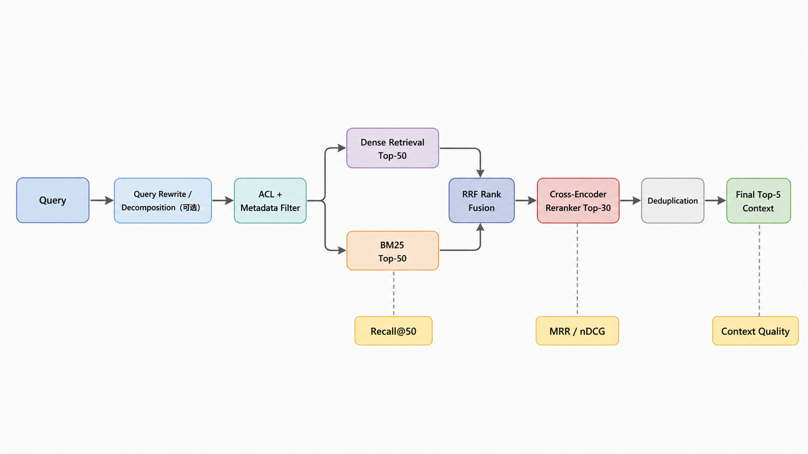

问题“住宿超标需要谁审批？”适合语义检索；问题“制度 4.2 条怎么写？”包含精确编号，BM25 往往更容易命中；问题“2026 年生效且适用于华东区的制度”还需要元数据过滤。

完整检索系统不是在若干算法中选一个，而是构建分阶段漏斗：

```text
Query
  → 可选查询改写/分解
  → ACL 与元数据约束
  → Dense Top-n ─┐
  → BM25 Top-n  ─┼→ RRF 融合 → Cross-Encoder 重排 → 去重 → Final Top-k
  → 其他召回  ──┘
```

每一级都要保留输入、输出、耗时和稳定 Chunk ID，否则最终答案变差时无法定位是哪一级造成的。

## 候选召回：先追求不漏

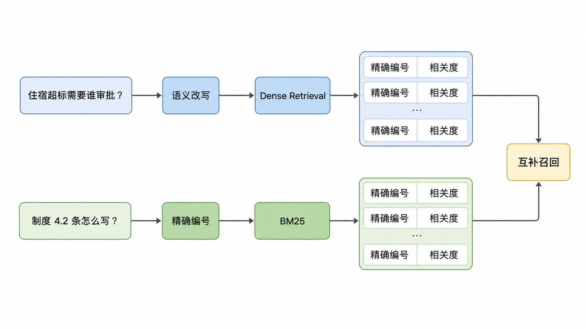

### Dense Retrieval

Dense 检索用查询和文档向量的语义接近程度排序，擅长同义表达和自然语言问题，但可能弱化编号、产品代码、人名拼写和罕见专有词。

### BM25

BM25 是经典稀疏检索方法。其核心思想是：词在当前文档出现得越有辨识度，贡献越大；同时对词频饱和和文档长度进行校正。它擅长精确词项，但对同义改写不敏感。

### 过滤不是第三种相关性

`tenant_id`、ACL、生效日期、语言等约束通常是资格条件，而不是可与相关性分数混合的“偏好”。无权限结果即使高度相关也必须被排除。

## 为什么不能直接加原始分数

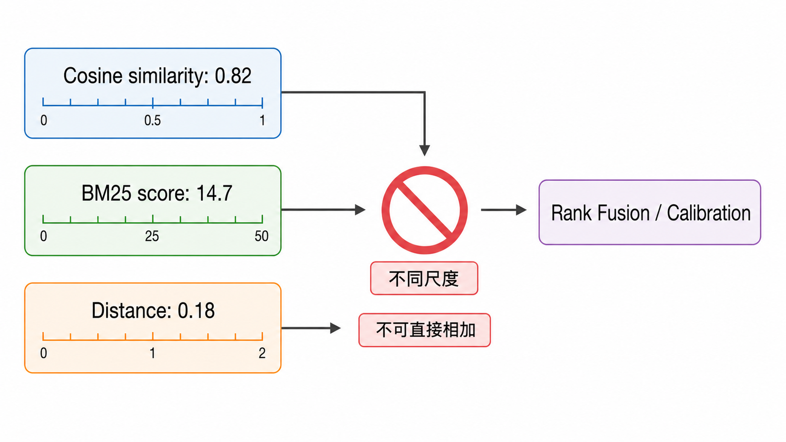

向量库可能返回余弦相似度、点积或距离；BM25 分数则没有与向量分数共享的概率尺度。下面的表达没有通用意义：

```python
# 错误示意：两个分数没有共享尺度
hybrid_score = 0.5 * cosine_score + 0.5 * bm25_score
```

可选方法包括：

- 在标注数据上校准或归一化后融合。
- 学习一个 Learning-to-Rank 模型。
- 只使用名次的 Rank Fusion，例如 RRF。

RRF 是稳健且容易解释的基线。

## RRF 公式与手算

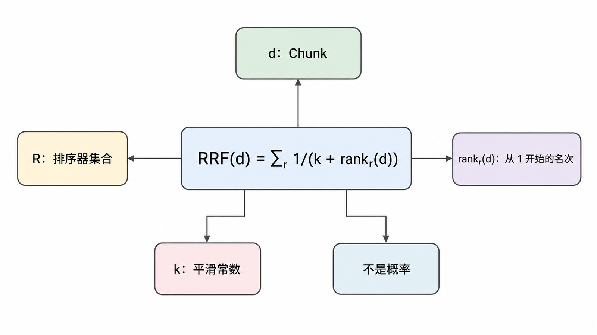

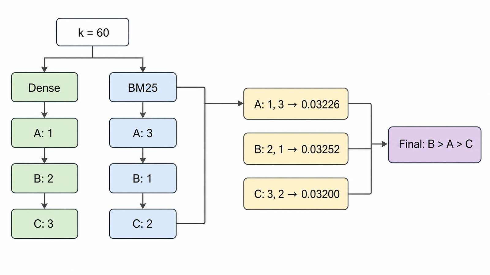

对文档 \(d\)，来自多个排序器的 RRF 分数为：

\[
\operatorname{RRF}(d)=\sum\_{r\in R}\frac{1}{k+\operatorname{rank}\_r(d)}
\]

- \(R\)：排序器集合。
- \(\operatorname{rank}\_r(d)\)：文档在排序器 \(r\) 中从 1 开始的名次。
- \(k\)：平滑常数，降低极端头部名次的支配性；它是需要记录和验证的配置，不是概率。

设 `k=60`：

| Chunk | Dense 排名 | BM25 排名 |                    RRF 分数 |
| ----- | ---------: | --------: | --------------------------: |
| A     |          1 |         3 | \(1/61+1/63\approx0.03226\) |
| B     |          2 |         1 | \(1/62+1/61\approx0.03252\) |
| C     |          3 |         2 | \(1/63+1/62\approx0.03200\) |

B 融合后排第一，因为它在 BM25 中第一、Dense 中第二。

### 可运行的 RRF

```python
from collections import defaultdict

def reciprocal_rank_fusion(
    rankings: list[list[str]], *, smooth: int = 60
) -> list[tuple[str, float]]:
    if smooth < 0:
        raise ValueError("smooth 必须非负")

    scores: dict[str, float] = defaultdict(float)
    for ranking in rankings:
        for rank, chunk_id in enumerate(ranking, start=1):
            scores[chunk_id] += 1.0 / (smooth + rank)

    return sorted(scores.items(), key=lambda item: (-item[1], item[0]))

dense = ["A", "B", "C"]
bm25 = ["B", "C", "A"]
print(reciprocal_rank_fusion([dense, bm25]))
```

用 `chunk_id` 融合，而不是用整段文本或列表位置，才能正确去重并支持版本追踪。

## 重排序：在小候选集上做更贵的判断

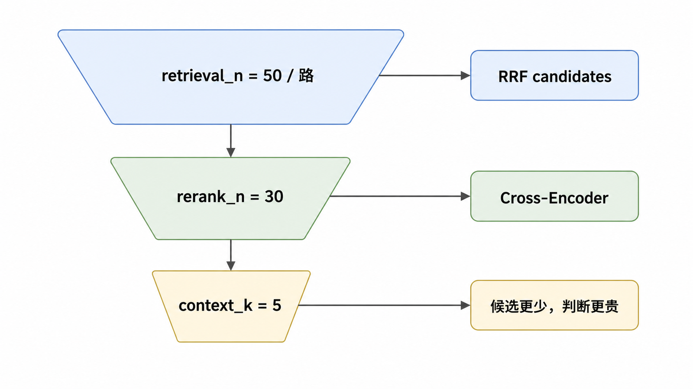

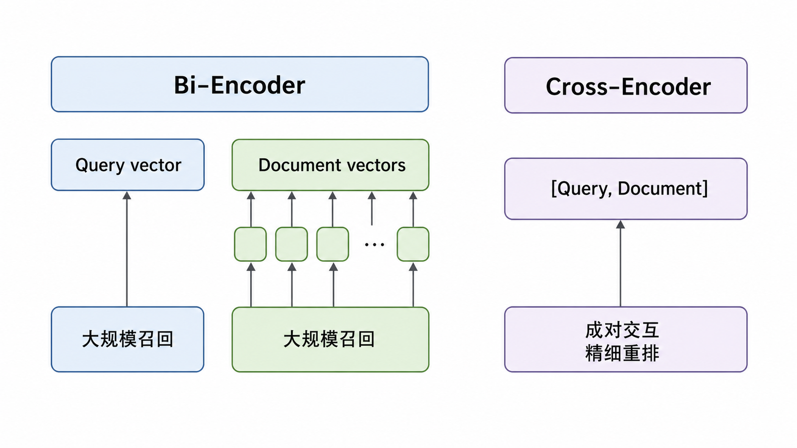

双编码 Dense Retriever 分别编码 Query 和文档，适合大规模召回。Cross-Encoder 把 Query 与候选文档成对输入模型，让两者充分交互，通常更适合精细排序，但计算成本随候选数量增加。

典型配置需要区分三个数量：

- `retrieval_n`：每路召回多少候选，例如 50。
- `rerank_n`：融合后送入重排多少条，例如 30。
- `context_k`：最终进入上下文多少条，例如 5。

这些数字只是示意，必须通过评测集和上下文预算确定。

```python
from dataclasses import dataclass

@dataclass(frozen=True)
class Candidate:
    chunk_id: str
    text: str
    fused_score: float
    rerank_score: float | None = None

def rerank(query: str, candidates: list[Candidate], scorer, limit: int):
    pairs = [(query, candidate.text) for candidate in candidates[:limit]]
    scores = scorer.predict(pairs)
    rescored = [
        Candidate(c.chunk_id, c.text, c.fused_score, float(score))
        for c, score in zip(candidates[:limit], scores, strict=True)
    ]
    return sorted(rescored, key=lambda c: c.rerank_score, reverse=True)
```

生产实现需要批处理、超时、模型版本记录和降级策略。

## MMR 解决的是重复，不是纯相关性

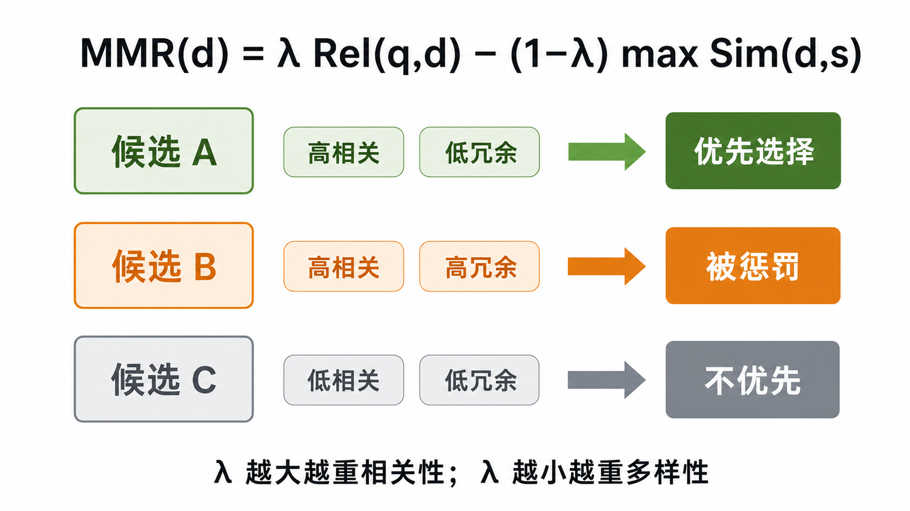

Maximum Marginal Relevance 在相关性和结果多样性之间权衡：

\[
\operatorname{MMR}(d)=\lambda\operatorname{Rel}(q,d)
-(1-\lambda)\max\_{s\in S}\operatorname{Sim}(d,s)
\]

当多个 Chunk 来自同一段落或内容高度重叠时，MMR 可以减少冗余。但它可能牺牲纯相关性，不应把“更多样”直接表述为“更准确”。父子展开后的按父 ID 去重通常应先做，再决定是否需要 MMR。

## 查询改写、HyDE 与查询分解

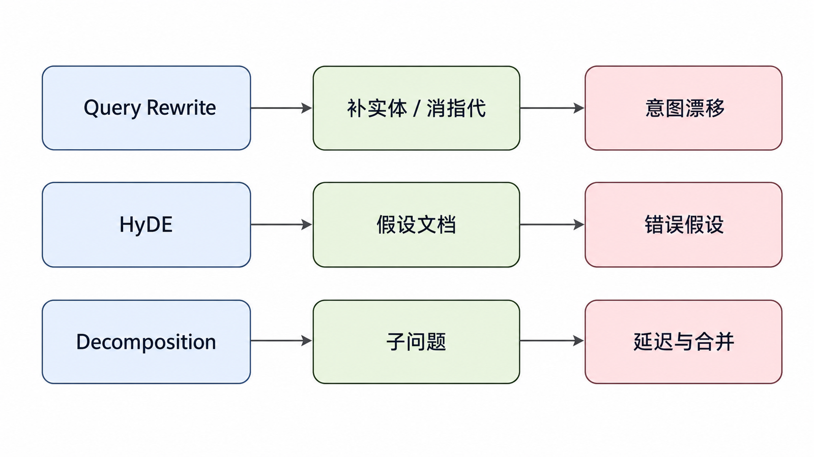

### 查询改写

将口语问题改成适合检索的表达，例如补充实体或消除指代。风险是改写模型可能改变用户意图，因此应保留原始 Query，并允许原始 Query 作为并行召回支路。

### HyDE

先生成一段假设答案或假设文档，再对它做 Embedding 检索。它可能缩小 Query 与文档风格差距，也可能把错误假设带入检索。适合作为需要消融验证的支路，不应默认开启。

### 查询分解

复杂问题可能需要多个子问题：

```text
“上海出差住宿超标且缺少发票时怎么处理？”
  ├─ 上海住宿标准是多少？
  ├─ 超标由谁审批？
  └─ 缺少发票需要什么替代材料？
```

分解后要保留“子问题—证据—最终断言”的映射，并限制子查询数量，避免延迟和成本失控。

## 检索评测指标

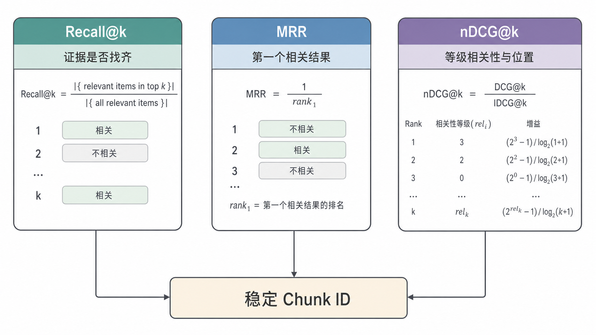

设第 \(i\) 个结果的相关性为 \(rel_i\)。

### Recall@k

\[
\operatorname{Recall@k}=\frac{|\text{Top-k relevant IDs}|}{|\text{all relevant IDs}|}
\]

适合回答“必要证据有没有被召回”。如果一个问题需要多份证据，还应检查完整证据覆盖率。

### MRR

\[
\operatorname{MRR}=\frac{1}{N}\sum\_{j=1}^{N}\frac{1}{\operatorname{rank}\_j}
\]

只关注第一个相关结果的位置，适合每个问题存在主要证据的任务。

### nDCG@k

当相关性有等级时使用 DCG：

\[
\operatorname{DCG@k}=\sum\_{i=1}^{k}\frac{2^{rel_i}-1}{\log_2(i+1)}
\]

再除以理想排序的 IDCG 得到 nDCG。它同时考虑相关性等级和排序位置。

### 稳定 ID 评测实现

```python
def recall_at_k(retrieved: list[str], relevant: set[str], k: int) -> float:
    if not relevant:
        raise ValueError("无答案用例应单独评估，不能混入 Recall 分母")
    return len(set(retrieved[:k]) & relevant) / len(relevant)

def reciprocal_rank(retrieved: list[str], relevant: set[str]) -> float:
    for rank, chunk_id in enumerate(retrieved, start=1):
        if chunk_id in relevant:
            return 1.0 / rank
    return 0.0
```

无答案查询应评估拒答、阈值分布或误召回率，而不是把空相关集硬塞进 Recall 公式。

## 分阶段诊断

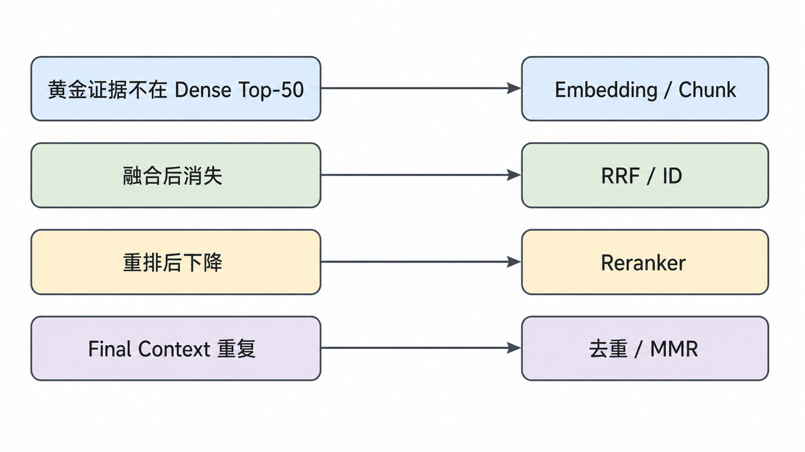

| 现象                      | 优先检查                         | 不应先做           |
| ------------------------- | -------------------------------- | ------------------ |
| 黄金证据不在 Dense Top-50 | Embedding、Query、Chunk          | 调生成 Prompt      |
| BM25 命中但融合后消失     | 融合参数、ID 去重                | 增大模型上下文     |
| 重排把正确证据降到后面    | Cross-Encoder 领域适配与输入截断 | 盲目增加候选数     |
| Final Context 重复        | 父 ID 去重、MMR、Overlap         | 重新训练 Embedding |
| 延迟陡增                  | 各阶段 p95 与候选数量            | 只看端到端平均值   |

## 缓存边界

缓存 Key 至少应包含规范化 Query、租户/ACL 摘要、过滤条件、检索配置和索引版本。只用 Query 字符串会造成：

- 用户权限变化后命中旧结果。
- 索引更新后继续返回过期 Chunk。
- 不同过滤条件共享错误缓存。

语义缓存还可能把表面相似但答案不同的问题合并，必须在黄金集和对抗样本上校准阈值。

## 常见误区

- 直接线性相加未经校准的 Dense 与 BM25 分数。
- 把 RRF 分数解释为相关概率。
- 把 MMR 当作纯粹的准确率优化。
- 只评估最终答案，不保存各阶段候选。
- 用 `page_content` 完全相等判断命中。
- 把离线固定评测误称为线上 A/B 测试。
- 缓存 Key 不包含租户和索引版本。

## 自检题

<details>
<summary>1. 为什么 RRF 适合融合不同检索器？</summary>

它基于名次而不是原始分数，不要求 Dense 与 BM25 共享数值尺度。

</details>

<details>
<summary>2. Recall@20 提升但 nDCG@5 下降，意味着什么？</summary>

系统找到了更多相关候选，但高相关证据在头部的排序可能变差；重排或融合需要进一步检查。

</details>

<details>
<summary>3. 为什么查询改写必须保留原始 Query？</summary>

改写可能改变意图。保留原始 Query 可用于并行召回、审计和比较改写是否真的改善结果。

</details>

## 总结与下一篇

高质量检索是一个漏斗：多路召回保证覆盖，RRF 解决异构排名融合，Cross-Encoder 改善头部顺序，去重和预算控制形成最终 Context。每一层都必须有稳定 ID、指标和耗时。

下一篇将把解析、索引、混合检索、受约束生成和引用组装成一个可测试的最小 RAG 应用。

## 对应资料来源

- [Dense Passage Retrieval for Open-Domain Question Answering](https://arxiv.org/abs/2004.04906)
- [Reciprocal Rank Fusion Outperforms Condorcet and Individual Rank Learning Methods](https://plg.uwaterloo.ca/~gvcormac/cormacksigir09-rrf.pdf)
- [Maximum Marginal Relevance](https://dl.acm.org/doi/10.1145/290941.291025)
- [ARES: An Automated Evaluation Framework for RAG Systems](https://arxiv.org/abs/2311.09476)

> 验证说明：RRF 与指标代码仅依赖 Python 标准库；Cross-Encoder 代码通过 `scorer.predict` 协议表达，具体实现和模型应在项目中固定版本。
