## 前置知识与学习目标

本文假设你已经完成可测试的 RAG 基线。读完后，你应该能够：

- 将在线 Serving、异步 Indexing 和发布 Control Plane 分离。
- 设计幂等索引任务、版本切换、缓存失效和快速回滚。
- 把租户与 ACL 放在检索安全边界，而不是答案后处理。
- 为质量、延迟、成本、安全和新鲜度建立可观测指标。
- 通过故障演练验证备份、恢复和降级，而不是只写配置文件。

## 生产架构的三个平面

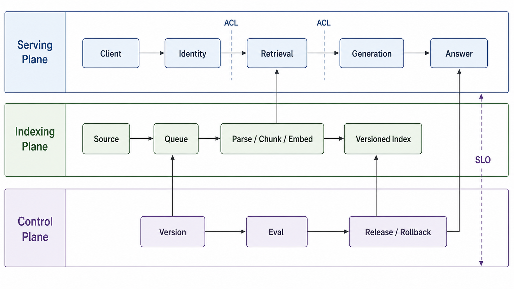

### Serving Plane

```text
Gateway / Identity
  → Query API
  → ACL-aware Retrieval
  → Reranker
  → Context Builder
  → Generation
  → Citation Validator
  → Response
```

职责是低延迟回答，不应同步解析大文件或重建索引。

### Indexing Plane

```text
Source Connector
  → Durable Queue
  → Parse / OCR / ASR
  → Chunk / Metadata / ACL
  → Embedding / Sparse Index
  → Quality Gate
  → Candidate Index Version
```

职责是异步、幂等、可重试地生成候选索引版本。

### Control Plane

负责配置、版本注册、黄金评测、发布审批、流量切换、回滚、密钥、审计和策略。把这些能力散落在在线进程的环境变量和手工命令中，会让发布不可重复。

## 版本是一等公民

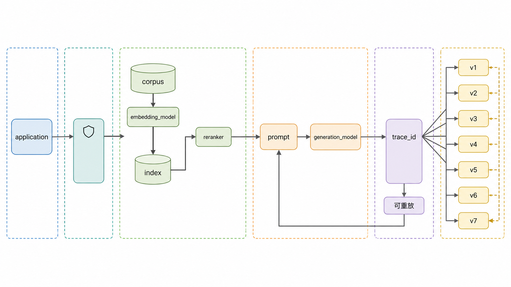

每个请求至少关联：

```python
from dataclasses import dataclass

@dataclass(frozen=True)
class RuntimeVersion:
    application: str
    corpus: str
    index: str
    embedding_model: str
    reranker: str
    prompt: str
    generation_model: str
```

如果只记录应用 Git SHA，而没有索引、语料和模型版本，就无法重放“昨天同一个问题为什么答案不同”。

## 幂等索引任务

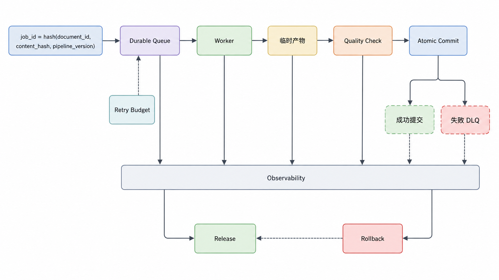

索引消息需要稳定幂等键：

```python
import hashlib

def indexing_job_id(
    document_id: str,
    content_hash: str,
    pipeline_version: str,
) -> str:
    raw = f"{document_id}|{content_hash}|{pipeline_version}".encode()
    return hashlib.sha256(raw).hexdigest()
```

Worker 的基本语义：

1. 检查 Job ID 是否已经成功提交。
2. 读取不可变输入版本。
3. 生成临时产物。
4. 校验 Chunk、向量维度、权限与数量。
5. 原子提交或标记失败。
6. 只有可重试错误才进入退避重试。
7. 超过预算进入 Dead Letter Queue，不能无限重试。

文档删除也是索引事件，必须传播到向量索引、关键词索引、对象存储派生物、缓存和评测引用。

## 蓝绿索引发布

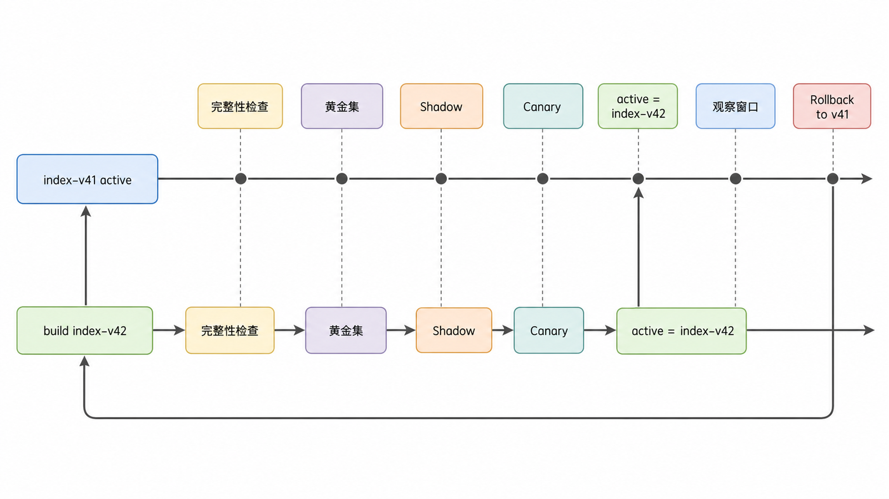

```text
active: index-v41
build : index-v42
  → 完整性检查
  → 黄金集回归
  → 影子流量
  → 小比例 Canary
  → 原子切换 active=index-v42
  → 观察窗口
  → 保留 v41 以便回滚
```

不要在活动索引上进行大规模破坏性重建。索引切换与缓存命名空间切换应一起设计，否则新请求可能命中新旧混合结果。

## 配置和秘密

配置分三类：

- 非秘密运行配置：候选数、超时、Prompt 版本。
- 秘密：API Key、数据库凭据、签名密钥。
- 策略：ACL、保留期、允许模型和发布门。

```python
import os

def required_env(name: str) -> str:
    value = os.getenv(name)
    if not value:
        raise RuntimeError(f"missing required environment variable: {name}")
    return value

OPENAI_API_KEY = required_env("OPENAI_API_KEY")
```

不要用前缀规则猜测 Key 是否有效，也不要在异常、日志或健康检查中输出秘密。生产环境应使用秘密管理系统和短期身份，配置变更需审计。

## API 生命周期

### 启动

- 验证必要配置和版本兼容性。
- 建立连接池。
- 加载活动索引指针。
- 预热有限资源。
- 启动后才报告 Ready。

### 请求

- 生成或接收 `trace_id`。
- 验证身份、租户、配额和输入大小。
- 传播超时与取消。
- 记录阶段耗时和版本。
- 对输出做结构与引用校验。

### 关闭

- 停止接收新请求。
- 在预算内完成或取消进行中的任务。
- 刷新日志和指标。
- 关闭连接池。

健康检查应分开：

- Liveness：进程是否活着。
- Readiness：是否能安全接流量。
- Dependency Health：下游异常状态，用于告警，不一定直接让所有实例退出服务。

## 超时、重试和背压

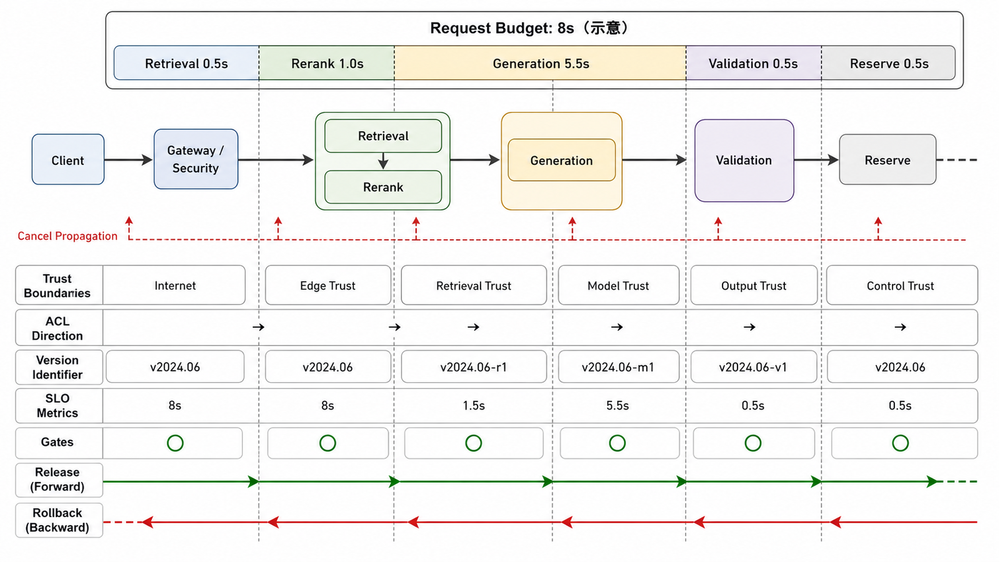

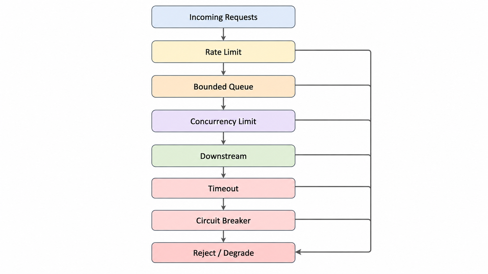

总超时必须分配到阶段：

```text
request budget 8s
  retrieval 0.5s
  rerank 1.0s
  generation 5.5s
  validation/serialization 0.5s
  reserve 0.5s
```

这些数值只是示意。关键原则：

- 只重试幂等操作或带幂等键的写入。
- 重试受次数和总时间预算限制。
- 使用指数退避和随机抖动。
- 并发有上限，队列也有上限。
- 客户端取消应传播到下游昂贵调用。
- 熔断器打开时返回明确降级，而不是无限排队。

## 安全边界

### 身份、租户与 ACL

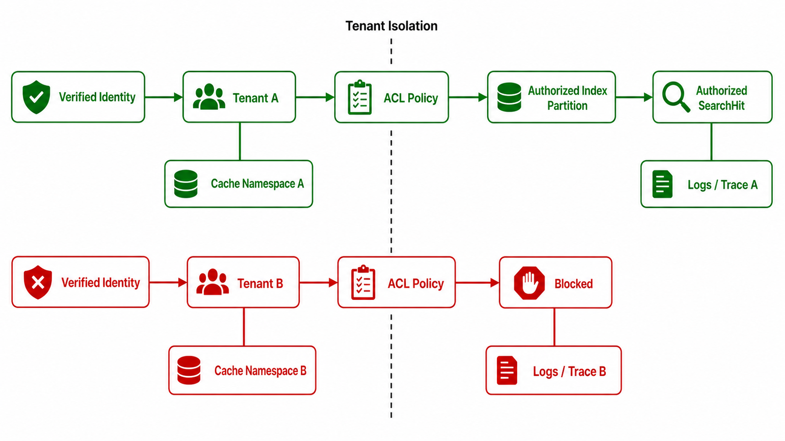

可信身份提供方验证用户后，服务端生成租户和角色上下文。检索必须只在授权集合内进行：

```text
verified identity
  → tenant boundary
  → ACL / policy filter
  → retrieval candidates
```

不得相信客户端自报角色，也不能先跨租户召回再在答案中“尽量不提”。缓存 Key、日志和 Trace 同样必须隔离。

### Prompt Injection 与知识库投毒

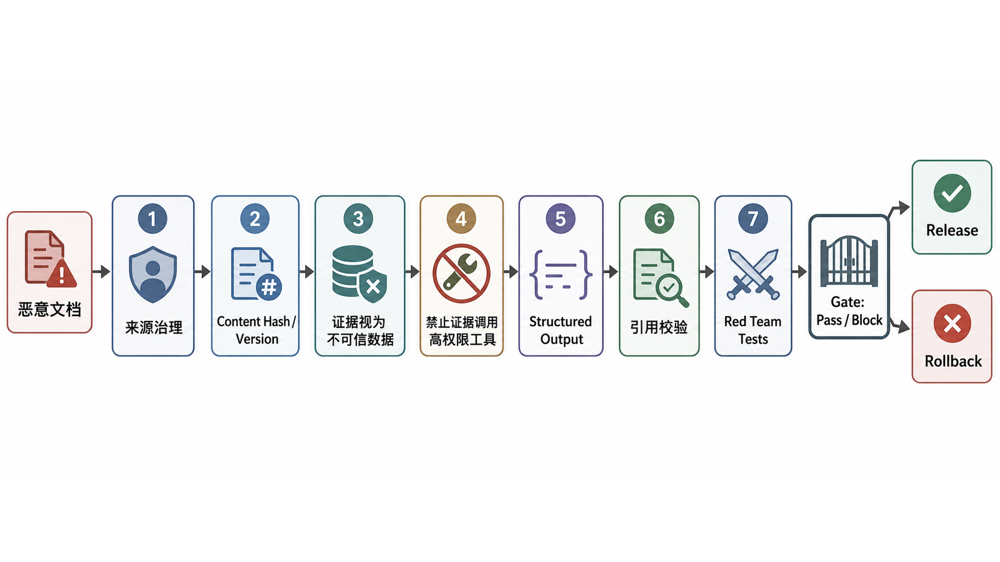

检索文档是不可信数据。攻击者可以在网页、PDF、图片或音频中嵌入“忽略系统指令”“泄露其他文档”等内容。

防护采用纵深策略：

- 限制知识源写权限和审核发布者。
- 保存来源、版本、签名或内容哈希。
- 将检索文本明确标记为数据。
- 生成服务不直接拥有高权限工具。
- 工具调用使用独立策略与参数校验。
- 对输出 Schema、引用 ID 和敏感信息做校验。
- 维护对抗语料并持续红队测试。

任何单一 Prompt 或正则都不能构成完整防护。

### 数据最小化

- Query、Context 和回答日志默认可能含敏感数据。
- 只记录诊断需要的字段，必要时哈希或脱敏。
- 设置保留期限、访问控制和删除流程。
- 备份、Trace、缓存与离线评测副本都必须执行删除要求。

## 可观测性

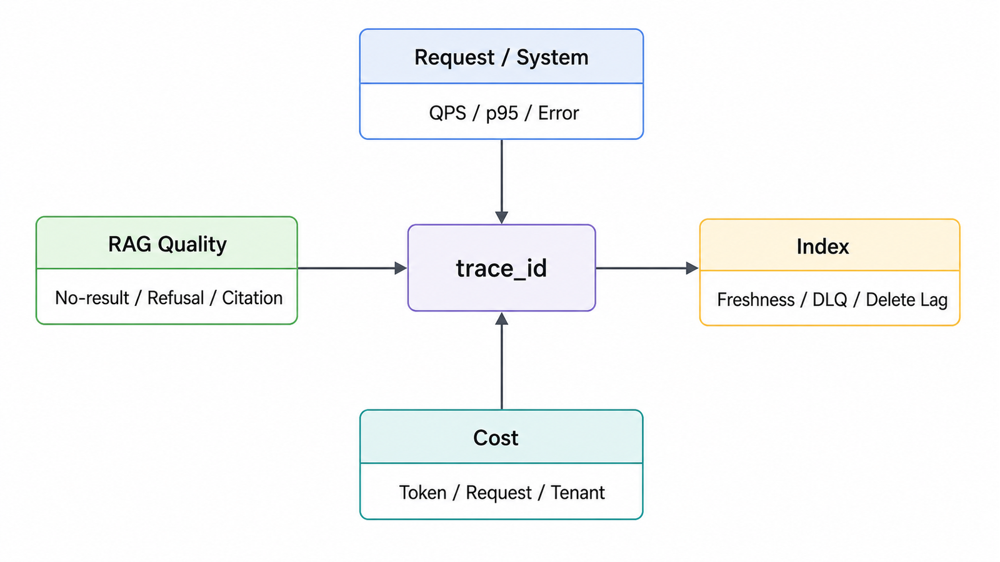

### 请求与系统指标

- QPS、并发、队列深度、错误率、超时率。
- 各阶段 p50/p95/p99 延迟。
- 下游限流、重试、熔断和降级次数。
- CPU、内存、连接池、索引缓存与网络。

### RAG 质量指标

- 无结果率、候选数、分数分布漂移。
- Context Token、重复率、截断率。
- 拒答率、引用数量、Citation Validity。
- 黄金集定时回归和按 Tag 的质量趋势。
- 用户反馈只能作为信号，不能替代标注评测。

### 索引指标

- Source freshness lag。
- 待处理、失败和 DLQ 任务。
- 文档数、Chunk 数、向量数之间的一致性。
- 当前活动版本与每个版本年龄。
- 删除传播延迟。

### 成本指标

- Embedding、Rerank、Generation 调用量与 Token。
- 每请求、每租户和每成功答案估算成本。
- 缓存命中及因错误失效造成的额外成本。

高基数 Query 或 Chunk ID 不应直接作为 Prometheus Label，可放入受控日志或 Trace。

## SLO 与告警

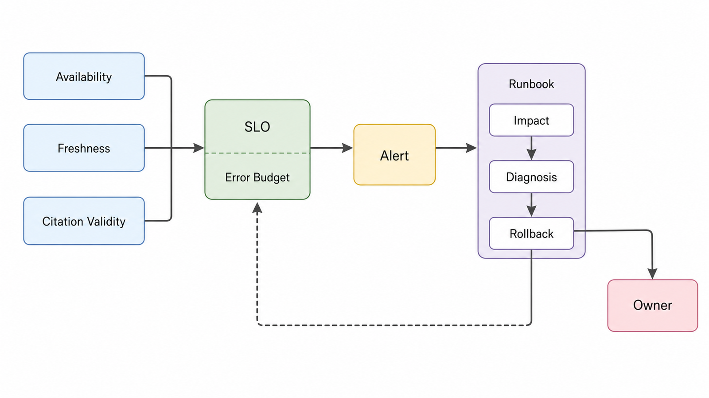

示例 SLI：

```text
Availability = 成功且在超时内完成的合格请求 / 合格请求总数
Freshness    = 当前时间 - 最新成功发布的源版本时间
Citation validity = 有效引用数 / 返回引用总数
```

质量 SLO 比 HTTP 可用性更难，因为需要黄金集或抽样标注。推荐组合：

- 在线服务 SLO：可用性与延迟。
- 索引 SLO：新鲜度和删除传播。
- 离线质量门：黄金集与安全回归。
- 抽样审计：答案与引用正确性。

告警应链接 Runbook，说明影响、诊断步骤、回滚命令和责任人，而不是只发一个指标名称。

## 安全降级

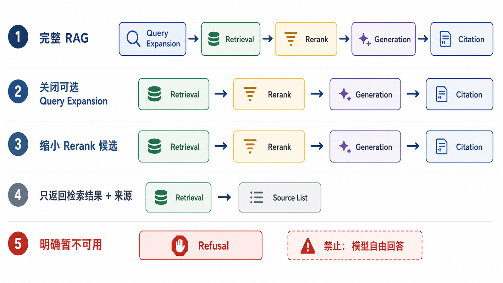

降级顺序示例：

1. 关闭可选 Query Expansion。
2. 缩小重排候选但不绕过 ACL。
3. 返回检索结果和来源，不生成综合答案。
4. 明确告知服务暂不可用。

不推荐的降级：在检索或引用校验故障时直接让模型凭参数知识回答，因为这悄悄改变了产品保证。

## 容量与负载测试

负载模型要接近真实流量：

- Query 长度和类型分布。
- 缓存命中与未命中比例。
- 不同租户和过滤选择性。
- 生成输出长度。
- 下游限流和故障注入。

报告至少包含吞吐、p50/p95/p99、错误、超时、队列长度、Token 和成本。只报告平均响应时间会隐藏过载点。

## 备份、恢复与灾难演练

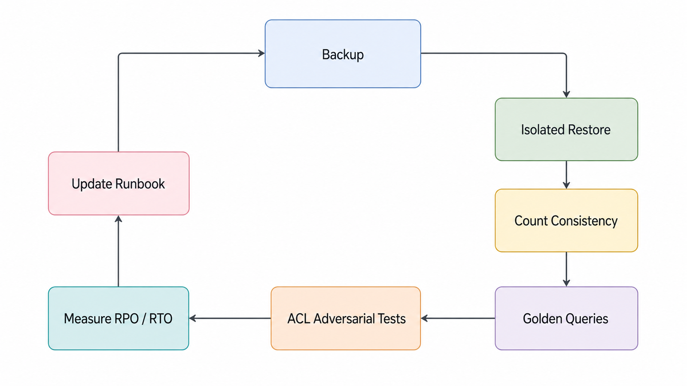

需要备份：

- 原始或受控知识源引用。
- 解析与 Chunk Manifest。
- 索引配置、模型和 Pipeline 版本。
- 元数据、ACL 和活动版本指针。
- 黄金评测集与发布记录。

向量往往可以重建，但重建时间决定 RTO。只有执行恢复演练，才能证明备份有效：

1. 在隔离环境恢复元数据和索引。
2. 校验文档、Chunk、向量数量。
3. 运行黄金查询和 ACL 对抗集。
4. 测量 RPO/RTO。
5. 记录缺口并修复 Runbook。

## CI/CD 发布门

```text
代码检查
  → 单元与契约测试
  → 固定语料集成测试
  → 黄金质量回归
  → 安全/ACL/注入测试
  → 镜像与依赖扫描
  → 候选环境部署
  → Smoke + Load Test
  → Canary
  → 自动或人工批准
```

应用、Prompt 和索引可以独立发布，但必须在 Runtime Version 中组合记录，并定义兼容矩阵。

## 上线检查表

### 数据与索引

- [ ] 文档、Chunk、向量数量一致。
- [ ] 新旧版本可识别并能回滚。
- [ ] 更新、删除和缓存失效已测试。
- [ ] 黄金查询通过。

### 安全

- [ ] 身份来自可信验证链。
- [ ] ACL 在检索前执行。
- [ ] 缓存、日志和 Trace 按租户隔离。
- [ ] 对抗文档与间接提示注入已测试。
- [ ] 秘密不进入源码、镜像和日志。

### 可靠性

- [ ] 超时、重试、并发和队列均有上限。
- [ ] 下游故障有明确降级语义。
- [ ] Readiness 不会因轻微依赖抖动造成全体重启。
- [ ] 回滚和恢复演练完成。

### 质量与运营

- [ ] 版本字段可完整重放请求。
- [ ] 质量、延迟、成本和新鲜度有仪表盘。
- [ ] 告警有 Runbook 和责任人。
- [ ] 用户反馈可以进入标注与回归流程。

## 常见误区

- 把 Dockerfile 和 Kubernetes YAML 等同于生产就绪。
- 在活动索引上原地重建且无法回滚。
- 只监控 HTTP 200，不监控无结果、拒答和引用。
- 先跨租户检索，再做答案后置过滤。
- 使用无限重试或无限队列掩盖下游故障。
- 降级时绕过检索和引用保证。
- 有备份却从未恢复演练。
- 只记录应用版本，不记录语料、索引、Prompt 和模型版本。

## 自检题

<details>
<summary>1. 为什么索引版本切换应该与缓存命名空间关联？</summary>

否则新版本请求可能命中旧索引产生的缓存结果，形成难以观察的新旧混合状态。

</details>

<details>
<summary>2. 下游生成模型故障时，为什么“直接自由回答”不是安全降级？</summary>

它移除了证据约束和引用保证，却可能仍以相同产品界面返回确定答案。更安全的是返回来源、明确拒答或暂时不可用。

</details>

<details>
<summary>3. 备份任务每天成功，是否足以证明灾难恢复能力？</summary>

不足。还需在隔离环境恢复、验证数据一致性和黄金查询，并实际测量 RPO 与 RTO。

</details>

## 总结

生产级 RAG 不是把原型装入容器，而是把在线请求、异步索引和发布控制拆成可观察、可授权、可版本化、可回滚的系统。最终质量取决于证据生命周期和安全边界是否与模型调用同等可靠。

至此，本系列形成完整路径：架构 → 数据处理 → 向量检索 → 混合检索 → 最小应用 → 评估优化 → 多模态 → 生产部署。

## 对应资料来源

- [NIST AI RMF: Generative Artificial Intelligence Profile](https://www.nist.gov/publications/artificial-intelligence-risk-management-framework-generative-artificial-intelligence)
- [OWASP Top 10 for LLM and GenAI Applications](https://genai.owasp.org/llm-top-10/)
- [OWASP Prompt Injection Prevention Cheat Sheet](https://cheatsheetseries.owasp.org/cheatsheets/LLM_Prompt_Injection_Prevention_Cheat_Sheet.html)
- [OpenTelemetry Documentation](https://opentelemetry.io/docs/)
- [Kubernetes: Configure Liveness, Readiness and Startup Probes](https://kubernetes.io/docs/tasks/configure-pod-container/configure-liveness-readiness-startup-probes/)

> 验证说明：本文提供生产设计契约与检查表，不伪造一套可直接复制到所有环境的 Kubernetes、监控或故障转移配置。部署参数必须由真实 SLO、容量测试和组织安全策略确定。
