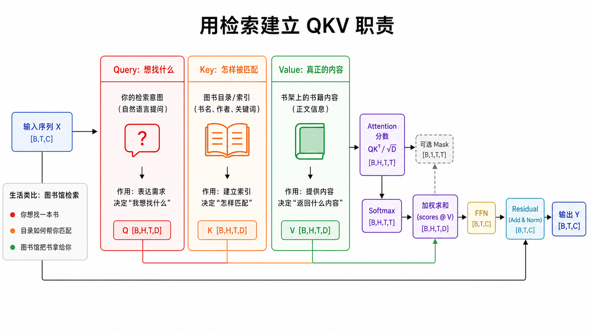
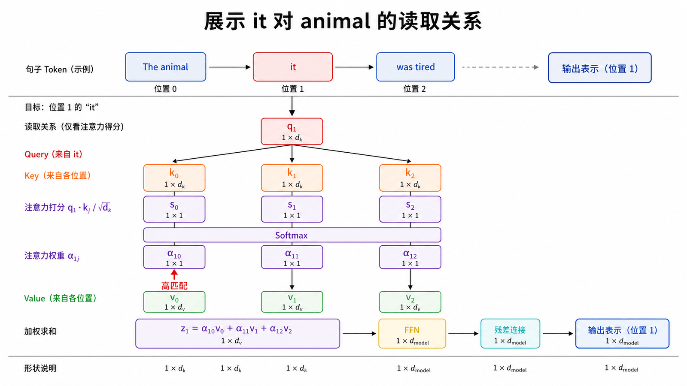
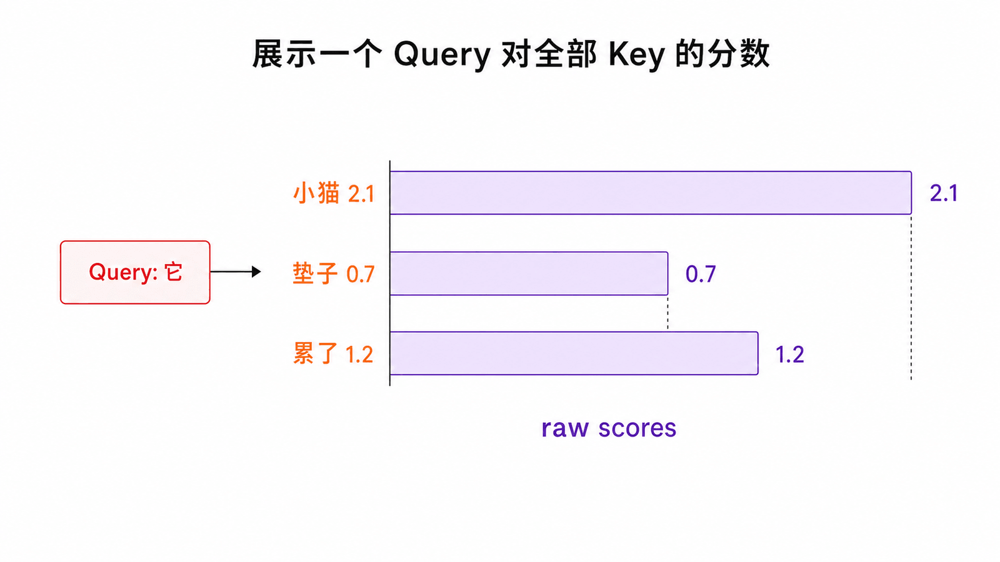
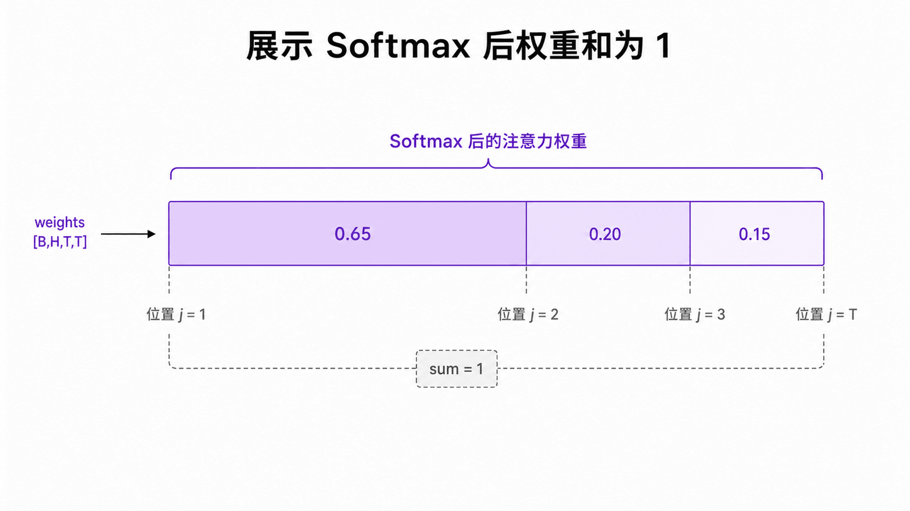
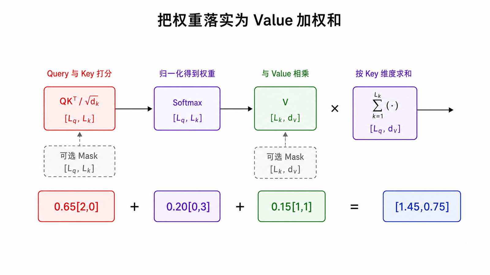
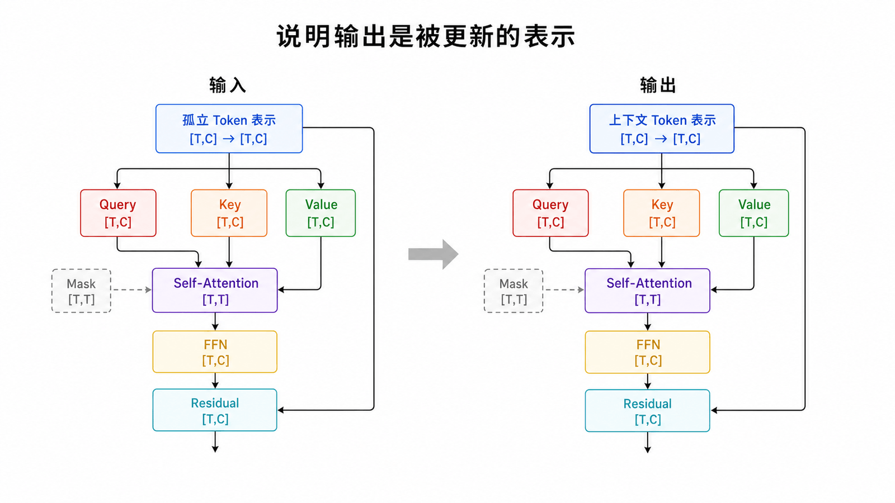
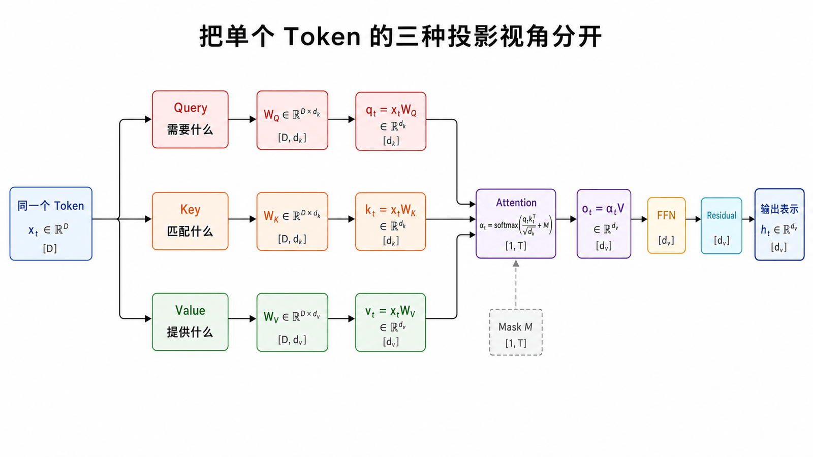
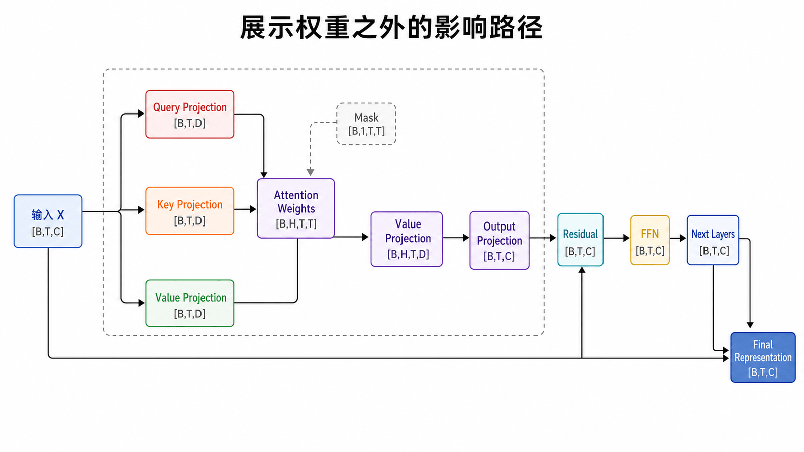
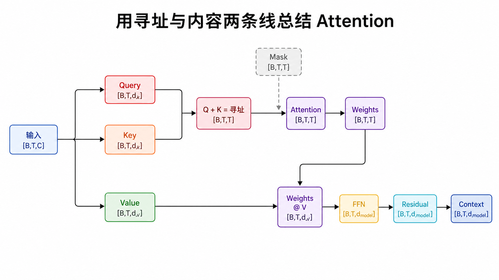

## 本篇要解决的问题

为什么一个 Token 要读取其他 Token？Query、Key、Value 分别扮演什么角色？注意力是“选中一个词”还是“混合多份信息”？

### 前置知识

读者应能把一句话看成一组 `[T,C]` Token 向量，并知道加权平均的含义。本篇只建立 Q、K、V 的职责直觉，矩阵推导放在下一篇。

## 把 Attention 想成一次软检索



在图书馆里，你带着检索意图查索引，匹配若干书，最后读取书中内容：

- Query 描述当前位置“想找什么”；
- Key 描述每个位置“可以怎样被匹配”；
- Value 是匹配后真正被取走并聚合的信息。

Q 与 K 负责**寻址**，V 负责**传递内容**。把匹配和内容拆开，让模型可以学习“凭某种特征找到它，却带走另一组特征”。

## 语言中的具体例子



观察句子：

> The animal didn't cross the street because it was too tired.

为了更新 `it` 的表示，模型可能需要从 `animal` 读取信息。训练后的某个注意力头可以让 `it` 的 Query 与 `animal` 的 Key 得到较高分。

这是解释机制的例子，不是保证：单个头未必干净地等于“指代头”，注意力权重也不能单独构成对模型推理过程的完整解释。

## 注意力是一组归一化权重





对目标 Token，模型给所有允许读取的位置计算分数，再把它们归一化为和为 1 的权重。

最高权重是 0.65，不代表其余位置被删除。Softmax 产生的是软分布；模型可以同时聚合主语、位置、语法标记等多份信号。

### 用一行数字完成一次“读取”



假设“它”只能读取三个 Value，注意力权重是 `[0.65, 0.20, 0.15]`：

```text
V小猫 = [2, 0]
V垫子 = [0, 3]
V累了 = [1, 1]
```

那么新的上下文信息为：

$$0.65[2,0]+0.20[0,3]+0.15[1,1]=[1.45,0.75]$$

输出不是某一个 Token 的复制，而是所有允许位置 Value 的加权组合。若最大权重接近 1，它会表现得像硬选择；若权重较分散，它会同时融合多处信息。

## 权重最终作用于 Value

如果权重为 $a_{ij}$，目标位置 `i` 的新信息为：

$$o_i = \sum_j a_{ij}v_j$$

注意力矩阵只是中间产物。真正送往后续网络的是 Value 的加权组合 `o_i`。因此“Attention 输出注意力分数”这句话不准确：它通常还要完成 `weights @ V`。

## Self-Attention 的 Self 是什么



Self-Attention 中，Q、K、V 都由同一组输入 `X` 投影得到，所以序列在“查询自身”。Cross-Attention 则让 Q 来自一条序列，K、V 来自另一条序列，第 10 篇会展开。

从输入到输出，Token 数量通常不变，形状也仍是 `[B,T,C]`；改变的是每个位置所包含的信息。

## 一个最小伪代码

```python
scores = match(query, keys)      # 与每个位置匹配
weights = softmax(scores)        # 变成和为 1 的权重
context = weights @ values       # 聚合真正的信息
```

这里故意省略矩阵维度、缩放和 Mask，只保留概念骨架。

### 从直觉过渡到 QKV



“匹配”不是字符串比较，而是向量点积。模型从同一个输入向量分别学习三种线性投影：Query 强调当前 Token 的信息需求，Key 强调它可被怎样检索，Value 强调匹配后要传递的内容。下一篇会把伪代码中的 `match` 精确写成 $QK^T/\sqrt{d_k}$。

### 注意力权重不是完整解释



权重只描述某一层、某一头在一次前向中的信息混合比例。残差连接会绕过注意力传递原表示，Value 和输出投影会改变被传递的内容，多层网络还会继续重写表示。因此热力图适合观察模型行为，但不能单独证明模型的因果推理过程。

## 常见误区

- Q、K、V 不是三个输入句子，而是可学习投影。
- Attention 不是数据库式硬命中，而是可微的软聚合。
- 权重高只表示该头在该次前向中读取比例高，不自动等于因果解释。
- Self-Attention 的输出是新表示，不只是热力图。

## 本篇自检



1. Q 与 K 决定什么，V 决定什么？
2. 注意力权重 `[0.7,0.2,0.1]` 表示硬选择还是软组合？
3. 为什么不能只凭一张注意力热力图断言模型的完整推理过程？

<details>
<summary>查看答案</summary>

1. Q 与 K 决定匹配和寻址，V 决定真正被聚合的内容。
2. 软组合，三个位置仍都对输出有贡献。
3. 因为残差、Value/输出投影、多头和后续层都会影响最终表示。

</details>

## 小结

一个 Token 用 Query 描述需求，用所有 Key 计算匹配，再按权重混合 Value，于是获得上下文信息。下一篇把 `match` 拆开，完整推导 $QK^T/\sqrt{d_k}$、Softmax 与矩阵形状。

**下一篇：** [Self-Attention 完整数学推导](/posts/transformer-04-self-attention-math/)

## 参考资料

- [3Blue1Brown：Attention in transformers, step-by-step](https://www.3blue1brown.com/lessons/attention/)
- [Attention Is All You Need](https://arxiv.org/abs/1706.03762)
