## 本篇要解决的问题

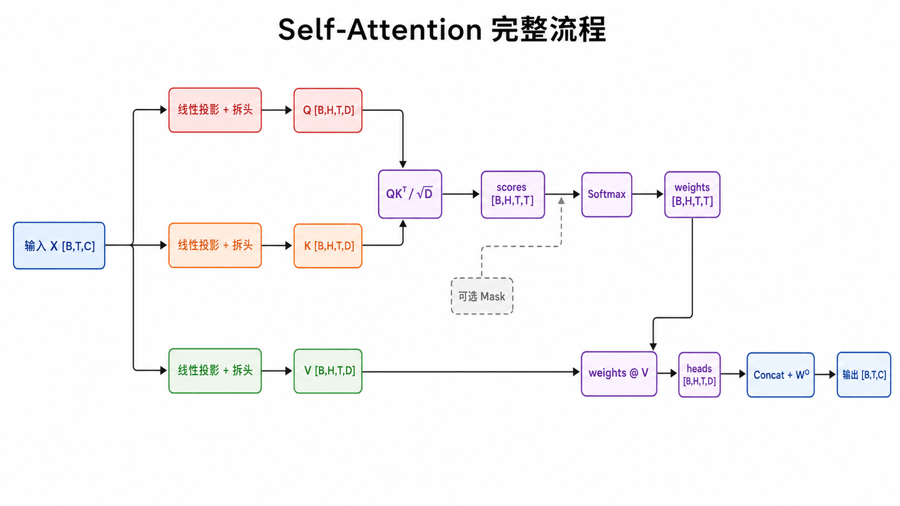

Q、K、V 从哪里来？为什么 $QK^T$ 得到 `T×T`？为什么缩放、为何逐行 Softmax、最终输出又是什么？

### 前置知识

读者应掌握矩阵乘法 Shape 规则：`[m,n] @ [n,p] → [m,p]`，并理解 Softmax 会把一组实数变成和为 1 的正数权重。

## 第一步：从同一输入投影 Q、K、V

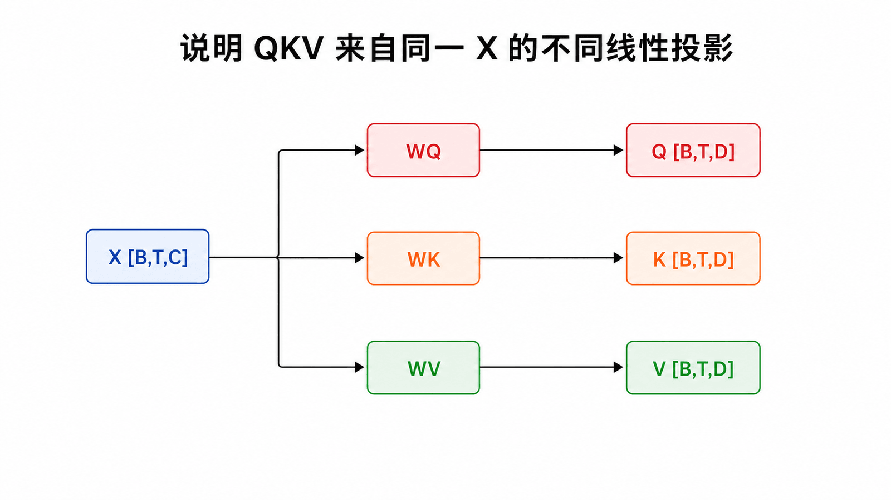

设单个注意力头的输入为 $X\in\mathbb{R}^{T\times C}$，三个可训练矩阵把它投影到头维度 $D$：

$$Q=XW_Q,\qquad K=XW_K,\qquad V=XW_V$$

批次存在时，`X` 是 `[B,T,C]`，线性层只作用于最后一维，Q、K、V 都是 `[B,T,D]`。

三个投影的参数不同，所以同一向量能同时表达“我需要什么”“我能被怎样匹配”“我要提供什么”。

## 第二步：用点积计算所有匹配

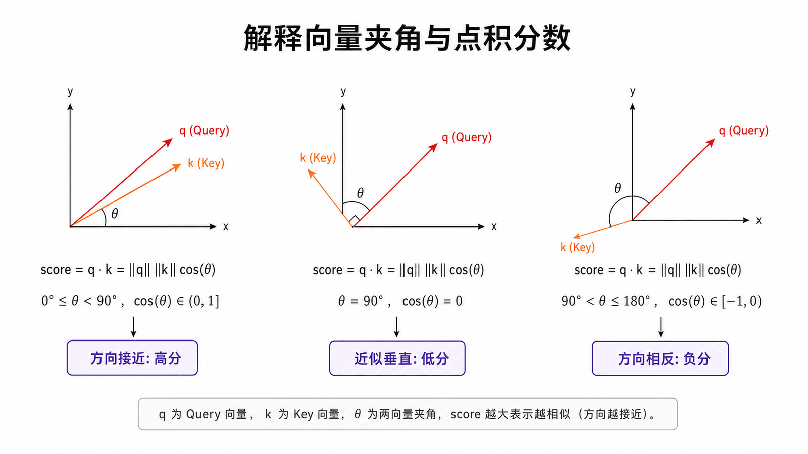

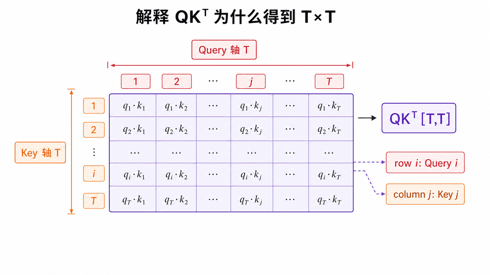

一个 Query 与一个 Key 的点积为：

$$s_{ij}=q_i\cdot k_j$$

把全部 Query 和 Key 放进矩阵，一次乘法就计算所有位置对：

$$S=QK^T$$

`[T,D] @ [D,T] → [T,T]`。结果的第 `i` 行表示 Query `i` 对所有 Key 的分数，第 `j` 列对应 Key `j`。

## 第三步：缩放分数

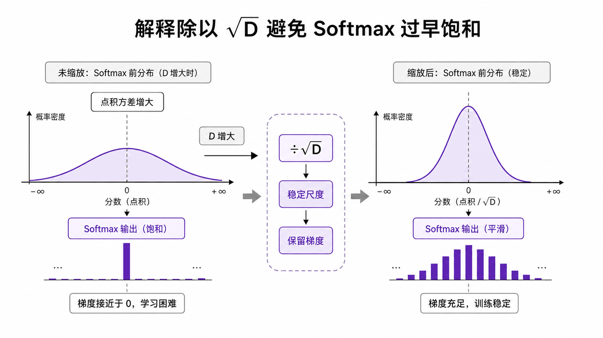

若 Q、K 各维近似独立且方差为 1，`D` 个乘积相加会使点积方差随 `D` 增大。大幅值送入 Softmax 容易得到过尖分布，梯度变小。论文因此使用：

$$\frac{QK^T}{\sqrt{d_k}}$$

缩放不是为了把向量“变小一点好看”，而是让不同头维度下的分数尺度更稳定。

## 第四步：逐行 Softmax

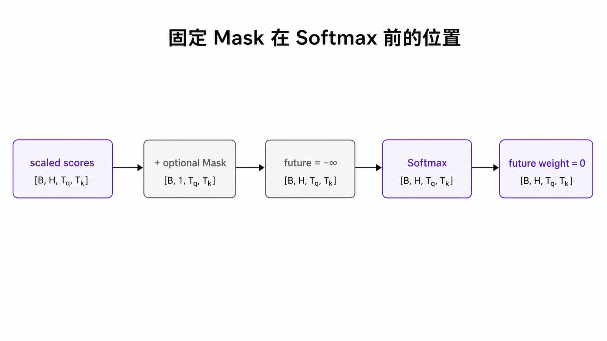

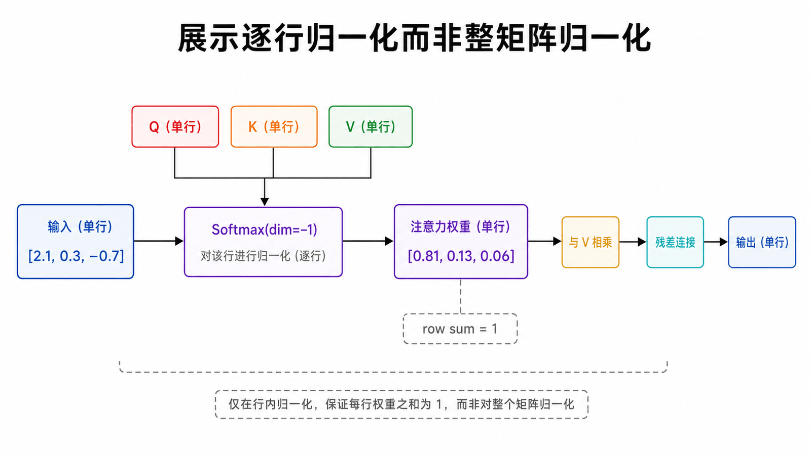

对矩阵最后一维做 Softmax：

$$A_{ij}=\frac{e^{S_{ij}}}{\sum_m e^{S_{im}}}$$

每一行和为 1，因为每个 Query 都需要自己的一份“读哪些 Key”的分布。若是因果模型，还要在 Softmax 之前把未来位置分数变成负无穷，第 7 篇详述。

## 第五步：混合 Value

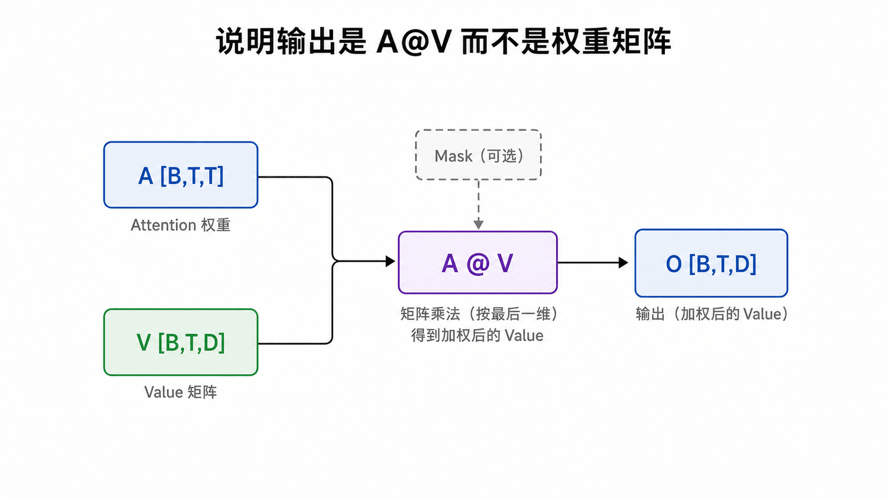

完整公式终于可以写成：

$$\operatorname{Attention}(Q,K,V)=\operatorname{softmax}\left(\frac{QK^T}{\sqrt{d_k}}\right)V$$

形状是 `[T,T] @ [T,D] → [T,D]`。第 `i` 行输出是所有 Value 对第 `i` 个 Query 的加权贡献。

## 公式、Shape 与 PyTorch 对齐

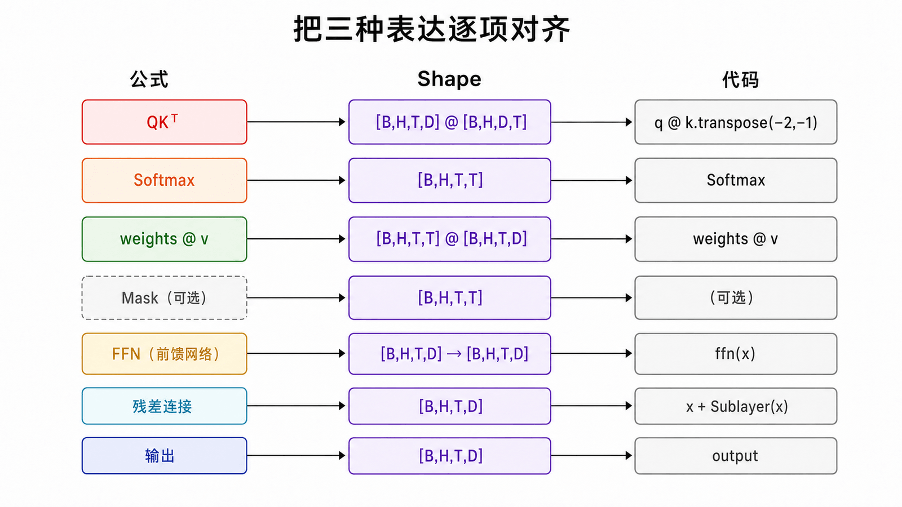

```python
import math
import torch.nn.functional as F

q = self.query(x)                          # [B,T,D]
k = self.key(x)                            # [B,T,D]
v = self.value(x)                          # [B,T,D]
scores = q @ k.transpose(-2, -1)           # [B,T,T]
scores = scores / math.sqrt(q.size(-1))
weights = F.softmax(scores, dim=-1)         # [B,T,T]
out = weights @ v                          # [B,T,D]
```

注意 `transpose(-2,-1)` 交换的是 K 的序列维和特征维；`dim=-1` 表示每个 Query 沿全部 Key 归一化。

## Tensor Shape 总表

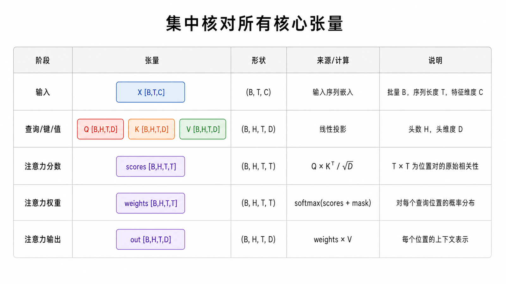

| 张量      | 含义                         | 单头 Shape | 多头 Shape  |
| --------- | ---------------------------- | ---------- | ----------- |
| `X`       | 输入表示                     | `[B,T,C]`  | `[B,T,C]`   |
| `Q/K/V`   | 查询、索引、内容             | `[B,T,D]`  | `[B,H,T,D]` |
| `scores`  | 每个 Query 对全部 Key 的分数 | `[B,T,T]`  | `[B,H,T,T]` |
| `weights` | 每行和为 1 的权重            | `[B,T,T]`  | `[B,H,T,T]` |
| `out`     | Value 的加权组合             | `[B,T,D]`  | `[B,H,T,D]` |

这里 `T×T` 与特征维 `C` 无关：它来自“序列中的每个 Query 都要和序列中的每个 Key 比较”。

## 用一个数字例子验算

若某行缩放后分数为 `[2.1, 0.3, -0.7]`，Softmax 约为 `[0.81, 0.13, 0.06]`，则：

$$o=0.81v_1+0.13v_2+0.06v_3$$

三个系数加起来等于 1，但输出不一定落在简单“语义平均”上，因为 V 本身是学习到的向量，后面还有输出投影、残差与非线性层。

### 一个从头到尾可手算的例子

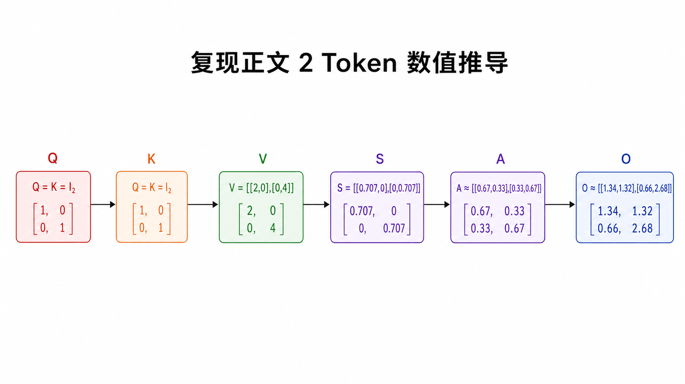

忽略 Batch，令 `T=2`、`D=2`：

$$Q=K=\begin{bmatrix}1&0\\0&1\end{bmatrix},\qquad V=\begin{bmatrix}2&0\\0&4\end{bmatrix}$$

缩放分数为：

$$S=\frac{QK^T}{\sqrt{2}}=\begin{bmatrix}0.707&0\\0&0.707\end{bmatrix}$$

逐行 Softmax 约得到：

$$A\approx\begin{bmatrix}0.67&0.33\\0.33&0.67\end{bmatrix}$$

因此：

$$O=AV\approx\begin{bmatrix}1.34&1.32\\0.66&2.68\end{bmatrix}$$

第一行输出主要读取第一个 Value，但仍混入第二个 Value；第二行则相反。这就是“软检索”的精确数值版本。

### 用 PyTorch 复核手算结果

```python
import math
import torch

q = torch.eye(2)
k = torch.eye(2)
v = torch.tensor([[2.0, 0.0], [0.0, 4.0]])

scores = q @ k.T / math.sqrt(2)
weights = scores.softmax(dim=-1)
out = weights @ v

assert out.shape == (2, 2)
assert torch.allclose(weights.sum(dim=-1), torch.ones(2))
print(weights, out)
```

## 常见误区

- `QKᵀ` 的每行对应一个 Query，不要把轴写反。
- Softmax 沿 Key 维做，不是对整个矩阵一次归一化。
- 缩放项是 $\sqrt{d_k}$，不是序列长度 $T$。
- Attention 输出是 `A @ V`，不是 A。
- 公式描述单头；Multi-Head 还要拆头、拼接和输出投影。

## 本篇自检

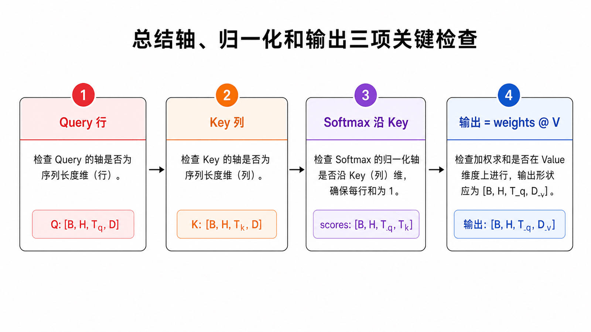

1. 为什么 `[B,T,D] @ [B,D,T]` 得到 `[B,T,T]`？
2. Softmax 为什么沿最后一个 Key 维度计算？
3. Attention 最终为什么还要乘 V？

<details>
<summary>查看答案</summary>

1. 每个 Query 位置都与每个 Key 位置做点积，两个自由位置轴组成 `T×T`。
2. 每个 Query 需要一份对全部 Key 的独立归一化分布。
3. Q/K 只负责算寻址权重，V 才包含要聚合并传给后续层的内容。

</details>

## 小结

Self-Attention 的完整链路是：线性投影 → 全部位置对点积 → 缩放 → Mask（若需要）→ 逐行 Softmax → Value 加权和。下一篇讨论为什么一个投影空间还不够，以及多头结构如何在不改变总模型维度的情况下并行学习多种关系。

**下一篇：** [为什么需要多头注意力](/posts/transformer-05-multi-head-attention/)

## 参考资料

- [Attention Is All You Need：Scaled Dot-Product Attention](https://arxiv.org/abs/1706.03762)
- [The Annotated Transformer：Attention](https://nlp.seas.harvard.edu/annotated-transformer/)
- [3Blue1Brown：Attention in transformers, step-by-step](https://www.3blue1brown.com/lessons/attention/)
