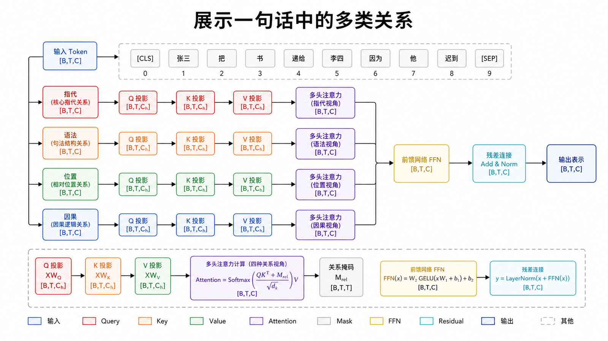
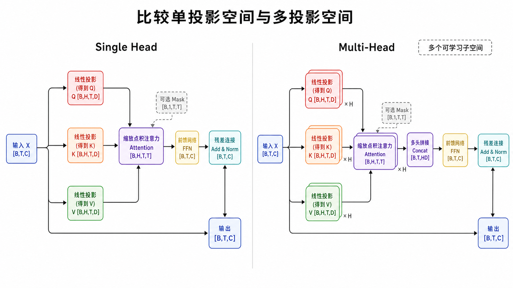
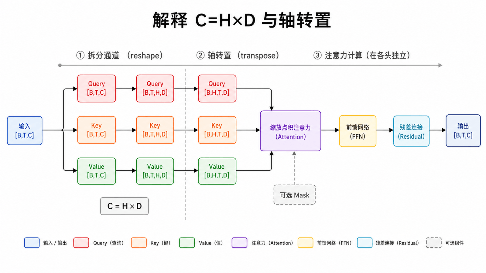
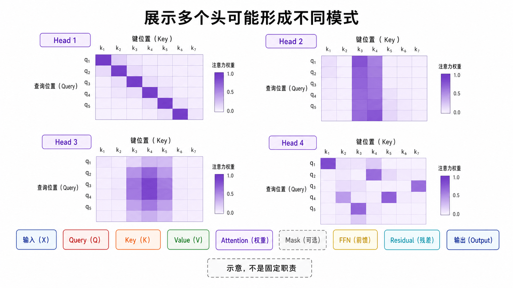
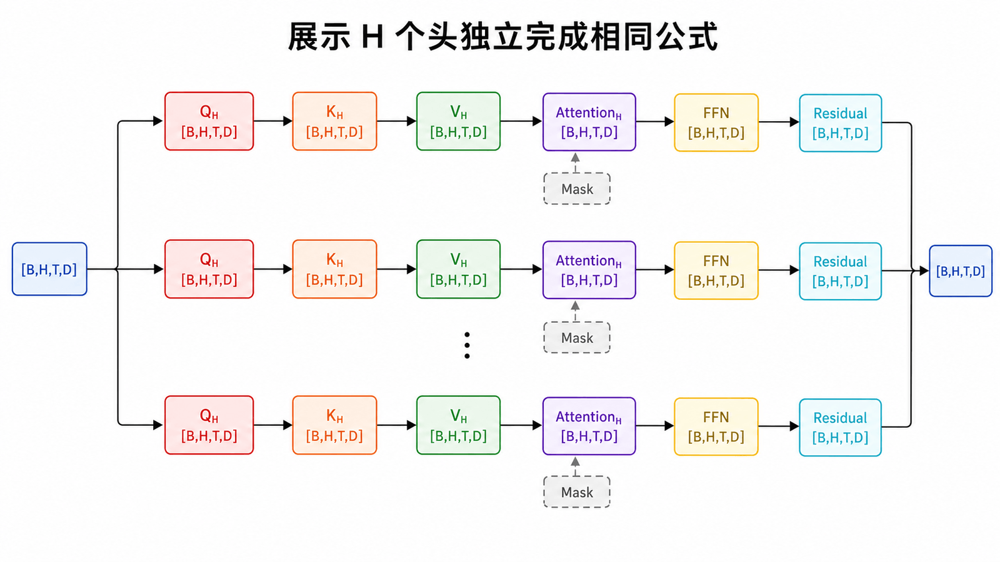
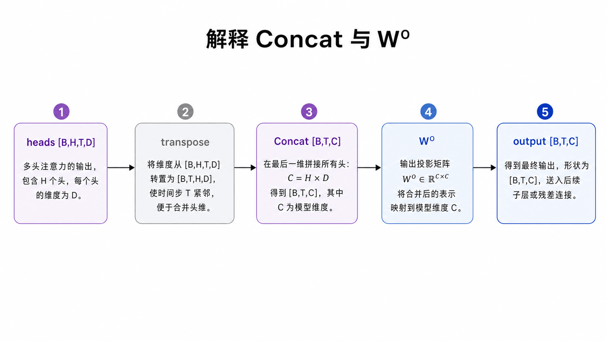
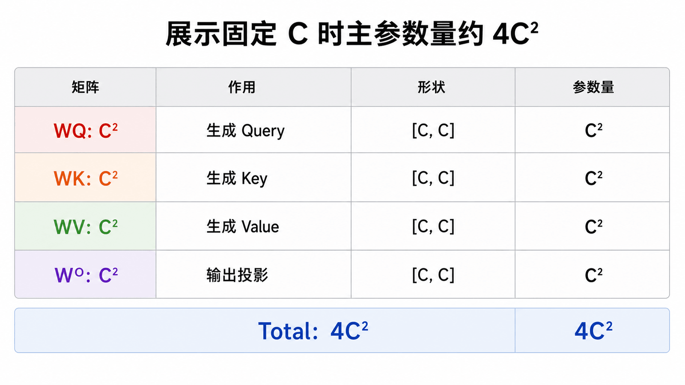
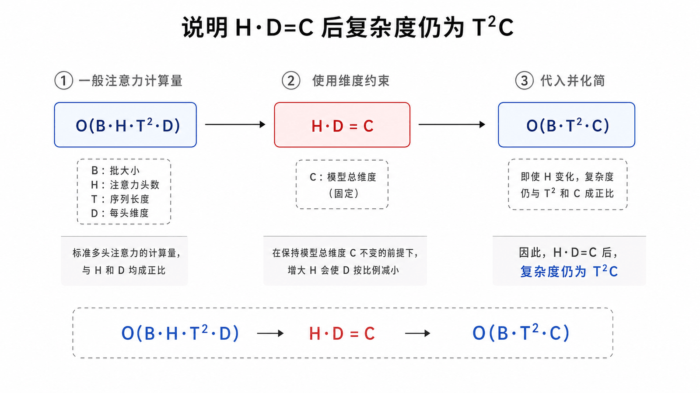
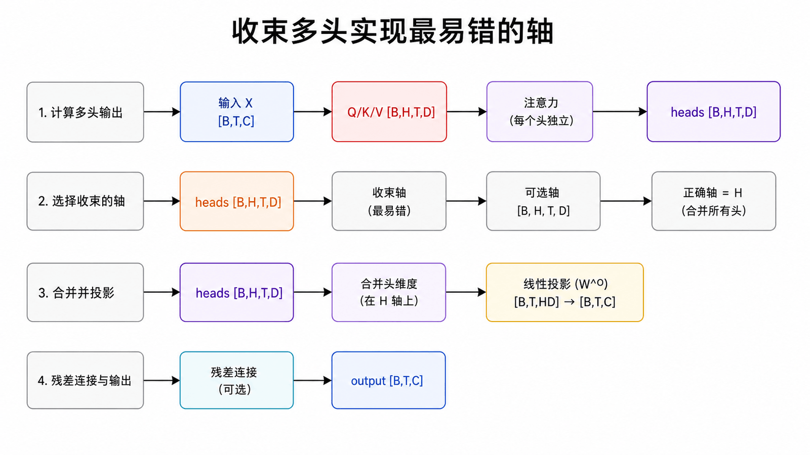

## 本篇要解决的问题

为什么不把所有通道放进一个大注意力头？`C=H×D` 怎样出现？多头结果如何重新变回 `[B,T,C]`？

### 前置知识

读者应能写出单头公式 $\operatorname{softmax}(QK^T/\sqrt{D})V$，并理解 `[B,T,C]` 中三个轴的含义。

## 一句话里通常有多种关系





“小猫坐在垫子上，因为它累了”同时包含指代、主谓、空间与因果关系。单个头并非不能表达多种模式，但它只有一套 Q/K/V 投影和一张注意力矩阵，多头为模型提供多个并行的可学习子空间。

不要把每个头强行命名为固定语法模块。训练可能产生相对清晰的模式，也可能多个头共同承担一种功能，或存在冗余。

## 拆头：从 C 变成 H×D



令模型维度 `C=512`，头数 `H=8`，则每头维度 `D=64`。Q、K、V 可先一次线性投影到 `C`，再 reshape：

```python
B, T, C = x.shape
q = self.q_proj(x)                         # [B,T,C]
q = q.view(B, T, H, D).transpose(1, 2)     # [B,H,T,D]
```

转置后让 `H` 成为独立批量维，矩阵乘法会为每个 Batch、每个 Head 分别计算 `T×T` 分数矩阵。

### 为什么必须满足 `C % H == 0`

常见实现把总模型维 `C` 均分给 `H` 个头，所以每头 `D=C/H`。例如 `C=512,H=8` 时 `D=64`；若 `C=510,H=8`，就无法用简单 reshape 均分，代码应在初始化时直接拒绝该配置。

```python
assert n_embd % n_head == 0
head_dim = n_embd // n_head
```

## 每个头独立计算 Attention





```python
scores = q @ k.transpose(-2, -1) / (D ** 0.5)  # [B,H,T,T]
weights = scores.softmax(dim=-1)
heads = weights @ v                             # [B,H,T,D]
```

每个头的权重矩阵不同，因为它们使用不同投影参数或不同输出切片。图中命名是帮助理解的示意，不是结构约束。

## 合并：转回 T 在前并拼接



计算完的结果要恢复到模型维：

```python
out = heads.transpose(1, 2).contiguous()  # [B,T,H,D]
out = out.view(B, T, C)                   # [B,T,C]
out = self.out_proj(out)                  # [B,T,C]
```

输出投影 $W^O$ 让不同头的信息重新混合。若没有它，拼接后的通道仍彼此分区，后续层整合它们会更受限制。

## 参数量并不简单乘以头数





当总模型维度 `C` 固定时，多头通常把 `C` 分成 `H` 份，而不是为每个头各保留完整 `C`。Q/K/V 三个投影和输出投影的主参数规模仍约为 `4C²`，头数主要改变计算的分组方式。

忽略 bias 时：

| 投影 | 参数量 |
| ---- | -----: |
| `WQ` |   `C²` |
| `WK` |   `C²` |
| `WV` |   `C²` |
| `WO` |   `C²` |
| 合计 |  `4C²` |

头数改变时，只要总 `C` 不变，这四个大矩阵的参数量不变。标准多头注意力的主要分数计算量仍约为 `O(B·H·T²·D)=O(B·T²·C)`；更多头带来更多投影视角，不会消除平方序列成本。

| 阶段       | Shape       |
| ---------- | ----------- |
| 输入       | `[B,T,C]`   |
| 投影并拆头 | `[B,H,T,D]` |
| 注意力分数 | `[B,H,T,T]` |
| 每头输出   | `[B,H,T,D]` |
| 转置并拼接 | `[B,T,C]`   |
| 输出投影   | `[B,T,C]`   |

## 常见误区

- 多头不是多个完整 Transformer。
- 头数增加时，总维度通常保持不变，每头维度会变小。
- `view` 只重解释内存，`transpose` 改轴顺序；转置后常需 `contiguous()` 再 `view`。
- 注意力热力图可以观察模式，但不能单独证明模型采用了某条推理链。

## 本篇自检



1. `C=768,H=12` 时每个 Head 的维度是多少？
2. 多头输出为什么需要先转置再合并？
3. 固定 `C` 时，头数翻倍会让 QKV 主参数量也翻倍吗？

<details>
<summary>查看答案</summary>

1. `D=64`。
2. 注意力输出按 `[B,H,T,D]` 排列，要恢复每个 Token 的完整通道，需变成 `[B,T,H,D]` 后合并 `H,D`。
3. 不会；总投影维仍为 `C`，主参数量约为 `4C²`。

</details>

## 小结

Multi-Head Attention 把模型维度拆成多个投影子空间，每头独立完成注意力，再拼接并输出投影。现在 Token 能交换多类信息，但纯 Attention 对输入排列本身没有天然位置概念。下一篇解决“谁在前、谁在后”。

**下一篇：** [Transformer 如何理解词序](/posts/transformer-06-positional-encoding/)

## 参考资料

- [Attention Is All You Need：Multi-Head Attention](https://arxiv.org/abs/1706.03762)
- [The Annotated Transformer](https://nlp.seas.harvard.edu/annotated-transformer/)
