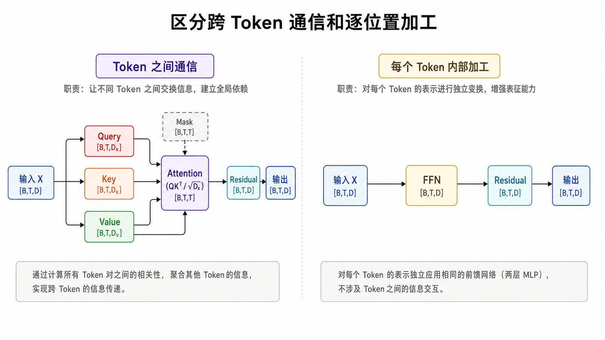
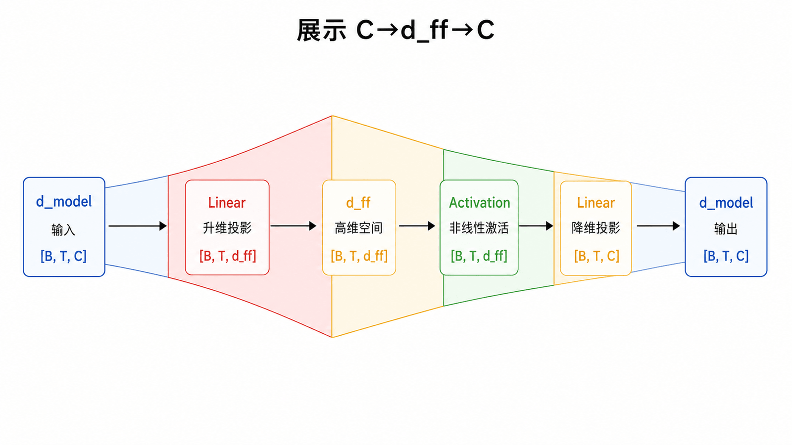
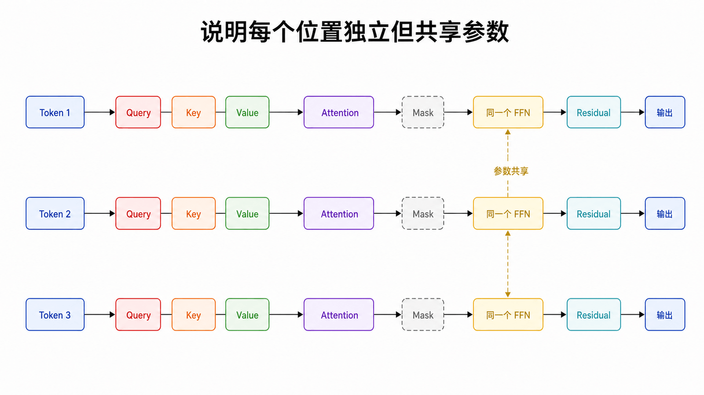
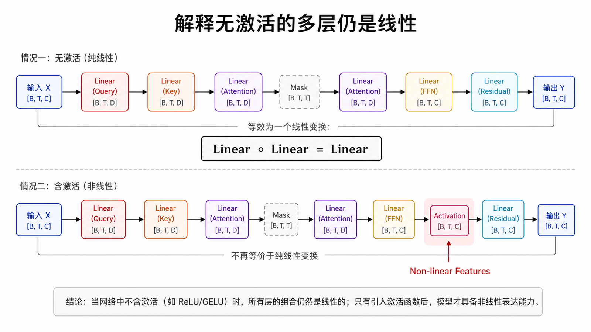
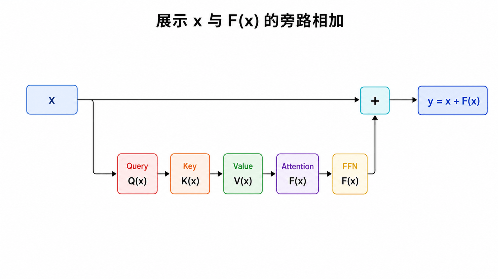
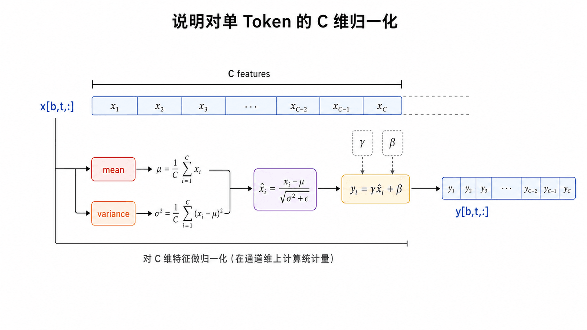
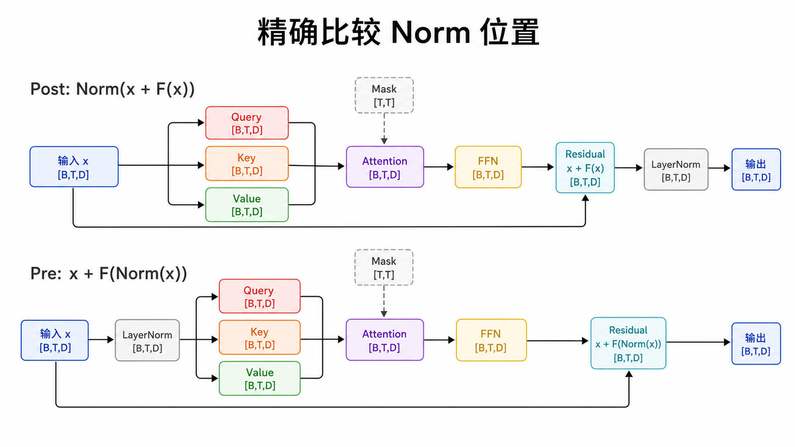
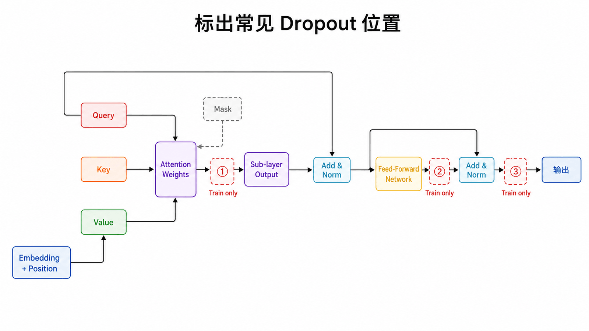
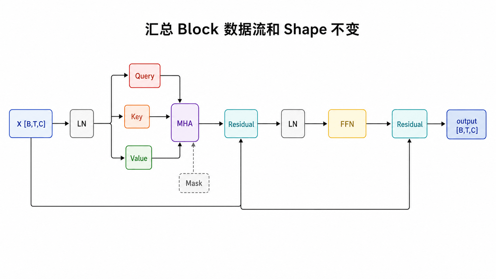

## 本篇要解决的问题

Attention 已让 Token 交换信息，为什么还需要 FFN？残差怎样保护信息和梯度？LayerNorm 到底沿哪个维度计算？

### 前置知识

读者应掌握 Multi-Head Attention 的输入输出都是 `[B,T,C]`，并知道残差相加要求两个张量 Shape 完全一致。

## 两种互补计算



Transformer Block 可以理解为交替执行两件事：

- Attention 在 Token 之间路由、混合信息；
- FFN 对每个 Token 的特征独立做相同非线性变换。

只有线性注意力混合不够；FFN 提供非线性特征变换，帮助模型在每个位置提取和组合刚刚收集到的信息。

## Position-wise FFN





原论文使用两层线性变换与 ReLU：

$$\operatorname{FFN}(x)=\max(0,xW_1+b_1)W_2+b_2$$

通常 `d_ff` 大于 `d_model`。现代模型可能使用 GELU、SwiGLU 等变体，但“逐位置、共享参数、先扩展再投回模型维”的主线仍常见。

### 为什么先扩维再压回去



若 FFN 只有一个从 `C` 到 `C` 的线性层，它仍然只是线性变换；多个线性层之间若没有激活函数，合并后也等价于一个线性层。扩展到更宽的隐藏空间并加入非线性，才能让每个 Token 学习更丰富的特征组合。

原论文 Base 配置使用 `d_model=512,d_ff=2048`，扩展倍率为 4。现代模型常调整倍率并使用门控 FFN，例如 SwiGLU。倍率越大通常容量越高，但 FFN 的参数量和计算量也近似按 `d_model·d_ff` 增长。

对输入 `[B,T,C]`，线性层把所有 `B×T` 个位置当作独立样本，只变换最后一维。FFN 内部不会让位置 1 直接读取位置 2。

## Residual：让子层学习增量



残差更新写成：

$$y=x+F(x)$$

它提供一条恒等路径，让原表示可以绕过子层直接传递；子层只需学习有用的修正。相加要求 `F(x)` 与 `x` 形状相同，这也是 Block 对外保持 `[B,T,C]` 的原因。

## LayerNorm：归一化单个 Token 的特征



LayerNorm 对最后一维 `C` 计算均值和方差：

$$\operatorname{LN}(x)=\gamma\frac{x-\mu}{\sqrt{\sigma^2+\epsilon}}+\beta$$

它不依赖同批其他样本，与 BatchNorm 的归一化对象不同，因此更适合变长序列和自回归模型。

## Post-Norm 与 Pre-Norm



原始论文采用接近 `Norm(x + F(x))` 的 Post-Norm；许多现代 GPT 实现使用 `x + F(Norm(x))` 的 Pre-Norm。

Pre-Norm 给残差主干提供更直接的梯度路径，常用于稳定较深网络。阅读架构图或代码时必须看 Norm 的位置，不能只看到“都有 LayerNorm”就认为相同。

### Dropout 放在哪里



原论文在注意力权重、子层输出和 Embedding/位置编码相加后使用 Dropout。它在训练时随机屏蔽部分激活以降低过拟合，推理时必须关闭。Dropout 不改变 Tensor Shape，但会让训练模式下两次相同输入的输出不同，因此单元测试应调用 `eval()` 或把概率设为 0。

## 完整 Pre-Norm Block



```python
def forward(self, x):
    x = x + self.attn(self.ln1(x))
    x = x + self.ffn(self.ln2(x))
    return x
```

完整 Shape 路径是：

```text
x                         [B,T,C]
ln1(x)                    [B,T,C]
attention(...)            [B,T,C]
x + attention             [B,T,C]
ln2(x)                    [B,T,C]
ffn: C → d_ff → C         [B,T,C]
x + ffn                   [B,T,C]
```

Dropout 可放在注意力权重、投影或 FFN 中作为正则化；推理时关闭。它不是 Block 的信息主线，所以图中没有让它喧宾夺主。

## 常见误区

- FFN 不在 Token 间通信，它对各位置独立应用。
- LayerNorm 通常沿特征维，不沿 Batch 维。
- Residual 不是简单“防止信息丢失”的保险丝，它也改变优化与函数参数化。
- Post-Norm 与 Pre-Norm 不能只靠层名判断，需看前向公式。

## 本篇自检

1. Attention 与 FFN 分别在哪个维度交换或加工信息？
2. 为什么两层线性层之间必须有非线性激活才有意义？
3. 为什么残差分支最后必须回到 `C` 维？

<details>
<summary>查看答案</summary>

1. Attention 在 Token 位置之间交换信息；FFN 独立加工每个位置的特征维。
2. 没有激活时多个线性层仍等价于一个线性层。
3. 因为要与残差主干 `[B,T,C]` 逐元素相加。

</details>

## 小结

Attention 交换位置间信息，FFN 在位置内非线性加工，Residual 保留主干，LayerNorm 稳定数值与优化。下一篇把这些积木放回原始 Transformer 的 Encoder 堆栈。

**下一篇：** [原始 Transformer Encoder](/posts/transformer-09-encoder/)

## 参考资料

- [Attention Is All You Need：Position-wise Feed-Forward Networks](https://arxiv.org/abs/1706.03762)
- [The Annotated Transformer：Encoder and Decoder Stacks](https://nlp.seas.harvard.edu/annotated-transformer/)
