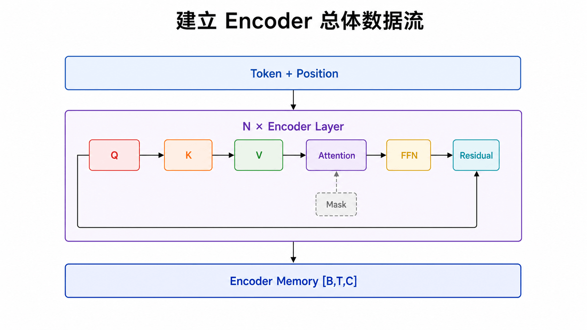
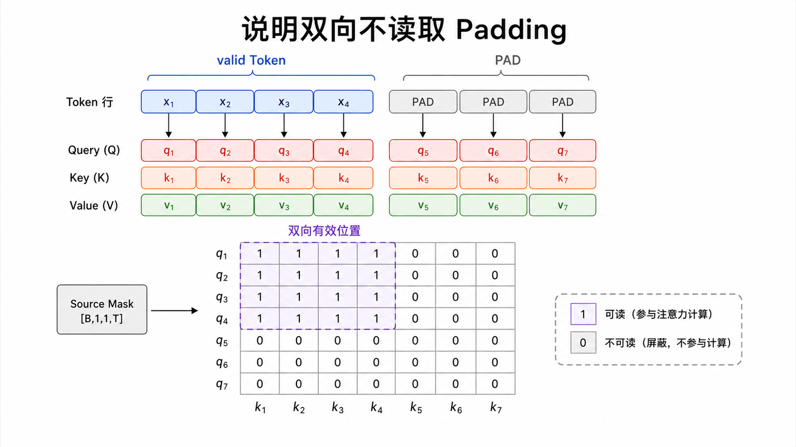
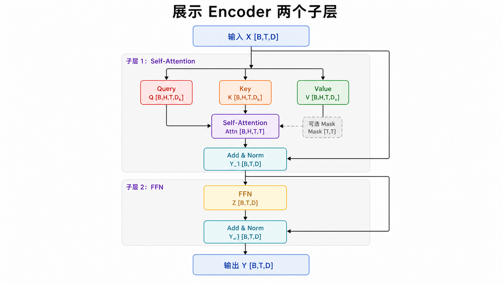
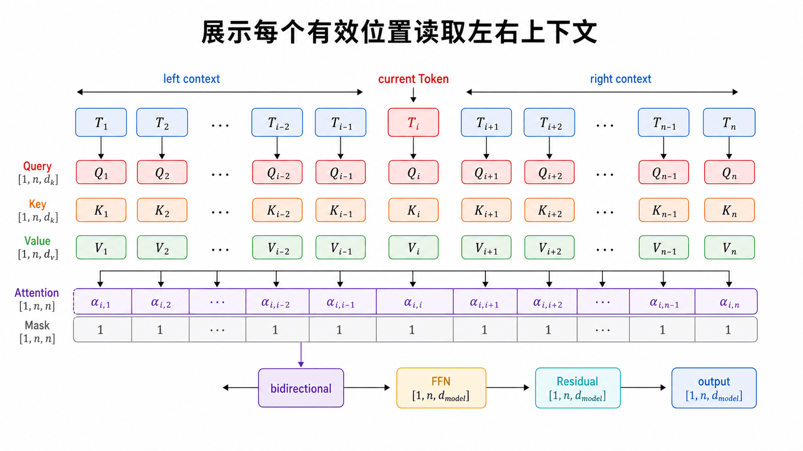
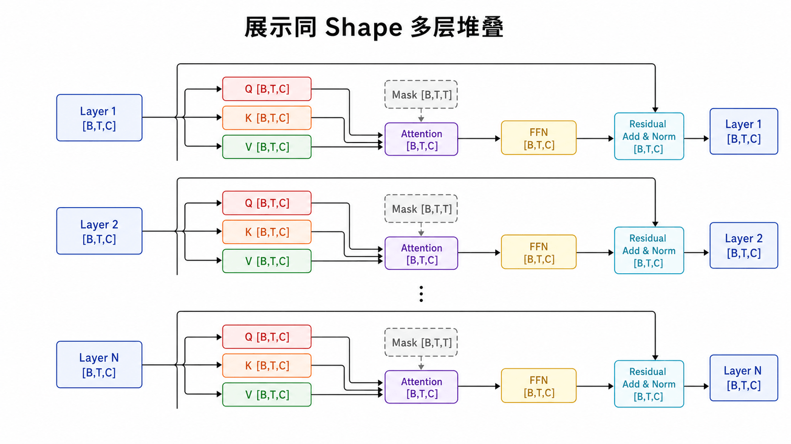
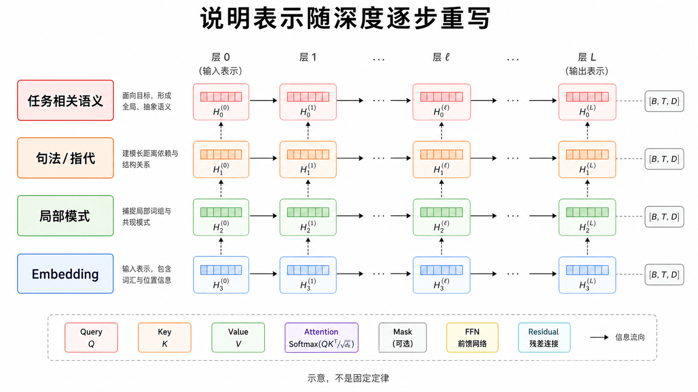
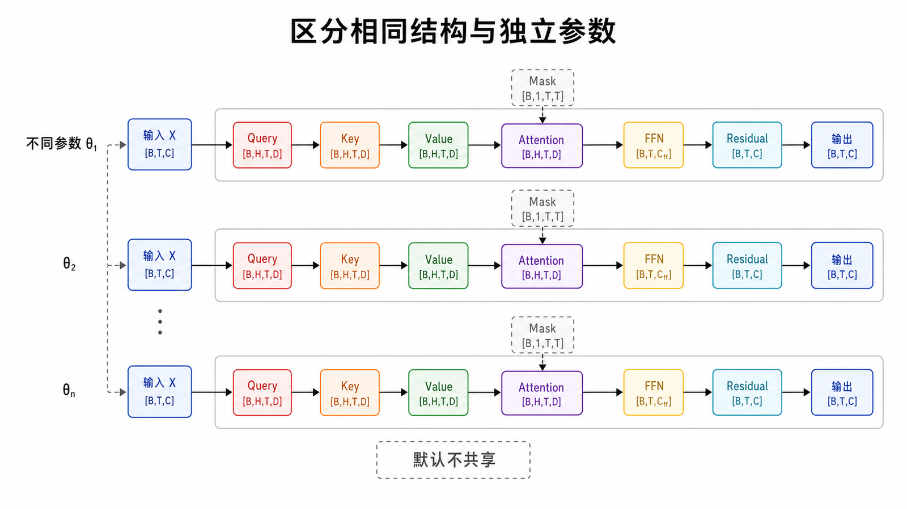
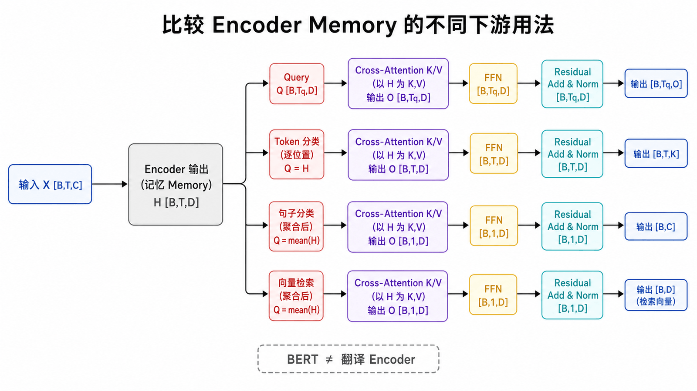

## 本篇要解决的问题

Encoder Layer 内部有哪些子层？“双向”具体意味着什么？相同 Layer 为什么能堆叠？Encoder 输出又提供给谁？

### 前置知识

读者应掌握 Multi-Head Attention、FFN、残差与 LayerNorm，并能区分 Causal Mask 和 Padding Mask。

## Encoder 的宏观数据流



源序列先变成 Token Embedding 并加入位置表示，再经过 `N` 个 Encoder Layer。输出仍为每个输入位置一个向量，合称 Encoder Memory。

原论文的 Base 模型堆叠 6 层，但“6”不是 Encoder 定义的一部分；不同模型可以选择不同深度、宽度与头数。

### Source Mask 约束什么



Encoder 通常不使用 Causal Mask，但 Batch 中的补齐位置仍需用 Source Padding Mask 屏蔽。若源 Token 有效标记为 `[B,T]`，它通常扩展到 `[B,1,1,T]`，使所有 Query 和 Head 都不能读取补齐 Key。双向注意力的含义是“可以读取全部有效位置”，不是“连 Padding 也要读取”。

## 放大一个 Encoder Layer



原论文每层包含两个子层：Multi-Head Self-Attention 和 Position-wise FFN，每个子层外都有残差、Dropout 与 LayerNorm。

用原论文的 Post-Norm 风格可概括为：

```text
x = Norm(x + Dropout(SelfAttention(x)))
x = Norm(x + Dropout(FFN(x)))
```

若改为 Pre-Norm，外部功能相同，但 Norm 移到子层输入处。描述具体模型时应明确是哪一种。

## Encoder 的 Self-Attention 是双向的



标准 Encoder 不用 Causal Mask；除 Padding 外，每个 Token 能读取左右所有位置。

这里的“双向”是可见范围，不代表有两个 RNN 方向。BERT 的核心堆栈就是此类双向 Encoder，因此适合需要整句上下文的表示任务；GPT 为保持生成因果性则不能这样读未来。

## 为什么能一层接一层





每层输入输出都是 `[B,T,C]`。Attention 与 FFN 内部可以改变临时维度，但输出投影和第二个 FFN 线性层会恢复 `C`，残差相加也要求外形一致。

深层堆叠让信息经历多轮路由与加工。我们常用“浅层更局部、深层更抽象”形成直觉，但不同任务、模型和训练状态会改变分工，不能把它当成每层固定职责表。

### 堆叠不等于参数共享



标准 Transformer 的各 Encoder Layer 结构相同，但参数彼此独立。第 1 层和第 6 层各有自己的 QKV、输出投影、FFN 与 LayerNorm 参数。只有明确采用循环层或 ALBERT 式共享设计时，多个深度位置才复用同一套参数。

## 输出是什么

Encoder 不直接输出翻译文本。它输出源序列的上下文表示：

在原始 Encoder–Decoder 中，Decoder 的 Cross-Attention 把这组向量作为 K、V；在 Encoder-only 模型中，可取特殊 Token、池化或逐位置输出接任务头。

### Encoder 与 BERT 的关系



BERT 使用双向 Transformer Encoder 堆栈，但它不是原始翻译 Encoder 的简单改名：BERT 改变了输入表示、预训练目标和任务接口。可以说 BERT 属于 Encoder-only 家族，却不能把“原始 Encoder 输出给翻译 Decoder”这条任务数据流直接套到 BERT 上。

| 场景                  | Encoder 输出的使用方式               |
| --------------------- | ------------------------------------ |
| 原始 Transformer 翻译 | 作为 Decoder Cross-Attention 的 K、V |
| Token 分类            | 每个位置接分类头                     |
| 句子分类              | 特殊位置或池化表示接分类头           |
| 向量检索              | 对序列表示池化后得到向量             |

## 最小 Encoder 伪代码

```python
class Encoder(nn.Module):
    def __init__(self, layer, n_layers, norm):
        super().__init__()
        self.layers = nn.ModuleList(copy.deepcopy(layer) for _ in range(n_layers))
        self.norm = norm

    def forward(self, x, src_mask=None):
        for layer in self.layers:
            x = layer(x, src_mask)
        return self.norm(x)
```

真实实现还需处理参数初始化、Padding Mask、Dropout 和深拷贝等细节。关键接口是：每层接收同 Shape 表示并返回同 Shape 表示。

## 常见误区

- Encoder 的“双向”不是双向 RNN。
- 每个 Encoder Layer 参数独立，不是同一层循环调用并共享权重（除非模型明确设计为共享）。
- Encoder 输出不是词表概率，而是上下文向量。
- GPT 没有这条 Encoder 堆栈。

## 本篇自检

1. Encoder 的“双向”为什么不等于双向 RNN？
2. 结构相同的 6 个 Encoder Layer 默认会共享参数吗？
3. Encoder Memory 在原始翻译模型中作为 Cross-Attention 的哪些张量？

<details>
<summary>查看答案</summary>

1. 它描述注意力可见范围，不包含两个方向的递归状态。
2. 不会，默认每层参数独立。
3. Key 和 Value。

</details>

## 小结

Encoder 用无因果遮罩的 Self-Attention 汇集全句信息，再用 FFN 逐位置加工；同形状接口让它可以堆叠。下一篇先还原原论文 Decoder，再删去 Encoder 与 Cross-Attention，得到 GPT 的 Decoder-only 架构。

**下一篇：** [从原始 Decoder 到 GPT](/posts/transformer-10-decoder-to-gpt/)

## 参考资料

- [Attention Is All You Need：Encoder and Decoder Stacks](https://arxiv.org/abs/1706.03762)
- [The Illustrated Transformer](https://jalammar.github.io/illustrated-transformer/)
- [The Annotated Transformer](https://nlp.seas.harvard.edu/annotated-transformer/)
