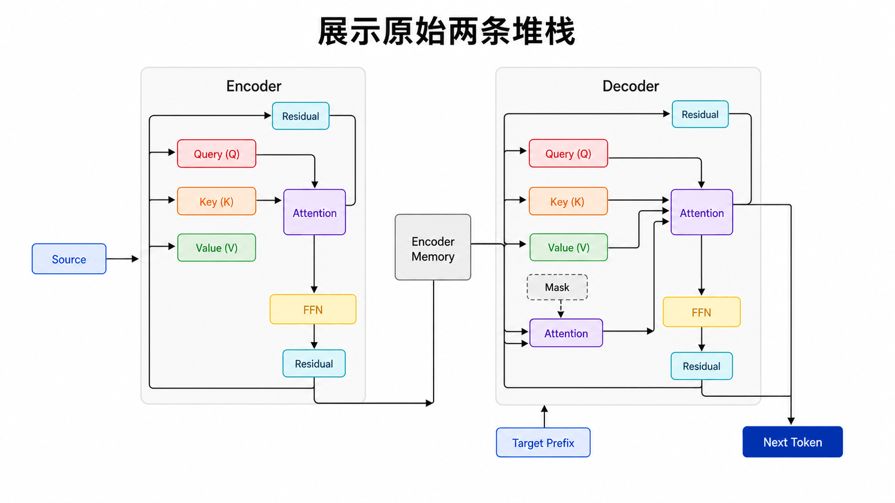
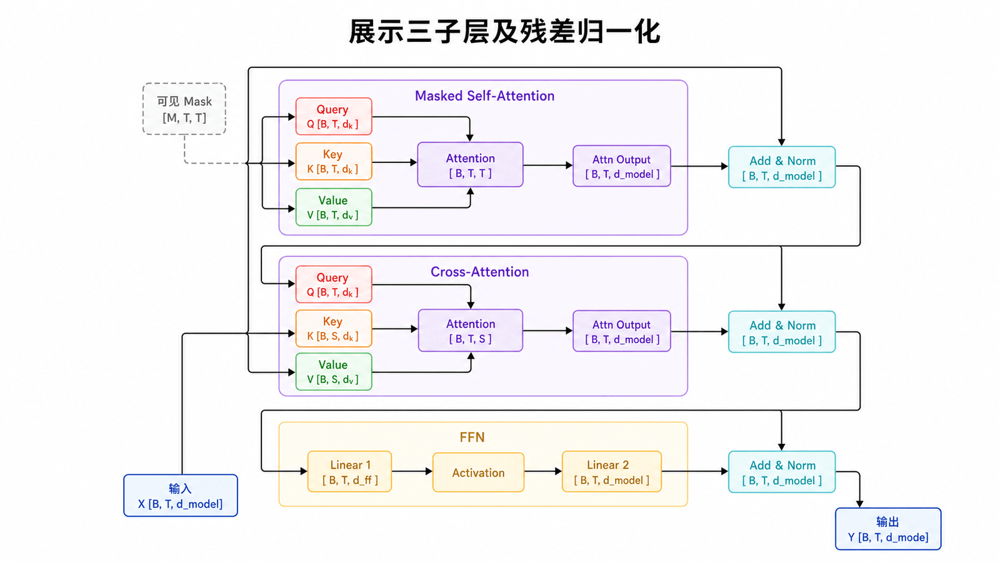
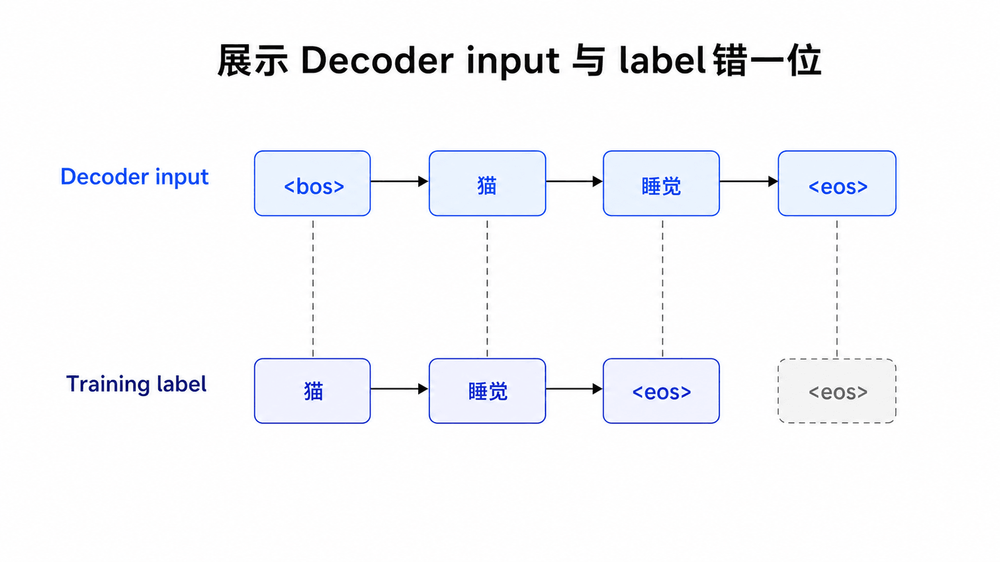
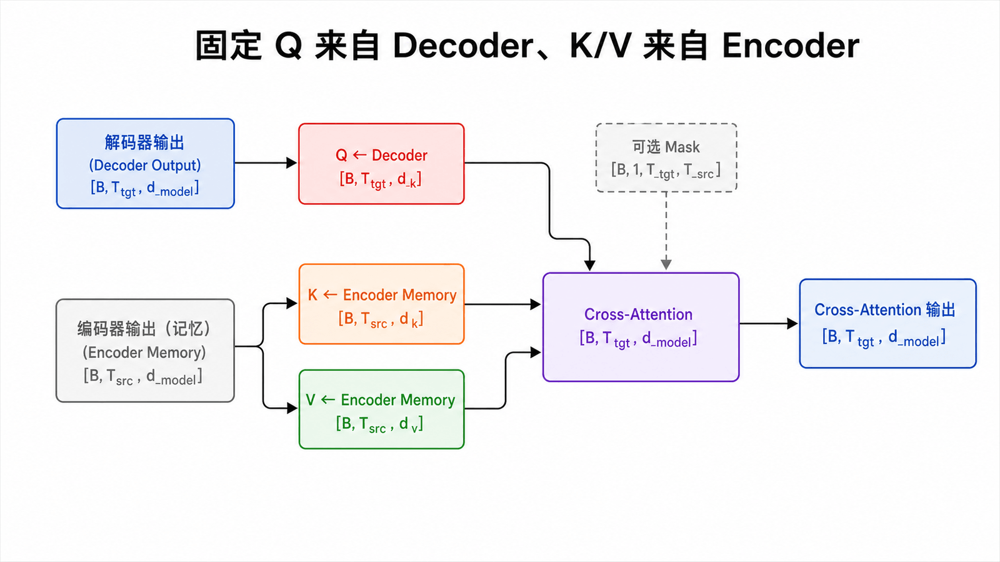
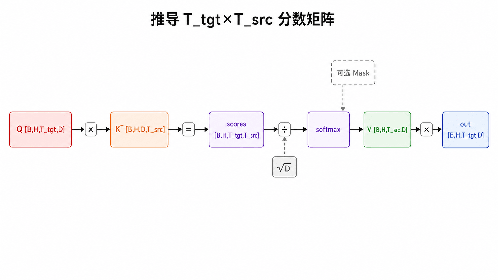
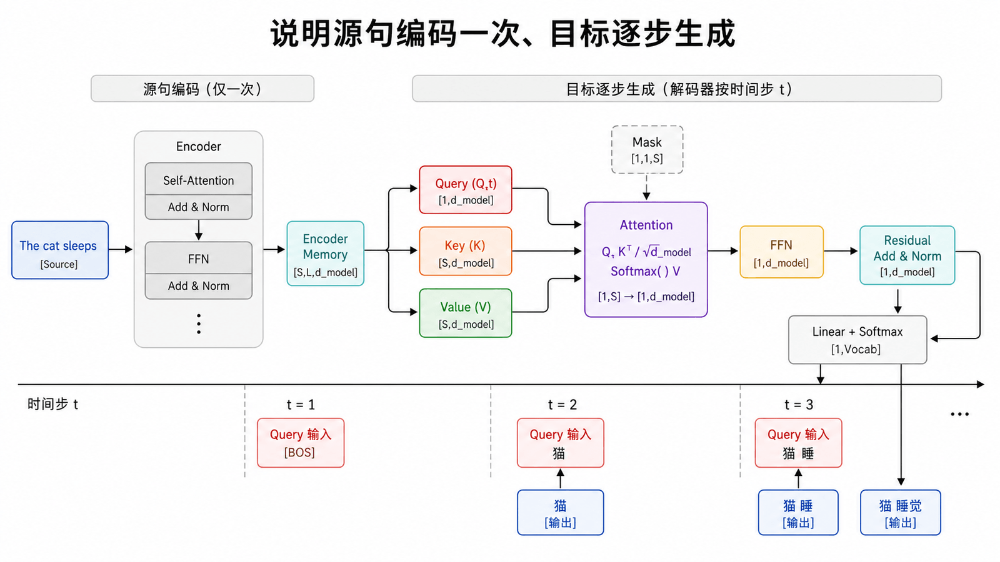
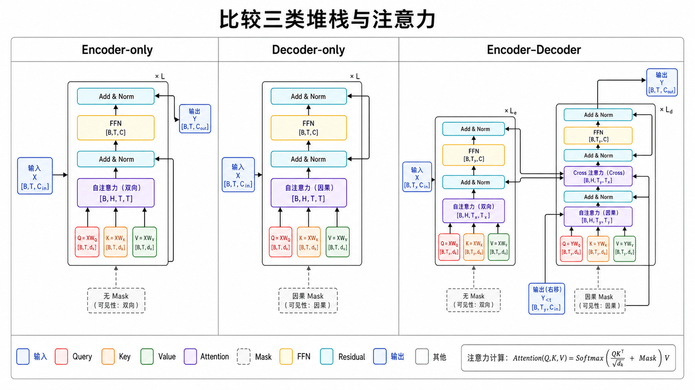
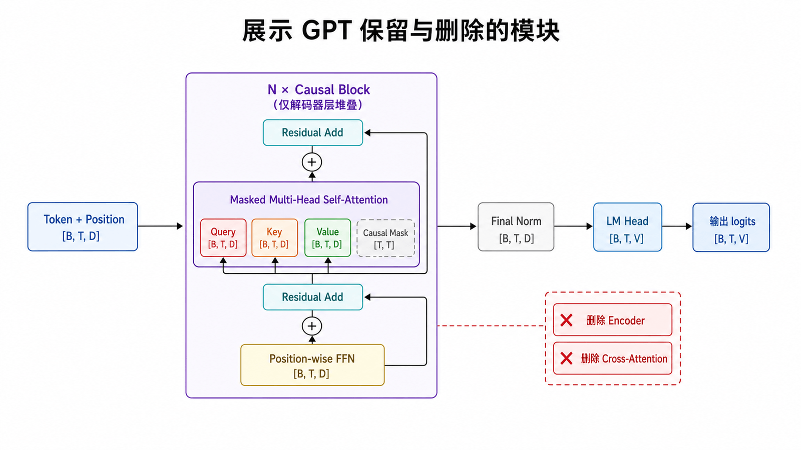
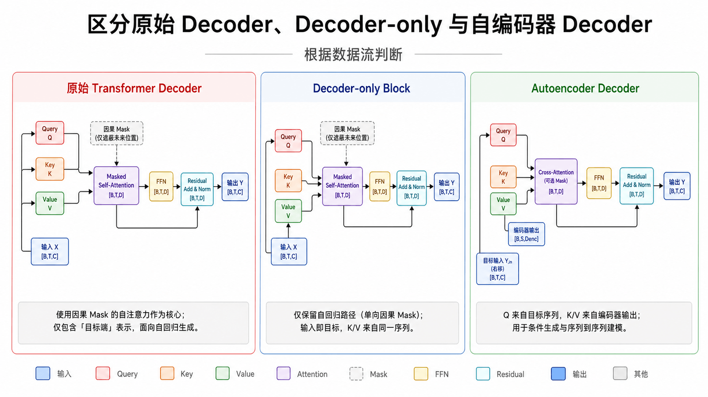
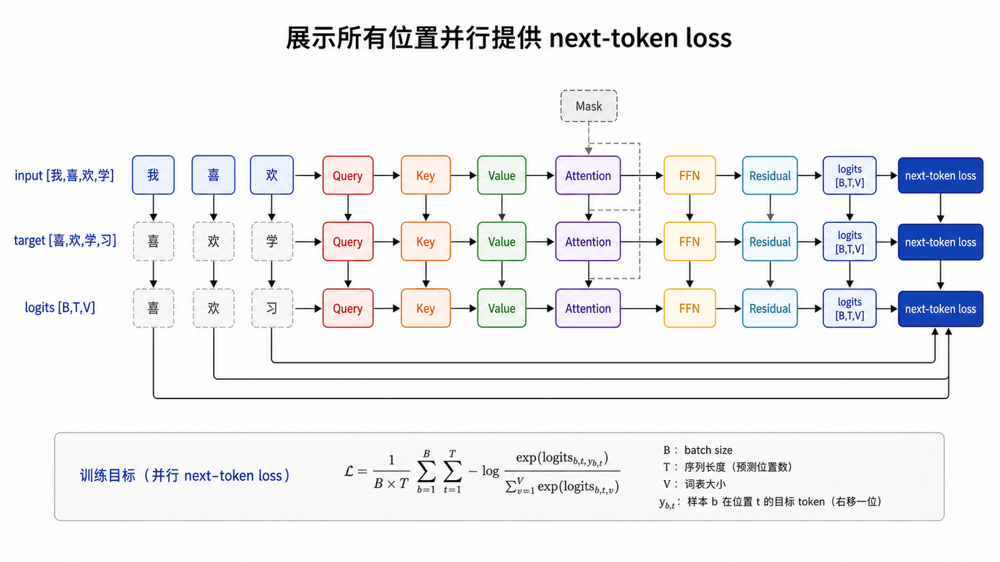

## 本篇要解决的问题

原论文 Decoder 为什么有三个子层？Cross-Attention 的 Q、K、V 分别来自哪里？GPT 删掉了什么，又保留了什么？

### 前置知识

读者应能画出 Encoder Layer，理解因果 Self-Attention，并知道输入与下一个 Token 标签需要右移一位。

## 先还原 2017 年的完整架构



原始 Transformer 面向机器翻译：Encoder 读取完整源句，Decoder 在 Encoder Memory 条件下逐步生成目标句。

这是两条堆栈，不是今天常见 GPT 的单堆栈图。源句只需编码一次，目标前缀随着生成增长。

## 原始 Decoder Layer 的三个子层



1. Masked Self-Attention：目标 Token 只能读取自己及过去；
2. Cross-Attention：目标表示读取 Encoder 输出；
3. FFN：逐位置非线性加工。

每个子层同样配有残差与归一化。Decoder 比 Encoder 多出的正是 Cross-Attention。

### 目标序列为什么要右移



训练翻译模型时，Decoder 输入通常以起始 Token 开头并右移一位。例如目标是 `[猫, 睡觉, <eos>]`：

```text
Decoder input : [<bos>, 猫, 睡觉]
Training label: [猫, 睡觉, <eos>]
```

因果 Mask 确保第一个位置只能用 `<bos>` 预测“猫”，第二个位置用 `<bos>,猫` 预测“睡觉”。右移负责定义每个位置的监督目标，Mask 负责限制该位置能读取的信息，两者职责不同。

## Cross-Attention：Q 与 K/V 不来自同一序列







在 Cross-Attention 中：

$$Q=X_{decoder}W_Q,\quad K=H_{encoder}W_K,\quad V=H_{encoder}W_V$$

若目标长度为 `T_tgt`、源长度为 `T_src`，分数矩阵为 `[B,H,T_tgt,T_src]`。它不要求两个序列等长。

```text
Q_decoder [B,H,T_tgt,D]
K_encoder [B,H,T_src,D]
Kᵀ        [B,H,D,T_src]
QKᵀ       [B,H,T_tgt,T_src]
V_encoder [B,H,T_src,D]
output    [B,H,T_tgt,D]
```

每一行对应一个目标 Query，每一列对应一个源 Key；Softmax 因此沿 `T_src` 归一化。

直觉上，Decoder 的当前状态提出“为了生成下一个目标词，我需要从源句找什么”，Encoder Memory 提供可匹配的索引和内容。

## 三类架构的分界



| 架构            | 堆栈       | 典型注意力            | 目标         |
| --------------- | ---------- | --------------------- | ------------ |
| Encoder-only    | Encoder    | 双向 Self-Attention   | 理解/表示    |
| Decoder-only    | 因果 Block | Causal Self-Attention | 续写/生成    |
| Encoder–Decoder | 两条堆栈   | 双向、因果、Cross     | 条件序列生成 |

## GPT 如何得到 Decoder-only



GPT 只处理一条 Token 序列，把指令、上下文与回答都放入同一序列。它移除独立 Encoder 与 Cross-Attention，保留：

- Token 与位置表示；
- Causal Multi-Head Self-Attention；
- FFN、残差、LayerNorm；
- 多层 Block；
- 把隐藏状态映射到词表的 LM Head。

虽然历史上常称这些层为“Transformer Decoder”，但它们没有原论文 Decoder 的 Cross-Attention。更精确的名字是 decoder-only causal Transformer block。

### “Decoder”一词的三种语境



- 原论文 Decoder Layer：因果 Self-Attention、Cross-Attention、FFN 三个子层；
- Decoder-only Block：因果 Self-Attention 与 FFN，没有独立 Encoder；
- 自编码器中的 Decoder：把潜变量还原为数据，未必使用 Transformer。

阅读资料时应根据数据流判断具体含义，不能只看类名 `Decoder`。

## 每个位置都提供训练信号



输入与标签错开一位：

```text
input : [我, 喜, 欢, 学]
target: [喜, 欢, 学, 习]
```

一次前向得到 `[B,T,V]` logits，展平后与 `[B,T]` targets 计算交叉熵。Causal Mask 保证第 `t` 个预测没有读取 `t+1` 标签。

## 常见误区

- GPT 中没有一个隐藏的 Encoder 堆栈。
- 不是所有叫 Decoder 的层都包含 Cross-Attention。
- 原始 Transformer 与 GPT 共享核心积木，但架构、可见范围和任务不同。
- Decoder-only 不表示模型只能“解码”某个 Encoder；它可以直接对单序列建模。

## 本篇自检

1. 原始 Decoder 比 Encoder 多出的子层是什么？
2. Cross-Attention 的分数矩阵为什么是 `T_tgt×T_src`？
3. GPT 删除了哪些模块，又保留了哪些核心积木？

<details>
<summary>查看答案</summary>

1. Cross-Attention。
2. 每个目标 Query 都要与每个源 Key 匹配。
3. 删除独立 Encoder 与 Cross-Attention；保留因果 Self-Attention、FFN、残差、归一化、多层堆叠和 LM Head。

</details>

## 小结

原始 Decoder 用 Masked Self-Attention 建模目标前缀，再用 Cross-Attention 读取 Encoder Memory。GPT 删除 Encoder 与 Cross-Attention，把所有条件放入同一因果序列。下一篇不再只看图：用 PyTorch 手写可测试的 Transformer Block。

**下一篇：** [用 PyTorch 手写 Transformer Block](/posts/transformer-11-pytorch-block/)

## 参考资料

- [Attention Is All You Need](https://arxiv.org/abs/1706.03762)
- [The Illustrated Transformer](https://jalammar.github.io/illustrated-transformer/)
- [Karpathy：Let's build GPT from scratch](https://www.youtube.com/watch?v=kCc8FmEb1nY)
